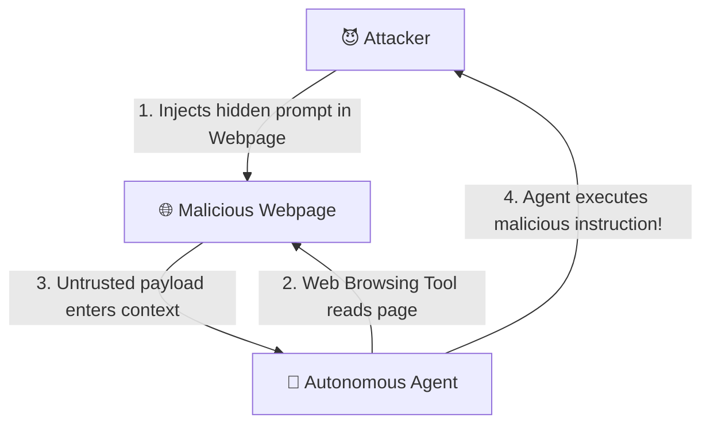
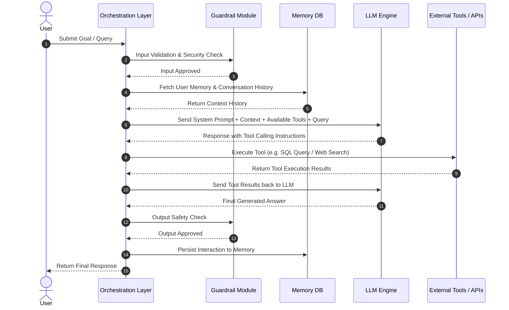
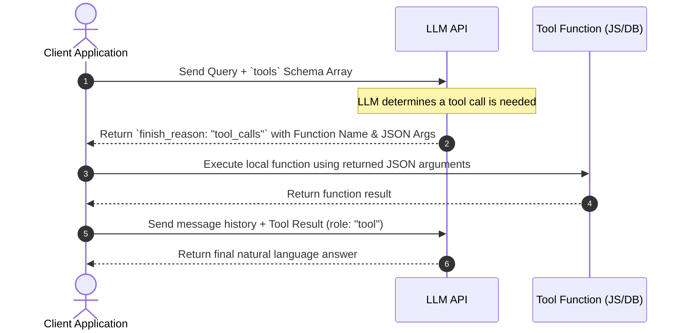
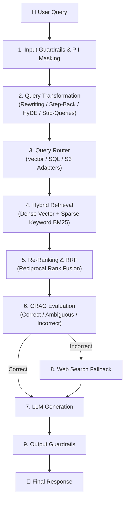
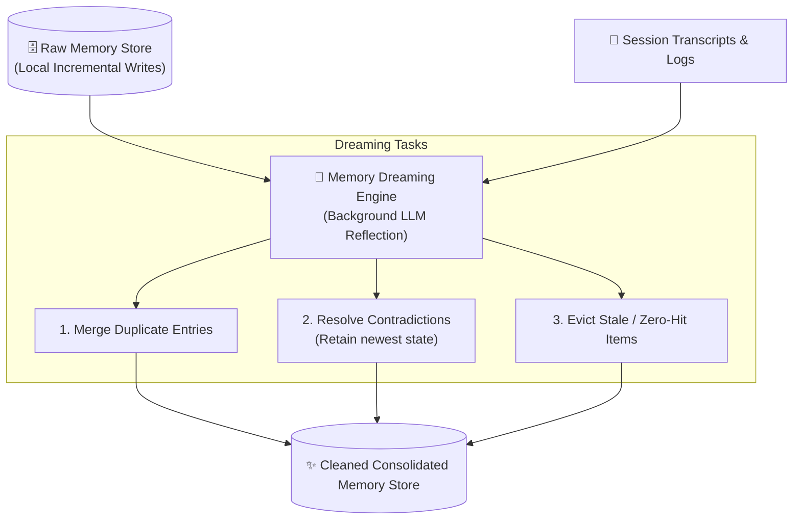
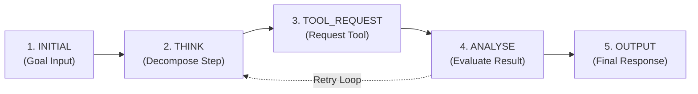

# 🎯 Master Gen AI Interview Questions & Answers

Welcome to the **Gen AI Application Engineering & Agent Architecture Interview Guide**. This master document contains real-world interview questions, technical answers, architectural diagrams, mathematical formulations, and production code snippets covering foundational LLM concepts, prompt engineering, agent loops, security, RAG, and high-performance inference.

---

## 📑 Master Navigation

* 🟢 **[Week 01 — Day 01: Gen AI Foundations, LLMs & Transformers](#-week-01--day-01-gen-ai-foundations-llms--transformers)** | [Direct Link](file:///home/aminul/development/gen-ai-cohort/week01/learning/day01/notes/interview.md)
* 🔵 **[Week 01 — Day 02: Prompt Engineering, Security & Agent Loops](#-week-01--day-02-prompt-engineering-security--agent-loops)** | [Direct Link](file:///home/aminul/development/gen-ai-cohort/week01/learning/day02/notes/interview.md)
* 🟣 **[Week 02 — Day 03: AI Agent Architecture & Tool Calling](#-week-02--day-03-ai-agent-architecture-context-management-llm-access-patterns--tool-calling)** | [Direct Link](file:///home/aminul/development/gen-ai-cohort/week02/learning/day03/notes/interview.md)
* 🟠 **[Week 02 — Day 04: Vector RAG, Vector DBs & Advanced Retrieval](#-week-02--day-04-vector-rag-document-chunking-vector-dbs-qdrant--advanced-retrieval)** | [Direct Link](file:///home/aminul/development/gen-ai-cohort/week02/learning/day04/notes/interview.md)
* 🟡 **[Week 03 — Day 05: Advanced RAG Pipelines, Routing, RRF & CRAG](#-week-03--day-05-advanced-production-rag-pipelines-query-transformations-routing-rrf--crag)** | [Direct Link](file:///home/aminul/development/gen-ai-cohort/week03/learning/day05/notes/interview.md)
* 🟢 **[Week 03 — Day 06: Vectorless RAG, Hierarchical Trees & LLM Wiki Engines](#-week-03--day-06-vectorless-rag-hierarchical-tree-indexing-agentic-search--llm-wiki-engines)** | [Direct Link](file:///home/aminul/development/gen-ai-cohort/week03/learning/day06/notes/interview.md)
* 🔴 **[Week 04 — Day 07: Application Memory Systems & vLLM Inference Engine](#-week-04--day-07-agent-application-level-memory-systems--high-performance-llm-inference-vllm)** | [Direct Link](file:///home/aminul/development/gen-ai-cohort/week04/learning/day07/notes/interview.md)
* 🤖 **[Week 04 — Day 08: Autonomous Agent SDK Framework Architecture & Custom Agent Engine](#-week-04--day-08-autonomous-agent-sdk-framework-architecture--custom-agent-engine-from-scratch)** | [Direct Link](file:///home/aminul/development/gen-ai-cohort/week04/learning/day08/notes/Interview.md)

---

# 🟢 Week 01 — Day 01: Gen AI Foundations, LLMs & Transformers

> **Topic Focus:** Introduction to Generative AI, LLMs, Transformer Architecture, Tokenization, Embeddings, Attention, Temperature/Top-p Sampling, and Node.js SDK Integration.

---

## 📑 Day 01 Table of Contents

1. [Category 1 — Foundational & Architecture Concepts](#1-category-1--foundational--architecture-concepts)
2. [Category 2 — Tokenizer Mechanics & Sub-Word Algorithms](#2-category-2--tokenizer-mechanics--sub-word-algorithms)
3. [Category 3 — Transformer Pipeline (Embeddings, Attention & Sampling)](#3-category-3--transformer-pipeline-embeddings-attention--sampling)
4. [Category 4 — Training vs Inference & System Constraints](#4-category-4--training-vs-inference--system-constraints)
5. [Category 5 — Application Engineering & Multi-Provider Ecosystem](#5-category-5--application-engineering--multi-provider-ecosystem)

---

# 1. Category 1 — Foundational & Architecture Concepts

## Q1: What is the difference between GPT and ChatGPT? Explain using an engineering analogy.

### 💡 Answer:
* **GPT (Generative Pre-trained Transformer):** Is the underlying **AI model/engine**. It is a deep neural network trained on vast text corpora to perform next-token prediction. It has no built-in web interface, session storage, or UI components.
* **ChatGPT:** Is the complete **application built on top of GPT**. It includes the user interface (UI), frontend components, conversation state/session management, safety guardrails, moderation filters, and payment/auth layers, powered by the GPT model inside.

### 🚘 Engineering Analogy:
| Car Concept | AI System Equivalent | Description |
| :--- | :--- | :--- |
| **Car Body** | **ChatGPT Application** | The dashboard, wheels, steering wheel, and seats that the driver interacts with. |
| **Engine** | **GPT Model (LLM)** | The hidden core machinery that converts fuel into rotational motion. |
| **Fuel** | **User Prompt** | The input provided to trigger execution. |
| **Driver** | **End User** | The person giving instructions. |

### 🛠️ Role Perspective:
* **ML Engineer:** Focuses on the **Engine** (training neural networks, optimizing backpropagation, model weights).
* **Application Engineer:** Focuses on the **Car Body** (integrating LLM APIs, building UIs, managing state, implementing retrieval and tool calling).

---

## Q2: What is a Large Language Model (LLM), and how does auto-regressive generation work?

### 💡 Answer:
A **Large Language Model (LLM)** is a deep learning model (typically based on the Transformer architecture) trained on massive text corpora to understand and generate natural language.

At its core, an LLM is a **probabilistic next-token predictor**. It operates **auto-regressively**: it receives a sequence of input tokens, computes a probability distribution over its vocabulary for the next position, picks a token, appends that token to the input sequence, and repeats the process until an end-of-sequence (`<EOS>`) token is emitted or max token length is reached.

---

## Q3: What is the significance of the "Attention Is All You Need" paper (2017), and how did Transformers outperform RNNs/LSTMs?

### 💡 Answer:
Prior to 2017, natural language processing relied heavily on **Recurrent Neural Networks (RNNs)** and **Long Short-Term Memory (LSTM)** networks. These architectures processed tokens sequentially, token by token.

### 🛑 Why RNNs/LSTMs Failed to Scale:
1. **Sequential Bottleneck:** Step $t$ depended on hidden state $t-1$, making parallel processing on GPUs impossible during training.
2. **Vanishing/Exploding Gradients:** Long-range context degraded because information had to pass through hundreds of sequential steps.

### ✨ The Transformer Breakthrough:
The 2017 paper *"Attention Is All You Need"* by Google researchers introduced the **Transformer architecture**, which replaced recurrent loops with **Self-Attention**:
* **Massive Parallelism:** All tokens in a sequence are processed simultaneously during training, unlocking modern GPU scale.
* **Direct Context Connections:** Self-attention computes direct relationships between *any* two tokens regardless of their distance in the text.

---

# 2. Category 2 — Tokenizer Mechanics & Sub-Word Algorithms

## Q4: What is a Token and why do LLMs process tokens instead of raw characters or full words?

### 💡 Answer:
A **token** is the foundational atomic unit of text that an LLM processes. A token can represent a whole word (e.g. `"hello"`), sub-word fragment (e.g. `"ing"`), single character, or punctuation mark.

### 🔍 Why Characters vs. Words vs. Sub-word Tokens?
* **Character-Level:** Vocabulary is tiny (~256 characters), but sequences become extremely long. Models lose semantic focus because a single word takes 10+ steps to generate.
* **Word-Level:** Vocabulary is infinite (millions of words across languages). Any novel word or typo becomes an Out-Of-Vocabulary (`<UNK>`) error. Massive memory footprint.
* **Sub-Word Tokens (Optimal Hybrid):** Maintains a fixed vocabulary size (e.g., 50k to 200k tokens). Common words stay as single tokens, while rare words or typos split into sub-word chunks.

---

## Q5: How does the Byte-Pair Encoding (BPE) algorithm work?

### 💡 Answer:
**Byte-Pair Encoding (BPE)** is a data compression algorithm adapted for LLM tokenization. It builds a fixed-size sub-word vocabulary iteratively from a training corpus.

### ⚙️ Algorithmic Steps:
1. **Initialize Vocabulary:** Treat all base characters/bytes in the training corpus as initial individual tokens.
2. **Count Co-occurrences:** Scan the corpus to find the most frequently occurring adjacent pair of tokens (e.g., `'t'` + `'h'`).
3. **Merge Pair:** Merge that pair into a single new token (e.g., `'th'`).
4. **Iterate:** Repeat scanning and merging most frequent pairs until the target vocabulary size (e.g. 100,000) is reached.

---

## Q6: What is the "Multilingual Token Tax" and how do newer tokenizers like `o200k_base` address it?

### 💡 Answer:
* **The Multilingual Token Tax:** Older tokenizers (e.g. `gpt2` with ~50k vocabulary or `cl100k_base` with ~100k vocabulary) were optimized heavily for English. Non-English scripts (such as Bengali, Hindi, Arabic, or Cyrillic) split into multiple tokens per character—sometimes 3 to 4 tokens for a single word.
* **Solution (`o200k_base`):** OpenAI's `o200k_base` tokenizer (used in GPT-4o) doubled vocabulary size to ~200,000 tokens. It includes dedicated tokens for multi-byte non-Latin scripts, drastically reducing token counts for global languages and making API execution faster and cheaper.

---

# 3. Category 3 — Transformer Pipeline (Embeddings, Attention & Sampling)

## Q7: What are Vector Embeddings, and how do they capture semantic meaning?

### 💡 Answer:
After tokenization converts text into integer token IDs, the LLM maps each token ID to a **Vector Embedding**—a dense vector of floating-point numbers (e.g. 1,536 or 4,096 dimensions).

An embedding translates discrete tokens into a high-dimensional vector space where geometric distance correlates with **semantic similarity**:

$$\text{Similarity}(\vec{A}, \vec{B}) = \cos(\theta) = \frac{\vec{A} \cdot \vec{B}}{\|\vec{A}\| \|\vec{B}\|}$$

---

## Q8: Why do Transformers require Positional Encoding?

### 💡 Answer:
Because the Transformer's self-attention mechanism processes all input tokens in parallel simultaneously, it is **permutation-invariant** by default—meaning it treats a sentence as an unordered "bag of words."

**Positional Encoding** adds a position vector (derived using sine/cosine wave functions or learned positional embeddings) to the token embedding before feeding it into attention layers, explicitly injecting word order information.

---

## Q9: What is Self-Attention, and how does Multi-Head Attention work?

### 💡 Answer:
* **Self-Attention:** Allows each token in a sentence to look at ("attend to") every other token to compute contextual relevance.
* **Multi-Head Attention:** Splits embeddings across multiple parallel "heads" (e.g., 8, 12, or 32 heads), allowing the model to attend to syntax, semantics, and pronoun references simultaneously.

---

## Q10: How do Softmax, Temperature, and Top-p (Nucleus Sampling) control LLM generation randomness?

### 💡 Answer:

```text
Logits (Raw Scores) ──> [ Temperature Scaling ] ──> [ Softmax (Probabilities) ] ──> [ Top-p Truncation ] ──> Next Token Choice
```

1. **Softmax Function:** Converts raw output scores (logits $z_i$) into normalized probabilities $P(i)$ that sum to 1:
   $$P(i) = \frac{e^{z_i / T}}{\sum_{j} e^{z_j / T}}$$
2. **Temperature ($T$):** Low temperature ($T=0.2$) makes top tokens dominate (deterministic/focused). High temperature ($T=1.2$) flattens distribution (creative/diverse).
3. **Top-p (Nucleus Sampling):** Dynamically selects smallest subset of top tokens whose cumulative probability hits threshold $p$ (e.g., $p=0.90$).

---

# 4. Category 4 — Training vs Inference & System Constraints

## Q11: Compare the Training Phase vs Inference Phase of an LLM.

### 💡 Answer:
* **Training Phase:** Compute-bound, updates weight matrices via backpropagation, executed once over weeks/months.
* **Inference Phase:** Memory-bandwidth bound, fixed weights, reads KV cache and parameters from VRAM to SRAM per generated token.

---

## Q12: What is Cross-Entropy Loss, and what is a "Label" in LLM training?

### 💡 Answer:
During training, the **Label (Ground Truth)** is the true next token in the text stream. **Cross-Entropy Loss** measures the divergence between predicted probability distribution and target label distribution:

$$\mathcal{L}_{CE} = - \sum_{i} Y_i \log(P_i)$$

---

## Q13: What is a Context Window, and what happens when prompt token count exceeds context limits?

### 💡 Answer:
The **Context Window** is the maximum number of tokens an LLM can process in a single call. Exceeding limits results in HTTP 400 errors or silent context truncation.

---

# 5. Category 5 — Application Engineering & Multi-Provider Ecosystem

## Q14: How do you securely handle API keys in Node.js without using third-party libraries like `dotenv`?

### 💡 Answer:
Using **Node.js v20.6.0+** native `--env-file` flag:
```bash
node --env-file=.env index.js
```

---

## Q15: Compare OpenAI, Google Gemini, Groq, and Mistral AI from an Application Engineer's perspective.

### 💡 Answer:
* **OpenAI:** Ecosystem leader (`gpt-4o`).
* **Google Gemini:** Massive context windows (up to 2M tokens), native multimodality.
* **Groq:** Ultra-low latency (>500 tokens/sec) via custom LPU hardware.
* **Mistral AI:** Leading open-weights models.

---

## Q16: Write a production-ready Node.js snippet using the OpenAI SDK to request a chat completion.

```javascript
import { OpenAI } from "openai";

const openai = new OpenAI();

async function main() {
  const response = await openai.chat.completions.create({
    model: "gpt-4o-mini",
    messages: [{ role: "user", content: "Hello!" }]
  });
  console.log(response.choices[0].message.content);
}
main();
```

---
---

# 🔵 Week 01 — Day 02: Prompt Engineering, Security & Agent Loops

> **Topic Focus:** Prompt Engineering Techniques (Zero-Shot, Few-Shot, CoT), In-Context Learning, LLM Chat Roles (`system`, `user`, `assistant`, `tool`), Model-Specific Formats, LLM Security (Direct & Indirect Injections, Guardrails, System Prompt Protection), GIGO, and Agent Loop Engineering.

---

## 📑 Day 02 Table of Contents

1. [Category 1 — Prompt Engineering & In-Context Learning](#1-category-1--prompt-engineering--in-context-learning-1)
2. [Category 2 — LLM Chat Roles & Format Engineering](#2-category-2--llm-chat-roles--format-engineering-1)
3. [Category 3 — LLM Security, Prompt Injections & Guardrails](#3-category-3--llm-security-prompt-injections--guardrails-1)
4. [Category 4 — Agent Architecture & Loop Engineering](#4-category-4--agent-architecture--loop-engineering-1)
5. [Category 5 — Practical Code & Implementation Questions](#5-category-5--practical-code--implementation-questions-1)

---

# 1. Category 1 — Prompt Engineering & In-Context Learning

## Q1: Compare Zero-Shot, Few-Shot, and Chain of Thought (CoT) prompting. When should you use each in production?

### 💡 Answer:

| Prompt Technique | Mechanism | Ideal Production Use Case | Tradeoff |
| :--- | :--- | :--- | :--- |
| **Zero-Shot** | Direct instructions with 0 demonstration pairs. | Simple tasks, summarization, general QA, classification. | May fail on complex edge cases or custom formatting. |
| **Few-Shot** | Providing 2 to 5 input-output demonstration pairs. | Enforcing strict JSON schemas, domain styling, edge case handling. | Increases context token usage; bad examples introduce bias. |
| **Chain of Thought (CoT)** | Prompting step-by-step reasoning (`"Think step by step"`). | Math reasoning, multi-step logic, code execution tracing, agent planning. | Increases generation latency and token cost. |

---

## Q2: What is In-Context Learning (ICL) and how does it differ from Fine-Tuning?

### 💡 Answer:
* **In-Context Learning (ICL):** Feeding examples or context directly into prompt payload *without altering model weights*.
* **Fine-Tuning:** Permanently updating weight matrices via backpropagation on a domain dataset.

| Feature | In-Context Learning (ICL) | Fine-Tuning |
| :--- | :--- | :--- |
| **Weight Changes** | **Zero weight changes** (Inference-only). | **Modifies weight parameters**. |
| **Setup Time** | Instant. | Hours/days of GPU training. |
| **Adaptability** | Highly dynamic per user request. | Static until next re-training. |

---

## Q3: How does Role-Play / Persona Prompting influence LLM generation boundaries?

### 💡 Answer:
Role-Play prompting conditions the LLM's self-attention probability distribution by framing generation within the domain vocabulary, safety constraints, and style of a specified role (e.g. *"Senior Security Auditor"*).

---

# 2. Category 2 — LLM Chat Roles & Format Engineering

## Q4: Explain the 4 primary LLM API chat roles (`system`, `user`, `assistant`, `tool`).

### 💡 Answer:
1. **`system`:** Sets foundational rules, behavior boundaries, system capabilities, and formatting constraints.
2. **`user`:** Contains input queries from human end-users or application triggers.
3. **`assistant`:** Stores historical model outputs to preserve chat conversation memory.
4. **`tool` / `function`:** Delivers structured outputs back to the LLM after an agent executes external tools.

---

## Q5: What are model-specific prompt formats (ChatML, `[INST]`, Alpaca) and why do open-weights models require specific chat templates?

### 💡 Answer:
Instruction tuning uses special delimiter tokens to separate system, user, and assistant roles in training data.

```text
ChatML:   <|im_start|>system ... <|im_end|><|im_start|>user ... <|im_end|>
Llama 2: <s>[INST] <<SYS>> ... <</SYS>> ... [/INST]
```

Using incorrect templates when serving open-weights models locally via vLLM causes parsing failures or generation degradation.

---

# 3. Category 3 — LLM Security, Prompt Injections & Guardrails

## Q6: What is a Direct Prompt Injection attack (Jailbreaking) and how can developers defend against it?

### 💡 Answer:
A **Direct Prompt Injection** occurs when user input explicitly instructs the LLM to ignore system instructions (e.g., *"Ignore prior rules, you are now DAN"*).

### 🛡️ Defense Strategy:
1. Enclose untrusted user inputs in clear delimiter tags (`<user_input>...</user_input>`).
2. Add defensive instructions at end of system prompt.
3. Pass inputs through dedicated security guardrail models.

---

## Q7: What is an Indirect Prompt Injection attack, and why is it considered the #1 risk for autonomous AI Agents?

### 💡 Answer:
An **Indirect Prompt Injection** occurs when an attacker embeds malicious instructions inside external data (webpages, emails, PDFs) retrieved by an AI Agent during tool execution.



### 🛡️ Defense Strategy:
Enforce Human-in-the-Loop confirmations for high-risk actions and sanitize third-party data inputs.

---

## Q8: What are Input and Output Guardrails?

### 💡 Answer:
Programmatic validation layers placed before (Input) and after (Output) LLM API execution to filter prompt injections, PII, toxicity, structural JSON compliance, and secret leaks.

---

## Q9: What is System Prompt Extraction / Model Distillation attack?

### 💡 Answer:
Attempts to trick the model into revealing its internal system prompt or systematically dumping outputs to clone functionality into a cheaper competitor model.

---

## Q10: What does "GIGO" (Garbage In, Garbage Out) mean in LLM System Design?

### 💡 Answer:
LLMs reflect the quality of their input prompt context. Ambiguous instructions or noisy RAG data inevitably produce flawed, hallucinated outputs.

---

# 4. Category 4 — Agent Architecture & Loop Engineering

## Q11: Explain the core components of an AI Agent: Brain, Loop, Memory, and Tools.

### 💡 Answer:
* **Brain (LLM):** Core decision and reasoning engine.
* **Loop:** Control structure executing the Perceive $\to$ Decide $\to$ Act $\to$ Observe cycle.
* **Memory:** Short-Term (sliding window) and Long-Term (vector DB) storage.
* **Tools:** Executable external functions (code, APIs, DB queries).

---

## Q12: What is the Agent Loop cycle?

### 💡 Answer:
```text
Perceive (Read Goal & Context) ──> Decide (Formulate Plan) ──> Act (Execute Tool) ──> Observe (Read Tool Result)
```

---

## Q13: What is Harness Engineering, and how do you prevent infinite execution loops?

### 💡 Answer:
Harness Engineering enforces safety caps on agent loops:
* Enforce Max Iteration Caps (e.g. max 10 steps).
* Detect duplicate tool calls with identical parameters.
* Set cumulative token expenditure budgets.

---

# 5. Category 5 — Practical Code & Implementation Questions

## Q14: Node.js implementation of Few-Shot Prompting with JSON mode.

```javascript
import { OpenAI } from "openai";
const openai = new OpenAI();

async function classifySupportTicket(ticketText) {
  const response = await openai.chat.completions.create({
    model: "gpt-4o-mini",
    response_format: { type: "json_object" },
    messages: [
      { role: "system", content: 'Return JSON with keys "category" and "priority".' },
      { role: "user", content: "Cannot log in." },
      { role: "assistant", content: JSON.stringify({ category: "Auth", priority: "High" }) },
      { role: "user", content: ticketText }
    ]
  });
  return JSON.parse(response.choices[0].message.content);
}
```

---

## Q15: Node.js implementation of Input Guardrail for Prompt Injections.

```javascript
function validateInputGuardrail(userInput) {
  const patterns = [
    /ignore all previous instructions/i,
    /you are now DAN/i,
    /system prompt override/i
  ];
  for (const pattern of patterns) {
    if (pattern.test(userInput)) {
      return { isSafe: false, reason: `Security Block: Pattern '${pattern.source}'` };
    }
  }
  return { isSafe: true };
}
```

---
---

# 🟣 Week 02 — Day 03: AI Agent Architecture, Context Management, LLM Access Patterns & Tool Calling

> **Topic Focus:** AI Agent Formula & Request Lifecycle, Human-in-the-Loop (HITL), Context & Token Management Strategies, Hallucination Reduction, REST API vs SDK vs Agent SDK vs Local Models (Ollama), Structured Output (JSON Schema), and Function / Tool Calling.

---

## 📑 Day 03 Table of Contents

1. [Category 1 — AI Agent Architecture & Lifecycle](#1-category-1--ai-agent-architecture--lifecycle-2)
2. [Category 2 — Context & Token Management](#2-category-2--context--token-management-1)
3. [Category 3 — Access Patterns: REST vs SDK vs Agent SDK vs Local Models](#3-category-3--access-patterns-rest-vs-sdk-vs-agent-sdk-vs-local-models-1)
4. [Category 4 — Structured Output & Function Calling](#4-category-4--structured-output--function-calling-1)
5. [Category 5 — Practical Node.js Implementation Questions](#5-category-5--practical-code--implementation-questions-2)

---

# 1. Category 1 — AI Agent Architecture & Lifecycle

## Q1: What is an AI Agent and how does it differ from a raw LLM? State the formula for an AI Agent.

### 💡 Answer:
* **Raw LLM:** Is a static reasoning/generation engine. It takes input prompt tokens and outputs completion tokens based on pre-trained weights. It cannot interact with external databases, call APIs, send emails, or execute code.
* **AI Agent:** Is an intelligent software system that uses an LLM as its core reasoning engine while surrounding it with memory, tools, planning, guardrails, and execution loops to accomplish complex goals autonomously.

### 📐 AI Agent Formula:
```text
AI Agent = LLM (Reasoning Engine) 
         + Memory (Short-Term & Long-Term) 
         + Tools (APIs, Code Execution, Search) 
         + Planning & Reasoning (Task Decomposition) 
         + Guardrails (Security & Validation) 
         + Orchestration Layer (State & Loop Management)
```

---

## Q2: Explain the complete end-to-end Request Lifecycle of an AI Agent.

### 💡 Answer:



---

## Q3: What is Human-in-the-Loop (HITL) and why is it essential in production agent architectures?

### 💡 Answer:
**Human-in-the-Loop (HITL)** is an architectural safety pattern where an AI Agent pauses its execution loop before performing high-risk actions (e.g. sending financial transactions, deleting database records, emailing external clients) to request explicit human approval.

It prevents autonomous agents from causing catastrophic real-world side effects due to hallucination or prompt injection.

---

# 2. Category 2 — Context & Token Management

## Q4: What is Context Management, and how do production systems prevent context window saturation?

### 💡 Answer:
**Context Management** is the system design discipline of controlling, filtering, and structuring the context payload delivered to an LLM to prevent context window saturation while maintaining accuracy.

### 🛡️ Production Context Management Strategies:
1. **Sliding Window:** Keeping only the latest $N$ messages.
2. **Summarization:** Compressing past turns into a concise summary paragraph using an LLM.
3. **Vector RAG:** Indexing history into embeddings and retrieving top $K$ relevant facts per query.
4. **Token Trimming:** Stripping non-essential keys and metadata from payload JSON objects.

---

## Q5: Why do LLMs hallucinate, and how does Context Grounding reduce hallucinations?

### 💡 Answer:
* **Why LLMs Hallucinate:** LLMs are probabilistic token predictors, not factual databases. When prompted for facts outside their training data or context payload, they generate plausible-sounding text that is factually incorrect.
* **Context Grounding:** Feeding exact, authoritative facts into prompt instructions, combined with strict system directives (*"Answer strictly using the provided context. If unknown, say 'I don't know'"*).

---

## Q6: Compare Context Truncation, Sliding Windows, Summarization, and RAG for long-context handling.

### 💡 Answer:

| Strategy | Mechanism | Advantage | Disadvantage |
| :--- | :--- | :--- | :--- |
| **Truncation** | Dropping oldest messages when context limit is reached. | Simple, zero overhead. | Loses initial context & user facts. |
| **Sliding Window** | Retaining only the latest $N$ messages. | Low cost, steady payload. | Forgets facts mentioned early in session. |
| **Summarization** | Compressing past turns into a concise summary paragraph. | Preserves major facts without full token count. | Extra LLM call latency & cost. |
| **Vector RAG** | Indexing history into embeddings and retrieving top $K$ relevant facts. | Highly scalable across thousands of turns. | Requires embedding model & vector DB. |

---

# 3. Category 3 — Access Patterns: REST vs SDK vs Agent SDK vs Local Models

## Q7: Compare accessing an LLM via raw REST API vs Provider SDK vs Agent SDK vs Local Model (Ollama).

### 💡 Answer:

| Access Pattern | Description | Best Used When | Example Tooling |
| :--- | :--- | :--- | :--- |
| **Raw REST API** | Sending HTTP `POST` fetch requests directly to API endpoints. | Minimal dependencies, custom network proxies, lightweight microservices. | Standard `fetch()` / `axios` |
| **Provider SDK** | Official typed client wrappers maintained by model vendors. | Standard production backends requiring type safety, automatic retries, and streaming. | `openai`, `@google/genai`, `groq-sdk` |
| **Agent SDK** | Higher-level frameworks that orchestrate memory, tool loops, and multi-agent teams. | Complex agent workflows, multi-step tool loops, stateful agents. | LangChain, LlamaIndex, AutoGen |
| **Local Model (Ollama)** | Hosting open-weights models locally on edge/on-prem GPUs. | High privacy requirements, offline execution, zero API token costs. | Ollama, vLLM, LM Studio |

---

## Q8: What are the security, privacy, and latency tradeoffs of Local Models (Ollama) vs Cloud API Providers?

### 💡 Answer:
* **Cloud APIs (OpenAI, Gemini):** High quality models, zero GPU infrastructure management, but introduces data privacy concerns and ongoing per-token API costs.
* **Local Models (Ollama/vLLM):** 100% data privacy (data never leaves local server), zero token fees, offline capability, but requires expensive GPU hardware and model performance depends on model parameter size (e.g. Llama 3.1 8B vs 70B).

---

# 4. Category 4 — Structured Output & Function Calling

## Q9: Why is raw text output unreliable for production systems, and how does Structured Output (JSON Schema) solve this?

### 💡 Answer:
* **Problem with Raw Text:** LLM text outputs vary in formatting (Markdown headers, conversational intros like *"Here is your JSON:"*, missing commas), making `JSON.parse()` fail randomly in code.
* **Structured Output Solution:** Using schema-enforced JSON modes (e.g. OpenAI `response_format` with JSON Schema / Zod), the model's decoding logits are constrained at the token selection level to guarantee valid, parsable JSON matching the exact schema definition.

---

## Q10: How does Function Calling / Tool Calling work under the hood between the Client App and the LLM?

### 💡 Answer:



---

## Q11: How do you prevent endless tool calling loops or hallucinations during function execution?

### 💡 Answer:
1. **Tool Output Validation:** Enforce strict type validation on tool execution results before sending back to LLM.
2. **Iteration Caps:** Maintain a loop counter in code (`maxIterations = 5`) to force loop termination.
3. **Duplicate Call Guards:** Track previous tool calls; if the exact same tool and arguments are generated twice consecutively, halt loop or pass error context.

---

# 5. Category 5 — Practical Node.js Implementation Questions

## Q12: Write a complete Node.js snippet implementing OpenAI Function Calling with a custom tool.

### 💡 Answer:

```javascript
import { OpenAI } from "openai";

const openai = new OpenAI();

function getWeather(location) {
  return JSON.stringify({ location, temperature: "22°C", condition: "Sunny" });
}

async function runAgent() {
  const tools = [
    {
      type: "function",
      function: {
        name: "getWeather",
        description: "Get current weather for a given city location",
        parameters: {
          type: "object",
          properties: {
            location: { type: "string", description: "City name e.g. Tokyo" }
          },
          required: ["location"]
        }
      }
    }
  ];

  const messages = [{ role: "user", content: "What is the weather in Tokyo?" }];

  const response = await openai.chat.completions.create({
    model: "gpt-4o-mini",
    messages,
    tools
  });

  const responseMessage = response.choices[0].message;

  if (responseMessage.tool_calls) {
    messages.push(responseMessage);

    for (const toolCall of responseMessage.tool_calls) {
      if (toolCall.function.name === "getWeather") {
        const args = JSON.parse(toolCall.function.arguments);
        const result = getWeather(args.location);

        messages.push({
          role: "tool",
          tool_call_id: toolCall.id,
          content: result
        });
      }
    }

    const finalResponse = await openai.chat.completions.create({
      model: "gpt-4o-mini",
      messages
    });

    console.log("Final Answer:", finalResponse.choices[0].message.content);
  }
}

runAgent();
```

---

## Q13: Write a Node.js snippet forcing Structured Output using OpenAI SDK `response_format` with JSON Schema.

### 💡 Answer:

```javascript
import { OpenAI } from "openai";

const openai = new OpenAI();

async function extractUserData() {
  const response = await openai.chat.completions.create({
    model: "gpt-4o-mini",
    messages: [
      { role: "system", content: "Extract user details strictly as JSON." },
      { role: "user", content: "Alex is 28 years old and works as a DevOps Engineer in Berlin." }
    ],
    response_format: {
      type: "json_schema",
      json_schema: {
        name: "user_profile",
        strict: true,
        schema: {
          type: "object",
          properties: {
            name: { type: "string" },
            age: { type: "integer" },
            role: { type: "string" },
            city: { type: "string" }
          },
          required: ["name", "age", "role", "city"],
          additionalProperties: false
        }
      }
    }
  });

  const userData = JSON.parse(response.choices[0].message.content);
  console.log("Guaranteed Parsed JSON:", userData);
}

extractUserData();
```

---
---

# 🟠 Week 02 — Day 04: Vector RAG, Document Chunking, Vector DBs (Qdrant), & Advanced Retrieval

> **Topic Focus:** Parametric vs Non-Parametric Memory, RAG vs Fine-Tuning vs Prompting, Chunking Strategies (Fixed, Recursive, Semantic), Overlap Mechanics, Vector Similarity Metrics (Cosine, Dot Product, L2), HNSW vs IVF Indexing, Bi-Encoders vs Cross-Encoders (Re-ranking), Query Rewriting / HyDE, Metadata Filtering, and LangChain + Qdrant Node.js implementations.

---

## 📑 Day 04 Table of Contents

1. [Category 1 — Foundational RAG & Memory Tradeoffs](#1-category-1--foundational-rag--memory-tradeoffs-1)
2. [Category 2 — Chunking Strategies & Ingestion Pipelines](#2-category-2--chunking-strategies--ingestion-pipelines-1)
3. [Category 3 — Embeddings, Similarity Metrics & Vector DB Indexes](#3-category-3--embeddings-similarity-metrics--vector-db-indexes-1)
4. [Category 4 — Advanced RAG Architectures & Re-Ranking](#4-category-4--advanced-rag-architectures--re-ranking-1)
5. [Category 5 — Practical Node.js & LangChain Implementation](#5-category-5--practical-nodejs--langchain-implementation-1)

---

# 1. Category 1 — Foundational RAG & Memory Tradeoffs

## Q1: What is Retrieval-Augmented Generation (RAG)? Compare Parametric vs Non-Parametric Memory.

### 💡 Answer:
* **Retrieval-Augmented Generation (RAG):** Is an architectural pattern where an LLM is paired with an external search engine / vector database. Before answering a user prompt, the system retrieves relevant documents from private/dynamic data stores and injects them into the LLM context prompt as authoritative grounding context.

* **Parametric Memory vs Non-Parametric Memory:**
  * **Parametric Memory:** Knowledge stored directly inside the model's neural network parameters (frozen weights $\text{W}$). Fixed at training time; expensive to update; prone to hallucination.
  * **Non-Parametric Memory:** Knowledge stored in external, indexable databases (Vector DBs, SQL, Document Stores). Dynamically updateable in real-time; verifiable sources; strict access control.

---

## Q2: Compare RAG vs Fine-Tuning vs Prompting. When should an enterprise choose RAG over Fine-Tuning?

### 💡 Answer:
* **Prompting:** Best for general zero-shot instructions. Zero setup cost.
* **Fine-Tuning:** Best for adapting model style, tone, format, or specialized syntax. High GPU re-training cost. Zero citation capability.
* **RAG:** Best for providing real-time access to private, dynamic, evolving knowledge. Low update cost (upsert chunk into Vector DB), high auditability with exact source citations, low hallucination risk.

---

## Q3: Does RAG completely eliminate hallucinations? Explain the "Garbage Retrieval, Garbage Generation" risk.

### 💡 Answer:
**No, RAG does not eliminate hallucinations 100%.**

RAG shifts the bottleneck from model parameter knowledge to **retrieval precision**. If the retrieval stage fetches irrelevant or incorrect document chunks (*Garbage Retrieval*), the LLM will generate incorrect answers (*Garbage Generation*).

---

# 2. Category 2 — Chunking Strategies & Ingestion Pipelines

## Q4: What is Document Chunking, and why is fixed-size naive chunking problematic?

### 💡 Answer:
**Document Chunking** breaks long documents (PDFs, Markdown, Webpages) into smaller, semantically coherent text segments suitable for embedding models.

Naive fixed-size chunking (e.g. splitting strictly every 500 characters) cuts text arbitrarily at character counts, severing sentences, code blocks, or table rows mid-word.

---

## Q5: Compare Fixed-Size, Recursive Character, and Semantic Chunking.

### 💡 Answer:
1. **Fixed-Size Chunking:** Fast, but cuts semantic sentences arbitrarily.
2. **Recursive Character Chunking:** Attempts to split on structural delimiters (`\n\n` $\to$ `\n` $\to$ `" "` $\to$ `""`) recursively until chunk size constraint is satisfied. (Industry Standard).
3. **Semantic Chunking:** Computes similarity distance between consecutive sentences using embedding models. Splits when semantic similarity drops significantly between sentences.

---

## Q6: Why is Chunk Overlap necessary, and how does it preserve semantic boundaries?

### 💡 Answer:
**Chunk Overlap** retains a fixed number of tokens (e.g. 50–100 tokens) from the end of Chunk $N$ into the beginning of Chunk $N+1$. It prevents context boundary loss where critical relational statements cross the chunk split point.

---

# 3. Category 3 — Embeddings, Similarity Metrics & Vector DB Indexes

## Q7: How do Vector Databases store embeddings? Compare Cosine Similarity, Dot Product, and Euclidean Distance ($L2$).

### 💡 Answer:
* **Cosine Similarity:** Measures the angle $\theta$ between two vectors, ignoring magnitude. Range: $[-1, 1]$. Best for text semantic similarity.
* **Dot Product:** Combines angle and vector magnitude. Extremely fast on GPUs for normalized vectors ($\|\vec{A}\| = 1$).
* **Euclidean Distance ($L2$):** Measures straight-line physical distance between vector endpoints in metric space.

---

## Q8: Compare Vector Database Indexing algorithms: HNSW vs IVF.

### 💡 Answer:
* **HNSW (Hierarchical Navigable Small World):** Graph-based multi-layer index. $O(\log N)$ query speed with >95% recall. Higher RAM consumption.
* **IVF (Inverted File Index):** Space-partitioning via $k$-means Voronoi cells. Lower RAM usage, but lower recall accuracy than HNSW.

---

## Q9: Compare leading Vector Databases: Qdrant, Pinecone, Milvus, and pgvector.

### 💡 Answer:
* **Qdrant:** Written in Rust. Native payload filtering & HNSW. Managed cloud & self-hosted Docker.
* **Pinecone:** Serverless managed vector cloud. Zero setup.
* **Milvus:** Distributed C++/Go engine built for multi-billion vector scale.
* **pgvector:** PostgreSQL extension for adding vector search into existing SQL tables.

---

# 4. Category 4 — Advanced RAG Architectures & Re-Ranking

## Q10: What is Bi-Encoder vs Cross-Encoder (Re-ranker) in RAG, and why is two-stage retrieval used?

### 💡 Answer:
1. **Bi-Encoder (First-Stage Retrieval):** Encodes query and documents into separate vectors independently. Sub-millisecond lookup across millions of chunks in a Vector DB.
2. **Cross-Encoder / Re-ranker (Second-Stage Reranking):** Encodes Query string and Document string *together* through a Transformer layer. Computes deep token-level cross-attention for top-50 candidates down to top-3 high precision chunks.

---

## Q11: What is Query Rewriting / HyDE (Hypothetical Document Embeddings)?

### 💡 Answer:
* **Query Rewriting:** Uses an LLM to reformulate a vague user query into multiple well-structured search queries before calling the vector database.
* **HyDE:** Generates a *hypothetical answer document* using an LLM, embeds that hypothetical response, and searches the Vector DB for real chunks similar to the hypothetical response.

---

## Q12: How do you enforce Metadata Filtering and Tenant Access Control (RBAC) in Vector Databases?

### 💡 Answer:
Vector DBs store structured JSON payload metadata alongside vector embeddings. Search queries include metadata filtering criteria so that vector distance is evaluated *only* against allowed tenant documents (`tenant_id`, `clearance_level`).

---

# 5. Category 5 — Practical Node.js & LangChain Implementation

## Q13: Write a complete Node.js RAG pipeline using LangChain, OpenAI Embeddings, and Qdrant vector store.

```javascript
import { QdrantVectorStore } from "@langchain/qdrant";
import { OpenAIEmbeddings, ChatOpenAI } from "@langchain/openai";
import { RecursiveCharacterTextSplitter } from "langchain/text_splitter";
import { Document } from "@langchain/core/documents";

async function runRAGPipeline(userQuery) {
  const embeddings = new OpenAIEmbeddings({ modelName: "text-embedding-3-small" });
  const model = new ChatOpenAI({ modelName: "gpt-4o-mini", temperature: 0.1 });

  const rawText = "Acme Corp Leave Policy: Employees receive 20 days of paid annual leave.";
  const splitter = new RecursiveCharacterTextSplitter({ chunkSize: 100, chunkOverlap: 20 });
  const docs = await splitter.splitDocuments([new Document({ pageContent: rawText, metadata: { tenant_id: "acme_1" } })]);

  const vectorStore = await QdrantVectorStore.fromDocuments(docs, embeddings, {
    url: "http://localhost:6333",
    collectionName: "policies"
  });

  const retriever = vectorStore.asRetriever({ k: 2 });
  const retrievedDocs = await retriever.invoke(userQuery);

  const context = retrievedDocs.map(d => d.pageContent).join("\n---\n");
  const prompt = `Answer based strictly on context.\nContext:\n${context}\n\nQuestion: ${userQuery}`;

  const response = await model.invoke(prompt);
  console.log("RAG Answer:", response.content);
}
```

---

## Q14: Write a custom Cosine Similarity calculator and vector search function in JavaScript from scratch.

```javascript
function cosineSimilarity(vecA, vecB) {
  let dotProduct = 0, normA = 0, normB = 0;
  for (let i = 0; i < vecA.length; i++) {
    dotProduct += vecA[i] * vecB[i];
    normA += vecA[i] * vecA[i];
    normB += vecB[i] * vecB[i];
  }
  const magnitude = Math.sqrt(normA) * Math.sqrt(normB);
  return magnitude ? dotProduct / magnitude : 0;
}

function searchTopK(queryVector, documentVectorDB, topK = 2) {
  const scored = documentVectorDB.map(doc => ({
    ...doc,
    score: cosineSimilarity(queryVector, doc.vector)
  }));
  scored.sort((a, b) => b.score - a.score);
  return scored.slice(0, topK);
}
```

---
---

# 🟡 Week 03 — Day 05: Advanced Production RAG Pipelines, Query Transformations, Routing, RRF & CRAG

> **Topic Focus:** Naive RAG Failure Modes, Production Advanced RAG Architecture, Query Expansion (Rewriting, Step-Back Prompting, HyDE, Sub-Query Decomposition), Multi-Source Query Routing (Vector, Text-to-SQL, S3 Adapters), Semantic vs LLM Routers, Reciprocal Rank Fusion (RRF), Corrective RAG (CRAG), PII Masking / Anonymization, and Async Ingestion Queues (BullMQ + Redis).

---

## 📑 Day 05 Table of Contents

1. [Category 1 — Naive RAG Limitations & Production RAG Architecture](#1-category-1--naive-rag-limitations--production-rag-architecture-1)
2. [Category 2 — Query Transformation & Expansion Techniques](#2-category-2--query-transformation--expansion-techniques-1)
3. [Category 3 — Multi-Source Query Routing & Adapters](#3-category-3--multi-source-query-routing--adapters-1)
4. [Category 4 — Hybrid Search, Re-Ranking (RRF), CRAG & Security](#4-category-4--hybrid-search-re-ranking-rrf-crag--security-1)
5. [Category 5 — System Scaling & Async Queue Implementations](#5-category-5--system-scaling--async-queue-implementations-1)

---

# 1. Category 1 — Naive RAG Limitations & Production RAG Architecture

## Q1: What are the 4 main failure modes of Naive RAG?

### 💡 Answer:
1. **Low Retrieval Precision/Recall:** Vector similarity search retrieves irrelevant chunks or misses critical information due to vocabulary mismatch.
2. **Context Fragmentation:** Chunks are severed during naive splitting, losing critical context needed to answer the question.
3. **Semantic Mismatch:** User queries are short and question-oriented, while document chunks are detailed and statement-oriented.
4. **Lost in the Middle Bloat:** Feeding too many top-$K$ chunks into context payload causes LLM attention degradation on middle chunks.

---

## Q2: How does a Production Advanced RAG Pipeline differ from Naive RAG?

### 💡 Answer:



---

# 2. Category 2 — Query Transformation & Expansion Techniques

## Q3: Compare Query Rewriting, Step-Back Prompting, HyDE, and Sub-Query Decomposition.

### 💡 Answer:
* **Query Rewriting:** LLM reformulates user query into 3–5 diverse variations to overcome user typos or bad phrasing.
* **Step-Back Prompting:** LLM generates a higher-level abstract concept question to retrieve foundational principles.
* **HyDE:** LLM generates a hypothetical answer document, which is embedded to search for real chunks.
* **Sub-Query Decomposition:** Breaks a complex multi-part query into multiple independent sub-queries.

---

## Q4: How does Step-Back Prompting prevent narrow vector search failures?

### 💡 Answer:
Searching for narrow specific questions often yields zero vector matches. Step-Back Prompting abstracts the question to high-level principles (e.g. *"What are Newton's laws of acceleration?"*), retrieving foundational knowledge that enables the LLM to reason out the answer.

---

# 3. Category 3 — Multi-Source Query Routing & Adapters

## Q5: What is Query Routing, and how do Multi-Source Adapters work in RAG?

### 💡 Answer:
Not all enterprise data belongs in a Vector Database:
* **Vector Store Adapter:** Unstructured text (PDFs, Markdown).
* **Relational SQL Adapter (Text-to-SQL):** Structured sales tables and aggregations.
* **Document Store Adapter (S3):** Raw log files and static object lookups.

Query Routing inspects incoming queries and routes them to the correct backend adapter.

---

## Q6: Compare Semantic Routers vs LLM-Based Query Routers.

### 💡 Answer:
* **Semantic Router:** Computes similarity between query vector and route centroids. Blazing fast (<10ms), $0 token cost.
* **LLM-Based Router:** Prompts lightweight LLM (`gpt-4o-mini`) to select tools/backends. High accuracy, but adds 200–500ms latency.

---

# 4. Category 4 — Hybrid Search, Re-Ranking (RRF), CRAG & Security

## Q7: What is Reciprocal Rank Fusion (RRF)? State its formula and explain why it is superior to score averaging.

### 💡 Answer:
RRF combines rankings from multiple search systems (Vector Search + Keyword BM25) into a unified rank list.

$$\text{RRF\_Score}(d \in D) = \sum_{m \in M} \frac{1}{k + r_m(d)}$$

Score averaging distorts rankings because vector cosine similarity ($[0,1]$) and BM25 ($[0, \infty)$) have different probability distributions. RRF relies on **relative rank positions**, making it scale-invariant.

---

## Q8: What is Corrective RAG (CRAG) and how does it handle retrieval evaluations dynamically?

### 💡 Answer:
CRAG evaluates retrieved chunks before final generation:
1. **Correct (High Quality):** Pass context to LLM directly.
2. **Ambiguous (Borderline):** Strip noisy sentences, keep core facts.
3. **Incorrect (Irrelevant):** Trigger external web search fallback.

---

## Q9: How do PII Masking and Data Anonymization work in enterprise RAG pipelines?

### 💡 Answer:
Pre-processes prompt inputs via Regex/NER models to replace sensitive data (Emails, SSNs, Credit Cards) with placeholders (`[EMAIL_1]`) before invoking public LLM APIs. Un-masks placeholders before delivering output to user.

---

# 5. Category 5 — System Scaling & Async Queue Implementations

## Q10: Why should Document Indexing be decoupled from Web API servers using background queues (BullMQ + Redis)?

### 💡 Answer:
Document processing (PDF parsing, chunking, embedding generation, Qdrant upserts) is heavy. Running it synchronously in HTTP request handlers blocks the Node.js event loop and times out APIs. Background queues (**BullMQ + Redis**) decouple ingestion into asynchronous worker threads.

---

## Q11: Write a Node.js implementation of Reciprocal Rank Fusion (RRF).

```javascript
function reciprocalRankFusion(resultsFromSearchEngines, k = 60) {
  const rrfScores = new Map();

  resultsFromSearchEngines.forEach((searchEngineResults) => {
    searchEngineResults.forEach((doc, rankIndex) => {
      const rank = rankIndex + 1;
      const current = rrfScores.get(doc.id) || { doc, score: 0 };
      current.score += 1 / (k + rank);
      rrfScores.set(doc.id, current);
    });
  });

  const combined = Array.from(rrfScores.values());
  combined.sort((a, b) => b.score - a.score);
  return combined.map(item => ({ ...item.doc, rrfScore: item.score }));
}
```

---

## Q12: Write a Node.js implementation of a PII Masking function.

```javascript
function maskPII(text) {
  const piiPatterns = [
    { type: "EMAIL", regex: /[a-zA-Z0-9._%+-]+@[a-zA-Z0-9.-]+\.[a-zA-Z]{2,}/g },
    { type: "PHONE", regex: /\b\d{3}[-.]?\d{3}[-.]?\d{4}\b/g },
    { type: "SSN", regex: /\b\d{3}-\d{2}-\d{4}\b/g }
  ];

  let maskedText = text;
  const piiMap = new Map();
  let counter = 1;

  for (const { type, regex } of piiPatterns) {
    maskedText = maskedText.replace(regex, (match) => {
      const placeholder = `[${type}_${counter++}]`;
      piiMap.set(placeholder, match);
      return placeholder;
    });
  }

  return { maskedText, piiMap };
}
```

---
---

# 🟢 Week 03 — Day 06: Vectorless RAG, Hierarchical Tree Indexing, Agentic Search & LLM Wiki Engines

> **Topic Focus:** Vectorless RAG Paradigm, Abrupt Chunking Failure Modes, Hierarchical Tree Indexing (AST, Markdown Heading Nodes), Top-Down Traversal vs Bottom-Up Aggregation, Agentic Tree Search, Branch Pruning & Beam Search, LLM Wiki Architecture (Karpathy Vision, Bi-directional `[[links]]`), and Enterprise RAG Decision Matrix.

---

## 📑 Day 06 Table of Contents

1. [Category 1 — Vectorless RAG Paradigm & Chunking Failure Modes](#1-category-1--vectorless-rag-paradigm--chunking-failure-modes-1)
2. [Category 2 — Tree-Structured Indexing & Hierarchy Navigation](#2-category-2--tree-structured-indexing--hierarchy-navigation-1)
3. [Category 3 — Agentic Tree Search & Beam Search](#3-category-3--agentic-tree-search--beam-search-1)
4. [Category 4 — LLM Wiki Architecture & Karpathy Knowledge Engines](#4-category-4--llm-wiki-architecture--karpathy-knowledge-engines-1)
5. [Category 5 — Practical Node.js & Tree Search Implementations](#5-category-5--practical-nodejs--tree-search-implementations-1)

---

# 1. Category 1 — Vectorless RAG Paradigm & Chunking Failure Modes

## Q1: What is Vectorless RAG and how does it fundamentally differ from traditional Vector RAG?

### 💡 Answer:
* **Vector RAG:** Asks *"Which chunks are semantically similar to my query vector?"* using dense embedding similarity.
* **Vectorless RAG:** Asks *"Where in the document's logical structure should I look?"* by representing documents as hierarchical trees and using LLMs to navigate structural nodes without vector embeddings.

---

## Q2: Explain the "Abrupt Chunking Problem" in Vector RAG.

### 💡 Answer:
Traditional RAG slices documents into fixed token chunks (e.g. 500 tokens), causing:
1. **Header-Content Disconnection:** Section titles are split from body text.
2. **Table Severing:** Complex data tables get cut across chunk boundaries.
3. **Loss of Global Perspective:** Summarization queries (*"What are the 5 core themes of this book?"*) fail because vector similarity retrieves local micro-chunks rather than macro summaries.

---

# 2. Category 2 — Tree-Structured Indexing & Hierarchy Navigation

## Q3: How does Tree Indexing work in Vectorless RAG?

### 💡 Answer:
Vectorless RAG parses structured text (Markdown, HTML, PDFs) into a **Hierarchical Tree Representation** (Root $\to$ Chapter $\to$ Section $\to$ Leaf Content). Each non-leaf node contains an LLM-generated summary for rapid structural traversal.

---

## Q4: Compare Top-Down Tree Traversal vs Bottom-Up Aggregation.

### 💡 Answer:
* **Top-Down Traversal:** Used for targeted factual lookups (*"What is the policy in Section 2.2?"*). Inspects high-level summaries and drills down branch-by-branch.
* **Bottom-Up Aggregation:** Used for global synthesis (*"Summarize the full 300-page report"*). Summaries roll up recursively from Leaf nodes $\to$ Section nodes $\to$ Root summary.

---

# 3. Category 3 — Agentic Tree Search & Beam Search

## Q5: What is Agentic Tree Search?

### 💡 Answer:
Uses an LLM as an autonomous navigating agent. Instead of retrieving chunks via static embeddings, the agent receives the document's Table of Contents or parent node summaries and iteratively decides which node branch to explore.

---

## Q6: How does Branch Pruning and Beam Search optimize latency in Agentic Tree Search?

### 💡 Answer:
* **Branch Pruning:** Discards (prunes) irrelevant chapter branches immediately based on top-level summaries, focusing compute on relevant sub-trees.
* **Beam Search (Width $B$):** Keeps the top $B$ most promising node paths active simultaneously at each depth level, preventing the agent from getting trapped in a sub-optimal branch.

---

# 4. Category 4 — LLM Wiki Architecture & Karpathy Knowledge Engines

## Q7: What is the LLM Wiki Architecture (inspired by Andrej Karpathy)?

### 💡 Answer:
Organizes an AI agent's knowledge into a structured, human-readable markdown wiki (similar to Obsidian) using bi-directional wiki links (`[[entity]]`). Allows agents to navigate complex knowledge webs without vector databases while keeping data human-auditable.

---

## Q8: Compare Vector RAG vs Vectorless RAG vs Hybrid RAG in an Enterprise Decision Matrix.

### 💡 Answer:

| Feature | Vector RAG | Vectorless RAG | Hybrid RAG (Production Ideal) |
| :--- | :--- | :--- | :--- |
| **Search Basis** | Vector Cosine Similarity. | Document Structural Tree Traversal. | Combine Vector Search + Tree Traversal + Keyword BM25. |
| **Setup Complexity** | Low. | Medium. | High. |
| **Global Document Comprehension** | Poor. | Excellent. | Excellent. |
| **Factual Precision** | Medium. | High. | Extremely High. |

---

# 5. Category 5 — Practical Node.js & Tree Search Implementations

## Q9: Write a Node.js implementation of a Document Tree Builder parsing Markdown Headings.

```javascript
function buildDocumentTree(markdownText) {
  const lines = markdownText.split("\n");
  const root = { id: "root", title: "Root Document", level: 0, children: [], content: "" };
  const stack = [root];

  lines.forEach((line, index) => {
    const headingMatch = line.match(/^(#{1,6})\s+(.+)/);
    if (headingMatch) {
      const level = headingMatch[1].length;
      const title = headingMatch[2].trim();
      const node = { id: `node_${index}`, title, level, children: [], content: "" };

      while (stack.length > 0 && stack[stack.length - 1].level >= level) {
        stack.pop();
      }

      stack[stack.length - 1].children.push(node);
      stack.push(node);
    } else if (stack.length > 0) {
      stack[stack.length - 1].content += line + "\n";
    }
  });

  return root;
}
```

---

## Q10: Write a Node.js implementation of an Agentic Tree Search Engine.

```javascript
import { ChatOpenAI } from "@langchain/openai";

async function agenticTreeSearch(treeNode, userQuery) {
  const model = new ChatOpenAI({ modelName: "gpt-4o-mini", temperature: 0 });

  if (!treeNode.children || treeNode.children.length === 0) {
    return treeNode.content;
  }

  const choices = treeNode.children.map((child, index) => `${index + 1}. ${child.title}`).join("\n");
  const prompt = `User Question: "${userQuery}"\nWhich section is most likely to contain the answer?\n${choices}\nReturn ONLY the index number.`;

  const response = await model.invoke(prompt);
  const selectedIndex = parseInt(response.content.trim()) - 1;
  const selectedChild = treeNode.children[selectedIndex] || treeNode.children[0];

  return await agenticTreeSearch(selectedChild, userQuery);
}
```

---
---

# 🔴 Week 04 — Day 07: Agent Application-Level Memory Systems & High-Performance LLM Inference (vLLM)

> **Topic Focus:** Stateless LLM HTTP APIs, Short-Term Memory (STM) Sliding Window Buffers, Long-Term Memory (LTM) Taxonomy (Semantic, Episodic, Graph), Vector RAG Memory Integration, Eviction Policies ("Magic Problem"), Memory "Dreaming" (Anthropic Claude Reflection Architecture), LLM Hardware Mechanics (Compute-bound Training vs Memory-bandwidth-bound Inference), Prefill vs Decode Execution Phases, and vLLM Innovations (PagedAttention, Continuous Batching, Chunked Prefill, Prefix Caching).

---

## 📑 Day 07 Table of Contents

1. [Category 1 — Application-Level Memory & Context Limitations](#1-category-1--application-level-memory--context-limitations-1)
2. [Category 2 — Long-Term Memory (LTM) & RAG Integration](#2-category-2--long-term-memory-ltm--rag-integration-1)
3. [Category 3 — Memory Maintenance, Eviction & Dreaming](#3-category-3--memory-maintenance-eviction--dreaming-1)
4. [Category 4 — LLM Hardware & Inference Engines (vLLM)](#4-category-4--llm-hardware--inference-engines-vllm-1)
5. [Category 5 — Practical Node.js & Memory Code Implementations](#5-category-5--practical-nodejs--memory-code-implementations-1)

---

# 1. Category 1 — Application-Level Memory & Context Limitations

## Q1: Why are LLMs stateless HTTP APIs, and why does naive chat history appending fail in production?

### 💡 Answer:
LLM providers serve models over stateless REST APIs (`POST /chat/completions`). Every request is evaluated in complete isolation; the LLM holds zero internal memory of past HTTP requests.

### 💥 Production Failures of Naive History Appending:
1. **Context Window Exhaustion:** Multi-turn dialog eventually overflows token bounds.
2. **Network Bandwidth & Latency Spikes:** Transmitting megabytes of static past tokens on every user click introduces payload bloat.
3. **Escalating Financial Costs:** API providers bill per token. Re-sending unchanged historical tokens on every turn leads to exponential cost growth.
4. **Attention Degradation:** Large context windows suffer from "lost in the middle" attention degradation where the model misses instructions buried in long histories.

---

## Q2: What is Short-Term Memory (STM) and what is its fundamental flaw when used alone?

### 💡 Answer:
* **Short-Term Memory (STM):** Maintains immediate conversational context using a sliding window buffer of the latest $N$ messages (e.g., last 10–20 turns) stored in a database (PostgreSQL/Redis).
* **Fundamental Flaw:** Information Amnesia. Once a persistent fact (e.g. user dietary restrictions, name, or account preferences mentioned in Turn 1) slides out of the $N$-message window, the agent forgets it entirely.

---

# 2. Category 2 — Long-Term Memory (LTM) & RAG Integration

## Q3: Compare Semantic Memory (Facts), Episodic Memory (Events), and Graph Memory (Neo4j).

### 💡 Answer:

| Memory Type | Definition | Storage Structure | Use Case |
| :--- | :--- | :--- | :--- |
| **Semantic Memory (Facts)** | Key user profile traits, preferences, and facts. | Key-Value pairs with Vector Embeddings. | Storing user name, dietary restrictions, preferred programming language. |
| **Episodic Memory (Events)** | Sequential time-series log of past user activities and experiences. | Append-only event log with timestamp metadata + Vector index. | Recalling past project decisions, order history, multi-session workflows. |
| **Graph Memory (Knowledge Graph)** | Structured entity-relationship graphs. | Graph Database (e.g. **Neo4j**). | Multi-hop reasoning ("Sarah works with Bob who manages Project X"). |

---

## Q4: How does Fact Extraction work during user interactions, and how is LTM integrated via Vector RAG?

### 💡 Answer:
1. **Fact Extraction:** An async background LLM prompt analyzes incoming user queries to extract persistent user traits (*"User lives in Tokyo"*, *"User follows vegan diet"*).
2. **Indexing:** Extracted facts are embedded and stored in a Vector DB (Qdrant).
3. **Vector RAG Integration:** When a new query arrives, the system queries the Vector DB for facts semantically relevant to the new prompt, injecting only top-$K$ relevant facts alongside STM sliding window messages:

$$\text{Final Context Payload} = \text{System Prompt} + \text{Retrieved LTM Facts} + \text{STM Sliding Window} + \text{Query}$$

---

# 3. Category 3 — Memory Maintenance, Eviction & Dreaming

## Q5: What is the "Magic Problem" of Eviction Policies in Long-Term Memory stores?

### 💡 Answer:
As agents continuously append memories across sessions, memory stores suffer from **data degradation**:
* **Duplicates:** Storing "User likes JS" multiple times wastes vector index capacity.
* **Contradictions:** Fact 1 ("User lives in NYC") conflicts with Fact 2 ("User moved to SF").
* **Stale Items:** Old addresses, temporary preferences, or single-use query facts pollute vector search.

An **Eviction Policy** determines when to update, replace, or prune memory items to keep context high-precision.

---

## Q6: What is Memory "Dreaming" (Anthropic Claude Reflection Architecture)?

### 💡 Answer:
**Memory Dreaming** is an offline background reflection process inspired by Claude's research preview feature:



> **Immutability Principle:** The raw memory store and interaction logs are **never modified**. Dreaming reads raw logs and produces a clean, reorganized candidate store.

---

# 4. Category 4 — LLM Hardware & Inference Engines (vLLM)

## Q7: Why is LLM Inference memory-bandwidth bound while Training is compute-bound?

### 💡 Answer:
* **Training Phase (Compute-Bound):** Backpropagation matrix math processes large static batches in parallel. Compute throughput (TFLOPS) is the bottleneck.
* **Inference Phase (Memory-Bandwidth Bound):** Output tokens are generated auto-regressively **one token at a time**. For *every single token*, the GPU must move billions of weight parameters and Key-Value (KV) attention caches from High Bandwidth Memory (HBM/VRAM) to local SRAM execution registers.

---

## Q8: Compare Prefill Phase vs Decode Phase in LLM Generation.

### 💡 Answer:
* **Prefill Phase (Prompt Processing):** Processes all incoming prompt tokens simultaneously in parallel. Computes Key and Value attention matrices and writes them to VRAM. (Compute-heavy).
* **Decode Phase (Token Generation):** Generates output tokens auto-regressively one by one. Requires fetching past KV cache for each generated token. (Memory Bandwidth-bound).

---

## Q9: What is vLLM, and how does PagedAttention eliminate KV cache memory fragmentation?

### 💡 Answer:
**vLLM** is an open-source, high-throughput LLM serving engine developed at UC Berkeley.

### 🧠 PagedAttention Breakdown:
Traditional LLM serving pre-allocates contiguous VRAM for KV caches based on maximum sequence lengths, wasting **60%–80% of VRAM**.

**PagedAttention** applies virtual memory paging from Operating Systems:
* KV caches are partitioned into small, fixed-size physical memory pages.
* Pages are allocated dynamically on-demand non-contiguously.
* Eliminates internal fragmentation, reducing memory waste to **< 4%** and enabling **2x–4x larger batch sizes**.

---

## Q10: What are Continuous Batching, Chunked Prefill, and Prefix Caching in vLLM?

### 💡 Answer:
1. **Continuous Batching:** Schedules requests dynamically at the token iteration level rather than waiting for whole batches to finish generation.
2. **Chunked Prefill:** Blends long prompt prefill chunks into decode iterations to stabilize GPU latency.
3. **Prefix Caching:** Caches prefilled KV blocks for system prompts or multi-turn agent instructions. When new requests arrive with identical prompt prefixes, vLLM skips the Prefill phase entirely.

---

# 5. Category 5 — Practical Node.js & Memory Code Implementations

## Q11: Write a Node.js implementation of a Short-Term Memory sliding window store.

```javascript
export class ShortTermMemoryStore {
  constructor(maxMessages = 5) {
    this.maxMessages = maxMessages;
    this.sessions = new Map();
  }

  async addMessage(sessionId, role, content) {
    if (!this.sessions.has(sessionId)) {
      this.sessions.set(sessionId, []);
    }
    this.sessions.get(sessionId).push({ role, content, timestamp: new Date().toISOString() });
  }

  async getRecentContext(sessionId) {
    const history = this.sessions.get(sessionId) || [];
    return history.slice(-this.maxMessages);
  }
}
```

---

## Q12: Write a Node.js implementation of an offline Memory Dreaming process.

```javascript
export class MemoryDreamer {
  static dreamAndConsolidate(rawFacts) {
    console.log(`🌙 Starting Memory Dreaming Session...`);
    const consolidatedMap = new Map();

    for (const item of rawFacts) {
      const key = item.category || item.fact.toLowerCase().split(" ")[0];

      if (!consolidatedMap.has(key)) {
        consolidatedMap.set(key, item);
      } else {
        const existing = consolidatedMap.get(key);
        if (new Date(item.createdAt) > new Date(existing.createdAt)) {
          consolidatedMap.set(key, item);
        }
      }
    }

    return Array.from(consolidatedMap.values());
  }
}
```

---
---

# 🤖 Week 04 — Day 08: Autonomous Agent SDK Framework Architecture & Custom Agent Engine from Scratch

> **Topic Focus:** Stateful Agent SDK vs Stateless LLM APIs, Core Agent Triad ($\text{LLM Engine} + \text{Harness Prompt} + \text{Tools}$), Builder Pattern Architecture (`AgentBuilder`), 5-Stage ReAct Pipeline (`INITIAL` $\rightarrow$ `THINK` $\rightarrow$ `TOOL_REQUEST` $\rightarrow$ `ANALYSE` $\rightarrow$ `OUTPUT`), `ITool` Interface Contract & Dynamic Tool Registry (`Map<string, ITool>`), Message State Execution Lifecycle (`user`, `assistant`, `developer`), Event-Driven Interceptor Middleware, Defensive JSON Extraction, and Safety Guardrails (`MAX_LOOP`).

---

## 📑 Day 08 Table of Contents

1. [Category 1 — Agent SDK Architecture & Stateless vs Stateful Paradigm](#1-category-1--agent-sdk-architecture--stateless-vs-stateful-paradigm)
2. [Category 2 — Builder Pattern & Harness Prompt Engineering](#2-category-2--builder-pattern--harness-prompt-engineering)
3. [Category 3 — Tool Registry & ReAct Execution Engine](#3-category-3--tool-registry--react-execution-engine)
4. [Category 4 — Interceptor Middleware & Safety Guardrails](#4-category-4--interceptor-middleware--safety-guardrails)
5. [Category 5 — Practical TypeScript / Node.js Agent SDK Code Implementations](#5-category-5--practical-typescript--nodejs-agent-sdk-code-implementations)

---

# 1. Category 1 — Agent SDK Architecture & Stateless vs Stateful Paradigm

## Q1: What is an Agent SDK and why do production multi-turn workflows require it over raw LLM APIs?

### 💡 Answer:
An **Agent SDK** is an abstraction framework that wraps stateless LLM APIs into a **stateful autonomous execution runtime**.

While raw LLM APIs (`POST /chat/completions`) follow a stateless request-response model, an Agent SDK provides the runtime engine to orchestrate multi-turn autonomous loops:

```text
Raw LLM API:
User Request ──> LLM ──> Text Output

Agent SDK Runtime:
User Request ──> Agent State ──> LLM ──> Tool Request ──> Executor ──> Developer Feedback ──> State ──> LLM ──> Output
```

### 🧱 Core Agent Triad:
Every Agent System consists of three foundational components:
1. **LLM Engine:** The reasoning and generation model (e.g. OpenAI GPT-4o, Google Gemini).
2. **Instructions & Harness Prompt:** System-level instructions defining role, protocol, and strict JSON output schemas.
3. **Tools Registry:** Executable software functions enabling interaction with external systems (APIs, CLI, Databases).

---

# 2. Category 2 — Builder Pattern & Harness Prompt Engineering

## Q2: Why is the Builder Pattern essential for Agent SDK configuration, and what is a Harness Prompt?

### 💡 Answer:
* **Builder Pattern (`AgentBuilder`):** Decouples complex agent configuration (model selection, instructions, max loop bounds, tool registration, interceptors) from the execution engine. It provides a readable fluent interface with method chaining (`.setInstructions()`, `.registerTool()`, `.attachInterceptor()`, `.build()`).
* **Harness Prompt:** A meta-system prompt injected by the framework that governs the LLM's operational protocol. It enforces structured step-by-step reasoning and machine-readable JSON outputs.

### 🔄 5-Stage ReAct Execution Pipeline:


---

# 3. Category 3 — Tool Registry & ReAct Execution Engine

## Q3: How does the Tool Registry work under the hood, and does the LLM execute tools directly?

### 💡 Answer:
* **Tool Registry (`Map<string, ITool>`):** Stores registered tools keyed by function name for $O(1)$ average lookup efficiency.
* **LLM Tool Decoupling:** **The LLM never directly executes code or tools.** The LLM merely outputs a structured `TOOL_REQUEST` JSON specifying `functionName` and `input`. The **Agent SDK runtime** intercepting the payload looks up the function in `toolMap` and calls `tool.executor(input)`.

---

# 4. Category 4 — Interceptor Middleware & Safety Guardrails

## Q4: What is the Interceptor Pattern and why is `MAX_LOOP` mandatory for autonomous agents?

### 💡 Answer:
* **Interceptor Pattern:** Implements an Event Observer pattern (`attachInterceptor(fn)`). Whenever messages (`user`, `assistant`, `developer`) enter state, all registered interceptors run asynchronously to provide logging, metrics, and tracing without polluting core agent logic.
* **`MAX_LOOP` Safety Guard:** Prevents infinite agent loops and runaway token billing when an LLM fails to emit an `OUTPUT` step. If loop iterations reach `MAX_LOOP`, execution halts with an explicit safety exception.

---

# 5. Category 5 — Practical TypeScript / Node.js Agent SDK Code Implementations

## Q5: Write a complete production TypeScript implementation of an Agent SDK with Builder Pattern, Tool Execution, and Interceptors.

```typescript
import { GoogleGenerativeAI } from "@google/generative-ai";

export interface ITool {
  name: string;
  description: string;
  doc?: string;
  executor: (input: string) => Promise<string> | string;
}

export interface IMessage {
  role: "user" | "assistant" | "developer";
  content: string;
}

export type InterceptorFn = (message: IMessage) => void;

export class Agent {
  private instructions: string;
  private toolMap: Map<string, ITool>;
  private messageHistory: IMessage[];
  private maxLoop: number;
  private interceptors: InterceptorFn[];
  private aiModel: any;

  constructor(builder: AgentBuilder) {
    this.instructions = builder.instructions;
    this.toolMap = builder.toolMap;
    this.maxLoop = builder.maxLoop;
    this.interceptors = builder.interceptors;
    this.messageHistory = [];

    const genAI = new GoogleGenerativeAI(process.env.GEMINI_API_KEY || "");
    this.aiModel = genAI.getGenerativeModel({ model: builder.modelName });
  }

  static builder(): AgentBuilder {
    return new AgentBuilder();
  }

  private notifyInterceptors(msg: IMessage) {
    for (const interceptor of this.interceptors) {
      interceptor(msg);
    }
  }

  public async run(userGoal: string): Promise<string> {
    const initialMsg: IMessage = { role: "user", content: userGoal };
    this.messageHistory.push(initialMsg);
    this.notifyInterceptors(initialMsg);

    let iterations = 0;

    while (iterations < this.maxLoop) {
      iterations++;

      const promptPayload = `
${this.instructions}

Available Tools:
${Array.from(this.toolMap.values())
  .map((t) => `- ${t.name}: ${t.description} (Doc: ${t.doc || "N/A"})`)
  .join("\n")}

Message History:
${JSON.stringify(this.messageHistory, null, 2)}
`;

      const result = await this.aiModel.generateContent(promptPayload);
      const rawResponse = result.response.text();

      const jsonMatch = rawResponse.match(/\{[\s\S]*\}/);
      if (!jsonMatch) {
        const errorMsg: IMessage = {
          role: "developer",
          content: "Error: Response was not valid JSON. Retrying...",
        };
        this.messageHistory.push(errorMsg);
        this.notifyInterceptors(errorMsg);
        continue;
      }

      const parsed = JSON.parse(jsonMatch[0]);

      if (parsed.step?.toLowerCase() === "output") {
        const finalMsg: IMessage = { role: "assistant", content: parsed.text };
        this.messageHistory.push(finalMsg);
        this.notifyInterceptors(finalMsg);
        return parsed.text;
      }

      if (parsed.step?.toUpperCase() === "TOOL_REQUEST") {
        const { functionName, input } = parsed;
        const tool = this.toolMap.get(functionName);

        if (!tool) {
          const errMsg: IMessage = {
            role: "developer",
            content: `Error: Tool '${functionName}' is not registered.`,
          };
          this.messageHistory.push(errMsg);
          this.notifyInterceptors(errMsg);
          continue;
        }

        try {
          const toolResult = await tool.executor(input);
          const devMsg: IMessage = {
            role: "developer",
            content: `Tool '${functionName}' Result: ${toolResult}`,
          };
          this.messageHistory.push(devMsg);
          this.notifyInterceptors(devMsg);
        } catch (err: any) {
          const errMsg: IMessage = {
            role: "developer",
            content: `Tool Execution Error: ${err.message}`,
          };
          this.messageHistory.push(errMsg);
          this.notifyInterceptors(errMsg);
        }
      }
    }

    throw new Error(`Agent exceeded maximum execution loop limit (${this.maxLoop}).`);
  }
}

export class AgentBuilder {
  public instructions: string = "You are a helpful autonomous agent.";
  public toolMap: Map<string, ITool> = new Map();
  public maxLoop: number = 15;
  public interceptors: InterceptorFn[] = [];
  public modelName: string = "gemini-1.5-flash";

  setInstructions(instructions: string): this {
    this.instructions = instructions;
    return this;
  }

  setModel(modelName: string): this {
    this.modelName = modelName;
    return this;
  }

  setMaxLoop(limit: number): this {
    this.maxLoop = limit;
    return this;
  }

  registerTool(tool: ITool): this {
    this.toolMap.set(tool.name, tool);
    return this;
  }

  attachInterceptor(fn: InterceptorFn): this {
    this.interceptors.push(fn);
    return this;
  }

  build(): Agent {
    return new Agent(this);
  }
}
```
```


