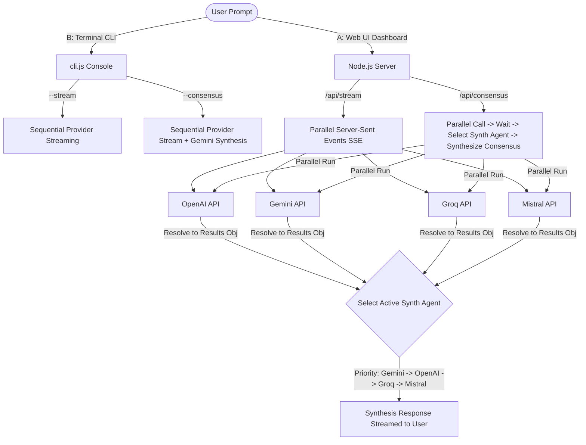
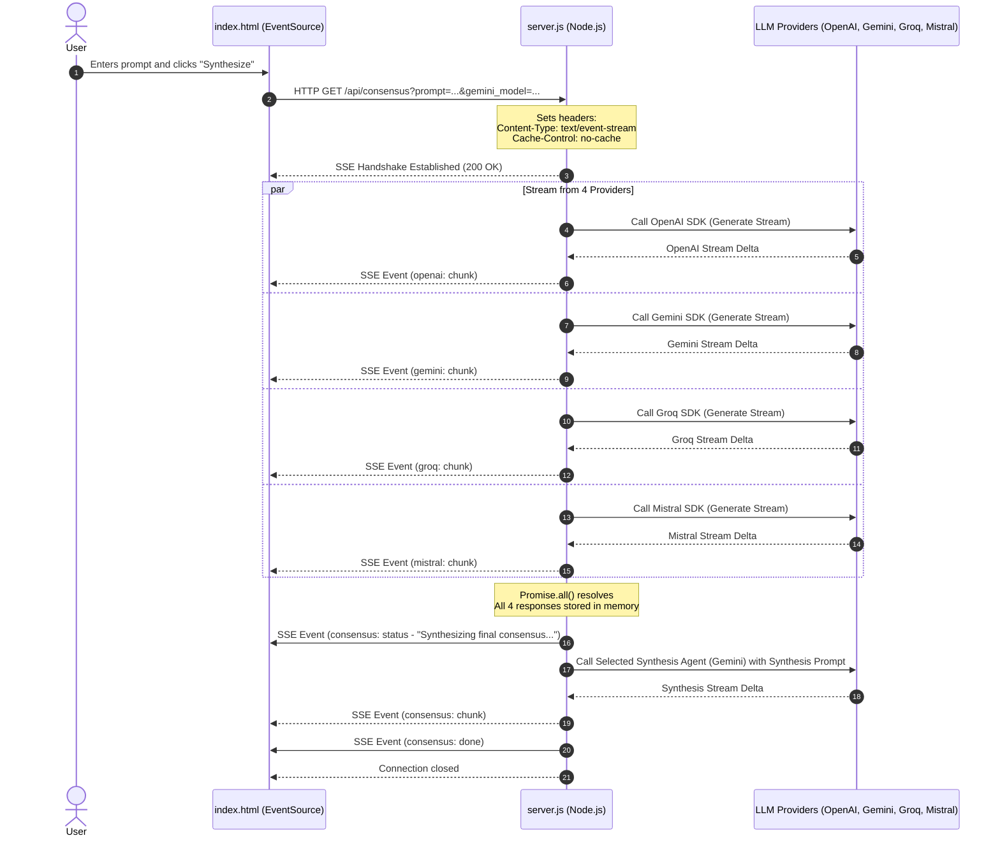

# 🛠️ Multi-Agent Workbench: Implementation Plan & Technical Deep Dive

This document details the **technical architecture**, **API specifications**, **core design patterns**, and **step-by-step lifecycle** for the Multi-Agent Workbench dashboard and CLI tool under [week02/learning/day03/assigenment/](file:///home/aminul/development/gen-ai-cohort/week02/learning/day03/assigenment/).

---

## 🗺️ System Architecture Overview

The application is structured as a lightweight, high-performance Node.js service paired with a modern, glassmorphic front-end dashboard. It enables concurrent execution of multiple Large Language Model (LLM) providers with Server-Sent Events (SSE) streaming, culminated by an AI consensus synthesis phase.



---

## 🔁 Real-Time Streaming (SSE) Sequence Diagram

Below is the message lifecycle during a **Consensus Synthesis** request:



---

## 🛠️ Implementation Details & Core Patterns

### 1. Multi-Provider Client Initialization
Each AI provider is initialized inside [server.js](file:///home/aminul/development/gen-ai-cohort/week02/learning/day03/assigenment/server.js) and [cli.js](file:///home/aminul/development/gen-ai-cohort/week02/learning/day03/assigenment/cli.js) using its corresponding Node.js SDK. Environment keys are parsed using Node's native `.env` loader (`node --env-file=.env`).

* **API Key Guardrails (`isPlaceholder`)**:
  Before constructing a client, the server validates whether the user-supplied or environment API key is a placeholder:
  ```javascript
  function isPlaceholder(key) {
    if (!key) return true;
    const lower = key.toLowerCase();
    return lower.includes("your_") || lower.includes("placeholder") || lower === "";
  }
  ```

### 2. Parallel Generation via Asynchronous Concurrency
To ensure that slow network requests do not block the app, individual calls are wrapped in promises and resolved concurrently:
```javascript
const streamPromises = [
  streamOpenAI(prompt, keys.openaiKey, ...),
  streamGemini(prompt, keys.geminiKey, ...),
  streamGroq(prompt, keys.groqKey, ...),
  streamMistral(prompt, keys.mistralKey, ...)
];

await Promise.all(streamPromises);
```
During execution:
- Each wrapper stream function invokes its provider-specific stream generator.
- For example, Gemini content is streamed using:
  ```javascript
  const stream = await ai.models.generateContentStream({
    model: modelName || "gemini-3.1-flash-lite",
    contents: prompt,
  });
  for await (const chunk of stream) {
    const content = chunk.text; // Note: Uses SDK getter property
    if (content) onChunk(content);
  }
  ```

### 3. Server-Sent Events (SSE) Framing
SSE allows the server to push real-time text updates directly to the web client via standard HTTP chunked transfer encoding.
* **Headers Established**:
  ```http
  HTTP/1.1 200 OK
  Content-Type: text/event-stream
  Cache-Control: no-cache
  Connection: keep-alive
  Access-Control-Allow-Origin: *
  ```
* **Payload Structure**:
  Messages are formatted as JSON and prefixed with `data: `:
  ```javascript
  const sendSSE = (provider, type, content) => {
    const payload = { provider, type };
    if (type === "chunk") payload.text = content;
    if (type === "error") payload.error = formatAPIError(provider, content);
    res.write(`data: ${JSON.stringify(payload)}\n\n`);
  };
  ```

### 4. Robust API Error Mapping
The server translates complex, multi-nested SDK errors into human-readable warnings:
```javascript
function formatAPIError(provider, errorMsg) {
  if (!errorMsg) return 'Unknown error';
  if (errorMsg.includes('429') || errorMsg.includes('RESOURCE_EXHAUSTED') || errorMsg.includes('Quota exceeded')) {
    if (provider === 'gemini') {
      return "Google Gemini: Quota Exceeded (429). Please verify billing status or project rate limits.";
    }
    return `${provider.toUpperCase()}: Rate limit exceeded.`;
  }
  return errorMsg;
}
```

---

## 🚶 Step-by-Step Execution Walkthrough

### Scenario: Running a Consensus Synthesis request

#### Step 1: User Request Initiation
The user types a prompt into the text area (e.g., *"Explain quantum computing in simple terms"*) and clicks **"Synthesize Consensus"**.

#### Step 2: Establish the SSE Channel
The browser's JavaScript executes the following listener logic:
```javascript
const eventSource = new EventSource(`/api/consensus?prompt=${encodeURIComponent(prompt)}&gemini_model=${geminiModel}...`);
```
The server handles this request on `/api/consensus` by opening an SSE tunnel and keeping the HTTP socket open.

#### Step 3: Concurrent Streams Begin
The server schedules promises for all 4 LLM providers.
* While the models process, they stream tokens back to the server.
* The server forwards these partial response tokens immediately to the browser client using `sendSSE("openai", "chunk", token)`.
* In the browser, the SSE listener maps the provider to the appropriate dashboard grid card and appends the text:
  ```javascript
  eventSource.onmessage = (event) => {
    const data = JSON.parse(event.data);
    if (data.type === 'chunk') {
      document.getElementById(`output-${data.provider}`).innerHTML += formatToken(data.text);
    }
  };
  ```

#### Step 4: Resolution & Agent Selection
Once all 4 providers finish generating, `Promise.all` resolves. The server compiles the synthesized prompt structure:
```markdown
Here are the answers generated by four different AI models:
- MODEL 1 (OpenAI): [Raw Text Output]
- MODEL 2 (Gemini): [Raw Text Output]
- ...
Compare the answers, identify agreement, resolve contradictions, and output a concise final response.
```
The server checks for the highest-priority active API key in its configuration cascade (Gemini ➡️ OpenAI ➡️ Groq ➡️ Mistral) to serve as the Synthesis Evaluator.

#### Step 5: Streaming the Consensus Result
The selected model receives the compilation prompt and generates a final streaming evaluation.
* These tokens are pushed under the `"consensus"` provider key: `sendSSE("consensus", "chunk", token)`.
* Once finished, the server sends a final done signal (`sendSSE("consensus", "done")`) followed by closing the SSE chunk channel (`res.end()`).
