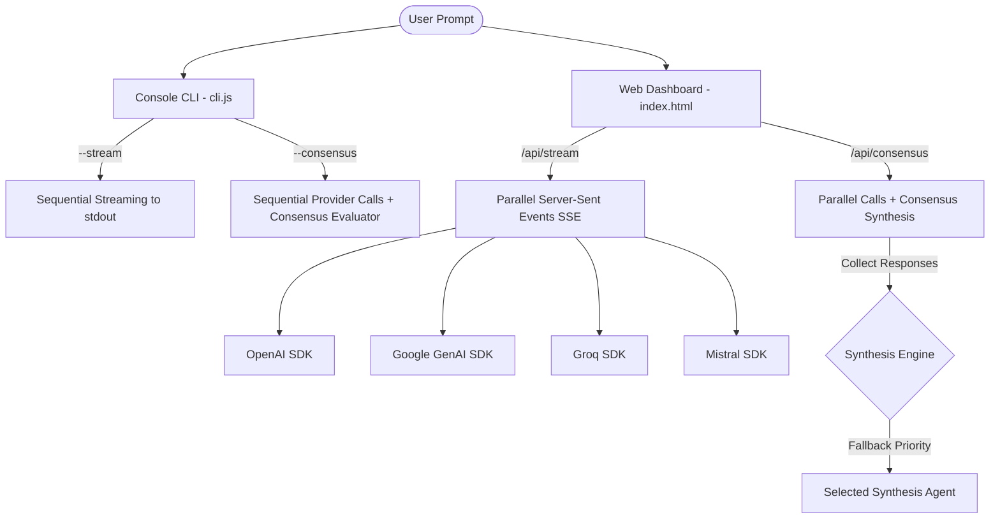

# 📘 Multi-Agent Workbench: Comprehensive Step-by-Step Code Explanation

This document provides a complete, step-by-step technical breakdown of the **Multi-Agent Workbench** project located in [`week02/learning/day03/assigenment/`](file:///home/aminul/development/gen-ai-cohort/week02/learning/day03/assigenment/).

---

## 📌 Project Overview & Purpose

The Multi-Agent Workbench demonstrates how to orchestrate, stream, and synthesize outputs concurrently from four leading AI language model providers:
1. **OpenAI** (`gpt-4o-mini`)
2. **Google Gemini** (`gemini-3.1-flash-lite`)
3. **Groq** (`llama-3.3-70b-versatile`)
4. **Mistral AI** (`mistral-large-latest`)

### Core Features
- **Multi-Provider Real-Time Streaming**: Stream response deltas live from all 4 LLM providers simultaneously.
- **Server-Sent Events (SSE) Engine**: Native HTTP chunked streaming protocol to push real-time updates directly to the browser UI without WebSocket overhead.
- **AI Consensus Aggregator**: Collects responses from all 4 providers, constructs a synthesis meta-prompt, and runs an evaluator agent to identify agreement, resolve discrepancies, and output a balanced, unified response.
- **Dynamic Fallback Cascade**: If an API provider hits a rate limit (HTTP 429) or is unconfigured, the system gracefully falls back to the next available provider in priority order (`Gemini ➡️ OpenAI ➡️ Groq ➡️ Mistral`).
- **Dual Interfaces**:
  - **Terminal CLI** ([`cli.js`](file:///home/aminul/development/gen-ai-cohort/week02/learning/day03/assigenment/cli.js)): Command-line tool supporting streaming and consensus synthesis.
  - **Glassmorphic Web UI** ([`public/index.html`](file:///home/aminul/development/gen-ai-cohort/week02/learning/day03/assigenment/public/index.html)): Interactive dashboard served by Node.js ([`server.js`](file:///home/aminul/development/gen-ai-cohort/week02/learning/day03/assigenment/server.js)).

---

## 📁 File Structure

```text
week02/learning/day03/assigenment/
├── README.md             # Technical specification & architecture diagrams
├── explanation code.md   # Complete step-by-step code explanation document
├── cli.js                # CLI executable for streaming and consensus modes
├── server.js             # HTTP server with SSE streaming endpoints
└── public/
    └── index.html        # Modern Glassmorphic dashboard UI
```

---

## 🏗️ High-Level System Architecture



---

## 🛠️ Step-by-Step Code Explanation

---

### Step 1: Environment Setup & SDK Initialization

Both [`server.js`](file:///home/aminul/development/gen-ai-cohort/week02/learning/day03/assigenment/server.js) and [`cli.js`](file:///home/aminul/development/gen-ai-cohort/week02/learning/day03/assigenment/cli.js) initialize the standard Node.js module loaders and import SDKs for all 4 LLM providers:

```javascript
// Native HTTP & Filesystem Modules (server.js)
import http from "http";
import url from "url";
import fs from "fs";
import path from "path";

// Multi-Provider SDK Imports
import OpenAI from "openai";
import { GoogleGenAI } from "@google/genai";
import { Mistral } from "@mistralai/mistralai";
import Groq from "groq-sdk";
```

#### API Key Validation Guardrail (`isPlaceholder`)
To prevent unhandled exceptions or invalid API calls when credentials are missing or set to placeholder text in `.env`:

```javascript
function isPlaceholder(key) {
  if (!key) return true;
  const lower = key.toLowerCase();
  return lower.includes("your_") || lower.includes("placeholder") || lower === "";
}
```

#### Unified API Error Normalization (`formatAPIError`)
Different providers return errors in varying JSON structures. This helper maps complex SDK errors to clean, user-friendly messages:

```javascript
function formatAPIError(provider, errorMsg) {
  if (!errorMsg) return 'Unknown error';
  if (errorMsg.includes('429') || errorMsg.includes('RESOURCE_EXHAUSTED') || errorMsg.includes('Quota exceeded')) {
    if (provider === 'gemini' || provider === 'consensus') {
      return "Google Gemini: Quota Exceeded (429). Your project's free tier requests limit is 0. Please ensure a billing account is linked to your project.";
    }
    return `${provider.toUpperCase()}: Rate limit or quota exceeded (429).`;
  }
  if (errorMsg.includes('401') || errorMsg.includes('API key not valid') || errorMsg.includes('API_KEY_INVALID')) {
    return `${provider.toUpperCase()}: Invalid API key. Please check your credentials.`;
  }
  return errorMsg;
}
```

---

### Step 2: Individual Provider Streaming Engine

Each provider has a dedicated asynchronous function that handles client instantiation, model execution, token iteration, and error catching.

#### 1. OpenAI Streamer (`streamOpenAI`)
- Uses `client.chat.completions.create()` with `stream: true`.
- Iterates over chunks using `for await (const chunk of stream)`.
- Extracts token delta via `chunk.choices[0]?.delta?.content`.

```javascript
async function streamOpenAI(prompt, apiKey, modelName, onChunk, onError, onDone) {
  const key = isPlaceholder(apiKey) ? process.env.OPENAI_API_KEY : apiKey;
  if (isPlaceholder(key)) {
    onError("OpenAI API Key is not set or is a placeholder.");
    onDone();
    return "";
  }

  try {
    const client = new OpenAI({ apiKey: key });
    const stream = await client.chat.completions.create({
      model: modelName || "gpt-4o-mini",
      messages: [{ role: "user", content: prompt }],
      stream: true,
    });

    let fullText = "";
    for await (const chunk of stream) {
      const content = chunk.choices[0]?.delta?.content || "";
      if (content) {
        fullText += content;
        onChunk(content);
      }
    }
    onDone();
    return fullText;
  } catch (err) {
    onError(err.message);
    onDone();
    return "";
  }
}
```

#### 2. Google Gemini Streamer (`streamGemini`)
- Uses `@google/genai` SDK with `ai.models.generateContentStream()`.
- Accesses text chunk directly via `chunk.text`.

```javascript
async function streamGemini(prompt, apiKey, modelName, onChunk, onError, onDone) {
  const key = isPlaceholder(apiKey) ? process.env.GEMINI_API_KEY : apiKey;
  if (isPlaceholder(key)) {
    onError("Gemini API Key is not set or is a placeholder.");
    onDone();
    return "";
  }

  try {
    const ai = new GoogleGenAI({ apiKey: key });
    const stream = await ai.models.generateContentStream({
      model: modelName || "gemini-3.1-flash-lite",
      contents: prompt,
    });

    let fullText = "";
    for await (const chunk of stream) {
      const content = chunk.text;
      if (content) {
        fullText += content;
        onChunk(content);
      }
    }
    onDone();
    return fullText;
  } catch (err) {
    onError(err.message);
    onDone();
    return "";
  }
}
```

#### 3. Groq Streamer (`streamGroq`)
- Uses `groq-sdk` with OpenAI-compatible streaming interface.

```javascript
async function streamGroq(prompt, apiKey, modelName, onChunk, onError, onDone) {
  const key = isPlaceholder(apiKey) ? process.env.GROQ_API_KEY : apiKey;
  if (isPlaceholder(key)) {
    onError("Groq API Key is not set or is a placeholder.");
    onDone();
    return "";
  }

  try {
    const client = new Groq({ apiKey: key });
    const stream = await client.chat.completions.create({
      model: modelName || "llama-3.3-70b-versatile",
      messages: [{ role: "user", content: prompt }],
      stream: true,
    });

    let fullText = "";
    for await (const chunk of stream) {
      const content = chunk.choices[0]?.delta?.content || "";
      if (content) {
        fullText += content;
        onChunk(content);
      }
    }
    onDone();
    return fullText;
  } catch (err) {
    onError(err.message);
    onDone();
    return "";
  }
}
```

#### 4. Mistral Streamer (`streamMistral`)
- Uses `@mistralai/mistralai` SDK with `client.chat.stream()`.
- Accesses text content via `chunk.data.choices[0]?.delta?.content`.

```javascript
async function streamMistral(prompt, apiKey, modelName, onChunk, onError, onDone) {
  const key = isPlaceholder(apiKey) ? process.env.MISTRAL_API_KEY : apiKey;
  if (isPlaceholder(key)) {
    onError("Mistral API Key is not set or is a placeholder.");
    onDone();
    return "";
  }

  try {
    const client = new Mistral({ apiKey: key });
    const stream = await client.chat.stream({
      model: modelName || "mistral-large-latest",
      messages: [{ role: "user", content: prompt }],
    });

    let fullText = "";
    for await (const chunk of stream) {
      const content = chunk.data.choices[0]?.delta?.content || "";
      if (content) {
        fullText += content;
        onChunk(content);
      }
    }
    onDone();
    return fullText;
  } catch (err) {
    onError(err.message);
    onDone();
    return "";
  }
}
```

---

### Step 3: CLI Interface Implementation (`cli.js`)

The CLI script allows command-line interaction without opening a web browser.

#### Argument Parsing & Execution Modes
```javascript
const args = process.argv.slice(2);
const mode = args[0];     // '--stream' or '--consensus'
const prompt = args[1];   // Target prompt string
```

#### Consensus Prompt Construction & Fallback Loop
When running in `--consensus` mode, `cli.js`:
1. Runs sequential calls to all 4 models to gather raw text outputs.
2. Constructs the **Synthesis Meta-Prompt**:

```javascript
const synthesisPrompt = `
User Prompt: "${prompt}"

Here are the answers generated by four different AI models:

---
MODEL 1 (OpenAI):
${openaiRes || '(Failed to generate response)'}

---
MODEL 2 (Gemini):
${geminiRes || '(Failed to generate response)'}

---
MODEL 3 (Groq):
${groqRes || '(Failed to generate response)'}

---
MODEL 4 (Mistral):
${mistralRes || '(Failed to generate response)'}

---
Task:
Compare the four answers.
1. Identify the areas of agreement.
2. Spot and resolve any contradictions or factual discrepancies.
3. Synthesize the inputs into a single highly accurate, balanced, and concise final response.
4. Briefly explain why you resolved discrepancies the way you did.
`;
```

3. Iterates over `synthesisCandidates` in priority order (`Gemini ➡️ OpenAI ➡️ Groq ➡️ Mistral`) to synthesize the consensus:

```javascript
const synthesisCandidates = [
  { provider: 'gemini', run: streamGemini },
  { provider: 'openai', run: streamOpenAI },
  { provider: 'groq', run: streamGroq },
  { provider: 'mistral', run: streamMistral }
];

for (const candidate of synthesisCandidates) {
  const key = process.env[candidate.provider.toUpperCase() + '_API_KEY'];
  if (!isPlaceholder(key)) {
    console.log(`Using ${candidate.provider.toUpperCase()} as consensus synthesis agent...`);
    const result = await candidate.run(synthesisPrompt);
    if (result) {
      synthesisSuccessful = true;
      break;
    }
  }
}
```

---

### Step 4: Web Server & Server-Sent Events (SSE) Engine (`server.js`)

[`server.js`](file:///home/aminul/development/gen-ai-cohort/week02/learning/day03/assigenment/server.js) creates a native Node.js HTTP server.

#### 1. Serving Static Web Assets
Navigating to `http://localhost:3000/` reads and serves `public/index.html`:

```javascript
if (pathname === "/" || pathname === "/index.html") {
  const filePath = path.join(process.cwd(), "week02/learning/day03/assigenment/public/index.html");
  fs.readFile(filePath, (err, content) => {
    if (err) {
      res.writeHead(500, { "Content-Type": "text/plain" });
      res.end("Error loading dashboard index.html.");
    } else {
      res.writeHead(200, { "Content-Type": "text/html" });
      res.end(content);
    }
  });
  return;
}
```

#### 2. SSE Header Configuration & Payload Framing
For streaming endpoints (`/api/stream` and `/api/consensus`), the server establishes an HTTP Event Stream:

```javascript
res.writeHead(200, {
  "Content-Type": "text/event-stream",
  "Cache-Control": "no-cache",
  Connection: "keep-alive",
  "Access-Control-Allow-Origin": "*",
});

const sendSSE = (provider, type, content) => {
  const payload = { provider, type };
  if (type === "chunk") payload.text = content;
  if (type === "error") payload.error = formatAPIError(provider, content);
  res.write(`data: ${JSON.stringify(payload)}\n\n`);
};
```

#### 3. Concurrent Non-Blocking Execution (`Promise.all`)
All 4 LLMs execute concurrently in parallel so fast models (like Groq) are not delayed by slower models:

```javascript
const streamPromises = [
  streamOpenAI(prompt, keys.openaiKey, models.openaiModel,
    (chunk) => sendSSE("openai", "chunk", chunk),
    (err) => sendSSE("openai", "error", err),
    () => sendSSE("openai", "done")
  ).then(text => { results.openai = text; }),

  streamGemini(prompt, keys.geminiKey, models.geminiModel,
    (chunk) => sendSSE("gemini", "chunk", chunk),
    (err) => sendSSE("gemini", "error", err),
    () => sendSSE("gemini", "done")
  ).then(text => { results.gemini = text; }),

  streamGroq(prompt, keys.groqKey, models.groqModel,
    (chunk) => sendSSE("groq", "chunk", chunk),
    (err) => sendSSE("groq", "error", err),
    () => sendSSE("groq", "done")
  ).then(text => { results.groq = text; }),

  streamMistral(prompt, keys.mistralKey, models.mistralModel,
    (chunk) => sendSSE("mistral", "chunk", chunk),
    (err) => sendSSE("mistral", "error", err),
    () => sendSSE("mistral", "done")
  ).then(text => { results.mistral = text; })
];

await Promise.all(streamPromises);
```

#### 4. Consensus Synthesis & Provider Fallback Cascade
Once `Promise.all` resolves, if `isConsensusMode` is `true`, the server triggers consensus evaluation:

```javascript
if (isConsensusMode) {
  sendSSE("consensus", "status", "Synthesizing final consensus answer...");

  // Candidates in priority order
  const synthesisCandidates = [
    { provider: "gemini", key: geminiKey, model: query.gemini_model || "gemini-3.1-flash-lite", run: streamGemini },
    { provider: "openai", key: openaiKey, model: query.openai_model || "gpt-4o-mini", run: streamOpenAI },
    { provider: "groq", key: groqKey, model: query.groq_model || "llama-3.3-70b-versatile", run: streamGroq },
    { provider: "mistral", key: mistralKey, model: query.mistral_model || "mistral-large-latest", run: streamMistral }
  ];

  let synthesisSuccessful = false;
  for (const candidate of synthesisCandidates) {
    if (!isPlaceholder(candidate.key)) {
      sendSSE("consensus", "status", `Synthesizing final consensus answer using ${candidate.provider.toUpperCase()}...`);
      const result = await candidate.run(synthesisPrompt, candidate.key, candidate.model,
        (chunk) => sendSSE("consensus", "chunk", chunk),
        (err) => candidateError = err,
        () => {}
      );

      if (result) {
        synthesisSuccessful = true;
        sendSSE("consensus", "done");
        break;
      }
    }
  }
}
```

---

### Step 5: Glassmorphic Web Dashboard (`public/index.html`)

The frontend is built using standard HTML5, CSS3, and JavaScript with zero heavy framework overhead.

#### Key Client-Side Features:
1. **Glassmorphism CSS Design**: Custom dark-mode theme utilizing CSS backdrop filters, smooth CSS gradients, and flexbox/grid layout systems.
2. **Markdown & Syntax Highlighting**: Integrates `marked.js` and `highlight.js` to render Markdown formatting and code blocks dynamically as tokens arrive.
3. **EventSource Listener**: Connects to the SSE endpoint and parses real-time stream deltas:

```javascript
const eventSource = new EventSource(
  `/api/consensus?prompt=${encodeURIComponent(prompt)}`
);

eventSource.onmessage = (event) => {
  const data = JSON.parse(event.data);
  
  if (data.type === 'chunk') {
    // Append token to corresponding model card in UI
    const outputEl = document.getElementById(`output-${data.provider}`);
    rawOutputs[data.provider] += data.text;
    outputEl.innerHTML = marked.parse(rawOutputs[data.provider]);
  } else if (data.type === 'error') {
    showErrorBadge(data.provider, data.error);
  } else if (data.type === 'done') {
    markProviderComplete(data.provider);
  }
};
```

---

## 🚀 How to Run & Test the Code

### 1. Install Dependencies
Run the following command inside the project root:

```bash
npm install
```

### 2. Configure Environment Variables
Ensure your `.env` file contains your API keys:

```env
OPENAI_API_KEY=your_openai_api_key
GEMINI_API_KEY=your_gemini_api_key
GROQ_API_KEY=your_groq_api_key
MISTRAL_API_KEY=your_mistral_api_key
```

### 3. Run via CLI

#### Multi-Provider Live Stream:
```bash
node --env-file=.env week02/learning/day03/assigenment/cli.js --stream "Compare functional programming vs object oriented programming."
```

#### AI Consensus Aggregator:
```bash
node --env-file=.env week02/learning/day03/assigenment/cli.js --consensus "Explain the concept of quantum entanglement in simple terms."
```

### 4. Run Web Dashboard
Start the Node.js HTTP server:

```bash
node --env-file=.env week02/learning/day03/assigenment/server.js
```

Open your browser and navigate to:
```text
http://localhost:3000
```

---

## 🎯 Summary of Key Design Lessons

1. **Async Concurrency (`Promise.all`)**: Running API streams concurrently eliminates cumulative latency and provides instant feedback for every model.
2. **Server-Sent Events (SSE)**: Simpler and lightweight compared to WebSockets for unidirectional data streaming from server to client over standard HTTP.
3. **Synthesis & Fallback Cascading**: Using a multi-tier candidate evaluation list ensures consensus synthesis completes reliably even when individual provider limits are reached.
