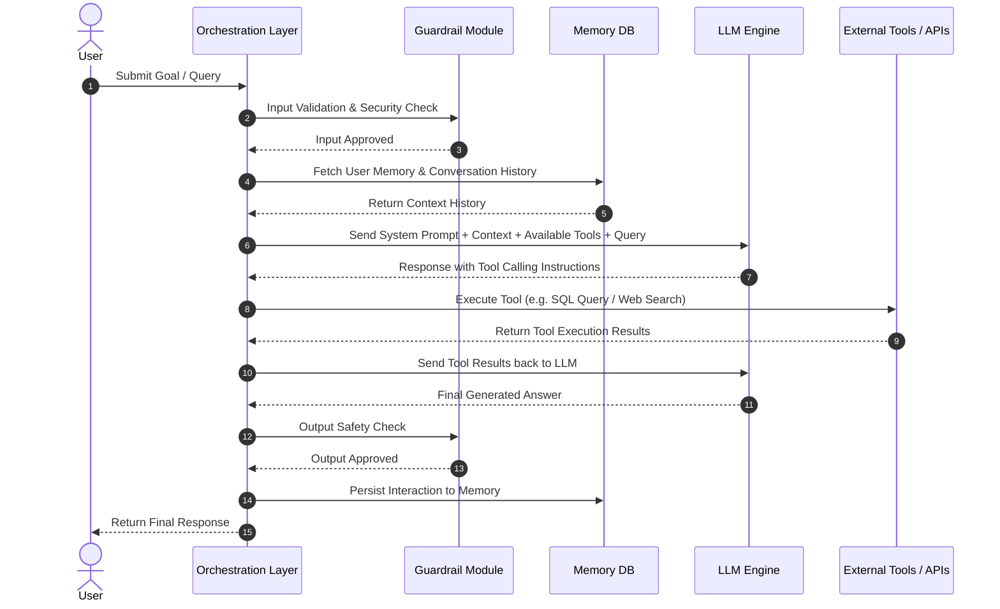
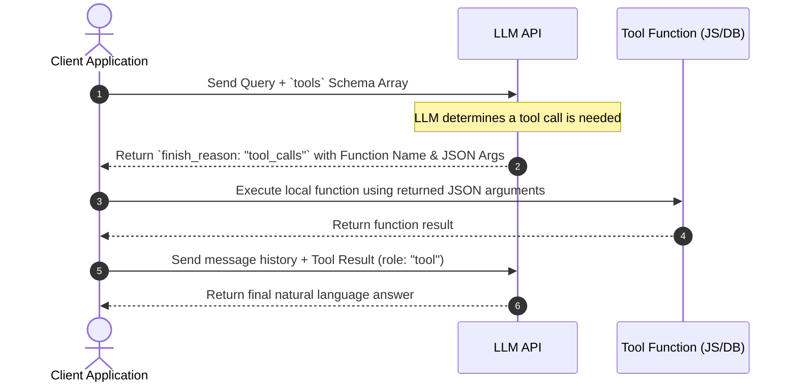

# 🎯 Week 02 — Day 03 Interview Questions & Deep Dive Answers

# Topic: AI Agent Architecture, Context Management, LLM Access Patterns & Tool Calling

> **Target Audience:** AI Application Engineers, Full-Stack AI Developers, and Agent System Architects.

---

## 📑 Table of Contents

1. [Category 1 — AI Agent Architecture & Lifecycle](#1-category-1--ai-agent-architecture--lifecycle)
2. [Category 2 — Context & Token Management](#2-category-2--context--token-management)
3. [Category 3 — Access Patterns: REST vs SDK vs Agent SDK vs Local Models](#3-category-3--access-patterns-rest-vs-sdk-vs-agent-sdk-vs-local-models)
4. [Category 4 — Structured Output & Function Calling](#4-category-4--structured-output--function-calling)
5. [Category 5 — Practical Node.js Implementation Questions](#5-category-5--practical-node-js-implementation-questions)

---

# 1. Category 1 — AI Agent Architecture & Lifecycle

## Q1: What is an AI Agent and how does it differ from a raw LLM? State the formula for an AI Agent.

### 💡 Answer:
* **Raw LLM:** Is a static reasoning/generation engine. It takes input prompt tokens and outputs completion tokens based on pre-trained weights. It cannot interact with external databases, call APIs, send emails, or execute code.
* **AI Agent:** Is an intelligent software system that uses an LLM as its core reasoning engine while surrounding it with memory, tools, planning, guardrails, and execution loops to accomplish complex goals autonomously.

### 📐 AI Agent Formula:
```text
AI Agent = LLM (Reasoning Engine) 
         + Memory (Short-Term & Long-Term) 
         + Tools (APIs, Code Execution, Search) 
         + Planning & Reasoning (Task Decomposition) 
         + Guardrails (Security & Validation) 
         + Orchestration Layer (State & Loop Management)
```

---

## Q2: Explain the complete end-to-end Request Lifecycle of an AI Agent.

### 💡 Answer:



---

## Q3: What is Human-in-the-Loop (HITL) and why is it essential in production agent architectures?

### 💡 Answer:
**Human-in-the-Loop (HITL)** is an architectural safety pattern where an AI Agent pauses its execution loop before performing high-risk actions (e.g. sending financial transactions, deleting database records, emailing external clients) to request explicit human approval.

```text
[ Agent Decision: Execute Delete Database ] ──> [ HITL Approval Gate ] ──> Pending Human Click ──> Executed
```

It prevents autonomous agents from causing catastrophic real-world side effects due to hallucination or prompt injection.

---

# 2. Category 2 — Context & Token Management

## Q4: What is Context Management, and how do production systems prevent context window saturation?

### 💡 Answer:
**Context Management** is the system design discipline of controlling, filtering, and structuring the context payload delivered to an LLM to prevent context window saturation while maintaining accuracy.

### 🛡️ Production Context Management Strategies:

```text
                  ┌─────────────────────────────────────────┐
                  │      CONTEXT MANAGEMENT STRATEGIES      │
                  └────────────────────┬────────────────────┘
                                       │
        ┌──────────────────┬───────────┴───────────┬──────────────────┐
        ▼                  ▼                       ▼                  ▼
┌───────────────┐  ┌───────────────┐       ┌───────────────┐  ┌───────────────┐
│ Sliding Window│  │ Summarization │       │ Vector RAG    │  │ Token Trimming│
│ Keep latest N │  │ Compress past │       │ Retrieve top K│  │ Remove non-   │
│ turns         │  │ dialog turns  │       │ relevant items│  │ essential keys│
└───────────────┘  └───────────────┘       └───────────────┘  └───────────────┘
```

---

## Q5: Why do LLMs hallucinate, and how does Context Grounding reduce hallucinations?

### 💡 Answer:
* **Why LLMs Hallucinate:** LLMs are probabilistic token predictors, not factual databases. When prompted for facts outside their training data or context payload, they generate plausible-sounding text that is factually incorrect.
* **Context Grounding:** Feeding exact, authoritative facts (via RAG or database context) into the prompt instructions, combined with strict system directives (*"Answer strictly using the provided context. If unknown, say 'I don't know'"*).

---

## Q6: Compare Context Truncation, Sliding Windows, Summarization, and RAG for long-context handling.

### 💡 Answer:

| Strategy | Mechanism | Advantage | Disadvantage |
| :--- | :--- | :--- | :--- |
| **Truncation** | Dropping oldest messages when context limit is reached. | Simple, zero overhead. | Loses initial context & user facts. |
| **Sliding Window** | Retaining only the latest $N$ messages. | Low cost, steady payload. | Forgets facts mentioned early in session. |
| **Summarization** | Compressing past turns into a concise summary paragraph using an LLM. | Preserves major facts without full token count. | Extra LLM call latency & cost. |
| **Vector RAG** | Indexing history into embeddings and retrieving top $K$ relevant facts per query. | Highly scalable across thousands of turns. | Requires embedding model & vector DB. |

---

# 3. Category 3 — Access Patterns: REST vs SDK vs Agent SDK vs Local Models

## Q7: Compare accessing an LLM via raw REST API vs Provider SDK vs Agent SDK vs Local Model (Ollama).

### 💡 Answer:

| Access Pattern | Description | Best Used When | Example Tooling |
| :--- | :--- | :--- | :--- |
| **Raw REST API** | Sending HTTP `POST` fetch requests directly to API endpoints. | Minimal dependencies, custom network proxies, lightweight microservices. | Standard `fetch()` / `axios` |
| **Provider SDK** | Official typed client wrappers maintained by model vendors. | Standard production backends requiring type safety, automatic retries, and streaming. | `openai`, `@google/genai`, `groq-sdk` |
| **Agent SDK** | Higher-level frameworks that orchestrate memory, tool loops, and multi-agent teams. | Complex agent workflows, multi-step tool loops, stateful agents. | LangChain, LlamaIndex, AutoGen |
| **Local Model (Ollama)** | Hosting open-weights models locally on edge/on-prem GPUs. | High privacy requirements, offline execution, zero API token costs. | Ollama, vLLM, LM Studio |

---

## Q8: What are the security, privacy, and latency tradeoffs of Local Models (Ollama) vs Cloud API Providers?

### 💡 Answer:
* **Cloud APIs (OpenAI, Gemini):** High quality models, zero GPU infrastructure management, but introduces data privacy concerns and ongoing per-token API costs.
* **Local Models (Ollama/vLLM):** 100% data privacy (data never leaves local server), zero token fees, offline capability, but requires expensive GPU hardware and model performance depends on model parameter size (e.g. Llama 3.1 8B vs 70B).

---

# 4. Category 4 — Structured Output & Function Calling

## Q9: Why is raw text output unreliable for production systems, and how does Structured Output (JSON Schema) solve this?

### 💡 Answer:
* **Problem with Raw Text:** LLM text outputs vary in formatting (Markdown headers, conversational intros like *"Here is your JSON:"*, missing commas), making `JSON.parse()` fail randomly in code.
* **Structured Output Solution:** Using schema-enforced JSON modes (e.g. OpenAI `response_format` with JSON Schema / Zod), the model's decoding logits are constrained at the token selection level to guarantee valid, parsable JSON matching the exact schema definition.

---

## Q10: How does Function Calling / Tool Calling work under the hood between the Client App and the LLM?

### 💡 Answer:



---

## Q11: How do you prevent endless tool calling loops or hallucinations during function execution?

### 💡 Answer:
1. **Tool Output Validation:** Enforce strict type validation on tool execution results before sending back to LLM.
2. **Iteration Caps:** Maintain a loop counter in code (`maxIterations = 5`) to force loop termination.
3. **Duplicate Call Guards:** Track previous tool calls; if the exact same tool and arguments are generated twice consecutively, halt loop or pass error context.

---

# 5. Category 5 — Practical Node.js Implementation Questions

## Q12: Write a complete Node.js snippet implementing OpenAI Function Calling with a custom tool.

### 💡 Answer:

```javascript
import { OpenAI } from "openai";

const openai = new OpenAI();

// 1. Local Tool Function
function getWeather(location) {
  return JSON.stringify({ location, temperature: "22°C", condition: "Sunny" });
}

async function runAgent() {
  const tools = [
    {
      type: "function",
      function: {
        name: "getWeather",
        description: "Get current weather for a given city location",
        parameters: {
          type: "object",
          properties: {
            location: { type: "string", description: "City name e.g. Tokyo" }
          },
          required: ["location"]
        }
      }
    }
  ];

  const messages = [{ role: "user", content: "What is the weather in Tokyo?" }];

  // Step 1: Send query with available tools
  const response = await openai.chat.completions.create({
    model: "gpt-4o-mini",
    messages,
    tools
  });

  const responseMessage = response.choices[0].message;

  // Step 2: Check if model requested a tool call
  if (responseMessage.tool_calls) {
    messages.push(responseMessage); // Add assistant message to history

    for (const toolCall of responseMessage.tool_calls) {
      if (toolCall.function.name === "getWeather") {
        const args = JSON.parse(toolCall.function.arguments);
        const result = getWeather(args.location);

        // Step 3: Send tool result back to LLM
        messages.push({
          role: "tool",
          tool_call_id: toolCall.id,
          content: result
        });
      }
    }

    // Step 4: Final LLM generation with tool results
    const finalResponse = await openai.chat.completions.create({
      model: "gpt-4o-mini",
      messages
    });

    console.log("Final Answer:", finalResponse.choices[0].message.content);
  }
}

runAgent();
```

---

## Q13: Write a Node.js snippet forcing Structured Output using OpenAI SDK `response_format` with JSON Schema.

### 💡 Answer:

```javascript
import { OpenAI } from "openai";

const openai = new OpenAI();

async function extractUserData() {
  const response = await openai.chat.completions.create({
    model: "gpt-4o-mini",
    messages: [
      { role: "system", content: "Extract user details strictly as JSON." },
      { role: "user", content: "Alex is 28 years old and works as a DevOps Engineer in Berlin." }
    ],
    response_format: {
      type: "json_schema",
      json_schema: {
        name: "user_profile",
        strict: true,
        schema: {
          type: "object",
          properties: {
            name: { type: "string" },
            age: { type: "integer" },
            role: { type: "string" },
            city: { type: "string" }
          },
          required: ["name", "age", "role", "city"],
          additionalProperties: false
        }
      }
    }
  });

  const userData = JSON.parse(response.choices[0].message.content);
  console.log("Guaranteed Parsed JSON:", userData);
}

extractUserData();
```
