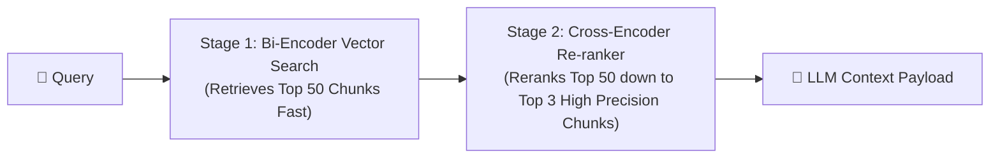

# 🎯 Week 02 — Day 04 Interview Questions & Deep Dive Answers

# Topic: Vector RAG, Document Chunking, Vector DBs (Qdrant), & Advanced Retrieval

> **Target Audience:** AI Engineers, RAG Pipeline Architects, and Vector Database Infrastructure Engineers.

---

## 📑 Table of Contents

1. [Category 1 — Foundational RAG & Memory Tradeoffs](#1-category-1--foundational-rag--memory-tradeoffs)
2. [Category 2 — Chunking Strategies & Ingestion Pipelines](#2-category-2--chunking-strategies--ingestion-pipelines)
3. [Category 3 — Embeddings, Similarity Metrics & Vector DB Indexes](#3-category-3--embeddings-similarity-metrics--vector-db-indexes)
4. [Category 4 — Advanced RAG Architectures & Re-Ranking](#4-category-4--advanced-rag-architectures--re-ranking)
5. [Category 5 — Practical Node.js & LangChain Implementation](#5-category-5--practical-nodejs--langchain-implementation)

---

# 1. Category 1 — Foundational RAG & Memory Tradeoffs

## Q1: What is Retrieval-Augmented Generation (RAG)? Compare Parametric vs Non-Parametric Memory.

### 💡 Answer:
* **Retrieval-Augmented Generation (RAG):** Is an architectural pattern where an LLM is paired with an external search engine / vector database. Before answering a user prompt, the system retrieves relevant documents from private/dynamic data stores and injects them into the LLM context prompt as authoritative grounding context.

* **Parametric Memory vs Non-Parametric Memory:**

| Memory Type | Definition | Storage Medium | Key Characteristics |
| :--- | :--- | :--- | :--- |
| **Parametric Memory** | Knowledge stored directly inside the model's neural network parameters. | Frozen weight matrices ($\text{W}$). | Fixed at training time; expensive to update; prone to hallucination. |
| **Non-Parametric Memory** | Knowledge stored in external, indexable databases. | Vector Databases, SQL, Document Stores. | Dynamically updateable in real-time; verifiable sources; strict access control. |

---

## Q2: Compare RAG vs Fine-Tuning vs Prompting. When should an enterprise choose RAG over Fine-Tuning?

### 💡 Answer:

```text
               KNOWLEDGE DYNAMICS vs ADAPTATION REQUIREMENT
  ┌──────────────────────────────────────────────────────────────────┐
  │ Dynamic/Private Knowledge Updating ──> Choose RAG                │
  │ Model Tone / Style / Specialized Syntax ──> Choose Fine-Tuning   │
  │ Small-scale static instruction tuning ──> Choose Prompting       │
  └──────────────────────────────────────────────────────────────────┘
```

### 📊 Comparative Matrix:

| Feature | Prompting | Fine-Tuning | RAG (Retrieval-Augmented Generation) |
| :--- | :--- | :--- | :--- |
| **Primary Use Case** | General instructions & zero-shot tasks. | Adapting model style, tone, format, or specialized syntax. | Providing real-time access to private, dynamic, evolving knowledge. |
| **Knowledge Update Cost** | Zero (modify prompt string). | Very High (requires GPU re-training pipeline). | Very Low (upsert document chunk into Vector DB). |
| **Auditability / Citation** | Low. | Zero (opaque model weights). | High (returns source document URLs, page numbers, & chunk IDs). |
| **Hallucination Risk** | High. | Medium/High. | Low (grounded strictly in retrieved context). |

---

## Q3: Does RAG completely eliminate hallucinations? Explain the "Garbage Retrieval, Garbage Generation" risk.

### 💡 Answer:
**No, RAG does not eliminate hallucinations 100%.**

RAG shifts the bottleneck from model parameter knowledge to **retrieval precision**. If the retrieval stage fetches irrelevant, truncated, or incorrect document chunks (*Garbage Retrieval*), the LLM will generate incorrect answers (*Garbage Generation*).

```text
Irrelevant / Garbage Chunks Retrieved ──> LLM Grounding Fails ──> Hallucinated Output
```

### 🛡️ Mitigation:
* Implement strict System Instructions (*"Answer strictly using the provided context. If the context does not contain the answer, state 'Information not found'"*).
* Add a **Re-Ranker (Cross-Encoder)** layer to filter out low-relevance chunks before passing context to the LLM.

---

# 2. Category 2 — Chunking Strategies & Ingestion Pipelines

## Q4: What is Document Chunking, and why is fixed-size naive chunking problematic?

### 💡 Answer:
**Document Chunking** is the process of breaking long documents (PDFs, Markdown, Webpages) into smaller, semantically coherent text segments suitable for embedding models.

### 💥 Problem with Fixed-Size Naive Chunking:
Naive chunking (e.g. splitting strictly every 500 characters) cuts text arbitrarily at character counts, severing sentences, code blocks, or table rows mid-word.

```text
Paragraph: "The system load balancer distributes traffic across ALB and CDN tiers."
Naive Split: [Chunk 1: "...distributes traffic across A"] | [Chunk 2: "LB and CDN tiers..."]
Result: Loss of semantic context in both vectors!
```

---

## Q5: Compare Fixed-Size, Recursive Character, and Semantic Chunking.

### 💡 Answer:

```text
+-------------------------------------------------------------------+
|                        CHUNKING STRATEGIES                        |
+-------------------------------------------------------------------+
| 1. Fixed-Size Chunking     ──> Splitting by fixed character/token count.|
| 2. Recursive Character     ──> Respects hierarchy (\n\n, \n, space). |
| 3. Semantic Chunking       ──> Uses embeddings to split at topic jumps. |
+-------------------------------------------------------------------+
```

1. **Fixed-Size Chunking:** Fast, but cuts semantic sentences arbitrarily.
2. **Recursive Character Chunking:** Attempts to split on structural delimiters (`\n\n` $\to$ `\n` $\to$ `" "` $\to$ `""`) recursively until chunk size constraint is satisfied. (Industry Standard).
3. **Semantic Chunking:** Computes similarity distance between consecutive sentences using embedding models. Splits when semantic similarity drops significantly between sentences.

---

## Q6: Why is Chunk Overlap necessary, and how does it preserve semantic boundaries?

### 💡 Answer:
**Chunk Overlap** retains a fixed number of tokens (e.g. 50–100 tokens) from the end of Chunk $N$ into the beginning of Chunk $N+1$.

```text
Chunk 1: [=================== Section A Context =================== [ OVERLAP ] ]
Chunk 2:                                                            [ OVERLAP ] [================ Section B Context ================]
```

It prevents context boundary loss where critical relational statements cross the chunk split point.

---

# 3. Category 3 — Embeddings, Similarity Metrics & Vector DB Indexes

## Q7: How do Vector Databases store embeddings? Compare Cosine Similarity, Dot Product, and Euclidean Distance ($L2$).

### 💡 Answer:

| Similarity Metric | Mathematical Formula | Geometric Meaning | Best Used When |
| :--- | :--- | :--- | :--- |
| **Cosine Similarity** | $\cos(\theta) = \frac{\vec{A} \cdot \vec{B}}{\|\vec{A}\| \|\vec{B}\|}$ | Measures the angle $\theta$ between two vectors, ignoring vector magnitude. | Text semantic similarity (Normalized vectors). Range: $[-1, 1]$. |
| **Dot Product** | $\vec{A} \cdot \vec{B} = \sum_{i=1}^{n} A_i B_i$ | Combines angle and vector magnitude. | Normalized embedding vectors (where $\|\vec{A}\| = \|\vec{B}\| = 1$). Extremely fast on GPUs. |
| **Euclidean Distance ($L2$)** | $d(\vec{A}, \vec{B}) = \sqrt{\sum_{i=1}^{n} (A_i - B_i)^2}$ | Measures straight-line physical distance between vector endpoints. | Spatial coordinates, clustering, non-text metric spaces. |

---

## Q8: Compare Vector Database Indexing algorithms: HNSW vs IVF.

### 💡 Answer:

* **HNSW (Hierarchical Navigable Small World):** A multi-layer graph-based indexing algorithm. Operates like a skip-list on graphs.
  * *Advantage:* Extremely fast query speed ($O(\log N)$) with state-of-the-art recall accuracy (>95%).
  * *Disadvantage:* High VRAM/RAM consumption because the graph structure is held in memory.

* **IVF (Inverted File Index):** Partitions vector space into Voronoi cells using $k$-means clustering.
  * *Advantage:* Lower RAM usage, highly scalable for billion-scale vectors.
  * *Disadvantage:* Requires periodic re-clustering as new vectors are upserted; lower recall accuracy than HNSW.

---

## Q9: Compare leading Vector Databases: Qdrant, Pinecone, Milvus, and pgvector.

### 💡 Answer:

| Vector Database | Architecture | Hosting Options | Key Advantage |
| :--- | :--- | :--- | :--- |
| **Qdrant** | Written in Rust. Native payload filtering & HNSW. | Managed Cloud & Self-Hosted Docker. | High performance, memory-efficient payload filtering, rich Rust/JS/Python SDKs. |
| **Pinecone** | Closed-source serverless vector cloud. | Fully Managed SaaS Cloud. | Zero infrastructure setup, auto-scaling serverless architecture. |
| **Milvus** | Distributed C++/Go engine. | Distributed Kubernetes / Cloud. | Designed for multi-billion vector enterprise workloads. |
| **pgvector** | PostgreSQL extension. | Add-on to existing Postgres instance. | Integrates vector search directly into relational SQL database tables. |

---

# 4. Category 4 — Advanced RAG Architectures & Re-Ranking

## Q10: What is Bi-Encoder vs Cross-Encoder (Re-ranker) in RAG, and why is two-stage retrieval used?

### 💡 Answer:



1. **Bi-Encoder (First-Stage Retrieval):** Encodes query and documents into separate vectors independently. Enables sub-millisecond similarity lookup across millions of chunks in a Vector DB. Fast, but misses deep query-document token interactions.
2. **Cross-Encoder / Re-ranker (Second-Stage Reranking):** Takes the Query string and Document string *together* in a single pass through a Transformer layer. Computes deep token-level cross-attention. Highly accurate, but computationally heavy.

---

## Q11: What is Query Rewriting / HyDE (Hypothetical Document Embeddings)?

### 💡 Answer:
* **Query Rewriting:** Uses an LLM to reformulate a vague user query into multiple well-structured search queries before calling the vector database.
* **HyDE (Hypothetical Document Embeddings):** Prompt an LLM to generate a *hypothetical answer document* to the user's question. Then embed that hypothetical response and search the Vector DB for real chunks similar to the hypothetical response.

---

## Q12: How do you enforce Metadata Filtering and Tenant Access Control (RBAC) in Vector Databases?

### 💡 Answer:
Vector DBs store structured JSON payload metadata alongside vector embeddings.

When executing vector search, the query includes metadata filtering criteria so that vector distance is evaluated *only* against allowed tenant documents:

```json
{
  "filter": {
    "must": [
      { "key": "tenant_id", "match": { "value": "org_4921" } },
      { "key": "clearance_level", "match": { "value": "confidential" } }
    ]
  }
}
```

---

# 5. Category 5 — Practical Node.js & LangChain Implementation

## Q13: Write a complete Node.js RAG pipeline using LangChain, OpenAI Embeddings, and Qdrant vector store.

### 💡 Answer:

```javascript
import { QdrantVectorStore } from "@langchain/qdrant";
import { OpenAIEmbeddings, ChatOpenAI } from "@langchain/openai";
import { RecursiveCharacterTextSplitter } from "langchain/text_splitter";
import { Document } from "@langchain/core/documents";

async function runRAGPipeline(userQuery) {
  // 1. Initialize Embedding & Model
  const embeddings = new OpenAIEmbeddings({ modelName: "text-embedding-3-small" });
  const model = new ChatOpenAI({ modelName: "gpt-4o-mini", temperature: 0.1 });

  // 2. Prepare & Chunk Document
  const rawText = "Acme Corp Leave Policy: Employees receive 20 days of paid annual leave. Requests must be submitted 2 weeks in advance.";
  const splitter = new RecursiveCharacterTextSplitter({ chunkSize: 100, chunkOverlap: 20 });
  const docs = await splitter.splitDocuments([new Document({ pageContent: rawText, metadata: { tenant_id: "acme_1" } })]);

  // 3. Index into Qdrant Vector Store
  const vectorStore = await QdrantVectorStore.fromDocuments(docs, embeddings, {
    url: "http://localhost:6333",
    collectionName: "policies"
  });

  // 4. Retrieve Top 2 Relevant Chunks
  const retriever = vectorStore.asRetriever({ k: 2 });
  const retrievedDocs = await retriever.invoke(userQuery);

  // 5. Assemble Grounded Context & Generate Answer
  const context = retrievedDocs.map(d => d.pageContent).join("\n---\n");
  const prompt = `Answer the question based strictly on the context below.\n\nContext:\n${context}\n\nQuestion: ${userQuery}`;

  const response = await model.invoke(prompt);
  console.log("RAG Answer:", response.content);
}

runRAGPipeline("How many days of paid leave do employees get?");
```

---

## Q14: Write a custom Cosine Similarity calculator and vector search function in JavaScript from scratch.

### 💡 Answer:

```javascript
// Cosine Similarity Formula: (A . B) / (||A|| * ||B||)
function cosineSimilarity(vecA, vecB) {
  let dotProduct = 0;
  let normA = 0;
  let normB = 0;

  for (let i = 0; i < vecA.length; i++) {
    dotProduct += vecA[i] * vecB[i];
    normA += vecA[i] * vecA[i];
    normB += vecB[i] * vecB[i];
  }

  const magnitude = Math.sqrt(normA) * Math.sqrt(normB);
  return magnitude ? dotProduct / magnitude : 0;
}

// Vector Search
function searchTopK(queryVector, documentVectorDB, topK = 2) {
  const scored = documentVectorDB.map(doc => ({
    ...doc,
    score: cosineSimilarity(queryVector, doc.vector)
  }));

  scored.sort((a, b) => b.score - a.score);
  return scored.slice(0, topK);
}

// Execution Demo
const queryVec = [0.1, 0.5, 0.8];
const db = [
  { id: 1, text: "Chunk A about HR policies", vector: [0.12, 0.48, 0.81] },
  { id: 2, text: "Chunk B about rocket engines", vector: [-0.9, 0.1, 0.05] }
];

console.log("Top Search Result:", searchTopK(queryVec, db, 1));
```
