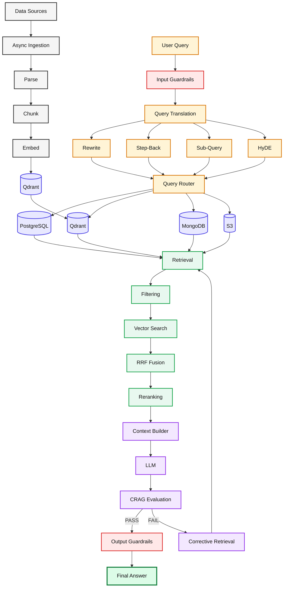

# Root Project Explanations — `adv-rag-1`

## Overview
`adv-rag-1` is an enterprise-grade, production-ready Advanced Retrieval-Augmented Generation (RAG) system built with **Node.js (ESM)**. It implements an end-to-end 13-stage RAG architecture that overcomes the severe limitations of naive RAG (such as brittle retrieval, hallucinations, poor multi-query handling, and lack of security/privacy guardrails).

---

## 🧭 Recommended Reading Order & Learning Path

Welcome! This is **Step 1** of your learning journey into Advanced Production RAG. To easily understand how all components, data flows, and sub-systems fit together, follow this reading sequence:

1. 📍 **Step 1 (You Are Here)**: Root System Overview & Architecture — [`explanations.md`](file:///home/aminul/development/gen-ai-cohort/week03/learning/day05/code/adv-rag-1/explanations.md)
2. ➡️ **Step 2 (Next)**: HTTP Server API & Endpoint Orchestration — [`src/explanations.md`](file:///home/aminul/development/gen-ai-cohort/week03/learning/day05/code/adv-rag-1/src/explanations.md)
3. ➡️ **Step 3**: Database Connections & Async Queues:
   - Database Connectors (Postgres, Qdrant, Redis): [`src/db/explanations.md`](file:///home/aminul/development/gen-ai-cohort/week03/learning/day05/code/adv-rag-1/src/db/explanations.md)
   - Background Indexing Queue (BullMQ Worker): [`src/queues/explanations.md`](file:///home/aminul/development/gen-ai-cohort/week03/learning/day05/code/adv-rag-1/src/queues/explanations.md)
4. ➡️ **Step 4**: Core RAG Master Orchestrator Pipeline — [`src/rag/explanations.md`](file:///home/aminul/development/gen-ai-cohort/week03/learning/day05/code/adv-rag-1/src/rag/explanations.md)
5. ➡️ **Step 5**: Deep-Dive RAG Sub-Modules (Stages 1–15):
   - **Security (Stages 1 & 15)**: [`src/rag/guardrails/explanations.md`](file:///home/aminul/development/gen-ai-cohort/week03/learning/day05/code/adv-rag-1/src/rag/guardrails/explanations.md)
   - **Query Translation (Stages 2–5)**: [`src/rag/query/explanations.md`](file:///home/aminul/development/gen-ai-cohort/week03/learning/day05/code/adv-rag-1/src/rag/query/explanations.md)
   - **Query Intent Router (Stages 6–8)**: [`src/rag/routing/explanations.md`](file:///home/aminul/development/gen-ai-cohort/week03/learning/day05/code/adv-rag-1/src/rag/routing/explanations.md)
   - **Database Storage Adapters**: [`src/rag/adapters/explanations.md`](file:///home/aminul/development/gen-ai-cohort/week03/learning/day05/code/adv-rag-1/src/rag/adapters/explanations.md)
   - **Retrieval & Fusion (Stages 9–11)**: [`src/rag/retrieval/explanations.md`](file:///home/aminul/development/gen-ai-cohort/week03/learning/day05/code/adv-rag-1/src/rag/retrieval/explanations.md)
   - **Grounded Generation (Stages 12–13)**: [`src/rag/generation/explanations.md`](file:///home/aminul/development/gen-ai-cohort/week03/learning/day05/code/adv-rag-1/src/rag/generation/explanations.md)
   - **CRAG Evaluation (Stage 14)**: [`src/rag/evaluation/explanations.md`](file:///home/aminul/development/gen-ai-cohort/week03/learning/day05/code/adv-rag-1/src/rag/evaluation/explanations.md)

---

## Architecture Diagram & Flow

```
[ User Query ] ──► [ 1. Input Guardrails (PII Masking & Jailbreak Check) ]
                          │
                          ▼
             [ 2-5. Parallel Query Translation ]
             (Rewrite, Step-Back, HyDE, Sub-Queries)
                          │
                          ▼
             [ 6-8. Dynamic Multi-Store Retrieval ]
             (SQL / PostgreSQL, Qdrant Vector DB, AWS S3)
                          │
                          ▼
             [ 9. Tenant & Role Metadata Filtering ]
                          │
                          ▼
             [ 10. Reciprocal Rank Fusion (RRF, k=60) ]
                          │
                          ▼
             [ 11. Cross-Encoder Relevance Re-Ranking ]
                          │
                          ▼
             [ 12. Structured Context Construction ]
                          │
                          ▼
             [ 13. Grounded LLM Generation ]
                          │
                          ▼
             [ 14. CRAG Evaluation (Groundedness & Score Check) ]
                 ├── Score >= 6 ──► Pass
                 └── Score <  6 ──► [ Query Keyword Retry Loop ]
                          │
                          ▼
             [ 15. Output Guardrails (Unmask PII & Leakage Check) ]
                          │
                          ▼
                    [ Final Answer ]
```

---

## End-to-End Master Pipeline Pseudocode

```javascript
/**
 * Master Production RAG Orchestrator Algorithm
 */
async function productionRAG(userQuery, user, maxRetries = 2) {
  // 1. Input Guardrails Security Check
  const guardResult = await inputGuardrails(userQuery, user);
  if (!guardResult.allowed) return { allowed: false, answer: guardResult.message };

  let currentQuery = guardResult.sanitizedQuery;
  const piiMap = guardResult.piiMap;

  // Retry loop for Corrective RAG (CRAG) evaluation
  for (let attempt = 0; attempt <= maxRetries; attempt++) {
    // 2-5. Parallel Pre-Retrieval Query Translation
    const [rewritten, stepBack, hyde, subQueries] = await Promise.all([
      rewriteQuery(currentQuery),
      createStepBackQuery(currentQuery),
      createHyDE(currentQuery),
      createSubQueries(currentQuery)
    ]);
    const allQueries = [currentQuery, rewritten, stepBack, hyde, ...subQueries];

    // 6-8. Multi-Source Vector & Database Retrieval
    const rawResults = await executeMultiQueryRetrieval(allQueries);

    // 9. Security & Access Level Metadata Filtering
    const filteredResults = filterResults(rawResults, user);

    // 10. Reciprocal Rank Fusion (RRF)
    const fusedResults = reciprocalRankFusion(filteredResults, (k = 60));

    // 11. Cross-Encoder Relevance Re-Ranking
    const reranked = await rerank(currentQuery, fusedResults);
    const topKDocs = reranked.slice(0, 5);

    // 12. Context Building & Citation Formatting
    const context = buildContext(topKDocs);

    // 13. Grounded Answer Synthesis
    const answer = await generateAnswer(currentQuery, context);

    // 14. CRAG Evaluation (Scoring Groundedness 0-10)
    const evaluation = await evaluateAnswer(currentQuery, answer, context);
    if (evaluation.score >= 6) {
      const finalOutput = outputGuardrails(answer, user, piiMap);
      return { allowed: true, answer: finalOutput.answer, score: evaluation.score };
    }

    // Append missing domain terms for corrective retry
    currentQuery += ' ' + (evaluation.missing || []).join(' ');
  }

  return { allowed: true, answer: finalAnswer, score: finalScore };
}
```

---

## Section Directory Structure

The project is structured according to modular production practices:

- **`src/server.js`**: Express.js HTTP API exposing RAG querying (`POST /api/rag/query`) and background PDF indexing (`POST /api/rag/index-pdf`).
- **`src/db/`**: Persistent data store client modules (PostgreSQL, Qdrant Vector DB, Redis).
- **`src/queues/`**: Asynchronous processing queue and background worker (BullMQ + Redis) for non-blocking document ingestion.
- **`src/rag/`**: Modular sub-domains implementing query translation, dynamic routing, storage adapters, multi-query retrieval, fusion, re-ranking, context building, grounded generation, evaluation, and security guardrails.

---

## Infrastructure Configuration Files

1. **`package.json`**: NPM manifest configured with native ES Modules (`"type": "module"`). Key dependencies include `@qdrant/js-client-rest`, `bullmq`, `express`, `ioredis`, `openai`, and `pdf-parse`.
2. **`.env.example`**: Environment variable template configuring OpenAI API credentials, database URLs, Qdrant collection parameters, and Redis connection ports.
3. **`docker-compose.yml`**: Container orchestration file provisioning local dev services:
   - **Qdrant Vector DB**: Port `6333`
   - **Redis Store**: Port `6379`
   - **PostgreSQL**: Port `5432`
4. **`README.md`**: Setup instructions, execution guides, and technical highlights.

---
---


