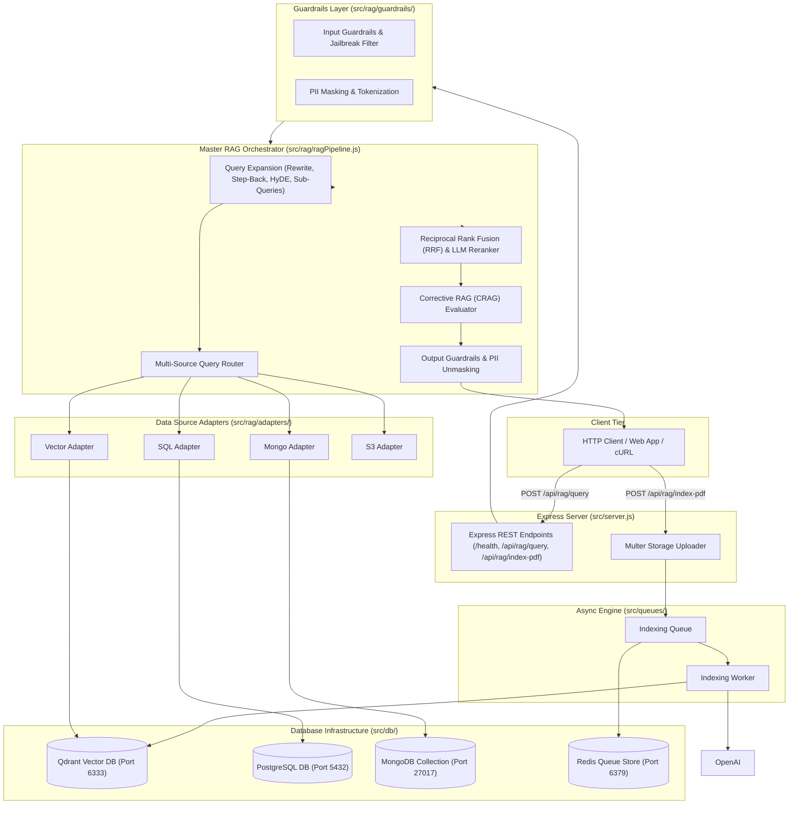
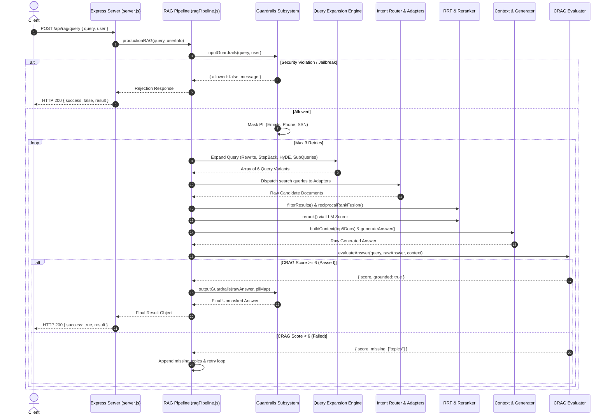

# Master Index — Advanced RAG System (`adv-rag-1`)

Welcome to the **Implementation Guide** for the **Advanced RAG Project (`adv-rag-1`)**. This guide walks backend engineers step-by-step through building a production-grade, 13-step Retrieval-Augmented Generation pipeline featuring multi-layer security guardrails, structured query translation, multi-source storage routing, Reciprocal Rank Fusion (RRF), cross-encoder re-ranking, Corrective RAG (CRAG) evaluation, BullMQ background ingestion, and Express REST API endpoints.

---

## 📁 Project Folder Structure Map

All source code for the project is located inside [`week03/learning/day05/code/adv-rag-1/`](file:///home/aminul/development/gen-ai-cohort/week03/learning/day05/code/adv-rag-1/):

```text
adv-rag-1/
├── docker-compose.yml              # Qdrant (6333), Redis (6379), Postgres (5432)
├── package.json                    # ESM dependencies and scripts
├── .env.example                    # Environment variable configuration template
├── README.md                       # High-level overview
├── implementation guide/           # Comprehensive implementation guide
│   ├── README.md                   # Master Index (This file)
│   ├── chapter-00-overview-setup.md
│   ├── chapter-01-database-llm-foundation.md
│   ├── chapter-02-guardrails-security.md
│   ├── chapter-03-query-expansion-translation.md
│   ├── chapter-04-routing-data-adapters.md
│   ├── chapter-05-retrieval-fusion-reranking.md
│   ├── chapter-06-crag-evaluation-pipeline.md
│   ├── chapter-07-async-queues-worker.md
│   └── chapter-08-express-server-api.md
└── src/
    ├── server.js                   # Express REST API application entry point
    ├── db/                         # Database initialization clients
    │   ├── qdrant.js               # Qdrant REST client & auto-collection setup
    │   ├── postgres.js             # PostgreSQL relational mock database
    │   └── redis.js                # Redis connection setup for BullMQ
    ├── queues/                     # Asynchronous background ingestion
    │   ├── indexingQueue.js        # BullMQ producer queue
    │   └── indexingWorker.js       # Background PDF parser & vector embedder worker
    └── rag/                        # Modular RAG subsystem modules
        ├── llmClient.js            # Unified LLM completion client with local fallbacks
        ├── ragPipeline.js          # Master 13-step RAG pipeline orchestrator
        ├── guardrails/             # Safety & security verification
        │   ├── input.js
        │   ├── jailbreak.js
        │   ├── pii.js
        │   └── output.js
        ├── query/                  # Query transformation engine
        │   ├── rewrite.js
        │   ├── stepBack.js
        │   ├── subQueries.js
        │   └── hyde.js
        ├── routing/                # Intent classification router
        │   └── queryRouter.js
        ├── adapters/               # Multi-source database adapters
        │   ├── vectorAdapter.js
        │   ├── sqlAdapter.js
        │   ├── mongoAdapter.js
        │   └── s3Adapter.js
        ├── retrieval/              # Vector search, fusion & reranking
        │   ├── vectorSearch.js
        │   ├── filtering.js
        │   ├── rrf.js
        │   └── reranker.js
        ├── evaluation/             # Self-reflection & CRAG evaluation
        │   └── crag.js
        └── generation/             # Context building & answer synthesis
            ├── contextBuilder.js
            └── generateAnswer.js
```

---

## 🏗️ System Architecture & Service Ecosystem

The system decouples synchronous REST requests from background PDF parsing and vector generation while integrating multi-source database adapters behind a unified 13-step pipeline.



---

## 🔄 Master 13-Step Production Execution Pipeline



---

## 📚 Table of Contents & Chapter Guide

| Chapter | Title | Primary Files Covered | Key Learning Focus |
| :--- | :--- | :--- | :--- |
| [**Chapter 00**](file:///home/aminul/development/gen-ai-cohort/week03/learning/day05/code/adv-rag-1/implementation%20guide/chapter-00-overview-setup.md) | Overview, Infrastructure & Setup | [`docker-compose.yml`](file:///home/aminul/development/gen-ai-cohort/week03/learning/day05/code/adv-rag-1/docker-compose.yml), [`package.json`](file:///home/aminul/development/gen-ai-cohort/week03/learning/day05/code/adv-rag-1/package.json), [`.env.example`](file:///home/aminul/development/gen-ai-cohort/week03/learning/day05/code/adv-rag-1/.env.example) | Docker compose container infrastructure (Qdrant, Redis, Postgres), ESM configuration, environment default settings. |
| [**Chapter 01**](file:///home/aminul/development/gen-ai-cohort/week03/learning/day05/code/adv-rag-1/implementation%20guide/chapter-01-database-llm-foundation.md) | Database Clients & LLM Wrapper | [`src/db/`](file:///home/aminul/development/gen-ai-cohort/week03/learning/day05/code/adv-rag-1/src/db/) (`qdrant.js`, `postgres.js`, `redis.js`), [`src/rag/llmClient.js`](file:///home/aminul/development/gen-ai-cohort/week03/learning/day05/code/adv-rag-1/src/rag/llmClient.js) | Qdrant client collection auto-provisioning, PostgreSQL relational mock, Redis queue client, unified LLM client with local mock fallback logic. |
| [**Chapter 02**](file:///home/aminul/development/gen-ai-cohort/week03/learning/day05/code/adv-rag-1/implementation%20guide/chapter-02-guardrails-security.md) | Guardrails & Security | [`src/rag/guardrails/`](file:///home/aminul/development/gen-ai-cohort/week03/learning/day05/code/adv-rag-1/src/rag/guardrails/) (`input.js`, `jailbreak.js`, `pii.js`, `output.js`) | Input safety filters, regex jailbreak detection, reversible Regex PII masking engine (`[EMAIL_1]`), and output unmasking. |
| [**Chapter 03**](file:///home/aminul/development/gen-ai-cohort/week03/learning/day05/code/adv-rag-1/implementation%20guide/chapter-03-query-expansion-translation.md) | Query Expansion & Translation | [`src/rag/query/`](file:///home/aminul/development/gen-ai-cohort/week03/learning/day05/code/adv-rag-1/src/rag/query/) (`rewrite.js`, `stepBack.js`, `subQueries.js`, `hyde.js`) | Query Rewriting, Step-Back Prompting, Sub-Query Decomposition, and HyDE hypothetical document generation. |
| [**Chapter 04**](file:///home/aminul/development/gen-ai-cohort/week03/learning/day05/code/adv-rag-1/implementation%20guide/chapter-04-routing-data-adapters.md) | Intent Router & Data Adapters | [`src/rag/routing/queryRouter.js`](file:///home/aminul/development/gen-ai-cohort/week03/learning/day05/code/adv-rag-1/src/rag/routing/queryRouter.js), [`src/rag/adapters/`](file:///home/aminul/development/gen-ai-cohort/week03/learning/day05/code/adv-rag-1/src/rag/adapters/) (`vectorAdapter.js`, `sqlAdapter.js`, `mongoAdapter.js`, `s3Adapter.js`) | Intent-based multi-store routing and data adapter abstractions normalizing records into standard candidate formats. |
| [**Chapter 05**](file:///home/aminul/development/gen-ai-cohort/week03/learning/day05/code/adv-rag-1/implementation%20guide/chapter-05-retrieval-fusion-reranking.md) | Vector Search, Fusion & Reranking | [`src/rag/retrieval/`](file:///home/aminul/development/gen-ai-cohort/week03/learning/day05/code/adv-rag-1/src/rag/retrieval/) (`vectorSearch.js`, `filtering.js`, `rrf.js`, `reranker.js`) | Qdrant Cosine vector search, tenant & access control filtering, Reciprocal Rank Fusion (RRF), and LLM relevance re-ranking. |
| [**Chapter 06**](file:///home/aminul/development/gen-ai-cohort/week03/learning/day05/code/adv-rag-1/implementation%20guide/chapter-06-crag-evaluation-pipeline.md) | CRAG Evaluator & Master Pipeline | [`src/rag/evaluation/crag.js`](file:///home/aminul/development/gen-ai-cohort/week03/learning/day05/code/adv-rag-1/src/rag/evaluation/crag.js), [`src/rag/generation/`](file:///home/aminul/development/gen-ai-cohort/week03/learning/day05/code/adv-rag-1/src/rag/generation/), [`src/rag/ragPipeline.js`](file:///home/aminul/development/gen-ai-cohort/week03/learning/day05/code/adv-rag-1/src/rag/ragPipeline.js) | Corrective RAG (CRAG) score evaluation, self-correction retry feedback loops, and 13-step orchestrator execution. |
| [**Chapter 07**](file:///home/aminul/development/gen-ai-cohort/week03/learning/day05/code/adv-rag-1/implementation%20guide/chapter-07-async-queues-worker.md) | Async Queues & Worker Process | [`src/queues/indexingQueue.js`](file:///home/aminul/development/gen-ai-cohort/week03/learning/day05/code/adv-rag-1/src/queues/indexingQueue.js), [`src/queues/indexingWorker.js`](file:///home/aminul/development/gen-ai-cohort/week03/learning/day05/code/adv-rag-1/src/queues/indexingWorker.js) | BullMQ Redis queue configuration, PDF parsing, sliding window chunker, batch OpenAI vector embeddings, and Qdrant upserts. |
| [**Chapter 08**](file:///home/aminul/development/gen-ai-cohort/week03/learning/day05/code/adv-rag-1/implementation%20guide/chapter-08-express-server-api.md) | Express REST Server API | [`src/server.js`](file:///home/aminul/development/gen-ai-cohort/week03/learning/day05/code/adv-rag-1/src/server.js) | Express REST endpoints (`GET /health`, `POST /api/rag/query`, `POST /api/rag/index-pdf`), Multer file upload security, and cURL verification. |

---

## ⚡ Quick Start Command Cheat Sheet

```bash
# 1. Navigate to project root
cd week03/learning/day05/code/adv-rag-1

# 2. Start Qdrant, Redis, and Postgres containers
npm run services:up

# 3. Install NPM dependencies
npm install

# 4. Copy environment template
cp .env.example .env

# 5. In Terminal 1: Start the Express REST Server
npm run start

# 6. In Terminal 2: Start Background Ingestion Worker
npm run worker
```
