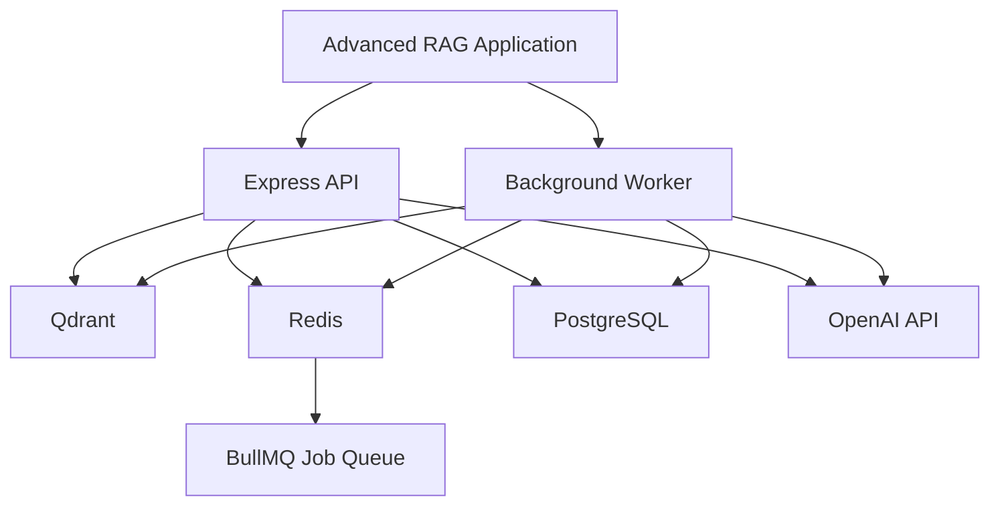
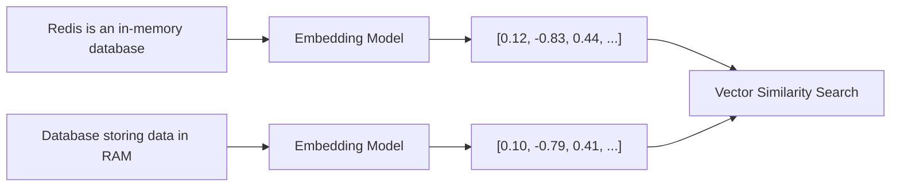
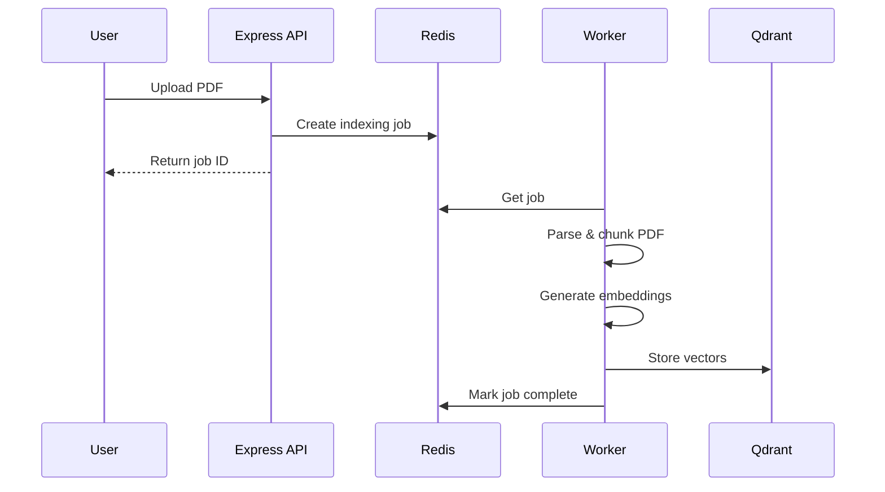
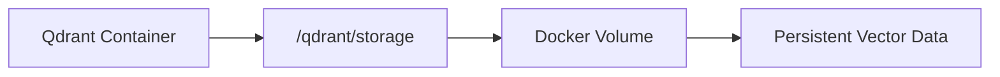
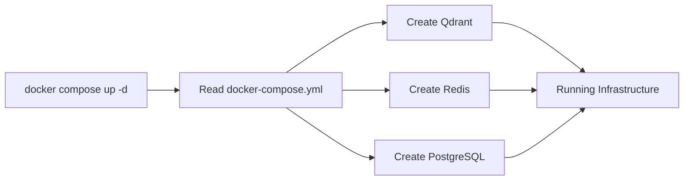
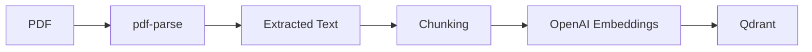
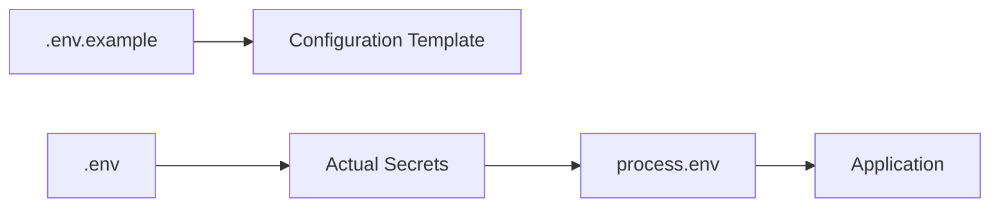
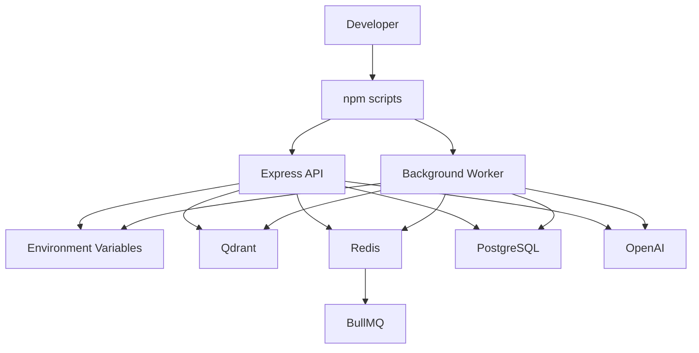
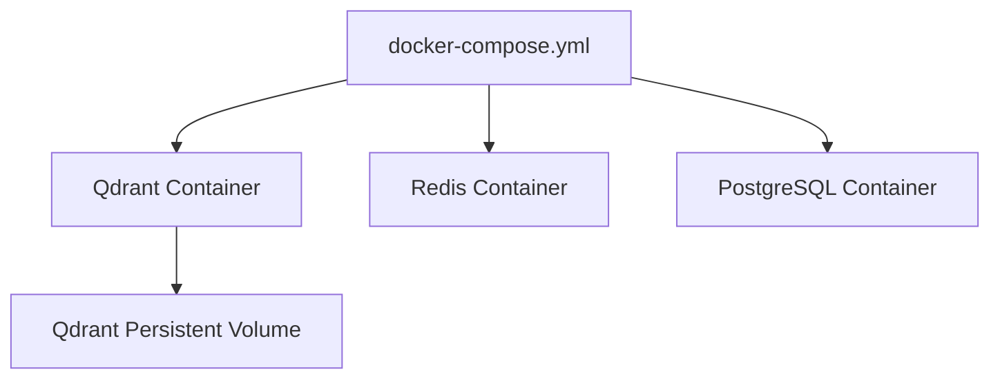
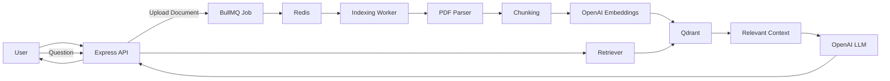

# Chapter 0 — Project Foundation, Infrastructure & Environment Setup

## 1. What Are We Building?

Before we build the actual **Advanced RAG (Retrieval-Augmented Generation)** system, we need to prepare the infrastructure that the application will depend on.

Think of the application as a company:

* **Express** → receptionist/API layer
* **PostgreSQL** → structured business data
* **Qdrant** → long-term semantic/vector memory
* **Redis** → fast temporary data + job queue storage
* **BullMQ** → manages background jobs
* **OpenAI** → embedding and LLM capabilities
* **Docker** → runs our infrastructure consistently

The important idea is:

> **We are not building the RAG system yet. We are building the foundation on which the RAG system will run.**

---

# 2. High-Level Architecture

Our initial infrastructure looks like this:



### Why do we need separate services?

Because each database/service solves a different problem.

| Service        | Purpose                                         |
| -------------- | ----------------------------------------------- |
| **Qdrant**     | Stores vectors/embeddings for semantic search   |
| **Redis**      | Fast in-memory storage and BullMQ queue backend |
| **BullMQ**     | Runs expensive tasks asynchronously             |
| **PostgreSQL** | Stores structured application data              |
| **OpenAI**     | Generates embeddings and LLM responses          |
| **Express**    | Provides HTTP API                               |
| **Docker**     | Runs infrastructure in isolated containers      |

---

# 3. Why Qdrant?

Traditional databases are excellent when we search using exact values.

For example:

```text
WHERE name = 'John'
```

But RAG needs a different kind of search.

Suppose a document contains:

> "Redis is an in-memory data structure store."

A user asks:

> "What database keeps frequently accessed information in RAM?"

The words aren't identical, but the **meaning is related**.

We convert text into numerical vectors called **embeddings**.



Qdrant stores those vectors and allows us to find semantically similar content.

---

# 4. Why Redis + BullMQ?

Some operations in RAG can take a significant amount of time.

For example:

```text
Upload PDF
    ↓
Read PDF
    ↓
Extract text
    ↓
Split into chunks
    ↓
Generate embeddings
    ↓
Store vectors in Qdrant
```

We don't want the user to wait for all of this inside an HTTP request.

Instead:



This is the basic idea behind **asynchronous processing**.

Redis stores the queue state, while BullMQ provides the queue/worker abstraction.

---

# 5. Why PostgreSQL?

Qdrant is excellent for vectors, but it shouldn't necessarily hold every piece of application information.

For example, we might eventually have:

```text
users
documents
document_metadata
indexing_jobs
permissions
chat_sessions
```

These are structured records.

PostgreSQL is designed for this type of relational data.

So our architecture becomes:

```text
PostgreSQL
    ↓
Structured application data

Qdrant
    ↓
Semantic/vector data

Redis
    ↓
Fast temporary state + queues
```

---

# 6. Docker Infrastructure

We can run all these infrastructure services directly on our machine, but that creates unnecessary setup problems.

For example:

```text
Install PostgreSQL
Install Redis
Install Qdrant
Configure ports
Configure users
Configure databases
```

Instead, Docker allows us to describe the infrastructure in one file:

```text
docker-compose.yml
```

Then we can start everything with:

```bash
docker compose up -d
```

---

# 7. Complete `docker-compose.yml`

Create:

```text
adv-rag-1/
└── docker-compose.yml
```

Use:

```yaml
services:
  qdrant:
    image: qdrant/qdrant:latest
    container_name: adv_rag_qdrant
    ports:
      - "6333:6333"
      - "6334:6334"
    volumes:
      - qdrant_storage:/qdrant/storage

  redis:
    image: redis:7-alpine
    container_name: adv_rag_redis
    ports:
      - "6379:6379"

  postgres:
    image: postgres:15-alpine
    container_name: adv_rag_postgres
    environment:
      POSTGRES_USER: postgres
      POSTGRES_PASSWORD: postgres
      POSTGRES_DB: app_db
    ports:
      - "5432:5432"

volumes:
  qdrant_storage:
```

---

# 8. Understanding `docker-compose.yml`

Let's break it down.

## `services`

```yaml
services:
```

A Docker Compose file contains multiple services.

Here we have:

```text
qdrant
redis
postgres
```

Each service represents one container.

---

## Qdrant

```yaml
qdrant:
  image: qdrant/qdrant:latest
```

This tells Docker:

> Create a container using the Qdrant image.

The image comes from a container registry.

---

### Container name

```yaml
container_name: adv_rag_qdrant
```

This gives our container a predictable name.

Instead of Docker generating a name, we'll have:

```text
adv_rag_qdrant
```

---

### Ports

```yaml
ports:
  - "6333:6333"
  - "6334:6334"
```

This follows:

```text
HOST_PORT:CONTAINER_PORT
```

So:

```text
localhost:6333
       ↓
container:6333
```

Port `6333` is Qdrant's HTTP API.

Port `6334` is used for Qdrant's gRPC interface.

Our application can therefore connect using:

```text
http://localhost:6333
```

---

## Qdrant volume

```yaml
volumes:
  - qdrant_storage:/qdrant/storage
```

This part is extremely important.

Containers are designed to be replaceable.

If we remove the container, we don't want all our vector data to disappear.

The volume provides persistent storage:



So even if the Qdrant container is recreated, the data can remain in the Docker volume.

---

# 9. Redis

```yaml
redis:
  image: redis:7-alpine
  container_name: adv_rag_redis
  ports:
    - "6379:6379"
```

We're using Redis 7 with Alpine Linux.

Redis listens on:

```text
6379
```

Our Node.js application will eventually connect using:

```text
localhost:6379
```

BullMQ will use this Redis instance to manage background jobs.

---

# 10. PostgreSQL

```yaml
postgres:
  image: postgres:15-alpine
```

This creates a PostgreSQL 15 container.

Then:

```yaml
environment:
  POSTGRES_USER: postgres
  POSTGRES_PASSWORD: postgres
  POSTGRES_DB: app_db
```

These environment variables tell the official PostgreSQL image to initialize:

```text
Username: postgres
Password: postgres
Database: app_db
```

The database is exposed through:

```yaml
ports:
  - "5432:5432"
```

Therefore our Node.js application can connect to:

```text
localhost:5432
```

### ⚠️ Development vs production

These credentials are fine for a local learning environment:

```text
postgres / postgres
```

but **do not use these credentials in production**.

---

# 11. Starting the Infrastructure

Run:

```bash
docker compose up -d
```

Let's understand what happens.



The `-d` means:

> Run the containers in detached/background mode.

Your terminal becomes available again.

---

# 12. Verify Containers

Run:

```bash
docker ps
```

You should see containers similar to:

```text
adv_rag_qdrant
adv_rag_redis
adv_rag_postgres
```

The important thing isn't the exact formatting of `docker ps`.

The important thing is that all three containers have a running status.

---

# 13. Stopping Infrastructure

You can stop the Compose services using:

```bash
docker compose down
```

This removes the containers created by Compose.

However, because Qdrant uses a named volume:

```yaml
qdrant_storage:
```

the vector data can persist.

If you intentionally want to remove volumes as well:

```bash
docker compose down -v
```

⚠️ Be careful with `-v` because it can remove persistent database data stored in Docker volumes.

---

# 14. Project Configuration

Now that our infrastructure exists, we need to configure the Node.js project.

The project will use **ES Modules (ESM)**.

Create:

```text
package.json
```

---

# 15. Complete `package.json`

```json
{
  "name": "adv-rag-1",
  "version": "1.0.0",
  "description": "Production-grade Advanced RAG system",
  "license": "ISC",
  "type": "module",
  "main": "src/server.js",
  "scripts": {
    "start": "node src/server.js",
    "dev": "node --watch src/server.js",
    "worker": "node src/queues/indexingWorker.js",
    "services:up": "docker compose up -d",
    "services:down": "docker compose down"
  },
  "dependencies": {
    "@qdrant/js-client-rest": "^1.13.0",
    "bullmq": "^5.34.0",
    "dotenv": "^16.4.7",
    "express": "^4.21.2",
    "ioredis": "^5.4.2",
    "multer": "^2.0.1",
    "openai": "^4.77.0",
    "pdf-parse": "^1.1.1"
  }
}
```

> Package versions can change over time. For a new project, it's worth checking current compatible versions rather than blindly copying old versions.

---

# 16. Understanding `"type": "module"`

This line:

```json
"type": "module"
```

tells Node.js:

> Treat `.js` files as ES Modules.

That means we can write:

```js
import express from "express";
```

instead of CommonJS:

```js
const express = require("express");
```

We can also use:

```js
export default something;
```

and:

```js
export { something };
```

This gives us the modern JavaScript module system.

---

# 17. Understanding the NPM Scripts

## Start the API

```json
"start": "node src/server.js"
```

Running:

```bash
npm start
```

is equivalent to:

```bash
node src/server.js
```

---

## Development mode

```json
"dev": "node --watch src/server.js"
```

Run:

```bash
npm run dev
```

Node watches the source files.

When a file changes, Node automatically restarts the server.

This is useful during development.

---

## Worker

```json
"worker": "node src/queues/indexingWorker.js"
```

This starts our background indexing worker.

Later, we'll have something like:

```text
API
 ↓
BullMQ
 ↓
Redis
 ↓
Indexing Worker
 ↓
PDF processing
 ↓
Embeddings
 ↓
Qdrant
```

So the API and worker are separate processes.

---

## Infrastructure commands

```json
"services:up": "docker compose up -d"
```

Instead of manually typing:

```bash
docker compose up -d
```

we can simply run:

```bash
npm run services:up
```

Similarly:

```bash
npm run services:down
```

stops the infrastructure.

---

# 18. Understanding the Dependencies

Let's understand why each package exists.

### Qdrant client

```json
"@qdrant/js-client-rest"
```

Allows Node.js to communicate with Qdrant.

Conceptually:

```text
Node.js
   ↓
Qdrant JS Client
   ↓
Qdrant
```

---

### BullMQ

```json
"bullmq"
```

Provides the job queue system.

For example:

```text
"Index this PDF"
```

can become a background job.

---

### ioredis

```json
"ioredis"
```

is a Redis client for Node.js.

BullMQ uses Redis internally.

---

### dotenv

```json
"dotenv"
```

loads values from `.env` into:

```js
process.env
```

For example:

```env
PORT=3000
```

can be accessed with:

```js
process.env.PORT
```

---

### Express

```json
"express"
```

provides our HTTP API server.

Eventually we'll have endpoints such as:

```text
POST /documents
POST /query
GET  /jobs/:jobId
```

---

### Multer

```json
"multer"
```

handles multipart file uploads.

This will become useful when users upload PDFs.

---

### OpenAI

```json
"openai"
```

provides access to OpenAI models.

We'll eventually use it for things such as:

```text
Text → Embedding
Prompt → LLM response
```

---

### pdf-parse

```json
"pdf-parse"
```

allows us to extract text from PDF files.

The future indexing pipeline will look approximately like:



---

# 19. Install Dependencies

Run:

```bash
npm install
```

NPM reads:

```text
package.json
```

and installs the dependencies into:

```text
node_modules/
```

It also generates:

```text
package-lock.json
```

which locks dependency versions for reproducible installation.

---

# 20. Environment Variables

Now we need to separate configuration from our source code.

Create:

```text
.env.example
```

with:

```env
# OpenAI
OPENAI_API_KEY=your_openai_api_key_here
OPENAI_MODEL=gpt-4o-mini

# Server
PORT=3000

# Qdrant
QDRANT_URL=http://localhost:6333
QDRANT_COLLECTION=production_rag_docs

# Redis / BullMQ
REDIS_HOST=localhost
REDIS_PORT=6379

# PostgreSQL
POSTGRES_HOST=localhost
POSTGRES_PORT=5432
POSTGRES_DB=app_db
POSTGRES_USER=postgres
POSTGRES_PASSWORD=postgres

# MongoDB
MONGO_URI=mongodb://localhost:27017/app_docs

# AWS S3
AWS_REGION=us-east-1
S3_BUCKET_NAME=production-rag-assets
```

Then create the actual:

```text
.env
```

and put your real values there.

---

# 21. Why `.env.example` and `.env`?

This is an important development practice.

### `.env.example`

Contains the **configuration template**:

```env
OPENAI_API_KEY=your_openai_api_key_here
```

It can safely be committed to Git.

### `.env`

Contains your actual secrets:

```env
OPENAI_API_KEY=actual-secret-key
```

It should generally **not** be committed.

Your `.gitignore` should contain:

```gitignore
.env
node_modules/
```

The basic idea is:



---

# 22. How `dotenv` Connects Everything

Later, our application will initialize environment variables with:

```js
import "dotenv/config";
```

Then:

```env
PORT=3000
```

becomes available through:

```js
process.env.PORT
```

For example:

```js
const port = process.env.PORT || 3000;
```

So instead of hardcoding:

```js
const port = 3000;
```

we make the configuration external.

---

# 23. Important Observation About MongoDB and S3

The original configuration contains:

```env
MONGO_URI=mongodb://localhost:27017/app_docs
```

and:

```env
AWS_REGION=us-east-1
S3_BUCKET_NAME=production-rag-assets
```

But our Docker Compose file currently starts only:

```text
Qdrant
Redis
PostgreSQL
```

There is **no MongoDB container** and no local S3 service.

That isn't necessarily wrong.

It simply means these variables are **future configuration** or are intended for external services.

At this stage:

```text
Qdrant       → configured
Redis        → configured
PostgreSQL   → configured

MongoDB      → not running
S3           → not configured locally
```

Don't assume that defining an environment variable automatically creates or connects a service.

---

# 24. Final Project Structure

After this chapter, the project should look approximately like:

```text
adv-rag-1/
│
├── docker-compose.yml
├── package.json
├── package-lock.json
│
├── .env
├── .env.example
├── .gitignore
│
└── src/
    ├── server.js
    └── queues/
        └── indexingWorker.js
```

The last two files don't necessarily need to be fully implemented yet. They'll be developed in subsequent chapters.

---

# 25. Complete Infrastructure Flow

Let's put everything together.



And Docker manages the local infrastructure:



---

# 26. What Happens When We Start the Project?

There are actually two different startup concepts.

### Infrastructure

```bash
npm run services:up
```

starts:

```text
Docker
 ├── Qdrant
 ├── Redis
 └── PostgreSQL
```

### Application

```bash
npm run dev
```

starts:

```text
Node.js
 └── Express API
```

### Worker

```bash
npm run worker
```

starts:

```text
Node.js
 └── Indexing Worker
```

So during development you may have:

```text
Terminal 1
──────────
npm run services:up


Terminal 2
──────────
npm run dev


Terminal 3
──────────
npm run worker
```

This separation is intentional.

---

# 27. The Big Picture

At this point, **we haven't implemented RAG yet**.

We've only prepared the infrastructure.

The future system will eventually look like:



This is the architecture that the later chapters will gradually build.

---

# 28. Chapter Checklist

Before moving to the next chapter, verify:

### Docker

```bash
docker compose up -d
```

Then:

```bash
docker ps
```

You should have:

```text
Qdrant
Redis
PostgreSQL
```

### Node.js

```bash
npm install
```

should complete successfully.

### Environment

You should have:

```text
.env
.env.example
```

and your `.env` should contain the actual OpenAI API key rather than the placeholder.

### Git

Make sure `.env` isn't committed:

```gitignore
.env
node_modules/
```

---

# 29. Key Concepts to Remember

Don't just memorize the commands. Understand these relationships:

```text
Docker
  ↓
Runs infrastructure

Qdrant
  ↓
Stores/searches embeddings

PostgreSQL
  ↓
Stores structured application data

Redis
  ↓
Fast storage + queue backend

BullMQ
  ↓
Manages background jobs

OpenAI
  ↓
Embeddings + LLM

Express
  ↓
Application/API layer
```

And the most important architectural idea from this chapter is:

> **The API should not necessarily perform every expensive operation synchronously.**

For document indexing, we'll eventually use:

```text
Upload
  ↓
Create Job
  ↓
Redis/BullMQ
  ↓
Worker
  ↓
Process Document
  ↓
Generate Embeddings
  ↓
Qdrant
```

That separation is one of the foundations of making an RAG system more scalable and production-oriented.

### Next chapter

**Chapter 1 — Database Clients & Shared LLM Client** should build on this foundation by showing how the Node.js application actually connects to **Qdrant, PostgreSQL/other data stores, Redis, and OpenAI**, and how those clients are initialized and reused throughout the application.
