# Chapter 01 — Database Clients & Shared LLM Client

## 1. Chapter Goal

In Chapter 0, we prepared our infrastructure:

```text
Docker
 ├── Qdrant
 ├── Redis
 └── PostgreSQL
```

But our Node.js application still doesn't know how to communicate with those services.

This chapter creates the **application-side connection and abstraction layers**.

We will build:

```text
src/
├── db/
│   ├── qdrant.js
│   ├── postgres.js
│   └── redis.js
│
└── rag/
    └── llmClient.js
```

The architecture becomes:

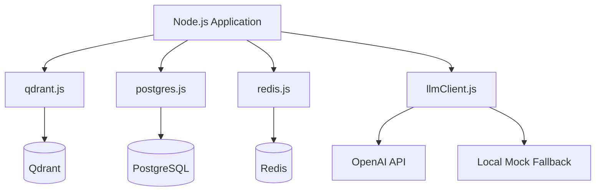

The important idea is **abstraction**.

Instead of every part of the application directly creating database connections or calling OpenAI, we create shared modules.

For example:

```js
await generateLLM({
  system: "...",
  user: "..."
});
```

The rest of the application doesn't need to care whether the response came from OpenAI or the local fallback.

---

# 2. Why Do We Need These Abstractions?

Imagine that every file in our application directly does this:

```js
const openai = new OpenAI(...);
```

and another file does it again:

```js
const openai = new OpenAI(...);
```

and another:

```js
const openai = new OpenAI(...);
```

Now OpenAI configuration is scattered everywhere.

The same problem can happen with databases.

Instead, we create:

```text
src/db/qdrant.js
src/db/redis.js
src/db/postgres.js
src/rag/llmClient.js
```

These become **shared infrastructure modules**.

Other parts of the application simply import what they need.

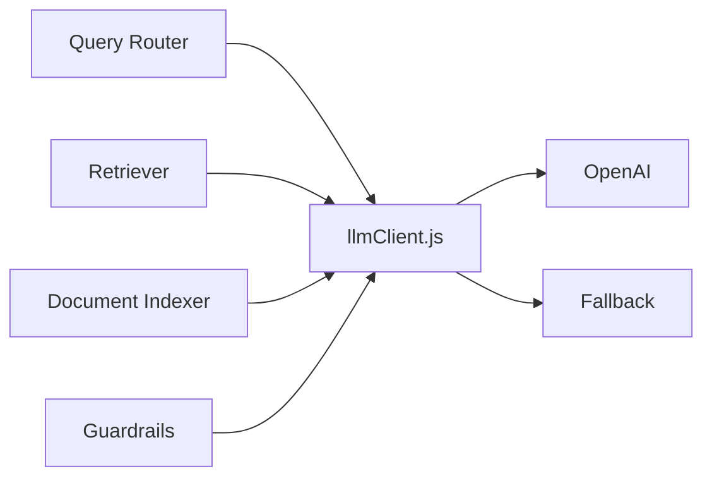

This gives us one place to change the underlying implementation.

---

# 3. Qdrant Client

## What does this module do?

`src/db/qdrant.js` has three responsibilities:

1. Create a Qdrant client.
2. Make sure the required collection exists.
3. Provide a reusable vector-search function.

The flow is:

```text
Application
     ↓
qdrantClient
     ↓
Qdrant Server
     ↓
Collection
     ↓
Vector Search
```

---

# 4. Complete `src/db/qdrant.js`

```javascript
import { QdrantClient } from "@qdrant/js-client-rest";
import dotenv from "dotenv";

dotenv.config();

const qdrantUrl =
  process.env.QDRANT_URL || "http://localhost:6333";

export const COLLECTION_NAME =
  process.env.QDRANT_COLLECTION || "production_rag_docs";

export const qdrantClient = new QdrantClient({
  url: qdrantUrl,
});

/**
 * Initialize Qdrant collection if it does not already exist.
 */
export async function initQdrantCollection(vectorSize = 1536) {
  try {
    const result = await qdrantClient.getCollections();

    const exists = result.collections.some(
      (collection) => collection.name === COLLECTION_NAME
    );

    if (!exists) {
      console.log(
        `[Qdrant DB] Creating collection "${COLLECTION_NAME}"...`
      );

      await qdrantClient.createCollection(COLLECTION_NAME, {
        vectors: {
          size: vectorSize,
          distance: "Cosine",
        },
      });

      console.log(
        `[Qdrant DB] Collection "${COLLECTION_NAME}" created successfully.`
      );
    }
  } catch (error) {
    console.warn(
      `[Qdrant DB Warning] Could not connect to Qdrant at ${qdrantUrl}. ` +
        `Using fallback vector search mode. Error:`,
      error.message
    );
  }
}

/**
 * Search Qdrant using an embedding vector.
 */
export async function searchQdrant(
  vector,
  limit = 5,
  filter = null
) {
  try {
    const searchParams = {
      vector,
      limit,
      with_payload: true,
    };

    if (filter) {
      searchParams.filter = filter;
    }

    return await qdrantClient.search(
      COLLECTION_NAME,
      searchParams
    );
  } catch (error) {
    console.warn(
      `[Qdrant DB] Qdrant search fallback: ${error.message}`
    );

    return [];
  }
}
```

---

# 5. Understanding the Qdrant Code

## Importing the Qdrant client

```javascript
import { QdrantClient } from "@qdrant/js-client-rest";
```

This imports the official JavaScript REST client.

Without it, we'd have to manually construct HTTP requests to Qdrant.

Instead:

```javascript
qdrantClient.search(...)
```

handles the communication for us.

---

## Loading environment variables

```javascript
import dotenv from "dotenv";

dotenv.config();
```

This loads:

```text
.env
```

into:

```javascript
process.env
```

So this:

```env
QDRANT_URL=http://localhost:6333
```

becomes:

```javascript
process.env.QDRANT_URL
```

---

# 6. Qdrant URL

```javascript
const qdrantUrl =
  process.env.QDRANT_URL || "http://localhost:6333";
```

This uses a fallback.

The logic is:

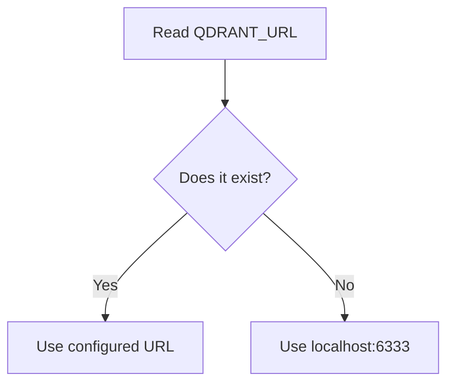

Therefore, if `.env` contains:

```env
QDRANT_URL=http://localhost:6333
```

that value is used.

If it doesn't exist, we default to:

```text
http://localhost:6333
```

---

# 7. Collection Name

```javascript
export const COLLECTION_NAME =
  process.env.QDRANT_COLLECTION ||
  "production_rag_docs";
```

A Qdrant database contains **collections**.

You can think of a collection somewhat like a table in a traditional database, although the underlying structure is different.

Our collection is:

```text
production_rag_docs
```

It will eventually contain vectors representing document chunks.

Conceptually:

```text
production_rag_docs
│
├── chunk 1 → embedding
├── chunk 2 → embedding
├── chunk 3 → embedding
└── chunk N → embedding
```

---

# 8. Creating the Qdrant Client

```javascript
export const qdrantClient = new QdrantClient({
  url: qdrantUrl,
});
```

This creates the reusable client.

Now any module can do:

```javascript
import { qdrantClient } from "./db/qdrant.js";
```

instead of creating another Qdrant client.

---

# 9. Why `initQdrantCollection()`?

We don't want the application to crash because the collection hasn't been created yet.

Therefore:

```javascript
await initQdrantCollection();
```

can perform:

```text
Does collection exist?
       ↓
     Yes → Continue
       ↓
      No
       ↓
Create collection
```

---

# 10. Checking Existing Collections

```javascript
const result =
  await qdrantClient.getCollections();
```

Qdrant returns the available collections.

Then:

```javascript
const exists = result.collections.some(
  (collection) => collection.name === COLLECTION_NAME
);
```

`.some()` asks:

> Does at least one collection satisfy this condition?

For example:

```text
Collections:
 ├── users
 ├── documents
 └── production_rag_docs
```

The expression finds:

```text
production_rag_docs
        ↓
      exists
        ↓
       true
```

---

# 11. Creating the Collection

If it doesn't exist:

```javascript
await qdrantClient.createCollection(COLLECTION_NAME, {
  vectors: {
    size: vectorSize,
    distance: "Cosine",
  },
});
```

The two important vector settings are:

### `size`

```javascript
size: vectorSize
```

This defines the number of dimensions in each embedding vector.

The default here is:

```javascript
vectorSize = 1536
```

So the expected vector looks conceptually like:

```text
[
  0.123,
  -0.456,
  0.789,
  ...
]
```

with 1536 dimensions.

### Important

The vector size **must match the embedding model you use**.

You cannot generate a 1536-dimensional embedding and insert it into a collection configured for a different dimension.

---

# 12. Why Cosine Distance?

```javascript
distance: "Cosine"
```

RAG typically needs to determine:

> How semantically similar are these two vectors?

Cosine similarity is commonly used for embedding-based semantic search.

Conceptually:

```text
Query embedding
       ↓
Qdrant
       ↓
Compare against document embeddings
       ↓
Most similar vectors
       ↓
Relevant document chunks
```

---

# 13. Qdrant Search

Now look at:

```javascript
export async function searchQdrant(
  vector,
  limit = 5,
  filter = null
)
```

This function accepts:

```text
vector
limit
filter
```

For example:

```javascript
await searchQdrant(queryEmbedding, 5);
```

means:

> Search using this embedding and return up to five results.

---

# 14. Building Search Parameters

```javascript
const searchParams = {
  vector,
  limit,
  with_payload: true,
};
```

`with_payload: true` is important.

A vector by itself isn't very useful.

We need the associated document information.

For example:

```text
Vector
+
Payload
   ├── text
   ├── documentId
   ├── page
   └── metadata
```

Then the retriever can return the actual text to the LLM.

---

# 15. Optional Filtering

```javascript
if (filter) {
  searchParams.filter = filter;
}
```

This means we can optionally restrict the search.

For example, conceptually:

```text
Search all documents
```

versus:

```text
Search only documents belonging to user X
```

or:

```text
Search only documents from category Y
```

This becomes useful for security and multi-tenant applications.

---

# 16. Graceful Qdrant Failure

Notice this:

```javascript
catch (error) {
  console.warn(...);
  return [];
}
```

Instead of crashing the entire application, the function returns:

```javascript
[]
```

This is a **fallback behavior**.

However, there's an important distinction:

> Returning an empty array is not a real vector-search fallback.

It simply means:

> "Qdrant isn't available, so there are no results."

A production system might instead use another retrieval mechanism, retry logic, health checks, or fail the request explicitly depending on the use case.

The original guide calls this "fallback vector search mode," but technically this implementation is an **empty-result fallback**.

---

# 17. PostgreSQL Client

Now we have:

```text
src/db/postgres.js
```

There's an important thing to understand before looking at the code.

### This is NOT a real PostgreSQL connection.

The chapter describes it as a PostgreSQL relational client, but the implementation doesn't import:

```text
pg
```

and doesn't connect to PostgreSQL.

Instead, it is a **mock data-access layer**.

That's useful during development because other parts of the RAG system can be developed without requiring real database queries.

---

# 18. Complete `src/db/postgres.js`

```javascript
import dotenv from "dotenv";

dotenv.config();

/**
 * PostgreSQL Data Access Client
 *
 * This is currently a mock implementation.
 * It provides realistic responses so the rest of the
 * application can be developed before real PostgreSQL
 * integration is added.
 */
export async function queryPostgres(
  sql,
  params = []
) {
  console.log(
    `[PostgreSQL DB] Executing query: ${sql}`,
    params
  );

  const normalizedSql = sql.toLowerCase();

  // Return realistic mock data for account/billing queries.
  if (
    normalizedSql.includes("account") ||
    normalizedSql.includes("plan")
  ) {
    return [
      {
        userId: "usr_123",
        userName: "John Doe",
        plan: "Enterprise Pro",
        billingStatus: "Active",
        accountBalance: "$250.00",
        refundEligibility:
          "Eligible within 30 days of renewal",
        lastPaymentDate: "2026-08-01",
      },
    ];
  }

  return [];
}
```

---

# 19. Why Create a Mock Database Layer?

Suppose later we have a query router:

```text
User:
"What is my account balance?"
```

The router might decide:

```text
VECTOR_DB? ❌
S3? ❌
AUTH_DB? ✅
```

Then:

```javascript
queryPostgres(...)
```

is called.

For now, we don't need a real database query to test the rest of the system.

The mock can return:

```json
{
  "accountBalance": "$250.00"
}
```

Later, we can replace the implementation with a real PostgreSQL client without changing every caller.

That's the benefit of abstraction.

---

# 20. How the Mock Query Works

The function receives:

```javascript
queryPostgres(sql, params)
```

For example:

```javascript
queryPostgres(
  "SELECT * FROM account WHERE user_id = $1",
  ["usr_123"]
);
```

The current implementation doesn't execute this SQL.

It logs it:

```javascript
console.log(...)
```

Then checks whether the SQL contains:

```text
account
```

or:

```text
plan
```

If yes, it returns mock data.

---

# 21. Why `toLowerCase()`?

```javascript
const normalizedSql = sql.toLowerCase();
```

This makes matching case-insensitive.

Without normalization:

```text
"SELECT * FROM ACCOUNT"
```

and:

```text
"select * from account"
```

would behave differently.

After:

```javascript
toLowerCase()
```

both become lowercase.

---

# 22. Redis Client

Redis is slightly different.

BullMQ needs Redis connection configuration.

We therefore create a reusable configuration object and a client factory.

---

# 23. Complete `src/db/redis.js`

```javascript
import Redis from "ioredis";
import dotenv from "dotenv";

dotenv.config();

const redisHost =
  process.env.REDIS_HOST || "localhost";

const redisPort = parseInt(
  process.env.REDIS_PORT || "6379",
  10
);

export const redisConnection = {
  host: redisHost,
  port: redisPort,
  maxRetriesPerRequest: null,
};

export const createRedisClient = () => {
  return new Redis(redisConnection);
};
```

---

# 24. Understanding Redis Configuration

First:

```javascript
const redisHost =
  process.env.REDIS_HOST || "localhost";
```

The default is:

```text
localhost
```

Then:

```javascript
const redisPort = parseInt(
  process.env.REDIS_PORT || "6379",
  10
);
```

Environment variables are strings.

So:

```env
REDIS_PORT=6379
```

is read as:

```javascript
"6379"
```

But we want:

```javascript
6379
```

Therefore:

```javascript
parseInt("6379", 10)
```

converts the string into a number.

---

# 25. Why `maxRetriesPerRequest: null`?

```javascript
maxRetriesPerRequest: null
```

This is particularly relevant when using Redis with **BullMQ**.

BullMQ workers need Redis connections that don't unexpectedly fail a command after a limited number of retries in the way a normal request/response Redis client might.

So this configuration is intentionally provided for queue-related usage.

---

# 26. Why a Client Factory?

We don't export only:

```javascript
const redisClient = new Redis(...)
```

Instead we export:

```javascript
createRedisClient
```

which creates a new connection when called.

```javascript
const redis = createRedisClient();
```

This is useful because different components may require different Redis connections.

For example:

```text
Application
    │
    ├── Redis connection
    │
    ├── BullMQ Queue
    │
    └── BullMQ Worker
```

The exact connection lifecycle should be managed deliberately as the application grows.

---

# 27. Shared LLM Client

Now we reach one of the most important modules:

```text
src/rag/llmClient.js
```

The goal is to hide the complexity of talking to the LLM.

Instead of every RAG component doing:

```javascript
openai.chat.completions.create(...)
```

we expose:

```javascript
generateLLM(...)
```

The architecture becomes:

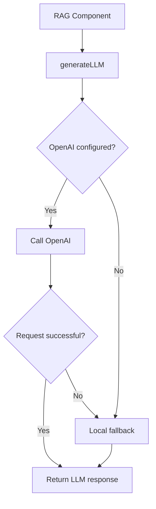

This is extremely useful for local development.

---

# 28. Complete `src/rag/llmClient.js`

```javascript
import OpenAI from "openai";
import dotenv from "dotenv";

dotenv.config();

const apiKey = process.env.OPENAI_API_KEY;

const model =
  process.env.OPENAI_MODEL || "gpt-4o-mini";

let openai = null;

if (
  apiKey &&
  apiKey !== "your_openai_api_key_here"
) {
  openai = new OpenAI({
    apiKey,
  });
}

/**
 * Unified LLM Generation Helper.
 *
 * Attempts to use OpenAI when an API key is configured.
 * If OpenAI is unavailable or the request fails,
 * deterministic local fallback responses are returned.
 */
export async function generateLLM({
  system,
  user,
}) {
  if (openai) {
    try {
      const response =
        await openai.chat.completions.create({
          model,
          messages: [
            {
              role: "system",
              content: system,
            },
            {
              role: "user",
              content: user,
            },
          ],
          temperature: 0.2,
        });

      return {
        text:
          response.choices[0].message.content.trim(),
      };
    } catch (err) {
      console.warn(
        `[LLM Client Warning] OpenAI call failed ` +
          `(${err.message}). Using local fallback generation logic.`
      );
    }
  }

  const sysLower = system.toLowerCase();
  const userLower = user.toLowerCase();

  // Query Rewrite fallback.
  if (sysLower.includes("rewrite the user query")) {
    const trimmedUser = user.trim();

    return {
      text: trimmedUser.endsWith("?")
        ? trimmedUser
        : `${trimmedUser} details and clarification?`,
    };
  }

  // Step-Back Prompting fallback.
  if (
    sysLower.includes("broader conceptual question")
  ) {
    if (userLower.includes("refund")) {
      return {
        text:
          "What general principles and policies govern " +
          "customer subscription refunds and billing?",
      };
    }

    return {
      text:
        `What are the core background concepts and ` +
        `principles related to: ${user}?`,
    };
  }

  // Sub-Query Decomposition fallback.
  if (
    sysLower.includes(
      "3-5 independent retrieval questions"
    )
  ) {
    return {
      text: JSON.stringify({
        queries: [
          `1. Terms and conditions regarding ${user}`,
          `2. User eligibility criteria for ${user}`,
          `3. Standard operating procedures for ${user}`,
        ],
      }),
    };
  }

  // HyDE fallback.
  if (
    sysLower.includes("hypothetical document")
  ) {
    return {
      text:
        `Hypothetical document passage addressing: ${user}. ` +
        "Standard enterprise policies specify terms, " +
        "eligibility, processing timelines, and account rules.",
    };
  }

  // Query Router fallback.
  if (sysLower.includes("query router")) {
    if (
      userLower.includes("balance") ||
      userLower.includes("account")
    ) {
      return {
        text: JSON.stringify({
          targetStore: "AUTH_DB",
        }),
      };
    }

    if (
      userLower.includes("refund") &&
      userLower.includes("plan")
    ) {
      return {
        text: JSON.stringify({
          targetStore: "MULTI_STORE",
        }),
      };
    }

    if (
      userLower.includes("download") ||
      userLower.includes("file") ||
      userLower.includes("invoice")
    ) {
      return {
        text: JSON.stringify({
          targetStore: "S3",
        }),
      };
    }

    return {
      text: JSON.stringify({
        targetStore: "VECTOR_DB",
      }),
    };
  }

  // Grounded generation fallback.
  if (
    sysLower.includes("grounded assistant")
  ) {
    return {
      text:
        "Based on the provided documentation context, " +
        "customer refund requests are processed according " +
        "to the plan terms. Eligible accounts are entitled " +
        "to a prorated refund within 30 days of subscription " +
        "renewal upon verification.",
    };
  }

  // CRAG evaluation fallback.
  if (
    sysLower.includes("evaluate the answer")
  ) {
    return {
      text: JSON.stringify({
        score: 8,
        grounded: true,
        relevance: "high",
        missing: [],
      }),
    };
  }

  return {
    text: `Standard response for query: ${user}`,
  };
}
```

---

# 29. The Most Important Concept: One Interface, Two Implementations

The rest of our application sees:

```javascript
generateLLM({
  system,
  user,
});
```

But internally there are two possible implementations.

### Real mode

```text
generateLLM()
      ↓
OpenAI API
      ↓
Real response
```

### Local mode

```text
generateLLM()
      ↓
Local fallback logic
      ↓
Mock response
```

The caller doesn't need to know which mode is being used.

That's the key architectural benefit.

---

# 30. Initializing OpenAI

We first read:

```javascript
const apiKey = process.env.OPENAI_API_KEY;
```

Then:

```javascript
let openai = null;
```

Initially there is no client.

We only create it if a valid API key exists:

```javascript
if (
  apiKey &&
  apiKey !== "your_openai_api_key_here"
) {
  openai = new OpenAI({
    apiKey,
  });
}
```

Why check the placeholder?

Because `.env.example` contains:

```env
OPENAI_API_KEY=your_openai_api_key_here
```

We don't want the application to treat that literal placeholder as a real key.

---

# 31. `generateLLM()` Input

The function accepts:

```javascript
generateLLM({
  system,
  user,
})
```

For example:

```javascript
await generateLLM({
  system: "Rewrite the user query",
  user: "How can I get a refund",
});
```

There are two messages:

```text
system
user
```

The system message tells the model what role/instructions to follow.

The user message contains the actual input.

---

# 32. Calling OpenAI

If the OpenAI client exists:

```javascript
if (openai) {
```

we try:

```javascript
const response =
  await openai.chat.completions.create({
```

The model is selected using:

```javascript
model
```

which came from:

```env
OPENAI_MODEL=gpt-4o-mini
```

Then we send:

```javascript
messages: [
  {
    role: "system",
    content: system,
  },
  {
    role: "user",
    content: user,
  },
]
```

The model therefore receives:

```text
SYSTEM:
Rewrite the user query

USER:
How can I get a refund
```

---

# 33. Why Temperature `0.2`?

```javascript
temperature: 0.2
```

A lower temperature generally makes output more deterministic.

That's useful for RAG tasks such as:

* query rewriting
* routing
* classification
* structured extraction

We generally don't want a router to randomly choose different databases for the same question.

---

# 34. Returning a Simple Interface

The OpenAI response has a relatively complicated structure.

Instead of returning the entire response:

```javascript
return response;
```

we normalize it:

```javascript
return {
  text: response.choices[0].message.content.trim(),
};
```

Now every caller receives the same shape:

```javascript
{
  text: "..."
}
```

This is another important abstraction.

---

# 35. What Happens When OpenAI Fails?

Consider:

```javascript
try {
   // OpenAI request
} catch (err) {
   // fallback
}
```

If OpenAI returns an error:

```text
OpenAI API
    ↓
ERROR
    ↓
catch
    ↓
Local fallback
```

The application can continue running.

This is particularly useful during development when:

* API key isn't configured.
* API is temporarily unavailable.
* Network connection fails.
* You want deterministic local testing.

---

# 36. How the Fallback System Works

After OpenAI fails—or if no OpenAI client was created—we inspect the system prompt:

```javascript
const sysLower = system.toLowerCase();
```

and:

```javascript
const userLower = user.toLowerCase();
```

Then we determine what kind of RAG operation is being requested.

For example:

```text
System prompt
      ↓
Contains "query router"?
      ↓
Yes
      ↓
Run router fallback
```

This is essentially a simple **intent-based mock engine**.

---

# 37. Query Rewrite Fallback

```javascript
if (
  sysLower.includes("rewrite the user query")
)
```

If the system prompt says that the task is query rewriting, we return a rewritten version.

For:

```text
How do refunds work
```

the fallback may produce:

```text
How do refunds work details and clarification?
```

This isn't a sophisticated rewrite model.

It's a deterministic placeholder that lets the rest of the pipeline be tested.

---

# 38. Step-Back Prompting Fallback

Step-back prompting asks the model to move from a specific question toward a broader conceptual question.

For example:

```text
Specific:
"Can I get a refund for my subscription?"
```

becomes something like:

```text
Broader:
"What general principles and policies govern
customer subscription refunds and billing?"
```

Why?

Because broader conceptual context can help retrieval.

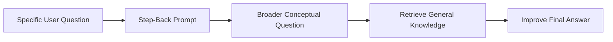

The fallback simply hardcodes a reasonable conceptual question for refund-related queries.

---

# 39. Sub-Query Decomposition

Some questions are too broad for one retrieval query.

For example:

```text
"Can I get a refund and what are the eligibility rules?"
```

We can split this into independent retrieval questions:

```text
1. Terms and conditions regarding refunds
2. User eligibility criteria for refunds
3. Standard operating procedures for refunds
```

The fallback returns JSON:

```json
{
  "queries": [
    "...",
    "...",
    "..."
  ]
}
```

This prepares the system for **multi-query retrieval**.

---

# 40. HyDE Fallback

HyDE stands for **Hypothetical Document Embeddings**.

Instead of embedding the raw user question, the system generates a hypothetical answer/document passage.

Conceptually:

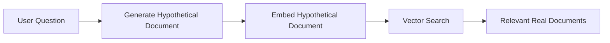

The fallback generates a fake document passage:

```text
Hypothetical document passage addressing...
```

Again, this is not intended to be production-quality generation.

It's there so the pipeline can be tested without an API key.

---

# 41. Query Router Fallback

The query router determines where a question should be answered from.

For example:

```text
"What is my account balance?"
```

might route to:

```text
AUTH_DB
```

while:

```text
"Where can I download my invoice?"
```

might route to:

```text
S3
```

and a general knowledge/document question might route to:

```text
VECTOR_DB
```

The architecture becomes:

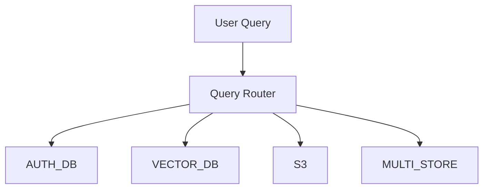

This is an important part of advanced RAG because **not every question should go to the vector database**.

---

# 42. Grounded Generation Fallback

Eventually our RAG pipeline will retrieve context and send it to an LLM.

Conceptually:

```text
User Question
      ↓
Retrieve Documents
      ↓
Relevant Context
      ↓
LLM
      ↓
Grounded Answer
```

If no OpenAI API key exists, the fallback returns a predefined answer.

This lets us test the surrounding application logic.

---

# 43. CRAG Evaluation Fallback

CRAG stands for **Corrective Retrieval-Augmented Generation**.

One part of a CRAG-style system is evaluating whether an answer is useful and grounded.

The fallback returns:

```json
{
  "score": 8,
  "grounded": true,
  "relevance": "high",
  "missing": []
}
```

Again, this is mock evaluation data.

It does **not** actually evaluate the answer.

That's important to remember.

---

# 44. Overall `generateLLM()` Decision Tree

The entire function can be understood like this:

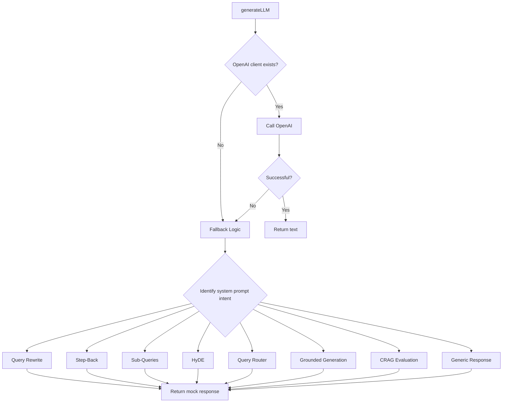

This is the central concept of the chapter.

---

# 45. Why This Architecture Is Useful

Without this abstraction, every RAG component might need to know:

```text
Do I have an API key?
Which model?
How do I call OpenAI?
What happens if OpenAI fails?
How do I test locally?
```

With the wrapper:

```javascript
generateLLM(...)
```

the component simply says:

> "I need an LLM response."

The wrapper handles the implementation.

This is a form of **separation of concerns**.

---

# 46. The Four Modules Together

We now have:

```text
src/
│
├── db/
│   ├── qdrant.js
│   ├── postgres.js
│   └── redis.js
│
└── rag/
    └── llmClient.js
```

Their responsibilities are:

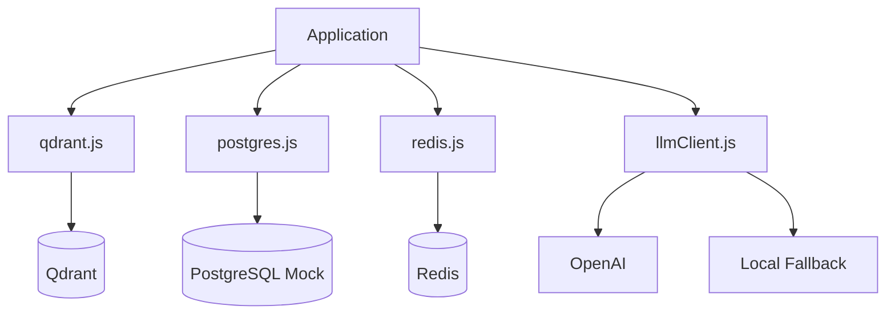

---

# 47. A Typical Future Request

Suppose the user asks:

> "Can I get a refund for my subscription?"

Eventually, the system may perform:

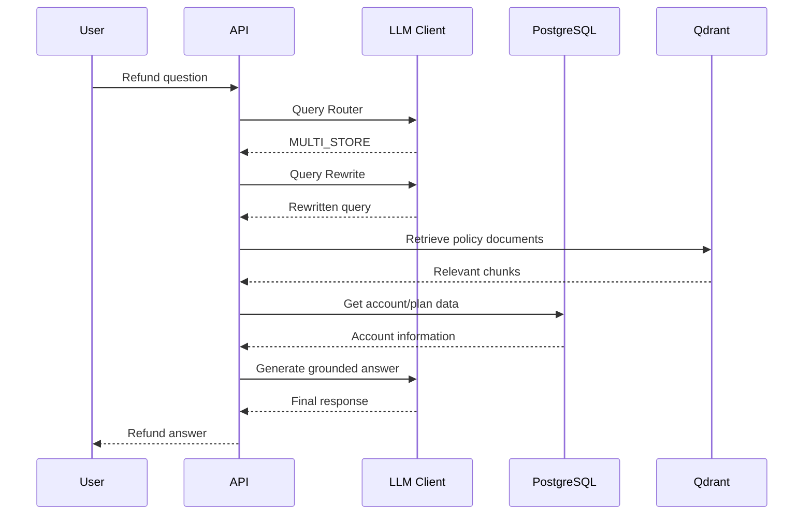

This is why these foundation modules matter.

The later RAG components don't need to know how to create every connection themselves.

---

# 48. Important Production Notes

This chapter is intentionally using simplified implementations, but there are several things you should understand before calling this production-ready.

### 1. PostgreSQL is currently mocked

The implementation doesn't connect to the PostgreSQL container from Chapter 0.

A real implementation would use a PostgreSQL driver such as `pg`.

---

### 2. Qdrant fallback returns no results

```javascript
return [];
```

This prevents crashes, but it doesn't actually perform alternative vector retrieval.

A production system should have a deliberate failure/retry strategy.

---

### 3. Intent detection is simplistic

This:

```javascript
userLower.includes("refund")
```

is only suitable for a local mock.

Real query routing should generally use structured LLM output, deterministic rules where appropriate, validation, and safe defaults.

---

### 4. Mock LLM responses are deterministic

That's intentional.

The purpose is:

```text
No API key
   ↓
Still run application
   ↓
Still test pipeline
```

It is **not** intended to replace an actual LLM.

---

# 49. What We Have Achieved

At the end of this chapter, we have created four important abstractions.

### Qdrant

```javascript
qdrantClient
initQdrantCollection()
searchQdrant()
```

Responsible for vector database interaction.

### PostgreSQL

```javascript
queryPostgres()
```

Currently provides a mock relational data interface.

### Redis

```javascript
redisConnection
createRedisClient()
```

Provides Redis configuration and client creation.

### LLM

```javascript
generateLLM()
```

Provides a single interface for:

```text
OpenAI
   OR
Local fallback
```

---

# 50. Final Mental Model

If you remember only one diagram from this chapter, remember this:

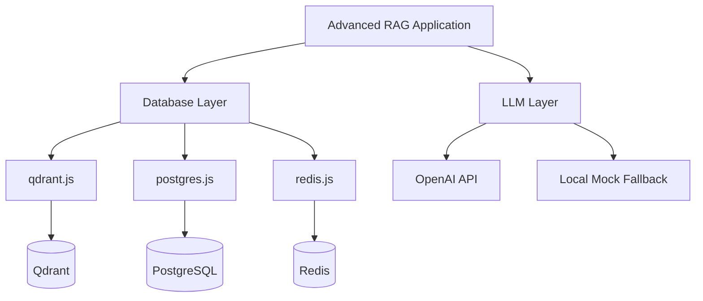

The fundamental architectural principle is:

> **Application logic should depend on simple reusable interfaces, while infrastructure-specific details stay inside dedicated modules.**

That principle will become increasingly important as the RAG system grows.

---

# 51. Chapter 01 Checklist

Before moving to Chapter 02, you should understand:

* [ ] Why Qdrant needs a collection.
* [ ] Why the embedding vector dimension must match the collection dimension.
* [ ] Why cosine distance is used for semantic similarity.
* [ ] How `searchQdrant()` retrieves vectors and payloads.
* [ ] Why PostgreSQL is mocked in this implementation.
* [ ] Why Redis configuration is separated into its own module.
* [ ] Why BullMQ needs Redis.
* [ ] Why we use a shared `generateLLM()` wrapper.
* [ ] How OpenAI failure falls back to local logic.
* [ ] How query rewriting, step-back, sub-query decomposition, HyDE, routing, and CRAG are represented by the fallback system.
* [ ] Why abstractions make the later RAG pipeline easier to build and test.

## Next Chapter

**Chapter 02 — Guardrails & Security Subsystem**

Now that we have the database and LLM foundation, we can start protecting the RAG pipeline.

The next layer will deal with:

```text
User Input
    ↓
Input Validation
    ↓
Prompt Injection Detection
    ↓
PII Detection & Masking
    ↓
Safe RAG Processing
    ↓
Output Verification
```

This is where the project starts moving from a simple RAG prototype toward a more **production-oriented RAG architecture**.
