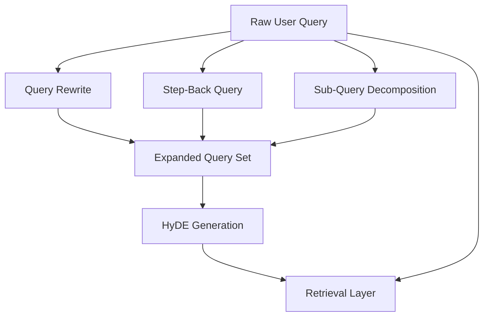
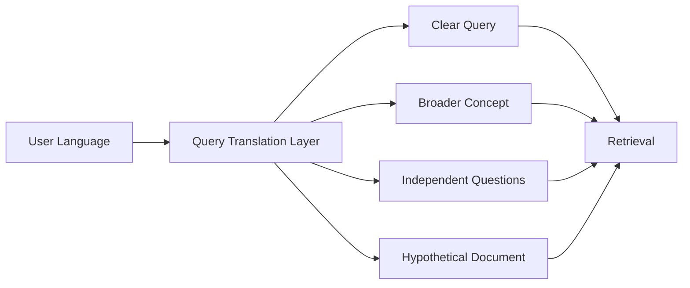
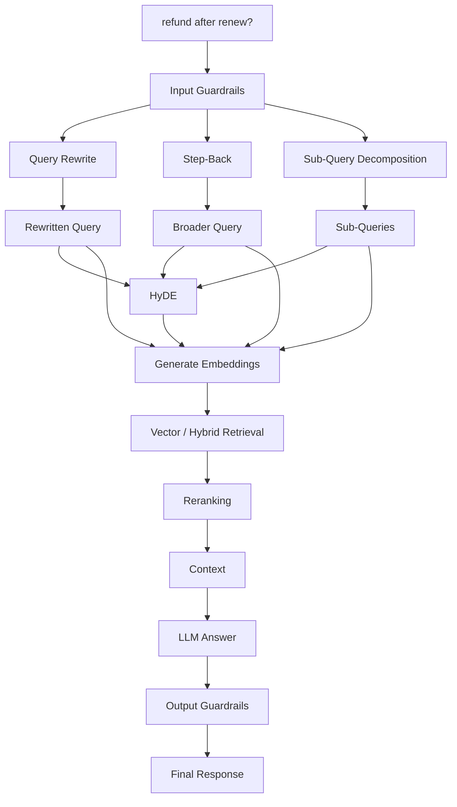

# Chapter 03 — Query Expansion & Translation Engine

## 1. Chapter Goal

In the previous chapters, we prepared the infrastructure, database clients, LLM wrapper, and security guardrails.

Now we build an important part of the Advanced RAG pipeline:

> **Query Expansion & Translation**

A user usually asks questions in a natural and sometimes incomplete way.

For example:

```text
"Can I get refund?"
```

This question is understandable to a human, but it may not contain enough context to retrieve the best documents from a knowledge base.

A better retrieval system can transform the original question into several different representations.

For example:

```text
Original:
"Can I get refund?"
```

Could become:

```text
Rewrite:
"Am I eligible for a refund on my subscription?"

Step-Back:
"What general policies and eligibility rules govern subscription refunds?"

Sub-Queries:
1. What are the subscription refund eligibility requirements?
2. What are the refund processing rules?
3. What is the refund time limit?

HyDE:
"A subscription refund policy typically defines eligibility,
refund windows, prorated amounts, and account requirements..."
```

Each representation gives the retrieval system another way to find relevant information.

---

# 2. Why Query Expansion Is Important

Traditional RAG often follows this simple flow:

```text
User Query
    ↓
Embedding
    ↓
Vector Search
    ↓
Retrieved Documents
    ↓
LLM
    ↓
Answer
```

The problem is that **one query representation may not be enough**.

A user's question may:

* contain spelling mistakes
* be too short
* omit important context
* combine multiple questions
* use conversational language
* focus on a very specific situation while the useful documentation is more general

Query expansion tries to solve these problems before retrieval.

The improved flow becomes:

```text
                         User Query
                             │
             ┌───────────────┼────────────────┐
             │               │                │
             ▼               ▼                ▼
        Query Rewrite    Step-Back        Sub-Queries
             │               │                │
             └───────────────┼────────────────┘
                             │
                             ▼
                           HyDE
                             │
                             ▼
                     Retrieval Pipeline
```

The important idea is:

> **We don't replace the original query. We create additional representations of it.**

---

# 3. The Four Query Transformations

This chapter implements four transformations.

| Transformation | Main Purpose                                         |
| -------------- | ---------------------------------------------------- |
| Query Rewrite  | Make the query clearer and retrieval-friendly        |
| Step-Back      | Find broader conceptual/background information       |
| Sub-Queries    | Break complex questions into smaller retrieval tasks |
| HyDE           | Create a hypothetical document-like representation   |

Let's understand each one.

---

## 3.1 Query Rewriting

### Problem

Users don't always write search-friendly queries.

Example:

```text
"refund after renew?"
```

A query rewriting model may transform this into:

```text
"Am I eligible for a refund after my subscription has been renewed?"
```

The important rule is:

> **Rewrite the question, but do not answer it.**

### What Query Rewriting Does

The rewriting step can:

* fix spelling
* fix grammar
* remove unnecessary conversational language
* make the intent clearer
* add obvious missing context
* preserve the original meaning

### Example

Input:

```text
"how refund work if plan renewed"
```

Output:

```text
"How does the refund policy work if a subscription plan has already been renewed?"
```

The rewritten query can then be embedded and used for retrieval.

---

# 4. Step-Back Prompting

Query rewriting makes the question clearer.

Step-back prompting does something different.

It asks:

> **What broader concept do I need to understand to answer this specific question?**

Consider:

```text
"Can I get a refund 10 days after renewing my Pro plan?"
```

This is very specific.

A step-back query could be:

```text
"What general policies and eligibility rules govern subscription refunds?"
```

The broader query may retrieve documentation containing:

* refund policies
* eligibility rules
* renewal policies
* billing rules
* cancellation rules

This information can then help answer the original specific question.

### The difference

```text
Original Query
    │
    ├── Rewrite → clearer version of the same question
    │
    └── Step-Back → broader concept behind the question
```

### When Step-Back Is Useful

Step-back prompting is especially useful when the knowledge base contains:

* technical documentation
* policies
* legal/business rules
* product documentation
* conceptual explanations

---

# 5. Sub-Query Decomposition

Some user questions actually contain multiple questions.

For example:

```text
"Can I get a refund after renewal, how much will I receive,
and how long does the refund take?"
```

Trying to retrieve everything using one vector query may not work well.

Instead, we can decompose it:

```text
1. What are the refund eligibility rules after subscription renewal?
2. How is the refund amount calculated?
3. How long does refund processing take?
```

Now each question can be retrieved independently.

### Architecture

```text
                  Complex Query
                       │
                       ▼
              Sub-Query Decomposer
                       │
          ┌────────────┼────────────┐
          ▼            ▼            ▼
       Query 1      Query 2       Query 3
          │            │            │
          ▼            ▼            ▼
      Retrieval    Retrieval     Retrieval
```

This is particularly useful for:

* multi-part questions
* comparison questions
* questions involving multiple entities
* questions requiring multiple documents

---

# 6. HyDE — Hypothetical Document Embeddings

HyDE stands for:

> **Hypothetical Document Embeddings**

This technique takes a user's question and asks the LLM to generate a hypothetical document passage that might answer it.

For example:

### User Query

```text
"What are the refund rules for subscription renewals?"
```

### HyDE Output

```text
"Subscription refund policies define eligibility based on
renewal status, subscription terms, refund windows, and
account conditions. Eligible customers may receive a
prorated refund within the applicable refund period..."
```

The generated passage is **not treated as the actual answer**.

Instead, its semantic representation can be used to improve retrieval.

Conceptually:

```text
User Query
    │
    ▼
LLM
    │
    ▼
Hypothetical Document
    │
    ▼
Embedding
    │
    ▼
Vector Search
    │
    ▼
Real Documents
```

The key idea is that a hypothetical answer/document may contain terminology that is closer to the language used inside the actual documents.

---

# 7. Overall Query Expansion Architecture

The four transformations can be viewed as a translation layer between the user and the retrieval system.



Notice that the original query can also remain available.

This is important because query expansion should generally **augment retrieval rather than completely discard the user's original wording**.

---

# 8. Project Structure

Create the following files:

```text
src/
└── rag/
    ├── llmClient.js
    └── query/
        ├── rewrite.js
        ├── stepBack.js
        ├── subQueries.js
        └── hyde.js
```

All four query modules use the shared LLM wrapper created in Chapter 01.

That gives us a clean architecture:

```text
query/
   │
   ├── rewrite.js
   ├── stepBack.js
   ├── subQueries.js
   └── hyde.js
          │
          ▼
    generateLLM()
          │
          ▼
     OpenAI / Fallback
```

---

# 9. Full Code

Before explaining individual blocks, here is the complete implementation.

## 9.1 `src/rag/query/rewrite.js`

```javascript
import { generateLLM } from '../llmClient.js';

/**
 * Step 2 — Query Rewriting
 *
 * Rewrites the user query into a clearer
 * retrieval-friendly representation.
 */
export async function rewriteQuery(query) {
  const response = await generateLLM({
    system: `
      Rewrite the user query for retrieval.

      Preserve the original intent.
      Fix spelling and grammar.
      Add missing context when obvious.
      Do not answer the question.
    `,
    user: query
  });

  return response.text;
}
```

---

## 9.2 `src/rag/query/stepBack.js`

```javascript
import { generateLLM } from '../llmClient.js';

/**
 * Step 3 — Step-Back Prompting
 *
 * Converts a specific question into a broader
 * conceptual question.
 */
export async function createStepBackQuery(query) {
  const response = await generateLLM({
    system: `
      Convert the user's specific question
      into a broader conceptual question.

      Focus on the underlying principles,
      concepts, or general knowledge required
      to answer the original question.
    `,
    user: query
  });

  return response.text;
}
```

---

## 9.3 `src/rag/query/subQueries.js`

```javascript
import { generateLLM } from '../llmClient.js';

/**
 * Step 4 — Sub-Query Decomposition
 *
 * Decomposes a complex user question into
 * 3-5 independent retrieval questions.
 */
export async function createSubQueries(query) {
  const response = await generateLLM({
    system: `
      Break the user's question into
      3-5 independent retrieval questions.

      Return JSON:
      {
        "queries": []
      }
    `,
    user: query
  });

  try {
    const parsed = JSON.parse(response.text);

    if (Array.isArray(parsed.queries)) {
      return parsed.queries;
    }
  } catch (err) {
    console.warn(
      '[SubQueries] Error parsing sub-query JSON, returning query fallback list.'
    );
  }

  return [query];
}
```

---

## 9.4 `src/rag/query/hyde.js`

```javascript
import { generateLLM } from '../llmClient.js';

/**
 * Step 5 — HyDE
 *
 * Generates a hypothetical document passage
 * that could contain the answer to the query.
 */
export async function createHyDE(query) {
  const response = await generateLLM({
    system: `
      Generate a hypothetical document that
      would likely contain the answer to the query.

      Do not worry about factual certainty.
      Focus on terminology and semantic structure.
    `,
    user: query
  });

  return response.text;
}
```

---

# 10. Block-by-Block Explanation

## 10.1 Importing the Shared LLM Client

Every file starts with:

```javascript
import { generateLLM } from '../llmClient.js';
```

This imports the common LLM function created earlier.

Instead of creating a new OpenAI client in every module:

```text
rewrite.js ─────┐
stepBack.js ────┤
subQueries.js ──┼──> generateLLM()
hyde.js ────────┘
```

we have one central interface.

This is a good architectural pattern because model configuration remains centralized.

For example:

```text
OPENAI_API_KEY
OPENAI_MODEL
temperature
fallback behavior
```

can all be controlled from the shared LLM client.

---

# 11. Understanding `rewriteQuery()`

The function is:

```javascript
export async function rewriteQuery(query) {
```

It accepts the original user query.

Example:

```javascript
const rewritten = await rewriteQuery(
  'how refund work after renew?'
);
```

Then it calls:

```javascript
const response = await generateLLM({
```

The `system` prompt defines the transformation rules:

```text
Rewrite the user query for retrieval.

Preserve the original intent.
Fix spelling and grammar.
Add missing context when obvious.
Do not answer the question.
```

There are four important instructions here.

### Preserve intent

The model shouldn't change:

```text
"Can I get a refund?"
```

into:

```text
"How do I request a refund?"
```

if the user's actual question is about eligibility rather than the procedure.

### Fix spelling and grammar

For example:

```text
"refund after renew?"
```

becomes something more understandable.

### Add missing context when obvious

The model can make an implicit context explicit when it is safe to do so.

### Do not answer

This is extremely important.

We want:

```text
Question → Better Question
```

not:

```text
Question → Answer
```

The output is finally returned:

```javascript
return response.text;
```

---

# 12. Understanding `createStepBackQuery()`

The function:

```javascript
export async function createStepBackQuery(query) {
```

receives the original query.

It asks the LLM:

```text
Convert the user's specific question
into a broader conceptual question.
```

This is the core of step-back prompting.

For example:

```text
Specific:
"Can I get a refund 10 days after renewal?"
```

becomes something like:

```text
Broad:
"What policies determine subscription refund eligibility?"
```

The prompt also says:

```text
Focus on the underlying principles,
concepts, or general knowledge required
to answer the original question.
```

This prevents the model from simply rewriting the question.

The goal is to move one level upward:

```text
Specific situation
       ↓
Underlying concept
       ↓
General knowledge
```

---

# 13. Understanding `createSubQueries()`

This function is slightly different because it needs structured output.

```javascript
export async function createSubQueries(query) {
```

It asks the LLM to generate:

```json
{
  "queries": []
}
```

For example:

```json
{
  "queries": [
    "What are the refund eligibility requirements?",
    "How is the refund amount calculated?",
    "What is the refund processing time?"
  ]
}
```

The response comes from:

```javascript
const response = await generateLLM({
```

Then we attempt to convert the text into JavaScript data:

```javascript
const parsed = JSON.parse(response.text);
```

`JSON.parse()` converts a JSON string into a JavaScript object.

For example:

```javascript
const text = '{"queries":["Question 1","Question 2"]}';

const parsed = JSON.parse(text);
```

produces:

```javascript
{
  queries: [
    "Question 1",
    "Question 2"
  ]
}
```

---

# 14. Why `try...catch` Is Needed

LLMs don't always return perfectly valid JSON.

The model might accidentally produce:

```text
Here are the questions:

{
  "queries": [
    "Question 1",
    "Question 2"
  ]
}
```

or:

````text
```json
{
  "queries": [...]
}
````

````

Then:

```javascript
JSON.parse(response.text);
````

may fail.

That's why we use:

```javascript
try {
   ...
} catch (err) {
   ...
}
```

If parsing fails, the system doesn't crash.

Instead:

```javascript
return [query];
```

is returned.

So:

```text
LLM JSON
   │
   ├── Valid → use generated sub-queries
   │
   └── Invalid → fallback to original query
```

This is called **graceful degradation**.

---

# 15. Why the Fallback Is Important

Imagine a production RAG request.

The user asks:

```text
"What is your refund policy?"
```

The LLM returns malformed JSON.

Without a fallback:

```text
JSON.parse()
     ↓
Error
     ↓
Request fails
```

With the fallback:

```text
JSON.parse()
     ↓
Error
     ↓
[original query]
     ↓
Continue retrieval
```

The system loses query expansion, but the main RAG pipeline can continue.

That's generally better than completely failing the request.

---

# 16. Understanding HyDE

The function:

```javascript
export async function createHyDE(query) {
```

generates a hypothetical document.

The prompt says:

```text
Generate a hypothetical document that
would likely contain the answer to the query.
```

Notice that we don't ask:

```text
Answer the user.
```

Instead, we ask for something resembling the type of content that might exist inside the knowledge base.

For example:

```text
User Query:
"What are the refund rules?"
```

HyDE might generate:

```text
"Subscription refund policies specify eligibility,
refund periods, renewal conditions, and refund
calculation procedures..."
```

That text can later be converted into an embedding.

---

# 17. Why HyDE Can Improve Retrieval

Suppose the user's query is:

```text
"Can I get money back after renewing?"
```

The documents might use completely different terminology:

```text
"Subscription renewal refund eligibility"
```

A semantic representation of the hypothetical document can bridge some of that vocabulary difference.

Conceptually:

```text
User's conversational language
          │
          ▼
        HyDE
          │
          ▼
Document-like terminology
          │
          ▼
       Embedding
          │
          ▼
    Vector Retrieval
```

Important:

> **HyDE output is hypothetical. It must not automatically be treated as factual source material.**

The real documents retrieved from the knowledge base remain the source of truth.

---

# 18. How the Four Techniques Work Together

Suppose the user asks:

```text
"Can I get a refund for my plan after renewal?"
```

We can generate:

### 1. Original Query

```text
Can I get a refund for my plan after renewal?
```

### 2. Rewrite

```text
"Am I eligible for a refund after my subscription plan has been renewed?"
```

### 3. Step-Back

```text
"What policies and eligibility rules govern subscription refunds?"
```

### 4. Sub-Queries

```text
1. What are the eligibility requirements for subscription refunds?
2. What rules apply to refunds after subscription renewal?
3. How is the refund amount calculated?
```

### 5. HyDE

```text
"Subscription refund policies define eligibility,
renewal conditions, refund periods, and refund
calculation rules..."
```

Now the retrieval system has several ways to search.

---

# 19. Query Expansion vs Query Translation

The chapter is called a **Query Expansion & Translation Engine** because we are effectively translating the user's natural-language request into multiple retrieval-oriented representations.

The transformation can be visualized as:



The user doesn't need to know that these transformations happen.

The query engine works as an internal retrieval optimization layer.

---

# 20. Important Design Principle: Keep Transformations Independent

Each module has one responsibility.

```text
rewrite.js
    ↓
Only rewriting

stepBack.js
    ↓
Only step-back generation

subQueries.js
    ↓
Only decomposition

hyde.js
    ↓
Only HyDE generation
```

This is better than putting everything inside one huge file.

For example, avoid:

```javascript
queryProcessor.js
```

containing:

```text
rewrite
step-back
sub-query
HyDE
routing
embedding
retrieval
reranking
generation
```

As the system grows, that becomes difficult to maintain.

Instead:

```text
query/
├── rewrite.js
├── stepBack.js
├── subQueries.js
└── hyde.js
```

keeps the architecture modular.

---

# 21. Example End-to-End Flow

Suppose the user sends:

```text
"refund after renew?"
```

The future RAG pipeline can process it like this:



This chapter only implements the **query transformation portion**.

Embedding, retrieval, routing, reranking, and final generation will be handled by later components.

---

# 22. Important Limitations of This Implementation

This implementation is intentionally simple so that the architecture is easy to understand.

However, there are several improvements you should eventually make.

## 22.1 LLM output is not strongly validated

For sub-queries, we currently rely on:

```javascript
JSON.parse(response.text);
```

A stronger production implementation should validate:

```text
Is the response an object?
Does queries exist?
Is queries an array?
Are all items strings?
Is the array between 3 and 5 items?
Are the strings non-empty?
```

Schema validation or structured model output is preferable.

---

## 22.2 The four transformations can be expensive

If every user request performs:

```text
Rewrite       → LLM call
Step-Back     → LLM call
Sub-Queries   → LLM call
HyDE          → LLM call
```

that's potentially **four additional LLM calls per query**.

That increases:

* latency
* token usage
* API cost

A production system should consider:

* running independent transformations concurrently
* using cheaper models where appropriate
* caching transformations
* applying transformations only when useful
* combining some transformations into a single structured LLM call

For example:

```javascript
const [
  rewritten,
  stepBack,
  subQueries,
  hyde
] = await Promise.all([
  rewriteQuery(query),
  createStepBackQuery(query),
  createSubQueries(query),
  createHyDE(query)
]);
```

This can reduce wall-clock latency because the calls execute concurrently.

---

## 22.3 Query expansion can introduce noise

More queries don't automatically mean better retrieval.

Suppose we generate:

```text
Original Query
Rewrite
Step-Back
5 Sub-Queries
HyDE
```

We now have many retrieval signals.

Some may be irrelevant.

Therefore, later chapters should consider:

```text
Multiple Retrieval Results
        ↓
Fusion
        ↓
Reranking
        ↓
Best Context
```

This is where techniques such as **RRF (Reciprocal Rank Fusion)** become useful.

---

## 22.4 HyDE can hallucinate

A HyDE document is hypothetical.

For example, the LLM could generate:

```text
"Customers always receive a full refund within 7 days."
```

even if that isn't true.

That's okay **if HyDE is used only as a retrieval representation**.

It is dangerous if the generated HyDE passage is directly presented to the user as factual information.

Therefore:

```text
HyDE
  ↓
Embedding
  ↓
Retrieval
  ↓
REAL DOCUMENTS
  ↓
LLM
```

not:

```text
HyDE
  ↓
User
```

---

# 23. Production Improvements

As the project becomes more advanced, the query engine can evolve into:

```text
                    Query
                      │
                      ▼
               Query Analyzer
                      │
          ┌───────────┼───────────┐
          ▼           ▼           ▼
       Rewrite     Step-Back    Decompose
          │           │           │
          └───────────┼───────────┘
                      ▼
                  HyDE
                      │
                      ▼
              Query Embeddings
                      │
                      ▼
             Multi-Query Search
                      │
                      ▼
                  RRF Fusion
                      │
                      ▼
                  Reranking
```

You can also add:

* query caching
* language detection
* spelling correction
* entity extraction
* metadata-aware query generation
* query classification
* structured output validation
* model selection
* token limits
* retry and timeout handling
* observability and tracing

---

# 24. Summary

In this chapter, we built four independent query transformation modules.

### `rewriteQuery()`

Transforms:

```text
Unclear user query
```

into:

```text
Clear retrieval-oriented query
```

---

### `createStepBackQuery()`

Transforms:

```text
Specific question
```

into:

```text
Broader conceptual question
```

---

### `createSubQueries()`

Transforms:

```text
Complex question
```

into:

```text
Multiple independent retrieval questions
```

---

### `createHyDE()`

Transforms:

```text
User query
```

into:

```text
Hypothetical document-like passage
```

which can later be embedded for retrieval.

---

# 25. Final Architecture

At this point, our RAG system conceptually looks like:

```text
User
 │
 ▼
Input Guardrails
 │
 ▼
Query Expansion
 │
 ├── Rewrite
 │
 ├── Step-Back
 │
 ├── Sub-Queries
 │
 └── HyDE
 │
 ▼
Query Representations
 │
 ▼
Retrieval / Routing
 │
 ▼
Documents
 │
 ▼
Reranking
 │
 ▼
LLM
 │
 ▼
Output Guardrails
 │
 ▼
Final Answer
```

The important mental model is:

> **Query expansion does not answer the user's question. It prepares better search representations so that the retrieval system has a better chance of finding the right evidence.**

---

# 26. What We Have Built So Far

After Chapters 01–03, we have:

```text
Chapter 01
Infrastructure
    ↓
Qdrant + Redis + PostgreSQL
    ↓
Database Clients + LLM Client

Chapter 02
Security
    ↓
Input Guardrails
    ↓
Jailbreak Detection
    ↓
PII Masking
    ↓
Output Guardrails

Chapter 03
Query Intelligence
    ↓
Query Rewrite
    ↓
Step-Back
    ↓
Sub-Queries
    ↓
HyDE
```

The next missing piece is deciding **where the query should be retrieved from**.

For example:

```text
"What's my account balance?"
        ↓
        SQL / Auth DB

"What is the refund policy?"
        ↓
        Vector DB

"Show me my invoice PDF."
        ↓
        S3

"Give me refund policy + my current plan."
        ↓
        Multiple data sources
```

That is the purpose of the next chapter.

# Next Chapter

**Chapter 04 — Query Router & Data Source Adapters**

We will build the system that determines:

```text
User Query
     ↓
Query Router
     ↓
Which data source?
     │
     ├── Vector DB
     ├── PostgreSQL
     ├── NoSQL
     ├── S3
     └── Multiple Stores
```

This will connect the query intelligence layer we built here with the actual retrieval layer.

One important architectural point to keep in mind for the next chapters: **query expansion creates retrieval signals; it should not become the source of truth.** The actual answer should ultimately be grounded in retrieved, trusted data.
