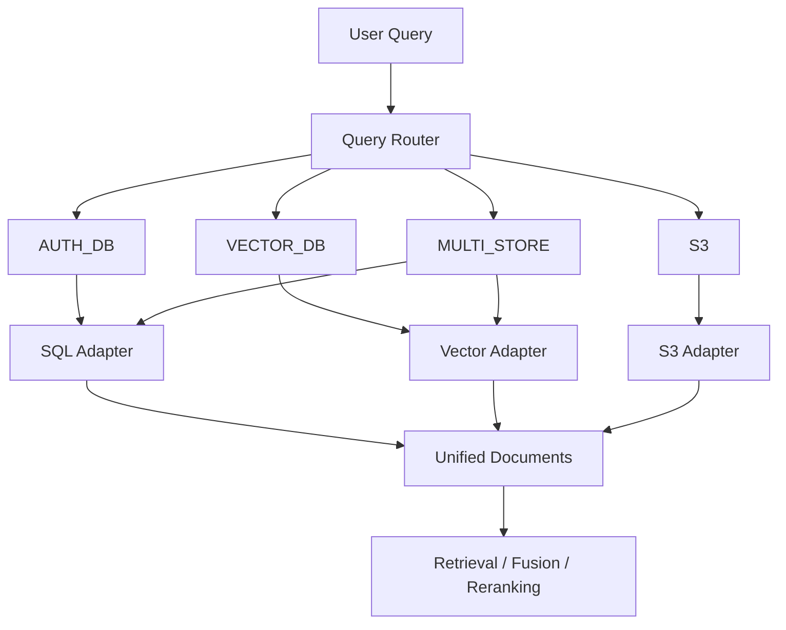
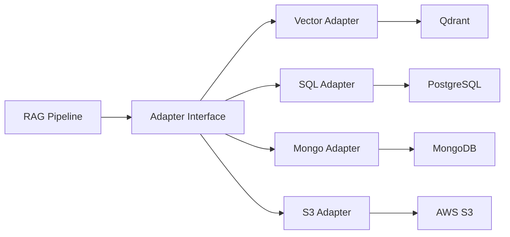
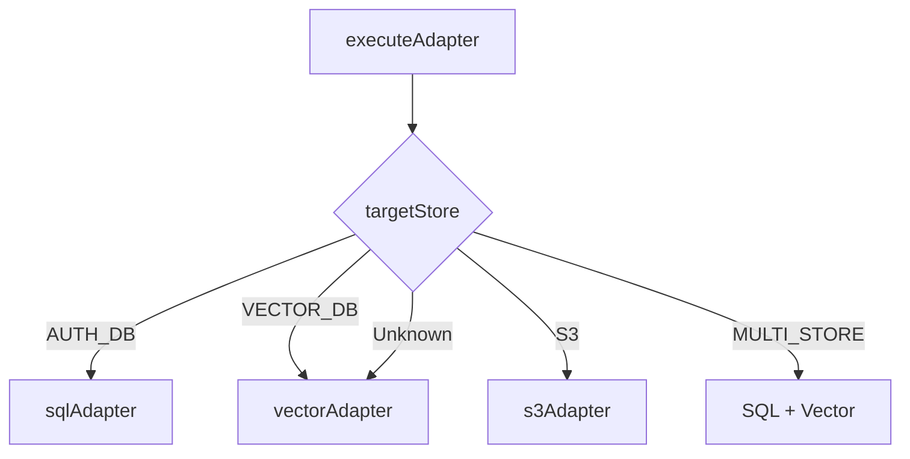
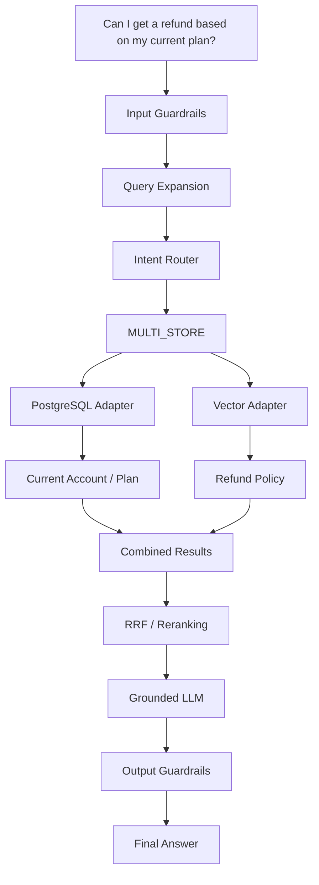
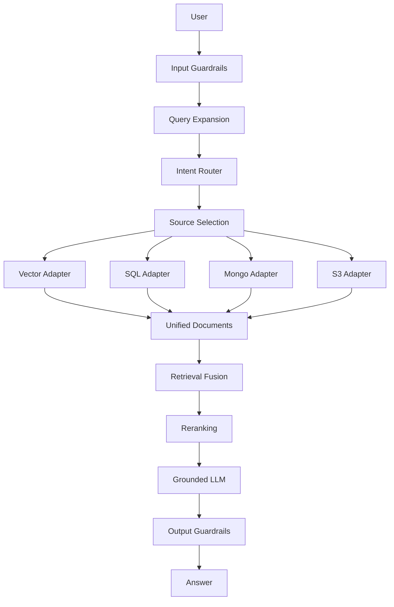

# Chapter 04 — Intent Router & Multi-Source Data Adapters

## 1. Chapter Goal

In Chapter 03, we transformed the user's query into multiple retrieval-friendly representations.

Now we need to answer another important question:

> **Where should we search for the answer?**

A modern RAG system may have information distributed across multiple data sources.

For example:

```text
User Query
    │
    ├── "What is the refund policy?"
    │         ↓
    │      Vector DB
    │
    ├── "What is my account balance?"
    │         ↓
    │      PostgreSQL
    │
    ├── "Show me my August invoice."
    │         ↓
    │      S3
    │
    └── "Am I eligible for a refund based on my plan?"
              ↓
          Multiple Sources
```

Searching every database for every question would be inefficient and can also create unnecessary security and latency problems.

So this chapter introduces two important concepts:

1. **Intent Router** — determines which data source should be queried.
2. **Data Adapters** — provide one common interface for different databases and storage systems.

---

# 2. The Core Architecture

The overall architecture is:



The important separation is:

```text
Router
  ↓
Which source?

Adapter
  ↓
How do I communicate with that source?

Unified Document
  ↓
How do I represent the result consistently?
```

---

# 3. Why Do We Need a Router?

Imagine we have four data sources:

```text
Qdrant
PostgreSQL
MongoDB
AWS S3
```

Each one stores a different type of information.

| Data Source | Typical Data                               |
| ----------- | ------------------------------------------ |
| Qdrant      | Documents, policies, knowledge             |
| PostgreSQL  | Accounts, billing, structured records      |
| MongoDB     | Logs, flexible documents, application data |
| S3          | PDFs, images, invoices, files              |

Consider:

```text
"What is the refund policy?"
```

This probably belongs to the knowledge base:

```text
VECTOR_DB
```

But:

```text
"What is my current account balance?"
```

belongs to:

```text
AUTH_DB
```

And:

```text
"Show me my invoice PDF."
```

belongs to:

```text
S3
```

Therefore, before retrieval we need an **intent classification step**.

---

# 4. What Is Intent Routing?

Intent routing means:

> **Classifying a user's request so that it can be sent to the appropriate data source or combination of sources.**

Conceptually:

```text
User Query
    ↓
Intent Classification
    ↓
Target Store
```

Example:

```text
"What's my balance?"
       ↓
    AUTH_DB
```

```text
"How does the refund policy work?"
       ↓
   VECTOR_DB
```

```text
"Download my invoice."
       ↓
      S3
```

```text
"Can I get a refund based on my current plan?"
       ↓
   MULTI_STORE
```

The last query requires information from multiple places:

```text
Current Plan
    ↓
PostgreSQL

Refund Policy
    ↓
Qdrant
```

So the router returns:

```text
MULTI_STORE
```

---

# 5. Why Use Adapters?

Different databases have different APIs.

For example:

```text
Qdrant
    ↓
Vector search

PostgreSQL
    ↓
SQL query

MongoDB
    ↓
Mongo query

S3
    ↓
Object lookup
```

If the rest of our RAG system has to understand every database's API, the application becomes tightly coupled to the infrastructure.

Instead, we create adapters.

Each adapter exposes the same interface:

```javascript
adapter.search(query)
```

So the rest of the system doesn't need to care whether the data came from:

* Qdrant
* PostgreSQL
* MongoDB
* S3

---

# 6. The Unified Document Format

Every adapter converts its result into the same structure:

```javascript
{
  id: string,
  title: string,
  text: string,
  source: string,
  metadata: object
}
```

For example, Qdrant might return:

```javascript
{
  id: "vdb_123",
  title: "Refund Policy",
  text: "Customers can request...",
  source: "Qdrant_VECTOR_DB",
  metadata: {
    tenantId: "tenant_1",
    accessLevel: 1,
    score: 0.92
  }
}
```

PostgreSQL can return:

```javascript
{
  id: "sql_usr_123",
  title: "Account Information",
  text: "User Account: John Doe...",
  source: "PostgreSQL_AUTH_DB",
  metadata: {
    tenantId: "tenant_1",
    accessLevel: 1,
    sourceType: "SQL"
  }
}
```

The downstream RAG pipeline sees both as:

```text
Document
```

This is the major benefit of the adapter pattern.

---

# 7. Adapter Pattern

The architecture looks like this:



The application interacts with the adapters rather than directly interacting with every underlying data source.

---

# 8. Project Structure

Create:

```text
src/
└── rag/
    ├── routing/
    │   └── queryRouter.js
    │
    └── adapters/
        ├── vectorAdapter.js
        ├── sqlAdapter.js
        ├── mongoAdapter.js
        └── s3Adapter.js
```

The responsibilities are:

```text
queryRouter.js
    ↓
Decide where to search

vectorAdapter.js
    ↓
Search Qdrant

sqlAdapter.js
    ↓
Search PostgreSQL

mongoAdapter.js
    ↓
Search MongoDB

s3Adapter.js
    ↓
Search S3
```

---

# 9. Full Code

Before explaining the implementation, here is the complete code for this chapter.

## 9.1 `src/rag/routing/queryRouter.js`

```javascript
import { generateLLM } from '../llmClient.js';

/**
 * Query Router
 *
 * Classifies a query into the data source
 * that should be searched.
 */
export async function routeQuery(query) {
  const response = await generateLLM({
    system: `
      You are a query router.

      Available stores:

      AUTH_DB:
      account, billing, user information, balances

      VECTOR_DB:
      documentation, policies, knowledge base

      S3:
      files, PDFs, images, invoices

      MULTI_STORE:
      requires multiple sources
      (for example billing plan + refund policy)

      Return JSON only:

      {
        "targetStore":
          "AUTH_DB" |
          "VECTOR_DB" |
          "S3" |
          "MULTI_STORE"
      }
    `,
    user: query
  });

  try {
    const parsed = JSON.parse(response.text);

    const validStores = [
      'AUTH_DB',
      'VECTOR_DB',
      'S3',
      'MULTI_STORE'
    ];

    if (validStores.includes(parsed.targetStore)) {
      return parsed;
    }
  } catch (err) {
    console.warn(
      '[QueryRouter] JSON parse error, defaulting to VECTOR_DB route.'
    );
  }

  return {
    targetStore: 'VECTOR_DB'
  };
}
```

---

# 10. Vector Adapter

## `src/rag/adapters/vectorAdapter.js`

```javascript
import { searchQdrant } from '../../db/qdrant.js';

/**
 * Vector Adapter
 *
 * Converts Qdrant search results into the
 * application's unified document format.
 */
export const vectorAdapter = {
  async search(query) {
    console.log(
      `[vectorAdapter] Executing vector search for query: "${query}"`
    );

    // Prototype placeholder vector.
    // In production, generate an embedding from `query`.
    const dummyVector = new Array(1536)
      .fill(0)
      .map((_, i) => Math.sin(i) * 0.05);

    const searchResults = await searchQdrant(
      dummyVector,
      5
    );

    if (searchResults && searchResults.length > 0) {
      return searchResults.map((item) => ({
        id: `vdb_${item.id}`,

        title:
          item.payload?.title ||
          'Knowledge Base Documentation',

        text:
          item.payload?.text ||
          'Standard documentation content.',

        source: 'Qdrant_VECTOR_DB',

        metadata: {
          tenantId:
            item.payload?.tenantId ||
            'tenant_1',

          accessLevel:
            item.payload?.accessLevel ||
            1,

          score:
            item.score ||
            0.85
        }
      }));
    }

    // Local fallback when Qdrant is unavailable.
    return [
      {
        id: 'doc_refund_policy_01',

        title:
          'Enterprise Refund and Cancellation Policy',

        text:
          'Customers on monthly and annual subscription plans can request a full refund within 30 days of initial purchase or plan renewal. Refund requests submitted after 30 days are evaluated on a prorated basis.',

        source: 'Qdrant_VECTOR_DB',

        metadata: {
          tenantId: 'tenant_1',
          accessLevel: 1,
          score: 0.92
        }
      },

      {
        id: 'doc_api_limits_02',

        title:
          'API Rate Limits and Quota Error Handling',

        text:
          'When experiencing HTTP 429 rate limit errors from model endpoints, implement exponential backoff with jitter starting at 2000ms delay.',

        source: 'Qdrant_VECTOR_DB',

        metadata: {
          tenantId: 'tenant_1',
          accessLevel: 1,
          score: 0.88
        }
      }
    ];
  }
};
```

---

# 11. SQL Adapter

## `src/rag/adapters/sqlAdapter.js`

```javascript
import { queryPostgres } from '../../db/postgres.js';

/**
 * SQL Adapter
 *
 * Converts PostgreSQL records into the
 * unified document format.
 */
export const sqlAdapter = {
  async search(query) {
    console.log(
      `[sqlAdapter] Searching relational database for query: "${query}"`
    );

    const records = await queryPostgres(
      'SELECT * FROM accounts WHERE status = active',
      [query]
    );

    return records.map((rec, idx) => ({
      id: `sql_${rec.userId || idx}`,

      title:
        `Account Information (${rec.userName})`,

      text:
        `User Account: ${rec.userName}, ` +
        `Plan: ${rec.plan}, ` +
        `Balance: ${rec.accountBalance}, ` +
        `Status: ${rec.billingStatus}, ` +
        `Eligibility: ${rec.refundEligibility}`,

      source: 'PostgreSQL_AUTH_DB',

      metadata: {
        tenantId: 'tenant_1',
        accessLevel: 1,
        sourceType: 'SQL'
      }
    }));
  }
};
```

---

# 12. MongoDB Adapter

## `src/rag/adapters/mongoAdapter.js`

```javascript
/**
 * MongoDB Adapter
 *
 * Converts MongoDB documents into the
 * unified document format.
 *
 * This version uses mock data for the prototype.
 */
export const mongoAdapter = {
  async search(query) {
    console.log(
      `[mongoAdapter] Searching MongoDB documents for query: "${query}"`
    );

    return [
      {
        id: 'mongo_doc_99',

        title:
          'Customer Service Knowledge Base',

        text:
          'MongoDB Knowledge Base entry detailing account management procedures and subscription policies.',

        source: 'MongoDB_Store',

        metadata: {
          tenantId: 'tenant_1',
          accessLevel: 1
        }
      }
    ];
  }
};
```

---

# 13. S3 Adapter

## `src/rag/adapters/s3Adapter.js`

```javascript
/**
 * S3 Adapter
 *
 * Converts S3 object metadata into the
 * unified document format.
 *
 * This version uses mock data for the prototype.
 */
export const s3Adapter = {
  async search(query) {
    console.log(
      `[s3Adapter] Querying S3 object metadata for query: "${query}"`
    );

    return [
      {
        id: 's3_invoice_2026_08',

        title:
          'Customer Invoice August 2026 PDF',

        text:
          'Document S3 Path: s3://production-rag-assets/invoices/inv_2026_08.pdf. Size: 145KB. Type: PDF.',

        source: 'AWS_S3',

        metadata: {
          tenantId: 'tenant_1',
          accessLevel: 2,
          downloadUrl:
            'https://s3.amazonaws.com/production-rag-assets/invoices/inv_2026_08.pdf'
        }
      }
    ];
  }
};
```

---

# 14. Adapter Dispatcher

We now need one function that receives the router's decision and executes the correct adapter.

```javascript
import { sqlAdapter } from './sqlAdapter.js';
import { vectorAdapter } from './vectorAdapter.js';
import { s3Adapter } from './s3Adapter.js';

/**
 * Executes the appropriate adapter
 * based on the router result.
 */
export async function executeAdapter(route, query) {
  const store = route?.targetStore || 'VECTOR_DB';

  switch (store) {
    case 'AUTH_DB':
      return await sqlAdapter.search(query);

    case 'VECTOR_DB':
      return await vectorAdapter.search(query);

    case 'S3':
      return await s3Adapter.search(query);

    case 'MULTI_STORE': {
      const [
        sqlResults,
        vectorResults
      ] = await Promise.all([
        sqlAdapter.search(query),
        vectorAdapter.search(query)
      ]);

      return [
        ...sqlResults,
        ...vectorResults
      ];
    }

    default:
      return await vectorAdapter.search(query);
  }
}
```

---

# 15. Understanding the Query Router

Let's go through the router carefully.

The module imports:

```javascript
import { generateLLM } from '../llmClient.js';
```

This means the router uses the same centralized LLM abstraction from Chapter 01.

We don't create another OpenAI client.

---

## 15.1 `routeQuery()`

```javascript
export async function routeQuery(query) {
```

The function receives:

```text
User Query
```

and returns:

```javascript
{
  targetStore: 'VECTOR_DB'
}
```

or another valid target.

---

# 16. Router Prompt

The system prompt defines the available stores.

```text
AUTH_DB
```

is for:

```text
account
billing
user information
balances
```

While:

```text
VECTOR_DB
```

is for:

```text
documentation
policies
knowledge base
```

And:

```text
S3
```

is for:

```text
files
PDFs
images
invoices
```

Finally:

```text
MULTI_STORE
```

means:

> The answer requires information from more than one source.

---

# 17. Why Return JSON?

The router should return structured information.

Instead of:

```text
I think this query should probably go to the PostgreSQL database.
```

we want:

```json
{
  "targetStore": "AUTH_DB"
}
```

This is much easier for JavaScript to process.

For example:

```javascript
if (route.targetStore === 'AUTH_DB') {
  // use SQL adapter
}
```

---

# 18. Validating the Router Result

The original implementation only checked:

```javascript
if (parsed.targetStore) {
  return parsed;
}
```

That is not enough.

The model could return:

```json
{
  "targetStore": "RANDOM_DATABASE"
}
```

and the application would accept it.

A safer version defines:

```javascript
const validStores = [
  'AUTH_DB',
  'VECTOR_DB',
  'S3',
  'MULTI_STORE'
];
```

Then:

```javascript
if (validStores.includes(parsed.targetStore)) {
  return parsed;
}
```

Now only known routes are accepted.

This is an important general rule:

> **Never blindly trust structured output generated by an LLM.**

Validate it before using it to control application behavior.

---

# 19. Router Fallback

If the LLM produces invalid JSON:

```text
LLM
 ↓
Invalid JSON
 ↓
JSON.parse() fails
 ↓
Fallback
```

The system returns:

```javascript
{
  targetStore: 'VECTOR_DB'
}
```

Why?

Because the vector database is treated as the default general knowledge source.

This prevents the router from crashing the entire request.

---

# 20. Understanding the Vector Adapter

The vector adapter imports:

```javascript
import { searchQdrant } from '../../db/qdrant.js';
```

This connects the adapter to the Qdrant client from Chapter 01.

Its public interface is:

```javascript
vectorAdapter.search(query)
```

This is the important abstraction.

The rest of the application doesn't need to know how Qdrant works internally.

---

# 21. Important: The Dummy Vector

The current implementation contains:

```javascript
const dummyVector = new Array(1536)
  .fill(0)
  .map((_, i) => Math.sin(i) * 0.05);
```

This is **not a real query embedding**.

It is simply generating a deterministic 1536-dimensional vector.

Why?

Because the current chapter is demonstrating the adapter architecture before implementing the real embedding pipeline.

The real production flow should be:

```text
User Query
    ↓
Embedding Model
    ↓
1536-dimensional embedding
    ↓
Qdrant
    ↓
Similarity Search
```

rather than:

```text
User Query
    ↓
Dummy Vector
    ↓
Qdrant
```

This distinction is extremely important.

---

# 22. Why Is 1536 Used?

The vector dimension must match the dimension of the embedding model used to create the vectors stored in Qdrant.

If the collection contains:

```text
1536-dimensional vectors
```

the query vector must also have:

```text
1536 dimensions
```

Otherwise, Qdrant cannot perform the intended vector search.

So:

```text
Embedding dimension
        =
Qdrant collection vector size
        =
Query vector dimension
```

---

# 23. Converting Qdrant Results

Suppose Qdrant returns:

```javascript
{
  id: 123,
  score: 0.91,
  payload: {
    title: "Refund Policy",
    text: "Customers can request...",
    tenantId: "tenant_1",
    accessLevel: 1
  }
}
```

The adapter converts it into:

```javascript
{
  id: "vdb_123",
  title: "Refund Policy",
  text: "Customers can request...",
  source: "Qdrant_VECTOR_DB",
  metadata: {
    tenantId: "tenant_1",
    accessLevel: 1,
    score: 0.91
  }
}
```

This conversion is the actual purpose of the adapter.

---

# 24. What Is `payload`?

In Qdrant, a vector can have additional structured data attached to it.

That information is called the **payload**.

For example:

```javascript
payload: {
  title: "Refund Policy",
  text: "Customers can request...",
  tenantId: "tenant_1",
  accessLevel: 1
}
```

The vector represents semantic information.

The payload stores metadata/content associated with that vector.

Conceptually:

```text
Qdrant Point
│
├── Vector
│     ↓
│   Semantic representation
│
└── Payload
      ↓
    Metadata + document information
```

---

# 25. Local Fallback Data

If Qdrant doesn't return results, the adapter returns hardcoded records.

For example:

```javascript
{
  id: 'doc_refund_policy_01',
  title: 'Enterprise Refund and Cancellation Policy',
  ...
}
```

This is useful during development.

You can run the application even when Qdrant isn't populated yet.

However:

> These are mock fallback documents, not real vector search results.

A production system should normally distinguish clearly between:

```text
REAL RETRIEVED DATA
```

and:

```text
DEMO FALLBACK DATA
```

Otherwise debugging retrieval quality becomes difficult.

---

# 26. Understanding the SQL Adapter

The SQL adapter imports:

```javascript
import { queryPostgres } from '../../db/postgres.js';
```

It exposes:

```javascript
sqlAdapter.search(query)
```

It then calls:

```javascript
const records = await queryPostgres(
  'SELECT * FROM accounts WHERE status = active',
  [query]
);
```

This demonstrates the adapter pattern.

However, remember from Chapter 01:

> `queryPostgres()` is currently a mock implementation.

There is no actual PostgreSQL driver or real database query yet.

Therefore, this adapter is demonstrating the architecture rather than implementing production SQL retrieval.

---

# 27. SQL Result → Unified Document

Suppose PostgreSQL returns:

```javascript
{
  userId: 'usr_123',
  userName: 'John Doe',
  plan: 'Enterprise Pro',
  billingStatus: 'Active',
  accountBalance: '$250.00',
  refundEligibility: 'Eligible within 30 days'
}
```

The adapter converts it into:

```javascript
{
  id: 'sql_usr_123',
  title: 'Account Information (John Doe)',
  text: 'User Account: John Doe, Plan: Enterprise Pro...',
  source: 'PostgreSQL_AUTH_DB',
  metadata: {
    tenantId: 'tenant_1',
    accessLevel: 1,
    sourceType: 'SQL'
  }
}
```

Now the downstream pipeline doesn't need to understand PostgreSQL-specific field names.

---

# 28. Important SQL Issue

The query:

```sql
SELECT * FROM accounts WHERE status = active
```

would not be valid SQL in a normal PostgreSQL setup because `active` would generally need to be represented as a value, for example:

```sql
WHERE status = 'active'
```

More importantly, the current `queryPostgres()` implementation doesn't actually execute SQL.

So the chapter should be understood as:

```text
Adapter architecture
        +
Mock database layer
```

rather than:

```text
Production PostgreSQL implementation
```

A later production implementation should use parameterized queries and a real PostgreSQL client.

---

# 29. Understanding the Mongo Adapter

The Mongo adapter has the same public interface:

```javascript
mongoAdapter.search(query)
```

But currently it returns a hardcoded record.

That means:

```text
User Query
    ↓
mongoAdapter.search()
    ↓
Mock Mongo document
```

There is currently no:

```text
MongoClient
```

and no:

```text
collection.find()
```

call.

This is intentional for the prototype.

Later, it can become something like:

```text
Query
 ↓
MongoDB
 ↓
find(...)
 ↓
Documents
 ↓
Unified Document Format
```

---

# 30. Understanding the S3 Adapter

S3 is slightly different from a database.

A database usually stores structured records.

S3 is an **object storage system**.

It can store:

```text
PDF
Image
CSV
JSON
Audio
Video
Documents
```

The adapter currently returns metadata describing an invoice PDF:

```javascript
{
  id: 's3_invoice_2026_08',
  title: 'Customer Invoice August 2026 PDF',
  ...
}
```

Notice the metadata:

```javascript
downloadUrl: 'https://...'
```

This allows a later part of the system to potentially provide the file to the user.

---

# 31. S3 Is Usually Not "Semantic Search"

One important architectural distinction:

A basic S3 adapter usually doesn't perform semantic search itself.

Instead, you may:

```text
S3
 ↓
Store original files
```

and separately:

```text
PDF
 ↓
Parse
 ↓
Chunk
 ↓
Embed
 ↓
Qdrant
```

Then:

```text
Semantic question
      ↓
Qdrant
      ↓
Find relevant document
      ↓
S3
      ↓
Retrieve original file
```

This is a common pattern:

> **S3 stores the source artifact; Qdrant stores searchable representations.**

---

# 32. The Adapter Dispatcher

Now we reach the most important orchestration function:

```javascript
export async function executeAdapter(route, query) {
```

It receives two things:

```text
route
query
```

For example:

```javascript
route = {
  targetStore: 'AUTH_DB'
};

query = 'What is my account balance?';
```

The dispatcher extracts:

```javascript
const store = route?.targetStore || 'VECTOR_DB';
```

The optional chaining:

```javascript
route?.targetStore
```

prevents an error if `route` is `null` or `undefined`.

---

# 33. The `switch` Statement

The dispatcher uses:

```javascript
switch (store)
```

This selects the correct adapter.

For:

```text
AUTH_DB
```

we call:

```javascript
sqlAdapter.search(query)
```

For:

```text
VECTOR_DB
```

we call:

```javascript
vectorAdapter.search(query)
```

For:

```text
S3
```

we call:

```javascript
s3Adapter.search(query)
```

So the flow becomes:



---

# 34. Multi-Store Retrieval

This is one of the most important concepts in this chapter.

Suppose the user asks:

```text
"Can I get a refund based on my current plan?"
```

We need:

```text
Current Plan
    ↓
PostgreSQL

Refund Policy
    ↓
Qdrant
```

So the router returns:

```javascript
{
  targetStore: 'MULTI_STORE'
}
```

The dispatcher then executes:

```javascript
const [
  sqlResults,
  vectorResults
] = await Promise.all([
  sqlAdapter.search(query),
  vectorAdapter.search(query)
]);
```

---

# 35. Why `Promise.all()`?

Without `Promise.all()`:

```text
SQL Search
    ↓
wait
    ↓
Vector Search
    ↓
wait
```

With `Promise.all()`:

```text
           ┌── SQL Search ──┐
Query ─────┤                ├──> Results
           └─ Vector Search ┘
```

Both operations can run concurrently.

This can reduce total latency.

For example:

```text
SQL = 100ms
Vector = 200ms
```

Sequential:

```text
100 + 200 = 300ms
```

Parallel:

```text
approximately 200ms
```

assuming both can safely execute concurrently.

---

# 36. Combining the Results

After both searches finish:

```javascript
return [
  ...sqlResults,
  ...vectorResults
];
```

The spread operator:

```javascript
...
```

combines the two arrays.

For example:

```javascript
sqlResults = [
  { id: 'sql_123' }
];

vectorResults = [
  { id: 'vdb_1' },
  { id: 'vdb_2' }
];
```

becomes:

```javascript
[
  { id: 'sql_123' },
  { id: 'vdb_1' },
  { id: 'vdb_2' }
]
```

These can then be passed to the next retrieval stage.

---

# 37. Complete End-to-End Example

Consider:

```text
"Can I get a refund based on my current plan?"
```

The system can work like this:



This is the real value of the architecture.

The LLM doesn't need to directly know:

```text
Where is the user's account stored?
Where is the refund policy stored?
```

The routing layer determines that.

---

# 38. Important Security Consideration

The router is making decisions about data access.

Therefore, routing **must not be treated as authorization**.

For example, the LLM might decide:

```text
AUTH_DB
```

But that does **not** mean the user is allowed to access every record in AUTH_DB.

The actual flow should eventually be:

```text
User
 ↓
Authentication
 ↓
Authorization
 ↓
Router
 ↓
Adapter
 ↓
Tenant / ACL Filtering
 ↓
Data
```

Not:

```text
User
 ↓
LLM Router
 ↓
Database
```

The LLM chooses a retrieval strategy.

Your application security layer decides what data the user is actually allowed to retrieve.

---

# 39. Another Important Security Issue: Tenant Isolation

The adapters currently use values such as:

```javascript
tenantId: 'tenant_1'
```

This is only demonstration data.

In a real multi-tenant system, the tenant ID should come from the authenticated user/session context.

For example:

```javascript
executeAdapter(route, query, {
  tenantId: user.tenantId
});
```

Then retrieval should enforce:

```text
tenantId = authenticatedUser.tenantId
```

This is extremely important.

A user from:

```text
tenant_A
```

must never receive documents belonging to:

```text
tenant_B
```

even if the query itself asks for them.

---

# 40. One Architectural Improvement: Don't Route Purely From the Expanded Query

Chapter 03 generates:

```text
Rewrite
Step-Back
Sub-Queries
HyDE
```

The router should generally operate on the **original intent plus useful query context**, not blindly treat every generated representation as a separate routing decision.

For example:

```text
Original Query
     ↓
Intent Analysis
     ↓
Target Sources
     ↓
Query-specific retrieval representations
```

This helps prevent an expanded query from accidentally changing the intended data source.

---

# 41. Current Prototype vs Production

It is important to understand what this chapter currently implements.

| Component     | Current Version           | Production Version                     |
| ------------- | ------------------------- | -------------------------------------- |
| Router        | LLM classification        | LLM + deterministic rules + validation |
| Qdrant        | Dummy vector              | Real embeddings                        |
| PostgreSQL    | Mock function             | Real `pg` connection                   |
| MongoDB       | Mock records              | Real MongoDB client                    |
| S3            | Mock metadata             | AWS SDK                                |
| Authorization | Basic previous guardrails | Strong ACL/tenant enforcement          |
| Multi-store   | SQL + Vector              | Dynamic multi-source execution         |
| Output        | Unified documents         | Unified + provenance + permissions     |

So this chapter is primarily establishing the **architecture and interfaces**.

---

# 42. Production Router Improvements

A production router should ideally combine multiple techniques.

Instead of:

```text
LLM
 ↓
Route
```

use:

```text
User Query
    ↓
Basic deterministic checks
    ↓
Intent classifier
    ↓
LLM router if necessary
    ↓
Schema validation
    ↓
Authorization check
    ↓
Target adapter
```

For obvious queries, deterministic rules may be faster.

Example:

```text
"download invoice"
       ↓
S3
```

There may be no reason to spend an LLM call for an obvious request.

---

# 43. Production Adapter Interface

As the system becomes more advanced, you can formalize the interface:

```javascript
{
  search(query, context),
  getById(id, context),
  healthCheck()
}
```

For example:

```text
Vector Adapter
├── search()
├── getById()
└── healthCheck()

SQL Adapter
├── search()
├── getById()
└── healthCheck()

S3 Adapter
├── search()
├── getById()
└── healthCheck()
```

This makes it easier to add new sources later.

For example:

```text
Elasticsearch
Redis
Graph Database
Another SQL database
External API
```

without changing the entire RAG pipeline.

---

# 44. The Big Picture

At this stage, the architecture is becoming much more powerful.



Notice how each layer has a specific responsibility.

```text
Guardrails
    ↓
Security

Query Expansion
    ↓
Better search representations

Router
    ↓
Where should we search?

Adapters
    ↓
How do we access each source?

Fusion / Reranking
    ↓
Which results are most useful?

LLM
    ↓
Generate grounded answer
```

This separation is what makes the system maintainable.

---

# 45. Summary

In this chapter, we built two major pieces of the Advanced RAG architecture.

## Intent Router

`routeQuery()` determines which source should handle a query:

```text
AUTH_DB
VECTOR_DB
S3
MULTI_STORE
```

---

## Data Adapters

Each data source gets its own adapter:

```text
vectorAdapter
    ↓
Qdrant

sqlAdapter
    ↓
PostgreSQL

mongoAdapter
    ↓
MongoDB

s3Adapter
    ↓
AWS S3
```

Every adapter returns the same document structure:

```javascript
{
  id,
  title,
  text,
  source,
  metadata
}
```

This allows the rest of the RAG system to work with a consistent representation.

---

# 46. Final Mental Model

The most important thing to remember from this chapter is:

```text
                    USER QUERY
                         │
                         ▼
                   QUERY ROUTER
                         │
          ┌──────────────┼──────────────┐
          ▼              ▼              ▼
       AUTH_DB        VECTOR_DB         S3
          │              │              │
          ▼              ▼              ▼
        SQL           Qdrant          Objects
       Adapter        Adapter         Adapter
          │              │              │
          └──────────────┼──────────────┘
                         ▼
                UNIFIED DOCUMENTS
                         │
                         ▼
                FUSION / RERANKING
                         │
                         ▼
                     LLM
                         │
                         ▼
                    FINAL ANSWER
```

The key architectural principle is:

> **The router decides where to search, adapters hide database-specific implementation details, and the unified document format allows the rest of the RAG pipeline to remain database-agnostic.**

---

# 47. What We Have Built So Far

After Chapters 01–04:

```text
Chapter 01
Infrastructure
    ↓
Qdrant + Redis + PostgreSQL
    ↓
Database Clients
    ↓
Shared LLM Client

Chapter 02
Security
    ↓
Jailbreak Detection
    ↓
PII Masking
    ↓
Output Guardrails

Chapter 03
Query Intelligence
    ↓
Rewrite
    ↓
Step-Back
    ↓
Sub-Queries
    ↓
HyDE

Chapter 04
Source Intelligence
    ↓
Intent Router
    ↓
Source Selection
    ↓
Data Adapters
    ↓
Unified Documents
```

The next challenge is:

> **Once we retrieve results from multiple queries and multiple sources, how do we determine which results are actually the most relevant?**

That leads to the next layer:

```text
Multiple Queries
      ↓
Multiple Retrieval Results
      ↓
RRF / Result Fusion
      ↓
LLM Reranking
      ↓
Best Context
```

# Next Chapter

**Chapter 05 — Vector Search, Fusion & LLM Reranking**

We will build:

* Real Qdrant vector retrieval
* Query embeddings
* Tenant-aware filtering
* Multiple retrieval result sets
* Reciprocal Rank Fusion (RRF)
* LLM-based reranking
* Final context selection

This is where the query expansion and multi-source architecture from Chapters 03–04 starts becoming a complete retrieval pipeline.

A particularly important correction for the next implementation is the **dummy vector** in `vectorAdapter.js`: it should eventually be replaced with the real embedding generated from the query. Otherwise Qdrant isn't actually searching for the semantic meaning of the user's question. Chapter 05 is the natural place to make that transition.
