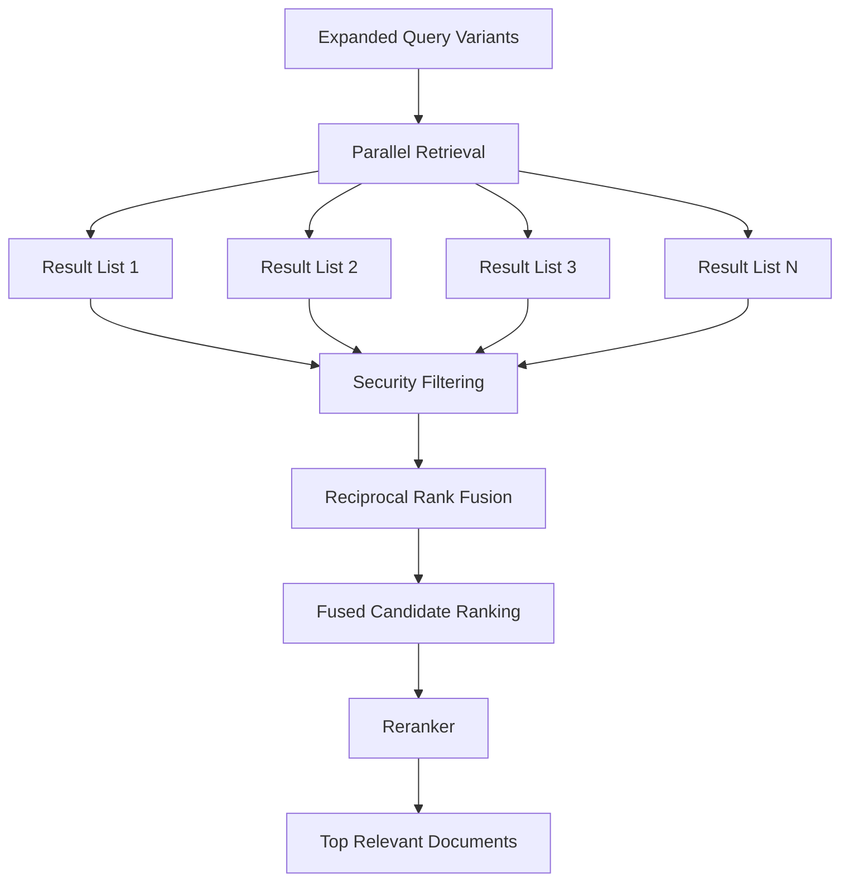
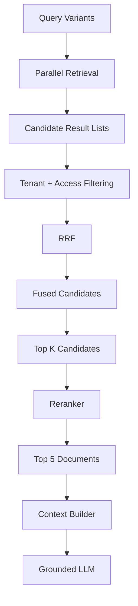

# Chapter 05 — Vector Search, Rank Fusion & LLM Reranking

## 1. Chapter Goal

In Chapter 03, we learned how to transform one user query into multiple retrieval representations.

In Chapter 04, we learned how to route those queries to different data sources.

Now we need to solve the next problem:

> **How do we combine all of those retrieval results and decide which documents are actually the most useful?**

A single user query may produce multiple search operations:

```text
Original Query
     │
     ├── Rewrite
     ├── Step-Back
     ├── Sub-Query 1
     ├── Sub-Query 2
     ├── Sub-Query 3
     └── HyDE
```

Each representation can produce its own ranked list of documents.

For example:

```text
Rewrite
  ↓
[Doc A, Doc C, Doc B]

Step-Back
  ↓
[Doc C, Doc A, Doc D]

Sub-Query 1
  ↓
[Doc B, Doc A, Doc E]
```

Now we have a problem:

> Which documents should we keep?

This chapter introduces three important retrieval stages:

1. **Security Filtering**
2. **Reciprocal Rank Fusion (RRF)**
3. **Reranking**

The overall pipeline becomes:

```text
Multi-Query Retrieval
        ↓
Security Filtering
        ↓
Rank Fusion
        ↓
Reranking
        ↓
Top Relevant Documents
```

---

# 2. Why Multiple Retrieval Results Need Fusion

Suppose three query variants return:

```text
Query A:
1. Document A
2. Document B
3. Document C

Query B:
1. Document B
2. Document A
3. Document D

Query C:
1. Document A
2. Document D
3. Document E
```

Notice something important:

```text
Document A
```

appears near the top of multiple searches.

That is a strong signal.

Instead of treating each result list independently, we can combine their rankings.

This is the purpose of **rank fusion**.

---

# 3. Overall Retrieval Architecture



Each stage has a different responsibility.

```text
Retrieval
   ↓
Find candidates

Filtering
   ↓
Remove unauthorized candidates

RRF
   ↓
Combine rankings

Reranking
   ↓
Judge relevance more precisely
```

---

# 4. Project Structure

Create the following files:

```text
src/
└── rag/
    └── retrieval/
        ├── vectorSearch.js
        ├── filtering.js
        ├── rrf.js
        └── reranker.js
```

The responsibilities are:

```text
vectorSearch.js
    ↓
Execute multiple retrieval searches

filtering.js
    ↓
Enforce tenant and access restrictions

rrf.js
    ↓
Merge ranked result lists

reranker.js
    ↓
Produce final relevance ranking
```

---

# 5. Full Code

Before explaining each component, here is the complete implementation.

## 5.1 `src/rag/retrieval/vectorSearch.js`

```javascript
import { routeQuery } from '../routing/queryRouter.js';
import { executeAdapter } from '../adapters/dispatcher.js';

/**
 * Multi-query retrieval.
 *
 * Each query variant is routed independently
 * and searched in parallel.
 */
export async function executeMultiQueryRetrieval(queries) {
  console.log(
    `[VectorSearch] Executing parallel retrieval across ${queries.length} query variants...`
  );

  const resultsPerQuery = await Promise.all(
    queries.map(async (searchQuery) => {
      const route = await routeQuery(searchQuery);

      return await executeAdapter(
        route,
        searchQuery
      );
    })
  );

  return resultsPerQuery;
}
```

> **Important:** This assumes `executeAdapter()` is exported from a dedicated `dispatcher.js` file. If you keep the dispatcher inside another file, adjust the import accordingly.

---

# 6. Tenant & Permission Filtering

## `src/rag/retrieval/filtering.js`

```javascript
/**
 * Filters retrieved documents based on
 * tenant isolation and access level.
 */
export function filterResults(
  retrievalResultsLists,
  user
) {
  const tenantId = user?.tenantId;
  const accessLevel = user?.accessLevel;

  if (!tenantId) {
    throw new Error(
      'Cannot perform retrieval without a tenantId.'
    );
  }

  if (accessLevel === undefined || accessLevel === null) {
    throw new Error(
      'Cannot perform retrieval without an accessLevel.'
    );
  }

  return retrievalResultsLists.map((list) => {
    return list.filter((doc) => {

      // Tenant isolation
      if (
        doc.metadata?.tenantId &&
        doc.metadata.tenantId !== tenantId
      ) {
        return false;
      }

      // Access-level restriction
      if (
        doc.metadata?.accessLevel !== undefined &&
        doc.metadata.accessLevel > accessLevel
      ) {
        return false;
      }

      return true;
    });
  });
}
```

---

# 7. Reciprocal Rank Fusion

## `src/rag/retrieval/rrf.js`

```javascript
/**
 * Reciprocal Rank Fusion (RRF)
 *
 * Combines multiple ranked result lists
 * into a single ranking.
 *
 * Formula:
 *
 * RRF(d) = Σ 1 / (k + rank)
 *
 * Default k = 60.
 */
export function reciprocalRankFusion(
  lists,
  k = 60
) {
  const scores = new Map();

  for (const list of lists) {
    list.forEach((doc, index) => {
      const rank = index + 1;
      const score = 1 / (k + rank);

      if (!scores.has(doc.id)) {
        scores.set(doc.id, {
          ...doc,
          rrfScore: 0
        });
      }

      scores.get(doc.id).rrfScore += score;
    });
  }

  return [...scores.values()]
    .sort(
      (a, b) =>
        b.rrfScore - a.rrfScore
    );
}
```

---

# 8. Reranker

## `src/rag/retrieval/reranker.js`

The original implementation calls this an "LLM semantic reranker" and "cross-encoder," but the code does neither.

It actually performs a **simple lexical keyword-overlap score**.

For learning purposes, we can make that explicit:

```javascript
/**
 * Lightweight prototype reranker.
 *
 * This is NOT a true LLM reranker
 * and NOT a cross-encoder.
 *
 * It combines:
 * - RRF score
 * - keyword overlap
 */
export async function rerank(
  query,
  documents
) {
  console.log(
    `[Reranker] Re-ranking ${documents.length} candidates for query: "${query}"`
  );

  const queryTokens = query
    .toLowerCase()
    .split(/\s+/)
    .filter(
      (token) => token.length > 3
    );

  const scoredDocs = documents.map((doc) => {
    const docText = (
      `${doc.title || ''} ${doc.text || ''}`
    ).toLowerCase();

    let boost = 0;

    for (const token of queryTokens) {
      if (docText.includes(token)) {
        boost += 0.2;
      }
    }

    return {
      ...doc,
      relevanceScore:
        (doc.rrfScore || 0.1) + boost
    };
  });

  return scoredDocs.sort(
    (a, b) =>
      b.relevanceScore -
      a.relevanceScore
  );
}
```

---

# 9. Understanding Multi-Query Retrieval

The first function is:

```javascript
executeMultiQueryRetrieval(queries)
```

It receives an array such as:

```javascript
[
  "Am I eligible for a subscription refund?",
  "What policies govern subscription refunds?",
  "What are the refund eligibility requirements?",
  "How are subscription refunds calculated?"
]
```

Instead of executing them sequentially:

```text
Query 1
  ↓
wait

Query 2
  ↓
wait

Query 3
  ↓
wait

Query 4
```

we use:

```javascript
Promise.all(...)
```

which allows them to execute concurrently.

---

# 10. Why Parallel Retrieval Matters

Suppose:

```text
Query 1 = 200ms
Query 2 = 150ms
Query 3 = 300ms
Query 4 = 250ms
```

Sequential execution would take approximately:

```text
200 + 150 + 300 + 250
= 900ms
```

Parallel execution can take approximately:

```text
max(200, 150, 300, 250)
= 300ms
```

There will be some overhead, but the principle is important:

> **Independent retrieval operations should often be executed concurrently.**

This becomes especially valuable when the system uses multiple data sources.

---

# 11. Routing Every Query Variant

Inside the `map()` callback:

```javascript
const route = await routeQuery(searchQuery);
```

This means every query variant can be independently routed.

For example:

```text
Query 1
   ↓
VECTOR_DB

Query 2
   ↓
VECTOR_DB

Query 3
   ↓
AUTH_DB

Query 4
   ↓
S3
```

Then:

```javascript
return await executeAdapter(
  route,
  searchQuery
);
```

executes the selected adapter.

---

# 12. Important Correction: `executeAdapter` Import

The original chapter imports:

```javascript
import { executeAdapter } from '../adapters/s3Adapter.js';
```

That is incorrect because the S3 adapter file should not be responsible for dispatching all adapters.

Architecturally, the dispatcher belongs in its own module:

```text
adapters/
├── vectorAdapter.js
├── sqlAdapter.js
├── mongoAdapter.js
├── s3Adapter.js
└── dispatcher.js
```

Then:

```javascript
import { executeAdapter } from '../adapters/dispatcher.js';
```

This keeps responsibilities clean.

---

# 13. Retrieval Results Structure

`executeMultiQueryRetrieval()` returns multiple lists.

For example:

```javascript
[
  [
    docA,
    docB,
    docC
  ],

  [
    docB,
    docA,
    docD
  ],

  [
    docA,
    docD,
    docE
  ]
]
```

This is important.

We don't immediately flatten the result.

Why?

Because RRF needs to know the ranking of a document **within each individual list**.

The structure is therefore:

```text
Results
│
├── Query 1 results
│     ├── Rank 1
│     ├── Rank 2
│     └── Rank 3
│
├── Query 2 results
│     ├── Rank 1
│     ├── Rank 2
│     └── Rank 3
│
└── Query 3 results
      ├── Rank 1
      ├── Rank 2
      └── Rank 3
```

---

# 14. Tenant Security Filtering

Retrieval is not only about relevance.

It is also about security.

Imagine the vector database contains:

```text
Tenant A
    ├── Document 1
    └── Document 2

Tenant B
    ├── Document 3
    └── Document 4
```

A user belonging to Tenant A must not receive:

```text
Document 3
Document 4
```

even if they are highly relevant to the query.

Therefore:

```text
Retrieval
   ↓
Security Filter
   ↓
Allowed Documents
```

---

# 15. Tenant Isolation

The filter checks:

```javascript
doc.metadata?.tenantId !== tenantId
```

Suppose:

```text
User tenantId = tenant_1
```

and a document contains:

```text
tenantId = tenant_2
```

The document is rejected.

This creates:

```text
Tenant A
   ↓
Only Tenant A documents
```

This is known as **tenant isolation**.

---

# 16. Access Levels

The second security check is:

```javascript
doc.metadata.accessLevel > accessLevel
```

Suppose the user has:

```text
accessLevel = 2
```

and a document requires:

```text
accessLevel = 3
```

Then:

```text
3 > 2
```

so the user cannot access it.

Conceptually:

```text
Document access level
        ≤
User access level
        ↓
Allowed
```

Otherwise:

```text
Document access level
        >
User access level
        ↓
Denied
```

---

# 17. Why Security Filtering Happens Before RRF

The correct order is:

```text
Retrieve
   ↓
Filter unauthorized documents
   ↓
RRF
   ↓
Rerank
```

Not:

```text
Retrieve
   ↓
RRF
   ↓
Rerank
   ↓
Security filter
```

Why?

Because unauthorized documents should never participate in ranking.

Imagine an unauthorized document is ranked #1.

If it participates in RRF, it can influence the final ranking.

Even if we remove it later, the ranking calculation has already been affected.

Therefore:

> **Security filtering should happen as early as practical, ideally at the data-source query itself and again as a defense-in-depth check before fusion.**

---

# 18. Database-Level Filtering Is Even Better

The JavaScript filter is useful, but it should not be your only security boundary.

For example, Qdrant should ideally filter by tenant during retrieval:

```text
Qdrant Search
   ↓
tenantId = authenticated tenant
   ↓
Top K documents
```

Similarly, PostgreSQL should use:

```text
WHERE tenant_id = authenticated_tenant
```

rather than:

```text
SELECT everything
    ↓
filter in JavaScript
```

This is important because retrieving unauthorized data into application memory is already a security risk.

The ideal model is:

```text
Database-level ACL
       +
Application-level verification
```

---

# 19. Why the Original Fallback Values Are Dangerous

The original code used:

```javascript
const tenantId =
  user?.tenantId || 'tenant_1';
```

and:

```javascript
const accessLevel =
  user?.accessLevel ?? 10;
```

This is convenient for a demo.

But it is dangerous in a real system.

If `user` is missing, the code effectively creates:

```text
tenant_1
accessLevel 10
```

That could accidentally grant broad access.

For security-sensitive code, it is better to fail closed:

```javascript
if (!tenantId) {
  throw new Error(
    'Cannot perform retrieval without a tenantId.'
  );
}
```

This means:

> **Missing security context → reject the operation.**

That's safer than guessing.

---

# 20. What Is Reciprocal Rank Fusion?

Now we reach one of the most important algorithms in this chapter.

**Reciprocal Rank Fusion**, usually called **RRF**, combines multiple ranked lists into one ranking.

The formula is:

```text
RRF(d) = Σ 1 / (k + rank)
```

where:

```text
d    = document
rank = document's position in a result list
k    = constant, commonly 60
```

The basic idea is:

> A document receives more score when it appears near the top of multiple result lists.

---

# 21. Simple RRF Example

Suppose:

```text
List 1:
1. A
2. B
3. C

List 2:
1. B
2. A
3. D
```

For document A:

```text
List 1:
1 / (60 + 1)
```

and:

```text
List 2:
1 / (60 + 2)
```

So:

```text
RRF(A)
=
1/61 + 1/62
```

Document B:

```text
RRF(B)
=
1/62 + 1/61
```

In this example they tie because their ranks are reversed.

Document C only appears once:

```text
RRF(C)
=
1/63
```

Therefore documents appearing consistently across multiple lists tend to receive stronger combined scores.

---

# 22. Why RRF Is Useful

Imagine:

```text
Query 1 → A, B, C
Query 2 → A, D, B
Query 3 → E, A, B
```

Document A appears in all three lists.

That is a strong signal.

RRF captures that without requiring the raw scores from different retrieval systems to be directly comparable.

This is especially useful when combining:

```text
Vector search
+
Keyword search
+
Different query variants
+
Different retrievers
+
Different databases
```

---

# 23. How the RRF Implementation Works

We start with:

```javascript
const scores = new Map();
```

The `Map` stores one entry per document ID.

Conceptually:

```text
Map

docA → document + score
docB → document + score
docC → document + score
```

---

# 24. Iterating Through Each Result List

```javascript
for (const list of lists) {
```

This processes:

```text
List 1
List 2
List 3
...
```

Then:

```javascript
list.forEach((doc, index) => {
```

gives us:

```text
doc
index
```

The index starts at:

```text
0
```

but rankings start at:

```text
1
```

so we calculate:

```javascript
const rank = index + 1;
```

---

# 25. Calculating the RRF Score

```javascript
const score = 1 / (k + rank);
```

With:

```text
k = 60
rank = 1
```

we get:

```text
1 / 61
```

With:

```text
rank = 10
```

we get:

```text
1 / 70
```

Therefore:

```text
Rank 1 → higher contribution
Rank 2 → slightly lower
Rank 3 → slightly lower
...
```

This naturally rewards high-ranked documents.

---

# 26. Why the Document ID Is Important

The implementation uses:

```javascript
scores.has(doc.id)
```

This assumes that:

> **The same logical document has the same ID across retrieval results.**

For example:

```text
Query 1:
doc_123

Query 2:
doc_123

Query 3:
doc_123
```

RRF can recognize these as the same document.

If the same document is represented using different IDs:

```text
vdb_123
sql_123
mongo_123
```

the fusion layer will treat them as different documents.

Therefore, stable document identity is important.

---

# 27. Storing the Document

If the document has not been seen before:

```javascript
scores.set(doc.id, {
  ...doc,
  rrfScore: 0
});
```

The spread operator:

```javascript
...doc
```

copies the document fields.

Then we add:

```javascript
rrfScore: 0
```

After that, each occurrence adds its RRF contribution:

```javascript
scores.get(doc.id).rrfScore += score;
```

---

# 28. Final RRF Sorting

Finally:

```javascript
return [...scores.values()]
  .sort(
    (a, b) =>
      b.rrfScore - a.rrfScore
  );
```

This converts the `Map` values into an array and sorts them from highest score to lowest.

The output becomes:

```text
1. Document A → 0.048
2. Document B → 0.045
3. Document C → 0.021
4. Document D → 0.016
```

Now we have a single fused ranking.

---

# 29. RRF Does Not Understand Semantics

This is an important distinction.

RRF knows:

```text
Document A appeared at rank 1
Document B appeared at rank 2
```

It does **not** know whether Document A actually answers the user's question.

Therefore:

```text
RRF
    ↓
Ranking based on retrieval positions
```

not:

```text
RRF
    ↓
Deep semantic relevance understanding
```

That's why we introduce reranking.

---

# 30. Reranking

The purpose of reranking is:

> **Take a smaller set of candidate documents and evaluate their relevance more carefully against the user's query.**

The general architecture is:

```text
Large Candidate Set
        ↓
RRF
        ↓
Top 20–50 candidates
        ↓
Reranker
        ↓
Top 5–10 documents
```

This is usually more efficient than applying an expensive reranker to thousands of documents.

---

# 31. Important Correction: This Is Not an LLM Reranker Yet

The original chapter describes the implementation as:

> LLM Semantic Re-ranker

and:

> cross-encoder relevance scorer

But the actual code performs:

```text
Keyword overlap
+
RRF score
```

It does not call an LLM.

It does not use a cross-encoder.

It does not perform true semantic relevance scoring.

This distinction matters when learning RAG architecture.

---

# 32. How the Prototype Reranker Works

First we tokenize the query:

```javascript
const queryTokens = query
  .toLowerCase()
  .split(/\s+/)
  .filter(
    (token) => token.length > 3
  );
```

For example:

```text
"Can I get a refund after renewal?"
```

might become approximately:

```text
[
  "refund",
  "after",
  "renewal?"
]
```

The implementation is intentionally simple.

---

# 33. Creating the Document Text

We combine:

```javascript
`${doc.title || ''} ${doc.text || ''}`
```

So the reranker searches both:

```text
Title
+
Document content
```

For example:

```text
Enterprise Refund Policy
Customers can request...
```

becomes one searchable string.

---

# 34. Keyword Boost

For every query token:

```javascript
for (const token of queryTokens) {
```

we check:

```javascript
if (docText.includes(token)) {
```

If the word occurs:

```javascript
boost += 0.2;
```

So if four useful query terms occur:

```text
0.2 × 4
=
0.8 boost
```

Then:

```javascript
relevanceScore =
  rrfScore + boost;
```

---

# 35. Why Combine RRF and Keyword Score?

RRF tells us:

```text
How consistently did this document rank well
across multiple retrieval lists?
```

Keyword overlap tells us:

```text
Does the document explicitly contain
terms from the current query?
```

Combining them gives:

```text
Final Prototype Score
=
RRF Signal
+
Lexical Signal
```

This is a useful educational example of combining ranking signals.

---

# 36. But Keyword Matching Has Limitations

Consider:

```text
Query:
"Can I get my money back?"
```

Document:

```text
"Customers may request a subscription refund..."
```

The concepts are related.

But exact keyword overlap may be weak because:

```text
money back
```

and:

```text
refund
```

are different words.

Semantic models can recognize that relationship better.

This is why production systems often use:

* cross-encoder rerankers
* LLM-based relevance scoring
* specialized reranking models
* hybrid lexical + semantic scoring

---

# 37. A True LLM Reranker

A future implementation could ask an LLM to score each candidate:

```text
Query:
"Can I get a refund after renewal?"

Document:
"Customers may request a refund within 30 days
of plan renewal..."

Score the relevance from 1 to 10.
```

The model might return:

```json
{
  "score": 9
}
```

Then the ranking can use:

```text
LLM relevance
+
retrieval score
```

However, LLM reranking is more expensive and slower than simple lexical scoring.

Therefore, reranking should generally happen only after candidate reduction.

---

# 38. Cross-Encoder vs LLM Reranker

These are related but different approaches.

### Cross-Encoder

A cross-encoder evaluates:

```text
[Query + Document]
```

together using a trained relevance model.

Conceptually:

```text
Query ─────┐
           ├──> Cross-Encoder ──> Relevance Score
Document ──┘
```

### LLM Reranker

An LLM can be prompted to evaluate:

```text
Query
+
Document
```

and return a relevance score or ranking.

Both can provide stronger semantic relevance than simple keyword matching.

---

# 39. Why We Don't Rerank Everything

Suppose retrieval returns:

```text
1,000 documents
```

Calling an expensive reranker for every document is unnecessary.

Instead:

```text
1,000 candidates
      ↓
Initial retrieval
      ↓
100 candidates
      ↓
RRF
      ↓
20 candidates
      ↓
Reranker
      ↓
5 documents
```

This creates a **coarse-to-fine retrieval architecture**.

```text
Cheap / broad
      ↓
Expensive / precise
```

That is a very useful design pattern.

---

# 40. Complete Retrieval Pipeline

Putting everything together:



This is the retrieval core of the Advanced RAG system.

---

# 41. Example

Suppose the user asks:

```text
"Can I get a refund based on my current plan?"
```

Chapter 03 may generate:

```text
1. Am I eligible for a refund after plan renewal?
2. What policies govern subscription refunds?
3. What are the refund eligibility requirements?
4. What refund rules apply to subscription plans?
```

Each query is retrieved.

Results might look like:

```text
Query 1:
[A, B, C]

Query 2:
[C, A, D]

Query 3:
[A, E, B]

Query 4:
[B, A, C]
```

---

# 42. Security Filtering

Suppose:

```text
A → tenant_1
B → tenant_1
C → tenant_2
D → tenant_1
E → tenant_1
```

The user belongs to:

```text
tenant_1
```

So:

```text
C
```

is removed.

Now:

```text
[A, B]
[C → removed, A, D]
[A, E, B]
[B, A]
```

Only authorized documents continue.

---

# 43. RRF

The remaining lists are fused.

Documents appearing repeatedly near the top receive stronger scores.

Potential result:

```text
1. A → 0.064
2. B → 0.047
3. D → 0.016
4. E → 0.015
```

---

# 44. Reranking

Now the reranker evaluates the strongest candidates.

For example:

```text
A
"Enterprise Refund and Cancellation Policy"

B
"API Rate Limits and Quota Error Handling"

D
"Account Management Procedures"

E
"Subscription Terms"
```

The query is:

```text
"Can I get a refund based on my current plan?"
```

A strong reranker should recognize:

```text
A → highly relevant
E → relevant
D → potentially relevant
B → irrelevant
```

The final context might therefore be:

```text
1. Enterprise Refund and Cancellation Policy
2. Subscription Terms
3. Account Management Procedures
```

---

# 45. Why This Architecture Is Powerful

We now have multiple independent signals:

```text
Query Rewrite
       ↓
Search signal

Step-Back
       ↓
Conceptual signal

Sub-Queries
       ↓
Focused signals

HyDE
       ↓
Document-like semantic signal

RRF
       ↓
Consensus across retrieval lists

Reranker
       ↓
Deep relevance judgment
```

This is much stronger than:

```text
Query
 ↓
One vector search
 ↓
Top 5
```

---

# 46. Important Production Considerations

## 46.1 Use Real Embeddings

The previous chapter used a dummy vector.

Production retrieval should use:

```text
Query
 ↓
Embedding Model
 ↓
Query Vector
 ↓
Qdrant
```

The embedding dimension must match the Qdrant collection configuration.

---

## 46.2 Apply Security at the Source

Don't rely only on:

```text
JavaScript filter
```

Prefer:

```text
Database-level filtering
        +
Application-level verification
```

---

## 46.3 Limit Candidate Counts

Do not send hundreds or thousands of documents to an LLM reranker.

Use:

```text
Top-K retrieval
      ↓
RRF
      ↓
Top-N candidates
      ↓
Reranker
```

---

## 46.4 Validate Router Output

The router is LLM-generated.

Always validate:

```text
targetStore
```

against an allowlist.

Never allow arbitrary LLM-generated values to determine infrastructure behavior.

---

## 46.5 Protect Against Duplicate Documents

Multiple query variants may retrieve the same document.

RRF handles this naturally if the document has a stable:

```text
id
```

Make sure document IDs are consistent.

---

# 47. Recommended Retrieval Data Flow

The architecture we want to reach is:

```text
                        User Query
                            │
                            ▼
                    Query Expansion
                            │
          ┌─────────────────┼─────────────────┐
          ▼                 ▼                 ▼
       Rewrite          Step-Back         Sub-Queries
          │                 │                 │
          └─────────────────┼─────────────────┘
                            ▼
                    Multiple Queries
                            │
                            ▼
                   Parallel Retrieval
                            │
             ┌──────────────┼──────────────┐
             ▼              ▼              ▼
          Qdrant         PostgreSQL       S3
             │              │              │
             └──────────────┼──────────────┘
                            ▼
                    Security Filtering
                            │
                            ▼
                           RRF
                            │
                            ▼
                       Top Candidates
                            │
                            ▼
                         Reranker
                            │
                            ▼
                       Top Documents
                            │
                            ▼
                     Context Builder
```

This is the retrieval architecture that the following chapter will consume.

---

# 48. Summary

In this chapter, we implemented four major concepts.

## `executeMultiQueryRetrieval()`

Runs multiple query variants concurrently:

```text
Query 1 ──┐
Query 2 ──┤
Query 3 ──┼──> Parallel Retrieval
Query 4 ──┘
```

---

## `filterResults()`

Enforces:

```text
Tenant Isolation
+
Access Level
```

before documents reach the ranking layer.

---

## `reciprocalRankFusion()`

Combines multiple ranked lists using:

```text
RRF(d) = Σ 1 / (k + rank)
```

with:

```text
k = 60
```

by default.

The important intuition is:

> **Documents that consistently rank highly across multiple retrieval lists receive stronger combined scores.**

---

## `rerank()`

The current implementation performs a lightweight:

```text
RRF Score
+
Keyword Overlap
```

ranking.

It is **not yet a true LLM reranker or cross-encoder**.

A production implementation can replace this stage with a proper semantic reranking model.

---

# 49. Final Mental Model

Remember the retrieval pipeline as:

```text
                MANY QUERIES
                     │
                     ▼
              MANY RETRIEVALS
                     │
                     ▼
              SECURITY FILTER
                     │
                     ▼
                   RRF
                     │
                     ▼
             FEWER CANDIDATES
                     │
                     ▼
                 RERANKER
                     │
                     ▼
              BEST DOCUMENTS
```

Or even more simply:

> **Retrieve broadly → filter securely → fuse intelligently → rerank precisely.**

That is the central idea of this chapter.

---

# 50. What We Have Built So Far

After Chapters 01–05, our Advanced RAG architecture looks like:

```text
Chapter 01
Infrastructure
    ↓
Qdrant + Redis + PostgreSQL
    ↓
Database + LLM Clients

Chapter 02
Security
    ↓
Jailbreak Detection
    ↓
PII Protection
    ↓
Output Guardrails

Chapter 03
Query Intelligence
    ↓
Rewrite
    ↓
Step-Back
    ↓
Sub-Queries
    ↓
HyDE

Chapter 04
Source Intelligence
    ↓
Intent Router
    ↓
Qdrant / PostgreSQL / MongoDB / S3
    ↓
Unified Documents

Chapter 05
Retrieval Intelligence
    ↓
Parallel Retrieval
    ↓
Tenant Filtering
    ↓
RRF
    ↓
Reranking
    ↓
Top Documents
```

We now have a strong retrieval layer.

But we still need to answer one final question:

> **What should the system do when the retrieved context is weak, irrelevant, or insufficient to answer the user's question?**

That's where **Corrective RAG (CRAG)** becomes useful.

# Next Chapter

## Chapter 06 — CRAG Evaluation, Answer Synthesis & Master Pipeline

The next chapter will connect everything together:

```text
User Query
    ↓
Guardrails
    ↓
Query Expansion
    ↓
Intent Routing
    ↓
Multi-Source Retrieval
    ↓
Security Filtering
    ↓
RRF
    ↓
Reranking
    ↓
CRAG Evaluation
    ↓
Context Construction
    ↓
Grounded Answer Generation
    ↓
Output Guardrails
    ↓
Final Response
```

We will build the **master RAG orchestrator** that turns all of the individual components from Chapters 01–05 into one complete end-to-end pipeline.

The most important corrections to carry forward are: **`executeAdapter()` should live in a dispatcher module, security defaults should fail closed rather than silently using `tenant_1`/access level `10`, and the current reranker should be described honestly as a lexical prototype—not an LLM or cross-encoder.**
