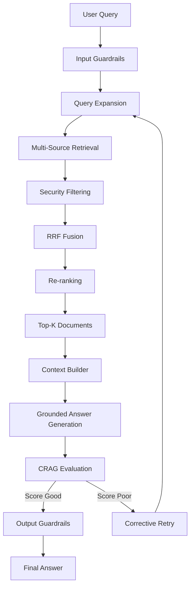
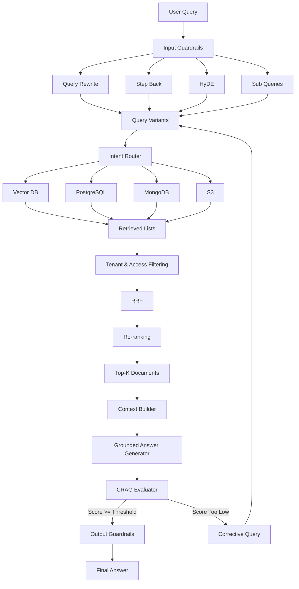

# Chapter 06 — CRAG Evaluation, Answer Synthesis & Master Pipeline

## 1. Chapter Goal

In the previous chapters, we built the major retrieval components:

* Input security guardrails
* Query rewriting
* Step-back prompting
* Sub-query decomposition
* HyDE
* Intent routing
* Multi-source retrieval
* Tenant and access-level filtering
* Reciprocal Rank Fusion (RRF)
* Re-ranking

At this point, we can retrieve relevant documents.

But retrieval alone is not enough.

We still need to answer an important question:

> **How do we convert retrieved documents into a reliable answer, and how do we know whether the answer is good enough?**

This chapter adds the final generation and evaluation layer.

The main components are:

```text
src/
└── rag/
    ├── generation/
    │   ├── contextBuilder.js
    │   └── generateAnswer.js
    │
    ├── evaluation/
    │   └── crag.js
    │
    └── ragPipeline.js
```

The complete flow becomes:



The important idea is:

> **Retrieve → Filter → Rank → Generate → Evaluate → Correct if necessary → Return**

---

# 2. What Is CRAG?

CRAG stands for:

> **Corrective Retrieval-Augmented Generation**

A normal RAG system looks like:

```text
Query
  ↓
Retrieve documents
  ↓
Generate answer
```

The problem is that retrieval can fail.

For example, imagine the user asks:

```text
Can I get a refund after changing my annual plan?
```

The retriever might return documents about:

```text
Annual plans
```

but fail to retrieve:

```text
Refund eligibility
```

The LLM may still try to answer.

That creates a risk of hallucination.

CRAG introduces an evaluation step:

```text
Query
 ↓
Retrieve
 ↓
Generate Answer
 ↓
Evaluate Answer
 ↓
Is answer good enough?
 ├── Yes → Return
 └── No  → Correct retrieval/query → Try again
```

This gives us a feedback loop.

---

# 3. Why Do We Need Answer Evaluation?

Suppose the retrieved context says:

```text
Customers can request a refund within 30 days
of the initial purchase or plan renewal.
```

The generated answer says:

```text
You can request a refund within 30 days.
```

This is well grounded.

But suppose the answer says:

```text
You can request a refund within 30 days,
and the refund will always be processed within 24 hours.
```

The second statement was not present in the retrieved context.

The answer contains unsupported information.

A CRAG evaluator should detect this.

We can evaluate:

1. **Groundedness**
2. **Relevance**
3. **Completeness**
4. **Hallucination**

---

# 4. CRAG Evaluation

Create:

```text
src/rag/evaluation/crag.js
```

```javascript
import { generateLLM } from '../llmClient.js';

/**
 * CRAG Evaluation
 *
 * Evaluates the generated answer against:
 * - the original query
 * - retrieved context
 *
 * The evaluator returns a score and missing information.
 */
export async function evaluateAnswer(query, answer, context) {
  const response = await generateLLM({
    system: `
      You are a strict RAG answer evaluator.

      Evaluate the answer using the provided query and context.

      Score the answer from 0 to 10.

      Check:

      1. Groundedness
         Is the answer supported by the retrieved context?

      2. Relevance
         Does the answer directly address the user's question?

      3. Completeness
         Does the answer contain the important information needed
         to answer the question?

      4. Hallucination
         Does the answer contain unsupported claims?

      Return JSON only:

      {
        "score": number,
        "grounded": boolean,
        "relevance": "high" | "medium" | "low",
        "missing": string[]
      }
    `,

    user: JSON.stringify({
      query,
      answer,
      context
    })
  });

  try {
    const parsed = JSON.parse(response.text);

    if (
      typeof parsed.score === 'number' &&
      parsed.score >= 0 &&
      parsed.score <= 10
    ) {
      return {
        score: parsed.score,
        grounded: Boolean(parsed.grounded),
        relevance: parsed.relevance || 'unknown',
        missing: Array.isArray(parsed.missing)
          ? parsed.missing
          : []
      };
    }
  } catch (error) {
    console.warn(
      `[CRAG Evaluator] Could not parse evaluation response: ${error.message}`
    );
  }

  /*
   * Fallback behavior.
   *
   * In a production system, silently passing an invalid
   * evaluation can be dangerous. This fallback keeps the
   * demo pipeline running.
   */
  return {
    score: 0,
    grounded: false,
    relevance: 'unknown',
    missing: ['Evaluation could not be completed']
  };
}
```

---

# 5. Understanding the CRAG Evaluator

The evaluator receives three things:

```javascript
evaluateAnswer(query, answer, context)
```

These represent:

```text
Query
  ↓
What did the user ask?

Answer
  ↓
What did the LLM generate?

Context
  ↓
What information was retrieved?
```

The evaluator compares them.

For example:

```text
Query:
"Can I get a refund?"

Context:
"Customers can request a refund within 30 days."

Answer:
"Yes, you can request a refund within 30 days."
```

The evaluator should produce something similar to:

```json
{
  "score": 9,
  "grounded": true,
  "relevance": "high",
  "missing": []
}
```

---

# 6. Why JSON Validation Matters

The LLM is not guaranteed to return valid JSON.

It might return:

```text
The answer looks good. Score: 9/10.
```

instead of:

```json
{
  "score": 9,
  "grounded": true,
  "relevance": "high",
  "missing": []
}
```

Therefore we need:

```javascript
JSON.parse(response.text)
```

inside a `try/catch`.

We also validate:

```javascript
typeof parsed.score === 'number'
```

and:

```javascript
parsed.score >= 0
parsed.score <= 10
```

This prevents obviously invalid evaluator responses from entering the pipeline.

### Production improvement

For a production system, structured model output or a schema validator such as Zod should be preferred over relying only on prompt instructions.

---

# 7. Context Builder

After retrieval and re-ranking, we have something like:

```javascript
[
  {
    id: 'doc_1',
    title: 'Refund Policy',
    text: 'Customers can request...',
    source: 'Qdrant_VECTOR_DB'
  },
  {
    id: 'doc_2',
    title: 'Subscription Policy',
    text: 'Annual plans...',
    source: 'PostgreSQL_AUTH_DB'
  }
]
```

The LLM needs this information in a clean format.

That's the job of the context builder.

Create:

```text
src/rag/generation/contextBuilder.js
```

```javascript
/**
 * Builds a structured context string from
 * the top-ranked retrieved documents.
 */
export function buildContext(documents) {
  if (!documents || documents.length === 0) {
    return 'No relevant document context found.';
  }

  return documents
    .map((doc, index) => {
      return `SOURCE ${index + 1} [${doc.source || 'KnowledgeBase'}]

Title: ${doc.title || 'Untitled'}

Content:
${doc.text || 'No content available.'}`;
    })
    .join('\n\n---\n\n');
}
```

---

# 8. Why Do We Need a Context Builder?

We don't want to send raw JavaScript objects directly into the prompt.

Instead of:

```javascript
[
  {
    id: 'doc1',
    metadata: {...},
    score: 0.92,
    text: '...'
  }
]
```

we create a readable context:

```text
SOURCE 1 [Qdrant_VECTOR_DB]

Title: Enterprise Refund Policy

Content:
Customers can request a refund within 30 days.

---

SOURCE 2 [PostgreSQL_AUTH_DB]

Title: Account Information

Content:
User is subscribed to Enterprise Pro.
```

This gives the LLM a clear boundary between sources.

---

# 9. Source Labels Are Important

Notice:

```text
SOURCE 1
SOURCE 2
SOURCE 3
```

This allows the answer generator to refer to the source.

For example:

```text
You are eligible for a refund within 30 days
of renewal. [SOURCE 1]
```

This is much better than giving the model an unstructured block of text.

### Important limitation

The current `generateAnswer()` implementation does not enforce that the model actually cites `[SOURCE N]`.

The prompt only asks it to cite sources.

A production implementation should validate or structure citations if source attribution is a hard requirement.

---

# 10. Grounded Answer Generation

Now we need to generate the actual answer.

Create:

```text
src/rag/generation/generateAnswer.js
```

```javascript
import { generateLLM } from '../llmClient.js';

/**
 * Generates an answer using only the supplied
 * retrieved context.
 */
export async function generateAnswer(query, context) {
  const response = await generateLLM({
    system: `
      You are a grounded enterprise assistant.

      Answer the user's question using the provided context.

      Rules:

      1. Do not invent facts.
      2. Do not use information that is not supported by the context.
      3. If the context is insufficient, clearly say so.
      4. Prefer retrieved information over assumptions.
      5. Cite sources using [SOURCE N] when available.
      6. Keep the answer concise and directly relevant.
    `,

    user: `
Question:
${query}

Retrieved Context:
${context}
    `
  });

  return response.text.trim();
}
```

---

# 11. How Grounded Generation Works

The generator receives:

```text
Question
+
Retrieved Context
```

For example:

```text
Question:
Can I get a refund?

Context:
SOURCE 1 [Qdrant_VECTOR_DB]

Title: Refund Policy

Content:
Customers can request a full refund within
30 days of initial purchase or renewal.
```

The model should answer:

```text
Yes. Customers can request a full refund within
30 days of the initial purchase or plan renewal. [SOURCE 1]
```

The important principle is:

> **The LLM should synthesize the retrieved evidence, not replace the retrieval system with its own unsupported knowledge.**

---

# 12. The Complete RAG Pipeline

We now have all the major pieces:

```text
Input Guardrails
      ↓
Query Expansion
      ↓
Multi-Source Retrieval
      ↓
Security Filtering
      ↓
RRF
      ↓
Re-ranking
      ↓
Top-K
      ↓
Context Building
      ↓
Answer Generation
      ↓
CRAG Evaluation
      ↓
Output Guardrails
```

Now we connect everything.

---

# 13. Master RAG Orchestrator

Create:

```text
src/rag/ragPipeline.js
```

```javascript
import { inputGuardrails } from './guardrails/input.js';

import { rewriteQuery } from './query/rewrite.js';
import { createStepBackQuery } from './query/stepBack.js';
import { createHyDE } from './query/hyde.js';
import { createSubQueries } from './query/subQueries.js';

import { executeMultiQueryRetrieval } from './retrieval/vectorSearch.js';
import { filterResults } from './retrieval/filtering.js';
import { reciprocalRankFusion } from './retrieval/rrf.js';
import { rerank } from './retrieval/reranker.js';

import { buildContext } from './generation/contextBuilder.js';
import { generateAnswer } from './generation/generateAnswer.js';

import { evaluateAnswer } from './evaluation/crag.js';

import { outputGuardrails } from './guardrails/output.js';

/**
 * Master RAG Orchestrator
 *
 * Coordinates:
 * - input security
 * - query expansion
 * - retrieval
 * - filtering
 * - ranking
 * - generation
 * - CRAG evaluation
 * - output security
 */
export async function productionRAG(
  userQuery,
  user,
  maxRetries = 2
) {
  console.log('\n======================================================');
  console.log(`[RAG Pipeline] Processing query: "${userQuery}"`);
  console.log('======================================================');

  // ==================================================
  // STEP 1 — INPUT GUARDRAILS
  // ==================================================

  const guardResult = await inputGuardrails(
    userQuery,
    user
  );

  if (!guardResult.allowed) {
    console.warn(
      `[Pipeline] Input guardrail blocked query: ${guardResult.message}`
    );

    return {
      allowed: false,
      answer: guardResult.message,
      score: 0
    };
  }

  const query = guardResult.sanitizedQuery;
  const piiMap = guardResult.piiMap;

  let currentQuery = query;

  let finalAnswer = '';
  let finalScore = 0;

  // ==================================================
  // CRAG RETRY LOOP
  // ==================================================

  for (
    let attempt = 0;
    attempt <= maxRetries;
    attempt++
  ) {
    console.log(
      `\n--- Attempt ${attempt + 1}/${maxRetries + 1} ---`
    );

    // ==================================================
    // STEPS 2–5 — QUERY EXPANSION
    // ==================================================

    console.log(
      '[Pipeline] Generating query variants...'
    );

    const [
      rewritten,
      stepBack,
      hyde,
      subQueries
    ] = await Promise.all([
      rewriteQuery(currentQuery),
      createStepBackQuery(currentQuery),
      createHyDE(currentQuery),
      createSubQueries(currentQuery)
    ]);

    const searchQueries = [
      currentQuery,
      rewritten,
      stepBack,
      hyde,
      ...subQueries
    ];

    /*
     * Remove empty queries and duplicates.
     *
     * Query expansion can produce duplicate or empty
     * variants, so normalize them before retrieval.
     */
    const uniqueSearchQueries = [
      ...new Set(
        searchQueries
          .map((item) => item?.trim())
          .filter(Boolean)
      )
    ];

    console.log(
      `[Pipeline] Generated ${uniqueSearchQueries.length} query variants.`
    );

    // ==================================================
    // STEPS 6–8 — MULTI-SOURCE RETRIEVAL
    // ==================================================

    console.log(
      '[Pipeline] Executing multi-source retrieval...'
    );

    const retrievalResults =
      await executeMultiQueryRetrieval(
        uniqueSearchQueries
      );

    // ==================================================
    // STEP 9 — SECURITY FILTERING
    // ==================================================

    console.log(
      '[Pipeline] Filtering results by tenant and access level...'
    );

    const filteredResults = filterResults(
      retrievalResults,
      user
    );

    // ==================================================
    // STEP 10 — RRF FUSION
    // ==================================================

    console.log(
      '[Pipeline] Applying Reciprocal Rank Fusion...'
    );

    const fusedResults =
      reciprocalRankFusion(filteredResults);

    // ==================================================
    // STEP 11 — RE-RANKING
    // ==================================================

    console.log(
      '[Pipeline] Re-ranking retrieved candidates...'
    );

    const reranked = await rerank(
      currentQuery,
      fusedResults
    );

    /*
     * Only send the highest-ranked documents
     * to the generation model.
     */
    const topK = reranked.slice(0, 5);

    // ==================================================
    // STEP 12 — CONTEXT BUILDING
    // ==================================================

    console.log(
      `[Pipeline] Building context from ${topK.length} documents...`
    );

    const context = buildContext(topK);

    // ==================================================
    // STEP 13 — GROUNDED ANSWER GENERATION
    // ==================================================

    console.log(
      '[Pipeline] Generating grounded answer...'
    );

    const answer = await generateAnswer(
      currentQuery,
      context
    );

    // ==================================================
    // STEP 14 — CRAG EVALUATION
    // ==================================================

    console.log(
      '[Pipeline] Evaluating generated answer...'
    );

    const evaluation = await evaluateAnswer(
      currentQuery,
      answer,
      context
    );

    console.log(
      `[Pipeline] CRAG Score: ${evaluation.score}/10`
    );

    // ==================================================
    // ACCEPT GOOD ANSWER
    // ==================================================

    if (
      evaluation.score >= 6 &&
      evaluation.grounded !== false
    ) {
      finalAnswer = answer;
      finalScore = evaluation.score;

      break;
    }

    // ==================================================
    // CORRECTIVE RETRY
    // ==================================================

    if (
      evaluation.missing &&
      evaluation.missing.length > 0 &&
      attempt < maxRetries
    ) {
      currentQuery = [
        query,
        ...evaluation.missing
      ].join(' ');

      console.log(
        `[CRAG Retry] Updated query: "${currentQuery}"`
      );

      continue;
    }

    /*
     * No useful corrective information is available.
     * Keep the generated answer instead of retrying
     * blindly.
     */
    finalAnswer = answer;
    finalScore = evaluation.score;

    break;
  }

  // ==================================================
  // STEP 15 — OUTPUT GUARDRAILS
  // ==================================================

  console.log(
    '[Pipeline] Running output guardrails...'
  );

  const finalOutput = outputGuardrails(
    finalAnswer,
    user,
    piiMap
  );

  if (!finalOutput.allowed) {
    return {
      allowed: false,
      answer: finalOutput.answer,
      score: 0
    };
  }

  return {
    allowed: true,
    answer: finalOutput.answer,
    score: finalScore
  };
}
```

---

# 14. Understanding the Master Pipeline

The master pipeline is mostly an **orchestrator**.

It does not implement retrieval itself.

Instead, it calls specialized modules:

```text
ragPipeline.js
    │
    ├── guardrails
    ├── query expansion
    ├── retrieval
    ├── filtering
    ├── RRF
    ├── reranking
    ├── context builder
    ├── answer generator
    ├── CRAG evaluator
    └── output guardrails
```

This separation is important.

Instead of one giant file containing thousands of lines, each responsibility is isolated.

---

# 15. Query Expansion Happens in Parallel

This section is important:

```javascript
const [
  rewritten,
  stepBack,
  hyde,
  subQueries
] = await Promise.all([
  rewriteQuery(currentQuery),
  createStepBackQuery(currentQuery),
  createHyDE(currentQuery),
  createSubQueries(currentQuery)
]);
```

Without `Promise.all()`:

```text
Rewrite
  ↓
wait
  ↓
Step-back
  ↓
wait
  ↓
HyDE
  ↓
wait
  ↓
Sub-queries
```

This is slower.

With `Promise.all()`:

```text
             ┌── Rewrite
             │
             ├── Step-back
Query ───────┼── HyDE
             │
             └── Sub-queries

             ↓
       All results
```

The operations are independent, so parallel execution reduces latency.

---

# 16. Query Variant Normalization

The pipeline creates:

```javascript
const searchQueries = [
  currentQuery,
  rewritten,
  stepBack,
  hyde,
  ...subQueries
];
```

Then:

```javascript
const uniqueSearchQueries = [
  ...new Set(
    searchQueries
      .map((item) => item?.trim())
      .filter(Boolean)
  )
];
```

This does three things.

### Remove whitespace

```javascript
.trim()
```

### Remove empty values

```javascript
.filter(Boolean)
```

### Remove duplicates

```javascript
new Set(...)
```

This is useful because query expansion may produce:

```text
"refund policy"
"refund policy"
"refund policy details"
"refund eligibility"
```

There is no reason to retrieve the exact same query twice.

---

# 17. Retrieval

The pipeline sends all query variants into:

```javascript
executeMultiQueryRetrieval(uniqueSearchQueries)
```

The retrieval layer then performs:

```text
Query 1 → Router → Adapter → Results
Query 2 → Router → Adapter → Results
Query 3 → Router → Adapter → Results
...
```

The result looks conceptually like:

```javascript
[
  [docs for query 1],
  [docs for query 2],
  [docs for query 3],
  [docs for query 4]
]
```

These separate ranked lists are later combined using RRF.

---

# 18. Security Filtering Happens Before Ranking

This is a critical architectural decision.

We perform:

```javascript
filterResults(
  retrievalResults,
  user
);
```

before:

```javascript
reciprocalRankFusion(...)
```

and before:

```javascript
rerank(...)
```

The flow is:

```text
Retrieved Documents
       ↓
Tenant / Permission Filter
       ↓
Safe Candidate Set
       ↓
RRF
       ↓
Reranking
```

We don't want unauthorized documents influencing the ranking or reaching the LLM.

### Even better in production

Filtering should ideally happen as close to the data source as possible.

For example:

```text
Qdrant
  ↓
tenantId filter
  ↓
accessLevel filter
  ↓
Application validation
```

The application-level filter is defense-in-depth, not a replacement for source-level authorization.

---

# 19. RRF Fusion

After filtering:

```javascript
const fusedResults =
  reciprocalRankFusion(filteredResults);
```

RRF combines the multiple ranked lists.

Conceptually:

```text
Query 1 results ──┐
Query 2 results ──┤
Query 3 results ──┼──→ RRF → Unified Ranking
Query 4 results ──┤
Query 5 results ──┘
```

A document appearing near the top across several query variants receives a stronger combined score.

---

# 20. Re-ranking

After RRF:

```javascript
const reranked = await rerank(
  currentQuery,
  fusedResults
);
```

The reranker performs a second ranking stage.

Then we select:

```javascript
const topK = reranked.slice(0, 5);
```

This gives us a coarse-to-fine retrieval architecture:

```text
Many Candidates
      ↓
RRF
      ↓
Fused Candidates
      ↓
Reranker
      ↓
Top 5
      ↓
LLM
```

This is better than sending hundreds of documents to the LLM.

---

# 21. Context Construction

The top five documents are converted into prompt context:

```javascript
const context = buildContext(topK);
```

For example:

```text
SOURCE 1 [Qdrant_VECTOR_DB]

Title: Refund Policy

Content:
Customers can request a refund within 30 days.

---

SOURCE 2 [PostgreSQL_AUTH_DB]

Title: Account Information

Content:
Customer is on Enterprise Pro.
```

Now the generation model has a structured evidence package.

---

# 22. Grounded Answer Generation

The generator receives:

```javascript
const answer = await generateAnswer(
  currentQuery,
  context
);
```

The model should use the context rather than answering purely from its internal knowledge.

This is the core RAG generation principle:

```text
Retrieved Evidence
       ↓
      LLM
       ↓
Grounded Answer
```

---

# 23. CRAG Evaluation

After generating the answer:

```javascript
const evaluation = await evaluateAnswer(
  currentQuery,
  answer,
  context
);
```

The evaluator checks whether the answer is good enough.

Example:

```json
{
  "score": 9,
  "grounded": true,
  "relevance": "high",
  "missing": []
}
```

The pipeline can then accept the answer.

---

# 24. Corrective Retrieval

Now consider a bad result:

```json
{
  "score": 4,
  "grounded": false,
  "relevance": "medium",
  "missing": [
    "refund eligibility",
    "plan renewal policy"
  ]
}
```

The pipeline can modify the query:

```javascript
currentQuery = [
  query,
  ...evaluation.missing
].join(' ');
```

For example:

```text
Original:
Can I get a refund?

Corrective query:
Can I get a refund?
refund eligibility
plan renewal policy
```

Then the pipeline loops again:

```text
Bad Answer
    ↓
CRAG Evaluation
    ↓
Missing Information
    ↓
Corrective Query
    ↓
Retrieve Again
    ↓
Generate Again
    ↓
Evaluate Again
```

This is the **corrective** part of Corrective RAG.

---

# 25. Why Do We Limit Retries?

The function accepts:

```javascript
maxRetries = 2
```

Therefore the pipeline can execute at most:

```text
Initial attempt
+
Retry 1
+
Retry 2
```

Maximum:

```text
3 attempts
```

Without a retry limit, a system could repeatedly regenerate queries and call the LLM indefinitely.

That creates:

* higher latency
* higher API cost
* possible infinite loops
* poor user experience

Always put a hard limit around automated retries.

---

# 26. Why We Should Not Blindly Retry

A low CRAG score doesn't necessarily mean retrieval is the problem.

For example:

```text
Retrieved context is correct
```

but:

```text
LLM generated a poor answer
```

In that case, changing the query may not help.

Similarly, if:

```text
No document exists for the question
```

repeating retrieval won't magically create the missing information.

A mature CRAG system should distinguish between:

```text
GOOD_RETRIEVAL + BAD_GENERATION
```

and:

```text
BAD_RETRIEVAL
```

The current implementation uses `missing` as a simple corrective signal. This is a useful prototype, but production systems can make the correction strategy much more sophisticated.

---

# 27. Output Guardrails

After CRAG accepts the answer, we run:

```javascript
outputGuardrails(
  finalAnswer,
  user,
  piiMap
);
```

This is important because even if:

```text
Retrieval is secure
```

and:

```text
Answer is grounded
```

the final answer still needs output validation.

The flow is:

```text
Generated Answer
      ↓
Output Security Checks
      ↓
PII Restoration
      ↓
Final Response
```

The exact order of PII restoration versus secret scanning should be designed carefully for the production security model.

---

# 28. Complete Architecture

At this point, our RAG architecture looks like:



---

# 29. End-to-End Example

Suppose the user asks:

```text
Can I get a refund after renewing my annual plan?
```

### Step 1 — Input Guardrails

The query is checked for:

```text
Prompt injection
PII
Blocked user
```

Result:

```text
Allowed
```

---

### Step 2 — Query Expansion

The system creates:

```text
Original:
Can I get a refund after renewing my annual plan?

Rewrite:
What is the refund eligibility after annual plan renewal?

Step-back:
What policies govern subscription refunds and renewals?

Sub-query:
What is the refund policy?

Sub-query:
What are the annual plan renewal rules?

HyDE:
A hypothetical policy passage about annual subscription
refund eligibility...
```

---

### Step 3 — Routing

The router determines that the question requires:

```text
MULTI_STORE
```

because it may need:

```text
Account/plan information
+
Refund policy
```

---

### Step 4 — Retrieval

The system retrieves documents from:

```text
PostgreSQL
Qdrant
```

---

### Step 5 — Security Filtering

Documents are filtered according to:

```text
tenantId
accessLevel
```

---

### Step 6 — RRF

Multiple retrieval lists become one ranking:

```text
1. Refund Policy
2. Annual Subscription Policy
3. Account Information
4. Cancellation Policy
...
```

---

### Step 7 — Re-ranking

The most relevant documents move to the top.

For example:

```text
1. Refund Policy
2. Annual Renewal Policy
3. Account Information
```

---

### Step 8 — Context Building

The top documents become:

```text
SOURCE 1
Refund Policy
...

SOURCE 2
Annual Renewal Policy
...
```

---

### Step 9 — Generation

The LLM generates:

```text
Yes. Customers can request a refund within 30 days
of a plan renewal, subject to the applicable plan terms.
[SOURCE 1]
```

---

### Step 10 — CRAG

The evaluator checks:

```text
Groundedness: Yes
Relevance: High
Completeness: High
Hallucination: No
```

Score:

```text
9/10
```

The answer is accepted.

---

### Step 11 — Output Guardrails

The system:

```text
Checks sensitive content
Restores allowed PII
Returns final answer
```

---

# 30. Important Production Improvements

The current pipeline is a strong learning implementation, but several areas should be upgraded before calling it truly production-ready.

### 1. Validate LLM structured output

Instead of trusting:

```javascript
JSON.parse(response.text)
```

use a schema validator.

For example:

```text
LLM
 ↓
JSON
 ↓
Schema validation
 ↓
Application
```

---

### 2. Use actual embeddings

The earlier vector adapter currently uses a dummy vector:

```javascript
new Array(1536)
```

That is fine for demonstrating architecture.

Production retrieval should be:

```text
Query
 ↓
Embedding Model
 ↓
Real Query Vector
 ↓
Qdrant Search
```

---

### 3. Apply authorization at the data source

Don't rely only on:

```javascript
filterResults()
```

Ideally:

```text
Database / Vector DB
        ↓
Tenant filtering
        ↓
Access filtering
        ↓
Application verification
```

---

### 4. Improve CRAG correction

The current implementation appends:

```text
evaluation.missing
```

to the query.

A more advanced system could perform:

```text
CRAG
 ↓
Determine failure type
 ├── Missing documents
 ├── Poor ranking
 ├── Insufficient context
 └── Generation problem
```

Then choose a different corrective action.

---

### 5. Add observability

A production pipeline should record:

```text
requestId
userId / tenantId
query
query variants
retrieval latency
retrieved document IDs
RRF scores
reranking scores
token usage
LLM latency
CRAG score
retry count
final result
```

This makes debugging much easier.

---

### 6. Add timeouts

Every external operation can fail:

```text
OpenAI
Qdrant
PostgreSQL
MongoDB
S3
Redis
```

Production code should use:

```text
timeouts
retries
backoff
circuit breakers
```

where appropriate.

---

### 7. Add cost controls

Query expansion can dramatically increase LLM calls.

For one user query we may call:

```text
Rewrite      → 1 LLM call
Step-back    → 1 LLM call
HyDE         → 1 LLM call
Sub-queries  → 1 LLM call
Generation   → 1 LLM call
Evaluation   → 1 LLM call
```

That's already:

```text
6 LLM calls
```

per attempt.

With two retries:

```text
6 × 3 = 18 LLM calls
```

Therefore production systems should carefully control:

* number of query variants
* retry count
* model selection
* token limits
* evaluation frequency

---

# 31. One Important Naming Detail

The original chapter calls this a:

> "Master 13-Step Production Orchestrator"

But the implementation actually contains more logical operations:

```text
1. Input guardrails
2. Query rewrite
3. Step-back
4. HyDE
5. Sub-query generation
6. Routing
7. Retrieval
8. Multi-source aggregation
9. Filtering
10. RRF
11. Re-ranking
12. Top-K selection
13. Context construction
14. Answer generation
15. CRAG evaluation
16. Output guardrails
```

The "13-step" terminology can therefore be understood as the **course's conceptual grouping**, not literally 13 function calls.

This distinction is useful when documenting the architecture.

---

# 32. Final Architecture After Chapter 06

Our RAG system now has:

```text
                    ┌──────────────────┐
                    │   User Query     │
                    └────────┬─────────┘
                             ↓
                    ┌──────────────────┐
                    │ Input Guardrails │
                    └────────┬─────────┘
                             ↓
                    ┌──────────────────┐
                    │ Query Expansion  │
                    └────────┬─────────┘
                             ↓
                    ┌──────────────────┐
                    │  Intent Router   │
                    └────────┬─────────┘
                             ↓
             ┌───────────────┼───────────────┐
             ↓               ↓               ↓
          Qdrant          SQL DB          Mongo/S3
             └───────────────┼───────────────┘
                             ↓
                    ┌──────────────────┐
                    │ Security Filter  │
                    └────────┬─────────┘
                             ↓
                    ┌──────────────────┐
                    │       RRF        │
                    └────────┬─────────┘
                             ↓
                    ┌──────────────────┐
                    │    Re-ranker     │
                    └────────┬─────────┘
                             ↓
                    ┌──────────────────┐
                    │      Top-K       │
                    └────────┬─────────┘
                             ↓
                    ┌──────────────────┐
                    │ Context Builder  │
                    └────────┬─────────┘
                             ↓
                    ┌──────────────────┐
                    │ Grounded LLM     │
                    └────────┬─────────┘
                             ↓
                    ┌──────────────────┐
                    │  CRAG Evaluator  │
                    └───────┬──┬───────┘
                            │  │
                    Good ───┘  └── Poor
                     ↓             ↓
              Output Guardrail   Retry
                     ↓             │
               Final Answer ←──────┘
```

---

# 33. Chapter Summary

In this chapter, we completed the generation and evaluation layer of our Advanced RAG system.

### We implemented:

**`buildContext()`**

Converts retrieved documents into structured LLM context.

**`generateAnswer()`**

Generates an answer using retrieved evidence instead of relying purely on model knowledge.

**`evaluateAnswer()`**

Uses CRAG evaluation to check:

* Groundedness
* Relevance
* Completeness
* Hallucination

**`productionRAG()`**

Connects the entire RAG architecture into one asynchronous workflow.

The complete conceptual pipeline is:

```text
User Query
    ↓
Guardrails
    ↓
Query Expansion
    ↓
Intent Routing
    ↓
Multi-Source Retrieval
    ↓
Security Filtering
    ↓
RRF
    ↓
Re-ranking
    ↓
Top-K
    ↓
Context Building
    ↓
Grounded Generation
    ↓
CRAG Evaluation
    ↓
Corrective Retry if Needed
    ↓
Output Guardrails
    ↓
Final Answer
```

The most important lesson from this chapter is:

> **A strong RAG system does not simply retrieve documents and ask an LLM to answer. It evaluates the answer and can use that evaluation to improve retrieval before returning the final response.**

---

# Next Chapter

## Chapter 07 — Asynchronous Ingestion & Background Worker

The next problem is:

> **How do documents get into our RAG system in the first place?**

We will build the ingestion pipeline:

```text
PDF Upload
    ↓
API
    ↓
BullMQ Queue
    ↓
Redis
    ↓
Background Worker
    ↓
PDF Parsing
    ↓
Text Chunking
    ↓
Embeddings
    ↓
Qdrant
```

This allows expensive document processing to happen asynchronously instead of blocking the user's API request.

The biggest improvements I made here are making the **CRAG evaluator fail closed instead of automatically passing**, adding **query deduplication**, checking the evaluator's `grounded` result, and clearly separating what is **prototype behavior vs. true production architecture**.
