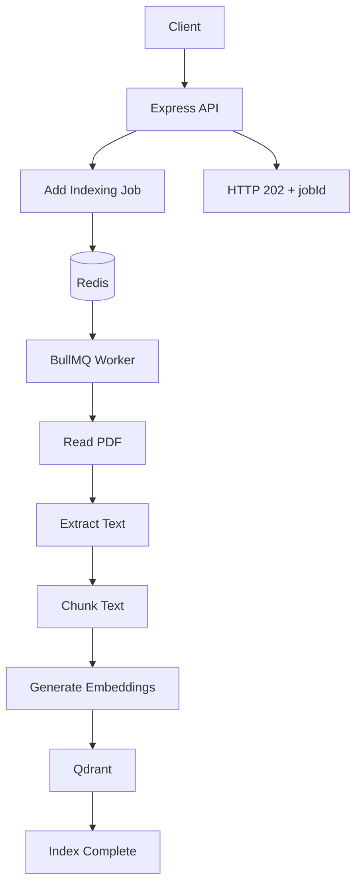
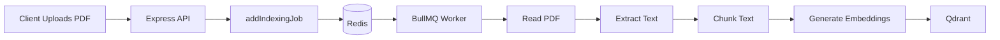
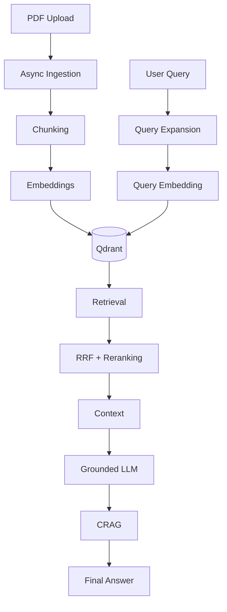
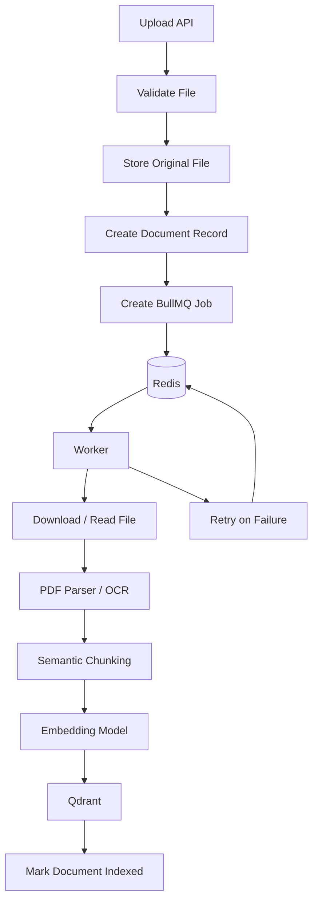

# Chapter 07 — Asynchronous Ingestion Queue & Background Worker

## 1. Chapter Goal

In Chapter 06, we completed the **query-time RAG pipeline**.

We can now:

```text
User Query
   ↓
Query Expansion
   ↓
Retrieval
   ↓
RRF
   ↓
Re-ranking
   ↓
Context
   ↓
LLM Answer
   ↓
CRAG Evaluation
```

But there is another side of a RAG system:

> **How do documents get into the vector database?**

Before Qdrant can retrieve a document, we need to:

1. Receive the PDF.
2. Read the PDF.
3. Extract its text.
4. Split the text into chunks.
5. Generate embeddings.
6. Store the vectors in Qdrant.

These operations can be expensive.

For a large PDF, processing might take several seconds or more.

Doing all of this inside an HTTP request is a bad design.

---

# 2. Why Synchronous Processing Is a Problem

Imagine this endpoint:

```text
POST /api/rag/index-pdf
```

A user uploads:

```text
company-policy.pdf
```

If the Express server processes everything synchronously:

```text
HTTP Request
    ↓
Read PDF
    ↓
Parse PDF
    ↓
Chunk text
    ↓
Generate embeddings
    ↓
Upload vectors to Qdrant
    ↓
HTTP Response
```

The client must wait until all processing is finished.

For a large document, this can lead to:

* long request times
* connection timeouts
* poor user experience
* blocked server resources
* difficulty scaling ingestion

Instead, we want:

```text
HTTP Request
    ↓
Create Background Job
    ↓
HTTP 202 Accepted
    ↓
Job ID
```

Then the background worker handles the expensive work.

---

# 3. BullMQ + Redis Architecture

We use:

* **BullMQ** — job queue
* **Redis** — queue storage and coordination
* **Worker process** — performs the actual indexing

The architecture becomes:



The important separation is:

```text
API Server
    =
Accept requests + create jobs

Worker
    =
Perform expensive background processing
```

---

# 4. End-to-End Ingestion Flow

The complete ingestion flow is:

```text
PDF Upload
    ↓
Express API
    ↓
BullMQ Queue
    ↓
Redis
    ↓
Background Worker
    ↓
PDF Parser
    ↓
Text Chunker
    ↓
Embedding Generator
    ↓
Qdrant
```

In this chapter, we'll build the queue and worker.

The API endpoint itself will be connected in Chapter 08.

---

# 5. Project Structure

After this chapter:

```text
src/
├── db/
│   ├── qdrant.js
│   ├── postgres.js
│   └── redis.js
│
├── rag/
│   └── ...
│
└── queues/
    ├── indexingQueue.js
    └── indexingWorker.js
```

The two important files are:

```text
indexingQueue.js
        ↓
Producer

indexingWorker.js
        ↓
Consumer / Worker
```

---

# 6. Understanding Producer and Consumer

A queue normally has two sides.

## Producer

The producer creates a job.

```text
API
 ↓
Producer
 ↓
Queue
```

In our system:

```javascript
addIndexingJob()
```

is the producer operation.

---

## Consumer / Worker

The worker receives and processes the job.

```text
Queue
 ↓
Worker
 ↓
Process document
```

Our worker is:

```javascript
indexingWorker
```

So:

```text
indexingQueue.js
    ↓
Adds jobs

indexingWorker.js
    ↓
Processes jobs
```

---

# 7. Creating the BullMQ Queue

Create:

```text
src/queues/indexingQueue.js
```

```javascript id="w7x4nk"
import { Queue } from 'bullmq';
import { redisConnection } from '../db/redis.js';

export const INDEXING_QUEUE_NAME = 'indexing';

export const indexingQueue = new Queue(
  INDEXING_QUEUE_NAME,
  {
    connection: redisConnection
  }
);

/**
 * Add a document indexing job to BullMQ.
 */
export async function addIndexingJob(jobData) {
  console.log(
    `[BullMQ Producer] Adding indexing job for file: ${
      jobData.originalName || jobData.filePath
    }`
  );

  const job = await indexingQueue.add(
    'index-document',
    jobData,
    {
      attempts: 3,

      backoff: {
        type: 'exponential',
        delay: 2000
      },

      removeOnComplete: true
    }
  );

  return job;
}
```

---

# 8. Understanding the Queue Code

## Import BullMQ

```javascript
import { Queue } from 'bullmq';
```

`Queue` represents the producer side of BullMQ.

We use it to create jobs.

---

## Redis Connection

```javascript
import { redisConnection } from '../db/redis.js';
```

BullMQ uses Redis to store and coordinate jobs.

The Redis configuration was created earlier in:

```text
src/db/redis.js
```

So the architecture is:

```text
BullMQ
   ↓
Redis
```

---

# 9. Queue Name

```javascript
export const INDEXING_QUEUE_NAME = 'indexing';
```

This gives our queue a name:

```text
indexing
```

Both producer and worker must use the same queue name.

For example:

```text
Producer:
indexing

Worker:
indexing
```

If they use different names:

```text
Producer → indexing
Worker   → document-indexing
```

the worker will not receive the producer's jobs.

---

# 10. Creating the Queue

```javascript
export const indexingQueue = new Queue(
  INDEXING_QUEUE_NAME,
  {
    connection: redisConnection
  }
);
```

This creates the BullMQ queue.

Conceptually:

```text
Node.js Application
       ↓
BullMQ Queue
       ↓
Redis
```

The queue itself coordinates jobs, while Redis provides the persistent/shared state needed by BullMQ.

---

# 11. Adding a Job

The helper:

```javascript
addIndexingJob(jobData)
```

is responsible for creating an indexing job.

Example:

```javascript
await addIndexingJob({
  filePath: '/uploads/policy.pdf',
  originalName: 'policy.pdf'
});
```

BullMQ stores something conceptually like:

```json
{
  "name": "index-document",
  "data": {
    "filePath": "/uploads/policy.pdf",
    "originalName": "policy.pdf"
  }
}
```

The worker later receives this data.

---

# 12. Job Attempts

We configure:

```javascript
attempts: 3
```

This means BullMQ can retry a failed job.

For example:

```text
Attempt 1
   ↓
Failed
   ↓
Attempt 2
   ↓
Failed
   ↓
Attempt 3
   ↓
Success / Failed
```

This is useful for temporary failures such as:

* temporary Qdrant outage
* network problems
* transient API errors

---

# 13. Exponential Backoff

We configure:

```javascript
backoff: {
  type: 'exponential',
  delay: 2000
}
```

The idea is to avoid retrying immediately.

Conceptually:

```text
Failure
 ↓
wait
 ↓
Retry
 ↓
Failure
 ↓
wait longer
 ↓
Retry
```

With exponential backoff, the delay increases between attempts.

This is useful when an external service is temporarily unavailable.

---

# 14. Removing Completed Jobs

We use:

```javascript
removeOnComplete: true
```

After successful completion, BullMQ can remove the completed job.

This prevents the Redis database from filling with old completed jobs.

In a production system, you may want to retain a limited number of completed jobs for debugging or audit purposes instead of removing all of them immediately.

---

# 15. Building the Background Worker

Now create:

```text
src/queues/indexingWorker.js
```

A cleaner production-oriented version is:

```javascript id="4j8r2p"
import { Worker } from 'bullmq';
import fs from 'fs/promises';
import pdfParse from 'pdf-parse';

import { redisConnection } from '../db/redis.js';
import { INDEXING_QUEUE_NAME } from './indexingQueue.js';

import {
  qdrantClient,
  COLLECTION_NAME,
  initQdrantCollection
} from '../db/qdrant.js';

/**
 * Split text into overlapping chunks.
 */
function chunkText(
  text,
  chunkSize = 500,
  overlap = 50
) {
  if (overlap >= chunkSize) {
    throw new Error(
      'Chunk overlap must be smaller than chunk size.'
    );
  }

  const chunks = [];

  let index = 0;

  while (index < text.length) {
    const chunk = text
      .slice(index, index + chunkSize)
      .trim();

    if (chunk) {
      chunks.push(chunk);
    }

    index += chunkSize - overlap;
  }

  return chunks;
}

/**
 * Demo-only deterministic vector generator.
 *
 * Replace this with a real embedding model
 * in production.
 */
function generateDummyVector(
  text,
  dimension = 1536
) {
  const vector = new Array(dimension).fill(0);

  let hash = 0;

  for (let i = 0; i < text.length; i++) {
    hash =
      (hash << 5) -
      hash +
      text.charCodeAt(i);

    hash |= 0;
  }

  for (let i = 0; i < dimension; i++) {
    vector[i] = Math.sin(hash + i) * 0.1;
  }

  return vector;
}

/**
 * Generate a stable point ID for this example.
 *
 * In a production system, use UUIDs or another
 * collision-safe ID strategy.
 */
function createPointId(filePath, chunkIndex) {
  const input = `${filePath}:${chunkIndex}`;

  let hash = 0;

  for (let i = 0; i < input.length; i++) {
    hash =
      (hash << 5) -
      hash +
      input.charCodeAt(i);

    hash |= 0;
  }

  return Math.abs(hash) + chunkIndex;
}

export const indexingWorker = new Worker(
  INDEXING_QUEUE_NAME,

  async (job) => {
    const {
      filePath,
      originalName,
      tenantId = 'tenant_1',
      accessLevel = 1
    } = job.data;

    console.log(
      `[BullMQ Worker] Processing job ${job.id}: ${
        originalName || filePath
      }`
    );

    // ==========================================
    // 1. READ PDF
    // ==========================================

    if (!filePath) {
      throw new Error(
        'Indexing job is missing filePath.'
      );
    }

    const fileBuffer = await fs.readFile(
      filePath
    );

    const pdfData = await pdfParse(
      fileBuffer
    );

    const textContent =
      pdfData.text?.trim() || '';

    if (!textContent) {
      throw new Error(
        'PDF did not contain extractable text.'
      );
    }

    console.log(
      `[BullMQ Worker] Extracted ${textContent.length} characters.`
    );

    // ==========================================
    // 2. CHUNK TEXT
    // ==========================================

    const chunks = chunkText(
      textContent,
      500,
      50
    );

    console.log(
      `[BullMQ Worker] Created ${chunks.length} chunks.`
    );

    if (chunks.length === 0) {
      throw new Error(
        'No chunks were created from PDF text.'
      );
    }

    // ==========================================
    // 3. INITIALIZE QDRANT
    // ==========================================

    await initQdrantCollection();

    // ==========================================
    // 4. CREATE VECTOR POINTS
    // ==========================================

    const points = chunks.map(
      (chunk, index) => ({
        id: createPointId(
          filePath,
          index
        ),

        vector: generateDummyVector(
          chunk
        ),

        payload: {
          text: chunk,

          title:
            originalName ||
            'Uploaded PDF Document',

          tenantId,

          accessLevel,

          source: 'PDF_UPLOAD',

          chunkIndex: index,

          indexedAt:
            new Date().toISOString()
        }
      })
    );

    // ==========================================
    // 5. UPSERT INTO QDRANT
    // ==========================================

    await qdrantClient.upsert(
      COLLECTION_NAME,
      {
        wait: true,
        points
      }
    );

    console.log(
      `[BullMQ Worker] Successfully indexed ${points.length} chunks.`
    );

    return {
      success: true,

      indexedChunks:
        chunks.length,

      fileName:
        originalName || filePath
    };
  },

  {
    connection: redisConnection,

    concurrency: 2
  }
);

indexingWorker.on(
  'completed',
  (job, result) => {
    console.log(
      `[BullMQ Worker] Job ${job.id} completed.`,
      result
    );
  }
);

indexingWorker.on(
  'failed',
  (job, error) => {
    console.error(
      `[BullMQ Worker] Job ${job?.id} failed:`,
      error.message
    );
  }
);
```

---

# 16. Worker Responsibilities

The worker performs the expensive operations:

```text
Job
 ↓
Read PDF
 ↓
Extract text
 ↓
Chunk text
 ↓
Generate vectors
 ↓
Create Qdrant points
 ↓
Upsert
```

The Express API doesn't need to wait for this.

---

# 17. Why Use `fs/promises`?

The original implementation used:

```javascript
fs.readFileSync(filePath)
```

This is synchronous.

That means Node.js blocks while reading the file.

Instead, we use:

```javascript
import fs from 'fs/promises';
```

and:

```javascript
const fileBuffer = await fs.readFile(
  filePath
);
```

This fits better with our asynchronous worker architecture.

The important distinction is:

```text
readFileSync()
    ↓
blocks current Node.js execution

fs.readFile()
    ↓
asynchronous
```

Even though this is happening in a worker process, avoiding unnecessary synchronous I/O is still a good practice.

---

# 18. PDF Parsing

We use:

```javascript
const pdfData = await pdfParse(
  fileBuffer
);
```

The parser extracts text from the PDF.

Conceptually:

```text
PDF Binary Data
      ↓
   pdf-parse
      ↓
Extracted Text
```

For example:

```text
PDF:
refund-policy.pdf

        ↓

Text:
Customers can request a refund
within 30 days...
```

---

# 19. Empty PDF Protection

We check:

```javascript
if (!textContent) {
  throw new Error(
    'PDF did not contain extractable text.'
  );
}
```

This matters because not every PDF contains machine-readable text.

For example:

```text
Scanned PDF
   ↓
Image pages
   ↓
No text layer
```

A normal PDF parser may extract little or no text.

In a more advanced system, scanned PDFs can be processed using OCR.

---

# 20. Text Chunking

Large documents should not be embedded as one giant vector.

Instead:

```text
Large Document
      ↓
Small Chunks
      ↓
Embedding per Chunk
      ↓
Vector Database
```

We use:

```javascript
chunkText(
  textContent,
  500,
  50
);
```

This means:

```text
chunkSize = 500 characters
overlap   = 50 characters
```

---

# 21. Why Chunk Overlap?

Suppose we have:

```text
Chunk 1:
A B C D E F G H

Chunk 2:
              G H I J K L
```

Some content appears in both chunks.

This is the overlap.

Why?

Because important information can sit near a chunk boundary.

Without overlap:

```text
Chunk 1: ... refund is available after
Chunk 2: renewal under certain conditions ...
```

The semantic relationship may be split.

With overlap:

```text
Chunk 1: ... refund is available after
Chunk 2: refund is available after renewal under
         certain conditions ...
```

This can improve retrieval continuity.

---

# 22. Chunk Size Is Not Universal

The example uses:

```text
500 characters
```

This is only a demonstration.

Real systems should tune chunking according to:

* document type
* language
* embedding model
* expected query size
* semantic boundaries

Better chunking strategies can use:

```text
paragraphs
sections
headings
sentences
token counts
semantic boundaries
```

For technical documents, preserving sections and headings can be especially useful.

---

# 23. Important Chunking Problem

Our simple implementation uses:

```javascript
text.slice(...)
```

This is character-based chunking.

It does not understand meaning.

For example:

```text
"The refund policy is described in section..."
```

could be split in the middle of a sentence.

A more advanced chunker would try to preserve semantic boundaries.

For this learning project, character-based chunking is useful because it makes the mechanics easy to understand.

---

# 24. Generating Embeddings

The worker needs to convert each chunk into a vector.

Conceptually:

```text
Text Chunk
    ↓
Embedding Model
    ↓
1536-dimensional vector
```

For example:

```text
"Customers can request a refund..."
                 ↓
[0.023, -0.018, 0.091, ...]
```

The vector is then stored in Qdrant.

---

# 25. Dummy Vector vs Real Embedding

For this chapter, the code contains:

```javascript
generateDummyVector(chunk)
```

This is only a **demo fallback**.

It allows the queue and Qdrant flow to be demonstrated without making an embedding API call.

It is **not semantic embedding**.

The production architecture should be:

```text
Chunk
 ↓
OpenAI Embeddings API
 ↓
Real Embedding Vector
 ↓
Qdrant
```

The query side must also use the same compatible embedding model:

```text
User Query
 ↓
Embedding Model
 ↓
Query Vector
 ↓
Qdrant Search
```

The document vectors and query vectors need to live in the same vector space.

---

# 26. Qdrant Collection Initialization

Before inserting points:

```javascript
await initQdrantCollection();
```

This ensures the collection exists.

The earlier Qdrant configuration uses:

```text
vectorSize = 1536
distance = Cosine
```

Therefore the generated production embeddings must also have the expected dimensionality.

If your embedding model produces a different dimension, the Qdrant collection configuration must match it.

---

# 27. Qdrant Point Structure

Each chunk becomes a Qdrant point:

```javascript
{
  id,
  vector,
  payload
}
```

Conceptually:

```text
Chunk
  ↓
┌──────────────────────┐
│ ID                   │
│ Vector               │
│ Metadata / Payload   │
└──────────────────────┘
```

Example:

```javascript
{
  id: 12345,

  vector: [0.02, -0.04, ...],

  payload: {
    text: 'Customers can request...',
    title: 'refund-policy.pdf',
    tenantId: 'tenant_1',
    accessLevel: 1,
    source: 'PDF_UPLOAD',
    chunkIndex: 0,
    indexedAt: '2026-09-07T...'
  }
}
```

---

# 28. Why Metadata Is Important

The payload contains more than the text.

We store:

```javascript
tenantId
accessLevel
source
chunkIndex
indexedAt
```

This becomes useful later.

For example:

```text
tenantId
    ↓
Tenant isolation

accessLevel
    ↓
Authorization filtering

source
    ↓
Source attribution

chunkIndex
    ↓
Document reconstruction / debugging

indexedAt
    ↓
Freshness tracking
```

This connects directly with the security filtering implemented in Chapter 05.

---

# 29. Tenant Isolation During Ingestion

The worker should not blindly hard-code:

```javascript
tenantId: 'tenant_1'
```

for a real multi-tenant application.

Instead, the API should enqueue the tenant information:

```javascript
await addIndexingJob({
  filePath,
  originalName,
  tenantId: user.tenantId,
  accessLevel: user.accessLevel
});
```

Then the worker stores:

```javascript
payload: {
  tenantId,
  accessLevel
}
```

This is important because later retrieval can enforce:

```text
User tenant
    ↓
Only retrieve documents
belonging to that tenant
```

---

# 30. Why Hard-Coded Tenant IDs Are Dangerous

The learning implementation might use:

```javascript
tenantId: 'tenant_1'
```

But imagine two customers:

```text
Customer A → tenant_A
Customer B → tenant_B
```

If every document is stored as:

```text
tenant_1
```

the system cannot correctly isolate their data.

Therefore:

> **Tenant identity must come from authenticated application context, not from arbitrary user input.**

---

# 31. Qdrant Upsert

Finally:

```javascript
await qdrantClient.upsert(
  COLLECTION_NAME,
  {
    wait: true,
    points
  }
);
```

`upsert` means:

```text
Insert if new
Update if ID already exists
```

This is useful for re-indexing documents.

For example:

```text
policy-v1
   ↓
Indexed

policy-v2
   ↓
Re-index
   ↓
Update / replace relevant points
```

In a production system, you usually need a stronger document-versioning and deletion strategy so old chunks don't remain orphaned.

---

# 32. Why `wait: true`?

```javascript
wait: true
```

asks Qdrant to wait until the operation is processed before the request returns.

This makes the worker's completion status more meaningful.

Conceptually:

```text
Worker
  ↓
Upsert
  ↓
Wait for Qdrant
  ↓
Success
  ↓
BullMQ job completed
```

---

# 33. Why the Worker Should Throw on Qdrant Failure

The original implementation had:

```javascript
try {
  await qdrantClient.upsert(...);
} catch (err) {
  console.warn(...);
}
```

and then returned:

```javascript
{
  success: true
}
```

This is dangerous.

Imagine:

```text
PDF parsed        ✓
Chunks created    ✓
Qdrant indexing   ✗
Worker result     ✓
```

The job would appear successful even though the document was never indexed.

That prevents BullMQ from retrying the job.

Instead:

```javascript
await qdrantClient.upsert(...);
```

should be allowed to throw.

Then:

```text
Qdrant failure
     ↓
Worker throws
     ↓
BullMQ marks job failed
     ↓
Retry
```

This is much safer.

---

# 34. Worker Concurrency

We configure:

```javascript
concurrency: 2
```

This means the worker can process up to two jobs concurrently.

Conceptually:

```text
Worker
 ├── Job A
 └── Job B
```

while additional jobs wait in Redis.

For example:

```text
Job A ──┐
Job B ──┼──→ Worker
Job C ──┤
Job D ──┘
```

Only two are actively processed at the same time.

---

# 35. Why Not Use Unlimited Concurrency?

Suppose 100 users upload PDFs simultaneously.

If we process all 100 at once:

```text
100 PDFs
 ↓
100 PDF parsers
 ↓
100 × embedding API requests
 ↓
Huge memory/API usage
```

This can overwhelm:

* CPU
* RAM
* embedding API limits
* Qdrant
* network
* worker process

Controlled concurrency provides backpressure.

---

# 36. BullMQ Completed Event

We listen for:

```javascript
indexingWorker.on(
  'completed',
  (job, result) => {
    ...
  }
);
```

This runs after successful processing.

Example:

```text
Job 42
 ↓
PDF parsed
 ↓
Chunks created
 ↓
Embeddings generated
 ↓
Qdrant upsert
 ↓
Completed
```

We can log:

```text
Job 42 completed
indexedChunks: 18
fileName: policy.pdf
```

---

# 37. BullMQ Failed Event

We also listen for:

```javascript
indexingWorker.on(
  'failed',
  (job, error) => {
    ...
  }
);
```

This is useful for debugging.

Example:

```text
Job 42
 ↓
Qdrant unavailable
 ↓
Worker throws
 ↓
BullMQ retry
 ↓
Eventually failed
 ↓
failed event
```

In production, failed jobs should also be observable through:

* metrics
* structured logs
* monitoring
* alerting
* dead-letter handling where appropriate

---

# 38. Worker Process Is Separate

The worker should run independently from the Express server.

For example:

```text
Terminal 1
──────────
npm run dev

Express API
```

and:

```text
Terminal 2
──────────
npm run worker

BullMQ Worker
```

Architecture:

```text
             ┌───────────────┐
             │ Express API   │
             └───────┬───────┘
                     │
                     ↓
                  Redis
                     ↑
                     │
             ┌───────┴───────┐
             │ BullMQ Worker │
             └───────────────┘
```

This separation is valuable because API traffic and document-processing workloads can scale independently.

---

# 39. Running the Worker

The `package.json` from Chapter 0 contains:

```json
{
  "scripts": {
    "worker": "node src/queues/indexingWorker.js"
  }
}
```

Run:

```bash
npm run worker
```

You should see something similar to:

```text
[BullMQ Worker] Worker started...
```

The worker then waits for jobs.

---

# 40. What Happens When No Jobs Exist?

The worker does not continuously scan the filesystem.

It waits for BullMQ.

Conceptually:

```text
Worker
   ↓
Waiting...
   ↓
Waiting...
   ↓
New job arrives
   ↓
Process job
   ↓
Waiting again
```

Redis and BullMQ handle the coordination.

---

# 41. Complete Ingestion Architecture

After this chapter, our ingestion subsystem looks like:



The API can return immediately after creating the job:

```text
HTTP 202 Accepted
```

while the worker continues processing.

---

# 42. Ingestion vs Query-Time RAG

It's useful to understand that our system now has **two separate pipelines**.

## Ingestion Pipeline

Runs when a document is uploaded:

```text
PDF
 ↓
Parse
 ↓
Chunk
 ↓
Embed
 ↓
Qdrant
```

---

## Query Pipeline

Runs when a user asks a question:

```text
Question
 ↓
Query Expansion
 ↓
Embedding
 ↓
Retrieval
 ↓
RRF
 ↓
Reranking
 ↓
Context
 ↓
LLM
 ↓
CRAG
```

Together:



This is one of the most important architectural ideas in a production RAG system.

---

# 43. Important Production Improvements

The current worker demonstrates the architecture, but several improvements are needed for a real production system.

## 1. Replace dummy embeddings

Current:

```javascript
generateDummyVector(chunk)
```

Production:

```text
Chunk
 ↓
Embedding Model
 ↓
Real Vector
 ↓
Qdrant
```

---

## 2. Use better chunking

Current:

```text
500 characters
50 character overlap
```

Production may use:

```text
semantic chunking
heading-aware chunking
token-based chunking
document-specific chunking
```

---

## 3. Track document IDs

Every chunk should ideally know which document it belongs to:

```javascript
payload: {
  documentId,
  chunkIndex,
  tenantId,
  ...
}
```

This allows us to:

* delete a document
* re-index a document
* update a document
* find all chunks belonging to one document

---

## 4. Handle duplicate uploads

If the same PDF is uploaded twice, we don't necessarily want duplicate vectors.

A production system can calculate:

```text
file hash
```

and use it for deduplication.

For example:

```text
PDF
 ↓
SHA-256
 ↓
documentHash
 ↓
Already indexed?
 ├── Yes → Skip
 └── No  → Index
```

---

## 5. Store document status

A production application should track:

```text
UPLOADED
PROCESSING
INDEXED
FAILED
```

For example:

```text
Document
 ├── id
 ├── filename
 ├── tenantId
 ├── status
 ├── chunkCount
 ├── error
 └── createdAt
```

Then the frontend can show:

```text
policy.pdf
Status: Processing...
```

and later:

```text
policy.pdf
Status: Indexed ✓
```

---

## 6. Don't Trust Arbitrary File Paths

The worker receives:

```javascript
job.data.filePath
```

The path should not be treated as blindly trusted user input.

Production systems should:

* validate upload location
* restrict allowed directories
* validate file type
* enforce file-size limits
* prevent path traversal
* clean up temporary files

---

## 7. Validate PDF Files

Don't rely only on:

```text
filename.endsWith(".pdf")
```

Validate:

* MIME type
* file signature/magic bytes
* maximum size
* parser behavior

---

## 8. Temporary File Cleanup

If uploaded PDFs are stored temporarily:

```text
Upload
 ↓
Temporary file
 ↓
Worker
 ↓
Parse
 ↓
Index
 ↓
Delete temporary file
```

Cleanup should happen even when processing fails.

A production worker should use a `finally` block or a dedicated storage lifecycle strategy.

---

# 44. A More Production-Oriented Architecture

Eventually, the ingestion system can become:



This is closer to a real production ingestion architecture.

---

# 45. End-to-End Example

Suppose a user uploads:

```text
enterprise-refund-policy.pdf
```

The API creates:

```json
{
  "filePath": "/uploads/enterprise-refund-policy.pdf",
  "originalName": "enterprise-refund-policy.pdf",
  "tenantId": "tenant_123",
  "accessLevel": 1
}
```

BullMQ stores the job.

The API immediately responds:

```json
{
  "success": true,
  "jobId": "42",
  "status": "queued"
}
```

The worker receives:

```text
Job 42
```

Then:

```text
Read PDF
   ↓
Extract 25,000 characters
   ↓
Create 55 chunks
   ↓
Generate 55 embeddings
   ↓
Create 55 Qdrant points
   ↓
Upsert
   ↓
Job completed
```

Later, the user asks:

```text
What is the refund period?
```

The query pipeline can retrieve the newly indexed chunks.

---

# 46. Why Asynchronous Ingestion Matters

The key idea is:

> **Document ingestion and user querying should not be tightly coupled to the same HTTP request.**

Instead:

```text
Upload
 ↓
Queue
 ↓
Background Processing
 ↓
Vector Database
```

This gives us:

* faster API responses
* retryable jobs
* controlled concurrency
* scalable workers
* better fault isolation
* easier monitoring

---

# 47. Chapter Summary

In this chapter, we built the asynchronous ingestion foundation.

### `indexingQueue.js`

Acts as the **BullMQ producer**.

It:

* connects to Redis
* creates the indexing queue
* adds document indexing jobs
* configures retries
* uses exponential backoff

---

### `indexingWorker.js`

Acts as the **background consumer**.

It:

* receives indexing jobs
* reads PDFs
* extracts text
* chunks the text
* generates vectors
* creates Qdrant points
* stores metadata
* upserts vectors into Qdrant

---

# 48. Final Architecture

Our project now has two major sides:

```text
                    RAG SYSTEM
                        │
          ┌─────────────┴─────────────┐
          │                           │
          ↓                           ↓
   INGESTION PIPELINE           QUERY PIPELINE
          │                           │
          ↓                           ↓
      PDF Upload                 User Query
          ↓                           ↓
       BullMQ                    Guardrails
          ↓                           ↓
       Worker                  Query Expansion
          ↓                           ↓
      PDF Parse                 Intent Router
          ↓                           ↓
      Chunking                  Retrieval
          ↓                           ↓
     Embeddings                     RRF
          ↓                           ↓
       Qdrant                    Re-ranking
          │                           ↓
          │                       Context
          │                           ↓
          └──────────────→       Grounded LLM
                                      ↓
                                    CRAG
                                      ↓
                                Final Answer
```

The most important architectural lesson is:

> **Ingestion is asynchronous and write-oriented; query-time RAG is synchronous and read-oriented.**

The ingestion pipeline prepares knowledge **before** users ask questions. The query pipeline consumes that prepared knowledge to produce grounded answers.

---

# Next Chapter

## Chapter 08 — Express REST API Server & Endpoint Testing

Now that we have:

```text
BullMQ Queue
      +
Background Worker
      +
Qdrant Indexing
```

we need to expose the system through HTTP APIs.

The next chapter will connect everything to Express:

```text
POST /api/rag/index-pdf
        ↓
Upload PDF
        ↓
Create BullMQ Job
        ↓
HTTP 202 + jobId
```

and:

```text
POST /api/rag/query
        ↓
productionRAG()
        ↓
Final Answer
```

We will then test the complete system using cURL.

One important thing to keep in mind going into Chapter 08: **the worker should fail when Qdrant indexing fails**, so BullMQ can retry it. Returning `success: true` after a failed Qdrant write would make the queue look healthy while the document is actually missing from the knowledge base.
