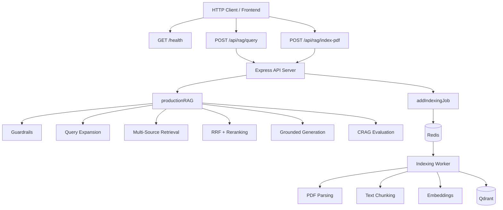
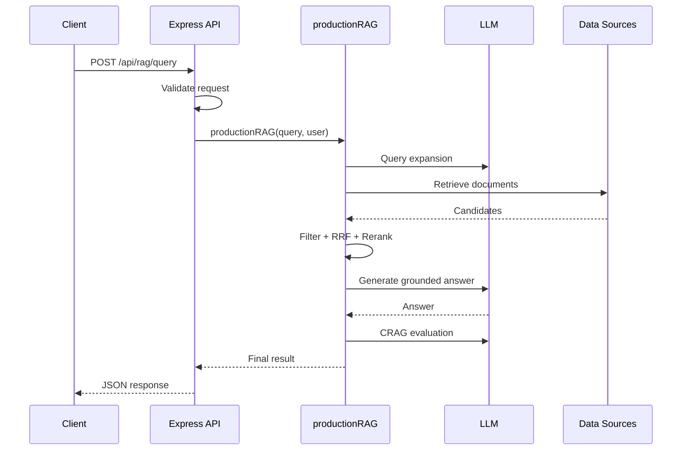
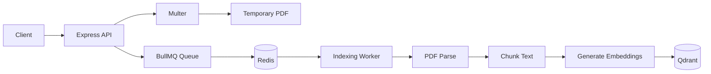
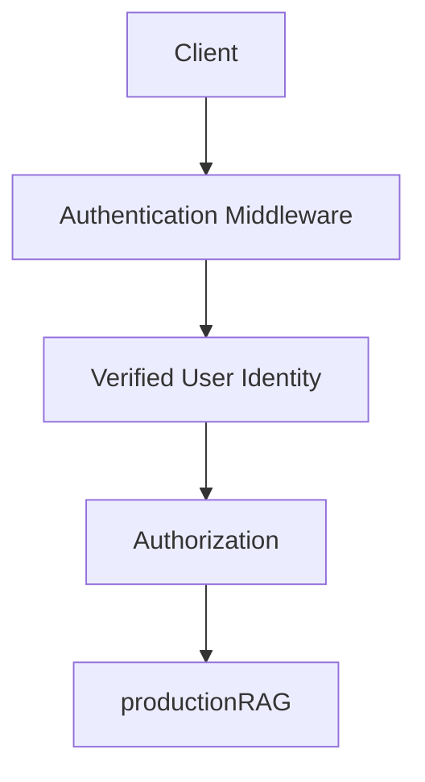
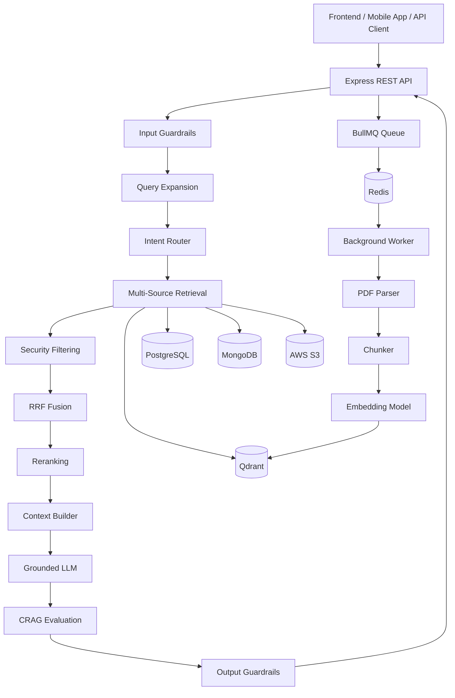

# Chapter 08 — Express REST API Server & End-to-End Verification

## 1. Chapter Goal

In the previous chapters, we built the individual components of our Advanced RAG system:

* Qdrant, Redis, and PostgreSQL infrastructure
* LLM client
* Input and output guardrails
* Query rewriting and expansion
* Multi-source retrieval
* Tenant and access-level filtering
* Reciprocal Rank Fusion (RRF)
* Candidate reranking
* Context construction
* Grounded answer generation
* CRAG evaluation
* BullMQ-based asynchronous PDF indexing

However, these components are not very useful until an application can communicate with them.

This chapter creates the **Express REST API layer** that connects external clients to our RAG system.

The API will expose three primary endpoints:

| Endpoint                  | Purpose                                           |
| ------------------------- | ------------------------------------------------- |
| `GET /health`             | Verify that the API server is running             |
| `POST /api/rag/query`     | Send a user question to the RAG pipeline          |
| `POST /api/rag/index-pdf` | Upload a PDF and queue it for background indexing |

The final architecture looks like this:



The important idea is:

> **The Express server handles requests, while long-running indexing work is delegated to the background worker.**

---

# 2. Why We Need an API Layer

Our RAG pipeline is implemented as a JavaScript function:

```js
productionRAG(userQuery, user)
```

A frontend application cannot directly call this function.

For example, a React, React Native, Next.js, or other client application needs an HTTP endpoint such as:

```text
POST /api/rag/query
```

The Express server receives the HTTP request, extracts the query, creates the user context, and calls:

```js
productionRAG(query, userInfo)
```

Similarly, PDF uploads should not perform parsing and embedding directly inside the HTTP request.

Instead:

```text
Client
  ↓
Express
  ↓
BullMQ
  ↓
Redis
  ↓
Background Worker
  ↓
PDF → Chunks → Embeddings → Qdrant
```

This keeps the HTTP server responsive.

---

# 3. Express Server Implementation

Create:

```text
src/server.js
```

A better version of the server is:

```javascript
import express from 'express';
import dotenv from 'dotenv';
import multer from 'multer';

import { productionRAG } from './rag/ragPipeline.js';
import { addIndexingJob } from './queues/indexingQueue.js';

dotenv.config();

const app = express();

const port = Number(process.env.PORT) || 3000;

const upload = multer({
  dest: 'uploads/',
  limits: {
    fileSize: 10 * 1024 * 1024 // 10 MB
  },
  fileFilter: (req, file, cb) => {
    if (file.mimetype !== 'application/pdf') {
      return cb(
        new Error('Only PDF files are allowed.')
      );
    }

    cb(null, true);
  }
});

app.use(express.json());


// ======================================================
// 1. HEALTH CHECK
// ======================================================

app.get('/health', (req, res) => {
  res.json({
    status: 'healthy',
    timestamp: new Date().toISOString(),
    service: 'Advanced RAG System (adv-rag-1)'
  });
});


// ======================================================
// 2. RAG QUERY
// ======================================================

app.post('/api/rag/query', async (req, res) => {
  try {
    const { query, user } = req.body;

    if (
      typeof query !== 'string' ||
      query.trim().length === 0
    ) {
      return res.status(400).json({
        success: false,
        error: 'Field "query" is required.'
      });
    }

    const userInfo = user || {
      id: 'usr_default',
      tenantId: 'tenant_1',
      accessLevel: 5,
      role: 'user'
    };

    const result = await productionRAG(
      query.trim(),
      userInfo
    );

    return res.json({
      success: true,
      result
    });

  } catch (error) {
    console.error(
      '[API] Error processing RAG query:',
      error
    );

    return res.status(500).json({
      success: false,
      error: 'Internal Server Error'
    });
  }
});


// ======================================================
// 3. ASYNCHRONOUS PDF INDEXING
// ======================================================

app.post(
  '/api/rag/index-pdf',
  upload.single('file'),
  async (req, res) => {
    try {
      const file = req.file;

      if (!file) {
        return res.status(400).json({
          success: false,
          error: 'No PDF file uploaded.'
        });
      }

      const user = req.body.user
        ? JSON.parse(req.body.user)
        : {
            id: 'usr_default',
            tenantId: 'tenant_1',
            accessLevel: 1,
            role: 'user'
          };

      const job = await addIndexingJob({
        filePath: file.path,
        originalName: file.originalname,
        mimeType: file.mimetype,

        tenantId: user.tenantId,
        accessLevel: user.accessLevel,

        uploadedAt: new Date().toISOString()
      });

      return res.status(202).json({
        success: true,
        message:
          'PDF indexing job accepted and queued.',
        jobId: job.id
      });

    } catch (error) {
      console.error(
        '[API] Error queueing indexing job:',
        error
      );

      return res.status(500).json({
        success: false,
        error: 'Failed to queue indexing job.'
      });
    }
  }
);


// ======================================================
// ERROR HANDLER
// ======================================================

app.use((error, req, res, next) => {
  if (error instanceof multer.MulterError) {
    return res.status(400).json({
      success: false,
      error: error.message
    });
  }

  if (error.message === 'Only PDF files are allowed.') {
    return res.status(400).json({
      success: false,
      error: error.message
    });
  }

  console.error('[API] Unhandled error:', error);

  return res.status(500).json({
    success: false,
    error: 'Internal Server Error'
  });
});


// ======================================================
// START SERVER
// ======================================================

app.listen(port, () => {
  console.log(
    `🚀 Advanced RAG Server running on port ${port}`
  );
});
```

---

# 4. Understanding the Server Code

Let's understand the implementation section by section.

## 4.1 Imports

```javascript
import express from 'express';
import dotenv from 'dotenv';
import multer from 'multer';

import { productionRAG } from './rag/ragPipeline.js';
import { addIndexingJob } from './queues/indexingQueue.js';
```

We import four important pieces.

### Express

```javascript
import express from 'express';
```

Express creates our HTTP server and handles:

* Routes
* Requests
* Responses
* Middleware

### dotenv

```javascript
import dotenv from 'dotenv';

dotenv.config();
```

Loads variables from `.env`.

For example:

```env
PORT=3000
OPENAI_API_KEY=...
QDRANT_URL=http://localhost:6333
REDIS_HOST=localhost
```

### Multer

```javascript
import multer from 'multer';
```

Multer handles:

```text
multipart/form-data
```

which is the format normally used when uploading files.

### RAG Pipeline

```javascript
import { productionRAG } from './rag/ragPipeline.js';
```

This gives the API access to the complete RAG workflow built in Chapter 06.

### Queue Producer

```javascript
import { addIndexingJob } from './queues/indexingQueue.js';
```

This allows the API to put PDF indexing jobs into BullMQ.

---

# 5. Express Application Configuration

```javascript
const app = express();

const port = Number(process.env.PORT) || 3000;
```

We create the Express application.

The server uses:

```text
PORT from .env
```

and falls back to:

```text
3000
```

if no port is configured.

Then:

```javascript
app.use(express.json());
```

enables JSON request parsing.

For example, this request:

```json
{
  "query": "What are the refund rules?"
}
```

becomes available through:

```javascript
req.body
```

---

# 6. File Upload Configuration

The original implementation used:

```javascript
multer({
  dest: 'uploads/'
});
```

That is enough for a prototype, but it does not restrict file type or size.

A safer configuration is:

```javascript
const upload = multer({
  dest: 'uploads/',
  limits: {
    fileSize: 10 * 1024 * 1024
  },
  fileFilter: (req, file, cb) => {
    if (file.mimetype !== 'application/pdf') {
      return cb(
        new Error('Only PDF files are allowed.')
      );
    }

    cb(null, true);
  }
});
```

This provides two basic protections.

### File size

```javascript
fileSize: 10 * 1024 * 1024
```

limits uploads to approximately:

```text
10 MB
```

Without a size limit, a client could potentially upload extremely large files and consume server resources.

### MIME type

```javascript
file.mimetype !== 'application/pdf'
```

rejects uploads that do not identify themselves as PDFs.

However, remember:

> MIME type validation alone is not sufficient security.

For production systems, you should also validate the actual file content/signature and consider malware scanning before processing uploaded documents.

---

# 7. Health Check Endpoint

```javascript
app.get('/health', (req, res) => {
  res.json({
    status: 'healthy',
    timestamp: new Date().toISOString(),
    service: 'Advanced RAG System (adv-rag-1)'
  });
});
```

This endpoint is intentionally simple.

Request:

```text
GET /health
```

Response:

```json
{
  "status": "healthy",
  "timestamp": "2026-09-07T12:00:00.000Z",
  "service": "Advanced RAG System (adv-rag-1)"
}
```

## Why is this useful?

Infrastructure tools can use the endpoint to determine whether the API process is alive.

For example:

```text
Load Balancer
      ↓
GET /health
      ↓
200 OK
      ↓
Server considered healthy
```

### Important distinction

This is an application-level health check.

A more advanced production system should also check dependencies such as:

* Redis
* Qdrant
* PostgreSQL
* Required configuration
* Worker availability

So:

```text
alive
```

does not necessarily mean:

```text
fully operational
```

---

# 8. RAG Query Endpoint

The main RAG endpoint is:

```text
POST /api/rag/query
```

Implementation:

```javascript
app.post('/api/rag/query', async (req, res) => {
  try {
    const { query, user } = req.body;

    // ...

    const result = await productionRAG(
      query.trim(),
      userInfo
    );

    return res.json({
      success: true,
      result
    });

  } catch (error) {
    // ...
  }
});
```

The request flow is:



---

# 9. Request Validation

We should not simply check:

```javascript
if (!query)
```

because values such as:

```javascript
""
```

or whitespace should not be accepted as meaningful questions.

Instead:

```javascript
if (
  typeof query !== 'string' ||
  query.trim().length === 0
) {
  return res.status(400).json({
    success: false,
    error: 'Field "query" is required.'
  });
}
```

This ensures that `query` is actually a non-empty string.

---

# 10. User Context

The RAG pipeline requires user information for authorization filtering.

For example:

```javascript
const userInfo = {
  id: 'usr_default',
  tenantId: 'tenant_1',
  accessLevel: 5,
  role: 'user'
};
```

These values are important because Chapter 05 introduced security filtering.

For example:

```text
User
tenantId = tenant_1
accessLevel = 5
```

should only retrieve documents that the user is allowed to access.

In a real application, you should **not trust arbitrary `user` data sent by the client**.

Instead:

```text
JWT / Session
      ↓
Authentication Middleware
      ↓
Verified User Identity
      ↓
Tenant + Permissions
      ↓
productionRAG()
```

The default user object is useful only for local development and testing.

---

# 11. Calling the Master RAG Pipeline

The API eventually reaches:

```javascript
const result = await productionRAG(
  query.trim(),
  userInfo
);
```

This single function represents the complete RAG workflow.

Conceptually:

```text
User Query
    ↓
Input Guardrails
    ↓
Query Expansion
    ↓
Intent Routing
    ↓
Multi-Source Retrieval
    ↓
Security Filtering
    ↓
RRF
    ↓
Reranking
    ↓
Top-K
    ↓
Context Building
    ↓
Grounded Generation
    ↓
CRAG Evaluation
    ↓
Output Guardrails
    ↓
Final Answer
```

This is one of the main benefits of the architecture.

The HTTP layer does not need to understand every internal RAG operation.

It simply calls:

```javascript
productionRAG()
```

---

# 12. Error Handling

If something fails:

```javascript
catch (error) {
  console.error(
    '[API] Error processing RAG query:',
    error
  );

  return res.status(500).json({
    success: false,
    error: 'Internal Server Error'
  });
}
```

The server logs the detailed error internally but returns a generic message to the client.

This is preferable to exposing internal details such as:

```text
Qdrant connection failed
Redis URL
database query
filesystem path
stack trace
API credentials
```

Production APIs should avoid leaking internal implementation details.

---

# 13. Asynchronous PDF Upload Endpoint

The second major endpoint is:

```text
POST /api/rag/index-pdf
```

This endpoint does **not** index the PDF directly.

Instead:

```text
Upload PDF
    ↓
Multer
    ↓
Save temporary file
    ↓
Create BullMQ job
    ↓
Redis
    ↓
HTTP 202
```

The worker handles the expensive work later.

---

# 14. Why HTTP 202?

The endpoint returns:

```javascript
res.status(202).json(...)
```

instead of:

```text
200 OK
```

because the operation has been **accepted but not completed yet**.

For example:

```json
{
  "success": true,
  "message": "PDF indexing job accepted and queued.",
  "jobId": "1"
}
```

The important distinction is:

```text
202 Accepted
```

means:

> "I accepted your request and scheduled the work."

It does **not** mean:

> "The document has already been indexed."

---

# 15. Queueing the PDF

After Multer processes the upload:

```javascript
const file = req.file;
```

we have information such as:

```javascript
file.path
file.originalname
file.mimetype
```

We then create a BullMQ job:

```javascript
const job = await addIndexingJob({
  filePath: file.path,
  originalName: file.originalname,
  mimeType: file.mimetype,

  tenantId: user.tenantId,
  accessLevel: user.accessLevel,

  uploadedAt: new Date().toISOString()
});
```

Notice that we also pass:

```javascript
tenantId
accessLevel
```

This is important.

The previous worker implementation hard-coded:

```javascript
tenantId: 'tenant_1'
```

That is acceptable for a demo, but not for a multi-tenant application.

The document should retain the identity of the tenant that uploaded it.

---

# 16. Queue Architecture

The complete upload workflow is:



The HTTP server therefore does not need to wait for:

```text
PDF parsing
+
chunking
+
embedding
+
Qdrant upsert
```

to finish.

---

# 17. Background Worker Responsibility

Chapter 07 created:

```text
src/queues/indexingWorker.js
```

The worker receives the job:

```javascript
{
  filePath,
  originalName,
  mimeType,
  tenantId,
  accessLevel,
  uploadedAt
}
```

Then performs:

```text
1. Read PDF
2. Extract text
3. Split text into chunks
4. Generate embeddings
5. Create Qdrant points
6. Upsert points
```

So the API and worker have clearly separated responsibilities.

### API Server

```text
Receive request
Validate request
Queue job
Return response
```

### Worker

```text
Perform expensive processing
Retry failed jobs
Index documents
```

This separation is an important production architecture pattern.

---

# 18. Multer Error Handling

The server also contains:

```javascript
app.use((error, req, res, next) => {
```

This is Express error middleware.

For example, if a file exceeds the configured size:

```text
10 MB
```

Multer can throw an error.

The middleware converts that into an HTTP response instead of allowing the process to crash.

---

# 19. Starting the Server

Our `package.json` contains:

```json
{
  "scripts": {
    "start": "node src/server.js",
    "dev": "node --watch src/server.js",
    "worker": "node src/queues/indexingWorker.js"
  }
}
```

Start the API:

```bash
npm run start
```

Expected output:

```text
🚀 Advanced RAG Server running on port 3000
```

For development:

```bash
npm run dev
```

And the worker should run separately:

```bash
npm run worker
```

You should therefore have two processes:

```text
Terminal 1
──────────
npm run start

Express API
localhost:3000


Terminal 2
──────────
npm run worker

BullMQ indexing worker
```

Both communicate through Redis.

---

# 20. End-to-End Verification

Now we can test the entire system.

---

## Step 1 — Start Infrastructure

First make sure Docker services are running:

```bash
docker compose up -d
```

Check:

```bash
docker ps
```

You should see services such as:

```text
Qdrant
Redis
PostgreSQL
```

---

# 21. Step 2 — Start the Worker

Open another terminal:

```bash
npm run worker
```

The worker should start listening for jobs from:

```text
indexing
```

queue.

---

# 22. Step 3 — Start Express

Start the API:

```bash
npm run start
```

Expected:

```text
🚀 Advanced RAG Server running on port 3000
```

---

# 23. Step 4 — Test Health Endpoint

Run:

```bash
curl http://localhost:3000/health
```

Expected response:

```json
{
  "status": "healthy",
  "timestamp": "2026-09-07T12:00:00.000Z",
  "service": "Advanced RAG System (adv-rag-1)"
}
```

If you receive this response, the Express server is reachable.

---

# 24. Step 5 — Test the RAG Endpoint

Run:

```bash
curl -X POST http://localhost:3000/api/rag/query \
  -H "Content-Type: application/json" \
  -d '{"query":"What are the rules regarding customer plan refunds?"}'
```

The server will execute:

```text
POST /api/rag/query
        ↓
productionRAG()
        ↓
Input Guardrails
        ↓
Query Expansion
        ↓
Retrieval
        ↓
Filtering
        ↓
RRF
        ↓
Reranking
        ↓
Context
        ↓
Grounded Answer
        ↓
CRAG
        ↓
Output Guardrails
```

A simplified response may look like:

```json
{
  "success": true,
  "result": {
    "allowed": true,
    "answer": "Based on the provided documentation context, customer refund requests are processed according to the plan terms.",
    "score": 8
  }
}
```

The exact response depends on the current implementation of `productionRAG()` and the configured LLM/data adapters.

---

# 25. Step 6 — Upload a PDF

Use:

```bash
curl -X POST http://localhost:3000/api/rag/index-pdf \
  -F "file=@/path/to/terms.pdf"
```

The API should immediately respond with:

```json
{
  "success": true,
  "message": "PDF indexing job accepted and queued.",
  "jobId": "1"
}
```

Notice that the server did not wait for indexing to finish.

This is the key property of our asynchronous architecture.

---

# 26. What Happens After the Upload?

After the API returns:

```text
HTTP 202
```

Redis contains the BullMQ job.

The worker receives it:

```text
BullMQ Worker
      ↓
Read PDF
      ↓
Extract text
      ↓
Chunk text
      ↓
Generate embeddings
      ↓
Create Qdrant points
      ↓
Qdrant upsert
```

The worker console might show:

```text
[BullMQ Worker] Processing job 1: terms.pdf
[BullMQ Worker] Split text into 8 chunks.
[BullMQ Worker] Successfully upserted 8 vector points to Qdrant.
[BullMQ Worker] Job 1 completed!
```

---

# 27. Important Prototype Limitation — Dummy Embeddings

There is an important limitation in the current Chapter 07 implementation.

The worker currently uses:

```javascript
generateDummyVector(chunk)
```

This creates deterministic-looking numeric vectors, but they are **not semantic embeddings**.

Similarly, Chapter 04/05's vector adapter used a dummy query vector.

Therefore, the current system demonstrates the architecture of vector search but does not yet provide genuine semantic retrieval.

A real implementation should use an embedding model:

```text
PDF chunk
   ↓
Embedding Model
   ↓
1536-dimensional vector
   ↓
Qdrant
```

And during retrieval:

```text
User Query
   ↓
Same embedding model
   ↓
Query vector
   ↓
Qdrant similarity search
```

The embedding dimensions must match the Qdrant collection configuration.

For example:

```javascript
size: 1536
```

must correspond to the selected embedding model's output dimension.

---

# 28. Important Prototype Limitation — Reranker

Another important correction from the previous chapters:

The current `reranker.js` implementation is a **lexical reranker**.

It calculates a score based on keyword overlap.

Conceptually:

```text
RRF score
   +
keyword overlap
   =
relevance score
```

It is therefore not actually:

* an LLM cross-encoder
* a neural cross-encoder
* a semantic reranker

A production implementation could replace this stage with a proper reranking model.

The architecture would then become:

```text
Initial Retrieval
      ↓
RRF
      ↓
Top 20–50 candidates
      ↓
Cross-Encoder / LLM Reranker
      ↓
Top 5–10 documents
```

This is more accurate than calling the current lexical implementation an LLM cross-encoder.

---

# 29. Important Security Consideration — Authentication

The current API accepts:

```json
{
  "query": "...",
  "user": {
    "tenantId": "tenant_1",
    "accessLevel": 5
  }
}
```

This is useful for development, but a real client should not be allowed to decide its own permissions.

A malicious client could theoretically send:

```json
{
  "tenantId": "another_tenant",
  "accessLevel": 100
}
```

Therefore production architecture should look like:



The server should derive:

```text
userId
tenantId
role
accessLevel
```

from a trusted authentication system.

The client should provide the question, not its own authorization claims.

---

# 30. Important Security Consideration — Uploaded Documents

File upload security should eventually include more than:

```text
MIME type
+
file size
```

A production document ingestion system should consider:

* File size limits
* Extension validation
* MIME validation
* File signature/content validation
* Malware scanning
* Temporary file cleanup
* Storage isolation
* Tenant ownership
* Document access control
* Audit logging
* Processing timeouts
* Worker resource limits

This becomes particularly important because uploaded documents eventually become part of the RAG knowledge base.

---

# 31. Complete End-to-End Architecture

At this point, the entire application can be visualized as:



This architecture separates the system into two major workflows.

## Query Workflow

```text
User Question
      ↓
Express
      ↓
RAG Pipeline
      ↓
Retrieve
      ↓
Generate
      ↓
Evaluate
      ↓
Response
```

## Ingestion Workflow

```text
PDF Upload
      ↓
Express
      ↓
BullMQ
      ↓
Redis
      ↓
Worker
      ↓
Parse
      ↓
Chunk
      ↓
Embed
      ↓
Qdrant
```

---

# 32. Final Project Structure

After completing all chapters, the project structure should look approximately like:

```text
adv-rag-1/
│
├── docker-compose.yml
├── package.json
├── .env
├── .env.example
│
├── uploads/
│
└── src/
    │
    ├── server.js
    │
    ├── db/
    │   ├── qdrant.js
    │   ├── postgres.js
    │   └── redis.js
    │
    ├── queues/
    │   ├── indexingQueue.js
    │   └── indexingWorker.js
    │
    └── rag/
        │
        ├── llmClient.js
        ├── ragPipeline.js
        │
        ├── guardrails/
        │   ├── input.js
        │   ├── jailbreak.js
        │   ├── pii.js
        │   └── output.js
        │
        ├── query/
        │   ├── rewrite.js
        │   ├── stepBack.js
        │   ├── subQueries.js
        │   └── hyde.js
        │
        ├── routing/
        │   └── queryRouter.js
        │
        ├── adapters/
        │   ├── vectorAdapter.js
        │   ├── sqlAdapter.js
        │   ├── mongoAdapter.js
        │   ├── s3Adapter.js
        │   └── dispatcher.js
        │
        ├── retrieval/
        │   ├── vectorSearch.js
        │   ├── filtering.js
        │   ├── rrf.js
        │   └── reranker.js
        │
        ├── generation/
        │   ├── contextBuilder.js
        │   └── generateAnswer.js
        │
        └── evaluation/
            └── crag.js
```

---

# 33. What We Built

Across the complete implementation guide, we built the major pieces of an enterprise-style RAG architecture.

### 1. Infrastructure

```text
Docker
├── Qdrant
├── Redis
└── PostgreSQL
```

### 2. LLM Abstraction

```text
src/rag/llmClient.js
```

Provides one interface for calling the LLM.

### 3. Security Guardrails

```text
Input
 ↓
Jailbreak Detection
 ↓
PII Masking
 ↓
RAG
 ↓
Output Validation
 ↓
PII Restoration
```

### 4. Query Expansion

Four major techniques:

```text
Query Rewrite
Step-Back Query
Sub-Query Decomposition
HyDE
```

### 5. Multi-Source Retrieval

The system can route queries toward:

```text
Qdrant
PostgreSQL
MongoDB
S3
```

### 6. Retrieval Optimization

```text
Multi-Query Retrieval
       ↓
Tenant Filtering
       ↓
RRF
       ↓
Reranking
       ↓
Top-K
```

### 7. Grounded Generation

```text
Documents
    ↓
Context Builder
    ↓
Grounded LLM
    ↓
Answer
```

### 8. CRAG Evaluation

```text
Answer
   ↓
Groundedness
Relevance
Completeness
Hallucination
   ↓
Score
   ↓
Retry if necessary
```

### 9. Asynchronous Ingestion

```text
PDF
 ↓
BullMQ
 ↓
Redis
 ↓
Worker
 ↓
Chunks
 ↓
Embeddings
 ↓
Qdrant
```

### 10. REST API

```text
GET  /health
POST /api/rag/query
POST /api/rag/index-pdf
```

---

# 34. Final Mental Model

The most important thing to understand from this entire project is that **RAG is not simply "embed → search → ask LLM."**

A production-oriented RAG system is a pipeline:

```text
                    USER
                     │
                     ▼
              ┌─────────────┐
              │ API Server  │
              └──────┬──────┘
                     │
                     ▼
             Input Guardrails
                     │
                     ▼
             Query Expansion
                     │
                     ▼
              Intent Routing
                     │
                     ▼
           Multi-Source Retrieval
                     │
                     ▼
            Security Filtering
                     │
                     ▼
                    RRF
                     │
                     ▼
                 Reranking
                     │
                     ▼
                Top-K Docs
                     │
                     ▼
             Context Building
                     │
                     ▼
             Grounded LLM
                     │
                     ▼
             CRAG Evaluation
                     │
              ┌──────┴──────┐
              │             │
            Good          Weak
              │             │
              ▼             ▼
           Answer        Retry
              │
              ▼
        Output Guardrails
              │
              ▼
             USER
```

And document ingestion is a separate asynchronous pipeline:

```text
                  PDF
                   │
                   ▼
              Express API
                   │
                   ▼
              BullMQ Queue
                   │
                   ▼
                 Redis
                   │
                   ▼
             Background Worker
                   │
                   ▼
              PDF Parsing
                   │
                   ▼
              Text Chunking
                   │
                   ▼
             Embedding Model
                   │
                   ▼
                Qdrant
```

This separation between **query-time processing** and **ingestion-time processing** is one of the most important architectural concepts in the project.

---

# 35. Final Conclusion

Congratulations — you have completed the **Advanced RAG Project (`adv-rag-1`) Implementation Guide**.

The project now demonstrates an end-to-end architecture containing:

1. Dockerized infrastructure with Qdrant, Redis, and PostgreSQL.
2. A shared LLM client abstraction.
3. Input/output security guardrails.
4. PII masking and restoration.
5. Jailbreak/prompt-injection detection.
6. Query rewriting.
7. Step-back prompting.
8. Sub-query decomposition.
9. HyDE-based retrieval expansion.
10. Multi-source intent routing.
11. Tenant and access-level filtering.
12. Reciprocal Rank Fusion.
13. Candidate reranking.
14. Context construction.
15. Grounded answer generation.
16. CRAG answer evaluation and retry logic.
17. BullMQ + Redis asynchronous ingestion.
18. Background PDF processing.
19. Qdrant document indexing.
20. Express REST APIs.

More importantly, the project demonstrates how these components fit together into a single system rather than existing as isolated techniques.

## What is still required for a true production deployment?

The current project is best understood as a **production-oriented learning prototype**.

Before deploying it to real users, the following areas should be upgraded:

* Real authentication and authorization
* Real PostgreSQL/MongoDB/S3 integrations
* Real embedding generation instead of dummy vectors
* Real query embeddings for Qdrant search
* Proper document-level ACL enforcement
* Stronger prompt-injection defenses
* Robust PII detection
* Structured LLM output validation
* Proper reranking model
* File content/signature validation
* Malware scanning
* Persistent document/job metadata
* Job status API
* Retry and dead-letter handling
* Observability and tracing
* Rate limiting
* Request validation
* Secret management
* Cost/token monitoring
* Automated evaluation datasets
* Production logging and metrics
* Comprehensive integration tests

The architecture built here gives you the foundation to implement those improvements without redesigning the entire system.

**The core lesson is:**

> **Good RAG is not just about retrieving better documents. It is about building a reliable system around retrieval — security, routing, ranking, grounding, evaluation, ingestion, retries, and observability all matter.**

This version also keeps the distinction clear between **what your current code actually implements** and what a production RAG system would eventually upgrade.
