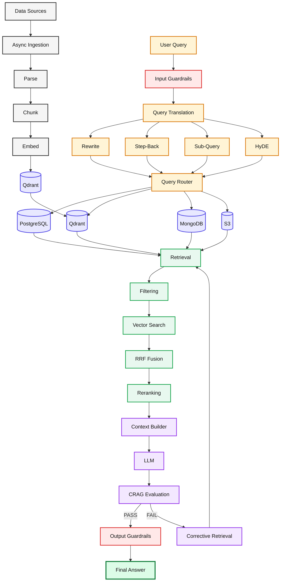

# 🚀 Advanced Production RAG System (`adv-rag-gemini-1`)

A modular, production-grade Advanced RAG implementation built in Node.js powered by **Google Gemini API**, adhering strictly to **Section 37 (Recommended Production Folder Structure)** of Day 05 Advanced RAG Curriculum.

---

## 🧭 Where to Start & Learning Roadmap

If you are new to this repository, follow this step-by-step reading order to easily understand the entire codebase:

1. **Step 1 (Start Here)**: High-Level Architecture & 15-Stage Master Pseudocode — [`explanations.md`](file:///home/aminul/development/gen-ai-cohort/week03/learning/day05/code/adv-rag-1/explanations.md)
2. **Step 2**: Server Entry Point & HTTP Endpoints (`server.js`) — [`src/explanations.md`](file:///home/aminul/development/gen-ai-cohort/week03/learning/day05/code/adv-rag-1/src/explanations.md)
3. **Step 3**: Data Access & Background Processing:
   - Database Connectors (Postgres, Qdrant, Redis): [`src/db/explanations.md`](file:///home/aminul/development/gen-ai-cohort/week03/learning/day05/code/adv-rag-1/src/db/explanations.md)
   - BullMQ Async Background Worker & Indexing: [`src/queues/explanations.md`](file:///home/aminul/development/gen-ai-cohort/week03/learning/day05/code/adv-rag-1/src/queues/explanations.md)
4. **Step 4**: Core RAG Pipeline Orchestrator (`ragPipeline.js`) — [`src/rag/explanations.md`](file:///home/aminul/development/gen-ai-cohort/week03/learning/day05/code/adv-rag-1/src/rag/explanations.md)
5. **Step 5**: Detailed RAG Stage Sub-Modules:
   - **Stages 1 & 15 (Security)**: [`src/rag/guardrails/explanations.md`](file:///home/aminul/development/gen-ai-cohort/week03/learning/day05/code/adv-rag-1/src/rag/guardrails/explanations.md) (Input/Output PII masking & jailbreak detection)
   - **Stages 2–5 (Translation)**: [`src/rag/query/explanations.md`](file:///home/aminul/development/gen-ai-cohort/week03/learning/day05/code/adv-rag-1/src/rag/query/explanations.md) (Query Rewrite, Step-Back, HyDE, Sub-Queries)
   - **Stages 6–8 (Routing)**: [`src/rag/routing/explanations.md`](file:///home/aminul/development/gen-ai-cohort/week03/learning/day05/code/adv-rag-1/src/rag/routing/explanations.md) (Intent routing to SQL/Qdrant/S3)
   - **Database Adapters**: [`src/rag/adapters/explanations.md`](file:///home/aminul/development/gen-ai-cohort/week03/learning/day05/code/adv-rag-1/src/rag/adapters/explanations.md) (Unified storage interface)
   - **Stages 9–11 (Retrieval)**: [`src/rag/retrieval/explanations.md`](file:///home/aminul/development/gen-ai-cohort/week03/learning/day05/code/adv-rag-1/src/rag/retrieval/explanations.md) (Filtering, RRF fusion, Cross-Encoder reranker)
   - **Stages 12–13 (Generation)**: [`src/rag/generation/explanations.md`](file:///home/aminul/development/gen-ai-cohort/week03/learning/day05/code/adv-rag-1/src/rag/generation/explanations.md) (Context construction & grounded answer synthesis)
   - **Stage 14 (Evaluation)**: [`src/rag/evaluation/explanations.md`](file:///home/aminul/development/gen-ai-cohort/week03/learning/day05/code/adv-rag-1/src/rag/evaluation/explanations.md) (Corrective RAG - CRAG groundedness check & retry loop)

---

## 🌟 Key Architecture & Capabilities

1. **Input Guardrails (`src/rag/guardrails/`)**: PII detection & masking, prompt injection/jailbreak filtering, policy validation.
2. **Query Translation Engine (`src/rag/query/`)**: Parallel query rewriting, Step-Back conceptual prompting, Sub-Query decomposition, HyDE (Hypothetical Document Embeddings).
3. **Dynamic Query Routing (`src/rag/routing/`)**: Directs queries to PostgreSQL (Auth/Billing), Qdrant (Vector DB), S3 (Object Storage), or Multi-Store adapters.
4. **Adapter Pattern (`src/rag/adapters/`)**: Decoupled access to heterogeneous databases (`sqlAdapter`, `vectorAdapter`, `mongoAdapter`, `s3Adapter`).
5. **Multi-Stage Retrieval & Fusion (`src/rag/retrieval/`)**: Multi-query vector search, metadata filtering (tenant ID & permissions), Reciprocal Rank Fusion (RRF `k=60`), Cross-Encoder / LLM re-ranking.
6. **Context Construction & Grounded Generation (`src/rag/generation/`)**: Structured prompt building and strict anti-hallucination grounded generation.
7. **Corrective RAG - CRAG (`src/rag/evaluation/`)**: Evaluates answers for groundedness, relevance, completeness, hallucination, triggering corrective retry loops.
8. **Output Guardrails (`src/rag/guardrails/output.js`)**: Output toxicity and PII leakage verification.
9. **Async Background Indexing (`src/queues/`)**: BullMQ + Redis task queues for background PDF parsing, chunking, embedding, and Qdrant ingestion.

---

## 📁 Directory Structure

```text
src/
├── rag/
│   ├── ragPipeline.js
│   ├── query/
│   │   ├── rewrite.js
│   │   ├── stepBack.js
│   │   ├── subQueries.js
│   │   └── hyde.js
│   ├── routing/
│   │   └── queryRouter.js
│   ├── adapters/
│   │   ├── sqlAdapter.js
│   │   ├── vectorAdapter.js
│   │   ├── mongoAdapter.js
│   │   └── s3Adapter.js
│   ├── retrieval/
│   │   ├── vectorSearch.js
│   │   ├── filtering.js
│   │   ├── rrf.js
│   │   └── reranker.js
│   ├── generation/
│   │   ├── contextBuilder.js
│   │   └── generateAnswer.js
│   ├── evaluation/
│   │   └── crag.js
│   └── guardrails/
│       ├── input.js
│       ├── pii.js
│       ├── jailbreak.js
│       └── output.js
├── queues/
│   ├── indexingQueue.js
│   └── indexingWorker.js
├── db/
│   ├── postgres.js
│   ├── qdrant.js
│   └── redis.js
└── server.js
```

---

## 🛠️ Setup & Running

```bash
# 1. Install dependencies
npm install

# 2. Configure environment
cp .env.example .env

# 3. Start local services (Qdrant, Redis, Postgres)
npm run services:up

# 4. Start HTTP Server
npm run dev

# 5. Start Queue Worker (in separate terminal)
npm run worker
```


Yes. Mermaid will make the architecture much cleaner and easier to render in GitHub/Markdown.

You can replace the ASCII diagrams with this **single end-to-end Mermaid diagram**:


### A simpler architecture diagram

For the **top-level README**, I would actually recommend this shorter version because it is easier to understand at a glance:

```mermaid
flowchart LR

    USER["👤 User"] --> GUARD["🛡️ Input Guardrails"]

    GUARD --> QUERY["🔄 Query Translation<br/>Rewrite • Step-Back • HyDE • Sub-Query"]

    QUERY --> ROUTER["🧭 Query Router"]

    ROUTER --> SOURCES["🔌 Multi-Source Data<br/>Postgres • Qdrant • MongoDB • S3"]

    SOURCES --> RETRIEVAL["🔎 Retrieval<br/>Filtering • Search • RRF • Reranking"]

    RETRIEVAL --> CONTEXT["🧩 Context Builder"]

    CONTEXT --> LLM["🤖 LLM"]

    LLM --> CRAG["🎯 CRAG Evaluation"]

    CRAG -->|Good| OUTPUT["🛡️ Output Guardrails"]

    CRAG -->|Poor| RETRY["🔁 Corrective Retrieval"]
    RETRY --> RETRIEVAL

    OUTPUT --> ANSWER["✅ Grounded Final Answer"]


    INGEST["📥 Document Ingestion<br/>Parse → Chunk → Embed"] --> QDRANT[("Qdrant")]

    QDRANT --> RETRIEVAL

    classDef user fill:#e3f2fd,stroke:#1565c0,stroke-width:2px;
    classDef process fill:#fff3e0,stroke:#ef6c00,stroke-width:2px;
    classDef ai fill:#f3e5f5,stroke:#7b1fa2,stroke-width:2px;
    classDef security fill:#ffebee,stroke:#c62828,stroke-width:2px;
    classDef db fill:#ede7f6,stroke:#4527a0,stroke-width:2px;
    classDef success fill:#e8f5e9,stroke:#2e7d32,stroke-width:2px;

    class USER user;
    class QUERY,ROUTER,RETRIEVAL,CONTEXT,INGEST process;
    class LLM,CRAG,RETRY ai;
    class GUARD,OUTPUT security;
    class SOURCES,QDRANT db;
    class ANSWER success;
```



**I recommend using the second diagram near the beginning of `explanations.md`**, followed by the detailed diagram later. It gives the reader the mental model first and the implementation details afterward.

Yes. The issue is mainly caused by **too much text inside Mermaid nodes, emojis, long labels, and styling that can reduce readability depending on the Mermaid renderer/theme**.

For your `explanations.md`, I recommend a **clean architecture diagram with short labels** and detailed explanations below it.


### Better structure for your README

I'd place this directly after your introduction:

````markdown
## 🏗️ Production RAG Architecture

The system is divided into two major flows:

1. **Indexing Flow** — converts raw data into searchable knowledge.
2. **Query Flow** — retrieves relevant knowledge and generates a grounded answer.

```mermaid
...
````

### 🔹 Indexing Flow

```text
Data Sources
     ↓
Async Ingestion
     ↓
Document Parsing
     ↓
Chunking
     ↓
Embedding Generation
     ↓
Qdrant
```

The indexing pipeline runs asynchronously using **BullMQ + Redis**. Documents are parsed, divided into chunks, converted into embeddings, enriched with metadata, and stored in Qdrant for later retrieval.

### 🔹 Query Flow

```text
User Query
     ↓
Input Guardrails
     ↓
Query Translation
     ↓
Query Router
     ↓
Multi-Source Retrieval
     ↓
Filtering
     ↓
Vector Search
     ↓
RRF Fusion
     ↓
Reranking
     ↓
Context Builder
     ↓
LLM
     ↓
CRAG Evaluation
     ↓
Output Guardrails
     ↓
Final Answer
```

The important part is that **retrieval does not directly go to the LLM**. The system first improves the query, selects the appropriate data source, filters and reranks the retrieved information, builds a controlled context, and finally evaluates the generated response.

### 🧠 Mental Model

```text
INDEX
Raw Data
   ↓
Searchable Knowledge

QUERY
Question
   ↓
Better Question
   ↓
Right Data Source
   ↓
Relevant Evidence
   ↓
Grounded Context
   ↓
LLM Answer
   ↓
Evaluation
   ↓
Safe Final Answer
```

This makes the architecture easier to understand before diving into individual files such as `ragPipeline.js`, `queryRouter.js`, `vectorSearch.js`, `contextBuilder.js`, and `crag.js`.

```

**One important change:** avoid putting explanations like `PII • Jailbreak • Policy Check` inside the diagram. Keep the diagram focused on **architecture**, and explain those details immediately below it. This will make the Mermaid diagram much more readable in GitHub and VS Code.
```
