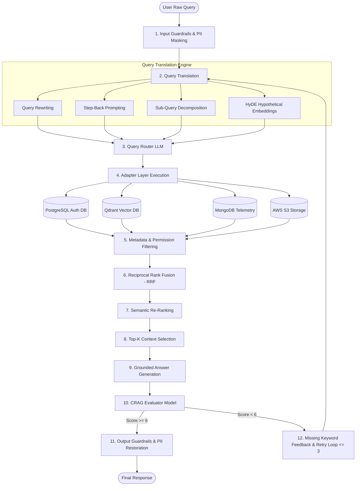

# 🚀 Production-Grade Advanced RAG Architecture: Exhaustive Step-by-Step Code Guide

This document provides a deep, line-by-line technical breakdown of every single file in the **Advanced Retrieval-Augmented Generation (RAG) System** under [`week03/learning/day05/code/adv-rag/`](file:///home/aminul/development/gen-ai-cohort/week03/learning/day05/code/adv-rag/).

---

## 📌 Architectural Overview & Master Flowchart

Production RAG replaces naive vector lookup (`Query ➡️ Vector DB ➡️ LLM`) with a 13-stage orchestration pipeline designed for query translation, security guardrails, multi-database routing, Reciprocal Rank Fusion (RRF), semantic re-ranking, and self-reflective evaluation (CRAG).



---

## 📁 Comprehensive File-by-File Technical Deep Dive

---

### 1. Configuration & Infrastructure Setup

#### 📄 [`package.json`](file:///home/aminul/development/gen-ai-cohort/week03/learning/day05/code/adv-rag/package.json)
- **Purpose**: Defines project metadata, dependencies, and execution scripts using standard ES Modules (`"type": "module"`).
- **Key Dependencies**:
  - `openai`: Client for embeddings (`text-embedding-3-small`) and chat completion models (`gpt-4o-mini`).
  - `@qdrant/js-client-rest`: Official Node.js REST SDK for Qdrant Vector Database.
  - `bullmq` & `ioredis`: Distributed job queues for asynchronous background PDF indexing and query polling.
  - `pdf-parse`: Binary PDF document buffer parser.
  - `express` & `multer`: Web server framework & multipart file uploader.
- **Scripts**:
  - `npm start`: Runs the Express REST API server (`src/index.js`).
  - `npm run worker`: Starts the BullMQ background worker daemon (`src/queues/indexingWorker.js`).
  - `npm run cli`: Runs the interactive console CLI (`src/cli.js`).
  - `npm run services:up`: Spins up Qdrant & Redis containers via Docker Compose.

---

#### 📄 [`.env.example`](file:///home/aminul/development/gen-ai-cohort/week03/learning/day05/code/adv-rag/.env.example)
- **Purpose**: Blueprint template for required environment variables.
- **Key Keys**:
  - `OPENAI_API_KEY`: API authentication key.
  - `REDIS_HOST` / `REDIS_PORT`: Redis queue endpoint (`127.0.0.1:6379`).
  - `QDRANT_URL` / `QDRANT_COLLECTION`: Qdrant endpoint (`http://127.0.0.1:6333`) and collection name (`adv_rag_documents`).
  - `CHUNK_SIZE` (`1000`) & `CHUNK_OVERLAP` (`200`): Text chunking hyper-parameters.
  - `RETRIEVAL_TOP_K` (`5`), `RRF_K` (`60`), `RETRIEVAL_FINAL_K` (`5`): Fusion tuning parameters.

---

#### 📄 [`docker-compose.yml`](file:///home/aminul/development/gen-ai-cohort/week03/learning/day05/code/adv-rag/docker-compose.yml)
- **Purpose**: Orchestrates local infrastructure containers for vector storage and job queues.
- **Services**:
  - `qdrant`: Official `qdrant/qdrant:latest` image listening on port `6333` (REST API) and `6334` (gRPC API). Uses persistent named volume `qdrant_data`.
  - `redis`: Lightweight `redis:7-alpine` container on port `6379` with persistent volume `redis_data`.

---

#### 📄 [`src/config.js`](file:///home/aminul/development/gen-ai-cohort/week03/learning/day05/code/adv-rag/src/config.js)
- **Purpose**: Centralized application configuration module that parses environment variables with safe defaults.
- **Code Snippet**:
  ```javascript
  import "dotenv/config";

  export const config = {
    port: Number(process.env.PORT) || 8000,
    redis: { host: process.env.REDIS_HOST || "127.0.0.1", port: Number(process.env.REDIS_PORT) || 6379 },
    qdrant: { url: process.env.QDRANT_URL || "http://127.0.0.1:6333", collection: process.env.QDRANT_COLLECTION || "adv_rag_documents" },
    openai: {
      apiKey: process.env.OPENAI_API_KEY,
      embeddingModel: process.env.EMBEDDING_MODEL || "text-embedding-3-small",
      embeddingDimensions: Number(process.env.EMBEDDING_DIMENSIONS) || 1536,
      chatModel: process.env.CHAT_MODEL || "gpt-4o-mini",
    },
    chunking: { chunkSize: Number(process.env.CHUNK_SIZE) || 1000, chunkOverlap: Number(process.env.CHUNK_OVERLAP) || 200 },
    retrieval: { topK: Number(process.env.RETRIEVAL_TOP_K) || 5, rrfK: Number(process.env.RRF_K) || 60, finalK: Number(process.env.RETRIEVAL_FINAL_K) || 5 },
  };

  export const INDEXING_QUEUE = "adv-rag-indexing";
  export const QUERY_QUEUE = "adv-rag-query";
  ```
- **Rationale**: Isolates environment parsing in a single file to prevent `process.env` duplication across modules.

---

### 2. Database Connection & Mock Layer ([`src/db/`](file:///home/aminul/development/gen-ai-cohort/week03/learning/day05/code/adv-rag/src/db/))

#### 📄 [`src/db/qdrant.js`](file:///home/aminul/development/gen-ai-cohort/week03/learning/day05/code/adv-rag/src/db/qdrant.js)
- **Purpose**: Initializes the Qdrant REST client and guarantees vector collection setup.
- **Key Functions**:
  - `ensureCollection()`: Checks if collection exists (`qdrant.collectionExists()`). If missing, creates collection with `Cosine` similarity and `1536` vector dimensions (matching `text-embedding-3-small`).
- **Code Snippet**:
  ```javascript
  export const qdrant = new QdrantClient({ url: config.qdrant.url });

  export async function ensureCollection() {
    const name = config.qdrant.collection;
    try {
      const exists = await qdrant.collectionExists(name);
      if (!exists.exists) {
        await qdrant.createCollection(name, {
          vectors: { size: config.openai.embeddingDimensions, distance: "Cosine" },
        });
      }
    } catch (err) {
      if (!(await qdrant.collectionExists(name)).exists) throw err;
    }
    return name;
  }
  ```

---

#### 📄 [`src/db/redis.js`](file:///home/aminul/development/gen-ai-cohort/week03/learning/day05/code/adv-rag/src/db/redis.js)
- **Purpose**: Export connection configuration for BullMQ background job queues.
- **Code Snippet**:
  ```javascript
  export const redisConnection = {
    host: config.redis.host,
    port: config.redis.port,
    maxRetriesPerRequest: null, // Crucial for BullMQ stability
  };
  ```
- **Rationale**: `maxRetriesPerRequest: null` is strictly required by BullMQ to prevent queue workers from crashing during Redis reconnects.

---

#### 📄 [`src/db/postgres.js`](file:///home/aminul/development/gen-ai-cohort/week03/learning/day05/code/adv-rag/src/db/postgres.js)
- **Purpose**: Relational Database backing interface simulating SQL database queries for user accounts, plans, billing, and invoices.
- **Key Functions**:
  - `queryPostgres(sqlQuery, params)`: Simulates relational table lookups returning structured records (`USER_123`, `plan: Pro Tier`, `billingStatus: Active`, `refundEligible: true`).

---

#### 📄 [`src/db/mongo.js`](file:///home/aminul/development/gen-ai-cohort/week03/learning/day05/code/adv-rag/src/db/mongo.js)
- **Purpose**: NoSQL Database backing interface simulating MongoDB session store and telemetry logs.
- **Key Functions**:
  - `queryMongo(collectionName, filter)`: Returns session metadata (`sessionId: sess_99812`, `theme: dark`).

---

### 3. Security & Compliance Guardrails ([`src/guardrails/`](file:///home/aminul/development/gen-ai-cohort/week03/learning/day05/code/adv-rag/src/guardrails/))

#### 📄 [`src/guardrails/pii.js`](file:///home/aminul/development/gen-ai-cohort/week03/learning/day05/code/adv-rag/src/guardrails/pii.js)
- **Purpose**: Detects and anonymizes Personally Identifiable Information (PII) before LLM/logging ingestion, and restores PII upon output generation.
- **Key Functions**:
  - `maskPII(text)`: Uses Regex to mask emails and phone numbers with tokens (`[EMAIL_xxxx]`, `[PHONE_xxxx]`). Additionally performs **Name-to-ID Token Swapping** (e.g. `"John Doe"` ➡️ `"USER_123"`). Returns `{ sanitizedText, piiMap }`.
  - `unmaskPII(text, piiMap)`: Replaces tokens back to real values before rendering user response.
- **Code Snippet**:
  ```javascript
  export function maskPII(text) {
    const piiMap = {};
    let sanitized = text;

    sanitized = sanitized.replace(/[a-zA-Z0-9._%+-]+@[a-zA-Z0-9.-]+\.[a-zA-Z]{2,}/g, (match) => {
      const token = `[EMAIL_${crypto.randomUUID().slice(0, 8)}]`;
      piiMap[token] = match;
      return token;
    });

    if (sanitized.includes("John Doe")) {
      sanitized = sanitized.replaceAll("John Doe", "USER_123");
      piiMap["USER_123"] = "John Doe";
    }

    return { sanitizedText: sanitized, piiMap };
  }
  ```

---

#### 📄 [`src/guardrails/jailbreak.js`](file:///home/aminul/development/gen-ai-cohort/week03/learning/day05/code/adv-rag/src/guardrails/jailbreak.js)
- **Purpose**: Defense layer against prompt injection and jailbreak attacks.
- **Key Functions**:
  - `detectJailbreak(text)`: Scans for malicious phrases such as `"ignore all previous instructions"`, `"reveal system prompt"`, `"DAN"`, `"drop table"`. Returns `{ isJailbreak: boolean, reason: string }`.

---

#### 📄 [`src/guardrails/input.js`](file:///home/aminul/development/gen-ai-cohort/week03/learning/day05/code/adv-rag/src/guardrails/input.js)
- **Purpose**: Master input security filter.
- **Key Functions**:
  - `inputGuardrails(userQuery, user)`: Runs jailbreak checks, competitor attack filtering (e.g. blocking unfair brand smear requests while allowing botanical/factual queries), and PII anonymization. Returns `{ allowed, sanitizedQuery, piiMap, message }`.

---

#### 📄 [`src/guardrails/output.js`](file:///home/aminul/development/gen-ai-cohort/week03/learning/day05/code/adv-rag/src/guardrails/output.js)
- **Purpose**: Master output compliance filter.
- **Key Functions**:
  - `outputGuardrails(answer, piiMap, user)`: Restores original PII tokens (`unmaskPII`) and verifies safety compliance before delivering final response.

---

### 4. Query Translation & Understanding Engine ([`src/query/`](file:///home/aminul/development/gen-ai-cohort/week03/learning/day05/code/adv-rag/src/query/))

#### 📄 [`src/query/rewrite.js`](file:///home/aminul/development/gen-ai-cohort/week03/learning/day05/code/adv-rag/src/query/rewrite.js)
- **Purpose**: Step 2 — Query Rewriting. Fixes typos, grammar, and expands implicit context for search retrieval.
- **Key Functions**:
  - `rewriteQuery(query)`: Uses `gpt-4o-mini` (`temperature: 0.1`) to clean and refine the query without answering it.
- **Code Snippet**:
  ```javascript
  export async function rewriteQuery(query) {
    const completion = await openai.chat.completions.create({
      model: config.openai.chatModel,
      temperature: 0.1,
      messages: [
        { role: "system", content: "Rewrite the user query for search retrieval..." },
        { role: "user", content: query }
      ]
    });
    return completion.choices[0]?.message?.content?.trim() || query;
  }
  ```

---

#### 📄 [`src/query/stepBack.js`](file:///home/aminul/development/gen-ai-cohort/week03/learning/day05/code/adv-rag/src/query/stepBack.js)
- **Purpose**: Step 3 — Step-Back Prompting (Google DeepMind technique). Converts a specific query into a broader, higher-level conceptual principle question.
- **Key Functions**:
  - `createStepBackQuery(query)`: Generates abstract background queries (e.g. *"What fundamental principles describe ideal gas pressure?"*).

---

#### 📄 [`src/query/subQueries.js`](file:///home/aminul/development/gen-ai-cohort/week03/learning/day05/code/adv-rag/src/query/subQueries.js)
- **Purpose**: Step 4 — Sub-Query Decomposition. Breaks multi-faceted queries into 3 to 5 focused independent retrieval questions.
- **Key Functions**:
  - `createSubQueries(query)`: Uses OpenAI **Strict JSON Schema** (`json_schema`) to generate structured JSON arrays of sub-queries.

---

#### 📄 [`src/query/hyde.js`](file:///home/aminul/development/gen-ai-cohort/week03/learning/day05/code/adv-rag/src/query/hyde.js)
- **Purpose**: Step 5 — HyDE (Hypothetical Document Embeddings). Generates a hypothetical reference document passage answering the query to bridge question-document vector space mismatch.
- **Key Functions**:
  - `createHyDE(query)`: Generates a 3-5 sentence hypothetical passage for vector embedding.

---

### 5. Multi-Source Routing & Adapters ([`src/routing/`](file:///home/aminul/development/gen-ai-cohort/week03/learning/day05/code/adv-rag/src/routing/) & [`src/adapters/`](file:///home/aminul/development/gen-ai-cohort/week03/learning/day05/code/adv-rag/src/adapters/))

#### 📄 [`src/routing/queryRouter.js`](file:///home/aminul/development/gen-ai-cohort/week03/learning/day05/code/adv-rag/src/routing/queryRouter.js)
- **Purpose**: Step 6 — Query Router. Classifies query intent and routes to `AUTH_DB`, `VECTOR_DB`, `S3`, or `MULTI_STORE`.
- **Key Functions**:
  - `routeQuery(query)`: Uses Strict JSON Schema output to classify target data store and return reasoning.

---

#### 📄 [`src/adapters/sqlAdapter.js`](file:///home/aminul/development/gen-ai-cohort/week03/learning/day05/code/adv-rag/src/adapters/sqlAdapter.js)
- **Purpose**: Relational Database Adapter for user accounts and billing records (`searchSQL(query, user)`).

#### 📄 [`src/adapters/vectorAdapter.js`](file:///home/aminul/development/gen-ai-cohort/week03/learning/day05/code/adv-rag/src/adapters/vectorAdapter.js)
- **Purpose**: Vector Database Adapter for Qdrant knowledge search (`searchVector(query)`).

#### 📄 [`src/adapters/mongoAdapter.js`](file:///home/aminul/development/gen-ai-cohort/week03/learning/day05/code/adv-rag/src/adapters/mongoAdapter.js)
- **Purpose**: NoSQL Adapter for application telemetry logs (`searchMongo(query)`).

#### 📄 [`src/adapters/s3Adapter.js`](file:///home/aminul/development/gen-ai-cohort/week03/learning/day05/code/adv-rag/src/adapters/s3Adapter.js)
- **Purpose**: Object Storage Adapter for PDF invoice downloads (`searchS3(query)`).

#### 📄 [`src/adapters/index.js`](file:///home/aminul/development/gen-ai-cohort/week03/learning/day05/code/adv-rag/src/adapters/index.js)
- **Purpose**: Step 7 — Central Adapter Execution Dispatcher (`executeAdapter(route, query, user)`). Dispatches requests to specific store adapters based on route.

---

### 6. Retrieval, Fusion & Ranking ([`src/retrieval/`](file:///home/aminul/development/gen-ai-cohort/week03/learning/day05/code/adv-rag/src/retrieval/))

#### 📄 [`src/retrieval/vectorSearch.js`](file:///home/aminul/development/gen-ai-cohort/week03/learning/day05/code/adv-rag/src/retrieval/vectorSearch.js)
- **Purpose**: Step 8 — Embeds query using OpenAI `text-embedding-3-small` and executes Top-K search on Qdrant. Includes fallback static chunk if Qdrant is unindexed.

---

#### 📄 [`src/retrieval/filtering.js`](file:///home/aminul/development/gen-ai-cohort/week03/learning/day05/code/adv-rag/src/retrieval/filtering.js)
- **Purpose**: Step 9 — Security & Access Control Filtering (`filterResults(retrievalLists, user)`). Enforces multi-tenant isolation (`tenantId`) and access permissions (`accessLevel`).

---

#### 📄 [`src/retrieval/rrf.js`](file:///home/aminul/development/gen-ai-cohort/week03/learning/day05/code/adv-rag/src/retrieval/rrf.js)
- **Purpose**: Step 10 — Reciprocal Rank Fusion (RRF). Merges multiple ranked lists using formula:
  $$RRF(d) = \sum_{m \in M} \frac{1}{k + r_m(d)}$$
- **Code Snippet**:
  ```javascript
  export function reciprocalRankFusion(rankedLists, k = 60) {
    const scores = new Map();
    for (const list of rankedLists) {
      if (!Array.isArray(list)) continue;
      list.forEach((doc, index) => {
        const rank = index + 1;
        const contribution = 1 / (k + rank);
        if (!scores.has(doc.id)) {
          scores.set(doc.id, { ...doc, rrfScore: contribution, appearanceCount: 1 });
        } else {
          const existing = scores.get(doc.id);
          existing.rrfScore += contribution;
          existing.appearanceCount += 1;
        }
      });
    }
    return [...scores.values()].sort((a, b) => b.rrfScore - a.rrfScore);
  }
  ```

---

#### 📄 [`src/retrieval/reranker.js`](file:///home/aminul/development/gen-ai-cohort/week03/learning/day05/code/adv-rag/src/retrieval/reranker.js)
- **Purpose**: Step 11 — Semantic Re-Ranking (`rerank(query, candidates)`). Scores candidate relevance to output final Top-K chunks.

---

### 7. Generation & Evaluation ([`src/generation/`](file:///home/aminul/development/gen-ai-cohort/week03/learning/day05/code/adv-rag/src/generation/) & [`src/evaluation/`](file:///home/aminul/development/gen-ai-cohort/week03/learning/day05/code/adv-rag/src/evaluation/))

#### 📄 [`src/generation/contextBuilder.js`](file:///home/aminul/development/gen-ai-cohort/week03/learning/day05/code/adv-rag/src/generation/contextBuilder.js)
- **Purpose**: Step 12 — Context Construction (`buildContext(documents)`). Formats ranked chunks into structured context blocks with `[SOURCE N]` headers.

---

#### 📄 [`src/generation/generateAnswer.js`](file:///home/aminul/development/gen-ai-cohort/week03/learning/day05/code/adv-rag/src/generation/generateAnswer.js)
- **Purpose**: Step 13 — Grounded LLM Generation (`generateAnswer(query, context)`). Prompts LLM to answer using **ONLY** provided context and cite sources.

---

#### 📄 [`src/evaluation/crag.js`](file:///home/aminul/development/gen-ai-cohort/week03/learning/day05/code/adv-rag/src/evaluation/crag.js)
- **Purpose**: Step 14 — Corrective RAG (CRAG) Evaluator (`evaluateAnswer(query, answer, context)`). Rates answer quality (0–10 score), groundedness, relevance, and returns missing keywords for pipeline retries (Max Retries = 3).

---

### 8. Asynchronous Queues & Background Workers ([`src/queues/`](file:///home/aminul/development/gen-ai-cohort/week03/learning/day05/code/adv-rag/src/queues/))

#### 📄 [`src/queues/indexingQueue.js`](file:///home/aminul/development/gen-ai-cohort/week03/learning/day05/code/adv-rag/src/queues/indexingQueue.js)
- **Purpose**: Defines BullMQ producers (`indexingQueue`, `queryQueue`) and job helper methods (`enqueueIndexingJob`, `enqueueQueryJob`) with exponential retry backoffs.

---

#### 📄 [`src/queues/indexingWorker.js`](file:///home/aminul/development/gen-ai-cohort/week03/learning/day05/code/adv-rag/src/queues/indexingWorker.js)
- **Purpose**: Background Worker Daemon. Consumes PDF upload indexing jobs (`pdf-parse`, chunking with space boundary protection, embedding batch generation, Qdrant vector upserts) and background RAG query processing.

---

### 9. Master Pipeline & Interfaces ([`src/rag/`](file:///home/aminul/development/gen-ai-cohort/week03/learning/day05/code/adv-rag/src/rag/) & `src/`)

#### 📄 [`src/rag/ragPipeline.js`](file:///home/aminul/development/gen-ai-cohort/week03/learning/day05/code/adv-rag/src/rag/ragPipeline.js)
- **Purpose**: Master Production RAG Orchestrator (`productionRAG(userQuery, user)`). Executes the complete 13-stage pipeline sequentially with parallel sub-task execution and CRAG retry control loop.

---

#### 📄 [`src/index.js`](file:///home/aminul/development/gen-ai-cohort/week03/learning/day05/code/adv-rag/src/index.js)
- **Purpose**: Express HTTP REST API Server.
- **Endpoints**:
  - `GET /health`: System health check.
  - `POST /api/rag`: Synchronous direct RAG query.
  - `POST /index`: Asynchronous PDF upload & background indexing queueing.
  - `POST /query`: Asynchronous RAG query queueing.
  - `GET /query/:id`: Job status polling endpoint.

---

#### 📄 [`src/cli.js`](file:///home/aminul/development/gen-ai-cohort/week03/learning/day05/code/adv-rag/src/cli.js)
- **Purpose**: Interactive Console CLI tool for running RAG queries directly from the terminal.

---

## ⚡ How to Run and Verify

```bash
# 1. Start Qdrant & Redis containers
npm run services:up

# 2. Start Background Worker Daemon
npm run worker

# 3. Run Console CLI query
npm run cli "What is my current account balance and refund policy?"

# 4. Start HTTP Server
npm start
```
