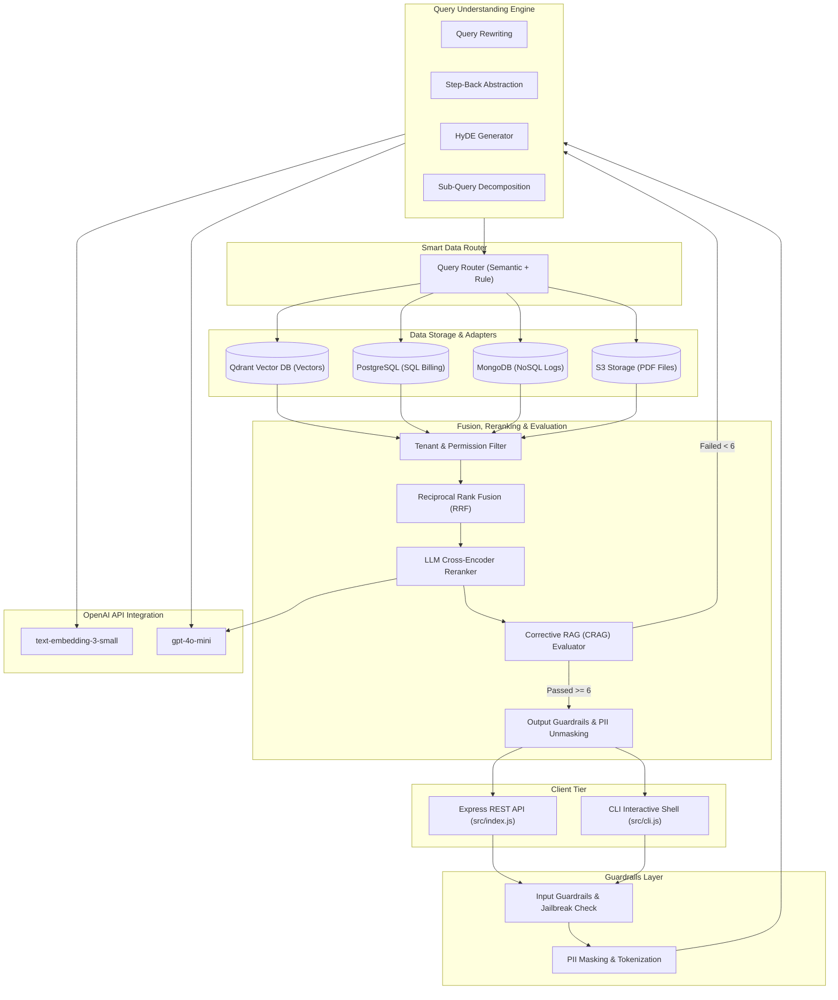
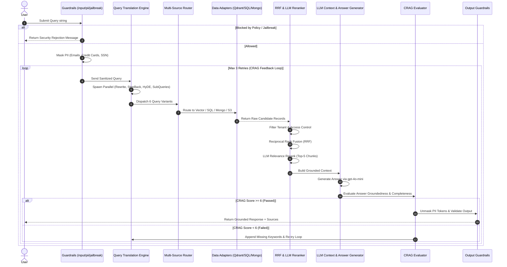

# Master Index — Production-Grade Advanced RAG System (`adv-rag`)

Welcome to the **Implementation Guide** for the **Production-Grade Advanced RAG System** (`adv-rag`). This guide walks developers through building an enterprise-ready, 13-step Retrieval-Augmented Generation pipeline featuring multi-layer guardrails, structured query translation, multi-database routing (Qdrant, Postgres, Mongo, S3), Reciprocal Rank Fusion (RRF), LLM re-ranking, Corrective RAG (CRAG) evaluation, BullMQ background ingestion, and REST API / CLI interfaces.

---

## 📁 Project Folder Structure Map

All source code is located inside [`week03/learning/day05/code/adv-rag/`](file:///home/aminul/development/gen-ai-cohort/week03/learning/day05/code/adv-rag/):

```text
adv-rag/
├── docker-compose.yml              # Qdrant (6333), Redis (6379), Postgres (5432), Mongo (27017)
├── package.json                    # ESM package dependencies and run scripts
├── .env.example                    # Active environment variables template
├── implementation guide/           # Comprehensive step-by-step implementation guide
│   ├── README.md                   # Master Index (This file)
│   ├── chapter-00-overview-setup.md
│   ├── chapter-01-database-adapters.md
│   ├── chapter-02-guardrails-security.md
│   ├── chapter-03-query-expansion-translation.md
│   ├── chapter-04-routing-multi-source-retrieval.md
│   ├── chapter-05-fusion-reranking-crag.md
│   ├── chapter-06-context-generation-pipeline.md
│   ├── chapter-07-async-queues-worker.md
│   └── chapter-08-api-server-cli.md
└── src/
    ├── config.js                   # System-wide configuration module
    ├── cli.js                      # Interactive CLI terminal runner
    ├── index.js                    # Express REST API server & Multer uploader
    ├── db/                         # Database initializers & client connections
    │   ├── qdrant.js
    │   ├── postgres.js
    │   ├── mongo.js
    │   └── redis.js
    ├── adapters/                   # Data source abstractions
    │   ├── vectorAdapter.js
    │   ├── sqlAdapter.js
    │   ├── mongoAdapter.js
    │   ├── s3Adapter.js
    │   └── index.js
    ├── guardrails/                 # Safety & policy enforcement
    │   ├── input.js
    │   ├── jailbreak.js
    │   ├── pii.js
    │   └── output.js
    ├── query/                      # Query expansion & translation engine
    │   ├── rewrite.js
    │   ├── stepBack.js
    │   ├── subQueries.js
    │   └── hyde.js
    ├── routing/                    # Semantic multi-source query router
    │   └── queryRouter.js
    ├── retrieval/                  # Retrieval, fusion, and re-ranking algorithms
    │   ├── vectorSearch.js
    │   ├── filtering.js
    │   ├── rrf.js
    │   └── reranker.js
    ├── evaluation/                 # Corrective RAG (CRAG) self-reflection
    │   └── crag.js
    ├── generation/                 # Grounded context construction & answer synthesis
    │   ├── contextBuilder.js
    │   └── generateAnswer.js
    ├── rag/                        # Unified master pipeline orchestrator
    │   └── ragPipeline.js
    └── queues/                     # BullMQ background job queues & PDF worker
        ├── indexingQueue.js
        └── indexingWorker.js
```

---

## 🏗️ System Architecture & Service Ecosystem

The system operates as a modular, enterprise-grade AI architecture connecting vector stores, relational databases, NoSQL engines, and LLM services behind an asynchronous processing model.



---

## 🔄 13-Step Master Production RAG Pipeline

Every user request follows a deterministic 13-step lifecycle enforced by [`src/rag/ragPipeline.js`](file:///home/aminul/development/gen-ai-cohort/week03/learning/day05/code/adv-rag/src/rag/ragPipeline.js):



---

## 📚 Table of Contents & Chapter Guide

| Chapter | Title | Primary Files Covered | Key Architectural Focus |
| :--- | :--- | :--- | :--- |
| [**Chapter 00**](file:///home/aminul/development/gen-ai-cohort/week03/learning/day05/code/adv-rag/implementation%20guide/chapter-00-overview-setup.md) | Overview, Setup & Configuration | [`docker-compose.yml`](file:///home/aminul/development/gen-ai-cohort/week03/learning/day05/code/adv-rag/docker-compose.yml), [`package.json`](file:///home/aminul/development/gen-ai-cohort/week03/learning/day05/code/adv-rag/package.json), [`.env.example`](file:///home/aminul/development/gen-ai-cohort/week03/learning/day05/code/adv-rag/.env.example), [`src/config.js`](file:///home/aminul/development/gen-ai-cohort/week03/learning/day05/code/adv-rag/src/config.js) | Multi-database Docker infrastructure (Qdrant, Redis, Postgres, Mongo), ESM configuration, system defaults. |
| [**Chapter 01**](file:///home/aminul/development/gen-ai-cohort/week03/learning/day05/code/adv-rag/implementation%20guide/chapter-01-database-adapters.md) | Multi-Source Databases & Adapters | [`src/db/`](file:///home/aminul/development/gen-ai-cohort/week03/learning/day05/code/adv-rag/src/db/), [`src/adapters/`](file:///home/aminul/development/gen-ai-cohort/week03/learning/day05/code/adv-rag/src/adapters/) | Database initialization clients (Qdrant, Postgres, Mongo, Redis) and uniform data source adapters (Vector, SQL, NoSQL, S3). |
| [**Chapter 02**](file:///home/aminul/development/gen-ai-cohort/week03/learning/day05/code/adv-rag/implementation%20guide/chapter-02-guardrails-security.md) | Guardrails & PII Protection | [`src/guardrails/`](file:///home/aminul/development/gen-ai-cohort/week03/learning/day05/code/adv-rag/src/guardrails/) (`input.js`, `jailbreak.js`, `pii.js`, `output.js`) | Input policy validation, prompt injection defense, Regex PII masking/unmasking, output safety filtering. |
| [**Chapter 03**](file:///home/aminul/development/gen-ai-cohort/week03/learning/day05/code/adv-rag/implementation%20guide/chapter-03-query-expansion-translation.md) | Query Expansion & Translation | [`src/query/`](file:///home/aminul/development/gen-ai-cohort/week03/learning/day05/code/adv-rag/src/query/) (`rewrite.js`, `stepBack.js`, `subQueries.js`, `hyde.js`) | Multi-query transformation strategies: Rewriting, Step-Back Prompting, Sub-Query Decomposition, and HyDE hypothetical passages. |
| [**Chapter 04**](file:///home/aminul/development/gen-ai-cohort/week03/learning/day05/code/adv-rag/implementation%20guide/chapter-04-routing-multi-source-retrieval.md) | Query Router & Multi-Source Search | [`src/routing/queryRouter.js`](file:///home/aminul/development/gen-ai-cohort/week03/learning/day05/code/adv-rag/src/routing/queryRouter.js), [`src/retrieval/vectorSearch.js`](file:///home/aminul/development/gen-ai-cohort/week03/learning/day05/code/adv-rag/src/retrieval/vectorSearch.js), [`src/retrieval/filtering.js`](file:///home/aminul/development/gen-ai-cohort/week03/learning/day05/code/adv-rag/src/retrieval/filtering.js) | Semantic & rule-based query intent routing, Qdrant vector retrieval, tenant ID & metadata permission filtering. |
| [**Chapter 05**](file:///home/aminul/development/gen-ai-cohort/week03/learning/day05/code/adv-rag/implementation%20guide/chapter-05-fusion-reranking-crag.md) | Rank Fusion, Reranking & CRAG | [`src/retrieval/rrf.js`](file:///home/aminul/development/gen-ai-cohort/week03/learning/day05/code/adv-rag/src/retrieval/rrf.js), [`src/retrieval/reranker.js`](file:///home/aminul/development/gen-ai-cohort/week03/learning/day05/code/adv-rag/src/retrieval/reranker.js), [`src/evaluation/crag.js`](file:///home/aminul/development/gen-ai-cohort/week03/learning/day05/code/adv-rag/src/evaluation/crag.js) | Reciprocal Rank Fusion (RRF), LLM cross-encoder re-ranking, Corrective RAG (CRAG) self-evaluation & feedback loops. |
| [**Chapter 06**](file:///home/aminul/development/gen-ai-cohort/week03/learning/day05/code/adv-rag/implementation%20guide/chapter-06-context-generation-pipeline.md) | Generation & Master Pipeline | [`src/generation/`](file:///home/aminul/development/gen-ai-cohort/week03/learning/day05/code/adv-rag/src/generation/), [`src/rag/ragPipeline.js`](file:///home/aminul/development/gen-ai-cohort/week03/learning/day05/code/adv-rag/src/rag/ragPipeline.js) | Context formatting, grounded LLM completion, 13-step pipeline orchestrator implementation. |
| [**Chapter 07**](file:///home/aminul/development/gen-ai-cohort/week03/learning/day05/code/adv-rag/implementation%20guide/chapter-07-async-queues-worker.md) | Async Queues & Worker Process | [`src/queues/indexingQueue.js`](file:///home/aminul/development/gen-ai-cohort/week03/learning/day05/code/adv-rag/src/queues/indexingQueue.js), [`src/queues/indexingWorker.js`](file:///home/aminul/development/gen-ai-cohort/week03/learning/day05/code/adv-rag/src/queues/indexingWorker.js) | BullMQ background PDF ingestion queue, sliding-window chunking, vector embedding & batch Qdrant point upserts. |
| [**Chapter 08**](file:///home/aminul/development/gen-ai-cohort/week03/learning/day05/code/adv-rag/implementation%20guide/chapter-08-api-server-cli.md) | REST API & Terminal CLI Shell | [`src/index.js`](file:///home/aminul/development/gen-ai-cohort/week03/learning/day05/code/adv-rag/src/index.js), [`src/cli.js`](file:///home/aminul/development/gen-ai-cohort/week03/learning/day05/code/adv-rag/src/cli.js) | Express REST endpoints (`POST /api/rag/chat`, `POST /api/rag/index`), interactive Readline CLI, and verification scripts. |

---

## ⚡ Quick Start Command Cheat Sheet

```bash
# 1. Navigate to project root
cd week03/learning/day05/code/adv-rag

# 2. Spin up Docker containers (Qdrant, Redis, Postgres, MongoDB)
npm run services:up

# 3. Install NPM dependencies
npm install

# 4. Configure environment variables
cp .env.example .env

# 5. Option A: Launch Interactive Terminal CLI Shell
npm run cli

# 6. Option B: Run Express REST API Server
npm run dev

# 7. In Terminal 2: Run Background Ingestion Worker
npm run worker
```
