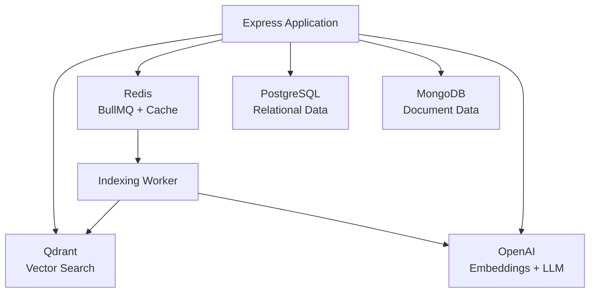
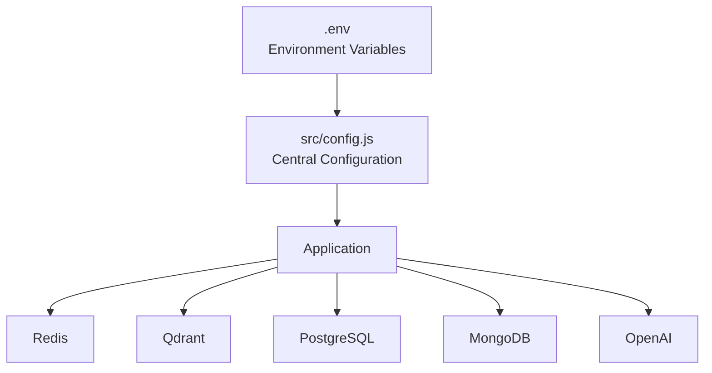
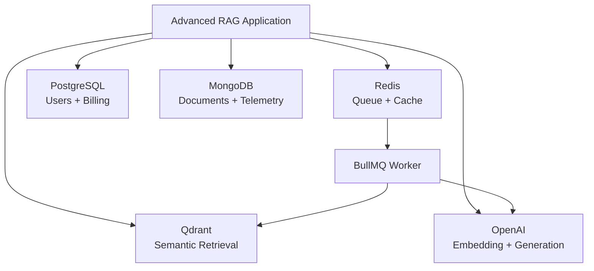
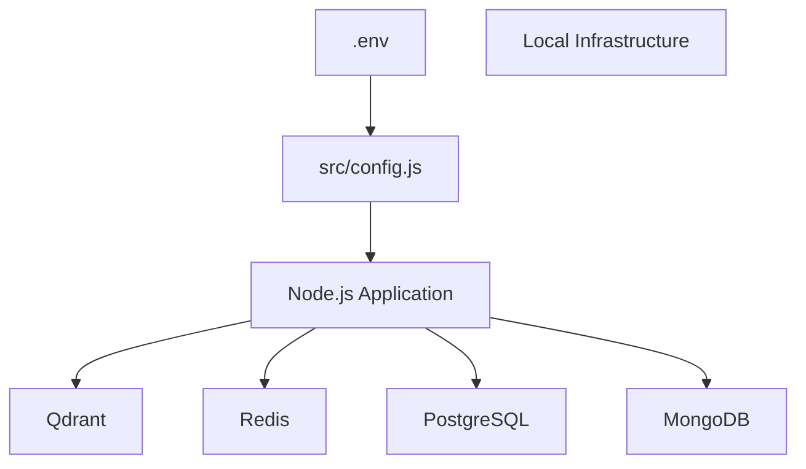
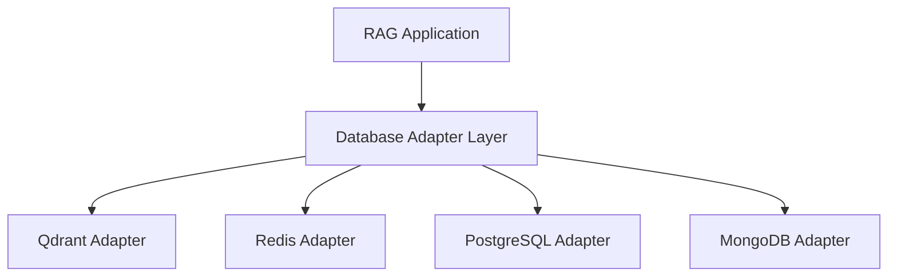

# Chapter 0 — Overview, Setup & Infrastructure Setup

## 1. Chapter Goal

The goal of this chapter is to establish the infrastructure foundation for our **Production-Grade Advanced RAG System**.

Unlike a basic RAG application that may only require an LLM and a vector database, a production-oriented RAG system usually needs multiple specialized infrastructure components.

Our architecture separates responsibilities across different storage and processing systems:

| Component           | Technology | Responsibility                                 |
| ------------------- | ---------- | ---------------------------------------------- |
| Vector Store        | Qdrant     | Embeddings, vector search, document payloads   |
| Queue / KV Store    | Redis      | BullMQ jobs, caching, transient state          |
| Relational Database | PostgreSQL | Users, billing, subscriptions, structured data |
| Document Database   | MongoDB    | Sessions, telemetry, document metadata         |
| LLM                 | OpenAI     | Embeddings, generation, query processing       |
| Application Config  | Node.js    | Centralized runtime configuration              |

The architecture therefore looks like this:



The important idea is **separation of responsibility**.

We are not forcing one database to handle every type of workload.

---

# 2. Expected Project Structure

By the end of this chapter, the project will have the following foundation:

```text
adv-rag/
│
├── docker-compose.yml
├── package.json
├── package-lock.json
│
├── .env
├── .env.example
├── .gitignore
│
└── src/
    │
    └── config.js
```

Later chapters will expand this structure:

```text
src/
├── config.js
│
├── db/
│   ├── qdrant.js
│   ├── redis.js
│   ├── postgres.js
│   └── mongo.js
│
├── queues/
│   ├── indexingQueue.js
│   └── indexingWorker.js
│
├── ingestion/
├── retrieval/
├── reranking/
├── guardrails/
├── api/
└── index.js
```

---

# 3. Overall Configuration Flow

The application configuration follows a single direction:



For example:

```text
.env
 │
 ▼
src/config.js
 │
 ├── server.port
 ├── redis
 ├── qdrant
 ├── postgres
 ├── mongo
 ├── openai
 ├── chunking
 └── retrieval
```

This gives us a single source of truth for infrastructure configuration.

---

# 4. Infrastructure Setup

## File Path

```text
adv-rag/docker-compose.yml
```

Docker Compose allows us to run the infrastructure locally without manually installing every database.

Our local environment will contain:

```text
Qdrant       → 6333
Redis        → 6379
PostgreSQL   → 5432
MongoDB      → 27017
```

Qdrant provides a REST API on port 6333 in the standard local setup. ([npm][1])

---

## `docker-compose.yml`

```yaml
services:

  # --------------------------------------------------
  # Qdrant Vector Database
  # --------------------------------------------------

  qdrant:
    image: qdrant/qdrant:latest
    container_name: adv-rag-qdrant
    restart: unless-stopped

    ports:
      - "6333:6333"
      - "6334:6334"

    volumes:
      - qdrant_data:/qdrant/storage


  # --------------------------------------------------
  # Redis
  # --------------------------------------------------

  redis:
    image: redis:7-alpine
    container_name: adv-rag-redis
    restart: unless-stopped

    ports:
      - "6379:6379"

    volumes:
      - redis_data:/data


  # --------------------------------------------------
  # PostgreSQL
  # --------------------------------------------------

  postgres:
    image: postgres:17
    container_name: adv-rag-postgres
    restart: unless-stopped

    environment:
      POSTGRES_DB: adv_rag
      POSTGRES_USER: adv_rag
      POSTGRES_PASSWORD: adv_rag_dev_password

    ports:
      - "5432:5432"

    volumes:
      - postgres_data:/var/lib/postgresql/data


  # --------------------------------------------------
  # MongoDB
  # --------------------------------------------------

  mongo:
    image: mongo:8
    container_name: adv-rag-mongo
    restart: unless-stopped

    ports:
      - "27017:27017"

    volumes:
      - mongo_data:/data/db


volumes:
  qdrant_data:
  redis_data:
  postgres_data:
  mongo_data:
```

PostgreSQL and MongoDB both have official Docker images. ([Docker Hub][2])

For local development, this gives us persistent Docker volumes so database data survives container restarts.

> **Production note:** Never use the example PostgreSQL password shown above in a production deployment. Production credentials should come from secrets management or protected environment configuration.

---

# 5. Starting the Infrastructure

Start all services:

```bash
docker compose up -d
```

Check the running containers:

```bash
docker ps
```

You should see containers similar to:

```text
adv-rag-qdrant
adv-rag-redis
adv-rag-postgres
adv-rag-mongo
```

To inspect logs:

```bash
docker compose logs
```

For an individual service:

```bash
docker compose logs qdrant
```

or:

```bash
docker compose logs postgres
```

---

# 6. Stopping the Infrastructure

Stop the containers:

```bash
docker compose down
```

This removes the containers but keeps named volumes.

Therefore, your database data remains available when the services are started again.

To remove the containers **and their stored data**:

```bash
docker compose down -v
```

Be careful with this command during development because it deletes the database volumes.

---

# 7. ESM Package Configuration

## File Path

```text
adv-rag/package.json
```

This project uses JavaScript ES Modules.

The important setting is:

```json
"type": "module"
```

This allows us to write:

```javascript
import { config } from "./config.js";
```

instead of CommonJS:

```javascript
const config = require("./config");
```

---

## `package.json`

```json
{
  "name": "adv-rag",
  "version": "1.0.0",
  "description": "Production-grade Advanced RAG system with multi-source retrieval, reranking, RRF, CRAG, guardrails, and asynchronous ingestion.",
  "license": "ISC",
  "type": "module",
  "main": "src/index.js",
  "scripts": {
    "start": "node src/index.js",
    "dev": "node --watch src/index.js",
    "worker": "node src/queues/indexingWorker.js",
    "cli": "node src/cli.js",
    "services:up": "docker compose up -d",
    "services:down": "docker compose down"
  },
  "dependencies": {
    "@qdrant/js-client-rest": "^1.19.0",
    "bullmq": "^6.3.4",
    "dotenv": "^16.4.7",
    "express": "^4.21.2",
    "ioredis": "^5.4.2",
    "multer": "^2.0.1",
    "openai": "^4.77.0",
    "pdf-parse": "^1.1.1"
  }
}
```

The current Qdrant JavaScript REST client is 1.19.0, while BullMQ's current latest release is in the 6.x line. ([npm][1])

For a learning repository, version pinning should eventually be handled through the generated `package-lock.json` rather than relying on old version examples copied from previous tutorials.

---

# 8. Installing Dependencies

Run:

```bash
npm install
```

After installation, the project will generate:

```text
package-lock.json
```

Commit the lockfile to version control so that the development environment can be reproduced more reliably.

---

# 9. Environment Configuration

Environment variables contain configuration that should not be hard-coded into application source code.

Create:

```text
.env.example
```

and:

```text
.env
```

The `.env.example` file is safe to commit.

The `.env` file should normally **not** be committed.

---

# 10. `.env.example`

```env
# --------------------------------------------------
# Application
# --------------------------------------------------

NODE_ENV=development
PORT=8000


# --------------------------------------------------
# OpenAI
# --------------------------------------------------

OPENAI_API_KEY=your_openai_api_key_here

EMBEDDING_MODEL=text-embedding-3-small
EMBEDDING_DIMENSIONS=1536

CHAT_MODEL=gpt-4o-mini


# --------------------------------------------------
# Redis / BullMQ
# --------------------------------------------------

REDIS_HOST=127.0.0.1
REDIS_PORT=6379


# --------------------------------------------------
# Qdrant
# --------------------------------------------------

QDRANT_URL=http://127.0.0.1:6333
QDRANT_COLLECTION=adv_rag_documents


# --------------------------------------------------
# PostgreSQL
# --------------------------------------------------

POSTGRES_HOST=127.0.0.1
POSTGRES_PORT=5432
POSTGRES_DB=adv_rag
POSTGRES_USER=adv_rag
POSTGRES_PASSWORD=adv_rag_dev_password


# --------------------------------------------------
# MongoDB
# --------------------------------------------------

MONGO_URL=mongodb://127.0.0.1:27017
MONGO_DATABASE=adv_rag


# --------------------------------------------------
# RAG Chunking
# --------------------------------------------------

CHUNK_SIZE=1000
CHUNK_OVERLAP=200


# --------------------------------------------------
# Retrieval
# --------------------------------------------------

RETRIEVAL_TOP_K=5
RRF_K=60
RETRIEVAL_FINAL_K=5
```

Then create the real environment file:

```bash
cp .env.example .env
```

Open `.env` and replace:

```env
OPENAI_API_KEY=your_openai_api_key_here
```

with your actual API key.

Never commit that key to Git.

---

# 11. `.gitignore`

Create:

```text
adv-rag/.gitignore
```

with:

```gitignore
node_modules/
.env
.env.*
!.env.example

npm-debug.log*

.DS_Store

coverage/

dist/
build/
```

The important rule is:

```gitignore
.env
```

This prevents your local secrets from accidentally being committed.

---

# 12. Central Configuration Module

## File Path

```text
adv-rag/src/config.js
```

Instead of reading `process.env` throughout the entire application, we centralize configuration here.

This gives us:

```text
process.env
     ↓
config.js
     ↓
Application modules
```

---

# 13. `src/config.js`

```javascript
import "dotenv/config";

const toNumber = (
  value,
  fallback
) => {
  const parsed =
    Number(value);

  return Number.isFinite(parsed)
    ? parsed
    : fallback;
};

export const config = {
  environment:
    process.env.NODE_ENV ||
    "development",

  server: {
    port: toNumber(
      process.env.PORT,
      8000
    )
  },

  redis: {
    host:
      process.env.REDIS_HOST ||
      "127.0.0.1",

    port: toNumber(
      process.env.REDIS_PORT,
      6379
    )
  },

  qdrant: {
    url:
      process.env.QDRANT_URL ||
      "http://127.0.0.1:6333",

    collection:
      process.env.QDRANT_COLLECTION ||
      "adv_rag_documents"
  },

  postgres: {
    host:
      process.env.POSTGRES_HOST ||
      "127.0.0.1",

    port: toNumber(
      process.env.POSTGRES_PORT,
      5432
    ),

    database:
      process.env.POSTGRES_DB ||
      "adv_rag",

    user:
      process.env.POSTGRES_USER ||
      "adv_rag",

    password:
      process.env.POSTGRES_PASSWORD ||
      ""
  },

  mongo: {
    url:
      process.env.MONGO_URL ||
      "mongodb://127.0.0.1:27017",

    database:
      process.env.MONGO_DATABASE ||
      "adv_rag"
  },

  openai: {
    apiKey:
      process.env.OPENAI_API_KEY,

    embeddingModel:
      process.env.EMBEDDING_MODEL ||
      "text-embedding-3-small",

    embeddingDimensions:
      toNumber(
        process.env.EMBEDDING_DIMENSIONS,
        1536
      ),

    chatModel:
      process.env.CHAT_MODEL ||
      "gpt-4o-mini"
  },

  chunking: {
    chunkSize:
      toNumber(
        process.env.CHUNK_SIZE,
        1000
      ),

    chunkOverlap:
      toNumber(
        process.env.CHUNK_OVERLAP,
        200
      )
  },

  retrieval: {
    topK:
      toNumber(
        process.env.RETRIEVAL_TOP_K,
        5
      ),

    rrfK:
      toNumber(
        process.env.RRF_K,
        60
      ),

    finalK:
      toNumber(
        process.env.RETRIEVAL_FINAL_K,
        5
      )
  }
};

export const INDEXING_QUEUE =
  "adv-rag-indexing";

export const QUERY_QUEUE =
  "adv-rag-query";
```

---

# 14. Why Use `toNumber()`?

Environment variables are always strings.

For example:

```env
PORT=8000
```

is loaded approximately as:

```javascript
process.env.PORT
// "8000"
```

not:

```javascript
8000
```

Therefore:

```javascript
Number(process.env.PORT)
```

is required.

The helper:

```javascript
const toNumber = (
  value,
  fallback
) => {
  const parsed = Number(value);

  return Number.isFinite(parsed)
    ? parsed
    : fallback;
};
```

provides a safer fallback mechanism.

For example:

```javascript
toNumber(
  undefined,
  8000
);
```

returns:

```text
8000
```

---

# 15. Configuration Namespaces

Instead of creating a flat object such as:

```javascript
config.REDIS_HOST
config.QDRANT_URL
config.OPENAI_API_KEY
```

we group related configuration.

For example:

```javascript
config.redis.host
```

and:

```javascript
config.qdrant.url
```

and:

```javascript
config.openai.embeddingModel
```

This becomes much easier to maintain as the application grows.

---

# 16. Chunking Configuration

Our initial chunking configuration is:

```javascript
chunking: {
  chunkSize: 1000,
  chunkOverlap: 200
}
```

Conceptually:

```text
Chunk 1
├──────────────────────────────┤
0                            1000

                    overlap
                    ← 200 →

Chunk 2
                    ├──────────────────────────────┤
                    800                          1800
```

The overlap helps preserve context around chunk boundaries.

Later chapters will implement the actual chunking algorithm.

---

# 17. Retrieval Configuration

The retrieval configuration is:

```javascript
retrieval: {
  topK: 5,
  rrfK: 60,
  finalK: 5
}
```

These values will become important when we implement multi-source retrieval and Reciprocal Rank Fusion.

### `topK`

Number of initial candidates retrieved from an individual source.

### `rrfK`

The smoothing constant used by Reciprocal Rank Fusion.

### `finalK`

Number of candidates retained after combining and ranking results.

The important point is that these are **configuration parameters**, not hard-coded values scattered throughout retrieval modules.

---

# 18. Queue Names

We define queue names centrally:

```javascript
export const INDEXING_QUEUE =
  "adv-rag-indexing";

export const QUERY_QUEUE =
  "adv-rag-query";
```

This prevents different parts of the application from accidentally using different queue names.

For example:

```text
API
 │
 ├── add job
 │
 ▼
adv-rag-indexing
 │
 ▼
Indexing Worker
```

Later, BullMQ will use these constants.

---

# 19. Configuration Verification

Create a temporary test:

```bash
node --input-type=module -e "
import { config } from './src/config.js';

console.log({
  environment: config.environment,
  port: config.server.port,
  redis: config.redis,
  qdrant: config.qdrant,
  postgres: {
    host: config.postgres.host,
    port: config.postgres.port,
    database: config.postgres.database
  },
  mongo: config.mongo,
  embeddingModel: config.openai.embeddingModel,
  chatModel: config.openai.chatModel,
  chunking: config.chunking,
  retrieval: config.retrieval
});
"
```

Do **not** print the OpenAI API key.

Expected output should resemble:

```text
{
  environment: 'development',
  port: 8000,

  redis: {
    host: '127.0.0.1',
    port: 6379
  },

  qdrant: {
    url: 'http://127.0.0.1:6333',
    collection: 'adv_rag_documents'
  },

  postgres: {
    host: '127.0.0.1',
    port: 5432,
    database: 'adv_rag'
  },

  mongo: {
    url: 'mongodb://127.0.0.1:27017',
    database: 'adv_rag'
  },

  embeddingModel: 'text-embedding-3-small',
  chatModel: 'gpt-4o-mini',

  chunking: {
    chunkSize: 1000,
    chunkOverlap: 200
  },

  retrieval: {
    topK: 5,
    rrfK: 60,
    finalK: 5
  }
}
```

---

# 20. Verify Docker Infrastructure

After:

```bash
docker compose up -d
```

run:

```bash
docker ps
```

You should have four infrastructure containers:

```text
adv-rag-qdrant
adv-rag-redis
adv-rag-postgres
adv-rag-mongo
```

You can also inspect Compose status:

```bash
docker compose ps
```

This is preferable to assuming that `docker compose up -d` succeeded.

---

# 21. Infrastructure Responsibility Map

At this stage, every infrastructure component has a clearly defined responsibility.



### Qdrant

Used for:

* embeddings
* vector similarity search
* document payloads
* metadata filtering

### Redis

Used for:

* BullMQ
* asynchronous indexing jobs
* caching
* transient state

### PostgreSQL

Used for:

* users
* subscriptions
* billing
* permissions
* structured application data

### MongoDB

Used for:

* document metadata
* session information
* telemetry
* flexible JSON-like records

### OpenAI

Used for:

* embedding generation
* query processing
* answer generation

---

# 22. Why Multiple Databases?

A production system does not necessarily need four databases.

The reason we are introducing multiple stores is to demonstrate **polyglot persistence**.

Different workloads have different requirements.

For example:

```text
User subscription
        ↓
PostgreSQL
```

because relational consistency and SQL queries are useful.

Whereas:

```text
Embedding
   ↓
Qdrant
```

because vector similarity search is the primary operation.

And:

```text
Indexing job
   ↓
Redis + BullMQ
```

because queues need fast state management and job coordination.

This separation is an architectural decision rather than a requirement that every RAG system must follow.

---

# 23. Production Security Notes

This chapter is running infrastructure locally, but we should already establish production habits.

### Never commit `.env`

Use:

```text
.env
```

in `.gitignore`.

### Never expose API keys

The OpenAI key belongs on the server.

### Don't use development passwords in production

For example:

```env
POSTGRES_PASSWORD=adv_rag_dev_password
```

is only suitable for local development.

### Don't expose databases publicly

Production deployments should normally place databases behind private networking and controlled access.

### Pin infrastructure versions

For reproducible deployments, avoid relying indefinitely on:

```yaml
image: qdrant/qdrant:latest
```

and:

```yaml
image: postgres:17
```

Instead, production infrastructure should eventually use explicit, tested versions.

---

# 24. Chapter Verification Checklist

Run these commands in order.

### Install dependencies

```bash
npm install
```

### Start infrastructure

```bash
docker compose up -d
```

### Verify containers

```bash
docker compose ps
```

### Verify configuration

```bash
node --input-type=module -e "
import { config } from './src/config.js';

console.log({
  port: config.server.port,
  redis: config.redis,
  qdrant: config.qdrant,
  postgres: config.postgres.database,
  mongo: config.mongo.database,
  chunking: config.chunking,
  retrieval: config.retrieval
});
"
```

### Stop infrastructure

```bash
docker compose down
```

---

# 25. Final Architecture After Chapter 0

The completed foundation is:



The next chapters will build application-level adapters on top of this infrastructure.

---

# 26. Summary

In this chapter, we established the infrastructure foundation for the Advanced RAG system.

We created:

* `docker-compose.yml`
* `package.json`
* `.env`
* `.env.example`
* `.gitignore`
* `src/config.js`

We also introduced four infrastructure components:

```text
Qdrant
Redis
PostgreSQL
MongoDB
```

and centralized their configuration.

The final configuration flow is:

```text
.env
 ↓
dotenv
 ↓
src/config.js
 ↓
Application Services
 ↓
Qdrant / Redis / PostgreSQL / MongoDB / OpenAI
```

This foundation allows later chapters to focus on actual RAG architecture instead of repeatedly solving infrastructure configuration.

---

# 🚀 Next Chapter

## Chapter 1 — Multi-Source Databases & Adapters

In the next chapter, we will build the database layer:

```text
src/db/
├── qdrant.js
├── redis.js
├── postgres.js
└── mongo.js
```

We will then introduce a common adapter pattern so that the rest of the RAG system does not need to know the low-level connection details of each database.

The resulting architecture will become:



That adapter layer will become the foundation for the ingestion pipeline, asynchronous workers, multi-source retrieval, RRF, reranking, and eventually the complete production-grade RAG pipeline.

**One architectural correction I strongly recommend:** your original chapter claimed four databases but only provisioned Qdrant and Redis. The revised chapter fixes that mismatch. I also kept the database versions reasonably explicit while noting that production should pin tested versions. Current official images support PostgreSQL and MongoDB as Docker images, and the current Qdrant JS client documentation supports the REST client used by this architecture. ([Docker Hub][2])
