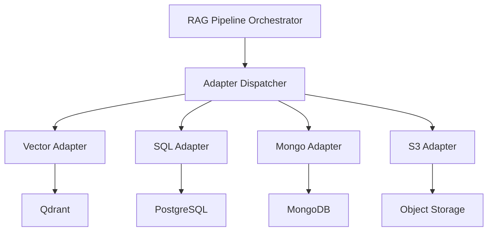
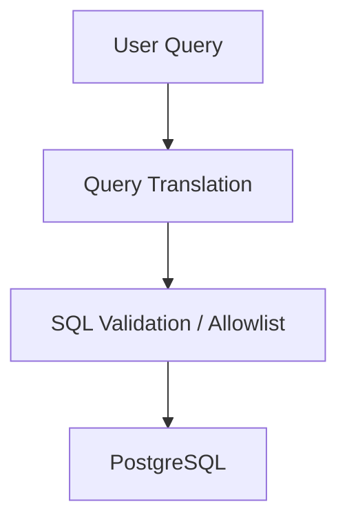
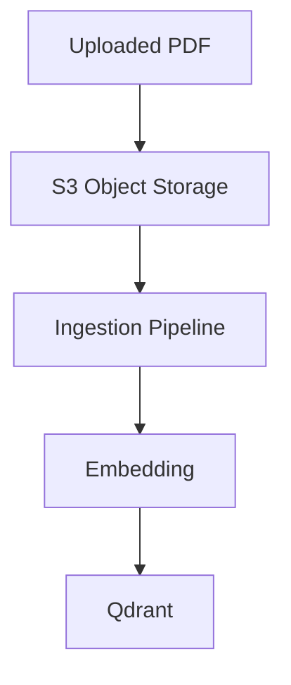
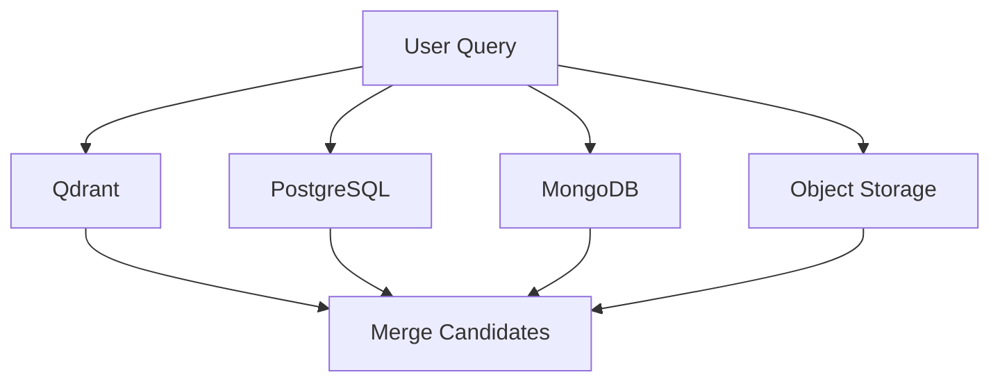
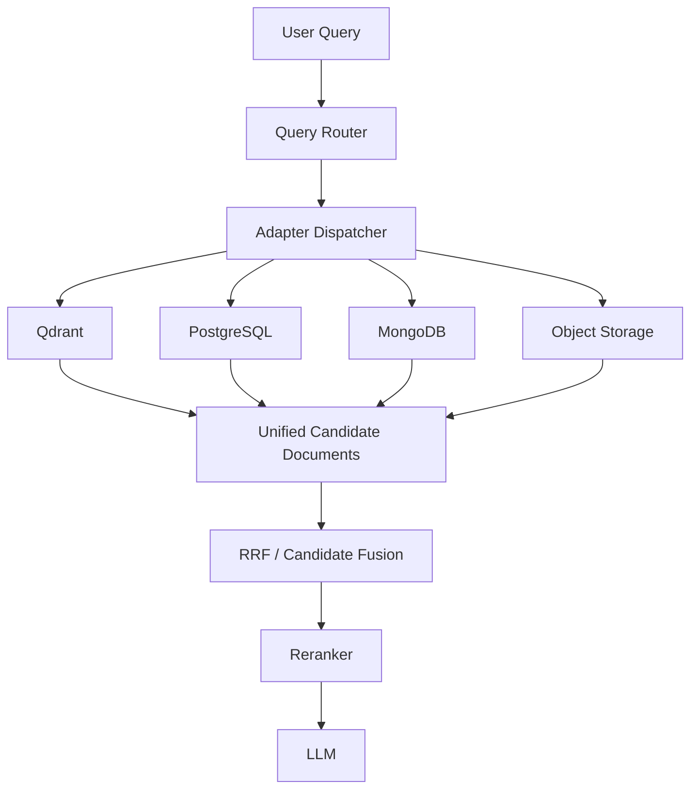
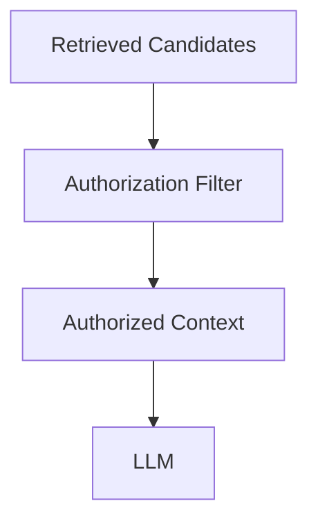
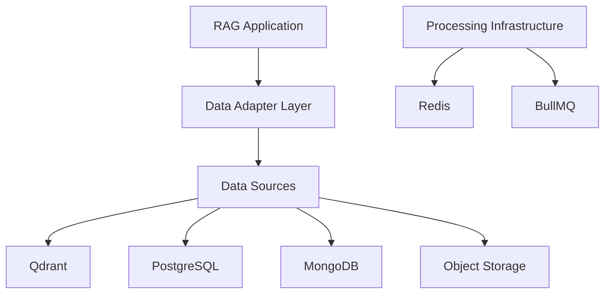

# Chapter 01 — Multi-Source Databases & Data Adapters Layer

## 1. Chapter Goal

The goal of this chapter is to build the **multi-source database and data adapter layer** for our Production-Grade Advanced RAG System.

In a simple RAG application, most knowledge may live inside one vector database.

A production enterprise system is different.

Useful context may be distributed across several storage systems:

* **Qdrant** → semantic document chunks and embeddings
* **PostgreSQL** → users, subscriptions, billing, structured business data
* **MongoDB** → sessions, telemetry, flexible document metadata
* **Object Storage** → raw PDFs and uploaded documents
* **Redis** → queues, caching, and transient processing state

The RAG orchestrator should not need to understand the implementation details of every database.

Instead, we introduce a common **Data Adapter Layer**.

---

## 2. Why Do We Need an Adapter Layer?

Without adapters, the RAG orchestrator might look like this:

```text
RAG Orchestrator
   │
   ├── Qdrant API
   ├── PostgreSQL SQL
   ├── MongoDB queries
   └── S3 SDK
```

This creates tight coupling.

Every retrieval component needs to understand how every database works.

Instead, we introduce an abstraction:



The orchestrator only needs to know:

> "I need candidates from the vector store."

It does not need to know how Qdrant performs the search.

This separation makes the system easier to extend, test, and maintain.

---

# 3. Unified Candidate Document

Different databases return completely different data structures.

For example, Qdrant may return:

```javascript
{
  id: "chunk_123",
  score: 0.91,
  payload: {
    text: "...",
    page: 12
  }
}
```

PostgreSQL may return:

```javascript
{
  id: "USER_123",
  name: "John Doe",
  plan: "Pro"
}
```

MongoDB may return:

```javascript
{
  sessionId: "sess_123",
  userId: "USER_123",
  preferences: {
    theme: "dark"
  }
}
```

The RAG pipeline should not need to understand all these different formats.

Therefore, adapters normalize them into a common structure:

```javascript
{
  id: "string",
  title: "string",
  text: "string",
  source: "string",
  score: 0.95,
  metadata: {}
}
```

We will call this a **candidate document**.

---

# 4. Candidate Document Contract

A candidate should contain:

| Field      | Purpose                                            |
| ---------- | -------------------------------------------------- |
| `id`       | Unique identifier                                  |
| `title`    | Human-readable title                               |
| `text`     | Retrieval context                                  |
| `source`   | Origin of the information                          |
| `score`    | Retrieval confidence/relevance score               |
| `metadata` | Additional filtering and authorization information |

For example:

```javascript
{
  id: "sql_USER_123",
  title: "User Account Record",
  text: "User is subscribed to Pro Tier.",
  source: "PostgreSQL",
  score: 0.98,
  metadata: {
    tenantId: "default",
    accessLevel: 1
  }
}
```

This common format becomes the contract between the **data layer** and the **retrieval pipeline**.

---

# 5. Directory Structure

Create the following directories:

```text
src/
│
├── db/
│   ├── qdrant.js
│   ├── redis.js
│   ├── postgres.js
│   └── mongo.js
│
├── adapters/
│   ├── vectorAdapter.js
│   ├── sqlAdapter.js
│   ├── mongoAdapter.js
│   ├── s3Adapter.js
│   └── index.js
│
└── retrieval/
    └── vectorSearch.js
```

The responsibility is intentionally separated:

```text
src/db/
    ↓
Low-level database connections

src/adapters/
    ↓
Normalize database-specific results

src/retrieval/
    ↓
Higher-level retrieval algorithms
```

---

# 6. Qdrant Client

## File

```text
src/db/qdrant.js
```

Qdrant is our vector database.

It will eventually store:

```text
Document
   ↓
Chunks
   ↓
Embeddings
   ↓
Qdrant
```

---

## Code

```javascript
import { QdrantClient } from "@qdrant/js-client-rest";
import { config } from "../config.js";

export const qdrant =
  new QdrantClient({
    url: config.qdrant.url
  });

export async function ensureCollection() {
  const name =
    config.qdrant.collection;

  try {
    const exists =
      await qdrant.collectionExists(
        name
      );

    if (!exists.exists) {
      await qdrant.createCollection(
        name,
        {
          vectors: {
            size:
              config.openai
                .embeddingDimensions,

            distance: "Cosine"
          }
        }
      );

      console.log(
        `🗂️ Created Qdrant collection "${name}"`
      );
    }
  } catch (error) {
    const exists =
      await qdrant.collectionExists(
        name
      );

    if (!exists.exists) {
      throw error;
    }
  }

  return name;
}
```

---

## Why Is This Code Needed?

The rest of the application should not need to construct Qdrant clients manually.

Instead:

```javascript
import {
  qdrant
} from "../db/qdrant.js";
```

gives the application access to the shared client.

The `ensureCollection()` function provides an initialization step that makes sure the required collection exists before indexing or retrieval starts.

---

## Important Configuration

The vector size must match the embedding model:

```javascript
size:
  config.openai.embeddingDimensions
```

Our Chapter 0 configuration uses:

```env
EMBEDDING_DIMENSIONS=1536
```

Therefore the Qdrant collection must be configured for 1536-dimensional vectors.

If the embedding dimension and Qdrant collection dimension do not match, vector insertion will fail.

---

# 7. Redis Connection Configuration

## File

```text
src/db/redis.js
```

Redis is not primarily a retrieval database in this architecture.

Its main responsibilities are:

```text
Redis
 ├── BullMQ queues
 ├── Job state
 ├── Caching
 └── Temporary processing state
```

---

## Code

```javascript
import { config } from "../config.js";

export const redisConnection = {
  host:
    config.redis.host,

  port:
    config.redis.port,

  maxRetriesPerRequest:
    null
};
```

---

## Why `maxRetriesPerRequest: null`?

BullMQ requires a Redis connection that can remain available while workers process jobs.

Therefore, the connection configuration is prepared specifically for BullMQ usage.

Later, the indexing worker will use this connection:

```text
Document Upload
      ↓
BullMQ
      ↓
Redis
      ↓
Indexing Worker
      ↓
Embedding
      ↓
Qdrant
```

---

# 8. PostgreSQL Database Layer

## File

```text
src/db/postgres.js
```

PostgreSQL will store structured business data.

Typical examples:

```text
Users
Subscriptions
Invoices
Billing
Permissions
Organizations
```

---

## Important Security Principle

We should **not** allow an LLM to generate arbitrary SQL and execute it directly.

For example, this architecture is dangerous:

```text
User
 ↓
LLM
 ↓
Generated SQL
 ↓
PostgreSQL
```

A safer production architecture is:



For this learning chapter, we will keep the PostgreSQL layer simple.

---

## Development Implementation

```javascript
import pg from "pg";
import { config } from "../config.js";

const {
  Pool
} = pg;

export const postgresPool =
  new Pool({
    host:
      config.postgres.host,

    port:
      config.postgres.port,

    database:
      config.postgres.database,

    user:
      config.postgres.user,

    password:
      config.postgres.password
  });

export async function queryPostgres(
  sqlQuery,
  params = []
) {
  const result =
    await postgresPool.query(
      sqlQuery,
      params
    );

  return result.rows;
}
```

---

## Why Use a Connection Pool?

Creating a new database connection for every query is inefficient.

Instead:

```text
Application
    │
    ▼
Connection Pool
    │
    ├── Connection 1
    ├── Connection 2
    ├── Connection 3
    └── Connection N
```

The pool manages reusable PostgreSQL connections.

---

## Why Are Parameters Separate?

Use:

```javascript
await queryPostgres(
  "SELECT * FROM users WHERE id = $1",
  [userId]
);
```

instead of:

```javascript
await queryPostgres(
  `SELECT * FROM users WHERE id = '${userId}'`
);
```

The parameterized version helps protect against SQL injection.

---

# 9. MongoDB Database Layer

## File

```text
src/db/mongo.js
```

MongoDB is useful for flexible document-oriented data.

Examples include:

```text
Session state
Telemetry
Application events
Document metadata
Flexible JSON-like records
```

---

## Code

```javascript
import {
  MongoClient
} from "mongodb";

import { config } from "../config.js";

export const mongoClient =
  new MongoClient(
    config.mongo.url
  );

let mongoDatabase = null;

export async function connectMongo() {
  if (mongoDatabase) {
    return mongoDatabase;
  }

  await mongoClient.connect();

  mongoDatabase =
    mongoClient.db(
      config.mongo.database
    );

  console.log(
    `🍃 Connected to MongoDB database "${config.mongo.database}"`
  );

  return mongoDatabase;
}

export async function queryMongo(
  collectionName,
  filter = {}
) {
  const database =
    await connectMongo();

  return database
    .collection(collectionName)
    .find(filter)
    .toArray();
}
```

---

## Internal Flow

When:

```javascript
queryMongo(
  "sessions",
  {
    userId: "USER_123"
  }
);
```

is called:

```text
queryMongo()
     ↓
connectMongo()
     ↓
MongoClient
     ↓
Database
     ↓
Collection
     ↓
find()
     ↓
Array of documents
```

The adapter layer will then convert those MongoDB documents into candidate documents.

---

# 10. Vector Adapter

## File

```text
src/adapters/vectorAdapter.js
```

The vector adapter sits above the Qdrant retrieval implementation.

```text
Vector Adapter
      ↓
vectorSearch()
      ↓
Qdrant
```

---

## Code

```javascript
import {
  vectorSearch
} from "../retrieval/vectorSearch.js";

export async function searchVector(
  query
) {
  const results =
    await vectorSearch(query);

  return results.map(
    (result) => ({
      id:
        String(result.id),

      title:
        result.title ||
        "Vector Search Result",

      text:
        result.text ||
        "",

      source:
        "Qdrant",

      score:
        Number(result.score) || 0,

      metadata:
        result.metadata || {}
    })
  );
}
```

---

## Why Normalize Here?

The underlying vector search implementation may return:

```javascript
{
  id: "chunk-1",
  score: 0.91,
  text: "...",
  metadata: {}
}
```

The adapter guarantees that the rest of the system receives the same structure regardless of the underlying implementation.

---

# 11. SQL Adapter

## File

```text
src/adapters/sqlAdapter.js
```

The SQL adapter converts structured relational records into retrieval candidates.

---

## Code

```javascript
import {
  queryPostgres
} from "../db/postgres.js";

export async function searchSQL(
  sqlQuery,
  user = {}
) {
  const records =
    await queryPostgres(
      sqlQuery
    );

  const targetUser =
    records.find(
      (record) =>
        record.id === user.id
    ) ||
    records[0];

  if (!targetUser) {
    return [];
  }

  return [
    {
      id:
        `sql_${targetUser.id}`,

      title:
        `Relational User Account Record (${targetUser.id})`,

      text:
        [
          `User Account: ${targetUser.name}`,
          `User ID: ${targetUser.id}`,
          `Plan: ${targetUser.plan}`,
          `Billing Status: ${targetUser.billingStatus}`,
          `Monthly Fee: ${targetUser.monthlyFee}`,
          `Refund Eligible: ${targetUser.refundEligible}`
        ].join("\n"),

      source:
        "PostgreSQL",

      score:
        0.98,

      metadata: {
        tenantId:
          user.tenantId ||
          "default",

        accessLevel:
          1
      }
    }
  ];
}
```

---

## Important Design Decision

The adapter does not return the raw PostgreSQL record.

Instead, it converts:

```text
PostgreSQL Row
      ↓
Candidate Document
```

This allows later retrieval stages to treat SQL results similarly to vector results.

---

# 12. MongoDB Adapter

## File

```text
src/adapters/mongoAdapter.js
```

The Mongo adapter performs the same normalization for MongoDB.

---

## Code

```javascript
import {
  queryMongo
} from "../db/mongo.js";

export async function searchMongo(
  query,
  user = {}
) {
  const filter = {};

  if (user.id) {
    filter.userId =
      user.id;
  }

  const documents =
    await queryMongo(
      "sessions",
      filter
    );

  return documents.map(
    (document) => ({
      id:
        `mongo_${document.sessionId}`,

      title:
        "MongoDB User Session Log",

      text:
        [
          `Session: ${document.sessionId}`,
          `User: ${document.userId}`,
          `Last Login: ${document.lastLogin}`,
          `Theme: ${
            document.preferences
              ?.theme || "unknown"
          }`
        ].join("\n"),

      source:
        "MongoDB",

      score:
        0.90,

      metadata: {
        tenantId:
          user.tenantId ||
          "default",

        accessLevel:
          1
      }
    })
  );
}
```

---

## What Changed From the Mock Version?

The original implementation accepted a query but returned a hard-coded record.

That is misleading because it looks like MongoDB retrieval is happening when it is not.

The improved version actually calls:

```javascript
queryMongo(
  "sessions",
  filter
);
```

and transforms the returned documents.

---

# 13. S3 / Object Storage Adapter

Object storage is slightly different from the databases.

S3 is primarily used to store **objects**, such as:

```text
PDF
DOCX
TXT
Images
Raw uploads
```

It should not necessarily be treated as a traditional semantic retrieval database.

A common architecture is:



Therefore, the S3 adapter can be responsible for finding or retrieving raw source documents.

---

## File

```text
src/adapters/s3Adapter.js
```

For the initial chapter, we can use an abstraction rather than tightly coupling the whole application to AWS.

---

## Code

```javascript
const mockObjects = [
  {
    id:
      "s3_invoice_2026_08.pdf",

    title:
      "Subscription Invoice August 2026",

    text:
      "Invoice INV-2026-0881. Total Paid: $29.99.",

    source:
      "Object Storage",

    metadata: {
      contentType:
        "application/pdf",

      bucket:
        "adv-rag-documents"
    }
  }
];

export async function searchS3(
  query
) {
  const normalizedQuery =
    query.toLowerCase();

  return mockObjects
    .filter((object) =>
      `${object.title} ${object.text}`
        .toLowerCase()
        .includes(normalizedQuery)
    )
    .map((object) => ({
      ...object,
      score: 0.95
    }));
}
```

This is intentionally a **mock storage implementation**.

It should not be described as a real AWS S3 connection yet.

Later, an AWS SDK implementation can replace this module without changing the adapter contract.

---

# 14. Adapter Dispatcher

## File

```text
src/adapters/index.js
```

This is the central routing layer.

The RAG pipeline tells the dispatcher which type of source it needs.

---

## Code

```javascript
import {
  searchSQL
} from "./sqlAdapter.js";

import {
  searchVector
} from "./vectorAdapter.js";

import {
  searchMongo
} from "./mongoAdapter.js";

import {
  searchS3
} from "./s3Adapter.js";

export async function executeAdapter(
  route,
  query,
  user = {}
) {
  const targetStore =
    route?.targetStore ||
    "VECTOR_DB";

  switch (targetStore) {
    case "AUTH_DB":
      return searchSQL(
        query,
        user
      );

    case "VECTOR_DB":
      return searchVector(
        query
      );

    case "MONGO_DB":
      return searchMongo(
        query,
        user
      );

    case "S3":
      return searchS3(
        query
      );

    case "MULTI_STORE": {
      const [
        vectorHits,
        sqlHits,
        mongoHits,
        s3Hits
      ] =
        await Promise.all([
          searchVector(query),

          searchSQL(
            query,
            user
          ),

          searchMongo(
            query,
            user
          ),

          searchS3(query)
        ]);

      return [
        ...vectorHits,
        ...sqlHits,
        ...mongoHits,
        ...s3Hits
      ];
    }

    default:
      return searchVector(
        query
      );
  }
}
```

---

# 15. Why `Promise.all()`?

In multi-store retrieval, the databases are independent.

There is usually no reason to wait for:

```text
Qdrant
 ↓
PostgreSQL
 ↓
MongoDB
 ↓
S3
```

sequentially.

Instead, we can execute them concurrently:



JavaScript:

```javascript
await Promise.all([
  searchVector(query),
  searchSQL(query, user),
  searchMongo(query, user),
  searchS3(query)
]);
```

This allows the retrieval operations to run concurrently.

Later, we can add:

* timeouts
* retries
* circuit breakers
* per-source latency tracking
* partial failure handling

---

# 16. Route-Based Retrieval

The dispatcher supports several retrieval routes.

### Vector

```javascript
{
  targetStore: "VECTOR_DB"
}
```

Flow:

```text
Query
 ↓
Vector Adapter
 ↓
Qdrant
```

### SQL

```javascript
{
  targetStore: "AUTH_DB"
}
```

Flow:

```text
Query
 ↓
SQL Adapter
 ↓
PostgreSQL
```

### MongoDB

```javascript
{
  targetStore: "MONGO_DB"
}
```

Flow:

```text
Query
 ↓
Mongo Adapter
 ↓
MongoDB
```

### S3

```javascript
{
  targetStore: "S3"
}
```

Flow:

```text
Query
 ↓
S3 Adapter
 ↓
Object Storage
```

### Multi-Store

```javascript
{
  targetStore: "MULTI_STORE"
}
```

Flow:

```text
                   ┌── Qdrant
                   │
Query ─────────────┼── PostgreSQL
                   │
                   ├── MongoDB
                   │
                   └── S3
                         ↓
                    Merge Results
```

---

# 17. Why This Layer Matters for RAG

The adapter layer becomes especially important when we introduce **query routing**.

Consider a user asking:

> "What is my current subscription plan?"

This is primarily structured business data.

The router can decide:

```text
Query
 ↓
Query Router
 ↓
AUTH_DB
 ↓
PostgreSQL
```

Now consider:

> "How does our document ingestion pipeline work?"

The router can select:

```text
Query
 ↓
Query Router
 ↓
VECTOR_DB
 ↓
Qdrant
```

For a question such as:

> "What is my Pro subscription and when did I last log in?"

the system may require multiple sources:

```text
                 ┌── PostgreSQL
Query ───────────┤
                 └── MongoDB
                       ↓
                   Merge Results
                       ↓
                    Reranker
                       ↓
                     LLM
```

This is the foundation of **multi-source RAG**.

---

# 18. The Complete Data Flow

The architecture now becomes:



This is a critical architectural transition.

We are moving from:

```text
Single Vector DB RAG
```

toward:

```text
Multi-Source Retrieval Architecture
```

---

# 19. Important Security Considerations

Multi-source retrieval introduces additional security requirements.

A user may be allowed to retrieve:

```text
Qdrant → Public documentation
```

but not:

```text
PostgreSQL → Another customer's billing data
```

Therefore, every candidate should eventually carry authorization metadata.

For example:

```javascript
metadata: {
  tenantId: "tenant_123",
  accessLevel: 2,
  documentVisibility: "private"
}
```

The retrieval pipeline can then filter candidates before they reach the LLM.



This becomes especially important for enterprise multi-tenant applications.

---

# 20. Why Redis Is Not an Adapter Here

Redis was configured in Chapter 0, but it does not appear as a retrieval adapter.

That is intentional.

Redis is primarily infrastructure for:

```text
BullMQ
Caching
Job coordination
Transient state
```

For example:

```text
Upload PDF
   ↓
BullMQ
   ↓
Redis
   ↓
Worker
   ↓
Parse
   ↓
Chunk
   ↓
Embed
   ↓
Qdrant
```

Redis therefore belongs to the **processing infrastructure layer**, not necessarily the knowledge retrieval layer.

---

# 21. Required Dependencies

Because PostgreSQL and MongoDB are now real database clients rather than mocks, install their Node.js drivers:

```bash
npm install pg mongodb
```

If a real S3 implementation is added later:

```bash
npm install @aws-sdk/client-s3
```

For the current chapter, the S3 adapter intentionally remains a mock abstraction.

---

# 22. Verification

After starting Docker:

```bash
docker compose up -d
```

verify:

```bash
docker compose ps
```

You should have:

```text
Qdrant
Redis
PostgreSQL
MongoDB
```

Then test the database modules individually.

For example:

```javascript
import {
  ensureCollection
} from "./db/qdrant.js";

await ensureCollection();

console.log(
  "Qdrant ready."
);
```

For PostgreSQL:

```javascript
import {
  queryPostgres
} from "./db/postgres.js";

const rows =
  await queryPostgres(
    "SELECT NOW() AS current_time"
  );

console.log(rows);
```

For MongoDB:

```javascript
import {
  connectMongo
} from "./db/mongo.js";

const database =
  await connectMongo();

console.log(
  `Connected to ${database.databaseName}`
);
```

---

# 23. Adapter Verification

A simple dispatcher test can look like:

```javascript
import {
  executeAdapter
} from "./adapters/index.js";

const results =
  await executeAdapter(
    {
      targetStore:
        "MONGO_DB"
    },
    "session information",
    {
      id: "USER_123",
      tenantId: "default"
    }
  );

console.log(
  JSON.stringify(
    results,
    null,
    2
  )
);
```

The important thing to verify is that the returned value follows the unified candidate format:

```javascript
{
  id,
  title,
  text,
  source,
  score,
  metadata
}
```

---

# 24. Failure Handling

Multi-source retrieval introduces partial failures.

For example:

```text
Qdrant       ✅
PostgreSQL   ✅
MongoDB      ❌
S3           ✅
```

The entire RAG request should not necessarily fail because MongoDB is unavailable.

Later, the dispatcher can use a resilient pattern:

```javascript
const results =
  await Promise.allSettled([
    searchVector(query),
    searchSQL(query, user),
    searchMongo(query, user),
    searchS3(query)
  ]);
```

This allows the application to distinguish:

```text
fulfilled
rejected
```

and continue using healthy sources.

This is an important production improvement that we will introduce when the retrieval orchestration becomes more advanced.

---

# 25. Current Architecture

At the end of Chapter 01, our system has three conceptual layers:



The separation is:

### Application Layer

Responsible for:

* routing
* retrieval orchestration
* generation

### Adapter Layer

Responsible for:

* database abstraction
* result normalization
* source-specific retrieval

### Data Layer

Responsible for:

* Qdrant
* PostgreSQL
* MongoDB
* object storage

### Processing Infrastructure

Responsible for:

* Redis
* BullMQ
* asynchronous jobs

---

# 26. Key Takeaways

The most important concept from this chapter is:

> **The RAG orchestrator should depend on a stable data contract, not on database-specific implementation details.**

Instead of:

```text
RAG → Qdrant
```

we now have:

```text
RAG
 ↓
Adapter Layer
 ↓
Multiple Data Sources
```

And every source eventually produces:

```javascript
{
  id,
  title,
  text,
  source,
  score,
  metadata
}
```

This unified representation allows later retrieval stages such as:

```text
Multi-Source Retrieval
        ↓
Candidate Fusion
        ↓
RRF
        ↓
Re-ranking
        ↓
Context Compression
        ↓
LLM Generation
```

to operate without caring whether the original information came from Qdrant, PostgreSQL, MongoDB, or object storage.

---

# 27. Summary

In this chapter, we built the foundation for **multi-source RAG retrieval**.

We implemented:

```text
src/db/
├── qdrant.js
├── redis.js
├── postgres.js
└── mongo.js
```

and:

```text
src/adapters/
├── vectorAdapter.js
├── sqlAdapter.js
├── mongoAdapter.js
├── s3Adapter.js
└── index.js
```

We also introduced the **Unified Candidate Document** contract:

```javascript
{
  id,
  title,
  text,
  source,
  score,
  metadata
}
```

Finally, the `executeAdapter()` dispatcher provides a single entry point for multi-source retrieval.

The resulting architecture is:

```text
User Query
    ↓
Query Router
    ↓
Adapter Dispatcher
    ↓
┌──────────┬────────────┬───────────┬──────────────┐
│ Qdrant   │ PostgreSQL │ MongoDB   │ Object Store │
└──────────┴────────────┴───────────┴──────────────┘
    ↓
Unified Candidate Documents
    ↓
RRF / Fusion
    ↓
Re-ranking
    ↓
LLM
```

---

# 🚀 Next Chapter

## Chapter 02 — Guardrails & PII Protection

The next chapter will introduce the security boundary around the RAG pipeline.

We will build:

```text
User Query
    ↓
Input Guardrails
    ↓
Prompt Injection Detection
    ↓
PII Detection & Masking
    ↓
Query Processing
    ↓
Retrieval
    ↓
Output Verification
    ↓
Safe Response
```

The key principle will be:

> **Never trust raw user input or retrieved content simply because it came from our retrieval system.**

This guardrail layer will then sit between the user, the query-routing system, the multi-source adapters, and the final LLM.

