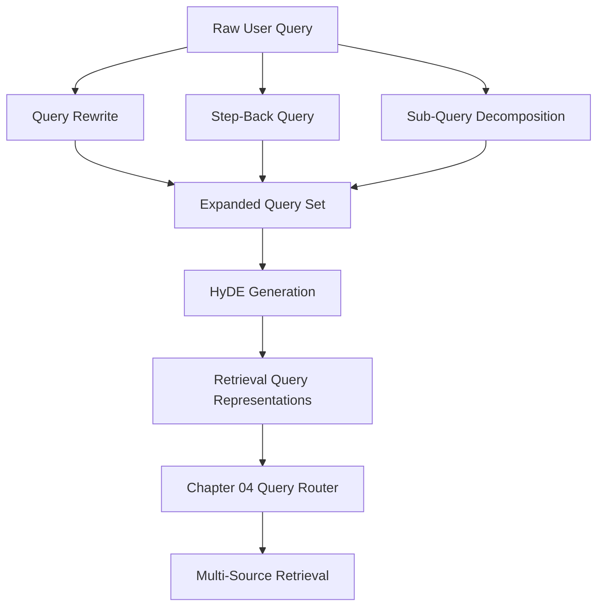
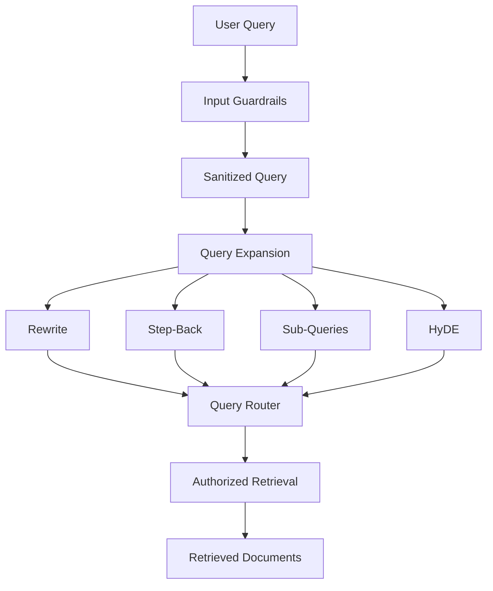
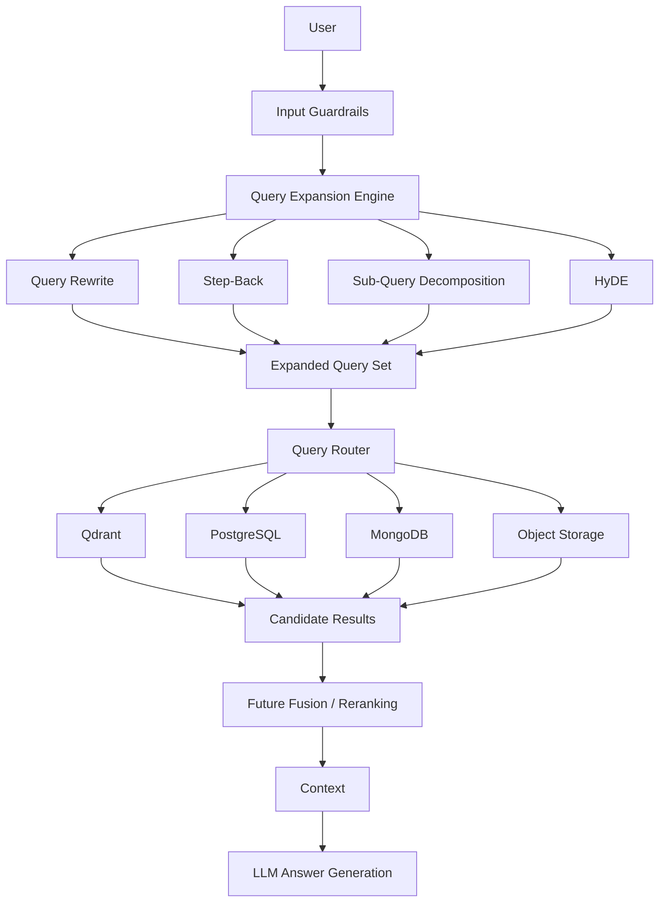

# Chapter 03 — Query Expansion & Translation Engine

## 1. Chapter Goal

In the previous chapters, we established the infrastructure and security foundation of our Production-Grade Advanced RAG system.

* **Chapter 0:** Infrastructure and configuration
* **Chapter 1:** Multi-source databases and adapters
* **Chapter 2:** Guardrails, security, and PII protection

Now we build the **Query Expansion & Translation Engine**.

The purpose of this subsystem is to transform a user's original question into multiple retrieval-friendly representations before searching our data sources.

A single query is often not enough for high-recall retrieval.

For example:

> "Why is my payment failing?"

A document may instead contain:

> "Common causes of unsuccessful subscription transactions"

The meaning is related, but the wording is different.

Query expansion creates additional representations that help the retrieval system discover relevant information even when the vocabulary or level of abstraction differs.

### The four transformations

We will implement:

1. **Query Rewriting**
2. **Step-Back Prompting**
3. **Sub-Query Decomposition**
4. **HyDE — Hypothetical Document Embeddings**

The architecture is:



The important idea is that these transformations **do not retrieve documents themselves**.

They produce better representations that Chapter 4 will send to the retrieval layer.

---

# 2. Why Query Expansion Is Necessary

Consider a user asking:

> "How can I make my app faster?"

A traditional vector search may retrieve documents containing:

* application performance
* optimization
* runtime efficiency

But it might miss useful documents discussing:

* caching
* database indexing
* lazy loading
* reducing network requests
* code splitting

The user's question is short, while the knowledge contained in the system may be distributed across many documents.

Query expansion attempts to bridge this gap.

Conceptually:

```text
User Query
    ↓
Multiple Retrieval Representations
    ↓
More Candidate Documents
    ↓
Fusion / Ranking
    ↓
Final Context
```

This improves **recall**.

However, generating more queries also increases:

* LLM cost
* latency
* number of retrieval operations
* duplicate results

Therefore, query expansion should be configurable rather than blindly applied to every production request.

---

# 3. Shared OpenAI Client

Before implementing the individual strategies, we should avoid creating an OpenAI client separately in every module.

Create:

`src/db/openai.js`

```javascript
import OpenAI from "openai";
import { config } from "../config.js";

export const openai =
  new OpenAI({
    apiKey:
      config.openai.apiKey
  });
```

## Why this file is needed

All query transformation modules need access to OpenAI.

Instead of doing this repeatedly:

```javascript
const openai =
  new OpenAI({
    apiKey:
      config.openai.apiKey
  });
```

we create the client once and reuse it.

The dependency flow becomes:

```text
rewrite.js
     ↓
db/openai.js
     ↓
OpenAI API

stepBack.js
     ↓
db/openai.js
     ↓
OpenAI API

subQueries.js
     ↓
db/openai.js
     ↓
OpenAI API

hyde.js
     ↓
db/openai.js
     ↓
OpenAI API
```

This gives us one consistent integration point.

---

# 4. Query Rewriting

Create:

`src/query/rewrite.js`

## Purpose

Query rewriting converts an informal user question into a clearer, explicit, self-contained retrieval query.

For example:

```text
Original:
"why payment failed?"

Rewritten:
"What are the common reasons a user's subscription payment can fail?"
```

The rewritten version gives the retrieval system more useful context.

## Implementation

```javascript
import { openai } from "../db/openai.js";
import { config } from "../config.js";

/**
 * Query Rewriting
 *
 * Converts an informal user query into a clearer,
 * explicit and retrieval-friendly query.
 */
export async function rewriteQuery(
  query
) {
  try {
    const completion =
      await openai.chat.completions.create({
        model:
          config.openai.chatModel,

        temperature: 0.1,

        messages: [
          {
            role: "system",

            content:
              [
                "You are a query rewriting assistant",
                "for a vector retrieval system.",

                "Rewrite the user's query so that it is:",
                "- explicit",
                "- clear",
                "- self-contained",
                "- grammatically correct",
                "- suitable for document retrieval.",

                "Preserve the original intent.",
                "Do not answer the question.",
                "Respond only with the rewritten query."
              ].join("\n")
          },

          {
            role: "user",
            content: query
          }
        ]
      });

    return (
      completion
        .choices[0]
        ?.message
        ?.content
        ?.trim() ||
      query
    );
  } catch (error) {
    console.error(
      "⚠️ Query rewriting failed:",
      error.message
    );

    return query;
  }
}
```

## Code explanation

### 1. Import the shared OpenAI client

```javascript
import { openai } from "../db/openai.js";
```

The query module does not create its own OpenAI client.

It reuses the centralized client.

### 2. Import configuration

```javascript
import { config } from "../config.js";
```

The model comes from our central configuration:

```javascript
config.openai.chatModel
```

This means the model can be changed through `.env` without modifying this module.

### 3. Low temperature

```javascript
temperature: 0.1
```

Rewriting should be relatively deterministic.

We do not want creative rewriting.

We want the original meaning preserved.

### 4. System instruction

The system message tells the model:

* clarify the query
* preserve intent
* do not answer
* return only the rewritten query

This distinction is important.

The output will be used for **retrieval**, not presented directly to the user.

### 5. Safe fallback

```javascript
return query;
```

If the OpenAI request fails, retrieval can continue using the original query.

This is an important production principle:

> Query expansion should improve retrieval, but it should not become a single point of failure.

---

# 5. Step-Back Prompting

Create:

`src/query/stepBack.js`

## What is Step-Back Prompting?

Step-Back Prompting asks the model to move from a specific question to the broader concept or principle behind that question.

For example:

```text
Specific:
"Why does my React Native FlatList become slow with 5,000 items?"

Step-back:
"What are the principles and common techniques for
optimizing large list rendering in mobile applications?"
```

The original question identifies a specific problem.

The step-back query searches for the broader knowledge required to understand that problem.

This is particularly useful when the exact terminology in the user's question does not appear in the knowledge base.

## Implementation

```javascript
import { openai } from "../db/openai.js";
import { config } from "../config.js";

/**
 * Step-Back Prompting
 *
 * Converts a specific question into a broader
 * conceptual retrieval question.
 */
export async function createStepBackQuery(
  query
) {
  try {
    const completion =
      await openai.chat.completions.create({
        model:
          config.openai.chatModel,

        temperature: 0.2,

        messages: [
          {
            role: "system",

            content:
              [
                "You are an expert at Step-Back Prompting.",

                "Convert the user's specific question",
                "into a broader, higher-level conceptual",
                "question about the underlying principles",
                "needed to answer it.",

                "Preserve the original topic.",
                "Do not answer the question.",
                "Respond only with the step-back question."
              ].join("\n")
          },

          {
            role: "user",
            content: query
          }
        ]
      });

    return (
      completion
        .choices[0]
        ?.message
        ?.content
        ?.trim() ||
      query
    );
  } catch (error) {
    console.error(
      "⚠️ Step-Back Query failed:",
      error.message
    );

    return query;
  }
}
```

## Code explanation

The structure is similar to query rewriting, but the objective is different.

### Query rewriting

```text
Make the same question clearer.
```

### Step-back prompting

```text
Move one abstraction level higher.
```

For example:

```text
User:
"Why is my PostgreSQL query slow?"

Rewrite:
"Why is my PostgreSQL database query performing slowly?"

Step-back:
"What are the common causes and optimization techniques
for slow database queries?"
```

The two outputs can retrieve different documents.

That is exactly what we want.

---

# 6. Sub-Query Decomposition

Create:

`src/query/subQueries.js`

## Problem

Some questions contain multiple independent information requirements.

For example:

> "Compare PostgreSQL and MongoDB for our application, explain their performance differences, discuss scaling, and recommend which one we should use."

This is not really one retrieval problem.

It contains multiple questions:

1. PostgreSQL characteristics
2. MongoDB characteristics
3. Performance comparison
4. Scaling characteristics
5. Architecture recommendation

Searching the entire question as one vector can reduce recall.

Sub-query decomposition breaks the question into focused retrieval queries.

---

## Implementation

```javascript
import { openai } from "../db/openai.js";
import { config } from "../config.js";

/**
 * Sub-Query Decomposition
 *
 * Breaks a complex query into several focused
 * retrieval questions.
 */
export async function createSubQueries(
  query
) {
  try {
    const completion =
      await openai.chat.completions.create({
        model:
          config.openai.chatModel,

        temperature: 0.2,

        response_format: {
          type: "json_schema",

          json_schema: {
            name:
              "sub_query_decomposition",

            strict: true,

            schema: {
              type: "object",

              additionalProperties:
                false,

              properties: {
                queries: {
                  type: "array",

                  description:
                    "Array of 3 to 5 focused retrieval queries.",

                  items: {
                    type: "string"
                  }
                }
              },

              required: [
                "queries"
              ]
            }
          }
        },

        messages: [
          {
            role: "system",

            content:
              [
                "Decompose the user's question into",
                "3 to 5 focused retrieval queries.",

                "Each query should represent an",
                "independent information requirement.",

                "Avoid duplicate queries.",
                "Preserve important entities and context.",
                "Return only the requested structured output."
              ].join("\n")
          },

          {
            role: "user",
            content: query
          }
        ]
      });

    const content =
      completion
        .choices[0]
        ?.message
        ?.content;

    if (!content) {
      return [query];
    }

    const parsed =
      JSON.parse(content);

    if (
      !Array.isArray(
        parsed.queries
      )
    ) {
      return [query];
    }

    const validQueries =
      parsed.queries
        .filter(
          (item) =>
            typeof item === "string"
        )
        .map(
          (item) =>
            item.trim()
        )
        .filter(Boolean);

    if (
      validQueries.length === 0
    ) {
      return [query];
    }

    return validQueries
      .slice(0, 5);
  } catch (error) {
    console.error(
      "⚠️ Sub-query decomposition failed:",
      error.message
    );

    return [query];
  }
}
```

## Code explanation

This module has one important difference from the previous strategies.

The expected output is not a string.

It is an array.

For example:

```javascript
[
  "What are the main characteristics of PostgreSQL?",
  "What are the main characteristics of MongoDB?",
  "How does PostgreSQL compare with MongoDB in performance?",
  "How do PostgreSQL and MongoDB scale?",
  "When should an application choose PostgreSQL over MongoDB?"
]
```

### Why structured output matters

Without structured output, the model might return:

```text
1. PostgreSQL
2. MongoDB
3. Performance
...
```

Parsing that reliably is difficult.

Structured output gives the application a predictable schema.

### Validation is still necessary

Even when structured output is requested, application code should validate the result.

We check:

```javascript
Array.isArray(
  parsed.queries
)
```

Then:

```javascript
.filter(
  (item) =>
    typeof item === "string"
)
```

This protects the retrieval pipeline from malformed values.

### Why `slice(0, 5)`?

The system intentionally limits the number of generated queries.

More queries mean:

```text
More LLM calls
       +
More retrieval operations
       +
More duplicate candidates
       =
Higher cost and latency
```

For our initial implementation, 3–5 sub-queries are enough.

---

# 7. HyDE — Hypothetical Document Embeddings

Create:

`src/query/hyde.js`

## What is HyDE?

HyDE stands for:

**Hypothetical Document Embeddings**

Instead of embedding the user's question directly, we first ask the LLM to generate a hypothetical answer or reference passage.

For example:

```text
User query:

"What causes PostgreSQL queries to become slow?"
```

HyDE might produce a passage conceptually similar to:

```text
PostgreSQL queries can become slow because of missing indexes,
inefficient query plans, large sequential scans, stale statistics,
or poorly optimized joins. Query performance can be improved
through indexing, query-plan analysis, statistics maintenance,
and query optimization.
```

The generated passage is then embedded.

The important point is:

> The hypothetical passage is used as a retrieval representation, not as trusted factual evidence.

We should retrieve actual documents after generating it.

---

## Implementation

```javascript
import { openai } from "../db/openai.js";
import { config } from "../config.js";

/**
 * HyDE
 *
 * Generates a hypothetical reference passage that
 * resembles the type of document that could answer
 * the user's question.
 */
export async function createHyDE(
  query
) {
  try {
    const completion =
      await openai.chat.completions.create({
        model:
          config.openai.chatModel,

        temperature: 0.3,

        messages: [
          {
            role: "system",

            content:
              [
                "Write a concise hypothetical reference",
                "passage that could answer the user's question.",

                "Write it as if it were an excerpt from",
                "an authoritative technical document.",

                "Use relevant terminology that may appear",
                "in factual documents.",

                "Do not include conversational filler.",
                "Do not mention that the passage is hypothetical."
              ].join("\n")
          },

          {
            role: "user",
            content: query
          }
        ]
      });

    return (
      completion
        .choices[0]
        ?.message
        ?.content
        ?.trim() ||
      query
    );
  } catch (error) {
    console.error(
      "⚠️ HyDE generation failed:",
      error.message
    );

    return query;
  }
}
```

## Code explanation

### Why generate a hypothetical passage?

User questions and documents have different linguistic structures.

A question might be:

```text
"Why does my database crash?"
```

A document might contain:

```text
"Database failures can occur because of memory
exhaustion, connection limits, corrupted indexes,
or resource contention."
```

HyDE attempts to move the query closer to the language and structure of the documents.

Conceptually:

```text
User Question
      ↓
LLM
      ↓
Hypothetical Document
      ↓
Embedding
      ↓
Vector Search
      ↓
Real Documents
```

### Important security distinction

The HyDE output must **never automatically become trusted context**.

It is generated by the model.

Therefore:

```text
HyDE text
    ≠
Verified knowledge
```

Its purpose is to improve retrieval.

The actual retrieved documents remain the evidence used by the answer-generation stage.

---

# 8. Comparing the Four Strategies

Each strategy solves a different retrieval problem.

| Strategy                | Main Purpose                      | Output               |
| ----------------------- | --------------------------------- | -------------------- |
| Query Rewrite           | Clarify the original question     | One rewritten query  |
| Step-Back               | Find broader conceptual knowledge | One conceptual query |
| Sub-Query Decomposition | Split complex questions           | 3–5 focused queries  |
| HyDE                    | Bridge question/document language | Hypothetical passage |

A useful mental model is:

```text
Rewrite
  ↓
"What exactly is the user asking?"

Step-Back
  ↓
"What broader concept helps answer it?"

Sub-Queries
  ↓
"What independent pieces must be retrieved?"

HyDE
  ↓
"What might a relevant document look like?"
```

---

# 9. Query Transformation Data Model

Although each strategy produces a different output, Chapter 4 will benefit from normalizing them into one internal representation.

A possible representation is:

```javascript
{
  original: query,

  rewritten: rewrittenQuery,

  stepBack: stepBackQuery,

  subQueries: subQueries,

  hyde: hydeQuery
}
```

For example:

```javascript
{
  original:
    "Why is my payment failing?",

  rewritten:
    "What are the common reasons a subscription payment can fail?",

  stepBack:
    "What are the common causes of failed payment transactions?",

  subQueries: [
    "What are common causes of failed subscription payments?",
    "How do payment authorization failures occur?",
    "How can failed payment transactions be diagnosed?"
  ],

  hyde:
    "Subscription payment failures can occur because..."
}
```

Chapter 4 can then decide which representations should be sent to which retrieval sources.

---

# 10. Running the Transformations

A simple orchestration function can be created later, but it is useful to understand the intended flow.

Conceptually:

```javascript
const rewritten =
  await rewriteQuery(
    query
  );

const stepBack =
  await createStepBackQuery(
    query
  );

const subQueries =
  await createSubQueries(
    query
  );

const hyde =
  await createHyDE(
    query
  );
```

The results can then be combined:

```javascript
const expandedQuery = {
  original: query,

  rewritten,

  stepBack,

  subQueries,

  hyde
};
```

This object becomes an input to the routing and retrieval layer.

---

# 11. Sequential vs Parallel Execution

The transformations do not depend on each other.

Therefore, running them sequentially:

```javascript
const rewritten =
  await rewriteQuery(query);

const stepBack =
  await createStepBackQuery(query);

const subQueries =
  await createSubQueries(query);

const hyde =
  await createHyDE(query);
```

means the total latency can roughly become:

```text
Rewrite
   +
Step-Back
   +
Sub-Queries
   +
HyDE
```

That is inefficient.

Because they are independent, they can eventually run concurrently:

```javascript
const [
  rewritten,
  stepBack,
  subQueries,
  hyde
] = await Promise.all([
  rewriteQuery(query),
  createStepBackQuery(query),
  createSubQueries(query),
  createHyDE(query)
]);
```

This changes the execution model toward:

```text
             ┌── Rewrite ───────┐
             │                  │
User Query ──┼── Step-Back ─────┤
             │                  ├── Expanded Query Set
             ├── Sub-Queries ───┤
             │                  │
             └── HyDE ──────────┘
```

### Production consideration

`Promise.all()` fails the whole operation if one promise rejects.

Our individual functions already catch errors and return fallbacks, so the current implementation is relatively resilient.

For a larger production system, `Promise.allSettled()` can also be considered when partial results are explicitly desirable.

---

# 12. Cost and Latency Considerations

Query expansion improves retrieval quality, but it is not free.

For one user query we may perform up to four LLM transformations:

```text
1 × Rewrite
1 × Step-Back
1 × Sub-Query Decomposition
1 × HyDE
```

Then those outputs may generate multiple retrieval requests.

For example:

```text
1 original
1 rewritten
1 step-back
3 sub-queries
1 HyDE
----------------
7 retrieval representations
```

If every representation is searched independently, the number of retrieval operations can grow quickly.

Therefore, production systems should eventually introduce configuration such as:

```env
ENABLE_QUERY_REWRITE=true
ENABLE_STEP_BACK=true
ENABLE_SUB_QUERIES=true
ENABLE_HYDE=true
```

And potentially:

```env
MAX_SUB_QUERIES=5
```

This allows us to tune the system according to:

* query complexity
* latency requirements
* cost
* retrieval quality
* source type

---

# 13. When Should Each Strategy Be Used?

Not every query needs all four transformations.

### Simple factual question

```text
"What is Redis?"
```

A rewrite may be enough.

### Ambiguous technical question

```text
"Why is this slow?"
```

Rewrite + Step-Back can help.

### Complex multi-part question

```text
"Compare PostgreSQL and MongoDB for performance,
scalability, transactions, and analytics."
```

Sub-query decomposition is particularly useful.

### Vocabulary mismatch

```text
"Why does my application keep timing out?"
```

HyDE can help generate terminology closer to the wording found in technical documentation.

A future production router can dynamically choose the appropriate transformations instead of running all four every time.

---

# 14. Failure Handling

Every transformation uses the same principle:

```text
LLM Transformation
       ↓
Success?
  ┌────┴────┐
 YES       NO
  ↓         ↓
Return    Return original
result     query
```

For example:

```javascript
try {
  // LLM transformation
} catch (error) {
  return query;
}
```

This is intentional.

Query expansion is an optimization layer.

It should not prevent the core RAG system from functioning.

The system should degrade gracefully:

```text
Best case:
Expanded Query → Better Retrieval

LLM failure:
Original Query → Normal Retrieval
```

---

# 15. Security Considerations

Query transformation introduces another LLM processing stage.

Therefore, Chapter 2's guardrails remain important.

The intended pipeline is:



The important rule is:

> Query expansion should operate on the sanitized query produced by the input guardrail layer.

We should not bypass security processing just because the query is being transformed.

Additionally, retrieved documents themselves may contain prompt-injection-like instructions. Chapter 4 and later answer-generation stages must therefore treat retrieved content as **untrusted data**, not instructions.

---

# 16. What This Chapter Does Not Do

This chapter intentionally does **not** perform:

* vector search
* metadata filtering
* authorization
* reranking
* Reciprocal Rank Fusion
* final answer generation

Those responsibilities belong to later components.

This separation keeps the architecture modular.

The responsibility of this chapter is:

```text
User Query
    ↓
Better Retrieval Representations
```

Not:

```text
User Query
    ↓
Final Answer
```

---

# 17. Final Architecture

After Chapter 3, our system can conceptually be represented as:



The architecture now has a clear separation:

```text
Guardrails
    ↓
Query Transformation
    ↓
Routing
    ↓
Retrieval
    ↓
Fusion / Reranking
    ↓
Generation
```

---

# 18. Summary

In this chapter, we implemented the **Query Expansion & Translation Engine**.

### 1. Query Rewriting

```javascript
rewriteQuery()
```

Makes the user's question clearer and more retrieval-friendly while preserving the original intent.

### 2. Step-Back Prompting

```javascript
createStepBackQuery()
```

Moves from a specific question toward broader conceptual knowledge.

### 3. Sub-Query Decomposition

```javascript
createSubQueries()
```

Breaks complex multi-part questions into several focused retrieval queries.

### 4. HyDE

```javascript
createHyDE()
```

Generates a hypothetical reference passage that can be used as an alternative retrieval representation.

The resulting system can transform:

```text
Raw User Query
      ↓
┌──────────────────────────────┐
│ Query Rewrite                │
│ Step-Back                    │
│ Sub-Queries                  │
│ HyDE                         │
└──────────────────────────────┘
      ↓
Expanded Retrieval Representations
```

The key principle is:

> **Query expansion improves the chances of finding the right evidence; it does not replace the evidence.**

In **Chapter 04 — Query Router & Multi-Source Retrieval**, we will use these expanded representations to build the dynamic query router, vector search engine, and metadata-based permission filtering layer.

