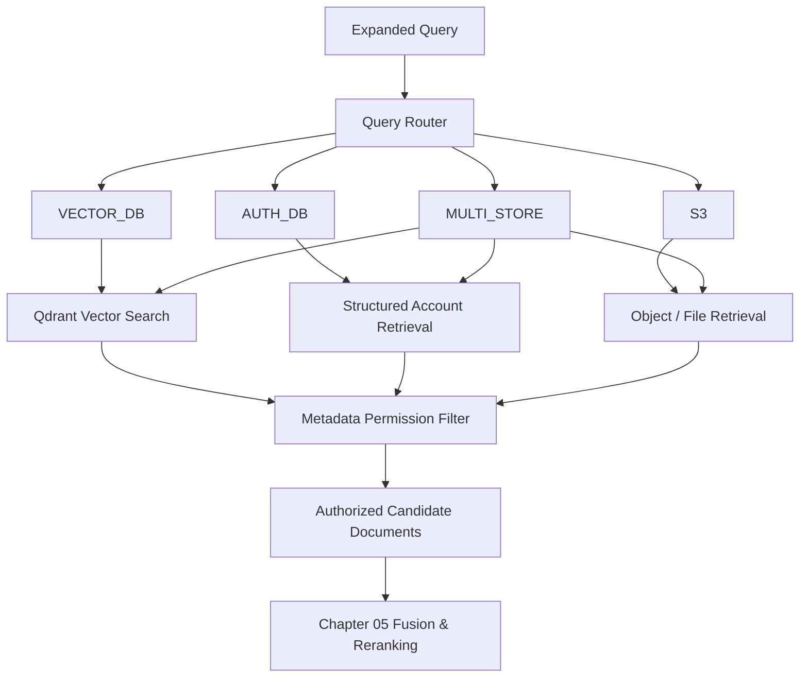
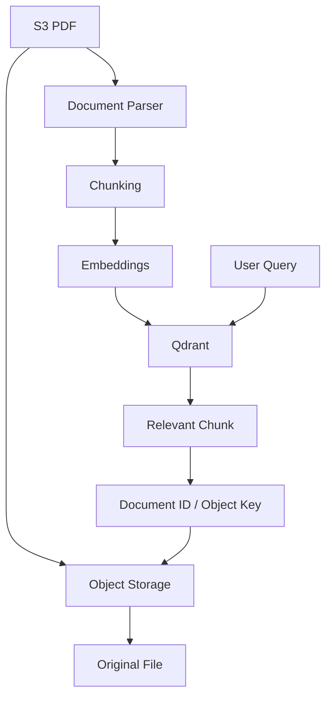
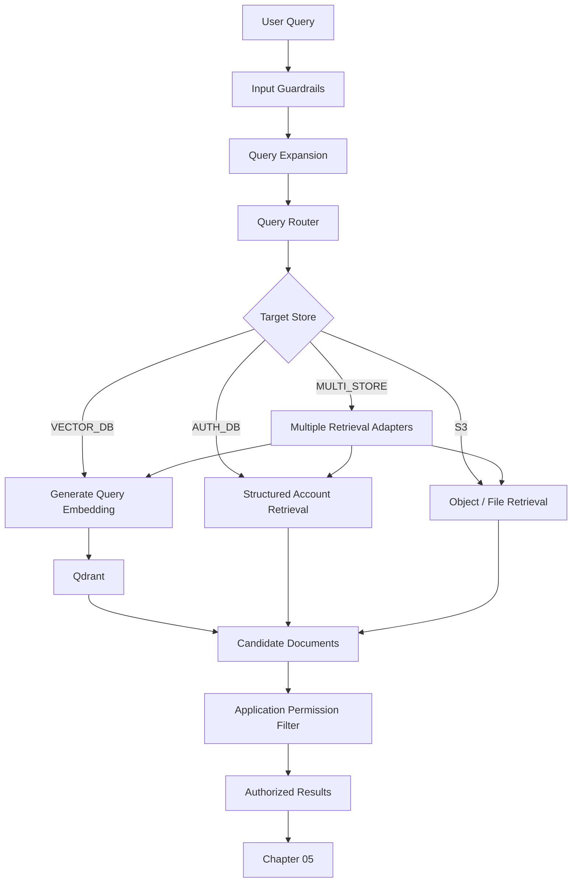
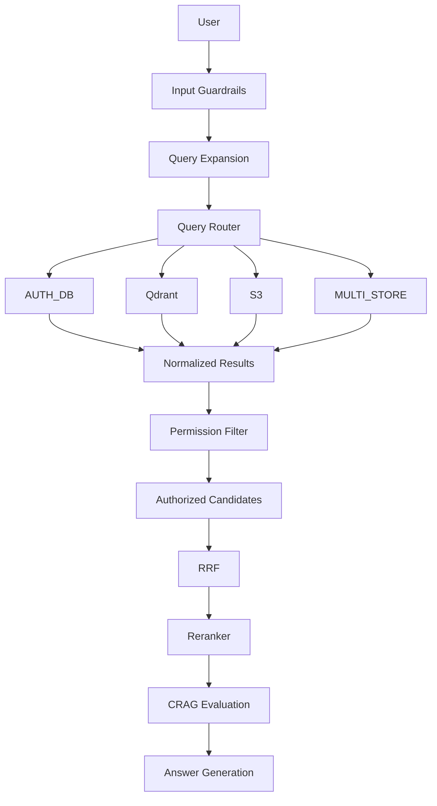

# Chapter 04 — Query Router & Multi-Source Vector Search Engine

## 1. Chapter Goal

In Chapter 3, we built the **Query Expansion & Translation Engine**.

The system can now transform a user query into:

* a rewritten query
* a step-back query
* multiple sub-queries
* a HyDE representation

However, we still need to answer an important question:

> **Where should each query be searched?**

In an enterprise RAG system, sending every query to every database is inefficient and can introduce security problems.

For example:

```text
"What is the refund policy?"
        ↓
Vector / documentation search
```

while:

```text
"Am I eligible for a refund?"
        ↓
Authenticated account data
        +
Refund policy
```

requires a different retrieval strategy.

Therefore, this chapter introduces three major components:

1. **Query Router**
2. **Qdrant Vector Search Engine**
3. **Permission & Tenant Filtering**

The architecture becomes:



The responsibility of this chapter is therefore:

```text
Query
  ↓
Route
  ↓
Retrieve
  ↓
Authorize / Filter
  ↓
Candidate Documents
```

It does **not** yet perform:

* RRF
* cross-encoder reranking
* CRAG
* final answer generation

Those will come later.

---

# 2. Data Store Responsibilities

Our system currently has four logical retrieval destinations.

| Route         | Responsibility                               |
| ------------- | -------------------------------------------- |
| `AUTH_DB`     | User/account-specific structured information |
| `VECTOR_DB`   | Semantic search over indexed document chunks |
| `S3`          | Files, PDFs, and object-storage resources    |
| `MULTI_STORE` | Queries requiring multiple sources           |

### AUTH_DB

Examples:

```text
"What plan am I subscribed to?"
"Is my account eligible for a refund?"
"What is my current billing status?"
```

This information belongs to trusted application databases.

### VECTOR_DB

Examples:

```text
"What is retrieval augmented generation?"
"How does Redis work?"
"What is our authentication policy?"
```

These are typically answered from indexed documentation.

### S3

Examples:

```text
"Find the invoice PDF."
"Show me the contract document."
"Retrieve the uploaded report."
```

Object storage is primarily concerned with **files and objects**, not semantic retrieval by itself.

### MULTI_STORE

Examples:

```text
"Am I eligible for a refund according to the company policy?"
```

This may require:

```text
User account
    +
Refund policy
```

Therefore, the router may select:

```text
MULTI_STORE
```

---

# 3. Query Router

Create:

`src/routing/queryRouter.js`

The router determines which retrieval strategy should be used.

A production router should not rely exclusively on an LLM.

A useful architecture is:

```text
Query
  ↓
Deterministic Rules
  ↓
Obvious Route?
  ├── Yes → Route
  └── No
       ↓
   LLM Intent Classification
       ↓
      Route
```

This gives us a combination of:

* deterministic routing for obvious cases
* LLM classification for ambiguous cases
* safe fallback behavior

---

# 4. Query Router Implementation

```javascript id="v7c2pm"
import { openai } from "../db/openai.js";
import { config } from "../config.js";

const VALID_ROUTES = [
  "AUTH_DB",
  "VECTOR_DB",
  "S3",
  "MULTI_STORE"
];

function normalizeQuery(
  query
) {
  return query
    .trim()
    .toLowerCase();
}

/**
 * Handles obvious routing cases without
 * spending an LLM call.
 */
function detectRuleBasedRoute(
  query
) {
  const normalized =
    normalizeQuery(query);

  const accountTerms = [
    "my account",
    "my plan",
    "my subscription",
    "my billing",
    "my payment",
    "am i eligible",
    "refund eligibility"
  ];

  const fileTerms = [
    "download",
    "pdf",
    "file",
    "document",
    "invoice pdf",
    "attachment"
  ];

  const hasAccountSignal =
    accountTerms.some(
      (term) =>
        normalized.includes(term)
    );

  const hasFileSignal =
    fileTerms.some(
      (term) =>
        normalized.includes(term)
    );

  if (
    hasAccountSignal &&
    hasFileSignal
  ) {
    return {
      targetStore:
        "MULTI_STORE",

      reasoning:
        "Detected both account-specific and file-related intent."
    };
  }

  if (hasFileSignal) {
    return {
      targetStore:
        "S3",

      reasoning:
        "Detected file or object-storage intent."
    };
  }

  if (hasAccountSignal) {
    return {
      targetStore:
        "AUTH_DB",

      reasoning:
        "Detected authenticated account-specific intent."
    };
  }

  return null;
}

/**
 * Uses the LLM only when deterministic
 * routing cannot confidently classify the query.
 */
export async function routeQuery(
  query
) {
  const ruleBasedRoute =
    detectRuleBasedRoute(query);

  if (ruleBasedRoute) {
    return ruleBasedRoute;
  }

  try {
    const completion =
      await openai.chat.completions.create({
        model:
          config.openai.chatModel,

        temperature: 0,

        response_format: {
          type: "json_schema",

          json_schema: {
            name:
              "query_routing",

            strict: true,

            schema: {
              type: "object",

              additionalProperties:
                false,

              properties: {
                targetStore: {
                  type: "string",

                  enum:
                    VALID_ROUTES,

                  description:
                    "Selected retrieval route."
                },

                reasoning: {
                  type: "string",

                  description:
                    "Short explanation for the route selection."
                }
              },

              required: [
                "targetStore",
                "reasoning"
              ]
            }
          }
        },

        messages: [
          {
            role: "system",

            content:
              [
                "You are an enterprise RAG query router.",

                "Choose exactly one retrieval route.",

                "AUTH_DB:",
                "Authenticated user account, billing, subscription,",
                "payment status, refund eligibility and structured records.",

                "VECTOR_DB:",
                "General documentation, technical knowledge,",
                "policies, conceptual information and indexed text.",

                "S3:",
                "Files, PDFs, attachments and object-storage resources.",

                "MULTI_STORE:",
                "The request requires both user-specific structured",
                "data and external documentation or policy information.",

                "Do not answer the user's question.",
                "Only classify the retrieval destination."
              ].join("\n")
          },

          {
            role: "user",
            content: query
          }
        ]
      });

    const content =
      completion
        .choices[0]
        ?.message
        ?.content;

    if (!content) {
      throw new Error(
        "Router returned empty response."
      );
    }

    const parsed =
      JSON.parse(content);

    if (
      !VALID_ROUTES.includes(
        parsed.targetStore
      )
    ) {
      throw new Error(
        "Router returned an invalid route."
      );
    }

    return parsed;
  } catch (error) {
    console.error(
      "⚠️ Query routing failed:",
      error.message
    );

    return {
      targetStore:
        "VECTOR_DB",

      reasoning:
        "Safe fallback after router failure."
    };
  }
}
```

---

# 5. Code Explanation — Query Router

## Why use rule-based routing?

An LLM does not need to classify every obvious query.

For example:

```text
"Download my invoice PDF"
```

contains a very strong file-related signal.

Calling the LLM for every obvious case increases:

* latency
* cost
* dependency on the model

Therefore:

```text
Obvious query
    ↓
Rule-based route
```

while ambiguous queries can use:

```text
Ambiguous query
    ↓
LLM classification
```

This is a common pattern in production systems.

---

## Why use structured output?

The router must return predictable application data:

```javascript id="s4yr1x"
{
  targetStore: "VECTOR_DB",
  reasoning: "..."
}
```

Without structured output, the model might return:

```text
I think this should probably go to the vector database.
```

That is not reliable for application logic.

Structured output gives us an explicit schema.

---

# 6. Why Routing Is Not Authorization

This distinction is extremely important.

The router answers:

> **Where should I search?**

It does not answer:

> **Is this user allowed to see the result?**

For example:

```text
User:
"Show me our HR policy."
```

The router might correctly choose:

```text
VECTOR_DB
```

But the user may not have permission to access the HR documents.

Therefore:

```text
Routing
  ≠
Authorization
```

Authorization must be enforced separately.

---

# 7. Qdrant Vector Search

Create:

`src/retrieval/vectorSearch.js`

The vector search pipeline is:

```text
Query
  ↓
OpenAI Embedding
  ↓
Embedding Vector
  ↓
Qdrant
  ↓
Top-K Candidate Chunks
```

The important improvement over the original implementation is that we should apply tenant/access filtering **inside the vector search whenever possible**.

Otherwise, suppose:

```text
Tenant A → 1,000 documents
Tenant B → 1,000 documents
```

and we retrieve the top 5 globally.

It is possible that:

```text
Top 5
├── Tenant B
├── Tenant B
├── Tenant A
├── Tenant B
└── Tenant B
```

If we filter afterward, Tenant A may receive only one authorized result.

This is both a **security and retrieval-quality problem**.

---

# 8. Qdrant Vector Search Implementation

```javascript id="h8v4dn"
import { openai } from "../db/openai.js";
import { config } from "../config.js";
import { qdrant } from "../db/qdrant.js";

/**
 * Performs semantic vector search against Qdrant.
 *
 * Authorization metadata is pushed into the vector
 * database filter so unauthorized documents are not
 * selected as retrieval candidates.
 */
export async function vectorSearch(
  queryText,
  user = {}
) {
  if (
    typeof queryText !== "string" ||
    !queryText.trim()
  ) {
    return [];
  }

  const tenantId =
    user.tenantId;

  const accessLevel =
    user.accessLevel;

  if (
    !tenantId ||
    accessLevel === undefined
  ) {
    console.warn(
      "⚠️ Vector search rejected because authorization context is missing."
    );

    return [];
  }

  try {
    const embeddingResponse =
      await openai.embeddings.create({
        model:
          config.openai.embeddingModel,

        input:
          queryText.trim()
      });

    const vector =
      embeddingResponse
        .data[0]
        ?.embedding;

    if (
      !Array.isArray(vector)
    ) {
      throw new Error(
        "Embedding response did not contain a valid vector."
      );
    }

    const hits =
      await qdrant.search(
        config.qdrant.collection,
        {
          vector,

          limit:
            config.retrieval.topK,

          filter: {
            must: [
              {
                key:
                  "tenantId",

                match: {
                  value:
                    tenantId
                }
              }
            ],

            should: [
              {
                key:
                  "accessLevel",

                range: {
                  lte:
                    accessLevel
                }
              }
            ]
          },

          with_payload:
            true
        }
      );

    return hits.map(
      (hit) => ({
        id:
          String(hit.id),

        title:
          hit.payload?.title ||
          "Indexed Chunk",

        text:
          hit.payload?.text ||
          "",

        source:
          hit.payload?.source ||
          "Qdrant",

        score:
          Number(hit.score) || 0,

        metadata: {
          tenantId:
            hit.payload?.tenantId,

          accessLevel:
            hit.payload?.accessLevel,

          documentId:
            hit.payload?.documentId,

          page:
            hit.payload?.page,

          chunkIndex:
            hit.payload?.chunkIndex
        }
      })
    );
  } catch (error) {
    console.error(
      `⚠️ Vector search failed for query "${queryText}":`,
      error.message
    );

    throw error;
  }
}
```

---

# 9. Code Explanation — Vector Search

## Step 1: Validate the query

```javascript id="s9f3b2"
if (
  typeof queryText !== "string" ||
  !queryText.trim()
) {
  return [];
}
```

We should not send empty or invalid input to the embedding API.

---

## Step 2: Require trusted authorization context

```javascript id="k7i0a4"
const tenantId =
  user.tenantId;

const accessLevel =
  user.accessLevel;
```

This information should come from the authenticated application context.

It should **not** be extracted from:

* the user's natural-language query
* an LLM-generated query
* a generated answer

For example, this is trusted:

```javascript id="2twc4e"
{
  id: "USER_123",
  tenantId: "tenant_001",
  accessLevel: 2
}
```

while this is not trusted:

```text
"Search tenant_001's private documents."
```

---

## Step 3: Generate the embedding

```javascript id="e5xg8q"
const embeddingResponse =
  await openai.embeddings.create({
    model:
      config.openai.embeddingModel,

    input:
      queryText.trim()
  });
```

The embedding model converts the query into a numerical vector.

Conceptually:

```text
"What is our refund policy?"
          ↓
[0.012, -0.183, 0.442, ...]
```

The vector must have the same dimensionality configured for the Qdrant collection.

Our Chapter 0 configuration uses:

```env
EMBEDDING_DIMENSIONS=1536
```

---

# 10. Metadata Filtering in Qdrant

The search request includes authorization metadata:

```javascript id="l0e9nw"
filter: {
  must: [
    {
      key: "tenantId",

      match: {
        value: tenantId
      }
    }
  ]
}
```

The goal is:

```text
Tenant A Query
      ↓
Qdrant
      ↓
Only Tenant A candidates
```

rather than:

```text
All tenants
      ↓
Top-K
      ↓
Filter afterward
```

The first approach is significantly safer and generally produces better retrieval candidates.

---

# 11. Defense-in-Depth Filtering

Even though authorization is pushed into Qdrant, we should still keep a final application-level filter.

Why?

Because production systems can have:

* malformed metadata
* migration errors
* legacy documents
* incorrectly indexed records
* adapter bugs

Therefore:

```text
Qdrant Authorization Filter
          ↓
Application Authorization Filter
```

provides defense in depth.

This is especially important for multi-tenant systems.

---

# 12. Permission & Tenant Filter

Create:

`src/retrieval/filtering.js`

```javascript id="q6g0wp"
/**
 * Final authorization filter.
 *
 * Removes documents that do not belong to the
 * authenticated user's tenant or exceed their
 * access level.
 *
 * This is a defense-in-depth layer and should not
 * replace database-level authorization filters.
 */
export function filterResults(
  retrievalLists,
  user = {}
) {
  const userTenant =
    user.tenantId;

  const userAccess =
    user.accessLevel;

  if (
    !userTenant ||
    userAccess === undefined
  ) {
    return retrievalLists.map(
      () => []
    );
  }

  return retrievalLists.map(
    (list) => {
      if (
        !Array.isArray(list)
      ) {
        return [];
      }

      return list.filter(
        (document) => {
          const metadata =
            document?.metadata;

          if (!metadata) {
            return false;
          }

          const documentTenant =
            metadata.tenantId;

          const documentAccess =
            metadata.accessLevel;

          if (
            !documentTenant ||
            documentAccess === undefined
          ) {
            return false;
          }

          return (
            documentTenant ===
              userTenant &&
            Number(
              documentAccess
            ) <=
              Number(
                userAccess
              )
          );
        }
      );
    }
  );
}
```

---

# 13. Code Explanation — Permission Filter

The original implementation used:

```javascript
user.tenantId || "default"
```

and:

```javascript
doc.metadata?.tenantId || "default"
```

This is dangerous in a production multi-tenant system.

Consider:

```text
Missing tenant ID
      ↓
"default"
      ↓
Accidental access to default documents
```

Instead, we use **fail-closed behavior**.

If authorization context is missing:

```javascript id="q9ym2v"
return [];
```

If document authorization metadata is missing:

```javascript id="8v20bk"
return false;
```

The principle is:

> **Missing authorization metadata should not grant access.**

---

# 14. Access Levels

The system uses a simple numerical access-level model.

For example:

```text
Access Level 1
    ↓
Public / basic documents

Access Level 2
    ↓
Internal documents

Access Level 3
    ↓
Restricted documents
```

A user with:

```javascript id="3f6gkp"
accessLevel: 2
```

can access:

```text
Level 1
Level 2
```

but not:

```text
Level 3
```

The comparison is:

```javascript id="9s3h5q"
documentAccess <= userAccess
```

This is only a simple authorization model.

A real enterprise system may additionally require:

* roles
* groups
* resource ownership
* document ACLs
* organization membership
* geographic restrictions
* legal/compliance restrictions
* explicit deny rules

---

# 15. Retrieval Result Contract

All retrieval adapters should continue returning the normalized contract established in Chapter 1:

```javascript id="v4rj2e"
{
  id: "document_123",

  title:
    "Refund Policy",

  text:
    "Refunds are available under...",

  source:
    "Qdrant",

  score:
    0.91,

  metadata: {
    tenantId:
      "tenant_001",

    accessLevel:
      1,

    documentId:
      "doc_123",

    page:
      4,

    chunkIndex:
      7
  }
}
```

This consistency is important because Chapter 5 will combine results from multiple retrieval strategies.

The fusion layer should not need to know whether a result came from:

* Qdrant
* PostgreSQL
* MongoDB
* S3

It should receive a common candidate format.

---

# 16. What About S3?

One important architectural clarification:

> **S3 is object storage, not automatically a semantic search engine.**

If the user asks:

```text
"Find my invoice PDF."
```

we can search object metadata or use a database/index that maps:

```text
document ID
bucket
object key
tenant
filename
content type
```

For semantic search over S3 documents, the usual architecture is:



Therefore, `S3` routing should eventually mean:

```text
Find/retrieve an object
```

while semantic document search can still use:

```text
Qdrant
```

with S3 acting as the source of the original file.

---

# 17. Multi-Store Retrieval

Some questions require more than one source.

Example:

> "Am I eligible for a refund according to the refund policy?"

The system may need:

```text
AUTH_DB
    ↓
User's purchase/subscription information

VECTOR_DB
    ↓
Refund policy

       ↓
   Candidate Results
```

The important architectural point is that `MULTI_STORE` is not itself a database.

It is a **retrieval strategy**.

Conceptually:

```text
MULTI_STORE
     ↓
┌──────────────┬──────────────┐
│              │              │
AUTH_DB     VECTOR_DB        S3
```

Chapter 5 will later combine these results using fusion and reranking.

---

# 18. Handling Vector Search Failures

The original implementation returned a fabricated fallback document:

```text
"Subscriptions can be refunded within 14 days..."
```

This should not be used in a production RAG system.

Why?

Because if Qdrant is unavailable:

```text
Qdrant failure
     ↓
Fake document
     ↓
LLM sees fake evidence
     ↓
Potentially incorrect answer
```

That is worse than returning an explicit retrieval failure.

Our implementation therefore does:

```javascript id="3f7m6q"
throw error;
```

The higher-level orchestration layer can decide whether to:

* retry
* use another source
* degrade gracefully
* return a retrieval error
* trigger monitoring/alerting

This keeps infrastructure failure separate from knowledge.

---

# 19. Query Router + Retrieval Flow

The overall flow now looks like:



---

# 20. Relationship With Chapter 3

Chapter 3 generated multiple query representations.

For example:

```javascript id="l1q6mw"
{
  original:
    "Why is my payment failing?",

  rewritten:
    "What are the common reasons a subscription payment can fail?",

  stepBack:
    "What are the common causes of failed payment transactions?",

  subQueries: [
    "What causes payment authorization failures?",
    "How can failed payments be diagnosed?"
  ],

  hyde:
    "Subscription payment failures can occur because..."
}
```

Chapter 4 decides where those representations should go.

For example:

```text
Rewritten Query
      ↓
VECTOR_DB

Step-Back Query
      ↓
VECTOR_DB

Sub-Query
      ↓
VECTOR_DB / AUTH_DB

HyDE
      ↓
VECTOR_DB
```

The exact strategy can later be made dynamic.

This separation gives us:

```text
Chapter 3
"What should we search for?"

Chapter 4
"Where should we search?"

Chapter 5
"Which results should we trust most?"
```

---

# 21. Why We Do Not Send Everything Everywhere

Imagine:

```text
1 user query
4 query transformations
4 data stores
```

Naively searching everything could produce:

```text
4 × 4
=
16 retrieval operations
```

That quickly increases:

* latency
* infrastructure load
* database cost
* duplicate results
* ranking complexity

The router reduces unnecessary work.

Instead:

```text
Query
  ↓
Intent
  ↓
Relevant data stores
  ↓
Targeted retrieval
```

This is one of the main reasons an enterprise RAG system needs an orchestration layer rather than a simple:

```text
query → vector database
```

pipeline.

---

# 22. Production Considerations

## 22.1 Do not trust the router for authorization

The router can make mistakes.

Even if the router says:

```text
VECTOR_DB
```

authorization still needs to happen.

---

## 22.2 Do not use user-provided tenant IDs

Never do this:

```javascript
const tenantId =
  query.tenantId;
```

The tenant should come from the authenticated request context.

Use:

```javascript
const tenantId =
  user.tenantId;
```

where `user` originates from trusted authentication middleware.

---

## 22.3 Filter before retrieval whenever possible

Prefer:

```text
Qdrant
  ↓
Tenant + ACL filter
  ↓
Similarity search
```

over:

```text
Qdrant
  ↓
Similarity search
  ↓
Tenant filter
```

The first approach improves both security and retrieval quality.

---

## 22.4 Keep a second application-level filter

Even with database-level filtering:

```text
Database filter
      +
Application filter
```

provides defense in depth.

---

## 22.5 Do not fabricate fallback knowledge

Infrastructure failures should not turn into fake evidence.

Prefer:

```text
Retrieval failure
    ↓
Explicit failure / retry / alternate source
```

rather than:

```text
Retrieval failure
    ↓
Invented document
```

---

## 22.6 Monitor route decisions

In production, routing decisions should be observable.

Useful telemetry includes:

```text
route = VECTOR_DB
latency = 120ms
query_id = ...
```

but logs should avoid storing unnecessary sensitive user content or raw PII.

---

# 23. Testing the Router

Before connecting everything to the full RAG pipeline, test representative queries.

### Account query

```text
"What is my current subscription plan?"
```

Expected:

```text
AUTH_DB
```

### Documentation query

```text
"What is Reciprocal Rank Fusion?"
```

Expected:

```text
VECTOR_DB
```

### File query

```text
"Find my invoice PDF."
```

Expected:

```text
S3
```

### Multi-store query

```text
"Am I eligible for a refund according to the refund policy?"
```

Expected:

```text
MULTI_STORE
```

The exact classification can vary depending on your application's domain and routing rules, so these are test expectations for **our architecture**, not universal rules.

---

# 24. Testing Tenant Isolation

This test is more important than simple route testing.

Suppose:

```text
User:
tenantId = tenant_A
accessLevel = 1
```

and Qdrant contains:

```text
Document A
tenantId = tenant_A
accessLevel = 1

Document B
tenantId = tenant_B
accessLevel = 1
```

The result should contain:

```text
Document A
```

and never:

```text
Document B
```

even if Document B has a higher similarity score.

The security invariant is:

```text
Unauthorized document
       ↓
Must never reach the LLM context
```

This is a critical property of a multi-tenant RAG system.

---

# 25. Current Retrieval Architecture

After this chapter, the system has the following major layers:



This is becoming a proper retrieval pipeline rather than a simple vector-search application.

---

# 26. Summary

In this chapter, we implemented three core capabilities.

## 1. Query Router

```javascript
routeQuery()
```

Determines whether a query should use:

```text
AUTH_DB
VECTOR_DB
S3
MULTI_STORE
```

The router combines:

* deterministic rules
* structured LLM classification
* safe fallback behavior

---

## 2. Qdrant Vector Search

```javascript
vectorSearch()
```

Performs:

```text
Query
  ↓
OpenAI Embedding
  ↓
Qdrant Similarity Search
  ↓
Metadata-filtered candidates
```

Authorization metadata is pushed into the vector query whenever possible.

---

## 3. Permission & Tenant Filtering

```javascript
filterResults()
```

Provides application-level defense in depth for:

* tenant isolation
* access-level restrictions
* missing authorization metadata

The important security principle is:

```text
Missing permission information
          ↓
        DENY
```

not:

```text
Missing permission information
          ↓
       DEFAULT ACCESS
```

---

# 27. Final Architecture Principle

At the end of Chapter 4, the responsibilities are now clearly separated:

```text
Chapter 2
"Is this request safe?"

        ↓

Chapter 3
"How can we represent the query better?"

        ↓

Chapter 4
"Where should we search, and what is the user allowed to retrieve?"

        ↓

Chapter 5
"Which retrieved results are the strongest evidence?"
```

The key principle of this chapter is:

> **Routing determines where to search; authorization determines what the user may see.**

In **Chapter 05 — Rank Fusion, Reranking & CRAG**, we will take the candidate results produced by these multiple retrieval paths and build:

* **Reciprocal Rank Fusion (RRF)**
* **LLM/cross-encoder reranking**
* **Corrective RAG (CRAG) evaluation**
* retrieval-quality decisions before context reaches the generation layer

This will turn our multi-source candidate retrieval system into a much stronger evidence-selection pipeline.
