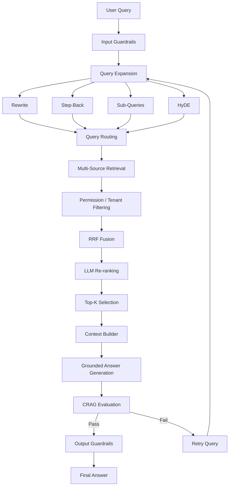
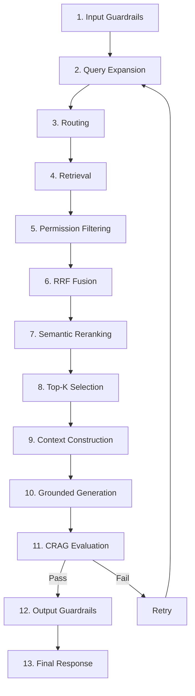
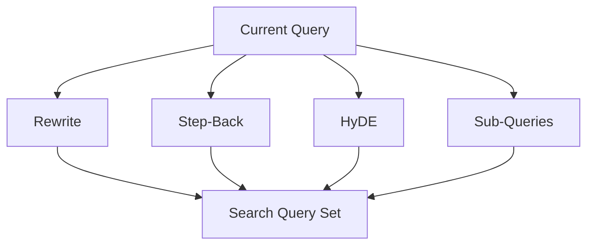
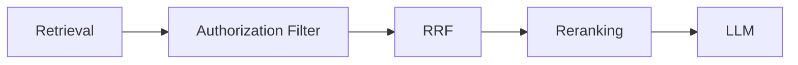
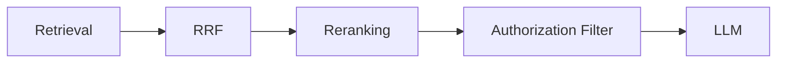
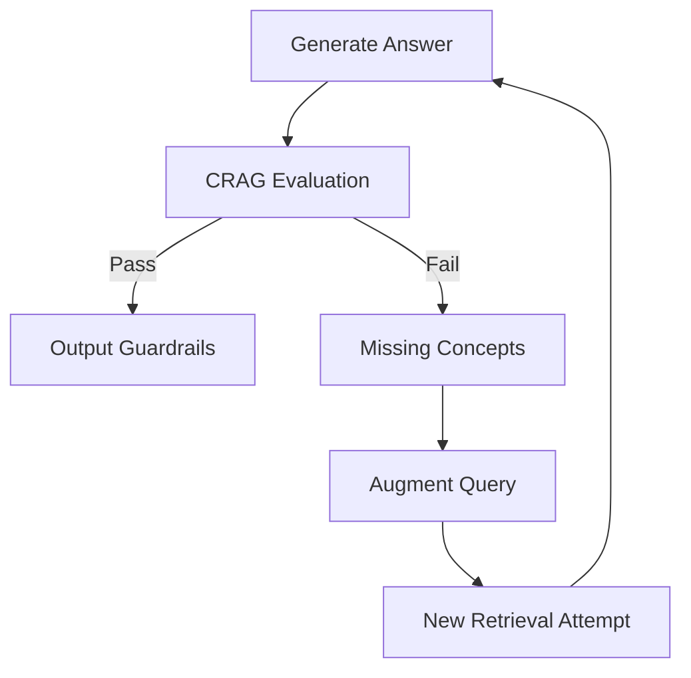
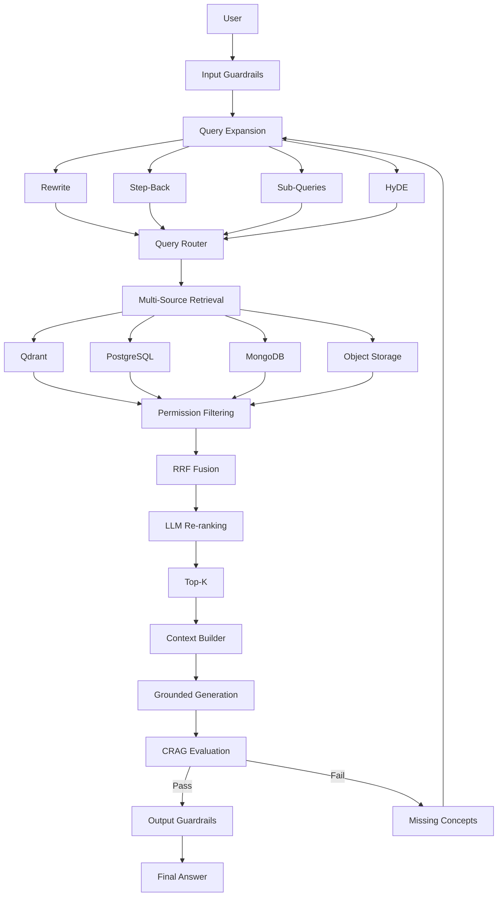
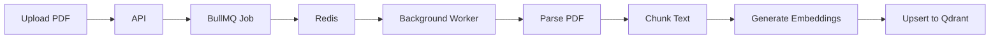

# Chapter 06 — Grounded Context, Answer Synthesis & Master Orchestrator

## 1. Chapter Goal

The goal of this chapter is to build the **generation and orchestration layer** of our Production-Grade Advanced RAG system.

We will implement:

* Context construction
* Grounded answer generation
* CRAG evaluation integration
* Retry handling
* Output guardrails
* The master `productionRAG()` orchestration pipeline

The components created in Chapters 01–05 will now be connected into one complete retrieval-generation workflow.

### Overall Architecture



The important architectural idea is that **retrieval and generation are not the same operation**.

The system first attempts to construct the best possible evidence set and only then asks the LLM to generate an answer from that evidence.

---

# 2. Context Builder

Create:

```text
src/generation/contextBuilder.js
```

The context builder converts normalized retrieval documents into a structured context block for the generation model.

## Why do we need a context builder?

The retriever returns JavaScript objects such as:

```js
{
  id: "doc_123",
  title: "Refund Policy",
  text: "Refunds are available within 14 days.",
  source: "Qdrant",
  score: 0.91,
  metadata: {
    tenantId: "tenant_001",
    accessLevel: 1
  }
}
```

The LLM does not need every internal field.

Instead, it needs a clean evidence representation:

```text
[SOURCE 1] - Refund Policy (Source: Qdrant)
Refunds are available within 14 days.
```

This gives the generation model explicit source boundaries that can later be referenced using `[SOURCE N]`.

## Implementation

Create:

```js
// src/generation/contextBuilder.js

/**
 * Step: Context Construction
 *
 * Converts normalized retrieval documents into
 * a clean, source-labelled context block.
 */
export function buildContext(documents = []) {
  if (!Array.isArray(documents) || documents.length === 0) {
    return "(No relevant documents retrieved)";
  }

  return documents
    .map((doc, index) => {
      const titleInfo = doc.title
        ? ` - ${doc.title}`
        : "";

      const sourceInfo = doc.source
        ? ` (Source: ${doc.source})`
        : "";

      const text =
        typeof doc.text === "string"
          ? doc.text.trim()
          : "";

      return [
        `[SOURCE ${index + 1}]${titleInfo}${sourceInfo}`,
        text
      ].join("\n");
    })
    .join("\n\n");
}
```

## How the code works

### 1. Validate the input

```js
if (!Array.isArray(documents) || documents.length === 0)
```

This prevents failures when retrieval produces no documents.

### 2. Give every document a source number

```js
[SOURCE ${index + 1}]
```

The source number provides a stable reference that the LLM can use in its answer.

### 3. Include useful metadata

```js
const titleInfo = ...
const sourceInfo = ...
```

The generation model can understand where the evidence came from without exposing internal metadata such as tenant IDs.

### 4. Join documents

```js
.join("\n\n")
```

Each document becomes a separate evidence block.

## Example

Input:

```js
[
  {
    id: "doc_1",
    title: "Refund Policy",
    text: "Refunds are available within 14 days.",
    source: "Qdrant"
  },
  {
    id: "doc_2",
    title: "Billing Policy",
    text: "Refund requests must be submitted through support.",
    source: "Qdrant"
  }
]
```

Output:

```text
[SOURCE 1] - Refund Policy (Source: Qdrant)
Refunds are available within 14 days.

[SOURCE 2] - Billing Policy (Source: Qdrant)
Refund requests must be submitted through support.
```

This becomes the evidence supplied to the generation model.

---

# 3. Grounded Answer Synthesis

Create:

```text
src/generation/generateAnswer.js
```

## Why do we need grounded generation?

A normal LLM can answer using its pretrained knowledge.

That is undesirable in a RAG system because the answer should be based on the retrieved enterprise information.

Our generation layer therefore establishes a strict rule:

> Answer using the supplied context. If the context does not contain enough information, say so.

## Implementation

```js
// src/generation/generateAnswer.js

import OpenAI from "openai";
import { config } from "../config.js";

const openai = new OpenAI({
  apiKey: config.openai.apiKey
});

/**
 * Step: Grounded Answer Generation
 *
 * Generates an answer using only the retrieved context.
 */
export async function generateAnswer(
  query,
  context
) {
  try {
    const completion =
      await openai.chat.completions.create({
        model:
          config.openai.chatModel,

        temperature: 0.2,

        messages: [
          {
            role: "system",

            content:
              "You are a production grounded assistant.\n\n" +

              "Answer the user's question using ONLY " +
              "the provided context.\n\n" +

              "Rules:\n" +
              "- Do not invent facts.\n" +
              "- Do not use knowledge outside the context.\n" +
              "- Do not extrapolate beyond the evidence.\n" +
              "- If the context is insufficient, clearly state what is missing.\n" +
              "- Cite source numbers such as [SOURCE 1] when referring to specific facts.\n" +
              "- Be concise, direct, and professional."
          },

          {
            role: "user",

            content:
              `Question:\n${query}\n\n` +
              `Context:\n${context}`
          }
        ]
      });

    return (
      completion
        .choices[0]
        ?.message
        ?.content
        ?.trim() ||
      "Unable to generate an answer."
    );

  } catch (error) {
    console.error(
      "⚠️ Grounded generation failed:",
      error.message
    );

    throw new Error(
      "Grounded answer generation failed."
    );
  }
}
```

## Important design decision

Notice that this implementation **throws an error instead of silently returning an answer**.

The earlier approach:

```js
return "Error generating response from LLM service.";
```

can make an infrastructure failure look like a legitimate generated answer.

For a production pipeline, it is better to distinguish:

```text
Successful generation
        ↓
Generated answer

Generation failure
        ↓
Pipeline error / controlled fallback
```

This distinction becomes important for monitoring, retries, and observability.

---

# 4. Master RAG Orchestrator

Create:

```text
src/rag/ragPipeline.js
```

This is the central component of the entire system.

It connects:

```text
Guardrails
    ↓
Query Expansion
    ↓
Routing
    ↓
Retrieval
    ↓
Filtering
    ↓
Fusion
    ↓
Reranking
    ↓
Context
    ↓
Generation
    ↓
CRAG
    ↓
Output Guardrails
```

## Why do we need an orchestrator?

Without an orchestrator, the application would need to manually coordinate every subsystem.

For example:

```js
await rewriteQuery();
await createStepBackQuery();
await createSubQueries();
await createHyDE();
await routeQuery();
await executeAdapter();
...
```

The orchestrator provides one application-level interface:

```js
productionRAG(query, user);
```

This makes the rest of the application independent from the internal RAG implementation.

---

# 5. Production RAG Pipeline

```js
// src/rag/ragPipeline.js

import {
  inputGuardrails
} from "../guardrails/input.js";

import {
  rewriteQuery
} from "../query/rewrite.js";

import {
  createStepBackQuery
} from "../query/stepBack.js";

import {
  createSubQueries
} from "../query/subQueries.js";

import {
  createHyDE
} from "../query/hyde.js";

import {
  routeQuery
} from "../routing/queryRouter.js";

import {
  executeAdapter
} from "../adapters/index.js";

import {
  filterResults
} from "../retrieval/filtering.js";

import {
  reciprocalRankFusion
} from "../retrieval/rrf.js";

import {
  rerank
} from "../retrieval/reranker.js";

import {
  buildContext
} from "../generation/contextBuilder.js";

import {
  generateAnswer
} from "../generation/generateAnswer.js";

import {
  evaluateAnswer
} from "../evaluation/crag.js";

import {
  outputGuardrails
} from "../guardrails/output.js";


const DEFAULT_USER = {
  id: "USER_123",
  tenantId: "default",
  accessLevel: 1
};

const MAX_RETRIES = 3;
const TOP_K = 5;


/**
 * Complete Production RAG Orchestrator
 *
 * Flow:
 *
 * Guard
 * → Expand
 * → Route
 * → Retrieve
 * → Filter
 * → Fuse
 * → Rerank
 * → Context
 * → Generate
 * → Evaluate
 * → Output Guard
 */
export async function productionRAG(
  userQuery,
  user = DEFAULT_USER
) {
  console.log(
    "\n=================================================="
  );

  console.log(
    `🚀 Starting Production RAG Pipeline`
  );

  console.log(
    "=================================================="
  );


  // --------------------------------------------------
  // 1. INPUT GUARDRAILS
  // --------------------------------------------------

  const guardResult =
    await inputGuardrails(
      userQuery,
      user
    );

  if (!guardResult.allowed) {
    console.log(
      "🛑 Input Guardrails blocked request"
    );

    return {
      success: false,

      answer:
        guardResult.message,

      pipelineSteps: {
        guardrails:
          "BLOCKED"
      }
    };
  }


  let currentQuery =
    guardResult.sanitizedQuery;

  const piiMap =
    guardResult.piiMap || {};


  // --------------------------------------------------
  // RETRY LOOP
  // --------------------------------------------------

  for (
    let attempt = 1;
    attempt <= MAX_RETRIES;
    attempt++
  ) {

    console.log(
      `\n🔄 RAG Attempt ${attempt}/${MAX_RETRIES}`
    );


    // ------------------------------------------------
    // 2. QUERY EXPANSION
    // ------------------------------------------------

    console.log(
      "🧩 Expanding query..."
    );

    const [
      rewritten,
      stepBack,
      hyde,
      subQueries
    ] = await Promise.all([
      rewriteQuery(currentQuery),

      createStepBackQuery(
        currentQuery
      ),

      createHyDE(
        currentQuery
      ),

      createSubQueries(
        currentQuery
      )
    ]);


    const searchQueries = [
      rewritten,
      stepBack,
      hyde,
      ...subQueries
    ];


    // Remove empty values and duplicates
    const uniqueSearchQueries =
      [
        ...new Set(
          searchQueries
            .map((query) =>
              query?.trim()
            )
            .filter(Boolean)
        )
      ];


    console.log(
      `   └─ Generated ${uniqueSearchQueries.length} search queries`
    );


    // ------------------------------------------------
    // 3. ROUTING + RETRIEVAL
    // ------------------------------------------------

    console.log(
      "🔀 Routing and retrieving..."
    );


    const retrievalPromises =
      uniqueSearchQueries.map(
        async (searchQuery) => {

          const route =
            await routeQuery(
              searchQuery
            );

          return executeAdapter(
            route,
            searchQuery,
            user
          );
        }
      );


    const rawRetrievalResults =
      await Promise.all(
        retrievalPromises
      );


    // ------------------------------------------------
    // 4. PERMISSION FILTERING
    // ------------------------------------------------

    console.log(
      "🔐 Applying tenant and access filters..."
    );


    const filteredResults =
      filterResults(
        rawRetrievalResults,
        user
      );


    // ------------------------------------------------
    // 5. RRF FUSION
    // ------------------------------------------------

    console.log(
      "📊 Running Reciprocal Rank Fusion..."
    );


    const fusedResults =
      reciprocalRankFusion(
        filteredResults
      );


    console.log(
      `   └─ ${fusedResults.length} unique candidates`
    );


    // ------------------------------------------------
    // 6. SEMANTIC RERANKING
    // ------------------------------------------------

    console.log(
      "⭐ Running semantic reranking..."
    );


    const reranked =
      await rerank(
        currentQuery,
        fusedResults
      );


    // ------------------------------------------------
    // 7. TOP-K SELECTION
    // ------------------------------------------------

    const topKDocs =
      reranked.slice(
        0,
        TOP_K
      );


    console.log(
      `   └─ Selected ${topKDocs.length} documents`
    );


    // ------------------------------------------------
    // 8. CONTEXT CONSTRUCTION
    // ------------------------------------------------

    const context =
      buildContext(
        topKDocs
      );


    // ------------------------------------------------
    // 9. GROUNDED GENERATION
    // ------------------------------------------------

    console.log(
      "🤖 Generating grounded answer..."
    );


    let rawAnswer;

    try {
      rawAnswer =
        await generateAnswer(
          currentQuery,
          context
        );

    } catch (error) {

      console.error(
        "❌ Generation failed:",
        error.message
      );

      return {
        success: false,

        answer:
          "The answer generation service is temporarily unavailable.",

        attempts: attempt,

        sources: []
      };
    }


    // ------------------------------------------------
    // 10. CRAG EVALUATION
    // ------------------------------------------------

    console.log(
      "📋 Running CRAG evaluation..."
    );


    const evaluation =
      await evaluateAnswer(
        currentQuery,
        rawAnswer,
        context
      );


    console.log(
      `   └─ Score: ${evaluation.score}/10`
    );


    console.log(
      `   └─ Grounded: ${evaluation.grounded}`
    );


    console.log(
      `   └─ Relevant: ${evaluation.relevant}`
    );


    // ------------------------------------------------
    // 11. CRAG PASS
    // ------------------------------------------------

    if (
      evaluation.score >= 6 &&
      evaluation.grounded === true &&
      evaluation.relevant === true
    ) {

      console.log(
        "✅ CRAG evaluation passed"
      );


      // ------------------------------------------------
      // 12. OUTPUT GUARDRAILS
      // ------------------------------------------------

      const output =
        outputGuardrails(
          rawAnswer,
          piiMap,
          {
            restorePII: false
          }
        );


      if (!output.allowed) {

        console.log(
          "🛑 Output Guardrails blocked response"
        );

        return {
          success: false,

          answer:
            output.answer,

          score:
            evaluation.score,

          attempts:
            attempt,

          sources: []
        };
      }


      // ------------------------------------------------
      // 13. FINAL RESPONSE
      // ------------------------------------------------

      return {
        success: true,

        answer:
          output.answer,

        score:
          evaluation.score,

        attempts:
          attempt,

        sources:
          topKDocs.map(
            (doc) => ({
              id: doc.id,

              title:
                doc.title,

              source:
                doc.source,

              score:
                doc.score
            })
          )
      };
    }


    // ------------------------------------------------
    // RETRY
    // ------------------------------------------------

    console.log(
      `⚠️ CRAG failed on attempt ${attempt}`
    );


    if (
      Array.isArray(
        evaluation.missing
      ) &&
      evaluation.missing.length > 0
    ) {

      currentQuery =
        [
          currentQuery,

          ...evaluation.missing
        ].join(" ");

    } else {

      // If CRAG cannot identify missing concepts,
      // retain the original query.
      currentQuery =
        currentQuery;
    }
  }


  // --------------------------------------------------
  // FINAL FALLBACK
  // --------------------------------------------------

  console.log(
    "🛑 Maximum RAG retries exhausted"
  );


  return {
    success: false,

    answer:
      "I couldn't find enough reliable or grounded information to answer your query accurately.",

    score: 0,

    attempts:
      MAX_RETRIES,

    sources: []
  };
}
```

---

# 6. Understanding the Orchestrator

The orchestrator can be understood as 13 logical stages.



The retry loop is intentionally outside the individual retrieval functions.

This means the individual components remain reusable:

```text
rewriteQuery()
createHyDE()
vectorSearch()
rerank()
evaluateAnswer()
```

while the orchestrator controls the complete workflow.

---

# 7. Why Query Expansion Runs in Parallel

The following code is important:

```js
const [
  rewritten,
  stepBack,
  hyde,
  subQueries
] = await Promise.all([
  rewriteQuery(currentQuery),
  createStepBackQuery(currentQuery),
  createHyDE(currentQuery),
  createSubQueries(currentQuery)
]);
```

These operations are independent.

There is no reason to execute:

```text
Rewrite
  ↓
Step-Back
  ↓
HyDE
  ↓
Sub-Queries
```

sequentially.

Instead, they can execute concurrently:



This reduces unnecessary latency.

However, parallelism increases LLM request concurrency and therefore can increase API cost and rate-limit pressure. Production deployments should eventually introduce concurrency limits and retry policies.

---

# 8. Why We Remove Duplicate Search Queries

The pipeline creates:

```js
const searchQueries = [
  rewritten,
  stepBack,
  hyde,
  ...subQueries
];
```

Different transformations can occasionally produce identical or empty queries.

Therefore:

```js
const uniqueSearchQueries = [
  ...new Set(
    searchQueries
      .map((query) => query?.trim())
      .filter(Boolean)
  )
];
```

provides three protections:

### Empty query protection

```js
.filter(Boolean)
```

removes empty values.

### Whitespace normalization

```js
.map((query) => query?.trim())
```

removes unnecessary surrounding whitespace.

### Duplicate elimination

```js
new Set(...)
```

prevents performing the same retrieval twice.

This is especially important because every duplicate query can trigger additional:

* routing calls
* embedding calls
* database queries
* LLM operations

---

# 9. Routing and Retrieval

Each expanded query is routed independently:

```js
const retrievalPromises =
  uniqueSearchQueries.map(
    async (searchQuery) => {

      const route =
        await routeQuery(
          searchQuery
        );

      return executeAdapter(
        route,
        searchQuery,
        user
      );
    }
  );
```

This allows different representations of the same question to potentially reach different data stores.

For example:

```text
"Why was my refund rejected?"
             │
             ├── Rewrite → AUTH_DB
             │
             ├── Step-Back → VECTOR_DB
             │
             ├── Sub-query → VECTOR_DB
             │
             └── HyDE → VECTOR_DB
```

This is one of the major benefits of combining **query expansion with dynamic routing**.

---

# 10. Permission Filtering Happens Before Fusion

The pipeline executes:

```js
const filteredResults =
  filterResults(
    rawRetrievalResults,
    user
  );
```

before:

```js
reciprocalRankFusion(...)
```

This ordering is important.

The system should not allow unauthorized documents to participate in ranking and then attempt to remove them later.

The preferred security boundary is:



rather than:



The second architecture risks exposing unauthorized content to later components.

In a stronger production implementation, authorization filtering should also happen **inside the data-store query where possible**, especially for Qdrant and SQL, rather than relying only on post-retrieval filtering.

---

# 11. RRF Fusion

After filtering:

```js
const fusedResults =
  reciprocalRankFusion(
    filteredResults
  );
```

RRF combines multiple ranked lists.

The formula is:

$$
RRF(d)=
\sum_i
\frac{1}{k+r_i(d)}
$$

where:

* `d` = document
* `r_i(d)` = document rank in retrieval list `i`
* `k` = smoothing constant
* default `k = 60`

The important property is that documents appearing consistently across multiple retrieval strategies receive stronger combined rankings.

For example:

```text
Rewrite:
A
B
C

Step-Back:
B
A
D

HyDE:
A
D
B
```

Document `A` repeatedly appears near the top.

RRF therefore increases its overall ranking.

---

# 12. Semantic Re-ranking

After RRF:

```js
const reranked =
  await rerank(
    currentQuery,
    fusedResults
  );
```

RRF uses ranking information.

The reranker instead evaluates:

```text
Query ↔ Document Meaning
```

This provides a second stage of relevance evaluation.

The architecture becomes:

```text
Multiple Retrieval Strategies
          ↓
       RRF Fusion
          ↓
Semantic Re-ranking
          ↓
       Top-K
```

This is a classic two-stage retrieval architecture:

```text
Stage 1 → High Recall
Stage 2 → High Precision
```

---

# 13. Top-K Context Selection

We select only the most relevant documents:

```js
const topKDocs =
  reranked.slice(
    0,
    TOP_K
  );
```

Currently:

```js
const TOP_K = 5;
```

This prevents unnecessarily large context windows.

However, `5` should eventually be moved into configuration:

```env
RETRIEVAL_FINAL_K=5
```

which already exists in our Chapter 0 configuration.

A future implementation should therefore prefer:

```js
config.retrieval.finalK
```

instead of hardcoding:

```js
5
```

---

# 14. Grounded Generation

The selected documents are converted into context:

```js
const context =
  buildContext(
    topKDocs
  );
```

Then:

```js
const rawAnswer =
  await generateAnswer(
    currentQuery,
    context
  );
```

The LLM receives:

```text
Question
   +
Retrieved Evidence
   ↓
Grounded Answer
```

The model is explicitly instructed not to answer using information outside the supplied context.

This reduces hallucination risk, but it is important to understand:

> Prompt instructions alone do not guarantee groundedness.

That is why the next stage is necessary.

---

# 15. CRAG Evaluation

The generated answer is evaluated:

```js
const evaluation =
  await evaluateAnswer(
    currentQuery,
    rawAnswer,
    context
  );
```

The evaluator returns information such as:

```js
{
  score: 8,
  grounded: true,
  relevant: true,
  missing: []
}
```

A response passes only when:

```js
evaluation.score >= 6 &&
evaluation.grounded === true &&
evaluation.relevant === true
```

This is stronger than checking the score alone.

For example:

```js
{
  score: 8,
  grounded: false,
  relevant: true
}
```

should not automatically pass.

A high numerical score cannot override a critical groundedness failure.

---

# 16. CRAG Retry Loop

If the answer fails evaluation:

```js
if (
  Array.isArray(evaluation.missing) &&
  evaluation.missing.length > 0
) {
  currentQuery =
    [
      currentQuery,
      ...evaluation.missing
    ].join(" ");
}
```

Suppose the original query is:

```text
Can I get a refund?
```

CRAG might identify:

```js
missing: [
  "refund eligibility period",
  "purchase date"
]
```

The retry query becomes approximately:

```text
Can I get a refund?
refund eligibility period
purchase date
```

The pipeline then runs query expansion and retrieval again.

Conceptually:



This is the corrective aspect of CRAG.

---

# 17. Why Retries Need a Hard Limit

Never implement:

```js
while (!goodAnswer) {
  retry();
}
```

An LLM evaluation loop could continue indefinitely.

Instead:

```js
const MAX_RETRIES = 3;
```

provides a deterministic upper bound.

This protects against:

* infinite loops
* runaway API costs
* excessive latency
* repeated identical failures

A production system should also monitor:

```text
retry count
retry reason
latency
token usage
LLM cost
```

---

# 18. Output Guardrails

Once CRAG passes:

```js
const output =
  outputGuardrails(
    rawAnswer,
    piiMap,
    {
      restorePII: false
    }
  );
```

The output guardrail is the final security boundary before returning data to the user.

It should be responsible for detecting things such as:

* blocked markers
* credential leakage
* secret patterns
* unsafe generated content
* unauthorized restoration of PII

## Important Return-Type Correction

The `outputGuardrails()` implementation from Chapter 02 returns:

```js
{
  allowed: true,
  answer: "...",
  reason: null
}
```

Therefore the pipeline **must not** do:

```js
const finalAnswer =
  outputGuardrails(...);

return {
  answer: finalAnswer
};
```

because `answer` would contain the entire object.

The correct implementation is:

```js
const output =
  outputGuardrails(
    rawAnswer,
    piiMap,
    {
      restorePII: false
    }
  );

if (!output.allowed) {
  // blocked
}

return {
  answer: output.answer
};
```

This is an important integration fix between Chapter 02 and Chapter 06.

---

# 19. Final Response Structure

A successful response looks like:

```js
{
  success: true,

  answer:
    "Refunds are available within 14 days of purchase. [SOURCE 1]",

  score: 8,

  attempts: 1,

  sources: [
    {
      id: "doc_123",
      title: "Refund Policy",
      source: "Qdrant",
      score: 0.92
    }
  ]
}
```

This gives the application both:

### User-facing information

```js
answer
```

and:

### System-level information

```js
score
attempts
sources
```

The frontend can display only the answer while observability systems can record the remaining metadata.

---

# 20. Complete Pipeline Architecture

At this point the entire RAG architecture looks like:



This is the core architecture of our Production-Grade Advanced RAG system.

---

# 21. Important Production Considerations

The current implementation is production-oriented, but several areas should be strengthened before deploying it at scale.

## 21.1 Do not trust the LLM router for authorization

The router can decide:

```text
AUTH_DB
VECTOR_DB
S3
MULTI_STORE
```

but it must never decide whether the user is authorized to access the underlying data.

Authorization must come from trusted application identity and database permissions.

---

## 21.2 Avoid sending unnecessary metadata to the LLM

The generation context should contain:

```text
title
source
text
```

rather than:

```text
tenantId
accessLevel
internal database IDs
credentials
```

Security metadata should remain inside the application layer.

---

## 21.3 Limit context size

If 50 documents are retrieved and every document contains several thousand tokens, sending everything to the LLM becomes expensive and can reduce answer quality.

The pipeline therefore uses:

```text
Retrieve many
     ↓
Filter
     ↓
Fuse
     ↓
Rerank
     ↓
Select small Top-K
     ↓
Generate
```

This is both a quality and cost optimization.

---

## 21.4 Parallelism needs rate limiting

The query expansion layer may produce:

```text
1 Rewrite
1 Step-Back
1 HyDE
3–5 Sub-Queries
```

That can result in many downstream operations.

At scale, implement:

* concurrency limits
* exponential backoff
* request timeouts
* rate-limit handling
* circuit breakers
* request budgets

---

## 21.5 CRAG should not blindly trust another LLM

Our evaluator is itself an LLM.

Therefore:

```text
Generator LLM
      ↓
Evaluator LLM
```

does not provide mathematical proof of correctness.

A stronger production implementation can combine:

* citation verification
* source entailment checks
* deterministic business rules
* retrieval-score thresholds
* structured answer validation
* external evaluators
* human review for sensitive workflows

CRAG should therefore be treated as a **quality-control mechanism**, not an absolute truth oracle.

---

# 22. Chapter Summary

In this chapter, we connected the components from Chapters 01–05 into a complete RAG execution pipeline.

### `buildContext()`

Transforms retrieved documents into structured, source-labelled LLM context.

### `generateAnswer()`

Generates a response constrained to the retrieved evidence.

### `productionRAG()`

Coordinates:

```text
Input Guardrails
       ↓
Query Expansion
       ↓
Routing
       ↓
Retrieval
       ↓
Permission Filtering
       ↓
RRF Fusion
       ↓
Semantic Reranking
       ↓
Top-K Selection
       ↓
Context Construction
       ↓
Grounded Generation
       ↓
CRAG Evaluation
       ↓
Output Guardrails
       ↓
Final Answer
```

The system also supports corrective retries when CRAG identifies missing information.

The major architectural principle is:

> **Retrieve broadly, filter securely, rank intelligently, generate conservatively, evaluate critically, and retry only when necessary.**

---

# 23. Next Chapter

In **Chapter 07 — Asynchronous Ingestion & Background Worker**, we will move from the query side of the system to the ingestion side.

We will build the asynchronous document-processing pipeline using:

* BullMQ
* Redis
* PDF parsing
* Chunking
* OpenAI embeddings
* Qdrant upsert
* Background workers

The ingestion architecture will become:



This will complete the asynchronous ingestion side of our Production-Grade Advanced RAG architecture.

