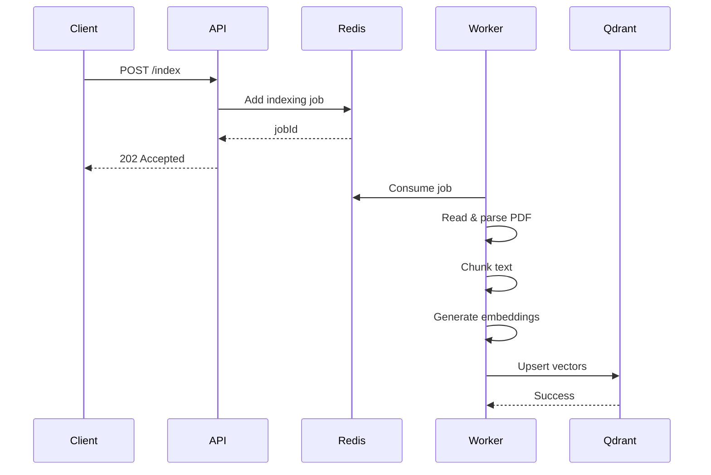
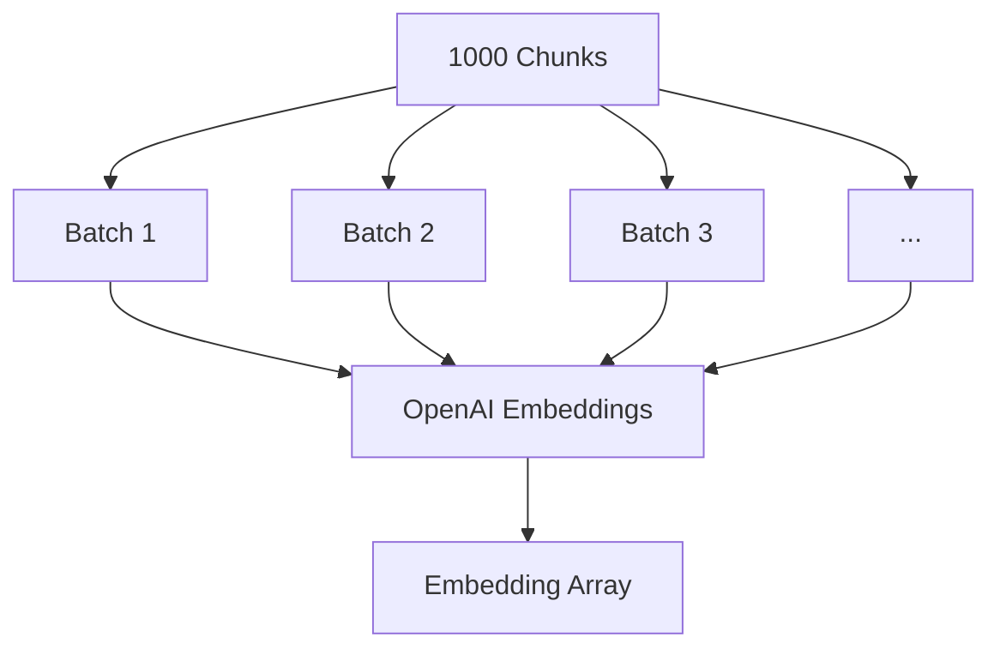
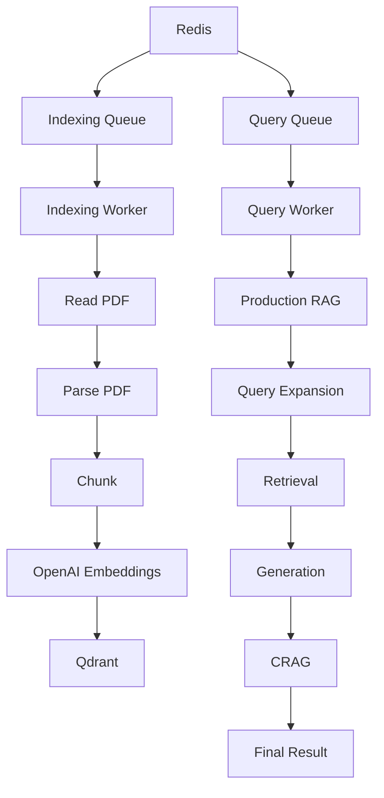
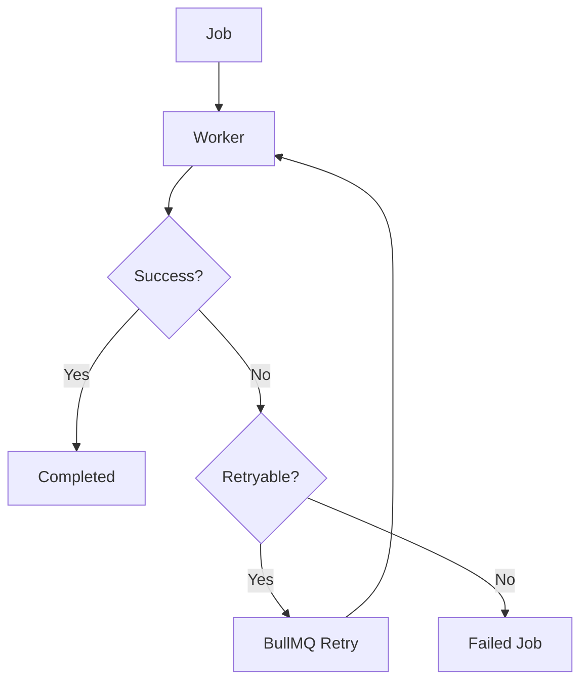
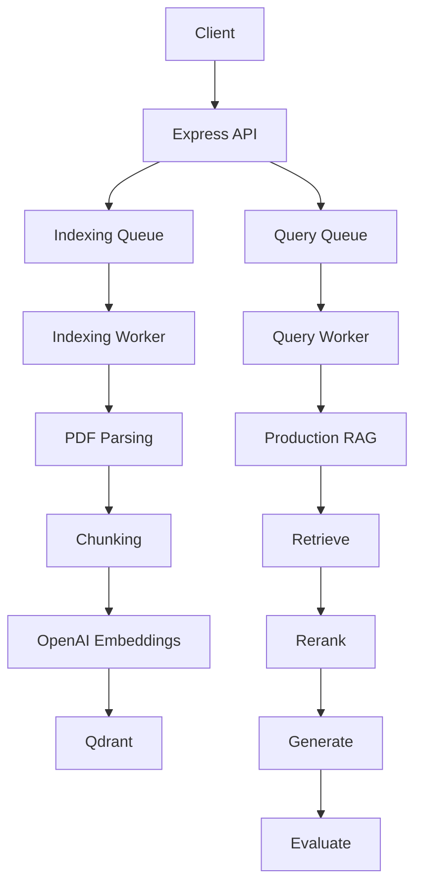
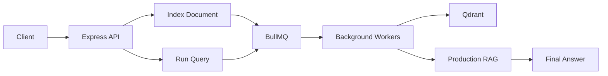

# Chapter 07 — Asynchronous Ingestion Queue & Background Worker

## 1. Chapter Goal

In the previous chapters, we built the **query-time RAG pipeline**.

Now we move to the other side of the system:

> **Document ingestion and indexing.**

Processing a large PDF can involve several expensive operations:

1. Reading the file
2. Parsing the PDF
3. Cleaning extracted text
4. Splitting text into overlapping chunks
5. Generating embeddings
6. Writing vectors to Qdrant

Doing all of this directly inside an HTTP request is a poor architecture.

For example:

```text
POST /index
      ↓
Read PDF
      ↓
Parse PDF
      ↓
Chunk
      ↓
Generate embeddings
      ↓
Upload to Qdrant
      ↓
HTTP Response
```

The client would have to wait for the entire operation.

Instead, we introduce an asynchronous queue:


The API can now respond immediately:

```text
HTTP 202 Accepted
{
  "jobId": "123"
}
```

while the worker continues processing the document in the background.

---

# 2. Why Background Processing?

Imagine a 100 MB PDF containing hundreds of pages.

The ingestion process might take several seconds or even minutes depending on:

* PDF size
* number of chunks
* embedding API latency
* Qdrant latency
* network conditions

An HTTP request should not remain open for that entire duration.

Instead:



This provides an important separation:

```text
API responsibility
    ↓
Accept request + enqueue job

Worker responsibility
    ↓
Perform expensive processing
```

---

# 3. BullMQ Queue Configuration

We already configured Redis in Chapter 01.

Now create:

```text
src/queues/indexingQueue.js
```

This module owns the queues used by our asynchronous system.

```js id="7x5p8r"
// src/queues/indexingQueue.js

import { Queue } from "bullmq";

import {
  redisConnection
} from "../db/redis.js";

import {
  INDEXING_QUEUE,
  QUERY_QUEUE
} from "../config.js";


export const indexingQueue =
  new Queue(
    INDEXING_QUEUE,
    {
      connection:
        redisConnection
    }
  );


export const queryQueue =
  new Queue(
    QUERY_QUEUE,
    {
      connection:
        redisConnection
    }
  );


/**
 * Add a document indexing job.
 */
export async function enqueueIndexingJob(
  filePath,
  originalName,
  user = {}
) {
  return indexingQueue.add(
    "index-document",

    {
      filePath,
      originalName,

      tenantId:
        user.tenantId,

      uploadedBy:
        user.id,

      accessLevel:
        user.accessLevel
    },

    {
      attempts: 3,

      backoff: {
        type: "exponential",
        delay: 2000
      },

      removeOnComplete: 100,

      removeOnFail: 500
    }
  );
}


/**
 * Add an asynchronous RAG query job.
 */
export async function enqueueQueryJob(
  userQuery,
  user
) {
  return queryQueue.add(
    "run-rag-query",

    {
      userQuery,
      user
    },

    {
      attempts: 2,

      backoff: {
        type: "exponential",
        delay: 1000
      },

      removeOnComplete: {
        age: 3600,
        count: 1000
      },

      removeOnFail: {
        age: 3600,
        count: 1000
      }
    }
  );
}
```

---

# 4. Understanding the Queue Configuration

## `Queue`

```js id="3nq6sh"
new Queue(
  INDEXING_QUEUE,
  {
    connection: redisConnection
  }
);
```

BullMQ uses Redis as its queue backend.

The queue stores information such as:

```text
job ID
job name
job payload
attempt count
status
timestamps
retry information
```

The API does not need to directly communicate with the worker.

Instead:

```text
API
 ↓
Redis
 ↓
Worker
```

---

# 5. Indexing Job Payload

The indexing job contains:

```js id="h1z3dl"
{
  filePath,
  originalName,
  tenantId,
  uploadedBy,
  accessLevel
}
```

The important addition here is tenant information.

The earlier implementation hardcoded:

```js id="pgyw0m"
tenantId: "default"
```

inside the worker.

That is acceptable for a single-user development project, but it is unsafe for a multi-tenant application.

The document's tenant ownership should come from the authenticated application context:

```text
Authenticated User
       ↓
API
       ↓
Indexing Job
       ↓
Worker
       ↓
Qdrant Metadata
```

The worker should not derive authorization from the filename or from LLM output.

---

# 6. Retry Configuration

The indexing job uses:

```js id="f2a6td"
attempts: 3
```

with:

```js id="mb0s5f"
backoff: {
  type: "exponential",
  delay: 2000
}
```

This means transient failures can be retried.

Conceptually:

```text
Attempt 1
   ↓
Failure
   ↓
Wait
   ↓
Attempt 2
   ↓
Failure
   ↓
Longer wait
   ↓
Attempt 3
```

This is useful for temporary failures such as:

* network errors
* temporary Qdrant unavailability
* transient API failures

Retries should not be used to hide permanent errors such as:

* invalid PDF
* missing file
* malformed job payload
* unsupported document format

A production worker should distinguish retryable and non-retryable errors.

---

# 7. PDF Indexing Worker

Create:

```text
src/queues/indexingWorker.js
```

The worker consumes jobs from Redis and performs the expensive ingestion pipeline.

```js id="6p6n6d"
// src/queues/indexingWorker.js

import { Worker } from "bullmq";

import fs from "node:fs/promises";
import crypto from "node:crypto";

import pdfParse from "pdf-parse/lib/pdf-parse.js";

import OpenAI from "openai";

import {
  redisConnection
} from "../db/redis.js";

import {
  INDEXING_QUEUE,
  QUERY_QUEUE,
  config
} from "../config.js";

import {
  qdrant,
  ensureCollection
} from "../db/qdrant.js";

import {
  productionRAG
} from "../rag/ragPipeline.js";


const openai =
  new OpenAI({
    apiKey:
      config.openai.apiKey
  });


/**
 * Split text into overlapping chunks
 * while attempting to preserve word boundaries.
 */
export function chunkText(
  text,
  chunkSize =
    config.chunking.chunkSize,
  overlap =
    config.chunking.chunkOverlap
) {
  const clean =
    text
      .replace(/\s+/g, " ")
      .trim();

  if (!clean) {
    return [];
  }

  if (
    overlap >= chunkSize
  ) {
    throw new Error(
      "Chunk overlap must be smaller than chunk size."
    );
  }

  const chunks = [];

  let start = 0;

  while (
    start < clean.length
  ) {
    let end =
      Math.min(
        start + chunkSize,
        clean.length
      );

    if (
      end < clean.length
    ) {
      const lastSpace =
        clean.lastIndexOf(
          " ",
          end
        );

      if (
        lastSpace > start
      ) {
        end = lastSpace;
      }
    }

    const chunk =
      clean
        .slice(start, end)
        .trim();

    if (chunk) {
      chunks.push(chunk);
    }

    if (
      end >= clean.length
    ) {
      break;
    }

    start =
      end - overlap;

    if (start < 0) {
      start = 0;
    }
  }

  return chunks;
}


/**
 * Generate embeddings in manageable batches.
 */
async function createEmbeddings(
  chunks,
  batchSize = 100
) {
  const embeddings = [];

  for (
    let start = 0;
    start < chunks.length;
    start += batchSize
  ) {
    const batch =
      chunks.slice(
        start,
        start + batchSize
      );

    const response =
      await openai.embeddings.create({
        model:
          config.openai.embeddingModel,

        input:
          batch
      });

    const sorted =
      [...response.data].sort(
        (a, b) =>
          a.index - b.index
      );

    embeddings.push(
      ...sorted.map(
        (item) =>
          item.embedding
      )
    );
  }

  return embeddings;
}


/**
 * Index a single PDF document.
 */
async function processIndexingJob(
  job
) {
  const {
    filePath,
    originalName,
    tenantId,
    uploadedBy,
    accessLevel
  } = job.data;


  // ----------------------------------------------
  // Validate job payload
  // ----------------------------------------------

  if (
    typeof filePath !== "string" ||
    !filePath
  ) {
    throw new Error(
      "Invalid indexing job: filePath is required."
    );
  }

  if (
    typeof originalName !== "string" ||
    !originalName
  ) {
    throw new Error(
      "Invalid indexing job: originalName is required."
    );
  }


  console.log(
    `📥 [Worker] Processing job ${job.id}: ${originalName}`
  );


  // ----------------------------------------------
  // Ensure Qdrant collection exists
  // ----------------------------------------------

  const collection =
    await ensureCollection();


  // ----------------------------------------------
  // Read PDF
  // ----------------------------------------------

  const buffer =
    await fs.readFile(
      filePath
    );


  // ----------------------------------------------
  // Parse PDF
  // ----------------------------------------------

  const pdfData =
    await pdfParse(
      buffer
    );


  // ----------------------------------------------
  // Chunk extracted text
  // ----------------------------------------------

  const chunks =
    chunkText(
      pdfData.text
    );


  if (
    chunks.length === 0
  ) {
    return {
      indexed: 0,

      message:
        "No extractable text found in PDF."
    };
  }


  console.log(
    `   → Extracted ${chunks.length} chunk(s)`
  );


  // ----------------------------------------------
  // Generate embeddings
  // ----------------------------------------------

  const embeddings =
    await createEmbeddings(
      chunks
    );


  // ----------------------------------------------
  // Build Qdrant points
  // ----------------------------------------------

  const points =
    chunks.map(
      (chunk, index) => ({
        id:
          crypto.randomUUID(),

        vector:
          embeddings[index],

        payload: {
          text:
            chunk,

          title:
            originalName,

          source:
            originalName,

          filePath,

          chunkIndex:
            index,

          tenantId:
            tenantId ||
            "default",

          uploadedBy:
            uploadedBy ||
            null,

          accessLevel:
            accessLevel ??
            1
        }
      })
    );


  // ----------------------------------------------
  // Store vectors
  // ----------------------------------------------

  await qdrant.upsert(
    collection,
    {
      wait: true,
      points
    }
  );


  console.log(
    `   → ${points.length} point(s) indexed into "${collection}"`
  );


  return {
    indexed:
      points.length,

    collection,

    document:
      originalName
  };
}


/**
 * BullMQ Indexing Worker
 */
export const indexingWorker =
  new Worker(
    INDEXING_QUEUE,

    async (job) => {
      return processIndexingJob(
        job
      );
    },

    {
      connection:
        redisConnection,

      concurrency: 2
    }
  );
```

---

# 8. Why Chunking Is Necessary

A PDF may contain thousands of words.

We don't want to create one enormous embedding for the entire document.

Instead:

```text
PDF
 ↓
Text
 ↓
Chunks
 ↓
Embedding per chunk
 ↓
Vector Database
```

For example:

```text
Document
  ↓
Chunk 1
Chunk 2
Chunk 3
Chunk 4
...
Chunk N
```

Each chunk becomes independently searchable.

---

# 9. Boundary-Aware Chunking

Our chunker attempts to avoid cutting words in the middle.

For example, a naive character-based split might produce:

```text
"Refund requests must be submi"
"tted within fourteen days."
```

Our implementation searches backward for a space:

```js id="v6u7z0"
const lastSpace =
  clean.lastIndexOf(
    " ",
    end
  );
```

So the split is more likely to become:

```text
"Refund requests must be"
"submitted within fourteen days."
```

This produces cleaner semantic units.

---

# 10. Why Overlap Matters

We configured:

```env id="4qgxca"
CHUNK_SIZE=1000
CHUNK_OVERLAP=200
```

That means approximately:

```text
Chunk 1
[--------------------]
        overlap
             [--------------------]
             Chunk 2
```

The overlap preserves context around chunk boundaries.

For example:

```text
Chunk 1:
"The customer can request a refund within 14 days
of the original purchase..."

Chunk 2:
"...of the original purchase. The refund must be
requested through the support portal."
```

Without overlap, important information can be split across two chunks.

---

# 11. Why Embeddings Are Generated in Batches

A large PDF might produce hundreds or thousands of chunks.

We should not blindly send every chunk in one embedding request.

Instead:

```js id="x4clbq"
createEmbeddings(
  chunks,
  100
);
```

processes them in manageable batches.

Conceptually:



The exact safe batch size should be tuned against the embedding model's current API limits, document size, token count, rate limits, and application workload.

---

# 12. Why Embedding Order Matters

The response from the embedding API contains indexed embedding records.

We explicitly sort them:

```js id="x8t2w9"
const sorted =
  [...response.data].sort(
    (a, b) =>
      a.index - b.index
  );
```

This ensures:

```text
chunks[0] → embeddings[0]
chunks[1] → embeddings[1]
chunks[2] → embeddings[2]
```

The relationship is critical because the wrong embedding assigned to a chunk would corrupt retrieval quality.

---

# 13. Building Qdrant Points

Every chunk becomes a Qdrant point:

```js id="n4v3kq"
{
  id,
  vector,
  payload
}
```

The vector contains:

```js id="e2t8l0"
vector: embeddings[index]
```

The payload contains searchable metadata:

```js id="5n3mzx"
payload: {
  text,
  title,
  source,
  filePath,
  chunkIndex,
  tenantId,
  uploadedBy,
  accessLevel
}
```

This metadata is extremely important for later retrieval.

For example:

```text
tenantId
    ↓
Tenant isolation

accessLevel
    ↓
Authorization filtering

source
    ↓
Citation / provenance

chunkIndex
    ↓
Document reconstruction / debugging
```

---

# 14. Qdrant Upsert

The points are stored using:

```js id="xw8y99"
await qdrant.upsert(
  collection,
  {
    wait: true,
    points
  }
);
```

`upsert` means:

```text
Insert if new
Update if existing
```

The `wait: true` option makes the worker wait for Qdrant to acknowledge the operation before reporting the job as completed.

This is useful for correctness because the queue should not report successful indexing before the vector-store operation has completed.

---

# 15. Query Worker

The same Redis infrastructure can also process RAG queries asynchronously.

Add the following to:

```text
src/queues/indexingWorker.js
```

```js id="7h1m9a"
/**
 * BullMQ Query Worker
 *
 * Executes the complete RAG pipeline asynchronously.
 */
export const queryWorker =
  new Worker(
    QUERY_QUEUE,

    async (job) => {
      const {
        userQuery,
        user
      } = job.data;

      if (
        typeof userQuery !== "string" ||
        !userQuery.trim()
      ) {
        throw new Error(
          "Invalid query job: userQuery is required."
        );
      }

      console.log(
        `🔎 [Worker] Processing query job ${job.id}`
      );

      return productionRAG(
        userQuery,
        user
      );
    },

    {
      connection:
        redisConnection,

      concurrency: 4
    }
  );
```

This creates two different asynchronous workloads:

```text
Redis
 ├── adv-rag-indexing
 │       ↓
 │   Indexing Worker
 │
 └── adv-rag-query
         ↓
     Query Worker
```

This separation is useful because document ingestion and user queries have different performance characteristics.

---

# 16. Worker Event Handling

Add lifecycle logging:

```js id="g3m4f2"
const workers = [
  ["indexing", indexingWorker],
  ["query", queryWorker]
];


for (
  const [name, worker]
  of workers
) {
  worker.on(
    "completed",
    (job) => {
      console.log(
        `✅ [${name}] Job ${job.id} completed`
      );
    }
  );


  worker.on(
    "failed",
    (job, error) => {
      console.error(
        `❌ [${name}] Job ${job?.id} failed:`,
        error.message
      );
    }
  );


  worker.on(
    "error",
    (error) => {
      console.error(
        `🔥 [${name}] Worker error:`,
        error
      );
    }
  );
}


console.log(
  "👷 Background workers started."
);
```

The `failed` event is useful for individual job failures.

The `error` event is important because it can indicate a worker-level problem rather than simply a failed job.

---

# 17. Complete Worker Architecture

The final worker architecture is:



This is the separation between the two major asynchronous workloads.

---

# 18. Running the Workers

The package script from Chapter 0 is:

```json
{
  "scripts": {
    "worker": "node src/queues/indexingWorker.js"
  }
}
```

Start Redis and the other infrastructure:

```bash
docker compose up -d
```

Then start the worker:

```bash
npm run worker
```

You should see something similar to:

```text
👷 Background workers started.
```

The process now waits for BullMQ jobs.

---

# 19. Testing the Indexing Queue

You can manually enqueue a job from Node:

```bash
node --input-type=module -e "
import { enqueueIndexingJob } from './src/queues/indexingQueue.js';

const job = await enqueueIndexingJob(
  './uploads/example.pdf',
  'example.pdf',
  {
    id: 'USER_123',
    tenantId: 'tenant_001',
    accessLevel: 1
  }
);

console.log({
  jobId: job.id
});
"
```

The API side only adds the job.

The worker then receives it:

```text
📥 [Worker] Processing job 1: example.pdf
   → Extracted 37 chunk(s)
   → 37 point(s) indexed into "adv_rag_documents"
✅ [indexing] Job 1 completed
```

The important thing is that the API process did not have to perform the expensive indexing work itself.

---

# 20. End-to-End Ingestion Flow

The complete ingestion process is now:


The HTTP layer and document-processing layer are now decoupled.

---

# 21. Production Considerations

## 21.1 Do not trust file paths from users

The worker currently receives:

```js
filePath
```

from the queue.

In production, this path should originate from a controlled upload subsystem.

Do not allow arbitrary user input to become a filesystem path.

Prefer:

```text
User Upload
    ↓
Validated Storage Location
    ↓
Database/File Metadata
    ↓
Queue Job
```

rather than allowing the client to submit arbitrary paths.

---

## 21.2 Temporary files need lifecycle management

After successful indexing, uploaded temporary files should usually be removed:

```text
Upload
 ↓
Temporary storage
 ↓
Indexing
 ↓
Qdrant
 ↓
Cleanup
```

Cleanup should happen carefully so that a failed job can still be retried when appropriate.

For larger systems, object storage such as S3-compatible storage is usually preferable to relying on local worker disks.

---

## 21.3 Avoid hardcoded tenant information

This is unsafe:

```js
tenantId: "default"
```

for a multi-tenant application.

Instead:

```js
tenantId:
  user.tenantId
```

should flow from authenticated application context.

Tenant information should then be stored with the Qdrant point and used during retrieval filtering.

---

## 21.4 Idempotency matters

Suppose the worker successfully indexes a document but crashes before the job is acknowledged.

BullMQ may retry the job.

If every chunk uses:

```js
crypto.randomUUID()
```

the same document could produce completely new point IDs on retry.

That can create duplicate vectors.

A stronger production design uses deterministic identifiers such as:

```text
hash(documentId + chunkIndex)
```

or another stable document/chunk identity.

For example:

```text
document_123:chunk_0
document_123:chunk_1
document_123:chunk_2
```

This makes retries naturally idempotent.

---

# 22. Concurrency Is a Capacity Control

The indexing worker uses:

```js
concurrency: 2
```

while the query worker uses:

```js
concurrency: 4
```

This does not mean:

> "2 is always the correct production value."

It means:

> "At most this many jobs are actively processed concurrently by this worker instance."

The optimal values depend on:

* CPU
* memory
* network bandwidth
* OpenAI rate limits
* Qdrant throughput
* average PDF size
* expected traffic

If the system receives many large PDFs, increasing concurrency blindly may make the system slower or cause rate-limit failures.

---

# 23. Separate Workers in Production

For development, keeping both workers in one file is convenient.

For production, consider separate processes:

```text
API Container
     │
     ├── Indexing Worker Container
     │
     └── Query Worker Container
```

This allows independent scaling.

For example:

```text
Heavy document ingestion
        ↓
Scale indexing workers

High user query traffic
        ↓
Scale query workers
```

This is one of the major benefits of asynchronous architecture.

---

# 24. Failure Handling

The desired behavior is:



Examples of retryable errors:

```text
Network timeout
Temporary API failure
Temporary Qdrant failure
```

Examples of potentially non-retryable errors:

```text
Missing file
Invalid PDF
Malformed job payload
Unsupported document
```

A mature implementation can introduce explicit error classes:

```js
class NonRetryableError extends Error {}
```

and configure worker behavior accordingly.

---

# 25. Important Architectural Principle

The asynchronous ingestion pipeline creates a clean boundary:

```text
                Application
                     │
                     ▼
              Upload / API
                     │
                     ▼
               BullMQ Queue
                     │
                     ▼
             Background Worker
                     │
          ┌──────────┼──────────┐
          ▼          ▼          ▼
        Parse      Embed      Store
          │          │          │
          └──────────┼──────────┘
                     ▼
                  Qdrant
```

The API does not need to understand how embeddings are generated.

The worker does not need to know how the frontend works.

The vector database does not need to know about HTTP requests.

Each component has a focused responsibility.

---

# 26. Chapter Summary

In this chapter, we implemented the asynchronous ingestion architecture.

### `indexingQueue`

Creates BullMQ jobs for document ingestion.

### `queryQueue`

Provides asynchronous execution for RAG queries.

### `chunkText()`

Splits large documents into overlapping, word-aware chunks.

### `createEmbeddings()`

Generates embeddings in manageable batches.

### `indexingWorker`

Processes PDFs in the background and stores vector points in Qdrant.

### `queryWorker`

Executes the complete `productionRAG()` pipeline asynchronously.

The architecture now looks like:



We now have both sides of the system:

```text
                 Production RAG
                      │
          ┌───────────┴───────────┐
          │                       │
      Ingestion                 Query
          │                       │
       BullMQ                  BullMQ
          │                       │
       Worker                  Worker
          │                       │
       Qdrant              RAG Pipeline
```

This is the foundation for scaling the system beyond a simple synchronous prototype.

---

# 27. Next Chapter

In **Chapter 08 — Express REST API & Terminal CLI Shell**, we will expose the system to actual clients.

We will build endpoints for:

```text
POST /index
POST /query
GET  /jobs/:jobId
```

and an interactive CLI for testing the complete system without requiring a frontend.

The final application flow will become:



At that point, our RAG system will no longer just be a collection of modules—it will be a usable backend application.

