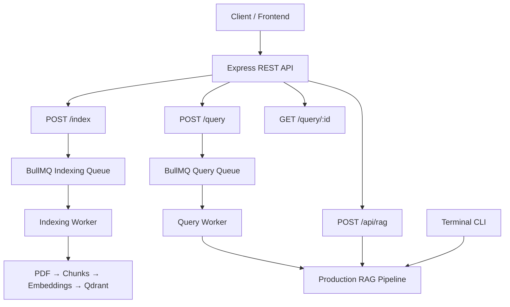
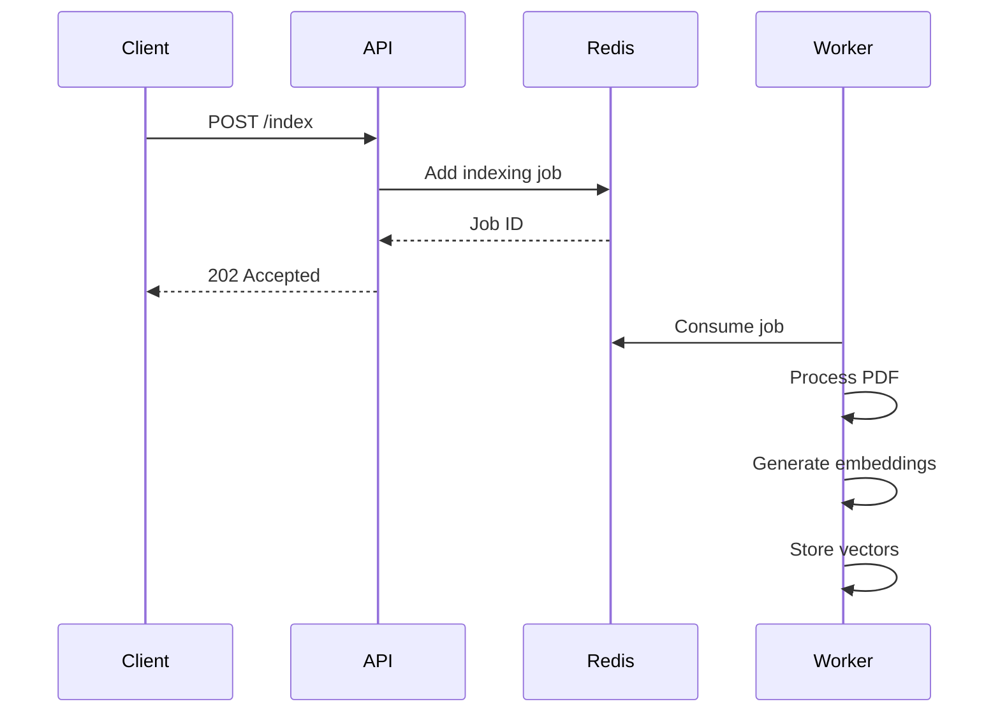
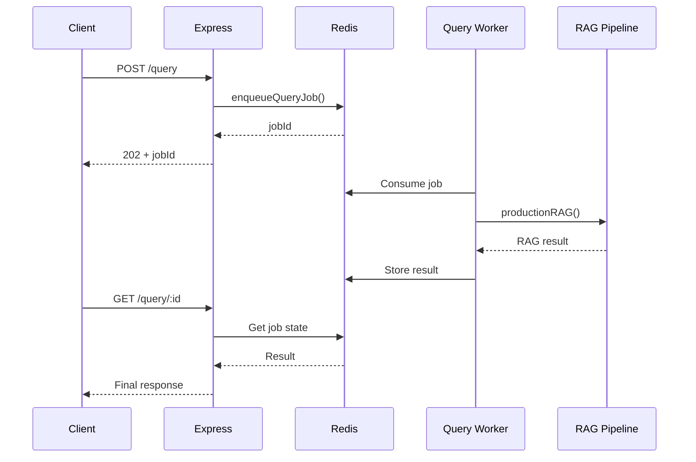
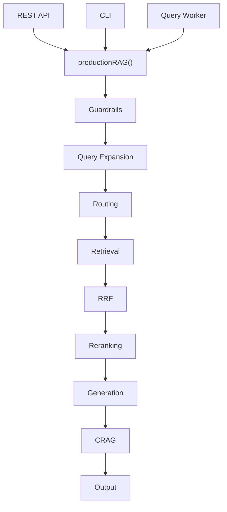
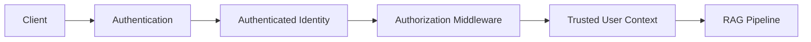
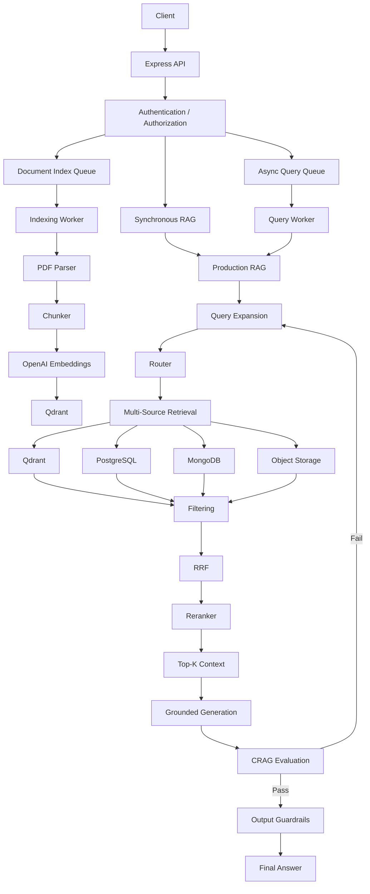
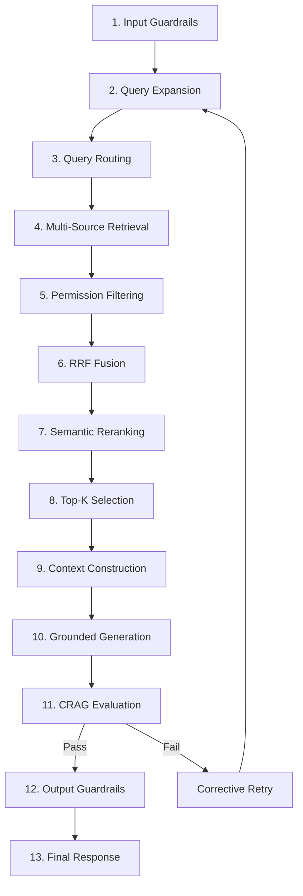
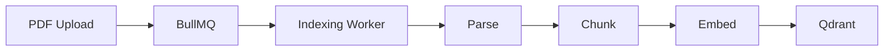
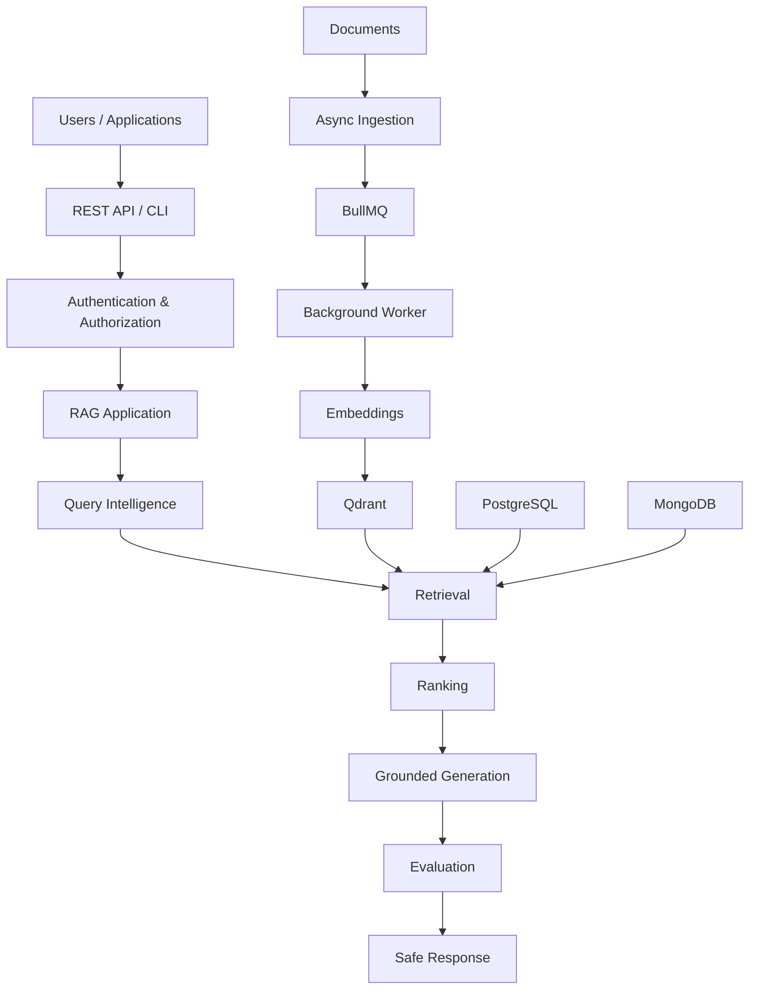

# Chapter 08 — Express REST API & Terminal CLI Shell

## 1. Chapter Goal

We have now built the core components of our Production-Grade Advanced RAG system:

* Multi-source database adapters
* Security guardrails
* Query expansion
* Query routing
* Vector retrieval
* RRF fusion
* Semantic reranking
* Context construction
* Grounded generation
* CRAG evaluation
* Asynchronous document ingestion
* BullMQ workers

The final step is to expose these capabilities through usable application interfaces.

In this chapter, we will build two interfaces:

### 1. Express REST API

The HTTP API will support:

```text
GET  /health
POST /api/rag
POST /index
POST /query
GET  /query/:id
```

### 2. Terminal CLI

The CLI allows developers to execute the complete RAG pipeline directly from the terminal.

The final application architecture becomes:



---

# 2. Express REST Server

Create:

```text id="9q4x0s"
src/index.js
```

The Express server acts as the application's HTTP boundary.

It should be responsible for:

```text
HTTP Request
    ↓
Validate Request
    ↓
Authenticate User
    ↓
Call Application Service / Queue
    ↓
HTTP Response
```

It should **not** contain the actual PDF parsing, embedding, retrieval, or generation logic.

That work belongs to the appropriate service or worker.

---

# 3. Complete Express Server

```js id="7x0v5p"
// src/index.js

import express from "express";
import multer from "multer";

import path from "node:path";
import fs from "node:fs";

import crypto from "node:crypto";
import { fileURLToPath } from "node:url";

import { config } from "./config.js";

import {
  productionRAG
} from "./rag/ragPipeline.js";

import {
  enqueueIndexingJob,
  enqueueQueryJob,
  queryQueue
} from "./queues/indexingQueue.js";


const __dirname =
  path.dirname(
    fileURLToPath(
      import.meta.url
    )
  );


const uploadDir =
  path.join(
    __dirname,
    "..",
    "uploads"
  );


// --------------------------------------------------
// Upload Directory
// --------------------------------------------------

fs.mkdirSync(
  uploadDir,
  {
    recursive: true
  }
);


// --------------------------------------------------
// Multer Storage
// --------------------------------------------------

const storage =
  multer.diskStorage({

    destination:
      (_req, _file, cb) => {
        cb(
          null,
          uploadDir
        );
      },


    filename:
      (_req, file, cb) => {

        const unique =
          `${Date.now()}-${crypto
            .randomUUID()
            .slice(0, 8)}`;

        const extension =
          path
            .extname(
              file.originalname
            )
            .toLowerCase();

        cb(
          null,
          `${unique}${extension}`
        );
      }
  });


// --------------------------------------------------
// Multer Upload Middleware
// --------------------------------------------------

const upload =
  multer({

    storage,

    limits: {
      fileSize:
        25 * 1024 * 1024
    },

    fileFilter:
      (_req, file, cb) => {

        if (
          file.mimetype ===
          "application/pdf"
        ) {
          return cb(
            null,
            true
          );
        }

        cb(
          new Error(
            "Only PDF files are supported."
          )
        );
      }
  });


// --------------------------------------------------
// Express Application
// --------------------------------------------------

const app =
  express();

app.use(
  express.json({
    limit: "1mb"
  })
);


// --------------------------------------------------
// Health Check
// --------------------------------------------------

app.get(
  "/health",
  (_req, res) => {

    res.json({
      status: "ok",

      service:
        "Production Advanced RAG System"
    });
  }
);


// --------------------------------------------------
// Synchronous RAG Query
// --------------------------------------------------

app.post(
  "/api/rag",

  async (req, res) => {

    const userQuery =
      req.body?.query;


    if (
      typeof userQuery !==
        "string" ||
      !userQuery.trim()
    ) {

      return res
        .status(400)
        .json({
          error:
            "Body must include a non-empty 'query' string."
        });
    }


    try {

      /*
       * Development-only user context.
       *
       * In production this must come
       * from authentication middleware.
       */
      const user = {
        id:
          "USER_123",

        tenantId:
          "default",

        accessLevel:
          1
      };


      const result =
        await productionRAG(
          userQuery,
          user
        );


      return res.json(
        result
      );

    } catch (error) {

      console.error(
        "❌ API RAG Error:",
        error
      );


      return res
        .status(500)
        .json({
          error:
            "Failed to process RAG request."
        });
    }
  }
);


// --------------------------------------------------
// Asynchronous Document Indexing
// --------------------------------------------------

app.post(
  "/index",

  upload.single("file"),

  async (req, res) => {

    if (!req.file) {

      return res
        .status(400)
        .json({
          error:
            "No PDF file uploaded. Use multipart field 'file'."
        });
    }


    try {

      /*
       * Development-only user context.
       *
       * In production this must come
       * from authentication middleware.
       */
      const user = {
        id:
          "USER_123",

        tenantId:
          "default",

        accessLevel:
          1
      };


      const job =
        await enqueueIndexingJob(
          req.file.path,

          req.file.originalname,

          user
        );


      return res
        .status(202)
        .json({

          message:
            "File uploaded and queued for asynchronous indexing.",

          jobId:
            job.id,

          file: {
            originalName:
              req.file.originalname,

            size:
              req.file.size
          }
        });

    } catch (error) {

      console.error(
        "❌ Failed to enqueue indexing job:",
        error
      );


      return res
        .status(500)
        .json({
          error:
            "Failed to queue indexing job."
        });
    }
  }
);


// --------------------------------------------------
// Asynchronous RAG Query
// --------------------------------------------------

app.post(
  "/query",

  async (req, res) => {

    const userQuery =
      req.body?.query;


    if (
      typeof userQuery !==
        "string" ||
      !userQuery.trim()
    ) {

      return res
        .status(400)
        .json({
          error:
            "Body must include a non-empty 'query' string."
        });
    }


    try {

      /*
       * Development-only user context.
       *
       * Production systems should obtain
       * this from authenticated identity.
       */
      const user = {
        id:
          "USER_123",

        tenantId:
          "default",

        accessLevel:
          1
      };


      const job =
        await enqueueQueryJob(
          userQuery,
          user
        );


      return res
        .status(202)
        .json({

          message:
            "RAG query queued for background execution.",

          jobId:
            job.id,

          poll:
            `/query/${job.id}`
        });

    } catch (error) {

      console.error(
        "❌ Failed to enqueue query job:",
        error
      );


      return res
        .status(500)
        .json({
          error:
            "Failed to queue RAG query."
        });
    }
  }
);


// --------------------------------------------------
// Query Job Polling
// --------------------------------------------------

app.get(
  "/query/:id",

  async (req, res) => {

    try {

      const job =
        await queryQueue.getJob(
          req.params.id
        );


      if (!job) {

        return res
          .status(404)
          .json({
            error:
              "Query job not found."
          });
      }


      const state =
        await job.getState();


      // --------------------------------------------
      // Completed
      // --------------------------------------------

      if (
        state ===
        "completed"
      ) {

        return res.json({

          jobId:
            job.id,

          status:
            state,

          result:
            job.returnvalue
        });
      }


      // --------------------------------------------
      // Failed
      // --------------------------------------------

      if (
        state ===
        "failed"
      ) {

        return res.json({

          jobId:
            job.id,

          status:
            state,

          error:
            job.failedReason
        });
      }


      // --------------------------------------------
      // Waiting / Active / Delayed
      // --------------------------------------------

      return res.json({

        jobId:
          job.id,

        status:
          state
      });

    } catch (error) {

      console.error(
        "❌ Failed to fetch query job:",
        error
      );


      return res
        .status(500)
        .json({
          error:
            "Failed to fetch query status."
        });
    }
  }
);


// --------------------------------------------------
// Multer / Application Error Handler
// --------------------------------------------------

app.use(
  (error, _req, res, _next) => {

    console.error(
      "❌ HTTP Error:",
      error.message
    );


    if (
      error.code ===
      "LIMIT_FILE_SIZE"
    ) {

      return res
        .status(413)
        .json({
          error:
            "PDF file exceeds the 25 MB limit."
        });
    }


    if (
      error.message ===
      "Only PDF files are supported."
    ) {

      return res
        .status(400)
        .json({
          error:
            error.message
        });
    }


    return res
      .status(500)
      .json({
        error:
          "Internal server error."
      });
  }
);


// --------------------------------------------------
// Start Server
// --------------------------------------------------

const PORT =
  config.server.port;


app.listen(
  PORT,
  () => {

    console.log(
      `\n🚀 Advanced RAG API running on http://localhost:${PORT}`
    );
  }
);
```

---

# 4. Important Configuration Correction

The Chapter 0 configuration contains:

```js id="x3b4v2"
server: {
  port: ...
}
```

Therefore the server must use:

```js id="3v1c8p"
config.server.port
```

and **not**:

```js id="u2p6y0"
config.port
```

This is a small detail, but configuration naming should remain consistent throughout the application.

---

# 5. Health Check

The endpoint:

```http
GET /health
```

returns:

```json id="o6gk7h"
{
  "status": "ok",
  "service": "Production Advanced RAG System"
}
```

Test it with:

```bash id="y8h7ps"
curl http://localhost:8000/health
```

A health endpoint is useful for:

* Docker
* Kubernetes
* load balancers
* monitoring systems
* deployment checks

A more advanced production system would eventually distinguish:

```text
Liveness
Readiness
Dependency health
```

For example, a service might be alive while Redis or Qdrant is unavailable.

---

# 6. Synchronous RAG Endpoint

The endpoint:

```http
POST /api/rag
```

accepts:

```json id="x9m8j2"
{
  "query": "What is my subscription plan?"
}
```

The API calls:

```js id="e5sp8m"
productionRAG(
  userQuery,
  user
);
```

The important architectural point is that the HTTP layer does not know how RAG works internally.

It simply calls the application-level interface:

```text id="m7gq6a"
HTTP Request
     ↓
productionRAG()
     ↓
13-step RAG Pipeline
     ↓
HTTP Response
```

---

# 7. Asynchronous Document Indexing

The document endpoint is:

```http
POST /index
```

The request uses:

```text id="a4v7z2"
multipart/form-data
```

with the field:

```text id="j2p5r8"
file
```

For example:

```bash id="7z3v1k"
curl -X POST \
  http://localhost:8000/index \
  -F "file=@./uploads/example.pdf"
```

The API does **not** parse the PDF.

Instead:

```text id="v1l3r7"
PDF
 ↓
Multer
 ↓
Temporary File
 ↓
BullMQ
 ↓
Redis
 ↓
Indexing Worker
```

The endpoint immediately returns:

```json id="b7x5k4"
{
  "message": "File uploaded and queued for asynchronous indexing.",
  "jobId": "12",
  "file": {
    "originalName": "example.pdf",
    "size": 183420
  }
}
```

The HTTP status is:

```http
202 Accepted
```

because the request has been accepted but processing is not yet complete.

---

# 8. Why HTTP 202?

There is an important difference between:

```http
200 OK
```

and:

```http
202 Accepted
```

`200` generally means the requested operation has completed successfully.

`202` is appropriate when:

> The request has been accepted for processing, but the operation will complete asynchronously.

Our architecture therefore becomes:



---

# 9. Asynchronous RAG Query Endpoint

The endpoint:

```http
POST /query
```

accepts:

```json id="d8x3q1"
{
  "query": "What is my refund policy?"
}
```

Instead of running:

```js id="3f7c9w"
productionRAG(...)
```

inside the HTTP request, it creates a BullMQ job:

```js id="g7r9q4"
await enqueueQueryJob(
  userQuery,
  user
);
```

The response is:

```json id="k3w8x5"
{
  "message": "RAG query queued for background execution.",
  "jobId": "27",
  "poll": "/query/27"
}
```

The client can then poll the job.

---

# 10. Polling the Query Job

The endpoint:

```http
GET /query/:id
```

retrieves the BullMQ job.

For example:

```bash id="h7v2s9"
curl http://localhost:8000/query/27
```

While processing:

```json id="r2d5k8"
{
  "jobId": "27",
  "status": "active"
}
```

or:

```json id="s8m4q1"
{
  "jobId": "27",
  "status": "waiting"
}
```

After completion:

```json id="z6p1w4"
{
  "jobId": "27",
  "status": "completed",
  "result": {
    "success": true,
    "answer": "Your refund is available within 14 days. [SOURCE 1]",
    "score": 8,
    "attempts": 1,
    "sources": []
  }
}
```

If the worker fails:

```json id="v5x9n2"
{
  "jobId": "27",
  "status": "failed",
  "error": "..."
}
```

---

# 11. Polling Architecture

The asynchronous query architecture is:



This pattern is particularly useful when RAG queries may involve:

* many retrieval sources
* multiple LLM calls
* query expansion
* reranking
* CRAG retries
* slow external services

---

# 12. Terminal CLI

Create:

```text id="m5q9x1"
src/cli.js
```

The CLI provides a simple development interface to the same `productionRAG()` application service.

```js id="3c7v9n"
// src/cli.js

import {
  productionRAG
} from "./rag/ragPipeline.js";


async function main() {

  const args =
    process.argv.slice(2);


  const query =
    args.join(" ").trim() ||
    "What is my current account balance and refund policy?";


  console.log(
    "⚡ Production Advanced RAG Console CLI ⚡\n"
  );


  console.log(
    `User Query: "${query}"\n`
  );


  const user = {
    id:
      "USER_123",

    tenantId:
      "default",

    accessLevel:
      1
  };


  try {

    const result =
      await productionRAG(
        query,
        user
      );


    console.log(
      "\n=================================================="
    );

    console.log(
      "🎯 FINAL ANSWER"
    );

    console.log(
      "==================================================\n"
    );


    console.log(
      result.answer
    );


    console.log(
      "\n--------------------------------------------------"
    );


    console.log(
      `Quality Score: ${
        result.score ?? 0
      }/10`
    );


    console.log(
      `Success: ${
        result.success
      }`
    );


    console.log(
      `Attempts: ${
        result.attempts ?? 0
      }`
    );


    console.log(
      "\nSources Used:"
    );


    console.dir(
      result.sources ?? [],
      {
        depth: null
      }
    );


    console.log(
      "--------------------------------------------------\n"
    );

  } catch (error) {

    console.error(
      "❌ CLI RAG Error:",
      error.message
    );

    process.exitCode = 1;
  }
}


main();
```

---

# 13. Why `args.join(" ")`?

A basic CLI implementation might use:

```js id="j5n8w2"
const query = args[0];
```

But then:

```bash id="q3k7p1"
node src/cli.js What is my refund policy?
```

would only capture:

```text
What
```

Using:

```js id="f4s6y8"
const query =
  args.join(" ").trim();
```

captures the complete command-line query:

```text
What is my refund policy?
```

This makes the CLI much more natural to use.

---

# 14. Running the CLI

Use:

```bash id="e7p4k2"
node src/cli.js "What is my subscription plan?"
```

Or:

```bash id="r9x3m5"
npm run cli -- "What is my subscription plan?"
```

The expected flow is:

```text id="w6z8q1"
⚡ Production Advanced RAG Console CLI ⚡

User Query: "What is my subscription plan?"

🚀 Starting Production RAG Pipeline

...

🎯 FINAL ANSWER

Your current subscription plan is Pro. [SOURCE 1]

--------------------------------------------------
Quality Score: 8/10
Success: true
Attempts: 1

Sources Used:
...
```

---

# 15. CLI and REST API Share the Same Core

This is an important architectural property.

The CLI calls:

```js id="v8x2p5"
productionRAG()
```

The REST API also calls:

```js id="n3k7q9"
productionRAG()
```

The asynchronous query worker calls:

```js id="c4m8s1"
productionRAG()
```

Therefore:



This is much better than implementing separate RAG logic for every interface.

---

# 16. Complete API Testing

## Health Check

```bash id="f5m2r7"
curl http://localhost:8000/health
```

Expected:

```json id="h4x8n1"
{
  "status": "ok",
  "service": "Production Advanced RAG System"
}
```

---

## Synchronous Query

```bash id="q8v3m6"
curl -X POST \
  http://localhost:8000/api/rag \
  -H "Content-Type: application/json" \
  -d '{
    "query": "What is the status of my subscription?"
  }'
```

The server waits for the complete RAG pipeline and returns the result.

---

## Upload PDF

```bash id="z6p9k3"
curl -X POST \
  http://localhost:8000/index \
  -F "file=@./uploads/example.pdf"
```

Expected:

```json id="b2w7x4"
{
  "message": "File uploaded and queued for asynchronous indexing.",
  "jobId": "1",
  "file": {
    "originalName": "example.pdf",
    "size": 183420
  }
}
```

---

## Queue Asynchronous Query

```bash id="m9c5r2"
curl -X POST \
  http://localhost:8000/query \
  -H "Content-Type: application/json" \
  -d '{
    "query": "What is my refund policy?"
  }'
```

Expected:

```json id="k7n3v8"
{
  "message": "RAG query queued for background execution.",
  "jobId": "2",
  "poll": "/query/2"
}
```

---

## Poll Query

```bash id="x4p8m1"
curl http://localhost:8000/query/2
```

Initially:

```json id="n6q2s7"
{
  "jobId": "2",
  "status": "active"
}
```

Later:

```json id="r8v3k5"
{
  "jobId": "2",
  "status": "completed",
  "result": {
    "success": true,
    "answer": "...",
    "score": 8,
    "attempts": 1,
    "sources": []
  }
}
```

---

# 17. Running the Complete System

At this stage, multiple processes are involved.

### 1. Start infrastructure

```bash id="c9m2x5"
docker compose up -d
```

### 2. Start the API

```bash id="w5q7n1"
npm run dev
```

### 3. Start background workers

In another terminal:

```bash id="p3v8k6"
npm run worker
```

### 4. Test the API

```bash id="a7m4r9"
curl http://localhost:8000/health
```

The architecture is now:

```text id="e2k7w4"
Terminal 1
    │
    └── Express API

Terminal 2
    │
    └── BullMQ Workers

Docker
    │
    ├── Redis
    ├── Qdrant
    ├── PostgreSQL
    └── MongoDB
```

---

# 18. Important Security Consideration

The examples use:

```js id="k4m8s2"
{
  id: "USER_123",
  tenantId: "default",
  accessLevel: 1
}
```

This is only for development.

A production API must **not** trust:

```json id="q7x2p4"
{
  "user": {
    "tenantId": "another-tenant",
    "accessLevel": 999
  }
}
```

from the client.

Otherwise a malicious client could attempt to change its own authorization context.

The correct architecture is:



The client provides credentials/session information.

The server derives:

```text
userId
tenantId
roles
permissions
accessLevel
```

from trusted authentication and authorization systems.

The values should then be passed to the RAG pipeline.

---

# 19. API Layer Responsibilities

The Express layer should remain relatively thin.

### API should handle

```text
Request parsing
Validation
Authentication
Authorization
File upload
Queue submission
Job polling
HTTP responses
Error mapping
```

### API should not handle

```text
PDF parsing
Chunking
Embedding generation
Qdrant indexing
RRF
Reranking
CRAG evaluation
Complex LLM orchestration
```

Those responsibilities belong to dedicated application services and workers.

This separation keeps the API maintainable.

---

# 20. Production Architecture

The complete system we've built can now be represented as:



---

# 21. What We Have Built

The implementation guide has now covered the major layers of the system.

## Infrastructure

```text
Qdrant
Redis
PostgreSQL
MongoDB
```

## Security

```text
Input Guardrails
Prompt Injection Detection
PII Masking
Output Guardrails
Tenant / Access Filtering
```

## Query Intelligence

```text
Query Rewrite
Step-Back
Sub-Query Decomposition
HyDE
Query Routing
```

## Retrieval

```text
Vector Search
Multi-Source Retrieval
RRF
Semantic Reranking
Top-K Selection
```

## Generation

```text
Context Builder
Grounded Answer Generation
CRAG Evaluation
Corrective Retry
```

## Asynchronous Processing

```text
BullMQ
Redis
Indexing Worker
Query Worker
```

## Application Interfaces

```text
Express REST API
Terminal CLI
```

---

# 22. Final 13-Step RAG Pipeline

The logical query-time pipeline can now be summarized as:



The **asynchronous ingestion system** operates alongside this query pipeline:



These two flows together form the complete RAG application.

---

# 23. Final Guide Conclusion

Congratulations! 🎉

You have completed the **Production-Grade Advanced RAG System Implementation Guide**.

Starting from a simple question-answering concept, you built a multi-stage architecture capable of handling:

### 1. Multi-source data

Qdrant, PostgreSQL, MongoDB, Redis, and object-storage abstractions.

### 2. Security

Prompt-injection detection, PII protection, output guardrails, tenant isolation, and access filtering.

### 3. Advanced query understanding

Query rewriting, Step-Back prompting, sub-query decomposition, and HyDE.

### 4. Intelligent routing

Queries can be directed toward the appropriate data source instead of blindly searching one database.

### 5. Advanced retrieval

Vector search, multi-source retrieval, RRF fusion, and semantic reranking.

### 6. Grounded generation

The LLM generates responses from retrieved evidence rather than relying purely on its pretrained knowledge.

### 7. Corrective evaluation

CRAG-style evaluation detects weak answers and allows bounded corrective retrieval attempts.

### 8. Asynchronous ingestion

BullMQ and Redis allow expensive PDF processing to happen outside the HTTP request lifecycle.

### 9. Background workers

Dedicated workers handle document indexing and asynchronous RAG queries.

### 10. Application interfaces

Express REST endpoints and a terminal CLI provide practical ways to interact with the system.

The complete high-level architecture is:



The most important lesson from this project is not any individual library.

It is the architecture:

> **Separate responsibilities, protect every trust boundary, retrieve evidence before generating answers, evaluate generated output, and move expensive work to asynchronous workers.**

That is what transforms a basic LLM + vector database prototype into a much more production-oriented RAG architecture.

**One final implementation note:** before deploying this beyond local development, the next hardening steps should be **real authentication/authorization, deterministic Qdrant chunk IDs for idempotent ingestion, persistent document/job metadata, object storage for uploads, rate limiting, observability, and proper retry/error classification**. Those are the main gaps between this learning implementation and a genuinely production deployment.
