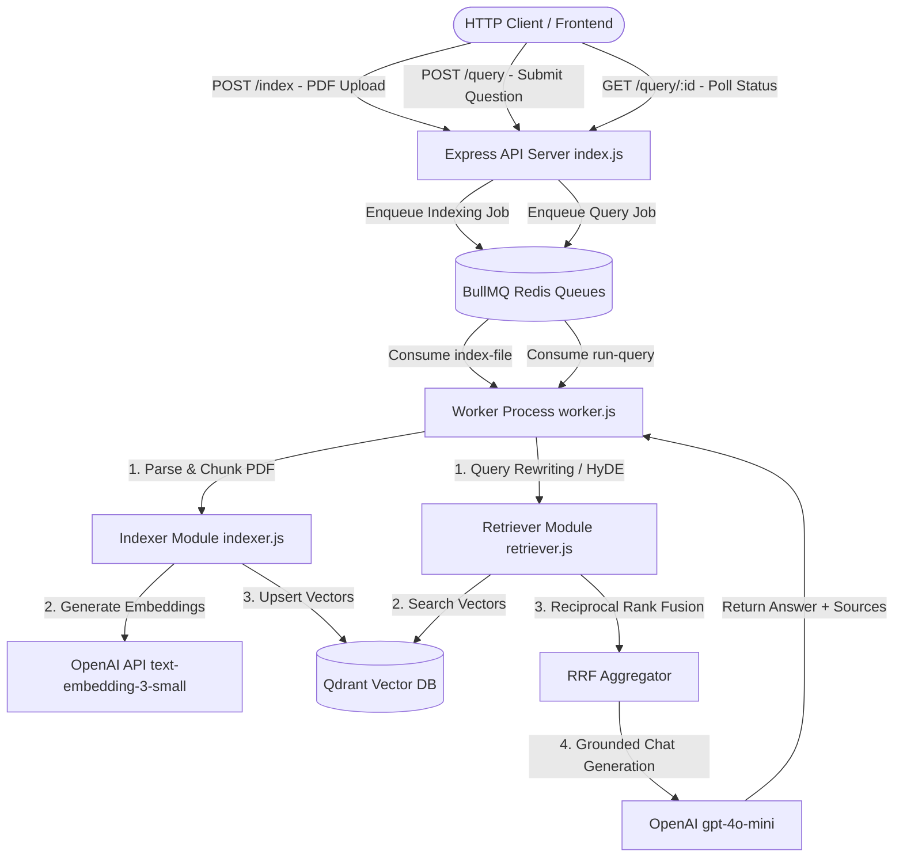

# 🚀 Advanced RAG Pipeline: Comprehensive Step-by-Step Code Explanation

This document provides a detailed, step-by-step technical explanation of the **Advanced Retrieval-Augmented Generation (RAG) Pipeline** in [`week03/learning/day05/code/advance-rag-pipeline-sir/`](file:///home/aminul/development/gen-ai-cohort/week03/learning/day05/code/advance-rag-pipeline-sir/).

---

## 📌 Architectural Overview & Key Capabilities

This codebase implements a **Production-Grade Asynchronous Advanced RAG System** designed for scalability, accuracy, and background document indexing.

### 🔑 Key Features
1. **Asynchronous PDF Indexing**: Uploaded PDFs are parsed, split into overlapping chunks, vectorized via OpenAI embeddings, and indexed into the **Qdrant Vector Database** asynchronously using **BullMQ & Redis**.
2. **Advanced Multi-Query Retrieval Strategies**:
   - **Query Rewriting**: Fixes typos, grammar, and removes ambiguous references.
   - **Step-Back Prompting**: Generates a higher-level, broader question to retrieve general background context.
   - **Sub-Query Decomposition**: Decomposes complex queries into 3 focused sub-questions.
   - **HyDE (Hypothetical Document Embeddings)**: Generates a hypothetical reference passage answering the query to improve vector domain similarity matching.
3. **Reciprocal Rank Fusion (RRF)**: Merges ranked retrieval lists from all query variants using the formula \(RRF(d) = \sum \frac{1}{k + r(d)}\) to surface the most relevant chunks.
4. **Asynchronous Polling Query Architecture**: Clients submit queries to `/query`, receive a `jobId`, and poll `/query/:id` for completed RAG responses grounded strictly in the retrieved documents.

---

## 🏗️ System Architecture Diagram



---

## 📁 File Structure

```text
week03/learning/day05/code/advance-rag-pipeline-sir/
├── docker-compose.yml     # Infrastructure setup (Qdrant & Redis containers)
├── package.json           # Dependencies and run scripts
├── explanitions code.md   # Step-by-step code explanation document
└── src/
    ├── config.js          # Environment configuration & constants
    ├── index.js           # Express REST API server & Multer file uploader
    ├── indexer.js         # PDF parser, text chunking & vector indexing pipeline
    ├── openai.js          # OpenAI client wrapper for embeddings & chat
    ├── qdrant.js          # Qdrant client connection & collection setup
    ├── queue.js           # BullMQ queue creation and job enqueuers
    ├── retriever.js       # Query expansion (Rewriting, Step-Back, HyDE, RRF) & RAG pipeline
    └── worker.js          # Asynchronous job processor worker
```

---

## 🛠️ Step-by-Step Code Walkthrough

---

### Step 1: Central Configuration (`src/config.js`)

[`src/config.js`](file:///home/aminul/development/gen-ai-cohort/week03/learning/day05/code/advance-rag-pipeline-sir/src/config.js) loads `.env` variables and establishes application constants.

```javascript
import "dotenv/config";

export const config = {
  port: Number(process.env.PORT) || 8000,
  redis: {
    host: process.env.REDIS_HOST || "127.0.0.1",
    port: Number(process.env.REDIS_PORT) || 6379,
  },
  qdrant: {
    url: process.env.QDRANT_URL || "http://127.0.0.1:6333",
    collection: process.env.QDRANT_COLLECTION || "documents",
  },
  openai: {
    apiKey: process.env.OPENAI_API_KEY,
    embeddingModel: process.env.EMBEDDING_MODEL || "text-embedding-3-small",
    embeddingDimensions: Number(process.env.EMBEDDING_DIMENSIONS) || 1536,
    chatModel: process.env.CHAT_MODEL || "gpt-4o-mini",
  },
  chunking: {
    chunkSize: Number(process.env.CHUNK_SIZE) || 1000,
    chunkOverlap: Number(process.env.CHUNK_OVERLAP) || 200,
  },
  retrieval: {
    topK: Number(process.env.RETRIEVAL_TOP_K) || 4,   // per-variant candidates
    rrfK: Number(process.env.RRF_K) || 60,             // RRF fusion constant
    finalK: Number(process.env.RETRIEVAL_FINAL_K) || 5,// final documents kept
  },
};

export const INDEXING_QUEUE = "file-indexing";
export const QUERY_QUEUE = "query";
```

---

### Step 2: Vector Database Initialization (`src/qdrant.js`)

[`src/qdrant.js`](file:///home/aminul/development/gen-ai-cohort/week03/learning/day05/code/advance-rag-pipeline-sir/src/qdrant.js) connects to Qdrant REST service and verifies collection setup:

```javascript
import { QdrantClient } from "@qdrant/js-client-rest";
import { config } from "./config.js";

export const qdrant = new QdrantClient({ url: config.qdrant.url });

export async function ensureCollection() {
  const name = config.qdrant.collection;
  const exists = await qdrant.collectionExists(name);

  if (!exists.exists) {
    try {
      await qdrant.createCollection(name, {
        vectors: {
          size: config.openai.embeddingDimensions, // 1536 dimensions for text-embedding-3-small
          distance: "Cosine",
        },
      });
      console.log(`🗂️  Created Qdrant collection "${name}"`);
    } catch (err) {
      // Handle race condition if concurrent worker created it
      const stillMissing = !(await qdrant.collectionExists(name)).exists;
      if (stillMissing) throw err;
    }
  }

  return name;
}
```

---

### Step 3: OpenAI Client & Vector Embeddings (`src/openai.js`)

[`src/openai.js`](file:///home/aminul/development/gen-ai-cohort/week03/learning/day05/code/advance-rag-pipeline-sir/src/openai.js) provides unified helper functions for vector embeddings:

```javascript
import OpenAI from "openai";
import { config } from "./config.js";

export const openai = new OpenAI({ apiKey: config.openai.apiKey });

/** Generate single embedding vector */
export async function embedText(text) {
  const res = await openai.embeddings.create({
    model: config.openai.embeddingModel,
    input: text,
  });
  return res.data[0].embedding;
}

/** Generate batch embeddings */
export async function embedTexts(texts, batchSize = 100) {
  const vectors = [];
  for (let i = 0; i < texts.length; i += batchSize) {
    const batch = texts.slice(i, i + batchSize);
    const res = await openai.embeddings.create({
      model: config.openai.embeddingModel,
      input: batch,
    });
    for (const item of res.data) vectors.push(item.embedding);
  }
  return vectors;
}
```

---

### Step 4: Asynchronous BullMQ Job Queues (`src/queue.js`)

[`src/queue.js`](file:///home/aminul/development/gen-ai-cohort/week03/learning/day05/code/advance-rag-pipeline-sir/src/queue.js) defines Redis connection parameters and BullMQ queues for indexing and querying.

```javascript
import { Queue } from "bullmq";
import { config, INDEXING_QUEUE, QUERY_QUEUE } from "./config.js";

export const connection = {
  host: config.redis.host,
  port: config.redis.port,
  maxRetriesPerRequest: null,
};

export const indexingQueue = new Queue(INDEXING_QUEUE, { connection });
export const queryQueue = new Queue(QUERY_QUEUE, { connection });

export async function enqueueIndexingJob(payload) {
  return indexingQueue.add("index-file", payload, {
    attempts: 3,
    backoff: { type: "exponential", delay: 2000 },
    removeOnComplete: 100,
    removeOnFail: 500,
  });
}

export async function enqueueQueryJob(payload) {
  return queryQueue.add("run-query", payload, {
    attempts: 2,
    backoff: { type: "exponential", delay: 1000 },
    removeOnComplete: { age: 3600, count: 1000 }, // retained 1h for client polling
    removeOnFail: { age: 3600, count: 1000 },
  });
}
```

---

### Step 5: Document Indexing Pipeline (`src/indexer.js`)

[`src/indexer.js`](file:///home/aminul/development/gen-ai-cohort/week03/learning/day05/code/advance-rag-pipeline-sir/src/indexer.js) processes uploaded PDFs step-by-step:

1. **PDF Text Extraction**: Uses `pdf-parse` to convert binary PDF buffers into plain text strings.
2. **Word-Boundary Aware Chunking**: Splits text into chunks of `chunkSize=1000` with `overlap=200`, ensuring words are not cut in half:

```javascript
export function chunkText(text, chunkSize = config.chunking.chunkSize, overlap = config.chunking.chunkOverlap) {
  const clean = text.replace(/\s+/g, " ").trim();
  if (!clean) return [];

  const chunks = [];
  let start = 0;

  while (start < clean.length) {
    let end = Math.min(start + chunkSize, clean.length);

    // End on space boundary if possible
    if (end < clean.length) {
      const lastSpace = clean.lastIndexOf(" ", end);
      if (lastSpace > start) end = lastSpace;
    }

    const chunk = clean.slice(start, end).trim();
    if (chunk) chunks.push(chunk);

    if (end >= clean.length) break;
    start = end - overlap;
    if (start < 0) start = 0;
  }

  return chunks;
}
```

3. **Embedding & Vector Upsertion into Qdrant**:
   Generates vectors in batches and upserts points with random UUIDs and rich metadata payload:

```javascript
export async function indexPdf({ filePath, originalName }) {
  const collection = await ensureCollection();
  const text = await readPdfText(filePath);
  const chunks = chunkText(text);

  if (chunks.length === 0) {
    return { chunks: 0, message: "No extractable text found in PDF" };
  }

  const vectors = await embedTexts(chunks);

  const points = chunks.map((chunk, i) => ({
    id: crypto.randomUUID(),
    vector: vectors[i],
    payload: { text: chunk, source: originalName, filePath, chunkIndex: i },
  }));

  await qdrant.upsert(collection, { wait: true, points });
  return { chunks: chunks.length, collection };
}
```

---

### Step 6: Advanced Retrieval & Query Engine (`src/retriever.js`)

[`src/retriever.js`](file:///home/aminul/development/gen-ai-cohort/week03/learning/day05/code/advance-rag-pipeline-sir/src/retriever.js) contains the advanced retrieval techniques that elevate this RAG implementation above basic vector search.

#### A. Structured Query Rewriting & Expansion (`queryRewriting`)
Uses OpenAI's **Strict JSON Schema** output to generate:
- **`stepBack`**: Broader background question.
- **`rewritten`**: Typo/grammar-fixed explicit query.
- **`subQueries`**: 3 focused sub-questions.

```javascript
export async function queryRewriting(query) {
  const completion = await openai.chat.completions.create({
    model: config.openai.chatModel,
    temperature: 0.2,
    response_format: {
      type: "json_schema",
      json_schema: {
        name: "query_rewriting",
        strict: true,
        schema: {
          type: "object",
          additionalProperties: false,
          properties: {
            stepBack: { type: "string" },
            rewritten: { type: "string" },
            subQueries: { type: "array", items: { type: "string" } },
          },
          required: ["stepBack", "rewritten", "subQueries"],
        },
      },
    },
    messages: [
      { role: "system", content: "You are a query understanding assistant..." },
      { role: "user", content: query },
    ],
  });

  const parsed = JSON.parse(completion.choices[0]?.message?.content ?? "{}");
  return {
    stepBack: parsed.stepBack ?? "",
    rewritten: parsed.rewritten ?? query,
    subQueries: Array.isArray(parsed.subQueries) ? parsed.subQueries.slice(0, 3) : [],
  };
}
```

#### B. HyDE (Hypothetical Document Embeddings) (`hydeDocument`)
Generates a hypothetical passage that looks like a document excerpt answering the query:

```javascript
export async function hydeDocument(query) {
  const completion = await openai.chat.completions.create({
    model: config.openai.chatModel,
    temperature: 0.3,
    messages: [
      {
        role: "system",
        content: "Write a concise, factual passage (3-5 sentences) that directly answers the user's question...",
      },
      { role: "user", content: query },
    ],
  });

  return completion.choices[0]?.message?.content?.trim() ?? "";
}
```

#### C. Reciprocal Rank Fusion (RRF) (`reciprocalRankFusion`)
Aggregates search results from all query variants (`rewritten`, `stepBack`, `hyde`, `subQuery1..3`). Each document's score is computed as:

$$\text{RRF Score}(d) = \sum_{m \in M} \frac{1}{k + \text{rank}_m(d)}$$

```javascript
function reciprocalRankFusion(rankedLists, k = config.retrieval.rrfK) {
  const fused = new Map();

  for (const { label, hits } of rankedLists) {
    hits.forEach((h, index) => {
      const rank = index + 1;
      const contribution = 1 / (k + rank);
      const existing = fused.get(h.id);

      if (existing) {
        existing.rrfScore += contribution;
        existing.bestScore = Math.max(existing.bestScore, h.score);
        existing.matchedBy.push(label);
      } else {
        fused.set(h.id, {
          id: h.id,
          text: h.payload?.text ?? "",
          source: h.payload?.source ?? null,
          chunkIndex: h.payload?.chunkIndex ?? null,
          bestScore: h.score,
          rrfScore: contribution,
          matchedBy: [label],
        });
      }
    });
  }

  return [...fused.values()].sort((a, b) => b.rrfScore - a.rrfScore);
}
```

#### D. Grounded Answer Generation (`answerQuery`)
Constructs context blocks with chunk references and forces the LLM to answer **ONLY** using provided context:

```javascript
export async function answerQuery(query) {
  const collection = config.qdrant.collection;
  const vector = await embedText(query);
  const hits = await qdrant.search(collection, {
    vector,
    limit: config.retrieval.topK,
    with_payload: true,
  });

  const sources = hits.map((h) => ({
    text: h.payload?.text ?? "",
    source: h.payload?.source ?? null,
    chunkIndex: h.payload?.chunkIndex ?? null,
    score: h.score,
  }));

  if (sources.length === 0) {
    return {
      query,
      answer: "I couldn't find anything relevant in the indexed documents.",
      sources: [],
    };
  }

  const context = sources
    .map((s, i) => `[Chunk ${i + 1}] (source: ${s.source})\n${s.text}`)
    .join("\n\n");

  const completion = await openai.chat.completions.create({
    model: config.openai.chatModel,
    temperature: 0.2,
    messages: [
      {
        role: "system",
        content: "Answer the user's question using ONLY the provided context. If the answer is not contained in the context, say you don't know.",
      },
      { role: "user", content: `Context:\n${context}\n\nQuestion: ${query}` },
    ],
  });

  return { query, answer: completion.choices[0]?.message?.content?.trim() ?? "", sources };
}
```

---

### Step 7: Worker Processor (`src/worker.js`)

[`src/worker.js`](file:///home/aminul/development/gen-ai-cohort/week03/learning/day05/code/advance-rag-pipeline-sir/src/worker.js) runs in a separate process to consume BullMQ jobs asynchronously:

- **Indexing Worker** (`concurrency: 2`): Parses PDF ➡️ Chunks text ➡️ Embeds vectors ➡️ Upserts into Qdrant.
- **Query Worker** (`concurrency: 4`): Embeds query ➡️ Searches Qdrant ➡️ Runs RAG pipeline.

```javascript
import { Worker } from "bullmq";
import { connection } from "./queue.js";
import { INDEXING_QUEUE, QUERY_QUEUE } from "./config.js";
import { indexPdf } from "./indexer.js";
import { answerQuery } from "./retriever.js";

const indexingWorker = new Worker(INDEXING_QUEUE, async (job) => {
  return await indexPdf({ filePath: job.data.filePath, originalName: job.data.originalName });
}, { connection, concurrency: 2 });

const queryWorker = new Worker(QUERY_QUEUE, async (job) => {
  return await answerQuery(job.data.query);
}, { connection, concurrency: 4 });
```

---

### Step 8: Express REST API Server (`src/index.js`)

[`src/index.js`](file:///home/aminul/development/gen-ai-cohort/week03/learning/day05/code/advance-rag-pipeline-sir/src/index.js) provides HTTP REST endpoints:

- **`POST /index`**: Accepts PDF file via Multer (`upload.single("file")`), saves it to disk, enqueues an indexing job to BullMQ, and returns HTTP 202 (`Accepted`) with `jobId`.
- **`POST /query`**: Enqueues a user query into BullMQ and returns HTTP 202 (`Accepted`) with `jobId` and `poll` URL.
- **`GET /query/:id`**: Polls BullMQ queue for job status (`active`, `completed`, or `failed`). When completed, returns the full RAG answer and ground truth sources.

---

## 💻 How to Run and Test the Pipeline

### 1. Start Infrastructure (Docker Containers)
Spin up Qdrant Vector DB (Port 6333) and Redis (Port 6379):

```bash
docker compose up -d
```

### 2. Start the Express API Server
```bash
npm start
```

### 3. Start the Background Worker Process (In a separate terminal)
```bash
npm run worker
```

### 4. Upload & Index a PDF File
```bash
curl -X POST http://localhost:8000/index \
  -F "file=@/path/to/sample.pdf"
```

*Response (202 Accepted):*
```json
{
  "message": "File uploaded and queued for indexing",
  "jobId": "1",
  "file": { "originalName": "sample.pdf", "size": 1048576 }
}
```

### 5. Submit a RAG Query
```bash
curl -X POST http://localhost:8000/query \
  -H "Content-Type: application/json" \
  -d '{"query": "What are the main findings in the document?"}'
```

*Response (202 Accepted):*
```json
{
  "message": "Query queued",
  "jobId": "1",
  "poll": "/query/1"
}
```

### 6. Poll for Answer Result
```bash
curl http://localhost:8000/query/1
```

*Response (Completed):*
```json
{
  "jobId": "1",
  "status": "completed",
  "result": {
    "query": "What are the main findings in the document?",
    "answer": "The main findings state that...",
    "sources": [
      { "text": "...", "source": "sample.pdf", "score": 0.89 }
    ]
  }
}
```

---

## 🌟 Summary of Architectural Benefits

| Feature | Benefit |
| :--- | :--- |
| **BullMQ + Redis Queues** | Offloads expensive PDF parsing and embedding generation off the main HTTP thread. |
| **Qdrant Vector DB** | Ultra-fast similarity search with payload metadata storage. |
| **Multi-Query Expansion** | Captures intent across typos, higher-level concepts, and decomposed sub-questions. |
| **HyDE Technique** | Bridges the domain gap between short questions and long descriptive text excerpts. |
| **Reciprocal Rank Fusion** | Mathematically balances multi-vector retrieval results without arbitrary weights. |