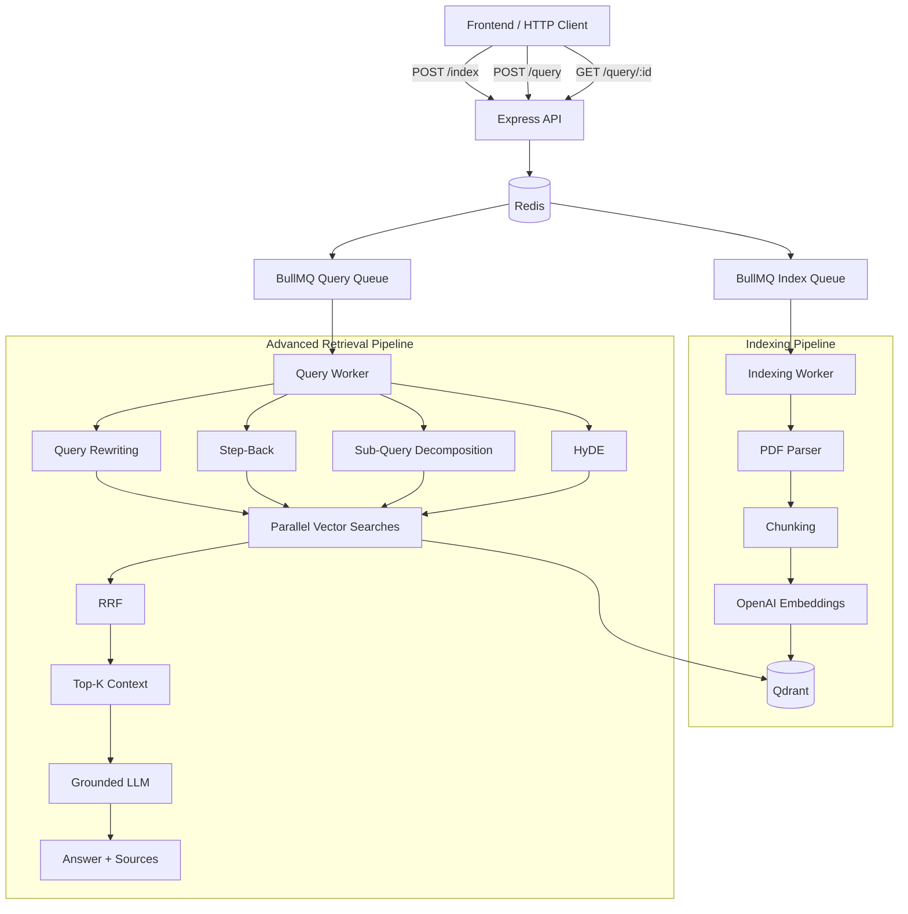
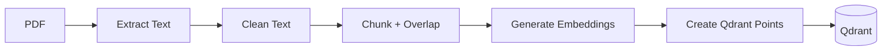
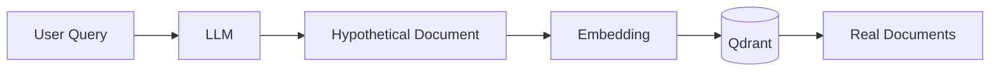
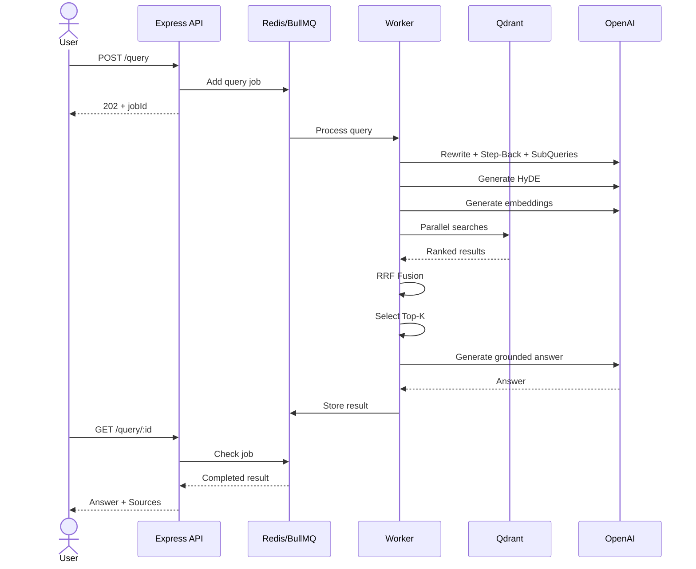
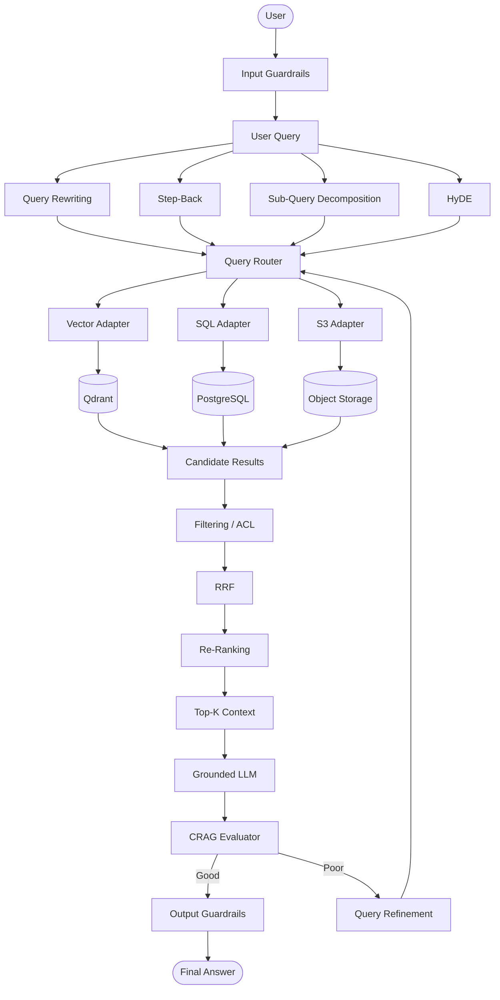

# 🚀 Advanced RAG Pipeline — Comprehensive Step-by-Step Code Explanation

This document provides a detailed technical walkthrough of a **production-oriented Advanced Retrieval-Augmented Generation (RAG) pipeline** implemented in:

`week03/learning/day05/code/advance-rag-pipeline/`

The system goes beyond basic vector search by combining **asynchronous document indexing, query translation, multi-query retrieval, HyDE, RRF, Qdrant, OpenAI, BullMQ, and Redis**.

---

# 01. 🧠 What This Pipeline Solves

A basic RAG pipeline usually looks like:

```text
User Query
    ↓
Embedding
    ↓
Vector Search
    ↓
Top-K Documents
    ↓
LLM
    ↓
Answer
```

This works for prototypes, but production systems face problems such as:

* Users asking poorly worded questions
* Query/document semantic mismatch
* Complex questions requiring multiple searches
* Important information being spread across multiple chunks
* Multiple retrieval strategies producing different rankings
* Expensive PDF indexing operations
* Long-running RAG queries
* HTTP request timeouts
* High latency

This project addresses these problems using:

```text
                    ┌──────────────────────┐
                    │      User Query      │
                    └──────────┬───────────┘
                               ↓
                    ┌──────────────────────┐
                    │ Query Understanding  │
                    └──────────┬───────────┘
                               ↓
            ┌──────────────────┼──────────────────┐
            ↓                  ↓                  ↓
      Query Rewrite        Step-Back          Sub-Queries
            │                  │                  │
            └──────────────────┼──────────────────┘
                               ↓
                              HyDE
                               ↓
                  ┌────────────────────────┐
                  │   Multiple Searches    │
                  │       Qdrant           │
                  └───────────┬────────────┘
                              ↓
                    ┌──────────────────┐
                    │       RRF        │
                    │ Rank Fusion      │
                    └────────┬─────────┘
                             ↓
                       Top-K Context
                             ↓
                       Grounded LLM
                             ↓
                          Response
```

---

# 02. 🏗️ Complete System Architecture

The project contains **two major pipelines**:

1. **Document Indexing Pipeline**
2. **Query / Retrieval Pipeline**



---

# 03. 📁 Project Structure

```text
advance-rag-pipeline/
│
├── docker-compose.yml
├── package.json
├── explanations-code.md
│
└── src/
    ├── config.js
    ├── index.js
    ├── indexer.js
    ├── openai.js
    ├── qdrant.js
    ├── queue.js
    ├── retriever.js
    └── worker.js
```

### Responsibility of each file

| File           | Responsibility                                   |
| -------------- | ------------------------------------------------ |
| `config.js`    | Environment variables and configuration          |
| `index.js`     | Express API                                      |
| `indexer.js`   | PDF → chunks → embeddings → Qdrant               |
| `openai.js`    | OpenAI client and embeddings                     |
| `qdrant.js`    | Qdrant connection                                |
| `queue.js`     | BullMQ queues                                    |
| `retriever.js` | Query translation + retrieval + RRF + generation |
| `worker.js`    | Background job processing                        |

---

# 04. ⚙️ Step 1 — Central Configuration

`src/config.js`

The first step is centralizing all configuration.

```javascript
import "dotenv/config";

export const config = {
  port: Number(process.env.PORT) || 8000,

  redis: {
    host: process.env.REDIS_HOST || "127.0.0.1",
    port: Number(process.env.REDIS_PORT) || 6379,
  },

  qdrant: {
    url: process.env.QDRANT_URL || "http://127.0.0.1:6333",
    collection: process.env.QDRANT_COLLECTION || "documents",
  },

  openai: {
    apiKey: process.env.OPENAI_API_KEY,
    embeddingModel:
      process.env.EMBEDDING_MODEL || "text-embedding-3-small",

    embeddingDimensions:
      Number(process.env.EMBEDDING_DIMENSIONS) || 1536,

    chatModel:
      process.env.CHAT_MODEL || "gpt-4o-mini",
  },

  chunking: {
    chunkSize:
      Number(process.env.CHUNK_SIZE) || 1000,

    chunkOverlap:
      Number(process.env.CHUNK_OVERLAP) || 200,
  },

  retrieval: {
    topK:
      Number(process.env.RETRIEVAL_TOP_K) || 4,

    rrfK:
      Number(process.env.RRF_K) || 60,

    finalK:
      Number(process.env.RETRIEVAL_FINAL_K) || 5,
  },
};

export const INDEXING_QUEUE = "file-indexing";
export const QUERY_QUEUE = "query";
```

### Why centralize configuration?

Instead of scattering values throughout the application:

```javascript
const topK = 4;
const port = 8000;
const qdrantUrl = "...";
```

we have:

```javascript
config.retrieval.topK
config.port
config.qdrant.url
```

This makes the application easier to configure for:

```text
Development
    ↓
Staging
    ↓
Production
```

---

# 05. 🗄️ Step 2 — Initialize Qdrant

`src/qdrant.js`

Qdrant stores the document embeddings.

```javascript
import { QdrantClient } from "@qdrant/js-client-rest";
import { config } from "./config.js";

export const qdrant = new QdrantClient({
  url: config.qdrant.url,
});

export async function ensureCollection() {
  const name = config.qdrant.collection;

  const exists = await qdrant.collectionExists(name);

  if (!exists.exists) {
    try {
      await qdrant.createCollection(name, {
        vectors: {
          size: config.openai.embeddingDimensions,
          distance: "Cosine",
        },
      });

      console.log(`Created Qdrant collection "${name}"`);
    } catch (err) {
      const stillMissing =
        !(await qdrant.collectionExists(name)).exists;

      if (stillMissing) {
        throw err;
      }
    }
  }

  return name;
}
```

### Vector database structure

Conceptually, each Qdrant point looks like:

```text
Point
│
├── id
│
├── vector
│     └── [0.021, -0.31, ...]
│
└── payload
      ├── text
      ├── source
      ├── filePath
      └── chunkIndex
```

---

# 06. 🤖 Step 3 — OpenAI Embedding Layer

`src/openai.js`

This file provides reusable embedding functions.

```javascript
import OpenAI from "openai";
import { config } from "./config.js";

export const openai = new OpenAI({
  apiKey: config.openai.apiKey,
});

export async function embedText(text) {
  const response = await openai.embeddings.create({
    model: config.openai.embeddingModel,
    input: text,
  });

  return response.data[0].embedding;
}
```

For multiple chunks:

```javascript
export async function embedTexts(texts, batchSize = 100) {
  const vectors = [];

  for (let i = 0; i < texts.length; i += batchSize) {
    const batch = texts.slice(i, i + batchSize);

    const response = await openai.embeddings.create({
      model: config.openai.embeddingModel,
      input: batch,
    });

    for (const item of response.data) {
      vectors.push(item.embedding);
    }
  }

  return vectors;
}
```

### Why batch embeddings?

Instead of:

```text
Chunk 1 → API
Chunk 2 → API
Chunk 3 → API
Chunk 4 → API
```

we can do:

```text
Chunk 1 ─┐
Chunk 2 ─┤
Chunk 3 ─┼──→ Embedding API
Chunk 4 ─┘
```

This reduces unnecessary API calls and improves indexing performance.

---

# 07. 📥 Step 4 — BullMQ + Redis

`src/queue.js`

Large PDF indexing should not block the Express server.

Instead:

```text
HTTP Request
     ↓
Create Job
     ↓
Redis
     ↓
Worker
     ↓
Process PDF
```

```javascript
import { Queue } from "bullmq";

import {
  config,
  INDEXING_QUEUE,
  QUERY_QUEUE,
} from "./config.js";

export const connection = {
  host: config.redis.host,
  port: config.redis.port,
  maxRetriesPerRequest: null,
};

export const indexingQueue =
  new Queue(INDEXING_QUEUE, { connection });

export const queryQueue =
  new Queue(QUERY_QUEUE, { connection });
```

### Indexing job

```javascript
export async function enqueueIndexingJob(payload) {
  return indexingQueue.add(
    "index-file",
    payload,
    {
      attempts: 3,

      backoff: {
        type: "exponential",
        delay: 2000,
      },

      removeOnComplete: 100,
      removeOnFail: 500,
    }
  );
}
```

### Query job

```javascript
export async function enqueueQueryJob(payload) {
  return queryQueue.add(
    "run-query",
    payload,
    {
      attempts: 2,

      backoff: {
        type: "exponential",
        delay: 1000,
      },

      removeOnComplete: {
        age: 3600,
        count: 1000,
      },

      removeOnFail: {
        age: 3600,
        count: 1000,
      },
    }
  );
}
```

---

# 08. 📄 Step 5 — PDF Indexing Pipeline

`src/indexer.js`

The indexing pipeline is:



The complete flow is:

```text
PDF
 ↓
Text Extraction
 ↓
Cleaning
 ↓
Chunking
 ↓
Embedding
 ↓
Qdrant
```

---

# 09. ✂️ Step 6 — Chunking

A large document cannot usually be sent directly to the LLM.

Therefore:

```text
Large Document
       ↓
 ┌─────────────┐
 │ Chunk 1     │
 ├─────────────┤
 │ Chunk 2     │
 ├─────────────┤
 │ Chunk 3     │
 ├─────────────┤
 │ Chunk 4     │
 └─────────────┘
```

The implementation uses overlapping chunks:

```javascript
export function chunkText(
  text,
  chunkSize = config.chunking.chunkSize,
  overlap = config.chunking.chunkOverlap
) {
  const clean = text
    .replace(/\s+/g, " ")
    .trim();

  if (!clean) return [];

  const chunks = [];

  let start = 0;

  while (start < clean.length) {
    let end = Math.min(
      start + chunkSize,
      clean.length
    );

    if (end < clean.length) {
      const lastSpace =
        clean.lastIndexOf(" ", end);

      if (lastSpace > start) {
        end = lastSpace;
      }
    }

    const chunk =
      clean.slice(start, end).trim();

    if (chunk) {
      chunks.push(chunk);
    }

    if (end >= clean.length) {
      break;
    }

    start = end - overlap;

    if (start < 0) {
      start = 0;
    }
  }

  return chunks;
}
```

### Why overlap?

Without overlap:

```text
Chunk 1:
"The user must authenticate before accessing"

Chunk 2:
"the billing dashboard."
```

The relationship may be lost.

With overlap:

```text
Chunk 1:
"The user must authenticate before accessing the billing"

Chunk 2:
"accessing the billing dashboard requires..."
```

The context is preserved better.

---

# 10. 📦 Step 7 — Store Vectors in Qdrant

After chunking:

```javascript
export async function indexPdf({
  filePath,
  originalName,
}) {
  const collection =
    await ensureCollection();

  const text =
    await readPdfText(filePath);

  const chunks =
    chunkText(text);

  if (chunks.length === 0) {
    return {
      chunks: 0,
      message: "No extractable text found in PDF",
    };
  }

  const vectors =
    await embedTexts(chunks);

  const points = chunks.map(
    (chunk, index) => ({
      id: crypto.randomUUID(),

      vector: vectors[index],

      payload: {
        text: chunk,
        source: originalName,
        filePath,
        chunkIndex: index,
      },
    })
  );

  await qdrant.upsert(
    collection,
    {
      wait: true,
      points,
    }
  );

  return {
    chunks: chunks.length,
    collection,
  };
}
```

Now the document is searchable.

---

# 11. 🔍 Step 8 — Advanced Query Translation

This is where the system moves beyond Naive RAG.

A raw query:

```text
how fix error 429 gemni node
```

can be transformed into:

```text
Rewritten:
How to handle Google Gemini API 429
rate-limit errors in Node.js?
```

and:

```text
Step-Back:
What causes API rate limiting and how
should applications handle quota errors?
```

and:

```text
Sub-query 1:
What is an HTTP 429 error?

Sub-query 2:
Why does Gemini return 429?

Sub-query 3:
How can Node.js applications handle
Gemini rate limits?
```

and:

```text
HyDE:
A hypothetical technical passage describing
how Node.js applications handle Gemini
API rate limits...
```

---

# 12. 🧠 Step 9 — Query Rewriting

```javascript
export async function queryRewriting(query) {
  const completion =
    await openai.chat.completions.create({
      model: config.openai.chatModel,

      temperature: 0.2,

      response_format: {
        type: "json_schema",

        json_schema: {
          name: "query_rewriting",

          strict: true,

          schema: {
            type: "object",

            additionalProperties: false,

            properties: {
              stepBack: {
                type: "string",
              },

              rewritten: {
                type: "string",
              },

              subQueries: {
                type: "array",
                items: {
                  type: "string",
                },
              },
            },

            required: [
              "stepBack",
              "rewritten",
              "subQueries",
            ],
          },
        },
      },

      messages: [
        {
          role: "system",
          content:
            "You are a query understanding assistant.",
        },

        {
          role: "user",
          content: query,
        },
      ],
    });

  const parsed =
    JSON.parse(
      completion.choices[0]?.message?.content ?? "{}"
    );

  return {
    stepBack: parsed.stepBack ?? "",

    rewritten:
      parsed.rewritten ?? query,

    subQueries:
      Array.isArray(parsed.subQueries)
        ? parsed.subQueries.slice(0, 3)
        : [],
  };
}
```

Structured output is useful because the application expects a predictable object:

```javascript
{
  stepBack: "...",
  rewritten: "...",
  subQueries: [
    "...",
    "...",
    "..."
  ]
}
```

---

# 13. 🔬 Step 10 — HyDE

**HyDE = Hypothetical Document Embeddings**

Instead of directly embedding:

```text
What is temporal dead zone?
```

the LLM generates a hypothetical document:

```text
The Temporal Dead Zone is the period between
entering a block and the initialization of a
let or const variable...
```

Then:



Implementation:

```javascript
export async function hydeDocument(query) {
  const completion =
    await openai.chat.completions.create({
      model: config.openai.chatModel,

      temperature: 0.3,

      messages: [
        {
          role: "system",

          content:
            "Write a concise factual passage " +
            "that directly answers the user's question.",
        },

        {
          role: "user",
          content: query,
        },
      ],
    });

  return (
    completion.choices[0]
      ?.message
      ?.content
      ?.trim() ?? ""
  );
}
```

Then the hypothetical passage is embedded and searched.

---

# 14. 🔀 Step 11 — Multiple Retrieval Paths

Now we have several search queries:

```text
Original Query
       │
       ├── Rewritten Query
       │
       ├── Step-Back Query
       │
       ├── HyDE Passage
       │
       ├── Sub-Query 1
       │
       ├── Sub-Query 2
       │
       └── Sub-Query 3
```

Each can produce a ranked result list:

```text
Rewrite Search
    → D1, D5, D3, D8

Step-Back Search
    → D5, D2, D1, D9

HyDE Search
    → D3, D1, D5, D7

Sub-Query Search
    → D1, D4, D5, D6
```

Now we have a problem:

**How do we combine these lists?**

That is where RRF comes in.

---

# 15. 🏆 Step 12 — Reciprocal Rank Fusion

RRF combines multiple ranked lists without directly comparing their raw similarity scores.

Formula:

$$
RRF(d)=
\sum_{m \in M}
\frac{1}{k+r_m(d)}
$$

Where:

* `d` = document
* `M` = retrieval result lists
* `r(d)` = document's rank
* `k` = smoothing constant, commonly `60`

Implementation:

```javascript
function reciprocalRankFusion(
  rankedLists,
  k = config.retrieval.rrfK
) {
  const fused = new Map();

  for (const { label, hits } of rankedLists) {
    hits.forEach((hit, index) => {
      const rank = index + 1;

      const contribution =
        1 / (k + rank);

      const existing =
        fused.get(hit.id);

      if (existing) {
        existing.rrfScore += contribution;

        existing.bestScore =
          Math.max(
            existing.bestScore,
            hit.score
          );

        existing.matchedBy.push(label);

      } else {
        fused.set(hit.id, {
          id: hit.id,

          text:
            hit.payload?.text ?? "",

          source:
            hit.payload?.source ?? null,

          chunkIndex:
            hit.payload?.chunkIndex ?? null,

          bestScore:
            hit.score,

          rrfScore:
            contribution,

          matchedBy: [label],
        });
      }
    });
  }

  return [...fused.values()]
    .sort(
      (a, b) =>
        b.rrfScore - a.rrfScore
    );
}
```

### Important idea

If a document appears near the top in several retrieval strategies:

```text
Rewrite       → D1 #1
Step-Back     → D1 #2
HyDE          → D1 #1
Sub-query     → D1 #3
```

RRF gives it a strong combined score.

---

# 16. 🎯 Step 13 — Select Final Top-K Context

After RRF:

```text
RRF Results

D1 → 0.064
D5 → 0.061
D3 → 0.054
D2 → 0.049
D8 → 0.042
D9 → 0.031
```

Select:

```javascript
const sources =
  fusedResults.slice(
    0,
    config.retrieval.finalK
  );
```

For example:

```text
Final K = 5

D1
D5
D3
D2
D8
```

These documents become the LLM context.

---

# 17. 🤖 Step 14 — Grounded Answer Generation

The final LLM should not blindly answer from its internal knowledge.

Instead:

```text
User Query
     +
Retrieved Context
     ↓
    LLM
     ↓
Grounded Answer
```

Example:

```javascript
export async function answerQuery(query) {
  // Retrieval happens here...

  const context = sources
    .map(
      (source, index) =>
        `[Chunk ${index + 1}] ` +
        `(source: ${source.source})\n` +
        source.text
    )
    .join("\n\n");

  const completion =
    await openai.chat.completions.create({
      model: config.openai.chatModel,

      temperature: 0.2,

      messages: [
        {
          role: "system",

          content:
            "Answer the user's question using " +
            "ONLY the provided context. " +
            "If the answer is not contained " +
            "in the context, say you don't know.",
        },

        {
          role: "user",

          content:
            `Context:\n${context}\n\n` +
            `Question: ${query}`,
        },
      ],
    });

  return {
    query,

    answer:
      completion.choices[0]
        ?.message
        ?.content
        ?.trim() ?? "",

    sources,
  };
}
```

This gives the LLM:

```text
Context
   +
Question
   ↓
Grounded Answer
```

---

# 18. 👷 Step 15 — Background Workers

`src/worker.js`

Instead of performing expensive operations inside Express:

```text
Express
   ↓
PDF parsing
   ↓
Embedding
   ↓
Qdrant
```

we use:

```text
Express
   ↓
Redis
   ↓
BullMQ
   ↓
Worker
   ↓
Heavy processing
```

Indexing worker:

```javascript
const indexingWorker =
  new Worker(
    INDEXING_QUEUE,

    async (job) => {
      return await indexPdf({
        filePath: job.data.filePath,
        originalName:
          job.data.originalName,
      });
    },

    {
      connection,
      concurrency: 2,
    }
  );
```

Query worker:

```javascript
const queryWorker =
  new Worker(
    QUERY_QUEUE,

    async (job) => {
      return await answerQuery(
        job.data.query
      );
    },

    {
      connection,
      concurrency: 4,
    }
  );
```

### Why separate concurrency?

```text
Indexing Workers
    concurrency: 2

Query Workers
    concurrency: 4
```

A huge PDF upload should not consume all worker capacity and make user queries wait.

---

# 19. 🌐 Step 16 — Express API

`src/index.js` exposes the application to clients.

### Document indexing

```text
POST /index
     ↓
Upload PDF
     ↓
Save file
     ↓
Create BullMQ job
     ↓
Return 202
```

Response:

```json
{
  "message": "File uploaded and queued for indexing",
  "jobId": "1"
}
```

### Query

```text
POST /query
     ↓
Create query job
     ↓
Return jobId
```

Response:

```json
{
  "message": "Query queued",
  "jobId": "1",
  "poll": "/query/1"
}
```

### Polling

```text
GET /query/1
```

Possible states:

```text
waiting
active
completed
failed
```

---

# 20. ⏳ Complete Asynchronous Flow



---

# 21. ⚡ Step 17 — Parallelize Query Expansion

Running everything sequentially is slow:

```text
Rewrite
 ↓
Step-Back
 ↓
Sub-Queries
 ↓
HyDE
 ↓
Embedding
 ↓
Search
```

Instead, independent operations can run concurrently.

```javascript
const [
  queryVariants,
  hydePassage,
] = await Promise.all([
  queryRewriting(query),
  hydeDocument(query),
]);
```

Then:

```javascript
const allQueries = [
  queryVariants.rewritten,
  queryVariants.stepBack,
  hydePassage,
  ...queryVariants.subQueries,
];
```

Generate embeddings:

```javascript
const vectors =
  await embedTexts(allQueries);
```

Then search concurrently:

```javascript
const results =
  await Promise.all(
    vectors.map(
      (vector) =>
        vectorSearch(vector)
    )
  );
```

So instead of:

```text
Search 1
   ↓
Search 2
   ↓
Search 3
   ↓
Search 4
```

we get:

```text
       ┌── Search 1 ──┐
       ├── Search 2 ──┤
       ├── Search 3 ──┤
       └── Search 4 ──┘
              ↓
            RRF
```

---

# 22. 🛡️ Production Improvements

The current pipeline establishes a strong Advanced RAG foundation, but a full production architecture can extend it with:

```text
                    User
                     ↓
             Input Guardrails
                     ↓
              Query Translation
                     ↓
              Query Routing
                     ↓
          ┌──────────┴──────────┐
          ↓                     ↓
     Vector DB              SQL / S3
          ↓                     ↓
          └──────────┬──────────┘
                     ↓
               RRF / Re-rank
                     ↓
                  Top-K
                     ↓
                 LLM
                     ↓
                  CRAG
                     ↓
             Output Guardrails
                     ↓
                  User
```

Possible additions:

* Input/output guardrails
* PII detection and masking
* Prompt-injection detection
* Query routing
* SQL adapters
* S3 adapters
* Re-ranking models
* CRAG evaluation
* Retry loops
* Citation validation
* ACL/security filtering
* Observability and tracing
* Caching
* Rate limiting

---

# 23. 🧩 Complete Advanced RAG Architecture

Putting everything together:



---

# 24. 🔄 Complete Data Flow

### Document side

```text
PDF
 ↓
Extract Text
 ↓
Clean
 ↓
Chunk
 ↓
Embedding
 ↓
Qdrant
```

### Query side

```text
User Query
 ↓
Input Guardrails
 ↓
Query Rewriting
 ↓
Step-Back
 ↓
Sub-Queries
 ↓
HyDE
 ↓
Query Routing
 ↓
Multi-Source Retrieval
 ↓
Filtering
 ↓
RRF
 ↓
Re-ranking
 ↓
Top-K
 ↓
LLM
 ↓
CRAG
 ↓
Output Guardrails
 ↓
Final Answer
```

### Infrastructure side

```text
Express API
     ↓
Redis
     ↓
BullMQ
     ↓
Workers
     ↓
Qdrant / OpenAI / SQL / S3
```

---

# 25. 🧠 Key Concepts to Remember

| Concept             | Main Purpose                                       |
| ------------------- | -------------------------------------------------- |
| **Chunking**        | Break large documents into retrievable pieces      |
| **Embedding**       | Convert text into vectors                          |
| **Qdrant**          | Store and search vectors                           |
| **Query Rewriting** | Improve poorly written queries                     |
| **Step-Back**       | Retrieve broader conceptual knowledge              |
| **Sub-Query**       | Break complex questions into smaller searches      |
| **HyDE**            | Convert query into hypothetical document-like text |
| **Query Routing**   | Decide which data source should answer             |
| **Adapter Layer**   | Connect different data sources uniformly           |
| **RRF**             | Merge multiple ranked result lists                 |
| **Re-ranking**      | Improve final document ordering                    |
| **CRAG**            | Evaluate and correct weak answers                  |
| **Guardrails**      | Protect input/output and enforce policies          |
| **BullMQ**          | Manage background jobs                             |
| **Redis**           | Queue/job state and infrastructure                 |
| **Workers**         | Execute expensive operations asynchronously        |

---

# 🎯 Final Mental Model

Don't think of Production RAG as simply:

```text
Query → Vector DB → LLM
```

Think of it as:

```text
                 PRODUCTION RAG
                       │
        ┌──────────────┼──────────────┐
        ↓              ↓              ↓
   Understand      Retrieve       Validate
        │              │              │
   Rewrite          Multi-DB        CRAG
   Step-Back        Multi-Query     Guardrails
   Sub-Query        RRF             Retry
   HyDE             Re-rank
        │              │              │
        └──────────────┼──────────────┘
                       ↓
                    Grounded
                    Generation
                       ↓
                   Final Answer
```

**The main idea:** Advanced RAG is not one technique. It is an **architecture composed of multiple retrieval, ranking, validation, security, and infrastructure techniques**, combined according to the application's specific requirements.
