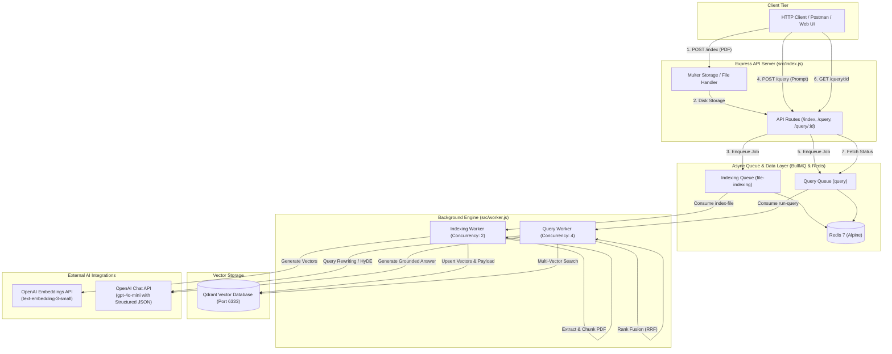
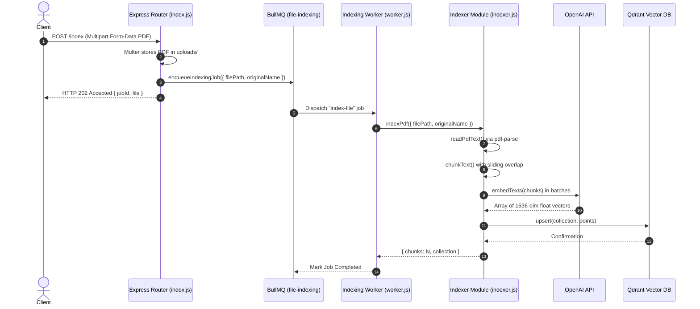
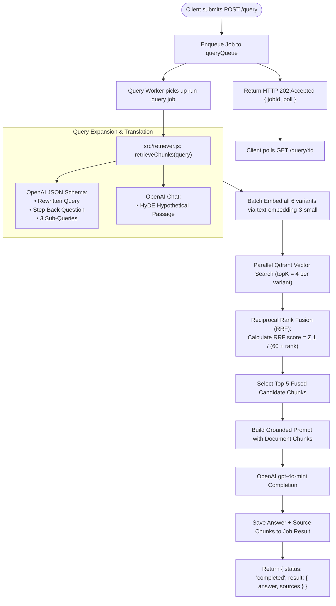

# Master Index — Advanced RAG Pipeline (Node.js + Qdrant + BullMQ)

Welcome to the **Implementation Guide** for the **Advanced RAG Pipeline** project! This guide takes software engineers step-by-step through building a production-grade, asynchronous Retrieval-Augmented Generation (RAG) backend using Node.js ESM, Express, Qdrant Vector DB, Redis, BullMQ background queues, and OpenAI API integrations.

---

## 📁 Project Folder Structure Map

All project source code is located inside [`week03/learning/day05/code/advance-rag-pipeline-sir/`](file:///home/aminul/development/gen-ai-cohort/week03/learning/day05/code/advance-rag-pipeline-sir/):

```text
advance-rag-pipeline-sir/
├── docker-compose.yml             # Docker infrastructure for Qdrant and Redis
├── package.json                   # NPM dependencies and run scripts ("type": "module")
├── .env.example                   # Environment variable template
├── implementation guide/          # Step-by-step implementation guide chapters
│   ├── README.md                  # Master Index (This file)
│   ├── chapter-00-overview-setup.md
│   ├── chapter-01-clients-foundation.md
│   ├── chapter-02-queue-infrastructure.md
│   ├── chapter-03-indexing-pipeline.md
│   ├── chapter-04-advanced-retrieval-rrf.md
│   ├── chapter-05-worker-process.md
│   └── chapter-06-api-server-polling.md
└── src/
    ├── config.js                  # Central configuration & environment defaults
    ├── openai.js                  # OpenAI SDK wrappers (Embeddings & Chat)
    ├── qdrant.js                  # Qdrant client connection & collection setup
    ├── queue.js                   # BullMQ Redis queues & job enqueuers
    ├── indexer.js                 # PDF parsing, sliding window chunking & vector upsertion
    ├── retriever.js               # Multi-query expansion, HyDE, RRF & grounded answer generation
    ├── worker.js                  # Background job worker handlers (indexing + query)
    └── index.js                   # Express REST API, Multer upload & polling routes
```

---

## 🏗️ System Architecture & Service Ecosystem

The system operates as a decoupled, event-driven Node.js ESM backend that separates synchronous API request handling from long-running PDF parsing, vector embedding generation, and multi-step query retrieval.



---

## 🔄 Dual Asynchronous Pipeline Architecture

### 1. Document Indexing Pipeline (PDF -> Chunks -> Vectors -> Qdrant)

When a document is uploaded, processing occurs completely in the background:



---

### 2. Advanced Multi-Query Retrieval & Grounded RAG Pipeline

When a user submits a query, it undergoes structured query transformation, parallel vector retrieval, Reciprocal Rank Fusion, and LLM synthesis:



---

## 📚 Table of Contents & Chapter Guide

| Chapter | Title | Primary Files Covered | Key Learning Focus |
| :--- | :--- | :--- | :--- |
| [**Chapter 00**](file:///home/aminul/development/gen-ai-cohort/week03/learning/day05/code/advance-rag-pipeline-sir/implementation%20guide/chapter-00-overview-setup.md) | Overview, Environment & Setup | [`docker-compose.yml`](file:///home/aminul/development/gen-ai-cohort/week03/learning/day05/code/advance-rag-pipeline-sir/docker-compose.yml), [`package.json`](file:///home/aminul/development/gen-ai-cohort/week03/learning/day05/code/advance-rag-pipeline-sir/package.json), [`.env.example`](file:///home/aminul/development/gen-ai-cohort/week03/learning/day05/code/advance-rag-pipeline-sir/.env.example), [`src/config.js`](file:///home/aminul/development/gen-ai-cohort/week03/learning/day05/code/advance-rag-pipeline-sir/src/config.js) | Infrastructure containers (Qdrant & Redis), ESM configuration, environment variables, central configuration schema. |
| [**Chapter 01**](file:///home/aminul/development/gen-ai-cohort/week03/learning/day05/code/advance-rag-pipeline-sir/implementation%20guide/chapter-01-clients-foundation.md) | Core Clients & Foundations | [`src/openai.js`](file:///home/aminul/development/gen-ai-cohort/week03/learning/day05/code/advance-rag-pipeline-sir/src/openai.js), [`src/qdrant.js`](file:///home/aminul/development/gen-ai-cohort/week03/learning/day05/code/advance-rag-pipeline-sir/src/qdrant.js) | OpenAI client setup, batch vector embedding helpers, Qdrant REST client initialization, and auto-collection provisioning with concurrency safety. |
| [**Chapter 02**](file:///home/aminul/development/gen-ai-cohort/week03/learning/day05/code/advance-rag-pipeline-sir/implementation%20guide/chapter-02-queue-infrastructure.md) | Asynchronous Queue System | [`src/queue.js`](file:///home/aminul/development/gen-ai-cohort/week03/learning/day05/code/advance-rag-pipeline-sir/src/queue.js) | BullMQ queue creation, Redis connection options (`maxRetriesPerRequest: null`), retry backoffs, and job enqueuers. |
| [**Chapter 03**](file:///home/aminul/development/gen-ai-cohort/week03/learning/day05/code/advance-rag-pipeline-sir/implementation%20guide/chapter-03-indexing-pipeline.md) | PDF Ingestion & Indexing | [`src/indexer.js`](file:///home/aminul/development/gen-ai-cohort/week03/learning/day05/code/advance-rag-pipeline-sir/src/indexer.js) | PDF text extraction (`pdf-parse`), boundary-aware sliding-window chunking, batch vectorization, and Qdrant upsertion. |
| [**Chapter 04**](file:///home/aminul/development/gen-ai-cohort/week03/learning/day05/code/advance-rag-pipeline-sir/implementation%20guide/chapter-04-advanced-retrieval-rrf.md) | Advanced Retrieval & RRF | [`src/retriever.js`](file:///home/aminul/development/gen-ai-cohort/week03/learning/day05/code/advance-rag-pipeline-sir/src/retriever.js) | Multi-query expansion (Step-Back, Sub-Queries, Query Rewriting), HyDE hypothetical doc generation, Reciprocal Rank Fusion (RRF), and grounded prompt synthesis. |
| [**Chapter 05**](file:///home/aminul/development/gen-ai-cohort/week03/learning/day05/code/advance-rag-pipeline-sir/implementation%20guide/chapter-05-worker-process.md) | Background Worker Process | [`src/worker.js`](file:///home/aminul/development/gen-ai-cohort/week03/learning/day05/code/advance-rag-pipeline-sir/src/worker.js) | BullMQ worker instances, concurrent job execution, queue event handlers (`completed`, `failed`), and task lifecycle management. |
| [**Chapter 06**](file:///home/aminul/development/gen-ai-cohort/week03/learning/day05/code/advance-rag-pipeline-sir/implementation%20guide/chapter-06-api-server-polling.md) | Express REST Server & Polling | [`src/index.js`](file:///home/aminul/development/gen-ai-cohort/week03/learning/day05/code/advance-rag-pipeline-sir/src/index.js) | Multer file upload security, `POST /index`, `POST /query`, `GET /query/:id` polling controller, error handling middleware, and manual verification scripts. |

---

## ⚡ Quick Start Command Cheat Sheet

To run the complete system locally:

```bash
# 1. Navigate to the project root directory
cd week03/learning/day05/code/advance-rag-pipeline-sir

# 2. Spin up Redis and Qdrant infrastructure containers
npm run services:up

# 3. Install Node.js ESM dependencies
npm install

# 4. Copy environment variables and insert your OpenAI API Key
cp .env.example .env

# 5. In Terminal 1: Start the Express REST API Server
npm run dev

# 6. In Terminal 2: Start the Background Job Worker Process
npm run worker
```
