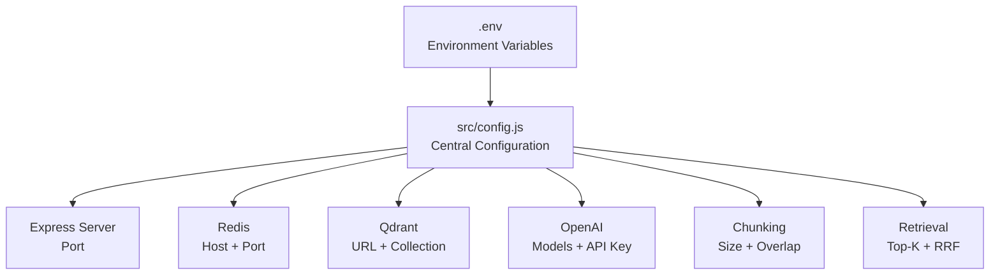
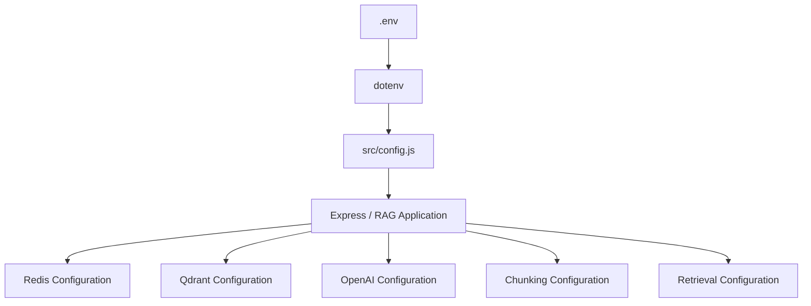

# Chapter 00 — Overview, Environment & Infrastructure Setup

## 1. Chapter Goal

The goal of this chapter is to establish the infrastructure and configuration foundation for the **Advanced RAG Pipeline** project:

```text
advance-rag-pipeline-sir/
```

Before implementing PDF parsing, chunking, embeddings, vector search, background workers, or REST APIs, we need to prepare the environment in which those components will run.

This chapter establishes four important layers:

1. **Docker Infrastructure**

   * Qdrant for vector storage
   * Redis for BullMQ job queues

2. **Node.js Runtime**

   * Native ECMAScript Modules (ESM)
   * npm scripts
   * Required dependencies

3. **Environment Configuration**

   * Server settings
   * Database connection information
   * OpenAI configuration
   * RAG parameters

4. **Central Configuration**

   * One configuration object
   * Type conversion
   * Default values
   * Shared queue names

### Expected Outcome

By the end of this chapter, the project will have:

```text
advance-rag-pipeline-sir/
│
├── docker-compose.yml
├── package.json
├── .env
├── .env.example
│
└── src/
    └── config.js
```

The overall configuration flow is:



The key principle is:

> **Application code should read configuration from one central module instead of accessing `process.env` throughout the codebase.**

---

# 2. Infrastructure Setup

Our RAG system requires two infrastructure services:

### Qdrant

Qdrant is our vector database.

It will eventually store:

```text
Document Chunk
     ↓
Embedding Vector
     +
Metadata / Payload
```

We use:

* `6333` — HTTP/REST API
* `6334` — gRPC API

### Redis

Redis is used by BullMQ as the backend for asynchronous jobs.

Our PDF ingestion flow will eventually look like:

```text
PDF Upload
    ↓
BullMQ
    ↓
Redis
    ↓
Background Worker
    ↓
Embedding
    ↓
Qdrant
```

---

# 3. Docker Compose

Create:

```text
docker-compose.yml
```

in the project root.

```yaml
services:

  qdrant:
    image: qdrant/qdrant:latest
    container_name: advance-rag-qdrant
    restart: unless-stopped

    ports:
      - "6333:6333"
      - "6334:6334"

    volumes:
      - qdrant_data:/qdrant/storage

  redis:
    image: redis:7-alpine
    container_name: advance-rag-redis
    restart: unless-stopped

    ports:
      - "6379:6379"

    volumes:
      - redis_data:/data


volumes:
  qdrant_data:
  redis_data:
```

---

# 4. Understanding Docker Compose

## Qdrant Service

```yaml
qdrant:
  image: qdrant/qdrant:latest
```

This tells Docker to run the Qdrant image.

The container is named:

```yaml
container_name: advance-rag-qdrant
```

This makes it easier to identify when running:

```bash
docker ps
```

### Ports

```yaml
ports:
  - "6333:6333"
  - "6334:6334"
```

The syntax is:

```text
HOST_PORT:CONTAINER_PORT
```

Therefore:

```text
localhost:6333
       ↓
Qdrant container:6333
```

and:

```text
localhost:6334
       ↓
Qdrant container:6334
```

---

# 5. Persistent Qdrant Storage

This line is important:

```yaml
volumes:
  - qdrant_data:/qdrant/storage
```

Without persistent storage, deleting the container could cause stored data to disappear depending on how the container is recreated.

Docker creates a named volume:

```text
qdrant_data
```

which is mounted into Qdrant's storage directory.

Conceptually:

```text
Qdrant Container
      │
      ▼
/qdrant/storage
      │
      ▼
Docker Volume
qdrant_data
```

---

# 6. Redis Service

Redis is configured as:

```yaml
redis:
  image: redis:7-alpine
  container_name: advance-rag-redis
```

The Alpine image is a relatively small Redis image.

Redis exposes:

```yaml
ports:
  - "6379:6379"
```

Therefore our Node.js application can connect to:

```text
127.0.0.1:6379
```

The Redis data directory is persisted through:

```yaml
volumes:
  - redis_data:/data
```

---

# 7. Start Infrastructure

Run:

```bash
docker compose up -d
```

The `-d` flag means:

```text
detached mode
```

so Docker runs the services in the background.

Check running containers:

```bash
docker ps
```

You should see containers similar to:

```text
advance-rag-qdrant
advance-rag-redis
```

You can also check their logs:

```bash
docker compose logs qdrant
```

and:

```bash
docker compose logs redis
```

To stop the services:

```bash
docker compose down
```

Because we are using named volumes, the persistent data volumes are normally retained when using `docker compose down`.

To remove the containers **and volumes**, you would explicitly use:

```bash
docker compose down -v
```

Be careful with `-v` because it removes persistent service data.

---

# 8. Node.js Package Configuration

The project uses native Node.js ECMAScript Modules.

Create:

```text
package.json
```

with:

```json
{
  "name": "advance-rag",
  "version": "1.0.0",
  "description": "Advanced RAG: PDF upload + async indexing with Qdrant & BullMQ",
  "license": "ISC",
  "author": "",
  "type": "module",
  "main": "src/index.js",
  "scripts": {
    "dev": "node --watch src/index.js",
    "start": "node src/index.js",
    "worker": "node src/worker.js",
    "services:up": "docker compose up -d",
    "services:down": "docker compose down"
  },
  "dependencies": {
    "@qdrant/js-client-rest": "^1.13.0",
    "bullmq": "^5.34.0",
    "dotenv": "^16.4.7",
    "express": "^4.21.2",
    "ioredis": "^5.4.2",
    "multer": "^2.0.1",
    "openai": "^4.77.0",
    "pdf-parse": "^1.1.1"
  }
}
```

> Dependency versions are examples for this learning project. In a new project, install currently supported versions and verify compatibility before locking them.

---

# 9. Why `"type": "module"`?

This setting:

```json
"type": "module"
```

tells Node.js to interpret `.js` files as ES Modules.

Therefore we can write:

```javascript
import express from 'express';
```

instead of CommonJS:

```javascript
const express = require('express');
```

Our project consistently uses:

```javascript
import ...
export ...
```

which is why ESM is enabled.

---

# 10. npm Scripts

The project defines several useful commands.

### Development

```bash
npm run dev
```

runs:

```text
node --watch src/index.js
```

Node automatically watches for changes and restarts the process.

### Production-style start

```bash
npm run start
```

runs:

```text
node src/index.js
```

### Background Worker

```bash
npm run worker
```

runs:

```text
node src/worker.js
```

This process will eventually consume BullMQ jobs.

### Start Docker Services

```bash
npm run services:up
```

equivalent to:

```bash
docker compose up -d
```

### Stop Docker Services

```bash
npm run services:down
```

equivalent to:

```bash
docker compose down
```

---

# 11. Dependency Overview

## `@qdrant/js-client-rest`

```text
@qdrant/js-client-rest
```

Provides the JavaScript client used to communicate with Qdrant.

It will eventually be responsible for operations such as:

```text
Create collection
Upsert vectors
Search vectors
Apply filters
```

---

## `bullmq`

BullMQ provides our asynchronous job queue.

Instead of doing:

```text
HTTP Request
    ↓
Process huge PDF
    ↓
Generate embeddings
    ↓
Store vectors
    ↓
HTTP Response
```

we can do:

```text
HTTP Request
    ↓
Create Job
    ↓
HTTP 202
```

and let the worker process the job separately.

---

## `ioredis`

BullMQ uses Redis, and `ioredis` provides the Node.js Redis client used by our application configuration.

---

## `express`

Express provides the REST API layer.

Later we will expose endpoints such as:

```text
GET  /health
POST /api/rag/query
POST /api/rag/index-pdf
```

---

## `multer`

Multer handles:

```text
multipart/form-data
```

which is commonly used for file uploads.

Our PDF endpoint will use it to receive uploaded documents.

---

## `openai`

The OpenAI SDK will be used for model interactions, including:

```text
Query generation
Answer generation
Embeddings
```

The exact model names and APIs should be configured according to the OpenAI models available to your account/project.

---

## `pdf-parse`

Used for extracting text from PDF documents.

The ingestion pipeline will eventually be:

```text
PDF
 ↓
pdf-parse
 ↓
Extracted Text
 ↓
Chunking
 ↓
Embedding
 ↓
Qdrant
```

---

# 12. Install Dependencies

Run:

```bash
npm install
```

npm will create:

```text
node_modules/
package-lock.json
```

The `package-lock.json` file records the resolved dependency versions.

For a team project, commit the lock file to version control.

---

# 13. Environment Variables

Create:

```text
.env.example
```

with:

```env
# Express
PORT=8000

# Redis
REDIS_HOST=127.0.0.1
REDIS_PORT=6379

# Qdrant
QDRANT_URL=http://127.0.0.1:6333
QDRANT_COLLECTION=documents

# OpenAI
OPENAI_API_KEY=your_openai_api_key_here
EMBEDDING_MODEL=text-embedding-3-small
EMBEDDING_DIMENSIONS=1536
CHAT_MODEL=gpt-4o-mini

# Chunking
CHUNK_SIZE=1000
CHUNK_OVERLAP=200

# Retrieval
RETRIEVAL_TOP_K=4
RRF_K=60
RETRIEVAL_FINAL_K=5
```

Then create your local:

```text
.env
```

and place your actual values there.

For example:

```bash
cp .env.example .env
```

Then edit `.env`.

---

# 14. `.env` vs `.env.example`

These two files have different purposes.

### `.env`

Contains the actual configuration used by your local application.

For example:

```env
OPENAI_API_KEY=your-real-key
```

This file should normally **not be committed to Git**.

Add it to `.gitignore`:

```gitignore
.env
node_modules/
uploads/
```

### `.env.example`

Contains the configuration template.

For example:

```env
OPENAI_API_KEY=your_openai_api_key_here
```

This file **should** normally be committed so another developer knows which environment variables are required.

---

# 15. Environment Variable Types

One important thing to understand:

Environment variables are strings.

For example:

```env
PORT=8000
```

is initially read as:

```javascript
process.env.PORT
```

which is a string:

```text
"8000"
```

not the number:

```text
8000
```

Therefore our configuration module needs to convert numeric values.

---

# 16. Central Configuration Module

Create:

```text
src/config.js
```

Use:

```javascript
import 'dotenv/config';

const toNumber = (value, fallback) => {
  const parsed = Number(value);

  return Number.isFinite(parsed)
    ? parsed
    : fallback;
};

export const config = {
  port: toNumber(
    process.env.PORT,
    8000
  ),

  redis: {
    host:
      process.env.REDIS_HOST ||
      '127.0.0.1',

    port: toNumber(
      process.env.REDIS_PORT,
      6379
    )
  },

  qdrant: {
    url:
      process.env.QDRANT_URL ||
      'http://127.0.0.1:6333',

    collection:
      process.env.QDRANT_COLLECTION ||
      'documents'
  },

  openai: {
    apiKey:
      process.env.OPENAI_API_KEY,

    embeddingModel:
      process.env.EMBEDDING_MODEL ||
      'text-embedding-3-small',

    embeddingDimensions:
      toNumber(
        process.env.EMBEDDING_DIMENSIONS,
        1536
      ),

    chatModel:
      process.env.CHAT_MODEL ||
      'gpt-4o-mini'
  },

  chunking: {
    chunkSize:
      toNumber(
        process.env.CHUNK_SIZE,
        1000
      ),

    chunkOverlap:
      toNumber(
        process.env.CHUNK_OVERLAP,
        200
      )
  },

  retrieval: {
    topK:
      toNumber(
        process.env.RETRIEVAL_TOP_K,
        4
      ),

    rrfK:
      toNumber(
        process.env.RRF_K,
        60
      ),

    finalK:
      toNumber(
        process.env.RETRIEVAL_FINAL_K,
        5
      )
  }
};


// BullMQ queue names

export const INDEXING_QUEUE =
  'file-indexing';

export const QUERY_QUEUE =
  'query';
```

---

# 17. Why Create a Central Configuration Module?

Without `config.js`, different files might contain:

```javascript
process.env.REDIS_HOST
```

```javascript
process.env.REDIS_PORT
```

```javascript
process.env.QDRANT_URL
```

```javascript
process.env.OPENAI_API_KEY
```

and so on.

That creates several problems:

* Configuration logic becomes duplicated.
* Defaults can become inconsistent.
* Type conversion happens in multiple places.
* Renaming an environment variable becomes harder.
* Testing becomes more complicated.

Instead, we want:

```text
process.env
     ↓
config.js
     ↓
Application
```

Then application code can simply use:

```javascript
config.redis.host
```

or:

```javascript
config.qdrant.collection
```

---

# 18. Loading dotenv

At the top of `config.js`:

```javascript
import 'dotenv/config';
```

This automatically loads `.env` values into:

```javascript
process.env
```

before the configuration object is created.

Therefore:

```text
.env
 ↓
dotenv
 ↓
process.env
 ↓
config.js
 ↓
config
```

---

# 19. Numeric Configuration

Instead of repeatedly writing:

```javascript
Number(process.env.PORT) || 8000
```

we use a helper:

```javascript
const toNumber = (value, fallback) => {
  const parsed = Number(value);

  return Number.isFinite(parsed)
    ? parsed
    : fallback;
};
```

This provides clearer validation.

For example:

```javascript
toNumber('8000', 3000)
```

returns:

```text
8000
```

while an invalid value falls back to:

```text
3000
```

This is slightly safer than blindly relying on:

```javascript
Number(value) || fallback
```

because the latter treats `0` as falsy.

---

# 20. OpenAI Configuration

The configuration contains:

```javascript
openai: {
  apiKey: process.env.OPENAI_API_KEY,

  embeddingModel:
    process.env.EMBEDDING_MODEL ||
    'text-embedding-3-small',

  embeddingDimensions:
    toNumber(
      process.env.EMBEDDING_DIMENSIONS,
      1536
    ),

  chatModel:
    process.env.CHAT_MODEL ||
    'gpt-4o-mini'
}
```

These values control two different model tasks.

### Embedding model

Used to convert text into vectors:

```text
Text
 ↓
Embedding Model
 ↓
Vector
```

For example:

```text
1536-dimensional vector
```

### Chat model

Used for tasks such as:

```text
Query rewriting
Answer generation
Evaluation
```

The important architectural rule is:

> **The embedding model used during indexing must be compatible with the embedding model used during retrieval.**

If the Qdrant collection expects vectors of dimension `1536`, the query embedding must have the same dimension.

---

# 21. Chunking Configuration

We define:

```javascript
chunking: {
  chunkSize: 1000,
  chunkOverlap: 200
}
```

This represents a simple sliding-window strategy.

Conceptually:

```text
Document
────────────────────────────────────────

Chunk 1
[--------------------]
          overlap
              [--------------------]
              Chunk 2
```

With:

```text
chunkSize = 1000
chunkOverlap = 200
```

the next chunk begins approximately 800 characters after the previous chunk begins.

The overlap helps preserve context across chunk boundaries.

These values are starting points, not universal optimal values.

---

# 22. Retrieval Configuration

We define:

```javascript
retrieval: {
  topK: 4,
  rrfK: 60,
  finalK: 5
}
```

### `topK`

```text
4
```

The number of candidates retrieved from each individual query/search operation.

### `rrfK`

```text
60
```

The constant used by Reciprocal Rank Fusion:

```text
RRF(d) = Σ 1 / (k + rank)
```

A common starting value is:

```text
k = 60
```

### `finalK`

```text
5
```

The number of documents retained after fusion/ranking for context construction.

Conceptually:

```text
Many Query Variants
       ↓
Retrieve Candidates
       ↓
RRF
       ↓
Final Top 5
       ↓
LLM Context
```

---

# 23. Queue Name Constants

At the bottom:

```javascript
export const INDEXING_QUEUE =
  'file-indexing';

export const QUERY_QUEUE =
  'query';
```

These constants provide a single source of truth.

For example, the producer can use:

```javascript
INDEXING_QUEUE
```

and the worker can use the exact same constant.

This prevents subtle mistakes such as:

```text
Producer → "file-indexing"
Worker   → "file_indexing"
```

which would create two different queues.

---

# 24. One Important Architectural Note About `QUERY_QUEUE`

At this stage, the project primarily uses synchronous RAG queries through the Express API:

```text
POST /api/rag/query
       ↓
productionRAG()
```

Therefore:

```javascript
QUERY_QUEUE = 'query'
```

is simply a reserved configuration constant for a future asynchronous query architecture.

Do not assume that defining the constant automatically means query jobs are currently being processed through BullMQ.

The actual queue must have:

```text
Producer
+
Worker
```

implementation before it becomes operational.

---

# 25. Configuration Flow

The complete configuration architecture is now:



This creates a clean boundary between:

```text
Environment
```

and:

```text
Application Logic
```

---

# 26. Final Project Structure

At the end of this chapter:

```text
advance-rag-pipeline-sir/
│
├── docker-compose.yml
├── package.json
├── package-lock.json
├── .env
├── .env.example
├── .gitignore
│
└── src/
    └── config.js
```

Later chapters will add:

```text
src/
├── index.js
├── worker.js
│
├── config.js
│
├── db/
│   ├── qdrant.js
│   └── redis.js
│
├── rag/
│   ├── ...
│
└── queues/
    ├── queue.js
    └── worker.js
```

---

# 27. Chapter Verification Checklist

Before moving forward, verify the following.

### Docker

```bash
docker compose up -d
```

Then:

```bash
docker ps
```

Confirm:

```text
advance-rag-qdrant
advance-rag-redis
```

are running.

### Node.js

Check:

```bash
node -v
npm -v
```

Then install:

```bash
npm install
```

### Environment

Confirm `.env` exists:

```bash
ls -la
```

and contains the required variables.

Never commit your real API key.

### Configuration

You should be able to import:

```javascript
import { config } from './config.js';
```

and access values such as:

```javascript
config.port
config.redis.host
config.qdrant.url
config.openai.embeddingModel
config.chunking.chunkSize
config.retrieval.rrfK
```

---

# 28. Summary

In this chapter, we established the foundation for the Advanced RAG Pipeline.

We:

1. Created Docker infrastructure.
2. Started Qdrant.
3. Started Redis.
4. Configured persistent Docker volumes.
5. Set up a Node.js ESM project.
6. Added the required npm dependencies.
7. Created `.env` and `.env.example`.
8. Centralized configuration in `src/config.js`.
9. Added numeric configuration parsing.
10. Configured OpenAI models and embedding dimensions.
11. Configured document chunking.
12. Configured retrieval and RRF parameters.
13. Defined shared BullMQ queue names.

The architecture is now ready for the next layer:

```text
Infrastructure
      ↓
Configuration
      ↓
Database Clients
      ↓
Embedding / LLM Clients
      ↓
Document Ingestion
      ↓
Retrieval
      ↓
RAG Pipeline
      ↓
REST API
```

## Next Chapter

In **Chapter 01 — Core Clients & Foundations**, we will build the actual service clients that consume this configuration.

We will create:

```text
Qdrant Client
Redis Connection
OpenAI Client
Embedding Helper
Qdrant Collection Initialization
```

The important transition is:

> **Chapter 00 defines how the system is configured. Chapter 01 starts building the actual components that use that configuration.**

A key improvement here is that the configuration is now genuinely **centralized and type-safe at runtime**, while the guide clearly distinguishes **current functionality** from constants/configuration reserved for later features.
