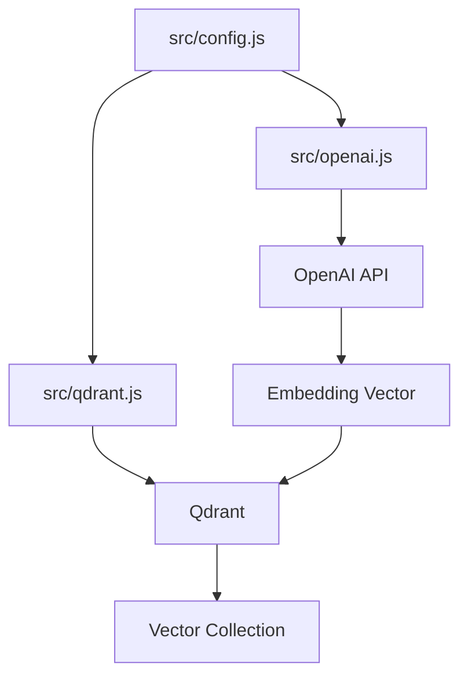
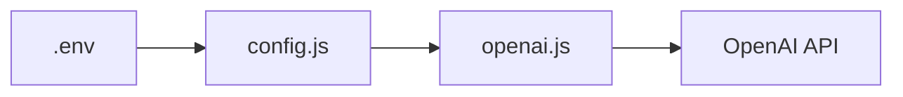
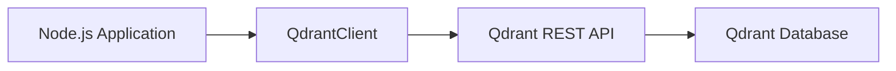
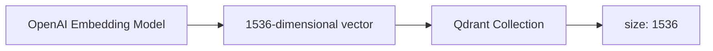
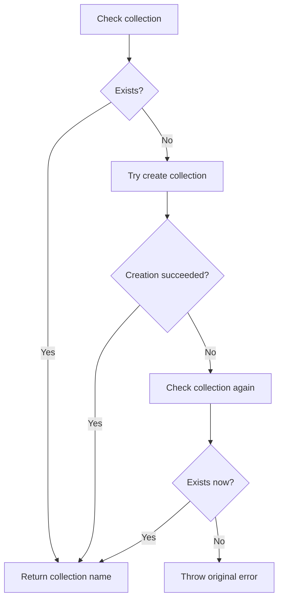
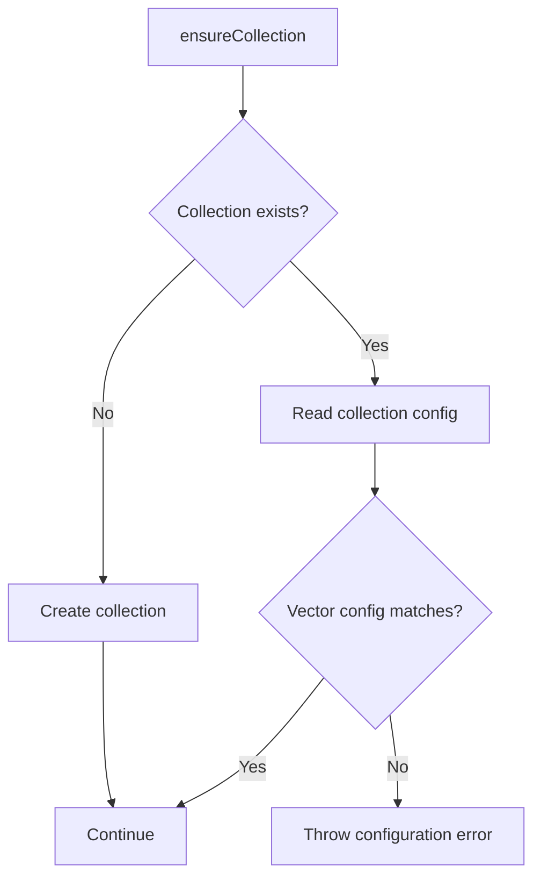
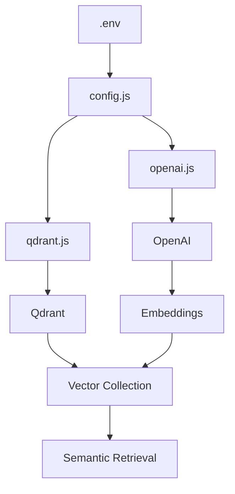

# Chapter 01 — Core Clients & Foundations (OpenAI & Qdrant)

## 1. Chapter Goal

In Chapter 00, we prepared the project configuration and infrastructure:

* Redis
* Qdrant
* OpenAI configuration
* Chunking configuration
* Retrieval configuration

Now we build the two core service clients that the rest of the RAG pipeline will use:

1. **OpenAI client** — generates embeddings for text.
2. **Qdrant client** — stores and searches those embeddings.

### Expected project structure

```text
advance-rag-pipeline-sir/
└── src/
    ├── config.js
    ├── openai.js
    └── qdrant.js
```

The overall relationship is:



The important idea is that the rest of our application should **not repeatedly create OpenAI or Qdrant clients**.

Instead, these modules provide shared clients and helper functions.

---

# 2. OpenAI Client & Embedding Helpers

## 2.1 Why Do We Need Embeddings?

A RAG system needs to find documents that are **semantically related** to a user's question.

For example:

```text
User query:
"How can I reset my password?"
```

A document might contain:

```text
"To recover access to your account, visit the password recovery page."
```

The words are different, but the meaning is similar.

An embedding model converts text into a numerical vector:

```text
Text
 ↓
Embedding Model
 ↓
[0.021, -0.183, 0.442, ...]
```

The vector represents the semantic characteristics of the text.

We can then store that vector in Qdrant and later compare it with the vector generated from a user's query.

---

## 2.2 Create `src/openai.js`

```javascript
import OpenAI from "openai";
import { config } from "./config.js";

// Shared OpenAI client
export const openai = new OpenAI({
  apiKey: config.openai.apiKey,
});

/**
 * Create an embedding vector for a single piece of text.
 */
export async function embedText(text) {
  const response = await openai.embeddings.create({
    model: config.openai.embeddingModel,
    input: text,
  });

  return response.data[0].embedding;
}

/**
 * Create embeddings for multiple texts in batches.
 */
export async function embedTexts(texts, batchSize = 100) {
  const vectors = [];

  for (let i = 0; i < texts.length; i += batchSize) {
    const batch = texts.slice(i, i + batchSize);

    const response = await openai.embeddings.create({
      model: config.openai.embeddingModel,
      input: batch,
    });

    for (const item of response.data) {
      vectors.push(item.embedding);
    }
  }

  return vectors;
}
```

---

# 3. Understanding `openai.js`

Let's understand the file logically.

## 3.1 Import the OpenAI SDK

```javascript
import OpenAI from "openai";
```

This imports the official OpenAI JavaScript SDK.

Instead of manually making HTTP requests to the OpenAI API, we can use:

```javascript
openai.embeddings.create(...)
```

---

## 3.2 Import Application Configuration

```javascript
import { config } from "./config.js";
```

Our configuration was created in Chapter 00.

For example:

```javascript
config.openai.apiKey
config.openai.embeddingModel
config.openai.embeddingDimensions
config.openai.chatModel
```

This keeps environment-specific configuration outside our service logic.

The flow is:



---

# 4. Creating a Shared OpenAI Client

```javascript
export const openai = new OpenAI({
  apiKey: config.openai.apiKey,
});
```

This creates one reusable OpenAI client.

Other modules can import it:

```javascript
import { openai } from "./openai.js";
```

The same client can later be used for:

* embeddings
* chat/completions
* other supported OpenAI APIs

For example:

```javascript
await openai.embeddings.create(...)
```

and later:

```javascript
await openai.chat.completions.create(...)
```

Centralizing the client gives us a cleaner architecture.

---

# 5. `embedText()` — Single Text Embedding

```javascript
export async function embedText(text) {
  const response = await openai.embeddings.create({
    model: config.openai.embeddingModel,
    input: text,
  });

  return response.data[0].embedding;
}
```

This function accepts one string:

```javascript
const query = "How do I reset my password?";
```

Then:

```javascript
const vector = await embedText(query);
```

The request goes to the embedding API:

```text
"How do I reset my password?"
              ↓
        OpenAI Embedding
              ↓
     [0.021, -0.183, ...]
```

The function returns only the vector:

```javascript
[0.021, -0.183, 0.442, ...]
```

This makes the helper convenient for the retrieval pipeline.

---

# 6. `embedTexts()` — Batch Embeddings

PDF indexing is different.

Suppose a PDF contains 300 chunks:

```text
PDF
 ↓
Chunk 1
Chunk 2
Chunk 3
...
Chunk 300
```

We need an embedding for every chunk.

A naive implementation could make one API request for every chunk:

```text
Request 1 → Chunk 1
Request 2 → Chunk 2
Request 3 → Chunk 3
...
Request 300 → Chunk 300
```

That creates unnecessary network overhead.

Instead, we send multiple texts in one embeddings request.

Our helper:

```javascript
export async function embedTexts(texts, batchSize = 100) {
  const vectors = [];

  for (let i = 0; i < texts.length; i += batchSize) {
    const batch = texts.slice(i, i + batchSize);

    const response = await openai.embeddings.create({
      model: config.openai.embeddingModel,
      input: batch,
    });

    for (const item of response.data) {
      vectors.push(item.embedding);
    }
  }

  return vectors;
}
```

For 300 chunks and a batch size of 100:

```text
300 chunks
    │
    ├── Batch 1 → 100 texts → OpenAI
    │
    ├── Batch 2 → 100 texts → OpenAI
    │
    └── Batch 3 → 100 texts → OpenAI
```

Instead of approximately:

```text
300 API requests
```

we make:

```text
3 API requests
```

This can significantly reduce request overhead.

### Important clarification

Batching does **not automatically mean "staying within token rate limits."**

Batching primarily reduces the number of HTTP requests. The API still has limits related to tokens, request rate, input size, and other service constraints.

Therefore, in a production implementation, `batchSize = 100` should be treated as a configurable starting point rather than a universal maximum.

---

# 7. Preserving Embedding Order

One important detail in `embedTexts()` is that the returned vectors need to correspond to the original texts.

For example:

```javascript
const texts = [
  "First document",
  "Second document",
  "Third document",
];
```

We expect:

```text
texts[0] → vectors[0]
texts[1] → vectors[1]
texts[2] → vectors[2]
```

The OpenAI embeddings response includes an `index` for each result.

For simple implementations, the returned order can be used as shown above.

For a more defensive production implementation, we can explicitly sort using `item.index` before constructing the final array.

That becomes particularly useful when building more complex batching/concurrency logic.

---

# 8. Embedding Model and Dimensions

Our Chapter 00 configuration contains:

```env
EMBEDDING_MODEL=text-embedding-3-small
EMBEDDING_DIMENSIONS=1536
```

The model determines the vector representation.

For example:

```text
Text
 ↓
text-embedding-3-small
 ↓
Vector
 ↓
1536 dimensions
```

Conceptually:

```javascript
[
  0.021,
  -0.183,
  0.442,
  ...
]
```

The vector contains many numerical values.

### Critical rule

The embedding dimension used by OpenAI must match the vector size configured in Qdrant.

For example:

```text
OpenAI
1536 dimensions
       │
       │ must match
       ▼
Qdrant
size: 1536
```

If Qdrant expects:

```text
1536
```

but the vectors being inserted contain:

```text
3072
```

the operation will fail.

Therefore, embedding configuration and Qdrant configuration must always stay synchronized.

---

# 9. Qdrant Client & Collection Provisioning

Now we create:

```text
src/qdrant.js
```

Qdrant is our vector database.

It will eventually store records similar to:

```text
Point
├── id
├── vector
└── payload
```

For example:

```text
Document chunk
      ↓
Embedding
      ↓
Qdrant
      ↓
[id, vector, metadata]
```

---

# 10. Create `src/qdrant.js`

```javascript
import { QdrantClient } from "@qdrant/js-client-rest";
import { config } from "./config.js";

export const qdrant = new QdrantClient({
  url: config.qdrant.url,
});

/**
 * Create the Qdrant collection if it does not already exist.
 *
 * The vector size must match the embedding model dimensions.
 */
export async function ensureCollection() {
  const name = config.qdrant.collection;

  const result = await qdrant.collectionExists(name);

  if (!result.exists) {
    try {
      await qdrant.createCollection(name, {
        vectors: {
          size: config.openai.embeddingDimensions,
          distance: "Cosine",
        },
      });

      console.log(`🗂️ Created Qdrant collection "${name}"`);
    } catch (error) {
      // Another process may have created the collection
      // after our existence check.
      const check = await qdrant.collectionExists(name);

      if (!check.exists) {
        throw error;
      }
    }
  }

  return name;
}
```

---

# 11. Understanding `qdrant.js`

## 11.1 Import Qdrant Client

```javascript
import { QdrantClient } from "@qdrant/js-client-rest";
```

This imports the JavaScript REST client provided by Qdrant.

We can then communicate with our local Qdrant server.

Our Chapter 00 configuration points to:

```env
QDRANT_URL=http://127.0.0.1:6333
```

So the architecture is:



---

# 12. Creating the Shared Qdrant Client

```javascript
export const qdrant = new QdrantClient({
  url: config.qdrant.url,
});
```

Now other modules can simply import:

```javascript
import { qdrant } from "./qdrant.js";
```

They don't need to know how the client was configured.

---

# 13. Why Does Qdrant Need a Collection?

Before we store vectors, Qdrant needs to know:

1. Collection name
2. Vector size
3. Distance metric

Our configuration is:

```text
Collection:
documents

Vector size:
1536

Distance:
Cosine
```

Conceptually:

```text
documents
├── vector size = 1536
├── distance = Cosine
└── points
      ├── document chunk 1
      ├── document chunk 2
      └── document chunk 3
```

---

# 14. `ensureCollection()`

The purpose of this function is simple:

> Make sure the required Qdrant collection exists before the application starts inserting vectors.

```javascript
export async function ensureCollection() {
  const name = config.qdrant.collection;

  const result = await qdrant.collectionExists(name);

  if (!result.exists) {
    // create collection
  }

  return name;
}
```

This makes the rest of the application easier.

Instead of every worker doing:

```javascript
if collection exists
    ...
```

we centralize that responsibility in one function.

---

# 15. Checking Whether the Collection Exists

```javascript
const result = await qdrant.collectionExists(name);
```

Qdrant returns information indicating whether the collection exists.

We then check:

```javascript
if (!result.exists) {
```

If it doesn't exist, we attempt to create it.

---

# 16. Creating the Collection

```javascript
await qdrant.createCollection(name, {
  vectors: {
    size: config.openai.embeddingDimensions,
    distance: "Cosine",
  },
});
```

The important configuration is:

```javascript
size: config.openai.embeddingDimensions
```

Because our embedding configuration says:

```env
EMBEDDING_DIMENSIONS=1536
```

Qdrant receives:

```javascript
size: 1536
```

This connects the two parts of our architecture:



If these values don't match, vector insertion/search operations will fail.

---

# 17. Choosing the Distance Metric

We use:

```javascript
distance: "Cosine"
```

Cosine distance/similarity measures the angular relationship between vectors.

The cosine similarity formula is:

```text
             A · B
cos(θ) = ─────────────
          ||A|| × ||B||
```

Where:

* `A` = first vector
* `B` = second vector
* `A · B` = dot product
* `||A||` = magnitude of A
* `||B||` = magnitude of B

Conceptually:

```text
Similar meaning
      ↓
Similar direction
      ↓
Higher cosine similarity
```

For semantic text retrieval, cosine similarity is a common choice for embeddings.

---

# 18. Collection Creation and Race Conditions

There is an important concurrency problem.

Imagine two BullMQ workers start at nearly the same time:

```text
Worker A                    Worker B
   │                           │
   │ collectionExists()       │
   │                           │
   └────── false ──────────────┘
                              
Both think the collection is missing.
```

Then:

```text
Worker A
   │
   └── createCollection()
          ↓
       SUCCESS


Worker B
   │
   └── createCollection()
          ↓
       Collection already exists
```

The second operation can fail because another process created the collection between the existence check and the create request.

This is a classic **check-then-act race condition**.

---

# 19. Handling the Race

Our code uses:

```javascript
try {
  await qdrant.createCollection(...);
} catch (error) {
  const check = await qdrant.collectionExists(name);

  if (!check.exists) {
    throw error;
  }
}
```

The logic is:



This handles the common situation where another worker created the collection while this worker was trying to create it.

### Why re-check instead of blindly ignoring the error?

This is important.

We should **not** do:

```javascript
try {
  await qdrant.createCollection(...);
} catch {
  // Ignore everything
}
```

That would hide genuine problems such as:

* invalid configuration
* connection failure
* authentication failure
* malformed request
* unavailable Qdrant server

Instead, we ask:

> "Did the collection appear after the failure?"

If yes, another process probably created it.

If no, the original error should be propagated.

---

# 20. Important Production Improvement: Validate Existing Collection Configuration

There is one important limitation in this basic implementation.

Suppose the collection already exists:

```text
documents
size = 3072
```

but our current configuration expects:

```text
1536
```

`collectionExists()` returns:

```text
true
```

and `ensureCollection()` simply returns.

The mismatch will only become visible later when we try to insert/search vectors.

A stronger production implementation should inspect the existing collection configuration and verify that:

```text
Qdrant vector size
        ==
Embedding dimensions
```

It should also verify that the configured distance metric matches the application's expectations.

Conceptually:



This prevents subtle production failures after changing embedding models.

---

# 21. OpenAI + Qdrant Working Together

At this point we have two independent foundation modules.

### OpenAI

```text
Text
 ↓
embedText()
 ↓
Embedding vector
```

### Qdrant

```text
Embedding vector
 ↓
Qdrant
 ↓
Stored/searchable vector
```

Together:


During document indexing:

```text
PDF
 ↓
Text extraction
 ↓
Chunking
 ↓
embedTexts()
 ↓
Embeddings
 ↓
Qdrant
```

During user query processing:

```text
User question
 ↓
embedText()
 ↓
Query embedding
 ↓
Qdrant similarity search
 ↓
Relevant chunks
```

This is the foundation of semantic retrieval.

---

# 22. Single vs Batch Embedding

| Function       | Input            | Typical use           |
| -------------- | ---------------- | --------------------- |
| `embedText()`  | One string       | User query            |
| `embedTexts()` | Array of strings | PDF/document indexing |

### Query example

```javascript
const queryVector = await embedText(
  "How can I reset my password?"
);
```

### Indexing example

```javascript
const vectors = await embedTexts([
  "Password reset instructions...",
  "Account recovery instructions...",
  "Security settings...",
]);
```

The indexing pipeline can then pair each chunk with its corresponding vector.

---

# 23. Error Handling Considerations

The current helpers intentionally stay small.

However, production systems should eventually consider:

### OpenAI

* API failures
* rate limits
* timeouts
* retries with exponential backoff
* request size limits
* empty input validation
* cost monitoring

### Qdrant

* connection failures
* collection configuration mismatch
* unavailable database
* upsert failures
* search failures
* timeouts

These concerns will become increasingly important once the asynchronous worker system is introduced.

---

# 24. Important Environment Consideration

Our current configuration uses:

```env
REDIS_HOST=127.0.0.1
QDRANT_URL=http://127.0.0.1:6333
```

This is correct when the Node.js application runs **directly on the host machine** and Qdrant/Redis run inside Docker.

For example:

```text
Host machine
│
├── Node.js
│
└── Docker
    ├── Qdrant → port 6333
    └── Redis  → port 6379
```

If later we move the Node.js API and workers into Docker as well, `127.0.0.1` will mean the **Node.js container itself**, not the Qdrant or Redis container.

In that architecture, we would typically use Docker service names:

```env
QDRANT_URL=http://qdrant:6333
REDIS_HOST=redis
```

This distinction will matter when we containerize the complete application.

---

# 25. Final Project Structure

After this chapter:

```text
advance-rag-pipeline-sir/
├── docker-compose.yml
├── package.json
├── .env
├── .env.example
│
└── src/
    ├── config.js
    ├── openai.js
    └── qdrant.js
```

The responsibilities are now separated:

```text
config.js
   │
   ├──────────────┐
   ↓              ↓
openai.js      qdrant.js
   │              │
   ↓              ↓
OpenAI          Qdrant
   │              │
   └──────┬───────┘
          ↓
      RAG Pipeline
```

---

# 26. Chapter Summary

In this chapter, we created the core external-service clients.

### `src/openai.js`

Provides:

```javascript
openai
embedText()
embedTexts()
```

Responsibilities:

* Create a shared OpenAI SDK client.
* Generate an embedding for one text.
* Generate embeddings for multiple texts in batches.
* Use the embedding model configured in `config.js`.

### `src/qdrant.js`

Provides:

```javascript
qdrant
ensureCollection()
```

Responsibilities:

* Create a shared Qdrant client.
* Connect to the configured Qdrant server.
* Create the required collection when missing.
* Configure vector dimensions.
* Use cosine distance.
* Handle concurrent collection creation safely.
* Fail when a collection cannot be verified.

The complete foundation now looks like:



The next major step is to introduce **BullMQ + Redis** so document indexing can happen asynchronously instead of blocking the HTTP request.

**Next:** Chapter 02 — Asynchronous Queue System with BullMQ + Redis.

I also corrected the original race-condition explanation: the code should not specifically assume every creation error is a `409`; the safer pattern is to re-check whether the collection now exists and only suppress the error if it does.
