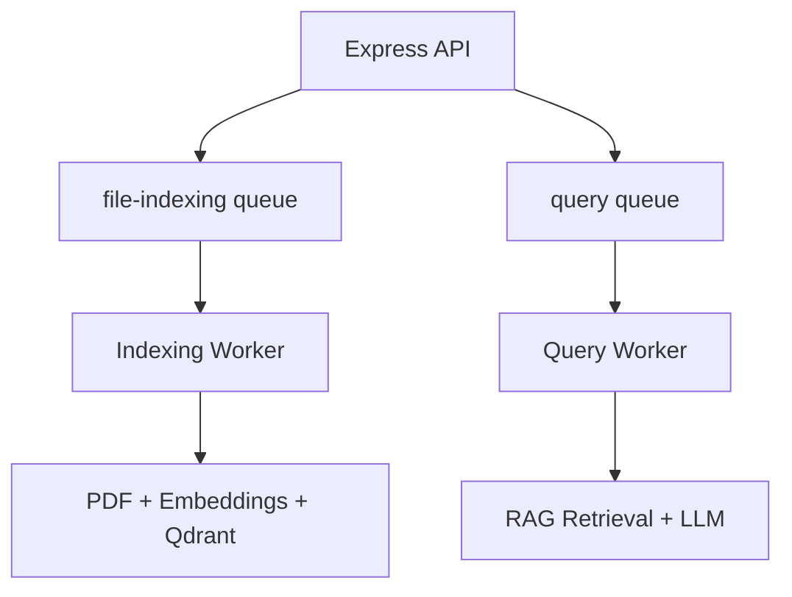
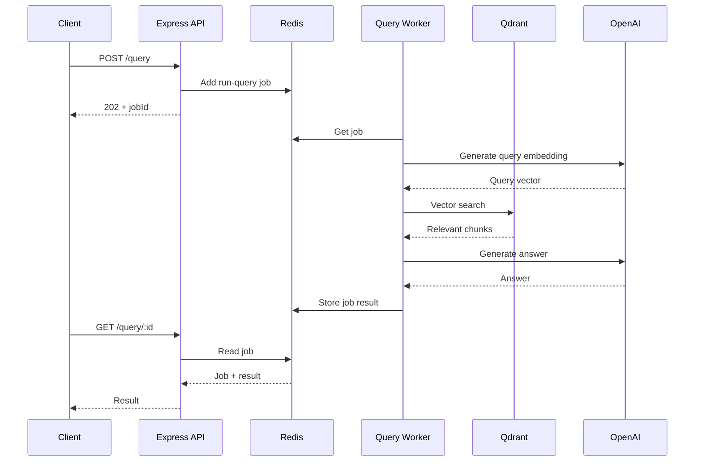
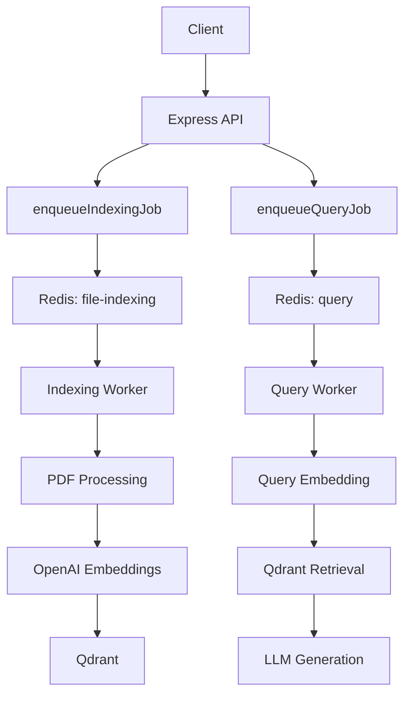
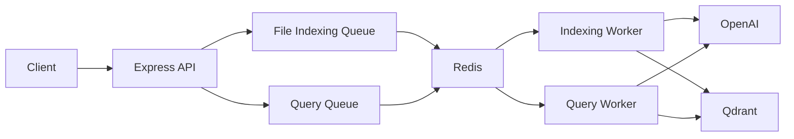

# Chapter 02 — Asynchronous Queue System (BullMQ & Redis)

## 1. Chapter Goal

In Chapter 01, we created the foundation clients for:

* OpenAI
* Qdrant

Now we need to solve an important problem:

> **How do we perform expensive RAG operations without keeping an HTTP request open until the operation finishes?**

Consider a PDF upload.

A single PDF may require:

```text
PDF upload
   ↓
Read PDF
   ↓
Extract text
   ↓
Split into chunks
   ↓
Generate embeddings
   ↓
Store vectors in Qdrant
```

If the PDF contains hundreds of chunks, this process can take several seconds or longer.

If we perform everything inside the HTTP request:

```text
Client
  │
  │ POST /index
  ▼
Express
  │
  ├── Parse PDF
  ├── Generate embeddings
  ├── Upsert Qdrant
  │
  ▼
Response
```

the client has to wait for the entire process.

This creates several problems:

* Long-running HTTP requests
* Request timeouts
* Poor user experience
* Difficult error recovery
* Limited API scalability
* Web server resources being occupied by background work

Instead, we introduce **BullMQ + Redis**.

---

# 2. Asynchronous Queue Architecture

The new architecture becomes:


The HTTP request no longer performs the expensive work.

Instead:

```text
POST /index
      ↓
Create job
      ↓
Redis
      ↓
Return 202 + jobId
      ↓
Worker processes job
```

The client can then check the job status later.

---

# 3. Why Redis?

BullMQ is a job queue system built on top of Redis.

Redis acts as the shared storage and coordination layer between:

* API processes
* Queue producers
* Worker processes

For example:

```text
                    Redis
                      │
          ┌───────────┴───────────┐
          │                       │
          ▼                       ▼
     file-indexing              query
        queue                    queue
          │                       │
          ▼                       ▼
   Indexing Worker          Query Worker
```

This means the API server and workers do not have to run inside the same process.

---

# 4. The Two Queues

Our project has two logical queues.

### Indexing queue

```javascript
INDEXING_QUEUE = "file-indexing";
```

Used for:

* PDF processing
* Text extraction
* Chunking
* Embedding generation
* Qdrant indexing

### Query queue

```javascript
QUERY_QUEUE = "query";
```

Used for:

* Query processing
* Retrieval
* Reranking
* LLM answer generation

The architecture is therefore:



---

# 5. Expected Project Structure

After this chapter:

```text
advance-rag-pipeline-sir/
├── docker-compose.yml
├── package.json
├── .env
├── .env.example
│
└── src/
    ├── config.js
    ├── openai.js
    ├── qdrant.js
    └── queue.js
```

The new file is:

```text
src/queue.js
```

Its responsibility is to:

* Configure BullMQ's Redis connection.
* Create the indexing queue.
* Create the query queue.
* Provide helper functions for adding jobs.
* Configure retries.
* Configure job retention.

---

# 6. Create `src/queue.js`

```javascript
import { Queue } from "bullmq";
import {
  config,
  INDEXING_QUEUE,
  QUERY_QUEUE,
} from "./config.js";

// BullMQ requires a Redis connection
// with maxRetriesPerRequest disabled.
export const connection = {
  host: config.redis.host,
  port: config.redis.port,
  maxRetriesPerRequest: null,
};

// Queue for document indexing.
export const indexingQueue = new Queue(INDEXING_QUEUE, {
  connection,
});

// Queue for RAG query processing.
export const queryQueue = new Queue(QUERY_QUEUE, {
  connection,
});

/**
 * Enqueue a job for indexing an uploaded PDF.
 */
export async function enqueueIndexingJob(payload) {
  return indexingQueue.add("index-file", payload, {
    attempts: 3,

    backoff: {
      type: "exponential",
      delay: 2000,
    },

    removeOnComplete: 100,
    removeOnFail: 500,
  });
}

/**
 * Enqueue a RAG query job.
 */
export async function enqueueQueryJob(payload) {
  return queryQueue.add("run-query", payload, {
    attempts: 2,

    backoff: {
      type: "exponential",
      delay: 1000,
    },

    removeOnComplete: {
      age: 3600,
      count: 1000,
    },

    removeOnFail: {
      age: 3600,
      count: 1000,
    },
  });
}
```

---

# 7. Understanding the Redis Connection

```javascript
export const connection = {
  host: config.redis.host,
  port: config.redis.port,
  maxRetriesPerRequest: null,
};
```

Our Redis configuration comes from Chapter 00:

```env
REDIS_HOST=127.0.0.1
REDIS_PORT=6379
```

Therefore:

```text
.env
 ↓
config.js
 ↓
queue.js
 ↓
BullMQ
 ↓
Redis
```

---

# 8. What Does `maxRetriesPerRequest: null` Mean?

This setting is particularly important when configuring BullMQ connections.

```javascript
maxRetriesPerRequest: null
```

BullMQ uses Redis connections for queue operations and workers may need Redis commands to remain available while waiting for jobs.

With `ioredis`, `maxRetriesPerRequest` controls how many times a command can be retried before the request is considered failed.

Setting:

```javascript
maxRetriesPerRequest: null
```

means:

> Keep retrying Redis commands instead of giving up after a fixed number of attempts.

This is important for BullMQ worker connections because workers are long-running processes and should be resilient to temporary Redis connectivity problems.

### Important clarification

It is slightly misleading to say:

> "`maxRetriesPerRequest: null` is required because BullMQ uses `BRPOPLPUSH`."

The important point is not one specific Redis command.

BullMQ relies on Redis heavily for queue coordination, blocking/waiting behavior, locks, job state, and other operations. BullMQ's worker connection requirements are the main reason this setting matters.

---

# 9. Creating the Indexing Queue

```javascript
export const indexingQueue = new Queue(INDEXING_QUEUE, {
  connection,
});
```

From Chapter 00:

```javascript
export const INDEXING_QUEUE = "file-indexing";
```

Therefore, this creates:

```text
BullMQ Queue
     │
     ▼
"file-indexing"
     │
     ▼
Redis
```

The API can add jobs to this queue.

Later, an indexing worker will consume them.

---

# 10. Creating the Query Queue

```javascript
export const queryQueue = new Queue(QUERY_QUEUE, {
  connection,
});
```

Our configuration contains:

```javascript
export const QUERY_QUEUE = "query";
```

Therefore:

```text
BullMQ Queue
     │
     ▼
"query"
     │
     ▼
Redis
```

A query worker will eventually consume these jobs.

---

# 11. Indexing Job Helper

Now let's look at:

```javascript
export async function enqueueIndexingJob(payload) {
  return indexingQueue.add("index-file", payload, {
    attempts: 3,

    backoff: {
      type: "exponential",
      delay: 2000,
    },

    removeOnComplete: 100,
    removeOnFail: 500,
  });
}
```

The API can call:

```javascript
const job = await enqueueIndexingJob({
  filePath: "/uploads/file.pdf",
  originalName: "document.pdf",
  mimeType: "application/pdf",
  size: 245000,
});
```

BullMQ then creates a job.

Conceptually:

```text
API
 │
 │ enqueueIndexingJob()
 ▼
BullMQ
 │
 │ "index-file"
 ▼
Redis
 │
 ▼
Indexing Worker
```

---

# 12. What Is the Job Name?

This:

```javascript
indexingQueue.add("index-file", payload, ...)
```

contains two important pieces:

### Queue name

```text
file-indexing
```

### Job name

```text
index-file
```

Think of it as:

```text
Queue
└── file-indexing
       └── Job
           ├── name: index-file
           └── data: payload
```

The worker can later decide what to do based on the job name.

For example:

```javascript
if (job.name === "index-file") {
  // process PDF
}
```

---

# 13. Job Payload

The payload contains the information the worker needs.

A typical indexing job could look like:

```javascript
{
  filePath: "/uploads/document.pdf",
  originalName: "document.pdf",
  mimeType: "application/pdf",
  size: 245000
}
```

Later we may add fields such as:

```javascript
{
  filePath: "/uploads/document.pdf",
  originalName: "document.pdf",
  mimeType: "application/pdf",
  size: 245000,
  tenantId: "tenant-123",
  userId: "user-456",
  documentId: "doc-789"
}
```

This is useful because the worker may need metadata for:

* Authorization
* Multi-tenancy
* Document tracking
* Qdrant payloads
* Logging

---

# 14. Job Retries

Our indexing job uses:

```javascript
attempts: 3
```

This means BullMQ can make up to three processing attempts when the job fails.

For example:

```text
Attempt 1
   │
   └── Failure
         ↓
      Retry

Attempt 2
   │
   └── Failure
         ↓
      Retry

Attempt 3
   │
   └── Success / Final Failure
```

Retries are useful for temporary problems such as:

* Network failures
* Temporary OpenAI errors
* Temporary Qdrant failures
* Redis connectivity problems

---

# 15. Exponential Backoff

Our configuration is:

```javascript
backoff: {
  type: "exponential",
  delay: 2000,
}
```

The retry delay increases after each failure.

Conceptually:

```text
Initial attempt
      ↓
   failure
      ↓
   wait ~2s
      ↓
Second attempt
      ↓
   failure
      ↓
   wait ~4s
      ↓
Third attempt
```

The important idea is:

```text
2 seconds
     ↓
4 seconds
     ↓
8 seconds
     ↓
...
```

The exact scheduling behavior should be understood as BullMQ's retry/backoff mechanism rather than assuming every retry has a simple hand-written formula.

### Why exponential backoff?

Imagine OpenAI is temporarily unavailable.

Without backoff:

```text
Failure
 ↓
Immediate retry
 ↓
Failure
 ↓
Immediate retry
 ↓
Failure
```

Many workers could repeatedly hit the failing service.

With backoff:

```text
Failure
 ↓
Wait
 ↓
Retry
 ↓
Wait longer
 ↓
Retry
```

This gives the external service time to recover.

---

# 16. Query Job Configuration

Our query helper is:

```javascript
export async function enqueueQueryJob(payload) {
  return queryQueue.add("run-query", payload, {
    attempts: 2,

    backoff: {
      type: "exponential",
      delay: 1000,
    },

    removeOnComplete: {
      age: 3600,
      count: 1000,
    },

    removeOnFail: {
      age: 3600,
      count: 1000,
    },
  });
}
```

The job name is:

```text
run-query
```

So the flow becomes:

```text
POST /query
     ↓
enqueueQueryJob()
     ↓
query queue
     ↓
Redis
     ↓
Query Worker
     ↓
RAG Pipeline
```

---

# 17. Why Keep Completed Query Jobs?

Suppose:

```text
POST /query
```

returns:

```json
{
  "jobId": "12345"
}
```

The client then asks:

```text
GET /query/12345
```

The server needs to find the job and retrieve its result.

Conceptually:

```text
POST /query
     │
     ▼
Create job
     │
     ▼
Return jobId
     │
     │
     ▼
Worker processes job
     │
     ▼
Job result stored
     │
     ▼
GET /query/12345
     │
     ▼
Return result
```

If completed jobs were removed immediately, the API would have no job record to retrieve.

---

# 18. `removeOnComplete`

For the indexing queue we use:

```javascript
removeOnComplete: 100
```

This means BullMQ should retain a limited number of completed jobs rather than keeping them forever.

This is useful because Redis storage should not grow indefinitely.

For query jobs we use:

```javascript
removeOnComplete: {
  age: 3600,
  count: 1000,
}
```

This tells BullMQ to retain completed jobs according to:

* Maximum age: approximately 3600 seconds
* Maximum count: 1000 jobs

So we are effectively saying:

```text
Keep query results temporarily
        │
        ├── Up to ~1 hour
        │
        └── Up to 1000 jobs
```

### Important clarification

This is a **retention/cleanup policy**, not a guaranteed exact TTL.

BullMQ removes old jobs during its cleanup mechanisms. Therefore, application design should not assume:

> "Every job will exist for exactly 3600 seconds."

If query results must be available reliably for a specific period, a dedicated result store such as a database or Redis data structure may be more appropriate.

---

# 19. Completed Job vs Result Storage

There is an important architectural distinction.

BullMQ can store the return value of a worker job.

For example, a worker might eventually do:

```javascript
return {
  answer: "The password can be reset from the account settings.",
};
```

BullMQ stores the job's result along with the job state.

The API can then retrieve the job.

However, using BullMQ as a permanent application database is not recommended.

A better mental model is:

```text
BullMQ
   ↓
Temporary job state + result
```

rather than:

```text
BullMQ
   ↓
Permanent application database
```

For long-term persistence, use a proper database.

---

# 20. Complete Request Lifecycle

Let's look at the indexing flow.

### Step 1 — Client uploads PDF

```text
POST /index
```

The API receives the file.

### Step 2 — API creates a job

```javascript
await enqueueIndexingJob(payload);
```

### Step 3 — BullMQ stores the job

```text
Express
   ↓
BullMQ
   ↓
Redis
```

### Step 4 — API responds immediately

```http
202 Accepted
```

Example:

```json
{
  "jobId": "12345",
  "status": "queued"
}
```

### Step 5 — Worker receives job

```text
Redis
  ↓
Indexing Worker
```

### Step 6 — Worker processes PDF

```text
PDF
 ↓
Extract text
 ↓
Chunk text
 ↓
Generate embeddings
 ↓
Upsert vectors
 ↓
Qdrant
```

### Step 7 — Job completes

```text
Job
 ↓
completed
 ↓
result stored temporarily
```

---

# 21. Complete Query Lifecycle

The query architecture follows the same pattern.



The important point is that the HTTP request is split into two separate interactions:

```text
POST /query
     ↓
Create job

GET /query/:id
     ↓
Read job result
```

---

# 22. Why This Architecture Scales Better

Consider an API server receiving ten PDF uploads.

### Synchronous approach

```text
Request 1 ── PDF processing ──┐
Request 2 ── PDF processing ──┤
Request 3 ── PDF processing ──┤
Request 4 ── PDF processing ──┤
...                           │
                              ▼
                         API Server
```

The API process becomes responsible for all expensive work.

With queues:

```text
                    Redis
                      │
        ┌─────────────┼─────────────┐
        ▼             ▼             ▼
      Job 1         Job 2         Job 3
        │             │             │
        └─────────────┼─────────────┘
                      ▼
              Worker Processes
```

We can scale workers independently.

For example:

```text
API Servers
     │
     ▼
   Redis
     │
     ▼
┌───────────┐
│ Worker 1  │
│ Worker 2  │
│ Worker 3  │
└───────────┘
```

This is one of the major advantages of asynchronous job processing.

---

# 23. Queue vs Worker

It is important to distinguish these two concepts.

### Queue

The queue stores and manages jobs.

```javascript
const indexingQueue = new Queue(...);
```

It answers:

> "What work needs to be done?"

### Worker

The worker performs the work.

Conceptually:

```javascript
new Worker("file-indexing", async (job) => {
  // process job
});
```

It answers:

> "How should this work be performed?"

Therefore:

```text
Queue
  │
  │ contains jobs
  ▼
Worker
  │
  │ processes jobs
  ▼
Result
```

This chapter creates the **producer side**.

The worker implementation will come in the indexing pipeline chapter.

---

# 24. Important Production Consideration: Redis Connection Ownership

The queue connection defined here:

```javascript
export const connection = {
  host: config.redis.host,
  port: config.redis.port,
  maxRetriesPerRequest: null,
};
```

is useful for creating BullMQ queues.

When we create workers, we should follow BullMQ's worker-specific connection requirements rather than assuming that every component should blindly share one Redis connection object.

In particular, long-running workers and queue producers can have different connection behavior and lifecycle requirements.

We will handle this when implementing:

```text
src/worker.js
```

and the indexing worker.

---

# 25. Important Production Consideration: Idempotency

Retries introduce another important problem.

Suppose the worker performs:

```text
Generate embeddings
      ↓
Qdrant upsert
      ↓
Network timeout
      ↓
Worker thinks job failed
```

The job may retry.

The second attempt may perform the same operation again.

Therefore, background jobs should ideally be **idempotent**.

For document indexing, we can design deterministic IDs such as:

```text
documentId + chunkIndex
```

Then retrying:

```text
chunk 0
chunk 1
chunk 2
```

doesn't accidentally create duplicate vectors.

This becomes important in Chapter 03.

---

# 26. Important Production Consideration: Don't Retry Every Error Forever

Retries are useful for transient failures, but not every failure is temporary.

For example:

```text
Temporary network failure
        → Retry ✅

OpenAI rate limit
        → Retry ✅

Qdrant temporarily unavailable
        → Retry ✅
```

But:

```text
Invalid PDF
        → Retry ❌

Invalid embedding dimension
        → Retry ❌

Invalid application data
        → Retry ❌
```

Retrying permanent errors wastes resources.

A production system should eventually classify errors into:

```text
Transient
   ↓
Retry

Permanent
   ↓
Fail immediately
```

BullMQ gives us the retry mechanism, but application code still needs sensible error handling.

---

# 27. Queue Architecture Diagram

The complete architecture introduced in this chapter is:



The key architectural boundary is:

```text
                HTTP Layer
                    │
                    │ enqueue
                    ▼
              ┌───────────┐
              │   Redis   │
              │  + BullMQ │
              └─────┬─────┘
                    │
                    │ consume
                    ▼
              Background Workers
```

The HTTP server creates work.

Workers execute work.

Redis coordinates the work.

---

# 28. Chapter Summary

In this chapter, we introduced asynchronous processing using **BullMQ + Redis**.

### `src/queue.js`

Provides:

```javascript
connection
indexingQueue
queryQueue
enqueueIndexingJob()
enqueueQueryJob()
```

### Indexing jobs

```text
POST /index
    ↓
file-indexing queue
    ↓
Indexing Worker
```

Used for:

* PDF parsing
* Chunking
* Embedding
* Qdrant indexing

### Query jobs

```text
POST /query
    ↓
query queue
    ↓
Query Worker
```

Used for:

* Query embedding
* Retrieval
* Reranking
* LLM generation

### Reliability features

We also added:

* Retry attempts
* Exponential backoff
* Completed-job retention
* Failed-job retention

The resulting architecture is:



The most important concept from this chapter is:

> **The API should accept work quickly; workers should perform expensive work asynchronously.**

This separation makes the RAG system more reliable, scalable, and easier to operate.

---

## Next Step

In **Chapter 03 — PDF Ingestion & Indexing Pipeline**, we will build the actual indexing worker that consumes the `file-indexing` queue.

The pipeline will become:

```text
PDF Upload
    ↓
BullMQ Job
    ↓
Indexing Worker
    ↓
PDF Text Extraction
    ↓
Text Chunking
    ↓
Batch Embeddings
    ↓
Qdrant Upsert
```

This is where the OpenAI and Qdrant clients from Chapter 01 and the queue infrastructure from Chapter 02 finally come together.

### Key corrections made

* Clarified that `maxRetriesPerRequest: null` is about **ioredis retry behavior and BullMQ's long-running Redis usage**, not simply one specific blocking command.
* Clarified exponential backoff conceptually rather than treating the delay as a simplistic guaranteed formula.
* Clarified that `removeOnComplete: { age, count }` is a **cleanup/retention policy**, not an exact TTL guarantee.
* Added **idempotency**, which is especially important because indexing jobs can be retried.
* Distinguished **Queue vs Worker** so Chapter 03 can build on the architecture cleanly.
* Kept the project-specific queue names from Chapter 00: `file-indexing` and `query`.
