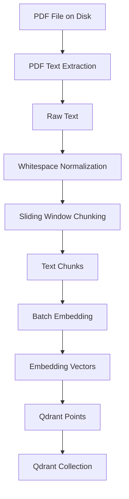
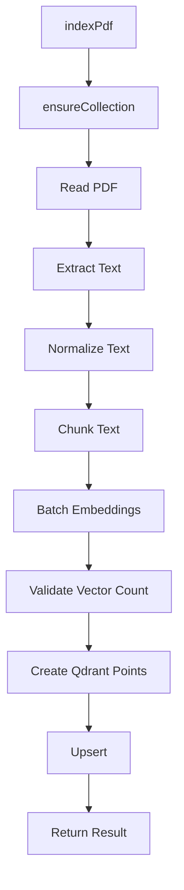
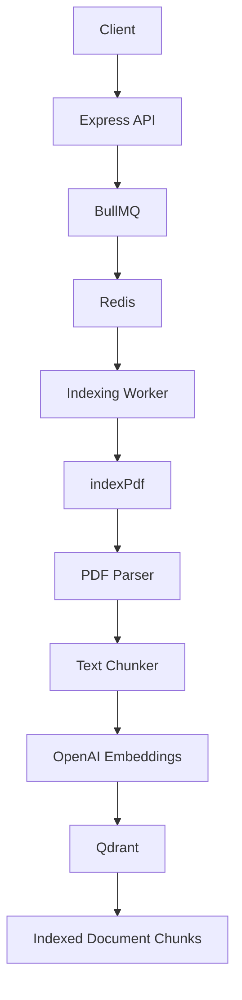

# Chapter 03 — PDF Ingestion & Indexing Pipeline

## 1. Chapter Goal

In the previous chapters, we built:

* `config.js` — application configuration
* `openai.js` — OpenAI client and embedding helpers
* `qdrant.js` — Qdrant client and collection provisioning
* `queue.js` — BullMQ queues and job producers

Now we build the actual **document indexing pipeline**.

The goal is to transform an uploaded PDF into searchable vector records inside Qdrant.

The complete pipeline is:

```text
PDF File
   │
   ▼
1. Extract Text
   │
   ▼
Plain Text
   │
   ▼
2. Chunk Text
   │
   ▼
Overlapping Chunks
   │
   ▼
3. Generate Embeddings
   │
   ▼
Embedding Vectors
   │
   ▼
4. Create Qdrant Points
   │
   ▼
Qdrant Collection
```

More specifically:



---

# 2. Why Do We Need an Indexing Pipeline?

A vector database cannot directly understand a PDF file.

Suppose we upload:

```text
company-handbook.pdf
```

We cannot simply do:

```text
PDF → Qdrant
```

Instead, the document needs to be transformed:

```text
PDF
 ↓
Text
 ↓
Chunks
 ↓
Vectors
 ↓
Qdrant
```

Each chunk becomes a searchable vector.

For example:

```text
PDF
 │
 ├── Chunk 0 → Vector 0
 ├── Chunk 1 → Vector 1
 ├── Chunk 2 → Vector 2
 └── Chunk 3 → Vector 3
```

Later, when a user asks a question, we generate an embedding for the question and search Qdrant for the most similar chunks.

---

# 3. Create `src/indexer.js`

```javascript
import fs from "node:fs/promises";
import crypto from "node:crypto";
import pdfParse from "pdf-parse/lib/pdf-parse.js";

import { config } from "./config.js";
import { qdrant, ensureCollection } from "./qdrant.js";
import { embedTexts } from "./openai.js";

/**
 * Read a PDF from disk and return its extracted text.
 */
async function readPdfText(filePath) {
  const buffer = await fs.readFile(filePath);
  const data = await pdfParse(buffer);

  return data.text;
}

/**
 * Split text into overlapping chunks.
 *
 * The chunker tries to stop at whitespace boundaries
 * instead of cutting words in half.
 */
export function chunkText(
  text,
  chunkSize = config.chunking.chunkSize,
  overlap = config.chunking.chunkOverlap
) {
  const clean = text.replace(/\s+/g, " ").trim();

  if (!clean) {
    return [];
  }

  if (overlap >= chunkSize) {
    throw new Error("Chunk overlap must be smaller than chunk size");
  }

  const chunks = [];
  let start = 0;

  while (start < clean.length) {
    let end = Math.min(start + chunkSize, clean.length);

    // Try to end at a whitespace boundary.
    if (end < clean.length) {
      const lastSpace = clean.lastIndexOf(" ", end);

      if (lastSpace > start) {
        end = lastSpace;
      }
    }

    const chunk = clean.slice(start, end).trim();

    if (chunk) {
      chunks.push(chunk);
    }

    if (end >= clean.length) {
      break;
    }

    start = end - overlap;
  }

  return chunks;
}

/**
 * Create a stable point ID for a document chunk.
 *
 * Using a deterministic ID makes indexing retries idempotent.
 */
function createPointId(originalName, chunkIndex) {
  return crypto
    .createHash("sha256")
    .update(`${originalName}:${chunkIndex}`)
    .digest("hex")
    .slice(0, 32);
}

/**
 * Full indexing pipeline:
 *
 * PDF
 *  → extract text
 *  → chunk
 *  → embed
 *  → create Qdrant points
 *  → upsert
 */
export async function indexPdf({ filePath, originalName }) {
  const collection = await ensureCollection();

  const text = await readPdfText(filePath);
  const chunks = chunkText(text);

  if (chunks.length === 0) {
    return {
      chunks: 0,
      message: "No extractable text found in PDF",
    };
  }

  const vectors = await embedTexts(chunks);

  if (vectors.length !== chunks.length) {
    throw new Error(
      `Embedding count mismatch: ${vectors.length} vectors for ${chunks.length} chunks`
    );
  }

  const points = chunks.map((chunk, index) => ({
    id: createPointId(originalName, index),

    vector: vectors[index],

    payload: {
      text: chunk,
      source: originalName,
      filePath,
      chunkIndex: index,
    },
  }));

  await qdrant.upsert(collection, {
    wait: true,
    points,
  });

  return {
    chunks: chunks.length,
    collection,
  };
}
```

---

# 4. Understanding the Indexing Pipeline

There are five major stages:

```text
1. Read PDF
      ↓
2. Extract and chunk text
      ↓
3. Generate embeddings
      ↓
4. Build Qdrant points
      ↓
5. Upsert points
```

Let's understand each stage.

---

# 5. Stage 1 — Reading the PDF

```javascript
async function readPdfText(filePath) {
  const buffer = await fs.readFile(filePath);
  const data = await pdfParse(buffer);

  return data.text;
}
```

First, we read the PDF from disk:

```javascript
const buffer = await fs.readFile(filePath);
```

`fs.readFile()` returns the PDF as a `Buffer`.

Conceptually:

```text
document.pdf
     ↓
fs.readFile()
     ↓
Buffer
```

We then pass that buffer to `pdf-parse`:

```javascript
const data = await pdfParse(buffer);
```

The parser extracts text from the PDF.

Finally:

```javascript
return data.text;
```

returns the extracted plain text.

---

# 6. PDF Text Extraction Limitations

`pdf-parse` works well for PDFs containing actual selectable text.

For example:

```text
PDF
 └── Embedded text
       ↓
   pdf-parse
       ↓
    Text ✅
```

However, a scanned PDF may contain only images:

```text
Scanned PDF
    ↓
Page image
    ↓
No text layer
    ↓
pdf-parse
    ↓
Little/no useful text
```

In that case, OCR is required.

Therefore, this pipeline currently supports:

> **Text-based PDFs**

rather than fully supporting scanned documents.

OCR can be introduced later if needed.

---

# 7. Why Normalize the Extracted Text?

PDF extraction can produce messy whitespace.

For example:

```text
This     is

a
document.
```

We normalize it using:

```javascript
const clean = text.replace(/\s+/g, " ").trim();
```

The result becomes:

```text
This is a document.
```

The regular expression:

```javascript
/\s+/g
```

matches one or more whitespace characters, including:

* spaces
* tabs
* newlines

Then they are replaced with:

```text
" "
```

Finally:

```javascript
.trim()
```

removes whitespace at the beginning and end.

---

# 8. Stage 2 — Text Chunking

A complete PDF might contain tens of thousands of characters.

Sending the entire document as one vector is not useful for RAG.

Instead, we divide the document into smaller pieces.

For example:

```text
Full Document
│
├── Chunk 0
├── Chunk 1
├── Chunk 2
├── Chunk 3
└── ...
```

Our Chapter 00 configuration uses:

```env
CHUNK_SIZE=1000
CHUNK_OVERLAP=200
```

So the chunker targets approximately:

```text
1000 characters
```

with approximately:

```text
200 characters of overlap
```

---

# 9. Why Overlap?

Imagine we have:

```text
Chunk 1
────────────────────────────
...authentication instructions...
────────────────────────────

Chunk 2
────────────────────────────
...instructions continue here...
────────────────────────────
```

Important information might be located exactly at the boundary.

Without overlap:

```text
Chunk 1: "Users must first..."
Chunk 2: "...verify their email..."
```

The complete idea may be difficult to retrieve.

With overlap:

```text
Chunk 1
████████████████████
         ████████████████
         overlap
                  ████████████████████
                  Chunk 2
```

The overlapping region gives the retrieval system more context.

---

# 10. Chunking Algorithm

The main loop is:

```javascript
let start = 0;

while (start < clean.length) {
  let end = Math.min(start + chunkSize, clean.length);

  // Find a whitespace boundary.

  const chunk = clean.slice(start, end).trim();

  chunks.push(chunk);

  start = end - overlap;
}
```

Suppose:

```text
chunkSize = 1000
overlap = 200
```

The first chunk approximately covers:

```text
0 → 1000
```

The next chunk starts around:

```text
800
```

so the conceptual windows are:

```text
Chunk 1:
0 ─────────────────────── 1000

Chunk 2:
                  800 ─────────────────────── 1800

Chunk 3:
                                        1600 ─────────────── 2600
```

Therefore:

```text
Overlap ≈ 200 characters
```

---

# 11. Boundary-Aware Chunking

A naive chunker might simply do:

```javascript
text.slice(start, start + 1000);
```

This can produce:

```text
"authenticatio"
```

and the next chunk:

```text
"n system..."
```

We don't want to cut words unnecessarily.

Our implementation calculates:

```javascript
let end = Math.min(
  start + chunkSize,
  clean.length
);
```

Then searches backward:

```javascript
const lastSpace = clean.lastIndexOf(" ", end);
```

If a suitable space exists:

```javascript
if (lastSpace > start) {
  end = lastSpace;
}
```

So instead of:

```text
authentication
        ↑
      CUT ❌
```

we try to produce:

```text
authentication
              ↑
          boundary ✅
```

---

# 12. Important Detail: Chunk Size Is Approximate

Our configuration says:

```env
CHUNK_SIZE=1000
```

But this does **not** guarantee every chunk contains exactly 1000 characters.

For example, if the target boundary is:

```text
1000
```

but the previous whitespace occurs at:

```text
973
```

the chunk may end around:

```text
973 characters
```

That's intentional.

The goal is:

> approximately the configured size while avoiding unnecessary word splitting.

---

# 13. Preventing Invalid Chunk Configuration

We added:

```javascript
if (overlap >= chunkSize) {
  throw new Error(
    "Chunk overlap must be smaller than chunk size"
  );
}
```

This is important.

Imagine:

```text
chunkSize = 1000
overlap = 1000
```

Then:

```javascript
start = end - overlap;
```

could result in:

```text
start = start
```

The loop would never make forward progress.

That could create an infinite loop.

Therefore:

```text
overlap < chunkSize
```

must always be true.

---

# 14. Stage 3 — Generate Embeddings

Once we have:

```javascript
const chunks = chunkText(text);
```

we generate vectors:

```javascript
const vectors = await embedTexts(chunks);
```

The `embedTexts()` function was implemented in Chapter 01.

For example:

```text
Chunk 0
Chunk 1
Chunk 2
Chunk 3
   │
   ▼
embedTexts()
   │
   ▼
OpenAI
   │
   ├── Vector 0
   ├── Vector 1
   ├── Vector 2
   └── Vector 3
```

The vector count should match the chunk count.

---

# 15. Embedding Count Validation

We explicitly check:

```javascript
if (vectors.length !== chunks.length) {
  throw new Error(
    `Embedding count mismatch: ${vectors.length} vectors for ${chunks.length} chunks`
  );
}
```

Why?

Because we expect:

```text
1 chunk → 1 vector
```

Therefore:

```text
chunks.length === vectors.length
```

must be true.

For example:

```text
100 chunks
      ↓
100 vectors
```

If we somehow get:

```text
100 chunks
      ↓
99 vectors
```

we should stop before creating incorrect Qdrant records.

---

# 16. Stage 4 — Creating Qdrant Points

Now we combine each chunk with its vector.

```javascript
const points = chunks.map((chunk, index) => ({
  id: createPointId(originalName, index),

  vector: vectors[index],

  payload: {
    text: chunk,
    source: originalName,
    filePath,
    chunkIndex: index,
  },
}));
```

Each Qdrant point contains:

```text
Point
├── id
├── vector
└── payload
```

For example:

```json
{
  "id": "a1b2c3...",
  "vector": [0.12, -0.08, 0.44],
  "payload": {
    "text": "Password reset instructions...",
    "source": "handbook.pdf",
    "filePath": "/uploads/handbook.pdf",
    "chunkIndex": 0
  }
}
```

---

# 17. Understanding the Vector

The vector comes from:

```javascript
vectors[index]
```

For our configured embedding model, this is expected to be a vector with the configured embedding dimension.

Conceptually:

```text
Chunk
 ↓
OpenAI
 ↓
[0.021, -0.183, 0.442, ...]
```

That vector is what Qdrant uses for semantic similarity search.

---

# 18. Understanding the Payload

The payload contains metadata associated with the vector.

Our payload is:

```javascript
payload: {
  text: chunk,
  source: originalName,
  filePath,
  chunkIndex: index,
}
```

### `text`

```javascript
text: chunk
```

Stores the actual chunk text.

This is important because vector search tells us:

> "This chunk is relevant."

But the LLM needs the actual text:

> "What does this chunk say?"

Therefore, we retrieve the payload and use:

```text
payload.text
```

as context for answer generation.

---

### `source`

```javascript
source: originalName
```

Stores the original filename.

Example:

```text
handbook.pdf
```

This can later be used for citations:

```text
Source: handbook.pdf
```

---

### `filePath`

```javascript
filePath
```

Stores the server-side path.

This can be useful for document management, debugging, or tracing.

However, in a multi-tenant production system, be careful about exposing internal file paths to users.

---

### `chunkIndex`

```javascript
chunkIndex: index
```

Stores the chunk's position.

For example:

```text
Chunk 0
Chunk 1
Chunk 2
Chunk 3
```

This is useful for:

* Debugging
* Ordering retrieved chunks
* Reconstructing document sections
* Tracking indexing progress

---

# 19. Stable Point IDs and Idempotency

The original implementation used:

```javascript
crypto.randomUUID()
```

for every chunk.

That creates a new ID every time the same PDF is indexed.

For example:

```text
First attempt:
Chunk 0 → UUID A

Retry:
Chunk 0 → UUID B
```

The retry could therefore create duplicate vectors.

This is especially problematic because Chapter 02 introduced retries.

Instead, this implementation creates deterministic IDs:

```javascript
function createPointId(originalName, chunkIndex) {
  return crypto
    .createHash("sha256")
    .update(`${originalName}:${chunkIndex}`)
    .digest("hex")
    .slice(0, 32);
}
```

Now:

```text
document.pdf + chunk 0
        ↓
same input
        ↓
same ID
```

So:

```text
Attempt 1
Chunk 0 → ID X

Retry
Chunk 0 → ID X
```

When Qdrant receives the same point ID again, the upsert can replace/update the existing point rather than creating another point with a different ID.

This makes the indexing operation more **idempotent**.

### Important production improvement

Using only:

```text
originalName + chunkIndex
```

is not sufficient if two different PDFs can have the same filename.

A stronger production ID could use a stable `documentId`:

```text
documentId + chunkIndex
```

or:

```text
documentHash + chunkIndex
```

This will become important when we introduce proper document management and multi-tenancy.

---

# 20. Stage 5 — Upserting into Qdrant

Finally:

```javascript
await qdrant.upsert(collection, {
  wait: true,
  points,
});
```

The points are sent to Qdrant.

The term **upsert** means:

> Insert the point if it doesn't exist; otherwise update the point with the same ID.

Conceptually:

```text
points
  │
  ▼
Qdrant
  │
  ├── New ID → Insert
  │
  └── Existing ID → Update
```

This is another reason deterministic IDs are useful.

---

# 21. What Does `wait: true` Mean?

We use:

```javascript
wait: true
```

This asks Qdrant to wait for the write operation to be processed before returning the response.

This is useful when we want the indexing operation to know that the upsert has completed before the worker reports success.

However, it is better not to describe this as:

> "Qdrant confirms write-ahead log persistence."

That is too specific.

The safer interpretation is:

> `wait: true` tells Qdrant to wait for the update operation to be applied before returning.

The exact durability semantics depend on Qdrant's storage and deployment configuration.

---

# 22. Complete Indexing Flow

The complete `indexPdf()` function is:

```javascript
export async function indexPdf({ filePath, originalName }) {
  const collection = await ensureCollection();

  const text = await readPdfText(filePath);
  const chunks = chunkText(text);

  if (chunks.length === 0) {
    return {
      chunks: 0,
      message: "No extractable text found in PDF",
    };
  }

  const vectors = await embedTexts(chunks);

  if (vectors.length !== chunks.length) {
    throw new Error(
      `Embedding count mismatch: ${vectors.length} vectors for ${chunks.length} chunks`
    );
  }

  const points = chunks.map((chunk, index) => ({
    id: createPointId(originalName, index),
    vector: vectors[index],

    payload: {
      text: chunk,
      source: originalName,
      filePath,
      chunkIndex: index,
    },
  }));

  await qdrant.upsert(collection, {
    wait: true,
    points,
  });

  return {
    chunks: chunks.length,
    collection,
  };
}
```

The entire process can be visualized as:



---

# 23. How This Connects to Chapter 02

Chapter 02 created:

```text
file-indexing
```

queue.

The intended architecture is now:

```text
HTTP API
   │
   │ enqueue
   ▼
Redis
   │
   ▼
file-indexing queue
   │
   ▼
Indexing Worker
   │
   ▼
indexPdf()
   │
   ├── PDF parsing
   ├── Chunking
   ├── OpenAI embeddings
   └── Qdrant upsert
```

Therefore, this chapter provides the **actual work performed by the indexing worker**.

The worker will eventually call:

```javascript
await indexPdf({
  filePath,
  originalName,
});
```

---

# 24. Why the Worker Should Throw Errors

Because Chapter 02 introduced retries, the indexing pipeline should not hide failures.

For example:

```javascript
await embedTexts(chunks);
```

If OpenAI fails, the error should propagate.

Similarly:

```javascript
await qdrant.upsert(...);
```

If Qdrant fails, the worker should throw.

Then BullMQ can mark the job as failed and apply its retry policy.

The desired flow is:

```text
OpenAI/Qdrant failure
        ↓
indexPdf() throws
        ↓
Worker reports failure
        ↓
BullMQ retry
        ↓
Worker tries again
```

Do **not** do:

```javascript
try {
  await qdrant.upsert(...);
} catch {
  return { success: true };
}
```

That would make BullMQ believe the indexing succeeded when it actually failed.

---

# 25. Memory Considerations

The current implementation processes the entire PDF into memory:

```javascript
const buffer = await fs.readFile(filePath);
```

Then:

```text
PDF Buffer
   ↓
Extracted Text
   ↓
Chunks
   ↓
Embeddings
   ↓
Qdrant Points
```

This is perfectly reasonable for a learning project and moderately sized documents.

For very large files, however, memory usage can become significant.

A production ingestion system may eventually need:

* File-size limits
* Streaming where supported
* Page-by-page processing
* Incremental embedding
* Incremental Qdrant upserts
* Memory monitoring
* OCR pipelines for scanned documents

---

# 26. Another Production Improvement — Document Identity

Our current function accepts:

```javascript
indexPdf({
  filePath,
  originalName,
});
```

For a production RAG system, a document should ideally have a unique identity:

```text
documentId
tenantId
userId
originalName
filePath
```

For example:

```javascript
{
  documentId: "doc_123",
  tenantId: "tenant_456",
  originalName: "handbook.pdf"
}
```

Then Qdrant payloads can contain:

```javascript
payload: {
  documentId,
  tenantId,
  text: chunk,
  source: originalName,
  chunkIndex: index,
}
```

This will become extremely important when implementing:

* Multi-tenancy
* Access control
* Document deletion
* Re-indexing
* Metadata filtering
* Source citations

---

# 27. Complete Architecture So Far

After Chapters 00–03, our system looks like:



The infrastructure responsibilities are now clearly separated:

```text
config.js
   ↓
Configuration

openai.js
   ↓
Embedding generation

qdrant.js
   ↓
Vector database

queue.js
   ↓
Asynchronous jobs

indexer.js
   ↓
PDF → Chunks → Embeddings → Qdrant
```

---

# 28. Chapter Summary

In this chapter, we implemented the complete document ingestion pipeline.

### PDF extraction

```javascript
readPdfText()
```

Converts:

```text
PDF → Plain Text
```

### Chunking

```javascript
chunkText()
```

Converts:

```text
Plain Text → Overlapping Chunks
```

using:

```text
chunk size = 1000
overlap = 200
```

### Embedding

```javascript
embedTexts()
```

Converts:

```text
Chunks → Embedding Vectors
```

### Qdrant points

Each chunk becomes:

```text
Point
├── id
├── vector
└── payload
```

### Upsert

```javascript
qdrant.upsert()
```

Stores the vectors inside the configured Qdrant collection.

The complete pipeline is:

```text
             PDF
              │
              ▼
       Text Extraction
              │
              ▼
        Text Normalization
              │
              ▼
         Text Chunking
              │
              ▼
      Batch Embeddings
              │
              ▼
       Qdrant Points
              │
              ▼
       Qdrant Upsert
              │
              ▼
      Searchable Vectors
```

Most importantly, this chapter connects the previous foundation modules together:

```text
Chapter 01
OpenAI + Qdrant
       │
       ▼
Chapter 02
BullMQ + Redis
       │
       ▼
Chapter 03
PDF Indexing Pipeline
```

---

# 29. Next Step

In **Chapter 04 — Advanced Retrieval & Reciprocal Rank Fusion**, we will build the opposite side of the RAG system.

So far we have:

```text
Documents
   ↓
PDF
   ↓
Chunks
   ↓
Embeddings
   ↓
Qdrant
```

Now we need to answer:

> **How do we retrieve the best chunks when the user asks a question?**

The next pipeline will introduce:

```text
User Query
    ↓
Query Rewriting
    ↓
Step-Back Prompting
    ↓
Sub-Query Decomposition
    ↓
HyDE
    ↓
Vector Retrieval
    ↓
Reciprocal Rank Fusion
    ↓
Relevant Documents
```

This is where the project moves from **document indexing** into **advanced retrieval**.
