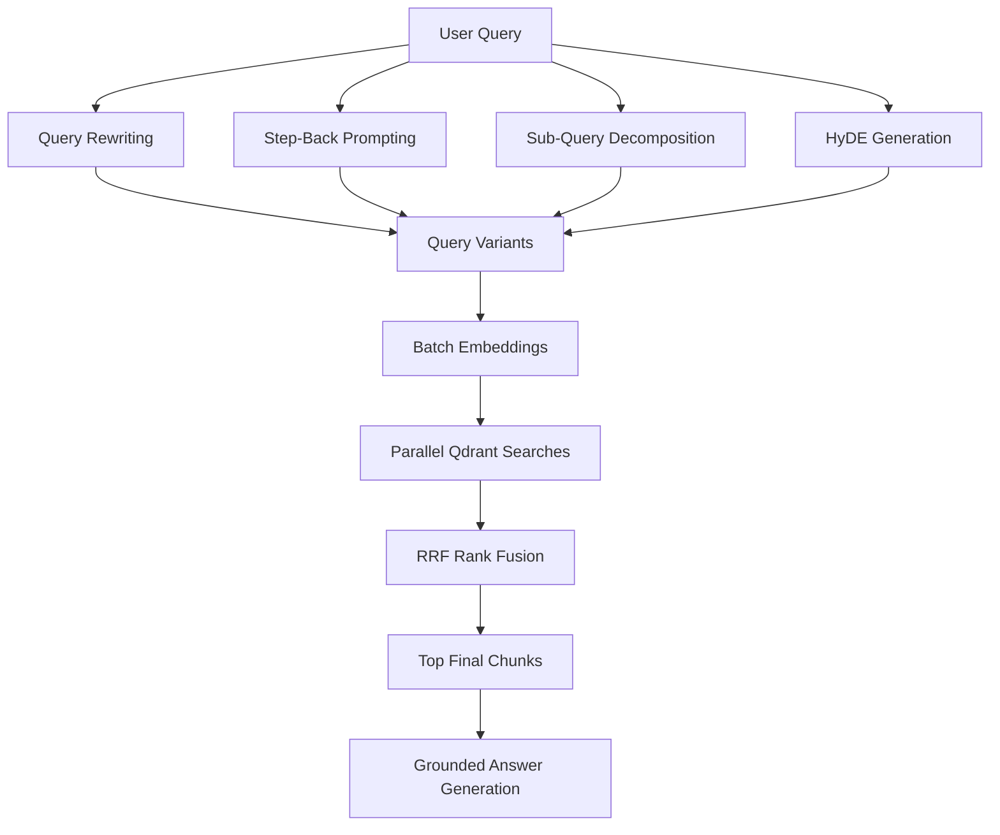
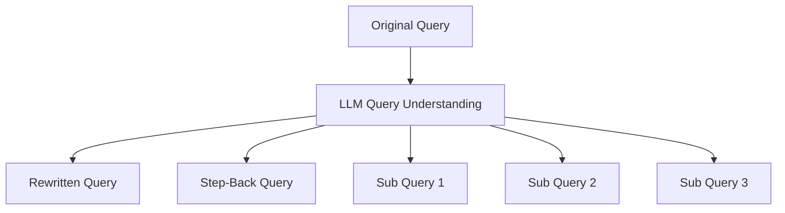
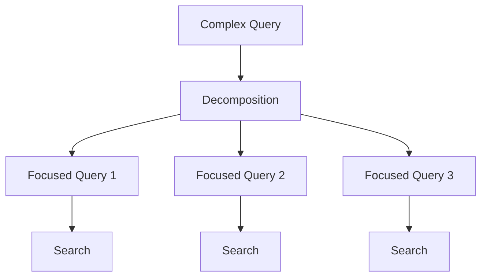
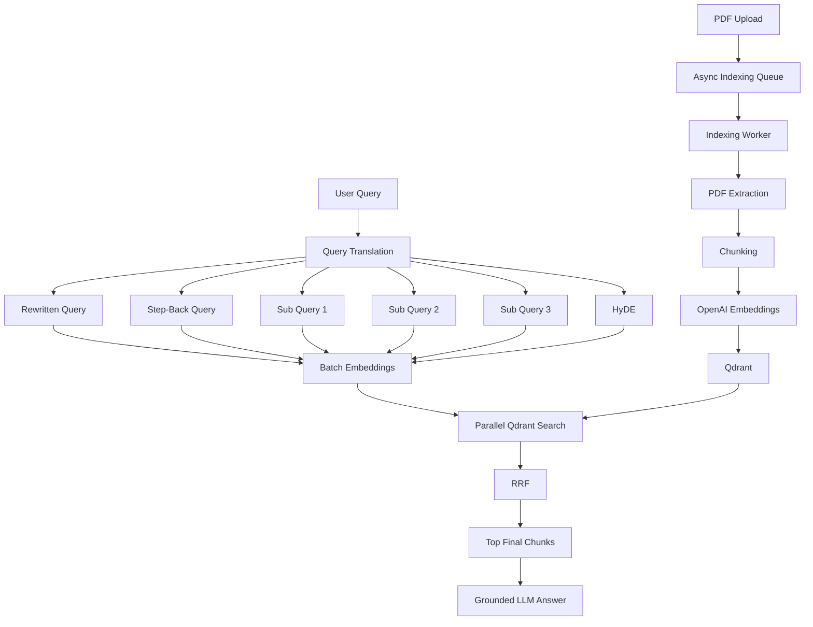

This chapter is the most important retrieval chapter so far, because it connects the indexed Qdrant data to the actual user question. I’ve rewritten it to keep the architecture consistent with Chapters 00–03 and corrected a few conceptual issues—especially the distinction between **advanced retrieval** and the separate `answerQuery()` basic RAG path.

# Chapter 04 — Advanced Retrieval Engine (Query Translation, HyDE & RRF)

## 1. Chapter Goal

In the previous chapters, we built the document indexing side of our RAG system:

```text
PDF
 ↓
Text Extraction
 ↓
Chunking
 ↓
Embeddings
 ↓
Qdrant
```

Now we build the **retrieval side**.

The goal of this chapter is to create:

```text
src/retriever.js
```

This module will take a user's natural-language question and transform it into multiple retrieval perspectives.

Instead of searching Qdrant with only:

```text
User Query
    ↓
Embedding
    ↓
Qdrant
```

we will use:

```text
User Query
    │
    ├── Query Rewriting
    ├── Step-Back Query
    ├── Sub-Queries
    └── HyDE
           │
           ▼
    Multiple Query Variants
           │
           ▼
      Batch Embeddings
           │
           ▼
    Parallel Qdrant Searches
           │
           ▼
    Reciprocal Rank Fusion
           │
           ▼
      Top-K Chunks
```

---

# 2. Why Basic Vector Search Is Not Always Enough

A basic RAG system might perform:

```javascript
const vector = await embedText(query);
const results = await searchByVector(vector);
```

This works, but it has limitations.

### Problem 1 — Poorly phrased queries

A user might ask:

```text
"how chunk overlaping work in rag?"
```

while the document says:

```text
"Chunk overlap preserves contextual continuity between adjacent text segments."
```

The meanings are related, but the wording is very different.

---

### Problem 2 — One query provides only one perspective

Consider:

```text
"How does BullMQ handle failed jobs?"
```

A single embedding represents one interpretation of the question.

Relevant documents might instead discuss:

```text
job retry policies
exponential backoff
failed job processing
worker reliability
transient errors
```

Multiple query formulations increase the chance of finding relevant chunks.

---

### Problem 3 — Query/document language can differ

The user asks:

```text
"What happens when a job fails?"
```

A document might contain:

```text
"Failed jobs are retried according to the configured attempts
and backoff policy."
```

The query is interrogative.

The document is declarative.

HyDE attempts to bridge this gap by generating a hypothetical document-like passage and embedding that passage.

---

# 3. Advanced Retrieval Architecture

The complete retrieval architecture is:



Our query expansion produces up to **6 retrieval variants**:

```text
1. rewritten
2. stepBack
3. hyde
4. subQuery1
5. subQuery2
6. subQuery3
```

Therefore:

```text
1 user query
      ↓
6 retrieval perspectives
      ↓
6 Qdrant searches
      ↓
RRF
      ↓
finalK chunks
```

---

# 4. Complete `src/retriever.js`

Create:

```text
src/retriever.js
```

```javascript id="r8t1cx"
import { config } from "./config.js";
import { qdrant } from "./qdrant.js";
import {
  openai,
  embedText,
  embedTexts,
} from "./openai.js";

/**
 * Generate multiple query representations:
 *
 * - stepBack: broader background question
 * - rewritten: clearer version of the original query
 * - subQueries: three focused questions
 */
export async function queryRewriting(query) {
  const completion = await openai.chat.completions.create({
    model: config.openai.chatModel,
    temperature: 0.2,

    response_format: {
      type: "json_schema",

      json_schema: {
        name: "query_rewriting",

        strict: true,

        schema: {
          type: "object",

          additionalProperties: false,

          properties: {
            stepBack: {
              type: "string",
              description:
                "A broader, higher-level question that provides useful background for the original query.",
            },

            rewritten: {
              type: "string",
              description:
                "The original query with spelling and grammar corrected, made clear and self-contained while preserving its intent.",
            },

            subQueries: {
              type: "array",
              description:
                "Exactly three focused sub-questions derived from the original query.",

              items: {
                type: "string",
              },
            },
          },

          required: [
            "stepBack",
            "rewritten",
            "subQueries",
          ],
        },
      },
    },

    messages: [
      {
        role: "system",

        content:
          "You are a query understanding assistant for a retrieval system. " +
          "Given a user's question, produce query variants that help retrieve relevant documents. " +
          "Apply three techniques: " +
          "(1) step-back prompting: create one broader background question; " +
          "(2) query rewriting: fix spelling and grammar and make the query explicit and self-contained; " +
          "(3) sub-query decomposition: break the original query into exactly three focused sub-questions. " +
          "Respond only with the structured JSON.",
      },

      {
        role: "user",
        content: query,
      },
    ],
  });

  const parsed = JSON.parse(
    completion.choices[0]?.message?.content ?? "{}"
  );

  return {
    stepBack: parsed.stepBack ?? "",

    rewritten: parsed.rewritten ?? query,

    subQueries: Array.isArray(parsed.subQueries)
      ? parsed.subQueries
          .filter(
            (item) =>
              typeof item === "string" &&
              item.trim().length > 0
          )
          .slice(0, 3)
      : [],
  };
}

/**
 * HyDE:
 *
 * Generate a hypothetical document passage that answers
 * the query in a reference-document style.
 */
export async function hydeDocument(query) {
  const completion =
    await openai.chat.completions.create({
      model: config.openai.chatModel,
      temperature: 0.3,

      messages: [
        {
          role: "system",

          content:
            "You are an expert technical writer. " +
            "Write a concise, factual passage of 3-5 sentences " +
            "that directly answers the user's question as if it " +
            "were an excerpt from a relevant reference document. " +
            "Use a neutral, encyclopedic tone.",
        },

        {
          role: "user",
          content: query,
        },
      ],
    });

  return (
    completion.choices[0]?.message?.content?.trim() ?? ""
  );
}

/**
 * Search Qdrant using a single embedding vector.
 */
async function searchByVector(vector) {
  return qdrant.search(
    config.qdrant.collection,
    {
      vector,

      limit: config.retrieval.topK,

      with_payload: true,
    }
  );
}

/**
 * Reciprocal Rank Fusion.
 *
 * Combines multiple ranked result lists into one ranking.
 */
function reciprocalRankFusion(
  rankedLists,
  k = config.retrieval.rrfK
) {
  const fused = new Map();

  for (const { label, hits } of rankedLists) {
    hits.forEach((hit, index) => {
      const rank = index + 1;

      const contribution = 1 / (k + rank);

      const existing = fused.get(hit.id);

      if (existing) {
        existing.rrfScore += contribution;

        existing.bestScore = Math.max(
          existing.bestScore,
          hit.score
        );

        existing.matchedBy.push(label);
      } else {
        fused.set(hit.id, {
          id: hit.id,

          text: hit.payload?.text ?? "",

          source: hit.payload?.source ?? null,

          chunkIndex:
            hit.payload?.chunkIndex ?? null,

          bestScore: hit.score,

          rrfScore: contribution,

          matchedBy: [label],
        });
      }
    });
  }

  return [...fused.values()].sort(
    (a, b) => b.rrfScore - a.rrfScore
  );
}

/**
 * Advanced multi-query retrieval.
 *
 * Query
 *  → rewrite
 *  → step-back
 *  → sub-queries
 *  → HyDE
 *  → embeddings
 *  → Qdrant
 *  → RRF
 *  → final chunks
 */
export async function retrieveChunks(query) {
  // Generate query transformations in parallel.
  const [
    { stepBack, rewritten, subQueries },
    hyde,
  ] = await Promise.all([
    queryRewriting(query),
    hydeDocument(query),
  ]);

  const labelled = [
    {
      label: "rewritten",
      text: rewritten,
    },

    {
      label: "stepBack",
      text: stepBack,
    },

    {
      label: "hyde",
      text: hyde,
    },

    ...subQueries.map((text, index) => ({
      label: `subQuery${index + 1}`,
      text,
    })),
  ].filter(
    (item) =>
      typeof item.text === "string" &&
      item.text.trim().length > 0
  );

  // Embed all query variants in one batch.
  const vectors = await embedTexts(
    labelled.map((item) => item.text)
  );

  // Search Qdrant for all variants in parallel.
  const resultsPerQuery = await Promise.all(
    vectors.map((vector) =>
      searchByVector(vector)
    )
  );

  // Attach labels to each result list.
  const rankedLists = labelled.map(
    (item, index) => ({
      label: item.label,
      hits: resultsPerQuery[index],
    })
  );

  // Fuse all rankings.
  const fused =
    reciprocalRankFusion(rankedLists);

  // Keep only the final configured number of chunks.
  const chunks = fused.slice(
    0,
    config.retrieval.finalK
  );

  return {
    queries: {
      original: query,
      rewritten,
      stepBack,
      hyde,
      subQueries,
    },

    chunks,
  };
}

/**
 * Basic RAG answer pipeline.
 *
 * This function intentionally performs a direct
 * query → embedding → search → answer flow.
 *
 * retrieveChunks() above is the advanced retrieval path.
 */
export async function answerQuery(query) {
  const collection =
    config.qdrant.collection;

  // 1. Embed the original query.
  const vector = await embedText(query);

  // 2. Search Qdrant.
  const hits = await qdrant.search(
    collection,
    {
      vector,

      limit: config.retrieval.topK,

      with_payload: true,
    }
  );

  const sources = hits.map((hit) => ({
    text: hit.payload?.text ?? "",

    source:
      hit.payload?.source ?? null,

    chunkIndex:
      hit.payload?.chunkIndex ?? null,

    score: hit.score,
  }));

  if (sources.length === 0) {
    return {
      query,

      answer:
        "I couldn't find anything relevant in the indexed documents.",

      sources: [],
    };
  }

  // 3. Build grounded context.
  const context = sources
    .map(
      (source, index) =>
        `[Chunk ${index + 1}] ` +
        `(source: ${source.source})\n` +
        source.text
    )
    .join("\n\n");

  // 4. Generate an answer using only the retrieved context.
  const completion =
    await openai.chat.completions.create({
      model: config.openai.chatModel,
      temperature: 0.2,

      messages: [
        {
          role: "system",

          content:
            "You are a helpful assistant. " +
            "Answer the user's question using ONLY the provided context. " +
            "If the answer is not contained in the context, say you don't know. " +
            "Be concise.",
        },

        {
          role: "user",

          content:
            `Context:\n${context}\n\n` +
            `Question: ${query}`,
        },
      ],
    });

  const answer =
    completion.choices[0]?.message?.content
      ?.trim() ?? "";

  return {
    query,
    answer,
    sources,
  };
}
```

---

# 5. Part 1 — Query Rewriting

The first transformation is:

```javascript
queryRewriting(query)
```

It produces:

```text
{
  rewritten,
  stepBack,
  subQueries
}
```

Conceptually:



---

# 6. Structured JSON Output

The implementation uses:

```javascript
response_format: {
  type: "json_schema",
  ...
}
```

The purpose is to tell the model:

> Return data following this specific structure.

Expected structure:

```json
{
  "stepBack": "...",
  "rewritten": "...",
  "subQueries": [
    "...",
    "...",
    "..."
  ]
}
```

This is much safer than asking:

```text
Return JSON.
```

and hoping the model follows the requested structure.

---

# 7. Why `strict: true`?

The schema contains:

```javascript
strict: true
```

This makes the structured output requirement stricter.

We also specify:

```javascript
additionalProperties: false
```

which means the expected object should not contain arbitrary extra fields.

The application can then work with a predictable structure:

```text
stepBack
rewritten
subQueries
```

However, application-level validation is still useful.

Structured output reduces formatting problems, but your application should still treat model output as untrusted external input.

---

# 8. Query Rewriting

The `rewritten` query should preserve the user's intent while making the question clearer.

Example:

```text
Original:
"how chunk overlaping work inrag"
```

Possible rewritten query:

```text
"How does chunk overlap work in a Retrieval-Augmented Generation pipeline?"
```

The important principle is:

```text
Improve wording
      ≠
Change meaning
```

The rewriting model should not invent a completely different question.

---

# 9. Step-Back Prompting

Step-back prompting asks:

> What broader concept would help answer this question?

For example:

```text
Original:
"Why do we use 200-character overlap when chunking PDFs?"
```

A step-back query might be:

```text
"What is document chunking and why is contextual overlap
used in retrieval systems?"
```

The relationship is:

```text
Specific Question
      ↓
Step Back
      ↓
Broader Concept
```

This can retrieve foundational information that a highly specific query might miss.

---

# 10. Sub-Query Decomposition

Complex questions often contain multiple information requirements.

For example:

```text
"How does BullMQ retry failed jobs, how does exponential
backoff work, and how long are completed jobs retained?"
```

Instead of one search, we can create:

```text
SubQuery 1:
How does BullMQ retry failed jobs?

SubQuery 2:
How does exponential backoff work?

SubQuery 3:
How are completed BullMQ jobs retained?
```

Now each question gets an independent search.



---

# 11. A Small Correction About "Exactly 3"

The prompt asks for:

```text
Exactly 3 sub-queries
```

but the application currently does:

```javascript
.slice(0, 3)
```

This means it guarantees:

```text
maximum = 3
```

not:

```text
exactly = 3
```

If the model returns only two valid strings, the application will use two.

That's actually a sensible defensive behavior.

For production, if exactly three are mandatory, validate:

```javascript
if (subQueries.length !== 3) {
  // retry or apply fallback logic
}
```

For this learning pipeline, allowing fewer valid queries is safer than blindly inventing missing queries.

---

# 12. Part 2 — HyDE

HyDE stands for:

> **Hypothetical Document Embeddings**

The core idea is:

```text
User Question
      ↓
LLM
      ↓
Hypothetical Document Passage
      ↓
Embedding
      ↓
Vector Search
```

Instead of embedding only:

```text
"How does BullMQ retry failed jobs?"
```

we ask the model to generate something like:

```text
"BullMQ allows jobs to be retried after failures according
to the configured attempts and backoff settings..."
```

We then embed that passage.

---

# 13. Why HyDE Can Help

There is a language mismatch between:

```text
User Query
```

and:

```text
Reference Document
```

The query might say:

```text
"How does this system retry jobs?"
```

while the document says:

```text
"Failed jobs are automatically retried according to the
configured retry policy."
```

HyDE tries to move the search representation closer to the style of the indexed documents.

```text
Question
   │
   ▼
Hypothetical Answer
   │
   ▼
Embedding
   │
   ▼
Semantic Search
```

---

# 14. Important HyDE Warning

The hypothetical passage is **not trusted factual evidence**.

This is extremely important.

The LLM may generate a plausible but incorrect passage.

For example:

```text
Question
   ↓
HyDE
   ↓
Plausible but incorrect statement
   ↓
Embedding
   ↓
Search
```

The HyDE output is used only as a **retrieval signal**.

It should not be directly presented to the user as a source.

The actual answer must be grounded in the real retrieved documents.

---

# 15. Part 3 — Searching Qdrant

The helper function:

```javascript
async function searchByVector(vector) {
  return qdrant.search(
    config.qdrant.collection,
    {
      vector,
      limit: config.retrieval.topK,
      with_payload: true,
    }
  );
}
```

performs vector search.

Our Chapter 00 configuration specifies:

```env
RETRIEVAL_TOP_K=4
```

Therefore each query variant retrieves up to:

```text
4 chunks
```

For six variants:

```text
6 × 4 = up to 24 candidate results
```

These are then merged using RRF.

---

# 16. Parallel Retrieval

We use:

```javascript
const resultsPerQuery = await Promise.all(
  vectors.map((vector) =>
    searchByVector(vector)
  )
);
```

This is important.

A sequential implementation would do:

```text
Search 1
   ↓
Search 2
   ↓
Search 3
   ↓
Search 4
   ↓
Search 5
   ↓
Search 6
```

That increases latency.

With `Promise.all()`:

```text
             ┌── Search 1
             ├── Search 2
             ├── Search 3
             ├── Search 4
             ├── Search 5
             └── Search 6
                    │
                    ▼
                 Results
```

The searches can execute concurrently.

---

# 17. Part 4 — Reciprocal Rank Fusion

Now we have multiple ranked result lists.

For example:

```text
Rewritten:
1. Chunk A
2. Chunk B
3. Chunk C
4. Chunk D

HyDE:
1. Chunk B
2. Chunk A
3. Chunk E
4. Chunk F

SubQuery1:
1. Chunk A
2. Chunk E
3. Chunk B
4. Chunk G
```

We need to combine them.

That's what **Reciprocal Rank Fusion (RRF)** does.

---

# 18. RRF Formula

The formula is:

$$
RRF(d) =
\sum_{m \in M}
\frac{1}{k + r_m(d)}
$$

Where:

* `d` = document/chunk
* `M` = collection of ranked result lists
* `r_m(d)` = rank of chunk `d` in list `m`
* `k` = smoothing constant
* Our default `k = 60`

The important property is:

> A chunk receives more score when it appears near the top of multiple result lists.

---

# 19. RRF Example

Suppose:

```text
k = 60
```

and Chunk #42 appears:

```text
HyDE       → rank 1
Rewritten  → rank 3
SubQuery1  → rank 2
```

Its score is:

$$
\frac{1}{60+1}
+
\frac{1}{60+3}
+
\frac{1}{60+2}
$$

Approximately:

```text
0.01639
+ 0.01587
+ 0.01613
= 0.04839
```

So:

```text
RRF Score ≈ 0.04839
```

The exact decimal is less important than the principle:

```text
High rank
+
Repeated appearance
=
High fused score
```

---

# 20. Why RRF Instead of Raw Vector Scores?

Different searches can produce similarity scores that are not necessarily directly comparable.

For example:

```text
Search A:
Chunk X → 0.91
Chunk Y → 0.89

Search B:
Chunk X → 0.72
Chunk Z → 0.71
```

Combining raw scores directly can be problematic.

RRF ignores the absolute similarity values and primarily considers:

```text
Where did the chunk rank?
```

Therefore:

```text
Rank 1 → strong contribution
Rank 2 → slightly smaller contribution
Rank 3 → slightly smaller again
```

This makes RRF useful for combining different ranked retrieval strategies.

---

# 21. Understanding `reciprocalRankFusion()`

The implementation begins with:

```javascript
const fused = new Map();
```

The map uses the Qdrant point ID as the key.

Therefore, if:

```text
Chunk A
```

appears in three different search lists, all three occurrences update the same record.

---

## First occurrence

```javascript
fused.set(hit.id, {
  id: hit.id,
  text: hit.payload?.text ?? "",
  source: hit.payload?.source ?? null,
  chunkIndex: hit.payload?.chunkIndex ?? null,
  bestScore: hit.score,
  rrfScore: contribution,
  matchedBy: [label],
});
```

We store:

* point ID
* chunk text
* source
* chunk index
* best raw similarity score
* RRF score
* which query variants retrieved it

---

## Repeated occurrence

If the same chunk appears again:

```javascript
existing.rrfScore += contribution;
```

Its RRF score increases.

We also record:

```javascript
existing.matchedBy.push(label);
```

For example:

```json
{
  "matchedBy": [
    "rewritten",
    "hyde",
    "subQuery1"
  ]
}
```

This is useful for debugging retrieval behavior.

---

# 22. `bestScore` vs `rrfScore`

The object contains both:

```javascript
bestScore
rrfScore
```

These mean different things.

### `bestScore`

The strongest original Qdrant similarity score among the lists where the chunk appeared.

### `rrfScore`

The combined ranking score produced by RRF.

For final ranking:

```javascript
b.rrfScore - a.rrfScore
```

is used.

Therefore:

```text
bestScore → diagnostic information

rrfScore → ranking signal
```

---

# 23. Final Retrieval Pipeline

The main function is:

```javascript
retrieveChunks(query)
```

It performs:

```text
1. Query transformation
        ↓
2. Build labelled variants
        ↓
3. Batch embedding
        ↓
4. Parallel Qdrant search
        ↓
5. RRF fusion
        ↓
6. finalK selection
```

---

# 24. Query Transformation Happens in Parallel

We use:

```javascript
const [
  { stepBack, rewritten, subQueries },
  hyde,
] = await Promise.all([
  queryRewriting(query),
  hydeDocument(query),
]);
```

This means the two LLM operations can execute concurrently.

Instead of:

```text
queryRewriting()
      ↓
hydeDocument()
```

we aim for:

```text
          ┌── queryRewriting()
Query ────┤
          └── hydeDocument()
                 ↓
              Results
```

This reduces unnecessary latency.

---

# 25. Creating Labelled Query Variants

The system creates:

```javascript
const labelled = [
  {
    label: "rewritten",
    text: rewritten,
  },

  {
    label: "stepBack",
    text: stepBack,
  },

  {
    label: "hyde",
    text: hyde,
  },

  ...subQueries.map((text, index) => ({
    label: `subQuery${index + 1}`,
    text,
  })),
];
```

The result can look like:

```text
[
  {
    label: "rewritten",
    text: "..."
  },
  {
    label: "stepBack",
    text: "..."
  },
  {
    label: "hyde",
    text: "..."
  },
  {
    label: "subQuery1",
    text: "..."
  },
  {
    label: "subQuery2",
    text: "..."
  },
  {
    label: "subQuery3",
    text: "..."
  }
]
```

The labels don't affect embedding.

They exist so we can understand where each retrieval result came from.

---

# 26. Batch Embedding

Instead of making six separate embedding calls:

```text
embed(rewritten)
embed(stepBack)
embed(hyde)
embed(subQuery1)
embed(subQuery2)
embed(subQuery3)
```

we call:

```javascript
const vectors = await embedTexts(
  labelled.map((item) => item.text)
);
```

This uses the batching functionality created in Chapter 01.

Conceptually:

```text
6 query variants
       │
       ▼
 embedTexts()
       │
       ▼
One batched embedding operation
       │
       ▼
6 vectors
```

---

# 27. Selecting the Final Chunks

After RRF:

```javascript
const fused =
  reciprocalRankFusion(rankedLists);
```

we apply:

```javascript
const chunks = fused.slice(
  0,
  config.retrieval.finalK
);
```

Chapter 00 configured:

```env
RETRIEVAL_FINAL_K=5
```

Therefore the final retrieval stage returns at most:

```text
5 chunks
```

So the retrieval process becomes:

```text
6 query variants
       ↓
up to 24 candidates
       ↓
RRF
       ↓
Top 5 chunks
```

---

# 28. Important Architecture Detail — `retrieveChunks()` vs `answerQuery()`

There are currently **two retrieval paths** in this file.

### Advanced path

```javascript
retrieveChunks(query)
```

uses:

```text
Query Rewriting
Step-Back
Sub-Queries
HyDE
Batch Embeddings
Parallel Search
RRF
```

### Basic path

```javascript
answerQuery(query)
```

uses:

```text
Original Query
     ↓
Embedding
     ↓
Qdrant Search
     ↓
LLM Answer
```

This is intentional for learning, but it is important to understand that:

> `answerQuery()` currently does **not** use the advanced `retrieveChunks()` pipeline.

If the goal is for the final production query path to use advanced retrieval, `answerQuery()` should eventually call:

```javascript
const { chunks } =
  await retrieveChunks(query);
```

and use those chunks to build the grounded context.

That integration should be done in a later chapter rather than accidentally maintaining two separate retrieval implementations.

---

# 29. Basic `answerQuery()` Flow

The current function starts with:

```javascript
const vector =
  await embedText(query);
```

Then:

```javascript
const hits =
  await qdrant.search(...);
```

Then extracts:

```javascript
const sources = hits.map(...);
```

Then creates context:

```text
[Chunk 1]
chunk text...

[Chunk 2]
chunk text...

[Chunk 3]
chunk text...
```

Finally, the chat model receives:

```text
Context:
...

Question:
...
```

and is instructed:

```text
Answer using ONLY the provided context.
```

This is the grounding step.

---

# 30. Grounded Answer Generation

The important system instruction is:

```javascript
content:
  "You are a helpful assistant. " +
  "Answer the user's question using ONLY the provided context. " +
  "If the answer is not contained in the context, say you don't know. " +
  "Be concise."
```

The desired behavior is:

```text
Retrieved Context
       │
       ▼
      LLM
       │
       ├── Answer found in context
       │       ↓
       │    Answer
       │
       └── Answer missing
               ↓
          "I don't know"
```

This is a basic grounding mechanism.

It does not completely eliminate hallucinations, but it gives the model a strong constraint.

---

# 31. Complete Advanced Retrieval Architecture

After Chapters 00–04, our system now looks like:



We now have both major sides of RAG:

```text
INDEXING
PDF
 ↓
Chunks
 ↓
Embeddings
 ↓
Qdrant


RETRIEVAL
Query
 ↓
Query Expansion
 ↓
Embeddings
 ↓
Qdrant
 ↓
RRF
 ↓
Relevant Chunks
```

---

# 32. Performance Considerations

Advanced retrieval improves recall, but it also increases cost and latency.

A single user query can potentially involve:

```text
Query Rewriting → 1 LLM call
HyDE             → 1 LLM call
Embedding        → 1 batched embedding call
Qdrant           → up to 6 parallel searches
```

Then potentially another LLM call is required for answer generation.

So the architecture trades:

```text
Higher retrieval quality
```

for:

```text
More model/API work
```

This trade-off should be measured rather than assumed to always be beneficial.

A production system may dynamically select strategies depending on query complexity.

For example:

```text
Simple query
    ↓
Direct vector search

Complex query
    ↓
Advanced query expansion + RRF
```

---

# 33. Another Important Production Concern — Tenant Filtering

The current search function:

```javascript
qdrant.search(collection, {
  vector,
  limit,
  with_payload: true,
});
```

does not yet apply tenant or access-control filtering.

That means the current implementation should be considered a **single-tenant learning implementation**.

In a production multi-user RAG system, retrieval should enforce authorization at the vector-search layer.

Conceptually:

```text
User
 ↓
Authenticated Tenant
 ↓
Query
 ↓
Qdrant Search
 ↓
Tenant Filter
 ↓
Only authorized chunks
```

This is critical because filtering after retrieval can be too late if unauthorized documents have already entered the retrieval pipeline.

We will address this when security and production retrieval filtering are introduced.

---

# 34. Chapter Summary

In this chapter, we built the advanced retrieval engine.

### Query rewriting

```javascript
queryRewriting()
```

Generates:

```text
Rewritten Query
Step-Back Query
Sub-Queries
```

### HyDE

```javascript
hydeDocument()
```

Generates a hypothetical document-like passage used as a retrieval representation.

### Vector search

```javascript
searchByVector()
```

Searches Qdrant for the most similar chunks.

### Reciprocal Rank Fusion

```javascript
reciprocalRankFusion()
```

Combines multiple ranked result lists.

### Advanced retrieval

```javascript
retrieveChunks()
```

Combines all strategies:

```text
Query
 ↓
Rewrite + Step-Back + Sub-Queries + HyDE
 ↓
Batch Embeddings
 ↓
Parallel Qdrant Searches
 ↓
RRF
 ↓
Top 5 Chunks
```

### Basic answer pipeline

```javascript
answerQuery()
```

currently demonstrates:

```text
Query
 ↓
Vector Search
 ↓
Context
 ↓
Grounded LLM Answer
```

but does not yet call `retrieveChunks()`.

---

# 35. Final Mental Model

The most important thing to remember from this chapter is:

> **Advanced RAG does not simply mean using a better LLM. It means improving how we transform and retrieve the user's question before generation.**

Our retrieval system now looks like:

```text
                 USER QUESTION
                       │
                       ▼
              ┌─────────────────┐
              │ Query Expansion │
              └────────┬────────┘
                       │
        ┌──────────────┼──────────────┐
        ▼              ▼              ▼
    Rewritten       Step-Back      Sub-Queries
        │              │              │
        └──────────────┼──────────────┘
                       │
                     HyDE
                       │
                       ▼
              Batch Embeddings
                       │
                       ▼
             Parallel Qdrant Search
                       │
                       ▼
                  RRF Fusion
                       │
                       ▼
                 Top 5 Chunks
                       │
                       ▼
                Grounded LLM
                       │
                       ▼
                    ANSWER
```

The key progression is:

```text
Basic RAG
Query → Vector Search → Answer

                ↓

Advanced RAG
Query
 → Query Translation
 → Multiple Representations
 → Multi-Query Retrieval
 → RRF
 → Better Candidate Set
 → Grounded Answer
```

---

# 36. Next Step

In **Chapter 05 — Background Worker Process**, we will connect the queue infrastructure from Chapter 02 with the indexing and retrieval modules built in Chapters 03 and 04.

The worker architecture will become:

```text
                    Redis
                      │
          ┌───────────┴───────────┐
          ▼                       ▼
   file-indexing queue       query queue
          │                       │
          ▼                       ▼
   Indexing Worker           Query Worker
          │                       │
          ▼                       ▼
      indexPdf()           answerQuery()
          │                       │
          ▼                       ▼
       Qdrant              Retrieval + LLM
```

This will turn the individual modules into an actual **asynchronous RAG application architecture**.
