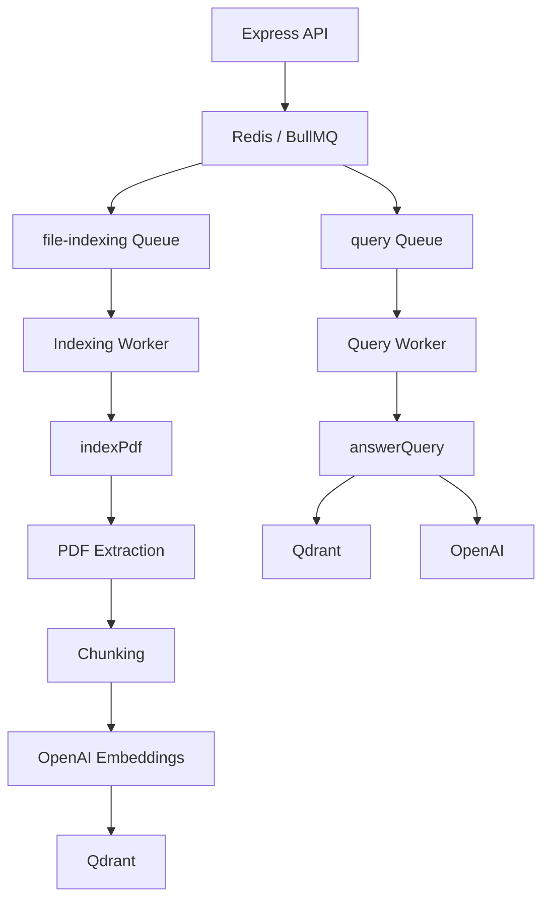
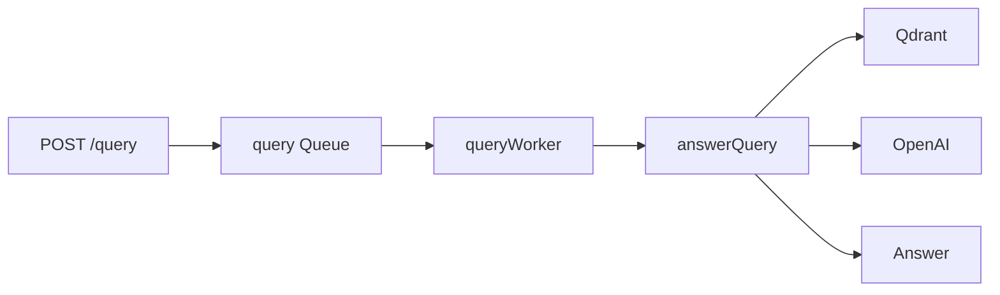
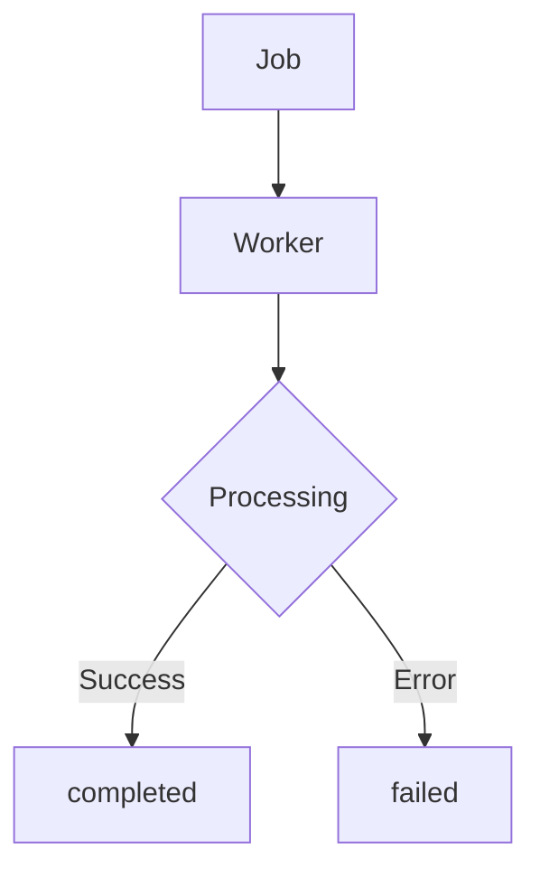
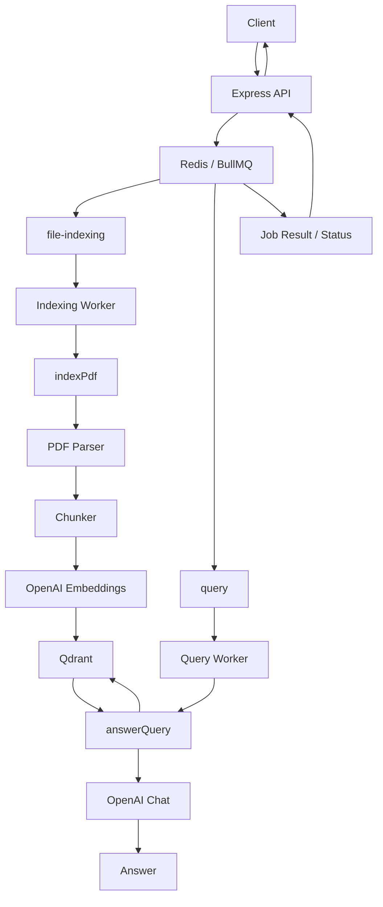
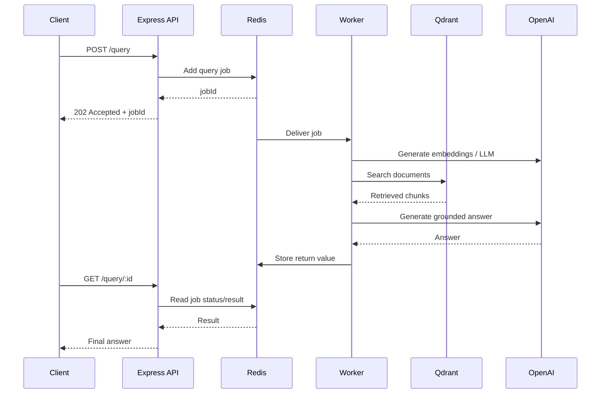

This chapter fits well with the previous queue architecture. I’ve rewritten it with two important clarifications: **BullMQ retry behavior is driven by the queue job options from Chapter 02**, and the current `queryWorker` calls the **basic `answerQuery()` path**, not the advanced `retrieveChunks()` path from Chapter 04. I’ve made that distinction explicit so the architecture stays accurate.

# Chapter 05 — Background Worker Process (`src/worker.js`)

## 1. Chapter Goal

In Chapter 02, we created the BullMQ queues that allow our application to move heavy operations into background jobs.

In Chapter 03, we built the PDF indexing pipeline.

In Chapter 04, we built the retrieval engine.

Now we connect these pieces using **background worker processes**.

The goal of this chapter is to implement:

```text
src/worker.js
```

The worker process consumes jobs from Redis/BullMQ and executes the appropriate operation.

Instead of making the HTTP server perform expensive work directly:

```text
HTTP Request
    ↓
Express
    ↓
Parse PDF
    ↓
Generate embeddings
    ↓
Write to Qdrant
    ↓
Response
```

we use:

```text
HTTP Request
    ↓
Express
    ↓
Create BullMQ Job
    ↓
202 Accepted
```

and separately:

```text
Redis
    ↓
Worker
    ↓
Heavy Processing
    ↓
Result stored with Job
```

This keeps the API server responsive and allows worker capacity to scale independently.

---

# 2. Worker Architecture

Our system has two queues:

```text
file-indexing
query
```

and two corresponding workers:

```text
indexingWorker
queryWorker
```

The architecture is:



The important separation is:

```text
API Process
    ≠
Worker Process
```

The API receives requests.

The worker performs background processing.

---

# 3. Complete `src/worker.js`

Create:

```text
src/worker.js
```

```javascript
import { Worker } from "bullmq";

import { connection } from "./queue.js";

import {
  INDEXING_QUEUE,
  QUERY_QUEUE,
} from "./config.js";

import { indexPdf } from "./indexer.js";

import { answerQuery } from "./retriever.js";

/**
 * Worker responsible for PDF indexing.
 *
 * Pipeline:
 *
 * PDF
 *  → extract text
 *  → chunk
 *  → embed
 *  → upsert into Qdrant
 */
const indexingWorker = new Worker(
  INDEXING_QUEUE,

  async (job) => {
    console.log(
      `📥 Indexing job ${job.id}: ${job.data.originalName}`
    );

    const result = await indexPdf({
      filePath: job.data.filePath,
      originalName: job.data.originalName,
    });

    console.log(
      `   → ${result.chunks} chunk(s) indexed`
    );

    return result;
  },

  {
    connection,
    concurrency: 2,
  }
);

/**
 * Worker responsible for query jobs.
 *
 * Pipeline:
 *
 * Query
 *  → retrieval
 *  → context
 *  → grounded answer
 */
const queryWorker = new Worker(
  QUERY_QUEUE,

  async (job) => {
    console.log(
      `🔎 Query job ${job.id}: ${JSON.stringify(
        job.data.query
      )}`
    );

    const result = await answerQuery(
      job.data.query
    );

    console.log(
      `   → answered using ${result.sources.length} chunk(s)`
    );

    return result;
  },

  {
    connection,
    concurrency: 4,
  }
);

/**
 * Worker lifecycle logging.
 */
for (const [name, worker] of [
  ["indexing", indexingWorker],
  ["query", queryWorker],
]) {
  worker.on("completed", (job) => {
    console.log(
      `✅ [${name}] job ${job.id} completed`
    );
  });

  worker.on("failed", (job, error) => {
    console.error(
      `❌ [${name}] job ${job?.id} failed:`,
      error.message
    );
  });
}

console.log(
  "👷 Workers started (indexing + query). Waiting for jobs..."
);
```

---

# 4. Understanding the Imports

The worker begins with:

```javascript
import { Worker } from "bullmq";
```

`Worker` is the BullMQ component responsible for consuming jobs from a queue.

The relationship is:

```text
Queue
  ↓
stores jobs

Worker
  ↓
consumes jobs
```

---

## Queue Connection

```javascript
import { connection } from "./queue.js";
```

In Chapter 02, we created the shared Redis connection configuration:

```javascript
export const connection = {
  host: config.redis.host,
  port: config.redis.port,
  maxRetriesPerRequest: null,
};
```

The worker uses this connection to communicate with Redis.

---

## Queue Names

```javascript
import {
  INDEXING_QUEUE,
  QUERY_QUEUE,
} from "./config.js";
```

These constants were defined in `config.js`:

```javascript
export const INDEXING_QUEUE = "file-indexing";
export const QUERY_QUEUE = "query";
```

Using constants avoids accidentally using different queue names in different parts of the application.

For example, this would be a bug:

```text
Producer:
file-indexing

Worker:
file-index

```

The worker would never receive the job.

---

# 5. Importing the Processing Functions

The indexing worker imports:

```javascript
import { indexPdf } from "./indexer.js";
```

This is the pipeline created in Chapter 03.

Conceptually:

```text
Worker
  ↓
indexPdf()
  ↓
PDF
  ↓
Chunks
  ↓
Embeddings
  ↓
Qdrant
```

The worker does not implement PDF parsing itself.

That responsibility belongs to `indexPdf()`.

This separation keeps the architecture modular.

---

The query worker imports:

```javascript
import { answerQuery } from "./retriever.js";
```

This executes the query-answering pipeline.

One important architectural detail:

> The current worker calls `answerQuery()`, and the current `answerQuery()` implementation from Chapter 04 uses direct query → vector search → grounded answer.

It does **not yet call `retrieveChunks()`**, which contains the advanced query rewriting, HyDE, and RRF pipeline.

So the current worker architecture is:

```text
queryWorker
    ↓
answerQuery()
    ↓
Basic retrieval
```

If we later integrate:

```javascript
retrieveChunks(query)
```

into `answerQuery()`, the same worker can automatically execute the advanced retrieval pipeline.

---

# 6. Creating the Indexing Worker

The indexing worker is created with:

```javascript
const indexingWorker = new Worker(
  INDEXING_QUEUE,
  async (job) => {
    ...
  },
  {
    connection,
    concurrency: 2,
  }
);
```

There are three important parts:

```text
1. Queue name
2. Job processor
3. Worker options
```

---

# 7. Queue Name

The first argument is:

```javascript
INDEXING_QUEUE
```

which resolves to:

```text
file-indexing
```

Therefore this worker consumes jobs from:

```text
file-indexing
```

The API creates the job.

The worker consumes it.


---

# 8. The Job Processor

The second argument is an asynchronous function:

```javascript
async (job) => {
  ...
}
```

BullMQ calls this function whenever a job is available.

The `job` object contains information such as:

```text
job.id
job.data
job.attemptsMade
job.name
```

Our payload is available through:

```javascript
job.data
```

---

# 9. Reading the Indexing Job Data

The worker logs:

```javascript
console.log(
  `📥 Indexing job ${job.id}: ${job.data.originalName}`
);
```

Suppose the API created:

```javascript
{
  filePath: "/uploads/report.pdf",
  originalName: "report.pdf"
}
```

Then:

```text
job.data.filePath
```

contains:

```text
/uploads/report.pdf
```

and:

```text
job.data.originalName
```

contains:

```text
report.pdf
```

---

# 10. Calling `indexPdf()`

The worker passes the required fields:

```javascript
const result = await indexPdf({
  filePath: job.data.filePath,
  originalName: job.data.originalName,
});
```

This connects the queue system to the indexing pipeline.

The complete flow becomes:

```text
BullMQ Job
    ↓
worker.js
    ↓
indexPdf()
    ↓
read PDF
    ↓
chunk text
    ↓
generate embeddings
    ↓
Qdrant upsert
```

---

# 11. Returning the Result

After indexing:

```javascript
console.log(
  `   → ${result.chunks} chunk(s) indexed`
);

return result;
```

Suppose `indexPdf()` returns:

```javascript
{
  chunks: 14,
  collection: "documents"
}
```

The worker returns that object to BullMQ.

This is important because BullMQ stores the successful job's return value as the job's return value in Redis.

That allows the API to later retrieve the result using the job ID.

The architecture becomes:

```text
Worker
   ↓
return result
   ↓
BullMQ
   ↓
Redis
   ↓
GET /query/:id
   ↓
Client
```

---

# 12. Creating the Query Worker

The second worker is:

```javascript
const queryWorker = new Worker(
  QUERY_QUEUE,

  async (job) => {
    ...
  },

  {
    connection,
    concurrency: 4,
  }
);
```

It consumes:

```text
query
```

jobs.

The flow is:



---

# 13. Processing the Query

The worker receives:

```javascript
job.data.query
```

and passes it to:

```javascript
const result = await answerQuery(
  job.data.query
);
```

For example:

```javascript
{
  query: "How does BullMQ retry failed jobs?"
}
```

becomes:

```text
answerQuery(
  "How does BullMQ retry failed jobs?"
)
```

---

# 14. Logging the Query

The worker uses:

```javascript
JSON.stringify(job.data.query)
```

instead of directly printing the query.

This makes the logged value explicit as a JSON string.

For example:

```text
🔎 Query job 123: "How does BullMQ retry failed jobs?"
```

In production, be careful about logging arbitrary user queries because they may contain sensitive information.

Logging should follow the application's privacy and observability requirements.

---

# 15. Query Worker Result

After processing:

```javascript
console.log(
  `   → answered using ${result.sources.length} chunk(s)`
);

return result;
```

The result from `answerQuery()` might look like:

```javascript
{
  query: "How does BullMQ retry failed jobs?",

  answer: "BullMQ retries failed jobs according to...",
  
  sources: [
    {
      text: "...",
      source: "bullmq.pdf",
      chunkIndex: 4,
      score: 0.82
    }
  ]
}
```

That object is returned to BullMQ and becomes the job's return value.

---

# 16. Understanding Concurrency

The two workers use different concurrency values:

```javascript
{
  connection,
  concurrency: 2,
}
```

and:

```javascript
{
  connection,
  concurrency: 4,
}
```

Concurrency controls how many jobs **one worker process** can process at the same time.

It does not mean:

```text
concurrency = number of workers
```

Instead:

```text
One worker process
    │
    ├── Job 1
    ├── Job 2
    └── waiting...
```

with concurrency `2`.

---

# 17. Why Indexing Uses Concurrency 2

PDF indexing can be relatively expensive.

A single indexing job may perform:

```text
Read PDF
    ↓
Extract text
    ↓
Create many chunks
    ↓
Generate embeddings
    ↓
Send data to Qdrant
```

Multiple large PDFs can increase:

* memory usage
* OpenAI API traffic
* Qdrant write traffic
* CPU usage

Therefore we start conservatively:

```text
Indexing Worker
concurrency = 2
```

This is not a universal optimal value.

The correct production value should be determined using measurements such as:

```text
PDF size
chunk count
embedding latency
memory usage
API rate limits
worker CPU
Qdrant throughput
```

---

# 18. Why Query Uses Concurrency 4

Query jobs typically spend significant time waiting for network operations:

```text
OpenAI
   ↓
Qdrant
   ↓
OpenAI
```

Therefore a worker can often handle multiple jobs concurrently while previous jobs are waiting on I/O.

We use:

```text
Query Worker
concurrency = 4
```

Again, this is a starting configuration rather than a guaranteed optimal number.

---

# 19. Worker Concurrency vs Process Scaling

These are two different concepts.

### Concurrency

One Node.js worker process handles multiple jobs:

```text
Worker Process
 ├── Job A
 ├── Job B
 ├── Job C
 └── Job D
```

### Horizontal scaling

Run multiple worker processes:

```text
                 Redis
                   │
       ┌───────────┼───────────┐
       ▼           ▼           ▼
   Worker 1    Worker 2    Worker 3
```

BullMQ distributes jobs among workers connected to the same queue.

Therefore, if one worker process is not enough, we can run more worker processes.

---

# 20. Worker Event Hooks

We register:

```javascript
worker.on("completed", ...)
```

and:

```javascript
worker.on("failed", ...)
```

These are lifecycle events.

The architecture is:



---

# 21. `completed` Event

The code is:

```javascript
worker.on("completed", (job) => {
  console.log(
    `✅ [${name}] job ${job.id} completed`
  );
});
```

When the worker successfully finishes a job:

```text
completed
```

is emitted.

Example:

```text
✅ [indexing] job 42 completed
```

This is useful for basic monitoring and debugging.

---

# 22. `failed` Event

The code is:

```javascript
worker.on("failed", (job, error) => {
  console.error(
    `❌ [${name}] job ${job?.id} failed:`,
    error.message
  );
});
```

If the processor throws an error:

```javascript
throw new Error("Qdrant connection failed");
```

BullMQ marks the attempt as failed and emits the `failed` event.

We log:

```text
job ID
worker type
error message
```

---

# 23. Why We Must Not Swallow Errors

This is extremely important for BullMQ.

Consider:

```javascript
async (job) => {
  try {
    await indexPdf(...);
  } catch (error) {
    console.error(error);
  }
}
```

The function finishes successfully after logging the error.

BullMQ may therefore treat the job as completed.

That prevents the retry mechanism from working correctly.

Instead:

```javascript
async (job) => {
  const result = await indexPdf(...);

  return result;
}
```

If `indexPdf()` throws:

```text
indexPdf()
   ↓
throws error
   ↓
worker processor rejects
   ↓
BullMQ marks attempt failed
```

This allows configured retries to work.

---

# 24. How Retries Connect to Chapter 02

In Chapter 02, we configured indexing jobs with:

```javascript
{
  attempts: 3,
  backoff: {
    type: "exponential",
    delay: 2000,
  },
}
```

Therefore the retry policy belongs to the **job options** when the job is added to the queue.

Conceptually:

```text
Producer
   ↓
Queue.add()
   ↓
attempts: 3
backoff: exponential
   ↓
Worker
   ↓
failure
   ↓
retry if attempts remain
```

The worker itself does not need to manually call:

```javascript
job.retry()
```

for this normal retry configuration.

---

# 25. Example Retry Flow

Suppose an indexing job fails because Qdrant is temporarily unavailable.

The lifecycle can look like:

```text
Attempt 1
   ↓
Qdrant failure
   ↓
Retry

Attempt 2
   ↓
Qdrant failure
   ↓
Retry

Attempt 3
   ↓
Success
   ↓
completed
```

If every attempt fails:

```text
Attempt 1 → failed
Attempt 2 → failed
Attempt 3 → failed
                    ↓
              permanently failed
```

The job's failure information can then be inspected by the API or monitoring system.

---

# 26. A Subtle but Important Point About Retries

Retries are useful for **transient failures**:

```text
temporary network failure
temporary Qdrant outage
temporary API failure
rate-limit related failure
```

But retries cannot fix permanent configuration errors.

For example:

```text
Invalid OpenAI API key
```

will likely fail every time.

Repeated retries only waste time and API resources.

A production system should eventually distinguish between:

```text
Retryable error
```

and:

```text
Permanent error
```

and apply appropriate policies.

---

# 27. Starting the Workers

The final log is:

```javascript
console.log(
  "👷 Workers started (indexing + query). Waiting for jobs..."
);
```

This message indicates that the process has created both workers and is now waiting for jobs.

Run it with:

```bash
npm run worker
```

because Chapter 00 defined:

```json
{
  "scripts": {
    "worker": "node src/worker.js"
  }
}
```

---

# 28. Expected Output

When everything is running correctly:

```text
👷 Workers started (indexing + query). Waiting for jobs...
```

After an indexing job arrives:

```text
📥 Indexing job 1: document.pdf
   → 14 chunk(s) indexed
✅ [indexing] job 1 completed
```

After a query job:

```text
🔎 Query job 2: "How does chunk overlap work?"
   → answered using 5 chunk(s)
✅ [query] job 2 completed
```

If something fails:

```text
❌ [indexing] job 3 failed: Qdrant connection refused
```

---

# 29. Complete End-to-End Architecture

At this point, our architecture looks like:



The major architectural separation is:

```text
                    APPLICATION
                        │
          ┌─────────────┴─────────────┐
          │                           │
       API SERVER                 WORKERS
          │                           │
          ▼                           ▼
      HTTP Requests              Heavy Jobs
          │                           │
          └──────────► Redis ◄────────┘
```

---

# 30. One Important Improvement for the Next Version

There is currently a naming/architecture distinction worth remembering.

Chapter 04 created:

```javascript
retrieveChunks(query)
```

which implements:

```text
Query Rewriting
Step-Back
Sub-Queries
HyDE
Batch Embeddings
Parallel Search
RRF
```

But the query worker currently executes:

```javascript
answerQuery(query)
```

and `answerQuery()` currently performs:

```text
Query
 ↓
Embedding
 ↓
Qdrant Search
 ↓
LLM
```

Therefore the current system is not yet using the advanced retrieval engine inside the asynchronous query worker.

The eventual architecture should become:

```text
Query Worker
     ↓
answerQuery()
     ↓
retrieveChunks()
     ↓
Query Expansion
     ↓
HyDE
     ↓
RRF
     ↓
Top Chunks
     ↓
Grounded LLM
```

This can be integrated when we connect the advanced retrieval pipeline to the API/query workflow.

---

# 31. Production Considerations

The current worker is intentionally simple and suitable for learning.

A production worker system would normally add:

### Graceful shutdown

When the process receives:

```text
SIGTERM
SIGINT
```

workers should stop accepting new jobs and finish active work before exiting.

### Better logging

Instead of only:

```text
console.log()
```

production systems commonly use structured logs containing:

```text
jobId
queue
duration
attempt
error
documentId
requestId
```

### Monitoring

Track:

```text
completed jobs
failed jobs
retry count
processing duration
queue depth
worker utilization
```

### Job cleanup

Chapter 02 already configured:

```javascript
removeOnComplete
removeOnFail
```

These cleanup policies prevent Redis from growing indefinitely.

### Resource limits

PDF processing should have limits for:

```text
file size
page count
chunk count
embedding batch size
```

---

# 32. Summary

In this chapter, we created:

```text
src/worker.js
```

with two independent BullMQ workers.

### Indexing Worker

```javascript
indexingWorker
```

Consumes:

```text
file-indexing
```

and executes:

```javascript
indexPdf()
```

Pipeline:

```text
PDF
 ↓
Text Extraction
 ↓
Chunking
 ↓
Embeddings
 ↓
Qdrant
```

---

### Query Worker

```javascript
queryWorker
```

Consumes:

```text
query
```

and executes:

```javascript
answerQuery()
```

Current pipeline:

```text
Query
 ↓
Embedding
 ↓
Qdrant
 ↓
Context
 ↓
LLM
 ↓
Answer
```

The advanced `retrieveChunks()` + RRF pipeline from Chapter 04 can be integrated into this path later.

---

### Concurrency

```text
Indexing Worker → 2
Query Worker    → 4
```

These are starting values that should eventually be tuned based on workload and resource limits.

---

### Events

We added:

```javascript
completed
failed
```

for basic worker monitoring.

---

### Retry behavior

Failures propagate naturally from the worker handler to BullMQ, allowing the retry policy configured when jobs are added to the queue to take effect.

---

# 33. Final Mental Model

The key idea of this chapter is:

> **The API should accept work; workers should perform work.**

Instead of:

```text
Client
  ↓
Express
  ↓
Heavy Processing
  ↓
Long HTTP Request
```

we build:

```text
Client
  ↓
Express
  ↓
Queue
  ↓
202 Accepted


Worker
  ↓
Process Job
  ↓
Store Result


Client
  ↓
Poll Job
  ↓
Receive Result
```

This architecture provides:

```text
API responsiveness
        +
Background processing
        +
Retry support
        +
Independent concurrency
        +
Horizontal scalability
```

That is the foundation for turning our RAG prototype into a more production-oriented asynchronous system.

---

# 34. Next Step

In **Chapter 06 — Express REST Server & Polling Endpoints**, we will connect the client-facing API to these workers.

We will implement:

```text
POST /index
POST /query
GET  /query/:id
GET  /health
```

The complete request flow will become:



At that point, the individual components we built in Chapters 00–05 will start behaving as one complete asynchronous RAG application.
