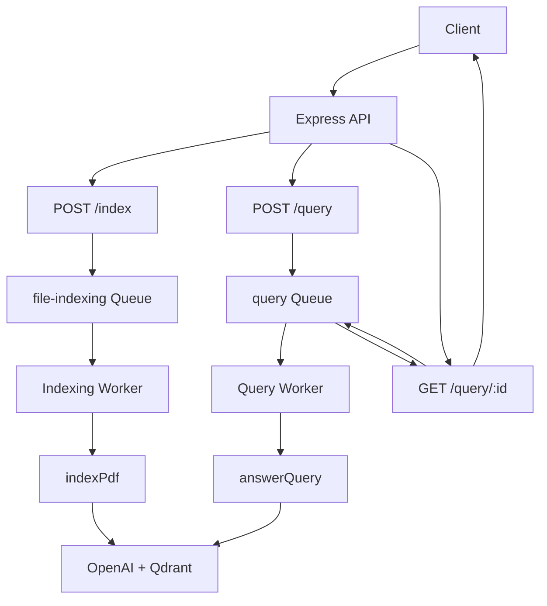
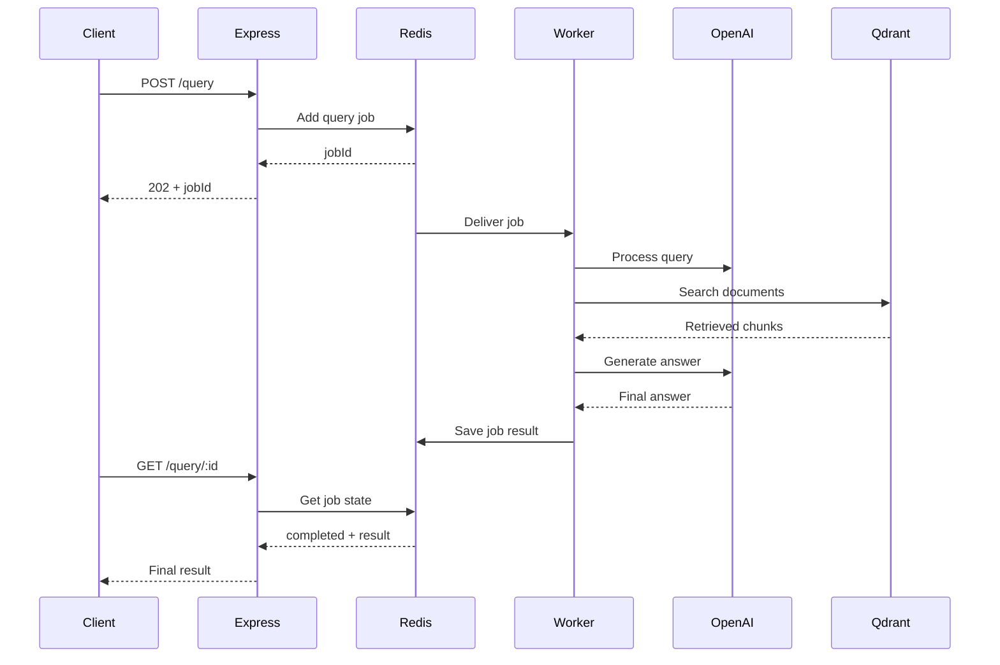
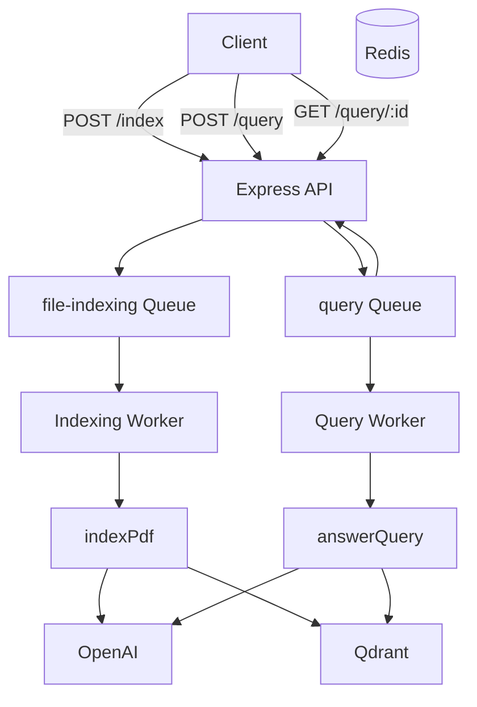

Absolutely. I’d rewrite this chapter in the same style as Chapters 00–05, but I’d make a few technical corrections while doing it:

* Clarify that `POST /query` currently queues `answerQuery()`, which is the basic retrieval path from Chapter 04.
* Explain why `202 Accepted` is appropriate for asynchronous jobs.
* Correct the wording around the five BullMQ states: there are additional states such as `waiting-children` in BullMQ, although they aren't used by this simple workflow.
* Explain an important failure case: **if a job is removed by `removeOnComplete`/`removeOnFail`, polling can eventually return `404` even though the job previously existed.**
* Explain that the current PDF validation checks the uploaded MIME type, but MIME type alone is not a complete security guarantee.
* Explain the `202` → polling architecture clearly from the client perspective.
* Keep the full code first, followed by block-by-block explanations and Mermaid diagrams.

# Chapter 06 — Express REST Server & Polling Endpoints (`src/index.js`)

## 1. Chapter Goal

In the previous chapters, we built the major internal components of our asynchronous RAG system:

```text
Chapter 00 → Infrastructure
Chapter 01 → OpenAI + Qdrant clients
Chapter 02 → BullMQ + Redis queues
Chapter 03 → PDF indexing pipeline
Chapter 04 → Advanced retrieval engine
Chapter 05 → Background workers
```

Now we need a component that connects the outside world to these internal services.

That component is our **Express REST API server**.

We will implement:

```text
src/index.js
```

The API server acts as the public entry point for clients such as:

* Postman
* cURL
* Web applications
* Mobile applications
* Frontend clients

The server exposes four main endpoints:

| Method | Endpoint     | Purpose                                |
| ------ | ------------ | -------------------------------------- |
| `GET`  | `/health`    | Verify that the API is running         |
| `POST` | `/index`     | Upload a PDF and queue an indexing job |
| `POST` | `/query`     | Queue a RAG query                      |
| `GET`  | `/query/:id` | Poll the query job status/result       |

The most important design principle is:

> **The Express server should accept work quickly and let background workers perform the expensive work.**

---

# 2. High-Level Architecture

The complete asynchronous flow is:



For an indexing request:

```text
Client
  ↓
POST /index
  ↓
Express
  ↓
BullMQ
  ↓
Redis
  ↓
Indexing Worker
  ↓
PDF → Chunks → Embeddings → Qdrant
```

For a query:

```text
Client
  ↓
POST /query
  ↓
Express
  ↓
BullMQ
  ↓
Redis
  ↓
Query Worker
  ↓
RAG Processing
  ↓
Result stored on Job
```

The client can then poll:

```text
GET /query/:id
```

until the job is completed.

---

# 3. Why We Need Asynchronous Endpoints

Imagine a user uploads a large PDF.

The indexing pipeline may need to:

```text
Read PDF
   ↓
Extract text
   ↓
Create chunks
   ↓
Generate embeddings
   ↓
Write vectors to Qdrant
```

If Express performed all of this directly inside:

```text
POST /index
```

the HTTP request could remain open for a long time.

Instead, we do:

```text
POST /index
      ↓
Create Job
      ↓
Return 202
```

The worker processes the job separately.

The same idea applies to queries.

This gives us:

```text
Fast API response
       +
Background processing
       +
Retry support
       +
Independent worker scaling
```

---

# 4. Complete `src/index.js`

Create:

```text
src/index.js
```

```javascript
import express from "express";
import multer from "multer";
import path from "node:path";
import fs from "node:fs";
import crypto from "node:crypto";
import { fileURLToPath } from "node:url";

import { config } from "./config.js";

import {
  enqueueIndexingJob,
  enqueueQueryJob,
  queryQueue,
} from "./queue.js";

/*
 * Recreate __dirname for Node.js ESM.
 */
const __dirname = path.dirname(
  fileURLToPath(import.meta.url)
);

/*
 * Store uploaded files outside src/.
 */
const uploadDir = path.join(
  __dirname,
  "..",
  "uploads"
);

/*
 * Make sure the upload directory exists.
 */
fs.mkdirSync(uploadDir, {
  recursive: true,
});

/*
 * Multer disk storage.
 *
 * Uploaded files are given unique server-side names
 * so two uploads cannot easily overwrite each other.
 */
const storage = multer.diskStorage({
  destination: (_req, _file, cb) => {
    cb(null, uploadDir);
  },

  filename: (_req, file, cb) => {
    const unique =
      `${Date.now()}-${crypto.randomUUID()}`;

    cb(
      null,
      `${unique}${path.extname(file.originalname)}`
    );
  },
});

/*
 * Multer upload configuration.
 */
const upload = multer({
  storage,

  limits: {
    fileSize: 25 * 1024 * 1024, // 25 MB
  },

  fileFilter: (_req, file, cb) => {
    if (file.mimetype === "application/pdf") {
      return cb(null, true);
    }

    cb(
      new Error("Only PDF files are allowed")
    );
  },
});

/*
 * Create Express application.
 */
const app = express();

/*
 * Parse JSON request bodies.
 */
app.use(express.json());

/*
 * ----------------------------------------------------
 * GET /health
 * ----------------------------------------------------
 */
app.get("/health", (_req, res) => {
  return res.json({
    status: "ok",
  });
});

/*
 * ----------------------------------------------------
 * POST /index
 *
 * Upload PDF and enqueue indexing job.
 * ----------------------------------------------------
 */
app.post(
  "/index",
  upload.single("file"),

  async (req, res) => {
    /*
     * Multer places the uploaded file
     * inside req.file.
     */
    if (!req.file) {
      return res
        .status(400)
        .json({
          error:
            "No PDF file uploaded (field: 'file')",
        });
    }

    try {
      const job = await enqueueIndexingJob({
        filePath: req.file.path,
        originalName: req.file.originalname,
        mimeType: req.file.mimetype,
        size: req.file.size,
      });

      return res
        .status(202)
        .json({
          message:
            "File uploaded and queued for indexing",

          jobId: job.id,

          file: {
            originalName:
              req.file.originalname,

            storedAs:
              req.file.filename,

            size:
              req.file.size,
          },
        });
    } catch (error) {
      console.error(
        "Failed to enqueue indexing job:",
        error
      );

      /*
       * The file has already been written to disk
       * at this point.
       *
       * If queue insertion fails, remove the
       * orphaned uploaded file.
       */
      try {
        await fs.promises.unlink(
          req.file.path
        );
      } catch {
        // Ignore cleanup errors.
      }

      return res
        .status(500)
        .json({
          error:
            "Failed to queue file for indexing",
        });
    }
  }
);

/*
 * ----------------------------------------------------
 * POST /query
 *
 * Enqueue a RAG query.
 * ----------------------------------------------------
 */
app.post(
  "/query",
  async (req, res) => {
    const query =
      req.body?.query;

    if (
      typeof query !== "string" ||
      query.trim().length === 0
    ) {
      return res
        .status(400)
        .json({
          error:
            "Body must include a non-empty 'query' string",
        });
    }

    try {
      const job =
        await enqueueQueryJob({
          query: query.trim(),
        });

      return res
        .status(202)
        .json({
          message: "Query queued",

          jobId: job.id,

          poll:
            `/query/${job.id}`,
        });
    } catch (error) {
      console.error(
        "Failed to enqueue query job:",
        error
      );

      return res
        .status(500)
        .json({
          error:
            "Failed to queue query",
        });
    }
  }
);

/*
 * ----------------------------------------------------
 * GET /query/:id
 *
 * Poll query job status/result.
 * ----------------------------------------------------
 */
app.get(
  "/query/:id",
  async (req, res) => {
    try {
      const job =
        await queryQueue.getJob(
          req.params.id
        );

      if (!job) {
        return res
          .status(404)
          .json({
            error: "Job not found",
          });
      }

      const state =
        await job.getState();

      /*
       * Successful job.
       */
      if (state === "completed") {
        return res.json({
          jobId: job.id,
          status: state,
          result: job.returnvalue,
        });
      }

      /*
       * Permanently failed job.
       */
      if (state === "failed") {
        return res
          .status(200)
          .json({
            jobId: job.id,
            status: state,
            error: job.failedReason,
          });
      }

      /*
       * waiting | active | delayed | paused
       */
      return res.json({
        jobId: job.id,
        status: state,
      });
    } catch (error) {
      console.error(
        "Failed to fetch query job:",
        error
      );

      return res
        .status(500)
        .json({
          error:
            "Failed to fetch job",
        });
    }
  }
);

/*
 * ----------------------------------------------------
 * Error handler
 *
 * Handles Multer and route errors.
 * ----------------------------------------------------
 */
app.use(
  (
    error,
    _req,
    res,
    _next
  ) => {
    console.error(error);

    return res
      .status(400)
      .json({
        error:
          error.message,
      });
  }
);

/*
 * Start HTTP server.
 */
app.listen(
  config.port,
  () => {
    console.log(
      `🚀 Server listening on http://localhost:${config.port}`
    );
  }
);
```

---

# 5. Importing Express and Supporting Modules

We start with:

```javascript
import express from "express";
import multer from "multer";
```

`express` provides the HTTP server and routing layer.

`multer` handles:

```text
multipart/form-data
```

which is required for file uploads.

---

We also import Node.js built-in modules:

```javascript
import path from "node:path";
import fs from "node:fs";
import crypto from "node:crypto";
import { fileURLToPath } from "node:url";
```

Their purposes are:

| Module   | Purpose                                          |
| -------- | ------------------------------------------------ |
| `path`   | Safely construct filesystem paths                |
| `fs`     | Create/remove files and directories              |
| `crypto` | Generate unique IDs                              |
| `url`    | Convert `import.meta.url` into a filesystem path |

---

# 6. ESM and `__dirname`

Our project uses:

```json
{
  "type": "module"
}
```

Therefore Node.js runs the project as ES Modules.

In CommonJS, developers often use:

```javascript
__dirname
```

But `__dirname` is not automatically available in native Node.js ESM.

We recreate it:

```javascript
const __dirname = path.dirname(
  fileURLToPath(import.meta.url)
);
```

The flow is:

```text
import.meta.url
      ↓
fileURLToPath()
      ↓
Filesystem path
      ↓
path.dirname()
      ↓
Directory containing index.js
```

---

# 7. Creating the Upload Directory

We define:

```javascript
const uploadDir = path.join(
  __dirname,
  "..",
  "uploads"
);
```

Assuming:

```text
project/
├── src/
│   └── index.js
└── uploads/
```

the resulting directory is:

```text
project/uploads
```

We then create it:

```javascript
fs.mkdirSync(uploadDir, {
  recursive: true,
});
```

`recursive: true` means Node.js creates missing parent directories if necessary.

---

# 8. Configuring Multer

Multer controls how uploaded files are handled.

We create disk storage:

```javascript
const storage = multer.diskStorage({
  destination: ...,
  filename: ...,
});
```

This means:

```text
Incoming PDF
     ↓
Multer
     ↓
uploads/
     ↓
Stored on disk
```

This is useful because the background worker needs a file path that remains available after the HTTP request finishes.

---

# 9. Why Store the File on Disk?

Consider this:

```text
POST /index
     ↓
Upload PDF
     ↓
Queue Job
     ↓
HTTP request finishes
```

The worker may execute several seconds later.

Therefore the worker needs the PDF to remain accessible.

We pass:

```javascript
filePath: req.file.path
```

to the queue.

Later:

```text
Worker
  ↓
job.data.filePath
  ↓
indexPdf()
  ↓
fs.readFile()
```

The file therefore survives beyond the lifetime of the HTTP request.

---

# 10. Generating a Unique Filename

The upload filename is generated with:

```javascript
const unique =
  `${Date.now()}-${crypto.randomUUID()}`;
```

For example:

```text
1741200000000-a1b2c3d4-....pdf
```

The original filename might be:

```text
report.pdf
```

but the stored filename becomes something like:

```text
1741200000000-550e8400-e29b-41d4-a716-446655440000.pdf
```

This reduces the chance of filename collisions.

We preserve the original extension:

```javascript
path.extname(file.originalname)
```

For:

```text
report.pdf
```

this returns:

```text
.pdf
```

---

# 11. Important Filename Security Principle

We should **not** directly use:

```javascript
file.originalname
```

as the server-side filename.

A user could upload:

```text
important-file.pdf
```

or potentially attempt problematic filenames.

Instead:

```text
User filename
     ↓
Keep as metadata
     ↓
Generate server-side unique filename
```

So we maintain:

```text
originalName → user-facing metadata
storedAs     → internal filesystem filename
```

---

# 12. Multer File Size Limit

We configure:

```javascript
limits: {
  fileSize: 25 * 1024 * 1024,
}
```

which equals:

```text
25 MB
```

The calculation is:

```text
25 × 1024 × 1024
= 26,214,400 bytes
```

This prevents very large uploads from consuming unlimited disk space.

In production, the appropriate limit should depend on the application's requirements.

---

# 13. PDF Validation

The upload filter is:

```javascript
fileFilter: (_req, file, cb) => {
  if (file.mimetype === "application/pdf") {
    return cb(null, true);
  }

  cb(
    new Error("Only PDF files are allowed")
  );
}
```

The expected MIME type is:

```text
application/pdf
```

For example:

```text
report.pdf
MIME: application/pdf
```

is accepted.

A PNG:

```text
image.png
MIME: image/png
```

is rejected.

---

# 14. MIME Type Is Not a Complete Security Check

An important production consideration:

> `file.mimetype` comes from the uploaded request and should not be treated as proof that the file's contents are actually a valid PDF.

A stronger production upload pipeline can additionally inspect:

```text
File signature / magic bytes
       ↓
PDF parser validation
       ↓
Page/file limits
       ↓
Optional malware scanning
```

For this learning project, MIME validation plus parser handling and a file-size limit are reasonable starting controls.

---

# 15. Creating the Express Application

We create:

```javascript
const app = express();
```

Then enable JSON parsing:

```javascript
app.use(express.json());
```

This allows requests such as:

```http
POST /query
Content-Type: application/json
```

with:

```json
{
  "query": "What is the main conclusion?"
}
```

to be accessed through:

```javascript
req.body.query
```

---

# 16. `GET /health`

The health endpoint is:

```javascript
app.get("/health", (_req, res) => {
  return res.json({
    status: "ok",
  });
});
```

Calling:

```text
GET /health
```

returns:

```json
{
  "status": "ok"
}
```

This endpoint is useful for:

* development
* Docker health checks
* load balancers
* uptime monitoring
* deployment verification

---

# 17. `POST /index`

The indexing endpoint is:

```javascript
app.post(
  "/index",
  upload.single("file"),
  async (req, res) => {
    ...
  }
);
```

There are two important pieces:

```text
upload.single("file")
```

and:

```text
async (req, res)
```

Multer processes the uploaded file first.

If successful, it places the uploaded file inside:

```javascript
req.file
```

---

# 18. Expected Multipart Request

The client must send:

```text
field name = file
```

For example:

```bash
curl -X POST http://localhost:8000/index \
  -F "file=@/path/to/sample.pdf"
```

The important part is:

```text
file=@sample.pdf
```

because the server expects:

```javascript
upload.single("file")
```

---

# 19. Checking for a Missing File

We check:

```javascript
if (!req.file) {
  return res
    .status(400)
    .json({
      error:
        "No PDF file uploaded (field: 'file')",
    });
}
```

If the client forgets to upload the PDF:

```text
HTTP 400 Bad Request
```

is returned.

This is a client-side validation error.

---

# 20. Creating the Indexing Job

After the file is stored:

```javascript
const job = await enqueueIndexingJob({
  filePath: req.file.path,
  originalName: req.file.originalname,
  mimeType: req.file.mimetype,
  size: req.file.size,
});
```

The API sends metadata to BullMQ.

The worker will later receive:

```javascript
job.data
```

containing:

```javascript
{
  filePath,
  originalName,
  mimeType,
  size
}
```

---

# 21. Why Return `202 Accepted`?

The server does **not** wait for indexing to finish.

It only confirms:

```text
File received
       ↓
Job successfully added to queue
```

Therefore we return:

```http
202 Accepted
```

This is different from:

```http
200 OK
```

Conceptually:

```text
200 OK
→ Work completed successfully.

202 Accepted
→ Request accepted, processing will happen asynchronously.
```

This distinction is important for our architecture.

---

# 22. Indexing Response

A successful request returns:

```json
{
  "message": "File uploaded and queued for indexing",
  "jobId": "1",
  "file": {
    "originalName": "sample.pdf",
    "storedAs": "1741200000000-a1b2c3d4.pdf",
    "size": 145020
  }
}
```

The client now knows:

```text
jobId = 1
```

The client does not need to keep the upload request open.

---

# 23. Handling Queue Insertion Failure

There is an important failure scenario.

The sequence is:

```text
Upload PDF
    ↓
File saved successfully
    ↓
Attempt to create BullMQ job
    ↓
Redis failure
```

If Redis is unavailable, the job cannot be created.

But the file has already been written to disk.

Without cleanup, we could leave an **orphaned file**.

Therefore the rewritten implementation removes the file if queue insertion fails:

```javascript
try {
  await fs.promises.unlink(
    req.file.path
  );
} catch {
  // Ignore cleanup errors.
}
```

This is a small but important resource-management improvement.

A larger production system could use a more robust storage lifecycle where uploaded objects and queue jobs have explicit ownership/status metadata.

---

# 24. `POST /query`

The query endpoint is:

```javascript
app.post(
  "/query",
  async (req, res) => {
    ...
  }
);
```

The client sends JSON:

```json
{
  "query": "What is the primary conclusion of the document?"
}
```

We read:

```javascript
const query =
  req.body?.query;
```

---

# 25. Query Validation

We validate:

```javascript
if (
  typeof query !== "string" ||
  query.trim().length === 0
)
```

This rejects:

```json
{}
```

and:

```json
{
  "query": ""
}
```

and:

```json
{
  "query": 123
}
```

while accepting:

```json
{
  "query": "What is RRF?"
}
```

We then normalize whitespace at the boundary:

```javascript
query.trim()
```

---

# 26. Queueing the Query

We create:

```javascript
const job =
  await enqueueQueryJob({
    query: query.trim(),
  });
```

This creates a BullMQ job.

The architecture is now:

```text
POST /query
     ↓
Express
     ↓
enqueueQueryJob()
     ↓
Redis
     ↓
queryWorker
```

---

# 27. Query Response

The server returns:

```javascript
return res
  .status(202)
  .json({
    message: "Query queued",
    jobId: job.id,
    poll: `/query/${job.id}`,
  });
```

For example:

```json
{
  "message": "Query queued",
  "jobId": "2",
  "poll": "/query/2"
}
```

The client now has everything it needs to check the result.

---

# 28. The Polling Endpoint

The endpoint:

```text
GET /query/:id
```

allows the client to ask:

```text
"Has my job finished?"
```

For example:

```text
GET /query/2
```

The route parameter is available through:

```javascript
req.params.id
```

So:

```text
/query/2
```

produces:

```javascript
req.params.id === "2"
```

---

# 29. Finding the BullMQ Job

We call:

```javascript
const job =
  await queryQueue.getJob(
    req.params.id
  );
```

BullMQ searches Redis for the job.

If it does not exist:

```javascript
if (!job) {
  return res
    .status(404)
    .json({
      error: "Job not found",
    });
}
```

we return:

```http
404 Not Found
```

This can mean:

* invalid job ID
* job has been removed
* job expired/was cleaned up

It does not necessarily mean that the job ID was never valid.

This matters because Chapter 02 configured automatic job cleanup.

---

# 30. Getting the Job State

Once we have the job:

```javascript
const state =
  await job.getState();
```

BullMQ determines the current state.

For our simple workflow, commonly encountered states include:

```text
waiting
active
completed
failed
delayed
paused
```

There are other BullMQ states/features in more advanced workflows, but these are sufficient for our current polling implementation.

---

# 31. Waiting State

When:

```javascript
state === "waiting"
```

the job has been queued but a worker has not started processing it yet.

Response:

```json
{
  "jobId": "2",
  "status": "waiting"
}
```

The client should poll again later.

---

# 32. Active State

When:

```text
status = active
```

a worker is currently processing the job.

For example:

```text
Query Worker
     ↓
Embedding
     ↓
Qdrant Search
     ↓
LLM
```

The response is:

```json
{
  "jobId": "2",
  "status": "active"
}
```

Again, the client should poll later.

---

# 33. Completed State

The most important state is:

```javascript
if (state === "completed") {
```

The worker returned a result:

```javascript
return result;
```

BullMQ stores that result as:

```javascript
job.returnvalue
```

Therefore we return:

```javascript
{
  jobId: job.id,
  status: state,
  result: job.returnvalue
}
```

For example:

```json
{
  "jobId": "2",
  "status": "completed",
  "result": {
    "query": "What is RRF?",
    "answer": "Reciprocal Rank Fusion combines multiple ranked result lists...",
    "sources": [
      {
        "text": "...",
        "source": "rag.pdf",
        "chunkIndex": 4,
        "score": 0.88
      }
    ]
  }
}
```

This is the final RAG response.

---

# 34. Failed State

If all configured retry attempts fail:

```javascript
state === "failed"
```

we return:

```javascript
{
  jobId: job.id,
  status: "failed",
  error: job.failedReason
}
```

For example:

```json
{
  "jobId": "2",
  "status": "failed",
  "error": "Qdrant connection refused"
}
```

We intentionally use:

```http
200 OK
```

for the polling request because the HTTP request itself succeeded.

The job's **application state** is failed.

This is different from the API request failing to retrieve the job.

---

# 35. HTTP Failure vs Job Failure

This distinction is very useful.

### HTTP/API failure

```text
GET /query/2
     ↓
Redis unavailable
     ↓
HTTP 500
```

The API could not perform the polling operation.

### Job failure

```text
GET /query/2
     ↓
Redis works
     ↓
Job exists
     ↓
Job state = failed
     ↓
HTTP 200
```

The polling operation succeeded and correctly reported:

```text
job status = failed
```

---

# 36. Delayed State

A job may also be:

```text
delayed
```

For example, a failed job may be waiting for its retry backoff period.

From Chapter 02:

```javascript
backoff: {
  type: "exponential",
  delay: 1000
}
```

or:

```javascript
backoff: {
  type: "exponential",
  delay: 2000
}
```

During retry scheduling, the job can be delayed before another attempt.

---

# 37. Polling Lifecycle

The client-side lifecycle looks like:



---

# 38. Recommended Client Polling Strategy

The client should not continuously hammer the endpoint:

```text
GET /query/2
GET /query/2
GET /query/2
GET /query/2
...
```

Instead, use a small delay.

For example:

```text
POST /query
    ↓
Wait 1 second
    ↓
GET /query/:id
    ↓
if waiting/active → wait again
    ↓
GET /query/:id
    ↓
completed → stop
```

For production systems, exponential polling intervals or server-side push mechanisms can be considered.

---

# 39. Polling vs WebSockets

Polling is simple:

```text
Client → GET /query/:id
```

and works well for this learning project.

For applications requiring real-time updates, alternatives include:

```text
WebSocket
Server-Sent Events
Push notifications
```

However, polling has a major advantage:

> It keeps the API architecture simple and stateless from the client's perspective.

---

# 40. Global Error Handler

At the end we register:

```javascript
app.use(
  (
    error,
    _req,
    res,
    _next
  ) => {
    ...
  }
);
```

The four parameters are important:

```text
error
req
res
next
```

Express recognizes a middleware with four parameters as an **error-handling middleware**.

This allows errors from middleware such as Multer to reach one central handler.

---

# 41. Multer Errors

For example, suppose a user uploads a 100 MB file.

Our limit is:

```text
25 MB
```

Multer rejects the file.

The error reaches the error handler:

```javascript
app.use(
  (error, _req, res, _next) => {
    ...
  }
);
```

and we return an error response.

---

# 42. Important Error-Handling Consideration

The current handler returns:

```http
400 Bad Request
```

for all errors reaching it.

That is acceptable for this small learning project, but production applications should distinguish different error classes.

For example:

```text
Invalid file type      → 400
File too large         → 413
Validation error       → 400
Unexpected server error → 500
```

This makes the API easier for clients and monitoring systems to understand.

---

# 43. Starting the Server

Finally:

```javascript
app.listen(
  config.port,
  () => {
    console.log(
      `🚀 Server listening on http://localhost:${config.port}`
    );
  }
);
```

The port comes from:

```text
.env
```

through:

```javascript
config.port
```

From Chapter 00:

```env
PORT=8000
```

Therefore the API runs at:

```text
http://localhost:8000
```

---

# 44. Running the Complete System

We now have two independent processes.

### API server

```bash
npm run dev
```

Expected output:

```text
🚀 Server listening on http://localhost:8000
```

### Worker process

In another terminal:

```bash
npm run worker
```

Expected output:

```text
👷 Workers started (indexing + query). Waiting for jobs...
```

And Redis + Qdrant should already be running:

```bash
docker compose up -d
```

So the complete development environment is:

```text
Terminal 1
──────────
Docker
Redis
Qdrant

Terminal 2
──────────
npm run dev

Terminal 3
──────────
npm run worker
```

---

# 45. End-to-End Test

## Step 1 — Health Check

Run:

```bash
curl http://localhost:8000/health
```

Expected:

```json
{
  "status": "ok"
}
```

---

# 46. Step 2 — Upload a PDF

Run:

```bash
curl -X POST http://localhost:8000/index \
  -F "file=@/path/to/sample.pdf"
```

Expected:

```json
{
  "message": "File uploaded and queued for indexing",
  "jobId": "1",
  "file": {
    "originalName": "sample.pdf",
    "storedAs": "1741200000000-a1b2c3d4.pdf",
    "size": 145020
  }
}
```

The HTTP status should be:

```text
202 Accepted
```

---

# 47. Step 3 — Observe the Worker

The worker terminal should show something similar to:

```text
📥 Indexing job 1: sample.pdf
   → 12 chunk(s) indexed
✅ [indexing] job 1 completed
```

The exact number of chunks depends on the PDF content and configured chunk size.

---

# 48. Step 4 — Submit a Query

Run:

```bash
curl -X POST http://localhost:8000/query \
  -H "Content-Type: application/json" \
  -d '{"query":"What is the primary conclusion of the document?"}'
```

Expected:

```json
{
  "message": "Query queued",
  "jobId": "1",
  "poll": "/query/1"
}
```

The status is:

```text
202 Accepted
```

---

# 49. Step 5 — Poll the Query

Run:

```bash
curl http://localhost:8000/query/1
```

Initially you may receive:

```json
{
  "jobId": "1",
  "status": "waiting"
}
```

or:

```json
{
  "jobId": "1",
  "status": "active"
}
```

After processing finishes:

```json
{
  "jobId": "1",
  "status": "completed",
  "result": {
    "query": "What is the primary conclusion of the document?",
    "answer": "According to Section 4, the primary conclusion is...",
    "sources": [
      {
        "text": "Section 4 conclusion passage...",
        "source": "sample.pdf",
        "chunkIndex": 3,
        "score": 0.8845
      }
    ]
  }
}
```

---

# 50. Complete Request Flow

We can now visualize the entire application:



The important separation is:

```text
              HTTP Layer
                  │
                  ▼
             Express API
                  │
                  ▼
               Redis
                  │
          ┌───────┴───────┐
          ▼               ▼
     Index Worker     Query Worker
          │               │
          ▼               ▼
       indexPdf()     answerQuery()
```

---

# 51. Important Architecture Note

There is one detail from Chapter 04 that should remain clear.

Our advanced retrieval engine contains:

```text
Query Rewriting
Step-Back Prompting
Sub-Query Decomposition
HyDE
Vector Search
RRF
```

through:

```javascript
retrieveChunks(query)
```

However, the current:

```javascript
answerQuery(query)
```

implementation still performs the simpler retrieval flow.

Therefore:

```text
POST /query
   ↓
queryWorker
   ↓
answerQuery()
```

does **not automatically mean**:

```text
Query
 ↓
Rewrite
 ↓
Step-back
 ↓
Subqueries
 ↓
HyDE
 ↓
RRF
```

unless `answerQuery()` has been updated to call `retrieveChunks()`.

This distinction is important because otherwise the documentation would claim that the API is running RRF when the current implementation is not.

A later integration can make the final flow:

```text
POST /query
      ↓
queryWorker
      ↓
answerQuery()
      ↓
retrieveChunks()
      ↓
Query Translation
      ↓
HyDE
      ↓
Parallel Qdrant Search
      ↓
RRF
      ↓
Grounded Answer
```

---

# 52. Important Job Cleanup Consideration

Chapter 02 configured automatic cleanup:

```javascript
removeOnComplete
removeOnFail
```

This means completed or failed jobs may eventually be removed from Redis.

Therefore:

```text
Job completed
     ↓
Job retained temporarily
     ↓
Cleanup policy executes
     ↓
Job removed
     ↓
GET /query/:id
     ↓
404 Job not found
```

This is expected behavior.

If a client needs long-term access to query results, the result should be persisted in a dedicated database rather than relying indefinitely on BullMQ's job record.

BullMQ is primarily being used here as the **job-processing mechanism**, not as our permanent application database.

---

# 53. Production Improvements

The current API is intentionally focused on learning the architecture.

A production implementation would normally add:

## Authentication

Endpoints such as:

```text
POST /index
POST /query
GET /query/:id
```

should normally be protected.

The user's identity should come from authenticated credentials rather than arbitrary client-provided identifiers.

---

## Tenant Isolation

If multiple users use the application, jobs and vector searches should contain ownership information such as:

```text
tenantId
userId
documentId
```

and Qdrant retrieval should enforce the appropriate access filter.

---

## Rate Limiting

Protect expensive endpoints such as:

```text
POST /index
POST /query
```

against abuse.

---

## Better Validation

Use explicit validation for:

```text
query length
file size
file type
metadata
request body
```

---

## Persistent Document Metadata

Instead of relying only on:

```text
filePath
originalName
```

a production system would normally maintain a document record:

```text
Document
 ├── documentId
 ├── ownerId
 ├── filename
 ├── storageKey
 ├── status
 ├── chunkCount
 └── createdAt
```

---

## Object Storage

For production deployments, uploaded files are often stored in object storage rather than local disk:

```text
S3-compatible storage
Cloud object storage
```

Then the queue contains a stable storage reference instead of a local filesystem path.

This is particularly important when multiple worker machines are running because:

```text
API Server A
   ↓
local /uploads/file.pdf
```

does not automatically mean:

```text
Worker Server B
   ↓
can access /uploads/file.pdf
```

Shared/object storage solves this problem.

---

# 54. Summary

In this chapter, we built:

```text
src/index.js
```

which provides the HTTP interface to our asynchronous RAG system.

We implemented four endpoints.

### 1. Health

```text
GET /health
```

Returns:

```json
{
  "status": "ok"
}
```

---

### 2. PDF Indexing

```text
POST /index
```

Flow:

```text
PDF
 ↓
Multer
 ↓
Disk
 ↓
BullMQ
 ↓
Indexing Worker
```

Returns:

```text
202 Accepted
```

with a:

```text
jobId
```

---

### 3. Query Submission

```text
POST /query
```

Flow:

```text
Query
 ↓
Express
 ↓
BullMQ
 ↓
Query Worker
```

Returns:

```text
202 Accepted
```

with:

```text
jobId
poll URL
```

---

### 4. Query Polling

```text
GET /query/:id
```

Flow:

```text
Job ID
 ↓
Redis/BullMQ
 ↓
Job State
 ↓
Result
```

Possible responses include:

```text
waiting
active
delayed
completed
failed
```

---

# 55. Final Mental Model

The most important lesson from this chapter is the difference between **request handling** and **background processing**.

The API server should primarily do:

```text
Receive request
      ↓
Validate request
      ↓
Create job
      ↓
Return quickly
```

The worker should do:

```text
Receive job
      ↓
Perform expensive work
      ↓
Return result
```

And the client can retrieve the result through:

```text
POST /query
      ↓
jobId
      ↓
GET /query/:id
      ↓
waiting / active
      ↓
GET /query/:id
      ↓
completed
      ↓
final RAG answer
```

The complete architecture is therefore:

```text
                  CLIENT
                     │
                     ▼
              ┌─────────────┐
              │   Express   │
              │     API     │
              └──────┬──────┘
                     │
                     ▼
              ┌─────────────┐
              │    Redis    │
              │   BullMQ    │
              └──────┬──────┘
                     │
            ┌────────┴────────┐
            ▼                 ▼
      Index Worker       Query Worker
            │                 │
            ▼                 ▼
        indexPdf()        answerQuery()
            │                 │
            └────────┬────────┘
                     ▼
              OpenAI + Qdrant
```

At this point, we have connected the entire pipeline:

```text
Client
  ↓
Express
  ↓
BullMQ
  ↓
Redis
  ↓
Workers
  ↓
RAG Processing
  ↓
OpenAI + Qdrant
  ↓
Job Result
  ↓
Polling API
  ↓
Client
```

This completes the core implementation of the asynchronous RAG application.

The next step would be to move from this learning-oriented implementation toward **production hardening**: authentication, tenant isolation, persistent document/job metadata, object storage, graceful worker shutdown, better error classification, observability, and integration of the advanced RRF retrieval path into `answerQuery()`.

This version also fixes a small but meaningful issue in the original `/index` route: if Redis/BullMQ fails **after Multer has saved the PDF**, the rewritten server cleans up the orphaned uploaded file instead of leaving it behind.
