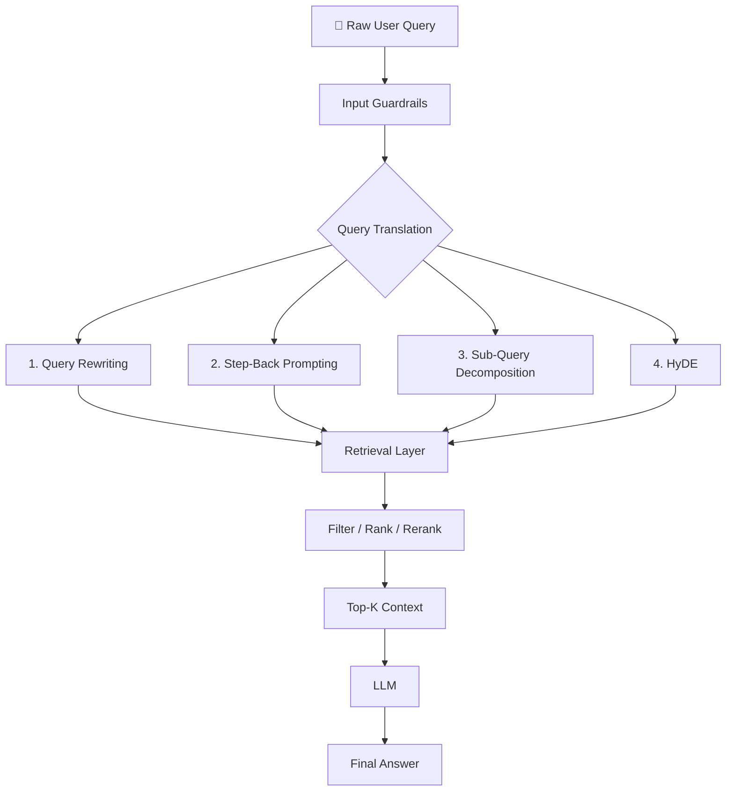
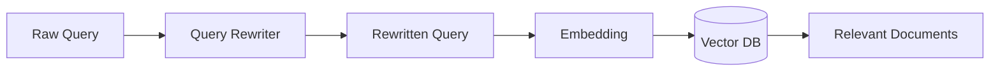
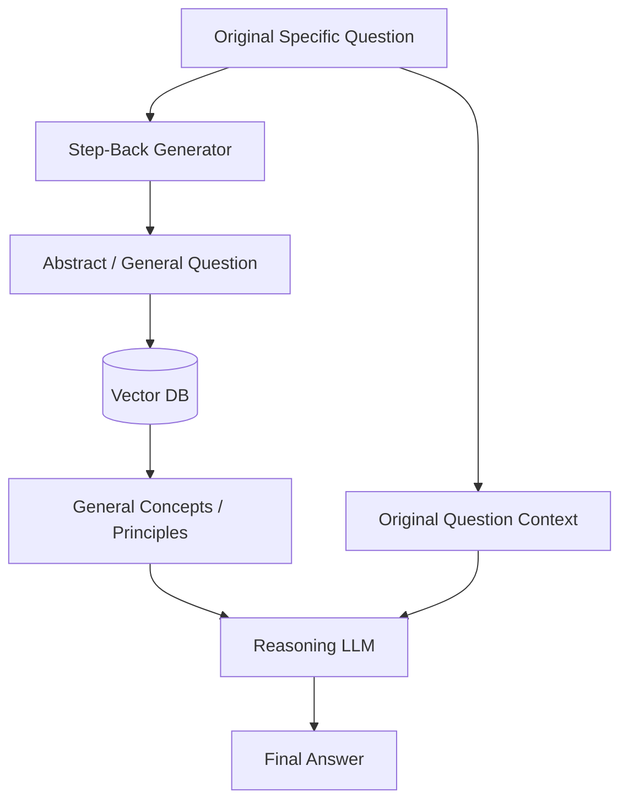
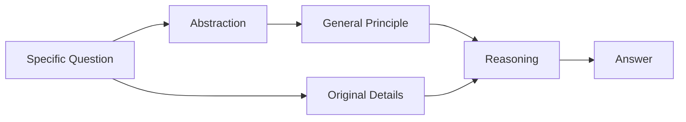
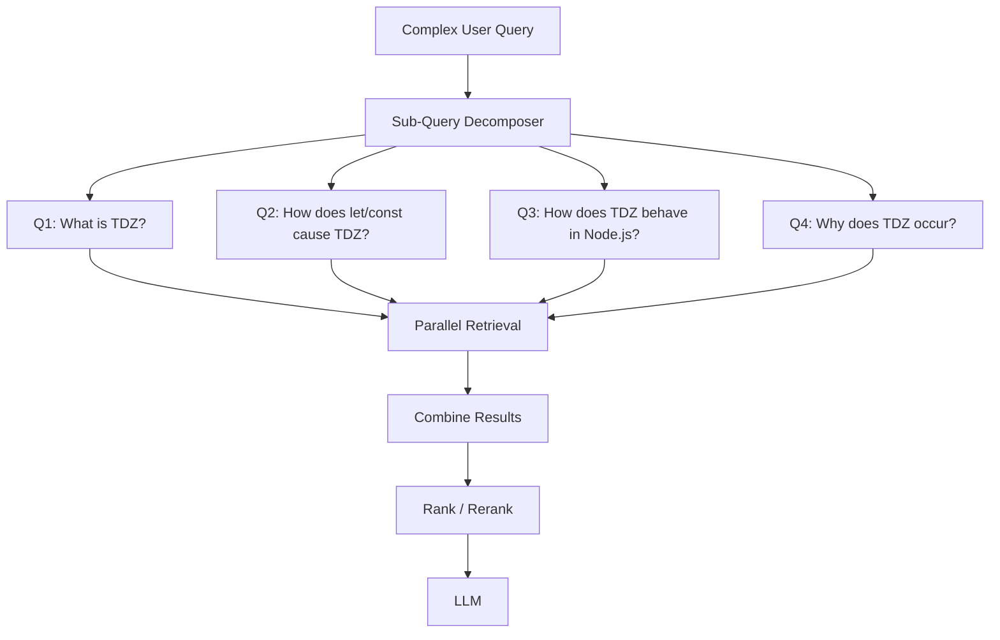
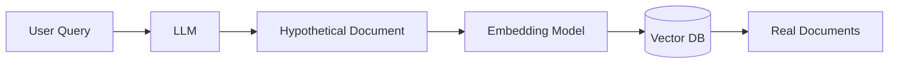
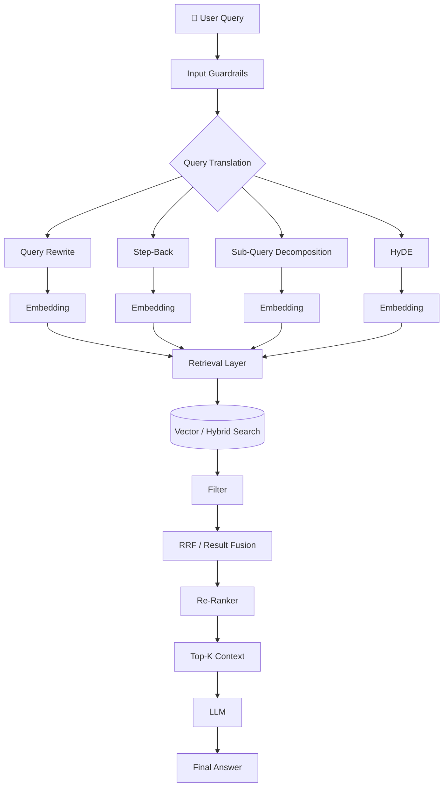
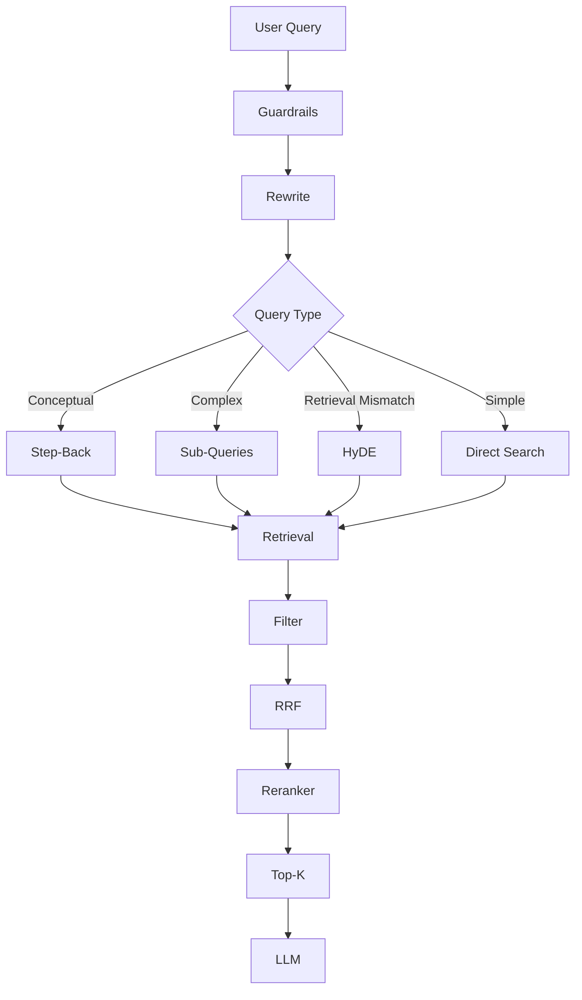

Your structure is good. I would make it more **production-oriented and technically precise**, especially around the difference between **Query Rewriting, Step-Back, Sub-Query, and HyDE**.

One correction: Step-Back Prompting was introduced in the paper *Take a Step Back: Evoking Reasoning via Abstraction in Large Language Models*. The paper describes it as generating **high-level concepts and first principles from specific questions**, then using those concepts to guide reasoning. ([arXiv][1])

# 02. Query Translation — Step-Back Prompting, HyDE & Sub-Query Decomposition

## 📌 Overview

In a naive RAG system, we directly send the user's query to the retriever:

```text
User Query
    ↓
Embedding
    ↓
Vector Search
    ↓
Top-K Documents
```

The problem is that the **user's query is not always a good retrieval query**.

It may be:

* ambiguous
* incomplete
* too short
* poorly worded
* misspelled
* missing important context
* composed of multiple questions
* semantically different from the language used in documents

Therefore, production RAG systems often perform **Query Translation** before retrieval.

> **Query Translation = transforming one raw user query into one or more retrieval-friendly representations.**

---

# 1. Query Translation — Big Picture



These techniques solve **different retrieval problems**.

| Technique       | Main Problem Solved                      |
| --------------- | ---------------------------------------- |
| Query Rewriting | Bad / unclear wording                    |
| Step-Back       | Missing high-level concepts              |
| Sub-Query       | Complex multi-part questions             |
| HyDE            | Query ↔ document representation mismatch |

---

# 2. Query Rewriting

## What is Query Rewriting?

Query rewriting takes the original user query and converts it into a **clearer, more retrieval-friendly query**.



### Example

Raw query:

```text
how fix error 429 gemni node
```

Rewritten:

```text
How to handle Google Gemini API 429
rate-limit or quota errors in Node.js?
```

The rewritten query contains:

```text
Gemini
+
API
+
429
+
rate limit
+
quota
+
Node.js
```

This gives the retriever more useful semantic information.

---

## Query Rewriting Flow

```text
User
 │
 │ "how fix error 429 gemni node"
 ▼
Query Rewriter
 │
 ▼
"How to handle Gemini API 429
rate-limit errors in Node.js?"
 │
 ▼
Embedding
 │
 ▼
Vector Search
```

### When to use it

Query rewriting is useful when users frequently:

* make spelling mistakes
* use abbreviations
* use incomplete sentences
* omit technical context
* refer to something indirectly

---

# 3. Step-Back Prompting

## Core Idea

**Step-Back Prompting** takes a specific question and asks:

> **"What broader concept or principle do I need to understand to solve this?"**

The technique was introduced in the 2023 paper *Take a Step Back: Evoking Reasoning via Abstraction in Large Language Models*. The authors report improvements across STEM, knowledge QA, and multi-hop reasoning tasks. ([arXiv][1])

---

## Normal Approach

```text
Specific Question
       ↓
Vector Search
       ↓
Documents
       ↓
LLM
       ↓
Answer
```

## Step-Back Approach

```text
Specific Question
       ↓
Abstraction
       ↓
Step-Back Question
       ↓
Retrieve General Principles
       ↓
Combine with Original Question
       ↓
Reason
       ↓
Answer
```

---

# 4. Step-Back Architecture



The important part is:

```text
Original Question
        +
Step-Back Knowledge
        ↓
Reasoning
```

The step-back result **does not replace the original question**.

---

# 5. Step-Back Example — Physics

### Original Question

> What happens to the pressure of an ideal gas if temperature increases by 2× and volume increases by 8×?

A model may directly manipulate the numbers and make an algebraic mistake.

Instead, generate:

### Step-Back Question

> What fundamental physics principle determines the pressure of an ideal gas?

Retrieve:

```text
Ideal Gas Law

PV = nRT
```

Now apply the original values:

```text
T' = 2T

V' = 8V
```

Therefore:

[
P' = \frac{nR(2T)}{8V}
]

[
P' = \frac{2}{8}\frac{nRT}{V}
]

[
P' = \frac{1}{4}P
]

### Final Answer

**Pressure decreases by a factor of 4.**

---

# 6. Step-Back Prompting — Mental Model

Think:



### Example

```text
Specific:
"What happens to pressure when T ×2 and V ×8?"

             ↓ Step Back

General:
"What principle determines ideal-gas pressure?"

             ↓

PV = nRT

             ↓

Apply to original values

             ↓

P' = P/4
```

### Key Insight

**Step-Back = abstraction before reasoning.**

---

# 7. Step-Back Example — Knowledge Retrieval

Suppose:

```text
Original:

"Estella Leopold went to which school
between Aug 1954 and Nov 1954?"
```

Instead of searching only:

```text
Estella Leopold Aug 1954 Nov 1954 school
```

generate:

```text
"What was Estella Leopold's education history?"
```

Retrieve the broader education timeline.

Then the reasoning stage can use the timeline to answer the original date-specific question.

### Important

The broader query improves the chance of retrieving the relevant **timeline/context**, but the final answer still needs evidence that actually supports the date range.

---

# 8. Sub-Query Decomposition

Some user questions are actually several questions combined together.

Example:

> What is Temporal Dead Zone in Node.js, why does it happen, and how is it related to `let` and `const`?

A single vector search may not retrieve everything.

Instead:



---

# 9. Why Sub-Queries?

Consider:

```text
"What is TDZ, why does it happen,
how does let differ from var,
and what happens in Node.js?"
```

This contains several retrieval intents:

```text
        Original Query
              ↓
       ┌──────┼──────┐
       ↓      ↓      ↓
    Concept  Cause  Runtime
       ↓      ↓      ↓
     Search Search Search
       └──────┼──────┘
              ↓
        Combined Context
```

This generally gives the retrieval system more opportunities to find the required evidence.

---

# 10. Parallel Sub-Query Retrieval

Because the searches are independent, execute them concurrently.

```javascript
const subQueries = [
  "What is Temporal Dead Zone in JavaScript?",
  "How do let and const cause TDZ?",
  "Why does TDZ occur?",
  "How does TDZ behave in Node.js?"
];

const results = await Promise.all(
  subQueries.map(query => vectorSearch(query))
);
```

Instead of:

```text
Q1 → Search → wait
             ↓
Q2 → Search → wait
             ↓
Q3 → Search → wait
```

we can do:

```text
             ┌→ Q1 → Search ──┐
             │                 │
Original ────┼→ Q2 → Search ──┼→ Combine
             │                 │
             ├→ Q3 → Search ──┤
             │                 │
             └→ Q4 → Search ──┘
```

This is also an important **latency optimization**.

---

# 11. HyDE — Hypothetical Document Embeddings

## Problem

A user query and a document containing the answer can have different linguistic structures.

For example:

```text
Query:

"What causes a Node.js process to terminate?"
```

Document:

```text
"Unhandled exceptions that propagate to the event
loop can cause the Node.js process to exit."
```

They express related concepts, but their wording and structure differ.

---

# 12. Normal Embedding Search

```text
User Query
    ↓
Embedding
    ↓
Query Vector
    ↓
Vector DB
    ↓
Documents
```

---

# 13. HyDE Search

HyDE changes the query representation.



### Example

User:

```text
"What causes a Node.js process to terminate?"
```

LLM generates a hypothetical passage:

```text
"Node.js processes can terminate because of uncaught
exceptions, explicit process.exit calls, fatal errors,
or certain runtime failures."
```

The **hypothetical passage**, not the original query, is embedded.

```text
Hypothetical Passage
        ↓
Embedding
        ↓
Vector
        ↓
Vector Search
        ↓
Real Documents
```

---

# 14. Why HyDE Can Help

The key idea:

```text
Query
  ↓
LLM
  ↓
Document-like representation
  ↓
Embedding
  ↓
Search
```

Instead of:

```text
Question ↔ Document
```

we try:

```text
Hypothetical Document ↔ Real Document
```

The generated passage may contain vocabulary and semantic structure that is more similar to the indexed documents.

### Important Caveat

The hypothetical document **does not need to be factually correct** to be useful for retrieval.

The goal is to generate a useful **semantic representation for search**.

Therefore:

```text
HyDE Document
      ≠
Ground Truth
```

Never treat the hypothetical passage itself as authoritative evidence.

---

# 15. Complete Query Translation Architecture

This is the diagram I would remember for your class:



---

# 16. Query Translation vs Retrieval

Don't confuse these two.

### Query Translation

```text
"What is tdz node?"
        ↓
"What is the Temporal Dead Zone
in JavaScript and Node.js?"
```

### Retrieval

```text
Better Query
     ↓
Embedding
     ↓
Vector Search
     ↓
Documents
```

So:

```text
Query Translation
        ↓
Better Retrieval
        ↓
Better Context
        ↓
Better Generation
```

---

# 17. When Should You Use Which?

```text
User query:
"how fix 429 gemni node"

        ↓

Query Rewriting
```

Because the query is poorly written.

---

```text
User query:
"What happens to pressure when
temperature doubles?"
```

↓

**Step-Back**

Because the model benefits from the underlying principle.

---

```text
User query:
"What is TDZ, why does it happen,
and how does let differ from var?"
```

↓

**Sub-Query Decomposition**

Because it contains multiple related questions.

---

```text
User query:
"What causes Node.js process termination?"
```

↓

**HyDE**

Potentially useful when the query-to-document representation mismatch is hurting retrieval.

---

# 18. Advanced Combination

In production, you don't necessarily choose only one technique.

A sophisticated system can do:



This is much closer to how you should think about **production RAG**.

---

# 🔥 Final Mental Model

Remember these four words:

```text
REWRITE
   ↓
ABSTRACT
   ↓
DECOMPOSE
   ↓
HYPOTHESIZE
```

Or:

```text
Query Rewriting
→ Make the query clearer

Step-Back
→ Make the query more conceptual

Sub-Query
→ Make the query smaller

HyDE
→ Make the query more document-like
```

Then:

```text
        Better Query Representation
                    ↓
              Retrieval
                    ↓
                 Filter
                    ↓
             RRF / Ranking
                    ↓
                Re-Ranking
                    ↓
                  Top-K
                    ↓
                   LLM
```

**The core lesson:** Query Translation is not about making the user's question prettier. Its real purpose is to create **better retrieval representations**, increasing the probability that the downstream RAG system receives the right evidence.

[1]: https://arxiv.org/abs/2310.06117?utm_source=chatgpt.com "Take a Step Back: Evoking Reasoning via Abstraction in Large Language Models"
