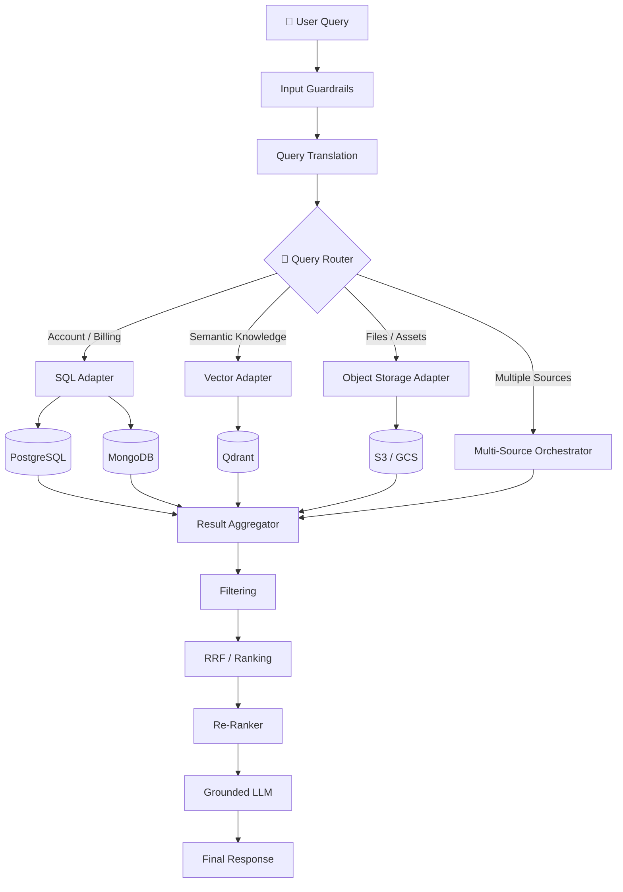
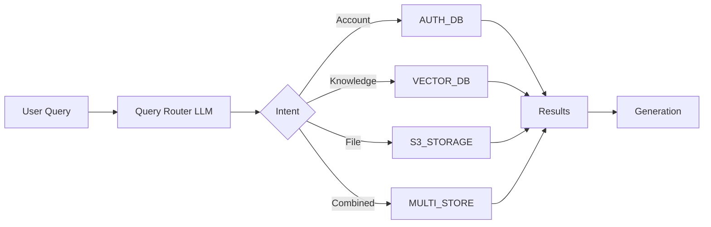
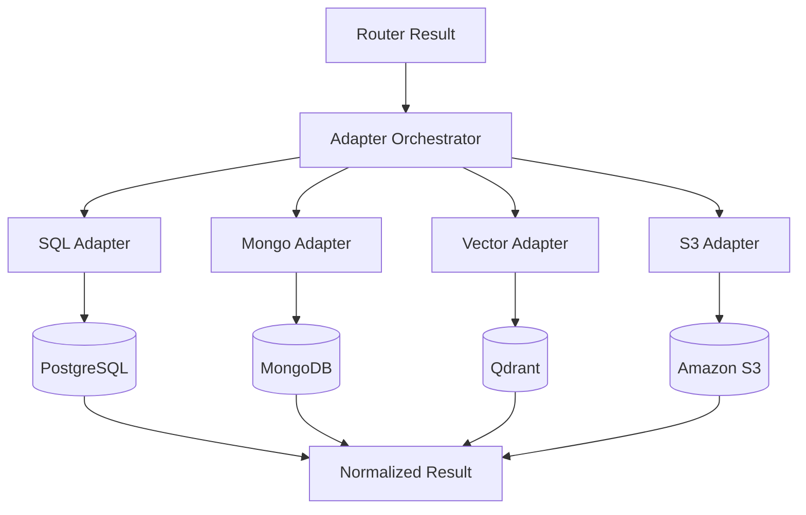
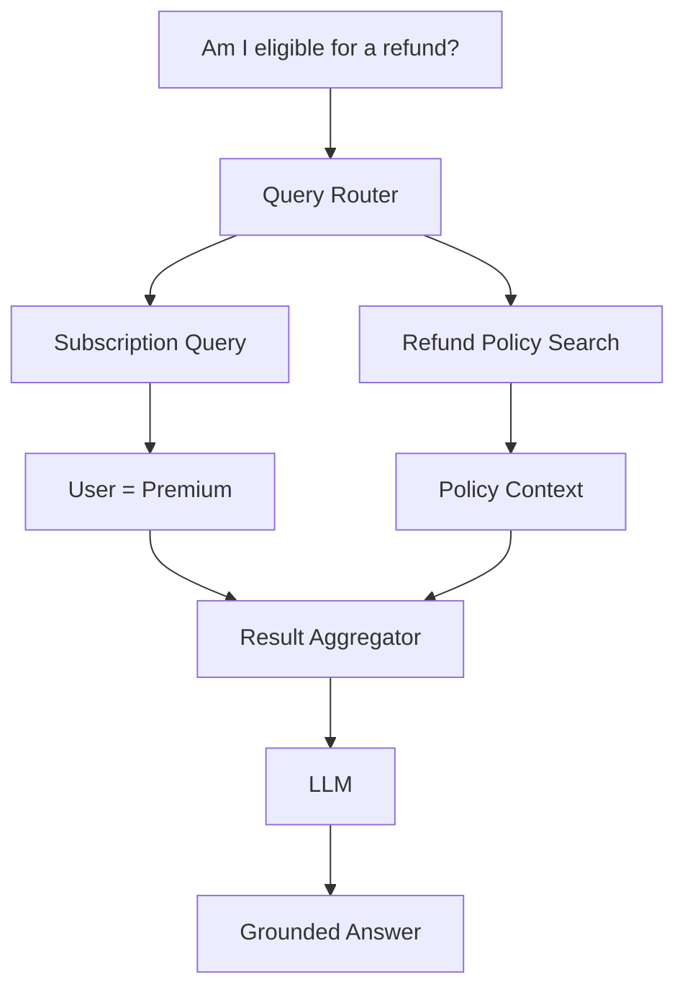
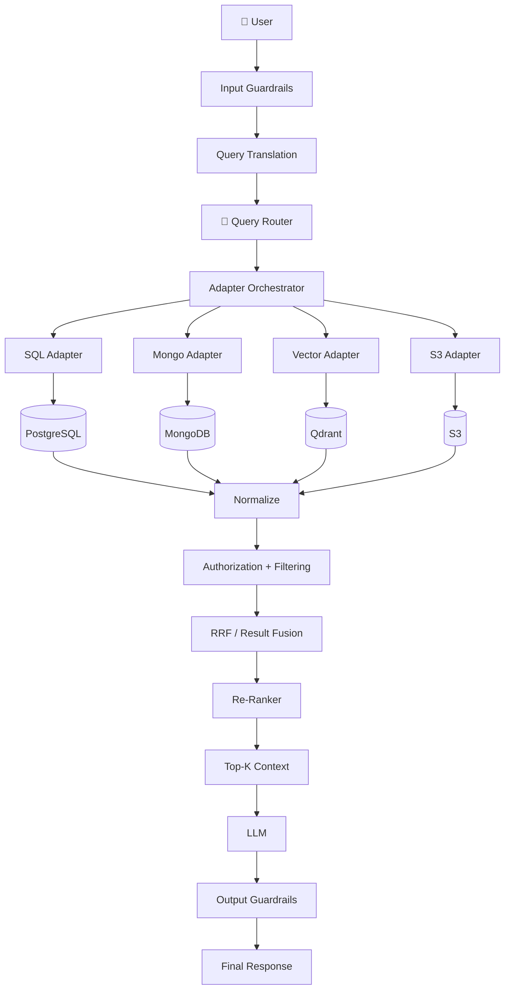

# 03. Query Routing & Multi-Source Adapter Architecture

## 📌 Overview

In a production RAG system, **not every question should go to the Vector Database**.

Enterprise applications usually have multiple data sources:

```text
                    Enterprise Data
                         │
        ┌────────────────┼────────────────┐
        ↓                ↓                ↓
   Structured        Unstructured       Files
      Data               Data
        │                │                │
   PostgreSQL        Qdrant/Pinecone     S3
   MongoDB           Vector DB           GCS
```

For example:

| User Question                                      | Best Source      |
| -------------------------------------------------- | ---------------- |
| "What is my account email?"                        | SQL / Auth DB    |
| "How does our refund policy work?"                 | Vector DB        |
| "Show me invoice March.pdf"                        | Object Storage   |
| "What is my refund limit according to our policy?" | Multiple sources |

Therefore, production RAG introduces:

> **Query Routing + Adapter Layer**

---

# 1. The Core Problem

A naive RAG system assumes:

```text
User
 ↓
Vector DB
 ↓
Top-K
 ↓
LLM
```

But imagine the user asks:

> "How much have I spent this month?"

Searching a vector database is the wrong approach.

The answer probably exists as:

```text
PostgreSQL
   ↓
transactions table
   ↓
SUM(amount)
```

Another user might ask:

> "What is our refund policy?"

Now a Vector DB makes more sense:

```text
Question
   ↓
Embedding
   ↓
Qdrant
   ↓
Policy documents
```

So the first question in production RAG becomes:

> **"Where does the answer live?"**

That's the job of the **Query Router**.

---

# 2. Multi-Source Architecture



---

# 3. Query Router

## What is a Query Router?

A **Query Router** determines:

```text
User Query
     ↓
"What type of information is required?"
     ↓
Which data source should I use?
```

For example:

```text
"What is my current subscription?"

             ↓

        Query Router

             ↓

        AUTH / SQL DB
```

While:

```text
"What is our refund policy?"

             ↓

        Query Router

             ↓

        VECTOR DB
```

---

# 4. Router Decision

A router can classify queries into:

```text
AUTH_DB
VECTOR_DB
S3_STORAGE
MULTI_STORE
```

### Example

```text
"What is my registered email?"
          ↓
       AUTH_DB
```

```text
"Explain our refund policy."
          ↓
      VECTOR_DB
```

```text
"Download my March invoice."
          ↓
     S3_STORAGE
```

```text
"What refund am I eligible for based
on my subscription?"
          ↓
     MULTI_STORE
```

The last example is important.

The answer may require:

```text
User subscription
      +
Refund policy
      ↓
Final answer
```

So one database isn't enough.

---

# 5. Router Architecture



---

# 6. Structured Router Output

Don't make the router return free-form text.

Bad:

```text
I think this should probably go
to the SQL database because...
```

Better:

```json
{
  "targetStore": "AUTH_DB",
  "reason": "The query requests account information."
}
```

Even better for production:

```json
{
  "targetStore": "AUTH_DB",
  "intent": "ACCOUNT_PROFILE",
  "confidence": 0.96
}
```

Structured output makes the routing decision easier for your application to validate.

---

# 7. Router Implementation

Your basic pattern is good, but one production improvement is:

> **Do not let the router directly execute database operations.**

The router should only decide **where to go**.

```javascript
async function routeQuery(query) {
  const result = await routerLLM(query);

  return {
    targetStore: result.targetStore,
    intent: result.intent,
    confidence: result.confidence
  };
}
```

Then your application decides what to execute.

```text
LLM Router
    ↓
Structured Route
    ↓
Application
    ↓
Adapter
```

This separation is extremely important.

---

# 8. Adapter Layer

Now comes the **Adapter Layer**.

Different databases speak different languages.

```text
SQL Database
     ↓
SQL

MongoDB
     ↓
Mongo Query

Vector DB
     ↓
Embedding + Vector Search

S3
     ↓
Object Key / Metadata / Signed URL
```

The Adapter hides those implementation details.

---

# 9. Adapter Architecture



The important idea is:

> **Every adapter converts its native result into a common application-level format.**

For example:

```javascript
{
  source: "VECTOR_DB",
  content: "...",
  score: 0.91,
  metadata: {
    documentId: "doc_123"
  }
}
```

or:

```javascript
{
  source: "AUTH_DB",
  content: "subscription: premium",
  metadata: {
    userId: "user_123"
  }
}
```

Now the downstream pipeline doesn't need to know how the data was retrieved.

---

# 10. Adapter Example

```javascript
async function executeRoute(route, query) {
  switch (route.targetStore) {

    case "AUTH_DB":
      return sqlAdapter.search(query);

    case "VECTOR_DB":
      return vectorAdapter.search(query);

    case "S3_STORAGE":
      return s3Adapter.search(query);

    case "MULTI_STORE":
      return multiStoreAdapter.search(query);

    default:
      throw new Error("Unsupported route");
  }
}
```

This is much cleaner than putting database logic directly inside the router.

---

# 11. SQL Adapter

For structured data:

```text
User Query
    ↓
Query → Structured representation
    ↓
SQL Adapter
    ↓
PostgreSQL
    ↓
Rows
```

Example:

> "How much did I spend this month?"

Potential operation:

```sql
SELECT SUM(amount)
FROM transactions
WHERE user_id = ?
AND created_at >= ?;
```

### Important Production Rule

Never blindly execute arbitrary LLM-generated SQL.

Use:

```text
LLM
 ↓
Structured Query / Restricted SQL
 ↓
Validation
 ↓
Authorization
 ↓
Parameterized Query
 ↓
Database
```

The database should also enforce permissions.

---

# 12. Vector Adapter

For semantic knowledge:

```text
User Query
    ↓
Embedding
    ↓
Qdrant
    ↓
Similarity Search
    ↓
Candidate Documents
```

The Vector Adapter hides all Qdrant-specific implementation details.

```javascript
async function vectorSearch(query) {
  const vector = await embedText(query);

  return qdrant.search({
    vector,
    limit: 20
  });
}
```

Notice something important:

> Retrieval can return **more candidates than the final Top-K**.

For example:

```text
Vector DB
   ↓
Top 20 candidates
   ↓
Filtering
   ↓
Reranking
   ↓
Top 5
```

This is generally better than immediately asking the vector DB for only 3–5 documents.

---

# 13. S3 / Object Storage Adapter

Object storage is different.

S3 isn't normally a semantic database.

It stores:

```text
PDF
Images
Videos
Invoices
Reports
Raw files
```

The adapter might:

```text
Query
 ↓
Resolve file metadata
 ↓
Find object key
 ↓
Check authorization
 ↓
Generate signed URL
 ↓
Return file metadata / URL
```

For semantic search over PDFs, you would typically **index their extracted text separately**, often into a search/vector system, while keeping the original file in S3.

---

# 14. Multi-Store Query

This is where the architecture becomes powerful.

Consider:

> **"Am I eligible for a refund based on my subscription?"**

We need two kinds of information.

### Source 1 — Account DB

```text
User
 ↓
Subscription
 ↓
Premium
```

### Source 2 — Vector DB

```text
Refund Policy
 ↓
Premium users can request...
```

Then combine:



---

# 15. Parallel Execution

When sources are independent, execute them concurrently.

```javascript
const [account, policy] = await Promise.all([
  accountAdapter.getSubscription(userId),
  vectorAdapter.search("refund policy eligibility")
]);
```

Instead of:

```text
SQL
 ↓
wait
 ↓
Vector DB
 ↓
wait
 ↓
LLM
```

we get:

```text
             ┌→ SQL ───────┐
Query ───────┤             ├→ Aggregator
             └→ Vector DB ─┘
```

This reduces latency.

---

# 16. Result Aggregation

Different stores return different formats.

We normalize them:

```text
SQL Result
     ↓
     │
Vector Result → Normalizer → Common Result Format
     │
S3 Result
     ↓
```

Example:

```javascript
{
  source: "SQL",
  type: "structured",
  content: {
    plan: "premium"
  }
}
```

and:

```javascript
{
  source: "VECTOR_DB",
  type: "document",
  content: "Premium users can request...",
  score: 0.92
}
```

Now the generation layer receives a unified context.

---

# 17. Where Does RRF Fit?

Important correction:

**RRF is primarily useful for combining ranked result lists**, not simply for merging arbitrary SQL/S3 results.

For example:

```text
Vector Search
     ↓
Ranked List A

Keyword Search
     ↓
Ranked List B

     ↓

RRF

     ↓

Combined Ranking
```

Example:

```text
Vector Search:
1. Doc A
2. Doc C
3. Doc B

Keyword Search:
1. Doc B
2. Doc A
3. Doc D
```

RRF combines these rankings:

```text
        RRF
         ↓
A
B
C
D
```

Then:

```text
Candidates
    ↓
RRF
    ↓
Re-ranker
    ↓
Top-K
```

For heterogeneous sources such as SQL + S3 + Vector DB, you generally need **source-specific aggregation/normalization**, not blindly applying RRF to everything.

---

# 18. Complete Production Flow



---

# 🔐 19. Security Is Part of Routing

One of the most important production concepts:

> **The LLM should never be the authorization layer.**

Suppose:

```text
User A
 ↓
"What is User B's billing information?"
```

The router may correctly identify:

```text
AUTH_DB
```

But that doesn't mean the query should execute.

Correct architecture:

```text
User
 ↓
Authentication
 ↓
Authorization / ACL
 ↓
Query Router
 ↓
Adapter
 ↓
Database
```

The database query must be scoped to the authenticated user's permissions.

---

# 20. Why Multi-Source Architecture?

### 1. Don't put everything into Vector DB

```text
Transactions → SQL
Users → SQL/Mongo
Documents → Vector DB
Files → S3
```

Use the right storage for the right workload.

### 2. Better latency

Exact lookup:

```text
"What's my email?"
       ↓
SQL
```

No embedding required.

### 3. Better accuracy

Structured questions should use structured retrieval.

Semantic questions should use semantic retrieval.

### 4. Better security

Each adapter can enforce its own:

```text
Authentication
Authorization
ACL
Tenant isolation
Data filtering
```

---

# 🧠 Final Mental Model

Remember the architecture as:

```text
              USER QUERY
                  │
                  ▼
           QUERY TRANSLATION
                  │
                  ▼
             QUERY ROUTER
                  │
        ┌─────────┼─────────┐
        ▼         ▼         ▼
       SQL     VECTOR       S3
        │         │         │
        └─────────┼─────────┘
                  ▼
              AGGREGATE
                  │
                  ▼
        FILTER / AUTHORIZE
                  │
                  ▼
            RANK / RERANK
                  │
                  ▼
               TOP-K
                  │
                  ▼
                 LLM
                  │
                  ▼
          OUTPUT GUARDRAILS
                  │
                  ▼
              RESPONSE
```

### 🔥 One-line takeaway

> **Query Routing decides *where* to search; the Adapter Layer decides *how* to search; the Aggregator decides *how to combine the results*.**

That distinction is the key concept to remember from **Day 05 – Part 03**.
