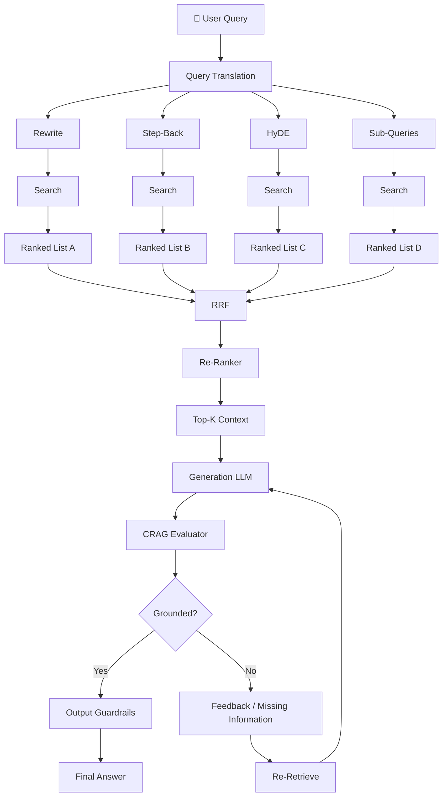
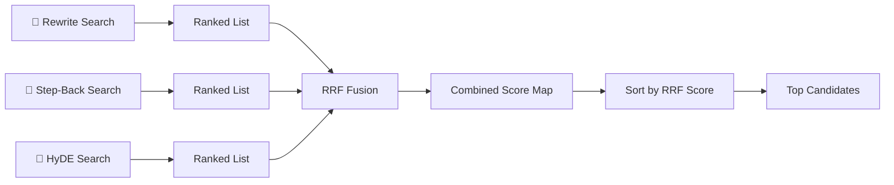
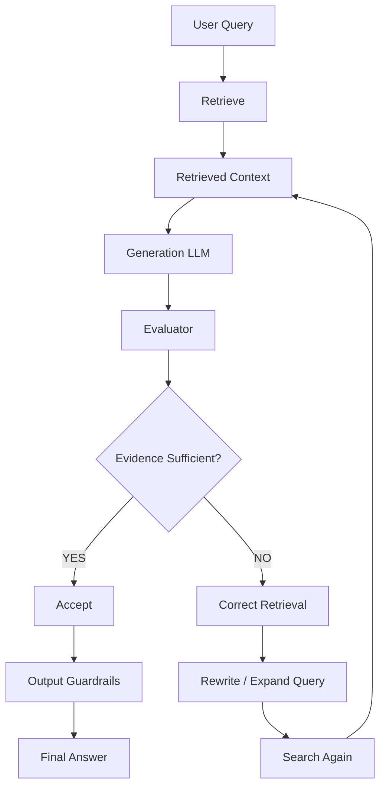
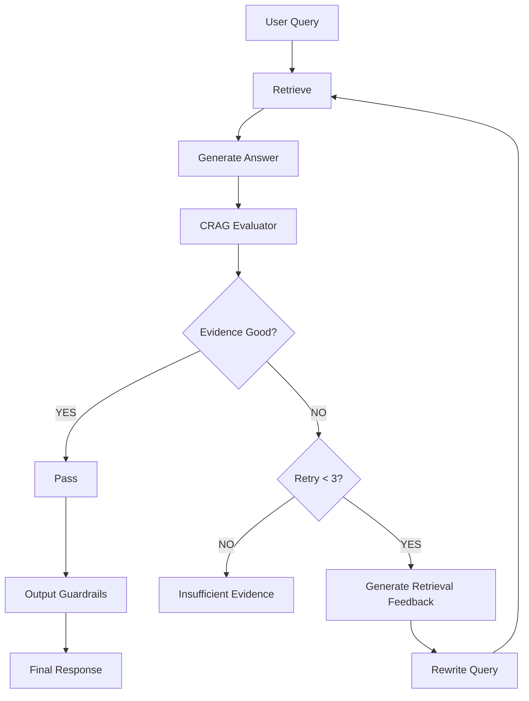
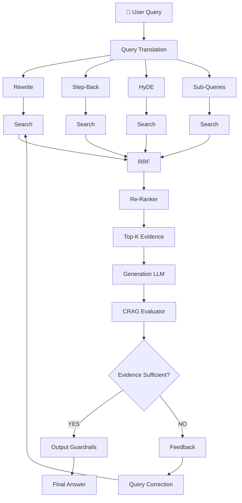

# 04. Reciprocal Rank Fusion (RRF) & Corrective RAG (CRAG)

## 📌 Overview

After **Query Translation** and **Query Routing**, a production RAG system may have many retrieval results.

For example:

```text
User Query
    │
    ├── Rewritten Query ──→ Search ──→ Results A
    │
    ├── Step-Back Query ─→ Search ──→ Results B
    │
    ├── HyDE ────────────→ Search ──→ Results C
    │
    └── Sub-Queries ─────→ Search ──→ Results D
```

Now we have a problem:

> **How do we combine all these ranked lists into one high-quality ranking?**

This is where **Reciprocal Rank Fusion (RRF)** becomes useful.

Then, even after retrieval and generation, another problem remains:

> **How do we know that the generated answer is actually supported by the retrieved evidence?**

This is where **Corrective RAG (CRAG)** comes in.

---

# 1. Complete Architecture



---

# 2. Reciprocal Rank Fusion — RRF

## What is RRF?

**RRF is a rank-fusion algorithm used to combine multiple ranked result lists.**

Instead of asking:

> "Which document has the highest similarity score?"

we ask:

> **"Which documents consistently appear near the top across different searches?"**

This is particularly useful when we have:

```text
Rewrite Search
Step-Back Search
HyDE Search
Sub-Query Search
Keyword Search
Vector Search
```

---

# 3. Why Not Simply Compare Similarity Scores?

Suppose we have:

### Search A

```text
Document A → 0.91
Document B → 0.87
Document C → 0.82
```

### Search B

```text
Document B → 0.72
Document D → 0.70
Document A → 0.68
```

Can we directly say:

```text
0.91 > 0.72
```

therefore A is better?

Not necessarily.

Different queries can produce **different score distributions**.

For example:

```text
Query A:
0.91, 0.87, 0.82

Query B:
0.72, 0.70, 0.68
```

The absolute scores aren't necessarily comparable across searches.

RRF avoids this problem by focusing on:

> **Rank position rather than raw similarity score.**

---

# 4. RRF Formula

The standard RRF formula is:

[
RRF(d)=\sum_{m\in M}\frac{1}{k+r_m(d)}
]

Where:

* (d) = document
* (M) = collection of ranked lists
* (r_m(d)) = rank of document (d) in list (m)
* (k) = smoothing constant
* Common implementation value: (k=60)

If a document does not appear in a particular list:

[
Contribution = 0
]

---

# 5. Simple Example

Suppose we have three searches.

### List A

```text
Rank 1 → Document A
Rank 2 → Document B
Rank 3 → Document C
```

### List B

```text
Rank 1 → Document B
Rank 2 → Document A
Rank 3 → Document D
```

### List C

```text
Rank 1 → Document A
Rank 2 → Document D
Rank 3 → Document B
```

Now calculate RRF.

For simplicity:

[
k=60
]

---

## Document A

A appears:

```text
List A → Rank 1
List B → Rank 2
List C → Rank 1
```

Therefore:

[
RRF(A)=
\frac{1}{61}
+
\frac{1}{62}
+
\frac{1}{61}
]

≈ **0.0487**

---

## Document B

```text
List A → Rank 2
List B → Rank 1
List C → Rank 3
```

[
RRF(B)=
\frac{1}{62}
+
\frac{1}{61}
+
\frac{1}{63}
]

≈ **0.0481**

---

## Document D

```text
List A → Not found
List B → Rank 3
List C → Rank 2
```

[
RRF(D)=
0+
\frac{1}{63}
+
\frac{1}{62}
]

≈ **0.0320**

Therefore:

```text
A
↓
B
↓
D
```

The documents appearing consistently near the top receive stronger fused rankings.

---

# 6. RRF Visual



---

# 7. Why RRF Is Powerful

### 1. Rank-based

It doesn't require directly comparing similarity scores from different searches.

### 2. Consensus

If a document appears in several retrieval strategies, it gets multiple contributions.

```text
Query 1 → Doc A #1
Query 2 → Doc A #3
Query 3 → Doc A #2

             ↓

         Strong Signal
```

### 3. Works with multiple retrieval strategies

For example:

```text
Dense Vector Search
        +
BM25 Keyword Search
        +
HyDE
        +
Sub-Query Search
        ↓
       RRF
```

---

# 8. RRF in Production RAG

A typical architecture:

```text
                   User Query
                       │
           ┌───────────┼───────────┐
           ↓           ↓           ↓
        Rewrite     Step-Back     HyDE
           ↓           ↓           ↓
        Vector       Vector       Vector
        Search       Search       Search
           ↓           ↓           ↓
        List A       List B       List C
           └───────────┼───────────┘
                       ↓
                      RRF
                       ↓
                  Top Candidates
                       ↓
                    Reranker
                       ↓
                     Top-K
```

Notice:

> **RRF and Re-Ranking are not the same thing.**

---

# 9. RRF vs Re-Ranker

### RRF

Combines multiple **ranked lists**.

```text
List A
List B
List C
 ↓
RRF
 ↓
Unified ranking
```

### Re-Ranker

Takes candidate documents and evaluates their relevance to the **actual query**.

```text
Query
 +
Candidate Documents
       ↓
   Re-Ranker
       ↓
Relevance Ranking
```

A common pipeline is:

```text
Retrieve 20–50 candidates
        ↓
       RRF
        ↓
   Re-Rank candidates
        ↓
      Top 5
        ↓
       LLM
```

---

# 10. Corrective RAG — CRAG

RRF improves **retrieval**.

But retrieval can still fail.

For example:

```text
User Query
    ↓
Retrieval
    ↓
Wrong / incomplete documents
    ↓
LLM
    ↓
Confident but incorrect answer ❌
```

So we need another layer.

> **CRAG = evaluate the retrieval/generation process and take corrective action when evidence is insufficient.**

The original CRAG research focuses on **retrieval evaluation and corrective actions**, including additional retrieval when retrieved documents are inadequate. So, in production, it's better to think of CRAG as a **retrieval correction loop**, rather than simply "a model that rates the final answer out of 10."

---

# 11. Basic CRAG Architecture



---

# 12. CRAG Evaluation

An evaluator can inspect:

### 1. Relevance

> Are the retrieved documents actually relevant?

### 2. Groundedness

> Is the answer supported by the retrieved evidence?

### 3. Completeness

> Does the evidence contain enough information to answer the question?

### 4. Contradiction

> Do retrieved sources contradict each other?

---

# 13. Simple CRAG Decision

You can represent the evaluator output structurally:

```json
{
  "relevance": 8,
  "groundedness": 9,
  "completeness": 6,
  "needs_retry": true,
  "missing_information": [
    "refund eligibility period"
  ]
}
```

Then the application decides what happens next.

---

# 14. Correction Loop

Suppose the user asks:

> "Can I get a refund after 45 days?"

Retrieved documents only say:

```text
Refunds are available according to the refund policy.
```

The evaluator detects:

```text
Missing:
"refund eligibility period"
```

Then:

```text
Missing Information
        ↓
Query Expansion
        ↓
"refund policy eligibility period 45 days"
        ↓
Retrieve Again
        ↓
New Evidence
        ↓
Generate
```

---

# 15. CRAG Retry Architecture



---

# 16. What Should the Evaluator Return?

Instead of only:

```text
Score: 5/10
```

use structured feedback:

```json
{
  "score": 5,
  "grounded": false,
  "missingInformation": [
    "refund eligibility period"
  ],
  "suggestedQueries": [
    "refund policy eligibility period",
    "refund eligibility after 30 days"
  ]
}
```

This makes the evaluator useful for the **next retrieval attempt**.

---

# 17. Retry Limit

Never allow an unlimited correction loop.

```text
Retry 1
   ↓
Retrieve
   ↓
Evaluate
   ↓
Retry 2
   ↓
Retrieve
   ↓
Evaluate
   ↓
Retry 3
   ↓
Retrieve
   ↓
Evaluate
   ↓
Fallback
```

Example:

```javascript
const MAX_RETRIES = 3;

for (let attempt = 0; attempt < MAX_RETRIES; attempt++) {
  const context = await retrieve(query);

  const answer = await generate(query, context);

  const evaluation = await evaluate({
    query,
    context,
    answer
  });

  if (evaluation.grounded && evaluation.score >= 7) {
    return answer;
  }

  query = improveQuery(
    query,
    evaluation.missingInformation
  );
}

return "I don't have enough reliable information to answer that.";
```

---

# 18. Important Production Consideration

Your original idea of:

```text
Score >= 6 → Pass
Score < 6 → Retry
```

is useful as a **simple learning implementation**, but don't treat `6/10` as a universal CRAG threshold.

The threshold should be determined through:

```text
Evaluation Dataset
        ↓
Offline Testing
        ↓
Precision / Recall
        ↓
False Accepts
False Rejects
        ↓
Production Threshold
```

For high-risk domains, you may require much stricter conditions.

---

# 19. RRF + CRAG Together

Now combine everything you've learned.



---

# 20. The Full Mental Model

You can remember Advanced RAG as:

```text
                 USER QUERY
                     │
                     ▼
              QUERY TRANSLATION
                     │
        ┌────────────┼────────────┐
        ↓            ↓            ↓
     Rewrite      Step-Back      HyDE
        ↓            ↓            ↓
        └────────────┼────────────┘
                     ▼
                 RETRIEVAL
                     │
              Multiple Lists
                     │
                     ▼
                    RRF
                     │
                     ▼
                 RE-RANKER
                     │
                     ▼
                  TOP-K
                     │
                     ▼
                  LLM
                     │
                     ▼
                 CRAG
                     │
             ┌───────┴───────┐
             ↓               ↓
          Good            Not Good
             ↓               ↓
          Output        Correct Query
                             │
                             └──→ Retrieve Again
```

---

# 🔥 Key Difference to Remember

### RRF asks:

> **"Which retrieved documents should rank highest when multiple retrieval strategies are combined?"**

### Re-Ranker asks:

> **"Which candidate documents are most relevant to this query?"**

### CRAG asks:

> **"Do we have enough reliable evidence to produce this answer, and if not, how should retrieval be corrected?"**

So the production pipeline becomes:

```text
Multiple Retrieval
      ↓
     RRF
      ↓
  Re-Ranking
      ↓
   Top-K Evidence
      ↓
    Generation
      ↓
    CRAG
      ↓
 ┌────┴────┐
 ↓         ↓
Pass     Correct
 ↓         ↓
Answer   Retrieval
```

**One-line takeaway:**

> **RRF improves the ranking of retrieved evidence; CRAG checks whether that evidence is sufficient and triggers corrective retrieval when it isn't.**
