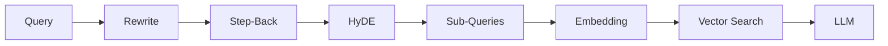
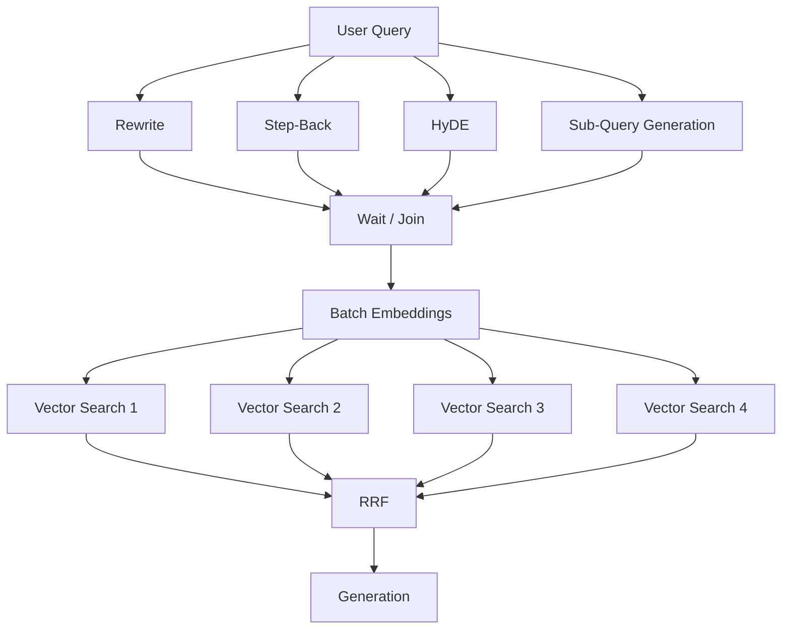
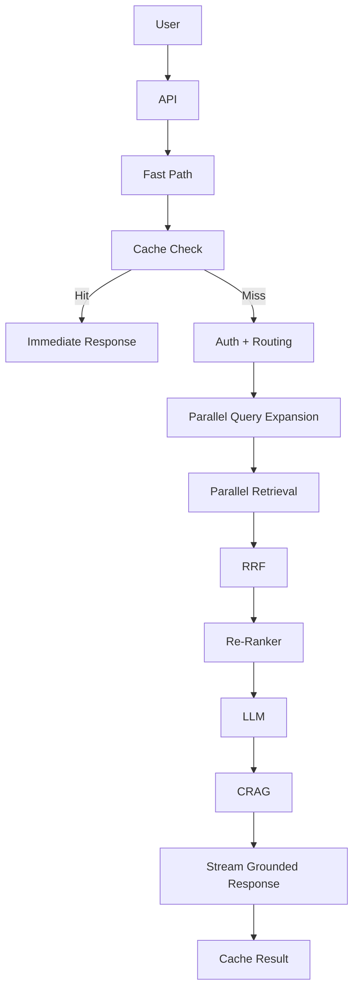
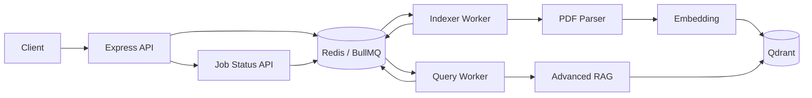
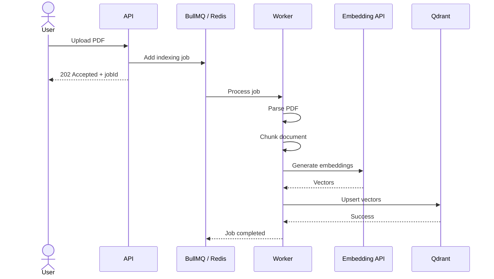
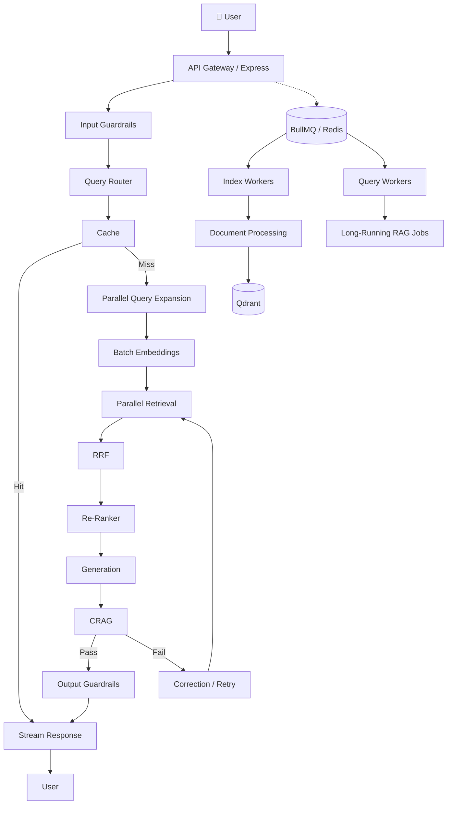

# 06. Latency Optimization & Asynchronous Queue Architecture

## 📌 Overview

Advanced RAG improves **retrieval quality**, but every extra step can increase latency.

A simple RAG might look like:

```text
User
 ↓
Embedding
 ↓
Vector Search
 ↓
LLM
 ↓
Response
```

Advanced RAG can become:

```text
User
 ↓
Query Rewrite
 ↓
Step-Back
 ↓
HyDE
 ↓
Sub-Queries
 ↓
Multi-Source Search
 ↓
RRF
 ↓
Re-Ranking
 ↓
LLM
 ↓
CRAG
 ↓
Retry
 ↓
Output Guardrails
 ↓
Response
```

If everything runs **sequentially**, latency can grow significantly.

So production RAG needs another concern:

> **How do we improve accuracy without making the user wait unnecessarily?**

The major techniques are:

1. **Parallel execution**
2. **Streaming**
3. **Caching**
4. **Asynchronous queues**
5. **Background workers**
6. **Timeouts and fallbacks**
7. **Batching**

---

# 1. Where Does RAG Latency Come From?

Imagine the following timings:

```text
Query Rewrite       → 300 ms
Step-Back           → 300 ms
HyDE                → 400 ms
Sub-Queries         → 500 ms
Embedding           → 200 ms
Vector Search       → 150 ms
RRF                 → 20 ms
Re-Ranker           → 700 ms
Generation          → 1500 ms
CRAG                → 500 ms
```

If everything is sequential:

```text
300 + 300 + 400 + 500 + 200 + 150 + 20 + 700 + 1500 + 500

≈ 4.57 seconds
```

And this is before network variability, retries, database load, etc.

The solution isn't necessarily:

> "Remove all the advanced RAG components."

Instead:

> **Run independent work concurrently and move long-running work outside the request-response path.**

---

# 2. Sequential vs Parallel Execution

## ❌ Sequential



Everything waits for the previous operation.

---

# 3. Parallel Execution

Some operations are independent.



Instead of:

```text
Rewrite
  ↓
Step-Back
  ↓
HyDE
  ↓
Sub-Query
```

we can often do:

```text
             ┌→ Rewrite ──────┐
             ├→ Step-Back ────┤
Query ───────┼→ HyDE ─────────┼→ Join
             └→ Sub-Queries ──┘
```

---

# 4. JavaScript Implementation

Your idea using `Promise.all()` is correct.

```javascript
const [
  rewritten,
  stepBack,
  hyde,
  subQueries
] = await Promise.all([
  rewriteQuery(query),
  generateStepBackQuery(query),
  generateHyDE(query),
  generateSubQueries(query)
]);
```

Now these operations run concurrently.

### Sequential

```javascript
const rewritten = await rewriteQuery(query);

const stepBack = await generateStepBackQuery(query);

const hyde = await generateHyDE(query);

const subQueries = await generateSubQueries(query);
```

### Parallel

```javascript
const [
  rewritten,
  stepBack,
  hyde,
  subQueries
] = await Promise.all([
  rewriteQuery(query),
  generateStepBackQuery(query),
  generateHyDE(query),
  generateSubQueries(query)
]);
```

---

# 5. Parallel Vector Searches

Once we have the query variants:

```text
Rewrite
Step-Back
HyDE
Sub-Query 1
Sub-Query 2
Sub-Query 3
```

we can search concurrently.

```javascript
const queries = [
  rewritten,
  stepBack,
  hyde,
  ...subQueries
];

const vectors = await embedTexts(queries);

const results = await Promise.all(
  vectors.map(vector => vectorSearch(vector))
);
```

Then:

```text
Multiple Searches
       ↓
      RRF
       ↓
Re-ranked candidates
```

---

# 6. Batch Embeddings

Another optimization is **batching**.

Instead of:

```text
Embed Query 1 → API
Embed Query 2 → API
Embed Query 3 → API
Embed Query 4 → API
```

send:

```text
[
  Query 1,
  Query 2,
  Query 3,
  Query 4
]
       ↓
Embedding API
       ↓
[
  Vector 1,
  Vector 2,
  Vector 3,
  Vector 4
]
```

```javascript
const vectors = await embedTexts([
  rewritten,
  stepBack,
  hyde,
  ...subQueries
]);
```

This can reduce network overhead and simplify orchestration.

---

# 7. Important: Don't Parallelize Everything

Parallelism isn't automatically better.

For example:

```text
Query
 ↓
Authorization
 ↓
Router
```

You cannot safely run retrieval before you know whether the user is authorized to access the data.

Think in terms of **dependency graphs**.

```text
User Query
    │
    ▼
Authentication
    │
    ▼
Authorization
    │
    ▼
Query Translation
    │
    ├──────┬──────┬──────┐
    ↓      ↓      ↓      ↓
 Rewrite StepBack HyDE SubQuery
    │      │      │      │
    └──────┴──────┴──────┘
               ↓
            Retrieval
```

Parallelize **independent operations**, not security-critical dependencies.

---

# 8. User-Perceived Latency

There are two different latency concepts.

### Actual latency

How long the complete operation takes.

### Perceived latency

How long the user waits before seeing useful output.

These aren't always the same.

For example:

```text
Request
  ↓
200 ms
  ↓
First token appears
  ↓
User sees response
  ↓
More tokens arrive
  ↓
Complete answer
```

This is why **streaming** is important.

---

# 9. Streaming

Instead of:

```text
Request
     │
     │  4 seconds
     │
     ▼
Complete Response
```

we can do:

```text
Request
  │
  ▼
First Token
  │
  ├── token
  ├── token
  ├── token
  ├── token
  └── complete
```

The user immediately sees progress.

---

# 10. Important Correction: Generic Answer Fallback

Your raw note suggested:

> Start a generic answer immediately while advanced RAG runs, then replace it with the RAG answer.

This needs caution.

For a factual enterprise RAG system, **you generally should not show an ungrounded generic answer as if it were the final answer and then replace it later**.

For example:

```text
User:
"What is our company's refund policy?"
```

Don't immediately show:

```text
"Generally, companies allow refunds within 30 days..."
```

That could be wrong for your company.

A safer pattern is:

```text
User
 ↓
Immediate streaming status / safe acknowledgement
 ↓
"Let me check the relevant policy..."
 ↓
Advanced RAG
 ↓
Grounded answer
```

Or stream only once sufficient evidence is available:

```text
Query
 ↓
Fast retrieval
 ↓
Evidence
 ↓
Stream grounded answer
```

So:

> **Streaming improves perceived latency; it does not mean you should stream ungrounded facts.**

---

# 11. Better Latency Architecture



---

# 12. Caching

One of the simplest latency optimizations is:

> **Don't perform expensive work twice.**

Potential cache layers:

```text
Query Cache
Embedding Cache
Retrieval Cache
LLM Response Cache
Document Metadata Cache
```

Example:

```text
"What is our refund policy?"
```

If thousands of users ask the same general question:

```text
First request
   ↓
RAG
   ↓
Answer
   ↓
Cache

Next request
   ↓
Cache
   ↓
Answer
```

But be careful with personalized or permission-sensitive answers.

For example:

```text
"What is my account balance?"
```

should not simply use a shared response cache.

---

# 13. Asynchronous Processing

Some operations should **not happen inside the user's HTTP request**.

Examples:

```text
Large PDF indexing
Video processing
Document parsing
Embedding thousands of chunks
Bulk ingestion
Report generation
Large data exports
Long-running AI jobs
```

Instead:

```text
API
 ↓
Create Job
 ↓
Queue
 ↓
Worker
 ↓
Process
```

---

# 14. Why Queues?

Imagine uploading a 500-page PDF.

The API receives:

```text
POST /documents
```

Then the server tries:

```text
Upload
 ↓
Parse PDF
 ↓
Chunk 10,000 pieces
 ↓
Generate 10,000 embeddings
 ↓
Insert into Qdrant
```

The HTTP request may take minutes.

That's a bad API design.

Instead:

```text
Client
 ↓
POST /documents
 ↓
API
 ↓
Queue
 ↓
202 Accepted
```

The client gets:

```json
{
  "jobId": "101",
  "status": "queued"
}
```

The worker handles the expensive operation.

---

# 15. Queue Architecture



---

# 16. BullMQ Mental Model

Think of BullMQ as:

```text
Producer
   ↓
Queue
   ↓
Worker
   ↓
Job
   ↓
Result
```

### Producer

Your API adds a job.

```javascript
await indexingQueue.add("index-file", {
  filePath,
  documentId
});
```

### Worker

A background process consumes it.

```javascript
new Worker(
  "indexing",
  async job => {
    await processDocument(job.data);
  }
);
```

---

# 17. Complete PDF Indexing Flow



The user doesn't need to keep the HTTP request open.

---

# 18. 202 Accepted

For asynchronous operations, the API commonly responds with:

```http
202 Accepted
```

Example:

```json
{
  "jobId": "101",
  "status": "queued"
}
```

Then the client can ask:

```http
GET /jobs/101
```

Response:

```json
{
  "jobId": "101",
  "status": "processing"
}
```

Later:

```json
{
  "jobId": "101",
  "status": "completed"
}
```

---

# 19. Polling vs WebSocket / SSE

Polling:

```text
Client
 ↓
GET /jobs/101
 ↓
processing

wait

GET /jobs/101
 ↓
processing

wait

GET /jobs/101
 ↓
completed
```

Alternative:

```text
Client
 ↓
SSE / WebSocket
 ↓
Server pushes:
"processing"
"embedding"
"completed"
```

For real-time job progress, SSE/WebSockets can provide a better UX than frequent polling.

---

# 20. Separate Worker Pools

This is a very important production concept.

Suppose:

```text
100 large PDFs
```

are being indexed.

If indexing and user queries share the same worker pool:

```text
PDF Job
PDF Job
PDF Job
PDF Job
PDF Job
...
      ↓
Workers busy
      ↓
User Query waits ❌
```

Instead:

```text
             Queue System
                 │
       ┌─────────┴─────────┐
       ↓                   ↓
Indexing Workers       Query Workers
       │                   │
       ↓                   ↓
PDF processing        User requests
```

For example:

```text
Index Worker
concurrency = 2

Query Worker
concurrency = 4
```

The exact values should be determined through load testing rather than treated as universal defaults.

---

# 21. Retry Strategy

External services can fail temporarily:

```text
OpenAI
Qdrant
S3
PostgreSQL
Redis
Network
```

Don't immediately fail every job.

Use retries.

```javascript
await queue.add(
  "index-file",
  payload,
  {
    attempts: 3,
    backoff: {
      type: "exponential",
      delay: 2000
    }
  }
);
```

Conceptually:

```text
Attempt 1
   ↓
Failure
   ↓
2 sec
   ↓
Attempt 2
   ↓
Failure
   ↓
4 sec
   ↓
Attempt 3
```

This helps with temporary failures.

---

# 22. Why Exponential Backoff?

Without backoff:

```text
Failure
 ↓
Retry immediately
 ↓
Failure
 ↓
Retry immediately
 ↓
Failure
```

Thousands of workers can repeatedly hit an already struggling service.

With backoff:

```text
Failure
 ↓
Wait
 ↓
Retry
 ↓
Wait longer
 ↓
Retry
```

This reduces pressure on external services.

---

# 23. Dead-Letter Queue

What happens if a job fails three times?

Don't silently lose it.

```text
Job
 ↓
Attempt 1 ❌
 ↓
Attempt 2 ❌
 ↓
Attempt 3 ❌
 ↓
Dead Letter Queue
```

Then an operator can inspect:

```text
Job ID
Error
Payload
Timestamp
Attempts
Stack trace
```

This is extremely useful for production debugging.

---

# 24. Timeouts Are Also Important

Never allow external calls to wait forever.

For example:

```text
Embedding API
     │
     │  timeout
     ▼
Fallback / Retry
```

A production request should have a controlled deadline:

```text
Request Budget = 5 sec

Query Rewrite       500ms
Retrieval           1 sec
Reranker            700ms
LLM                 2 sec
Guardrails          500ms
```

The exact budget depends on your application.

---

# 25. Queue vs Normal Request

A useful rule:

### Synchronous

Use when the result should arrive quickly.

```text
User Query
 ↓
API
 ↓
RAG
 ↓
Response
```

### Asynchronous

Use when work is long-running.

```text
Upload PDF
 ↓
API
 ↓
Queue
 ↓
202
 ↓
Worker
 ↓
Qdrant
```

---

# 26. Complete Production Architecture



---

# 27. The Three Latency Layers

Think about optimization at three levels.

## ⚡ Layer 1 — Parallelism

```text
Independent tasks
      ↓
Promise.all()
```

Reduces **wall-clock time**.

---

## ⚡ Layer 2 — Streaming

```text
LLM
 ↓
Token
 ↓
Token
 ↓
Token
```

Reduces **perceived latency**.

---

## ⚡ Layer 3 — Queues

```text
Long-running work
       ↓
Background worker
```

Removes expensive work from the **HTTP request lifecycle**.

---

# 28. The Most Important Architecture

Remember:

```text
              FAST PATH
                  │
                  ▼
             User Query
                  │
                  ▼
          Input Guardrails
                  │
                  ▼
             Query Router
                  │
                  ▼
        ┌─────────┴─────────┐
        ↓                   ↓
     Cache Hit           Cache Miss
        │                   │
        ↓                   ▼
    Response         Parallel RAG
                            │
                            ▼
                          RRF
                            │
                            ▼
                         Rerank
                            │
                            ▼
                           LLM
                            │
                            ▼
                          CRAG
                            │
                            ▼
                       Guardrails
                            │
                            ▼
                         Stream
```

And for heavy work:

```text
             HEAVY PATH

Upload PDF
    │
    ▼
   API
    │
    ▼
 BullMQ / Redis
    │
    ▼
 Worker
    │
    ├── Parse
    ├── Chunk
    ├── Embed
    └── Index
         │
         ▼
       Qdrant
```

---

# 🔥 Day 05 — Part 06 Key Takeaways

### **Parallelism**

> Run independent query transformations and retrieval operations concurrently.

### **Batching**

> Batch embedding requests instead of making many small network calls.

### **Streaming**

> Improve perceived latency by delivering grounded output progressively.

### **Caching**

> Avoid repeating expensive retrieval and generation work where safe.

### **Queues**

> Move long-running work outside the HTTP request lifecycle.

### **Workers**

> Process queued jobs independently from the API server.

### **Retries**

> Recover from temporary failures using bounded retries and exponential backoff.

### **Dead-letter queues**

> Preserve jobs that repeatedly fail for later inspection.

### **The key mental model**

> **Parallelism makes one request faster, streaming makes it feel faster, and asynchronous queues make long-running work reliable.**
