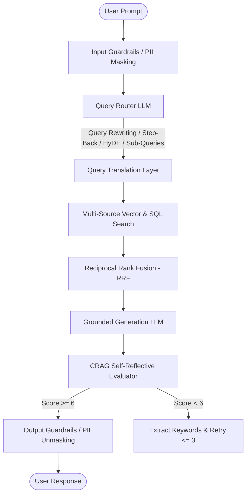

# 📚 Week 03 Day 05: Advanced RAG Architecture Master Notes

Welcome to the comprehensive module notes for **Day 05: Advanced Retrieval-Augmented Generation (RAG)**.

This index connects all technical topics covered during the raw class lecture [`raw class.md`](file:///home/aminul/development/gen-ai-cohort/week03/learning/day05/notes/raw%20class.md).

---

## 📑 Module Table of Contents

| # | Topic Document | Key Concepts Covered |
| :-: | :--- | :--- |
| **01** | [01. Naive RAG vs. Production Advanced RAG](file:///home/aminul/development/gen-ai-cohort/week03/learning/day05/notes/01-naive-rag-vs-production-rag.md) | Naive indexing/retrieval flaws, query mismatch, vector distance mismatch, the 3 phases of Production RAG. |
| **02** | [02. Query Translation: Step-Back Prompting, HyDE & Decomposition](file:///home/aminul/development/gen-ai-cohort/week03/learning/day05/notes/02-query-translation-step-back-hyde-decomposition.md) | Query rewriting, Step-Back Prompting (DeepMind research paper, Ideal Gas Law $PV=nRT$, Estella Leopold case studies), Sub-query decomposition, HyDE. |
| **03** | [03. Query Routing & Multi-Source Adapter Architecture](file:///home/aminul/development/gen-ai-cohort/week03/learning/day05/notes/03-query-routing-multi-source-adapter.md) | Multi-database orchestration (Auth SQL, MongoDB, Qdrant Vector DB, AWS S3), Query Router LLM, Adapter pattern. |
| **04** | [04. Reciprocal Rank Fusion (RRF) & Corrective RAG (CRAG)](file:///home/aminul/development/gen-ai-cohort/week03/learning/day05/notes/04-rrf-ranking-and-crag-evaluation.md) | Reciprocal Rank Fusion ($RRF(d) = \sum \frac{1}{k + r(d)}$), multi-query list merging, CRAG mini-model evaluation loop, score thresholds (< 6 retry, max 3 retries). |
| **05** | [05. Input & Output Guardrails: PII Masking, Security & Jailbreaks](file:///home/aminul/development/gen-ai-cohort/week03/learning/day05/notes/05-input-output-guardrails-and-pii-masking.md) | Input/Output guardrails, network/CDN log privacy risks, regex & name-to-UUID bidirectional masking, competitor policy filtering, Guardrails AI framework. |
| **06** | [06. Latency Optimization & Asynchronous Queue Architecture](file:///home/aminul/development/gen-ai-cohort/week03/learning/day05/notes/06-latency-optimization-and-async-queues.md) | Parallel task spawning (`Promise.all`), Generic stream fallback, BullMQ + Redis async event-driven queues, job polling architecture. |

---

## 🎯 Architectural Summary Matrix

