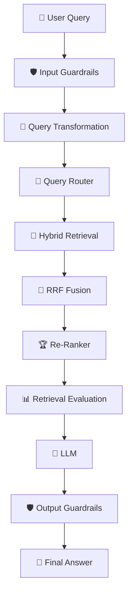
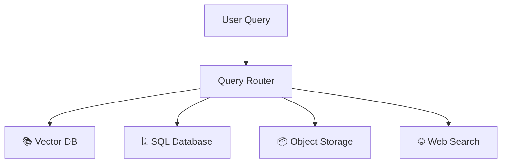
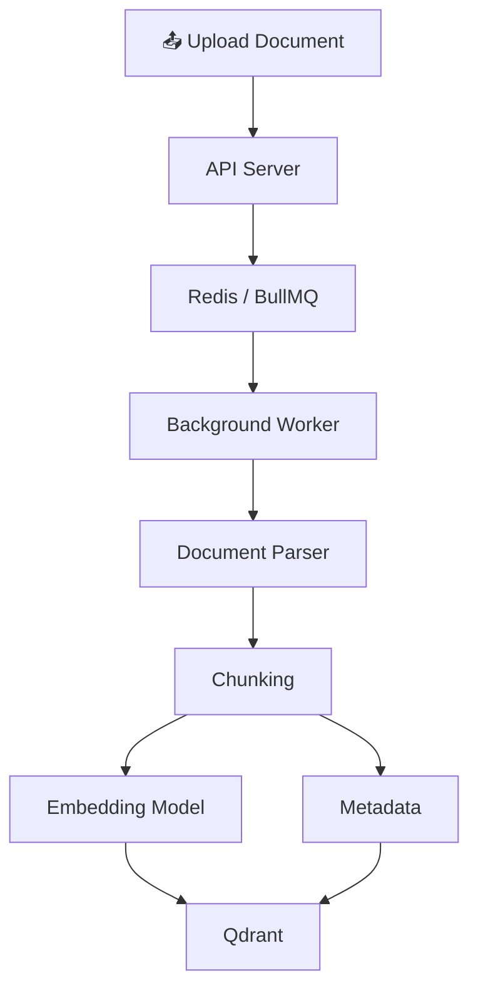

# 🎯 Week 03 — Day 05 Interview Questions & Deep Dive Answers

# Topic: Advanced Production RAG Pipelines, Query Transformations, Routing, RRF & CRAG

> **Target Audience:** AI Engineers, RAG Engineers, Production RAG Architects, and LLM Application Developers.

This version keeps your original topics but improves the answers to be **interview-friendly, technically accurate, and easy to explain**. I’ve also added several **important follow-up questions** that interviewers commonly ask.

---

## 📑 Table of Contents

1. **Category 1 — Naive RAG Limitations & Production Architecture**
2. **Category 2 — Query Transformation & Expansion**
3. **Category 3 — Multi-Source Query Routing**
4. **Category 4 — Hybrid Search, RRF, CRAG & Security**
5. **Category 5 — Scaling & Async Architecture**
6. **Category 6 — Production RAG Evaluation & Observability**
7. **Category 7 — Scenario-Based Interview Questions**

---

# 1. Category 1 — Naive RAG Limitations & Production RAG Architecture

## Q1: What is Naive RAG, and what are its major limitations?

### 💡 Easy Interview Answer

**Naive RAG** is the simplest RAG architecture:

```text
User Query
    ↓
Create Query Embedding
    ↓
Vector Database Search
    ↓
Top-K Chunks
    ↓
LLM
    ↓
Answer
```

It works well for simple questions, but production systems face several problems.

### 4 Major Failure Modes

| Problem                     | What happens?                                          | Example                                              |
| --------------------------- | ------------------------------------------------------ | ---------------------------------------------------- |
| **Poor Retrieval**          | Relevant documents aren't retrieved                    | Query uses "salary" but document says "compensation" |
| **Context Fragmentation**   | Important information is split across chunks           | Definition is in one chunk, explanation in another   |
| **Query-Document Mismatch** | User question and document language are very different | Short question vs detailed technical document        |
| **Too Much Context**        | Too many chunks are sent to the LLM                    | Relevant information gets buried in irrelevant text  |

### 🧠 Simple way to remember

```text
Bad Query
   ↓
Bad Retrieval
   ↓
Bad Context
   ↓
Bad Answer
```

### 🎯 Interview Tip

Don't say **"RAG solves hallucination."**

A better answer is:

> "RAG reduces hallucination by grounding the model in retrieved information, but the quality of the final answer still depends heavily on retrieval quality and the model's ability to follow the provided context."

---

# Q2: How is Production RAG different from Naive RAG?

### 💡 Answer

Naive RAG usually does:

```text
Query → Vector Search → LLM
```

A production RAG system adds multiple layers to improve **retrieval quality, security, reliability, scalability, and observability**.



### Production RAG can include:

* Input validation
* PII detection
* Query rewriting
* Query decomposition
* HyDE
* Step-back prompting
* Query routing
* Dense retrieval
* Sparse retrieval
* Metadata filtering
* RRF
* Re-ranking
* Retrieval evaluation
* CRAG
* LLM generation
* Output validation
* Logging and tracing

### 🎯 Interview Answer

> "The major difference is that production RAG treats retrieval as a complete pipeline rather than simply performing vector search."

---

# Q3: What is the difference between Retrieval Precision and Retrieval Recall?

### 💡 Answer

This is a **very common interview question**.

### Precision

**Precision asks:**

> "Of the documents I retrieved, how many were actually relevant?"

```text
Retrieved 10 documents
8 are relevant

Precision = 8 / 10 = 80%
```

### Recall

**Recall asks:**

> "Of all the relevant documents available, how many did I retrieve?"

```text
There are 10 relevant documents
We retrieved 7

Recall = 7 / 10 = 70%
```

### Easy memory trick

```text
Precision → "Are my retrieved results relevant?"

Recall → "Did I find all the relevant results?"
```

### In RAG

You generally want:

```text
High Recall
     ↓
Don't miss useful information
     ↓
Re-ranker
     ↓
High Precision
     ↓
Send only useful chunks to LLM
```

---

# Q4: What is the "Lost in the Middle" problem?

### 💡 Answer

When a very large amount of context is provided to an LLM, the model may pay more attention to information near the **beginning and end** of the context than information buried in the middle.

For example:

```text
Chunk 1     ← Important
Chunk 2
Chunk 3
Chunk 4
Chunk 5     ← Important
Chunk 6
Chunk 7
Chunk 8     ← Important
```

If we send 50 irrelevant chunks just because they have reasonably good similarity scores, important information can become harder for the model to use.

### Solution

Instead of:

```text
Retrieve 50 → Send 50 → LLM
```

Use:

```text
Retrieve 50
    ↓
Re-rank
    ↓
Select Top 5
    ↓
LLM
```

---

# 2. Category 2 — Query Transformation & Expansion

# Q5: What is Query Transformation?

### 💡 Answer

**Query transformation** means changing the user's original query into a form that is better for retrieval.

For example:

```text
Original:
"Why is my app slow?"

        ↓

Rewritten:
"What are the common causes of performance degradation
in mobile applications?"
```

The goal is to make retrieval more effective.

---

# Q6: Compare Query Rewriting, Step-Back Prompting, HyDE, and Sub-Query Decomposition.

### 💡 Answer

| Technique           | What it does                           | Best for                     |
| ------------------- | -------------------------------------- | ---------------------------- |
| **Query Rewriting** | Reformulates the query                 | Poor wording / vague queries |
| **Multi-Query**     | Creates several variations             | Improving recall             |
| **Step-Back**       | Creates a broader conceptual question  | Complex reasoning            |
| **HyDE**            | Creates hypothetical answer/document   | Query-document mismatch      |
| **Sub-Query**       | Breaks one query into multiple queries | Multi-part questions         |

---

## Q7: What is Multi-Query Retrieval?

### 💡 Answer

Suppose the user asks:

> "How can I improve my application's performance?"

One query may not retrieve everything.

The system can generate:

```text
Query 1:
"How to optimize application performance?"

Query 2:
"Common causes of slow application performance?"

Query 3:
"Application performance optimization techniques?"

Query 4:
"How to reduce application latency?"
```

Then search for all queries.

```text
                Original Query
                      ↓
              Query Generator
              ↙      ↓      ↘
          Query 1  Query 2  Query 3
              ↓       ↓       ↓
           Search   Search   Search
              ↘       ↓      ↙
                 Merge
                   ↓
                Re-rank
```

### Benefit

It improves **recall** because different queries may find different relevant documents.

---

# Q8: What is Step-Back Prompting?

### 💡 Answer

Step-back prompting asks:

> "Instead of searching for the exact question, what broader concept do I need to understand first?"

Example:

```text
User:
"Why does increasing temperature increase
the pressure inside this container?"

              ↓

Step Back:
"What is the relationship between temperature,
particle motion, and gas pressure?"
```

The broader question can retrieve foundational information that helps answer the original question.

### Best use case

Complex questions requiring **background knowledge or reasoning**.

---

# Q9: What is HyDE?

### 💡 Answer

**HyDE = Hypothetical Document Embeddings.**

Instead of directly embedding the user's question:

```text
User Query
    ↓
Embedding
    ↓
Vector Search
```

HyDE does:

```text
User Query
    ↓
LLM generates hypothetical answer/document
    ↓
Embed hypothetical document
    ↓
Vector Search
    ↓
Real documents
```

### Example

```text
Query:
"What are the benefits of indexing in databases?"

        ↓

Hypothetical document:
"Database indexing improves query performance by
reducing the amount of data that must be scanned..."

        ↓

Embedding
        ↓
Vector Search
```

### Why does it help?

Because a hypothetical answer may look more like the **actual documents** in the knowledge base than the original short question.

---

# Q10: What is Sub-Query Decomposition?

### 💡 Answer

It breaks a complex question into smaller independent questions.

Example:

> "Compare Qdrant and Pinecone based on pricing, hosting, filtering, and scalability."

The system can create:

```text
1. What are the pricing models of Qdrant and Pinecone?
2. How are Qdrant and Pinecone hosted?
3. How does metadata filtering compare?
4. How does scalability compare?
```

Each query is retrieved independently and the results are combined.

### Best for

* Comparison questions
* Multi-hop questions
* Complex research
* Multi-part queries

---

# 3. Category 3 — Multi-Source Query Routing

# Q11: What is Query Routing in RAG?

### 💡 Answer

Not every question should go to a vector database.

For example:

```text
"Explain our employee leave policy."
        ↓
Vector DB
```

But:

```text
"How many employees joined in 2025?"
        ↓
SQL Database
```

And:

```text
"Give me the original PDF."
        ↓
Object Storage
```

So a **query router** decides where the query should go.



---

# Q12: Why shouldn't we store everything in a Vector Database?

### 💡 Answer

Because different types of data require different retrieval mechanisms.

| Data                    | Better system         |
| ----------------------- | --------------------- |
| PDF/document text       | Vector DB             |
| Exact IDs               | SQL / Key-value DB    |
| Aggregations            | SQL                   |
| Structured transactions | SQL                   |
| Original files          | Object storage        |
| Current web information | Web search            |
| Logs                    | Search/logging system |

### Interview Answer

> "Vector search is excellent for semantic retrieval, but it isn't a replacement for every type of database."

---

# Q13: Semantic Router vs LLM Router — What's the difference?

### 💡 Answer

### Semantic Router

Uses embeddings to determine which route is closest.

```text
Query
 ↓
Embedding
 ↓
Compare with route embeddings
 ↓
SQL / Vector / Web
```

### LLM Router

An LLM decides which tool or backend should handle the query.

```text
Query
 ↓
LLM
 ↓
Tool Selection
 ↓
SQL / Vector / Web
```

### Comparison

|                   | Semantic Router  | LLM Router       |
| ----------------- | ---------------- | ---------------- |
| Speed             | Faster           | Slower           |
| Cost              | Low              | Higher           |
| Flexibility       | Lower            | Higher           |
| Complex reasoning | Limited          | Better           |
| Deterministic     | More predictable | Less predictable |

---

# Q14: What is Metadata Filtering in RAG?

### 💡 Answer

Metadata filtering allows us to search only within documents matching specific conditions.

For example:

```json
{
  "tenant_id": "company_123",
  "department": "engineering",
  "access_level": "internal"
}
```

A query could require:

```text
tenant_id = company_123
AND
department = engineering
```

Then vector similarity is performed only against permitted documents.

### Why is this important?

For:

* Multi-tenant applications
* Access control
* Department-specific documents
* Document type filtering
* Date filtering
* Region filtering

---

# Q15: Is Metadata Filtering alone enough for security?

### 💡 Answer

**No.**

This is an important production interview question.

Metadata filtering is one layer of security, but authorization should be enforced **before and during retrieval**, and ideally validated again before generation.

A safer architecture is:

```text
User
 ↓
Authentication
 ↓
Authorization
 ↓
Determine allowed tenant/data
 ↓
Metadata-filtered retrieval
 ↓
Re-ranking
 ↓
LLM
 ↓
Output validation
```

### Interview Answer

> "I would never rely only on the LLM to enforce authorization. Access control must be implemented at the application and data-retrieval layers."

---

# 4. Category 4 — Hybrid Search, RRF, CRAG & Security

# Q16: What is Hybrid Search?

### 💡 Answer

Hybrid search combines:

```text
Dense Vector Search
+
Sparse Keyword Search
```

### Dense Search

Good for:

> Meaning and semantic similarity.

### Sparse Search / BM25

Good for:

> Exact words, names, IDs, technical terms, and keywords.

Example:

```text
Query:
"Error ERR_CONNECTION_RESET"

Dense search → understands semantic meaning

BM25 → finds exact "ERR_CONNECTION_RESET"
```

Combining both can provide better retrieval.

---

# Q17: What is Reciprocal Rank Fusion (RRF)?

### 💡 Answer

RRF combines ranked lists from different search systems.

Suppose:

```text
Vector Search:

1. A
2. B
3. C

BM25:

1. B
2. C
3. D
```

RRF gives points based on ranking.

### Formula

[
RRF(d) = \sum_m \frac{1}{k + rank_m(d)}
]

Where:

* `d` = document
* `m` = retrieval method
* `rank` = position of document
* `k` = smoothing constant, commonly 60

### Why not simply average scores?

Because different search algorithms produce scores on different scales.

```text
Vector score → 0.0–1.0

BM25 score → potentially much larger values
```

Directly averaging them can be misleading.

RRF works with **rank positions**, making it less dependent on score scales.

---

# Q18: Explain RRF with a simple example.

### 💡 Answer

Suppose:

```text
Vector:
1. A
2. B
3. C

BM25:
1. B
2. C
3. D
```

For `B`:

```text
Vector rank = 2
BM25 rank = 1

RRF(B)
= 1/(60+2) + 1/(60+1)
```

For `A`:

```text
Vector rank = 1
BM25 = not found

RRF(A)
= 1/(60+1)
```

Because `B` appears highly in **both systems**, its combined score becomes stronger.

### Simple idea

> **A document that consistently ranks well across multiple retrieval methods should receive a higher combined ranking.**

---

# Q19: What is Re-Ranking?

### 💡 Answer

Re-ranking is a second retrieval stage used to improve precision.

Instead of:

```text
Query
 ↓
Vector DB
 ↓
Top 5
 ↓
LLM
```

we can use:

```text
Query
 ↓
Vector/BM25
 ↓
Top 50
 ↓
Re-ranker
 ↓
Top 5
 ↓
LLM
```

The first retriever is optimized for **speed**.

The re-ranker is optimized for **accuracy**.

---

# Q20: What is CRAG?

### 💡 Answer

**CRAG = Corrective Retrieval-Augmented Generation.**

The system evaluates retrieved documents before generating the final answer.

```text
Query
 ↓
Retrieve
 ↓
Evaluate Retrieval
 ↓
 ┌──────────────┬───────────────┬───────────────┐
 ↓              ↓               ↓
Correct       Ambiguous       Incorrect
 ↓              ↓               ↓
Generate     Refine          Fallback Search
```

### Example

Suppose the user asks:

> "What is our company's refund policy?"

But the retrieved documents are about employee leave.

CRAG detects that retrieval quality is poor and can trigger another retrieval strategy instead of blindly asking the LLM to answer.

### Key idea

> **Don't blindly trust retrieval. Evaluate it first.**

---

# Q21: What happens when retrieval quality is poor in CRAG?

### 💡 Answer

Depending on the implementation:

### Correct

```text
Retrieved Context
      ↓
LLM
```

### Ambiguous

```text
Retrieved Context
      ↓
Clean / refine / retrieve again
      ↓
LLM
```

### Incorrect

```text
Bad Retrieval
      ↓
Alternative Search
      ↓
Web Search / Another Retriever
      ↓
LLM
```

This makes the system more robust than naive RAG.

---

# Q22: How do you protect PII in an enterprise RAG system?

### 💡 Answer

PII means **Personally Identifiable Information**, such as:

* Email addresses
* Phone numbers
* Government IDs
* Addresses
* Names, depending on context

A security pipeline can detect and mask sensitive information before sending data to an external model.

```text
Original:
"Contact john@example.com"

        ↓

PII Detection

        ↓

"Contact [EMAIL_1]"

        ↓

LLM

        ↓

"Please contact [EMAIL_1]"

        ↓

Restore if authorized
```

### Important production consideration

The mapping:

```text
EMAIL_1 → john@example.com
```

should be stored securely and should not simply be exposed to the LLM.

---

# 5. Category 5 — System Scaling & Async Queue Implementations

# Q23: Why should document indexing be asynchronous?

### 💡 Answer

Document ingestion can involve:

```text
PDF Download
   ↓
PDF Parsing
   ↓
Text Extraction
   ↓
Chunking
   ↓
Embedding Generation
   ↓
Vector DB Upsert
```

This can take seconds or even minutes for large documents.

Doing everything inside an HTTP request is a bad idea.

### Bad architecture

```text
POST /upload
      ↓
Parse PDF
      ↓
Generate embeddings
      ↓
Insert vectors
      ↓
Response
```

The request may timeout.

### Better architecture

```text
Client
 ↓
POST /upload
 ↓
API Server
 ↓
Create Job
 ↓
Redis / BullMQ
 ↓
Background Worker
 ↓
Parse → Chunk → Embed → Qdrant
```

The API can immediately return:

```json
{
  "jobId": "job_123",
  "status": "processing"
}
```

---

# Q24: Why use BullMQ + Redis for RAG indexing?

### 💡 Answer

**BullMQ** manages background jobs, while **Redis** acts as the underlying data store/message broker.

Benefits include:

* Asynchronous processing
* Retry failed jobs
* Multiple workers
* Concurrency control
* Job status tracking
* Delayed jobs
* Better API responsiveness

Example:

```text
              ┌─────────────┐
              │ API Server  │
              └──────┬──────┘
                     │
                  Add Job
                     ↓
              ┌─────────────┐
              │ Redis/BullMQ│
              └──────┬──────┘
                     │
          ┌──────────┼──────────┐
          ↓          ↓          ↓
       Worker 1   Worker 2   Worker 3
          ↓          ↓          ↓
       Embed      Embed      Embed
          └──────────┼──────────┘
                     ↓
                  Qdrant
```

---

# Q25: What is the difference between synchronous and asynchronous RAG?

### 💡 Answer

### Synchronous

The client waits for the entire operation.

```text
Request
 ↓
Process
 ↓
Response
```

### Asynchronous

The server creates a job and processes it separately.

```text
Request
 ↓
Job Created
 ↓
Immediate Response
 ↓
Background Processing
 ↓
Client checks status
```

### Important distinction

**Document indexing** is a strong candidate for asynchronous processing.

**User query retrieval** is usually expected to be synchronous because users normally need an answer immediately.

---

# Q26: How would you design a production document ingestion pipeline?

### 💡 Answer

I would design it like this:



### Steps

1. Upload document.
2. Store original document.
3. Create indexing job.
4. Queue job using BullMQ.
5. Worker parses document.
6. Clean extracted text.
7. Split into chunks.
8. Generate embeddings.
9. Attach metadata.
10. Upsert vectors into Qdrant.
11. Mark job as completed.

---

# 6. Category 6 — Production RAG Evaluation & Observability

# Q27: How do you evaluate a RAG system?

### 💡 Answer

A RAG system should be evaluated at **multiple levels**.

### Retrieval Evaluation

Measure:

* Precision
* Recall
* Hit Rate
* MRR
* NDCG

### Generation Evaluation

Measure:

* Faithfulness
* Answer relevance
* Correctness
* Context relevance

### System Evaluation

Measure:

* Latency
* Token usage
* Cost
* Error rate
* Retrieval failures

### Pipeline

```text
              RAG Evaluation
                    │
        ┌───────────┴───────────┐
        ↓                       ↓
 Retrieval Evaluation    Generation Evaluation
        ↓                       ↓
 Precision                Faithfulness
 Recall                   Relevance
 MRR                      Correctness
 NDCG
```

---

# Q28: What is MRR?

### 💡 Answer

**MRR = Mean Reciprocal Rank.**

It measures how high the **first relevant result** appears.

For one query:

```text
Results:

1. Irrelevant
2. Irrelevant
3. Relevant
```

Reciprocal rank:

[
RR = \frac{1}{3}
]

If the relevant result is first:

[
RR = 1
]

For multiple queries, average all reciprocal ranks to obtain MRR.

### Simple explanation

> "MRR tells us whether the first useful result appears near the top."

---

# Q29: What is RAGAS / RAG evaluation framework used for?

### 💡 Answer

RAG evaluation frameworks can help evaluate RAG pipelines using metrics such as:

* Faithfulness
* Answer relevance
* Context relevance
* Context recall

The goal is to determine **where the RAG pipeline is failing**.

For example:

```text
Good Context + Bad Answer
        ↓
Generation problem

Bad Context + Bad Answer
        ↓
Retrieval problem
```

This distinction is extremely useful when debugging production RAG.

---

# Q30: What should you log in a production RAG system?

### 💡 Answer

I would log things like:

```text
Request ID
User / Tenant ID
Original Query
Transformed Query
Selected Route
Retrieved Document IDs
Retrieval Scores
RRF Scores
Re-ranker Scores
Final Context IDs
LLM Model
Latency
Token Usage
Final Response
Errors
```

But sensitive information should be **redacted or protected**.

### Why?

Without observability, if the user says:

> "The RAG answer is wrong."

we won't know whether:

```text
Query transformation failed
        ↓
Retrieval failed
        ↓
Reranking failed
        ↓
Wrong context
        ↓
LLM generation failed
```

---

# 7. Category 7 — Scenario-Based Interview Questions

# Q31: Your RAG system retrieves the wrong documents. What would you investigate?

### 💡 Strong Interview Answer

I would debug the pipeline from retrieval backward:

```text
1. Check original query
        ↓
2. Check transformed query
        ↓
3. Check embeddings
        ↓
4. Check chunking
        ↓
5. Check metadata filters
        ↓
6. Check similarity metric
        ↓
7. Check Top-K
        ↓
8. Check hybrid search
        ↓
9. Check re-ranking
```

I would also inspect actual retrieved chunks instead of only looking at the final LLM answer.

### Important point

> "I would separate retrieval problems from generation problems before changing the LLM."

---

# Q32: Your RAG system gives good answers for simple questions but fails on complex questions. What would you add?

### 💡 Answer

I would consider:

```text
Complex Query
     ↓
Query Classification
     ↓
Sub-Query Decomposition
     ↓
Multiple Retrievals
     ↓
RRF
     ↓
Re-ranking
     ↓
LLM
```

Depending on the problem, I might also use:

* Query rewriting
* Step-back prompting
* HyDE
* Multi-query retrieval
* CRAG

---

# Q33: Vector search works well, but exact product IDs are frequently missed. What would you do?

### 💡 Answer

I would add **hybrid retrieval**.

Vector search is good for semantic meaning, but exact identifiers are often better handled by keyword/sparse search.

```text
                 Query
                   ↓
          ┌────────┴────────┐
          ↓                 ↓
     Vector Search       BM25 Search
          ↓                 ↓
          └────────┬────────┘
                   ↓
                  RRF
                   ↓
               Re-ranker
```

---

# Q34: Your RAG system is slow. How would you optimize it?

### 💡 Answer

I would measure each stage first.

```text
Query Transformation     300ms
Retrieval                 80ms
Reranking                250ms
LLM                      900ms
```

Then optimize the actual bottleneck.

Possible optimizations:

* Use smaller/faster models for routing
* Cache embeddings
* Cache frequent queries
* Reduce unnecessary query transformations
* Tune Top-K
* Use efficient vector indexes
* Parallelize independent retrievals
* Reduce re-ranking candidates
* Stream LLM output
* Use async processing for ingestion

### Strong interview statement

> "I wouldn't optimize blindly. First I would trace latency across every stage and optimize the largest contributor."

---

# Q35: How would you reduce the cost of a production RAG system?

### 💡 Answer

I would optimize both **retrieval and generation**.

### Retrieval

* Better chunking
* Metadata filtering
* Smaller Top-K
* Efficient indexing
* Query caching
* Avoid unnecessary transformations

### Generation

* Use smaller models where possible
* Limit context size
* Cache repeated questions
* Use structured prompts
* Avoid multiple unnecessary LLM calls

### Example

Instead of:

```text
Query
 ↓
LLM Rewrite
 ↓
LLM Step Back
 ↓
LLM HyDE
 ↓
Search
 ↓
LLM Rerank
 ↓
LLM Answer
```

we should only use advanced stages when they actually improve quality enough to justify their latency and cost.

---

# Q36: What is the most important principle when designing a Production RAG system?

### 💡 Answer

A strong interview answer would be:

> **"Don't treat RAG as simply a vector database plus an LLM. A production RAG system is an end-to-end retrieval and generation pipeline where query transformation, retrieval quality, ranking, access control, evaluation, scalability, observability, and generation all work together."**

### The complete mental model

```text
                         PRODUCTION RAG

User
 │
 ▼
Input Guardrails
 │
 ▼
Query Understanding
 │
 ├── Rewrite
 ├── Multi-Query
 ├── Step-Back
 ├── HyDE
 └── Decomposition
 │
 ▼
Query Router
 │
 ├── Vector DB
 ├── SQL
 ├── Object Store
 └── Web Search
 │
 ▼
Retrieval
 │
 ├── Dense Search
 └── Sparse Search
 │
 ▼
RRF
 │
 ▼
Re-Ranking
 │
 ▼
CRAG / Retrieval Evaluation
 │
 ├── Good → Continue
 └── Bad → Retry / Fallback
 │
 ▼
LLM
 │
 ▼
Output Guardrails
 │
 ▼
Final Answer
```

---

# ⭐ Bonus Rapid-Fire Interview Questions

These are worth preparing because an interviewer may ask them as follow-ups.

### Q37: Why do we use Top-K retrieval?

**Answer:**
To limit the number of candidate documents returned to the LLM. A larger K improves recall but can introduce noise, latency, and context-window pressure.

---

### Q38: Why not simply retrieve Top-1?

**Answer:**
Because the most similar chunk may not contain all the information needed to answer the question. Retrieving several candidates improves recall.

---

### Q39: Why not send Top-100 chunks to the LLM?

**Answer:**
It increases token cost and latency and can introduce irrelevant information, potentially hurting answer quality.

---

### Q40: What is the difference between retrieval and re-ranking?

**Answer:**

> Retrieval finds a candidate set quickly. Re-ranking carefully orders that candidate set based on deeper query-document relevance.

```text
Retrieval → Find candidates
Re-ranking → Find the best candidates
```

---

### Q41: What is Dense Retrieval?

**Answer:**
Dense retrieval represents queries and documents as embedding vectors and finds semantically similar vectors.

---

### Q42: What is Sparse Retrieval?

**Answer:**
Sparse retrieval represents text using keyword-based representations and is particularly useful for exact terms, names, identifiers, and rare words.

BM25 is a common example.

---

### Q43: What is Hybrid Retrieval?

**Answer:**

> "Hybrid retrieval combines dense semantic search with sparse keyword search to get the strengths of both approaches."

---

### Q44: What is a Retrieval Failure vs Generation Failure?

**Answer:**

```text
Wrong Context
     ↓
Retrieval Failure

Correct Context
     ↓
Wrong Answer
     ↓
Generation Failure
```

This distinction is important when debugging RAG.

---

### Q45: Can RAG replace Fine-Tuning?

**Answer:**

**Not always.**

Use **RAG** when you need external, dynamic, private knowledge.

Use **fine-tuning** when you need to change model behavior, style, format, or specialized task performance.

And in some systems, **both can be used together**.

---

# 🧠 Final Interview Cheat Sheet

| Concept                | One-Line Explanation                                       |
| ---------------------- | ---------------------------------------------------------- |
| **Naive RAG**          | Query → Vector Search → LLM                                |
| **Production RAG**     | Multi-stage retrieval + security + evaluation + generation |
| **Query Rewriting**    | Rewrite query for better retrieval                         |
| **Multi-Query**        | Generate multiple search variations                        |
| **Step-Back**          | Search for broader concepts                                |
| **HyDE**               | Generate hypothetical document → embed → search            |
| **Sub-Query**          | Break complex query into smaller queries                   |
| **Query Router**       | Select the correct data source                             |
| **Dense Search**       | Semantic similarity using embeddings                       |
| **Sparse Search**      | Keyword-based retrieval such as BM25                       |
| **Hybrid Search**      | Dense + Sparse retrieval                                   |
| **RRF**                | Merge multiple ranked lists                                |
| **Re-Ranker**          | Improve ordering of retrieved candidates                   |
| **CRAG**               | Evaluate retrieval before generation                       |
| **Metadata Filtering** | Restrict retrieval using structured metadata               |
| **PII Masking**        | Protect sensitive user information                         |
| **BullMQ**             | Background job processing                                  |
| **Redis**              | Queue/backend infrastructure                               |
| **Qdrant**             | Vector database                                            |
| **Precision**          | How many retrieved results are relevant                    |
| **Recall**             | How many relevant results were retrieved                   |
| **MRR**                | How high the first relevant result ranks                   |
| **Observability**      | Understand what happens inside the RAG pipeline            |

## 🎯 The 10 Questions I Would Prioritize for an Interview

If you have limited preparation time, focus especially on:

1. **How does Production RAG differ from Naive RAG?**
2. **What are the major failure modes of RAG?**
3. **Query Rewriting vs Multi-Query vs Step-Back vs HyDE?**
4. **What is Sub-Query Decomposition?**
5. **Why use Hybrid Search?**
6. **What is RRF and why is it useful?**
7. **Bi-Encoder vs Cross-Encoder/Re-ranker?**
8. **What is CRAG and why do we need it?**
9. **How would you scale document ingestion with BullMQ + Redis?**
10. **How would you debug a RAG system that gives incorrect answers?**

**Best interview strategy:** don't just memorize definitions. For almost every RAG question, explain it using **Problem → Technique → Example → Trade-off**. That makes your answer sound much more like an engineer who has actually designed the system rather than someone who memorized terminology.
