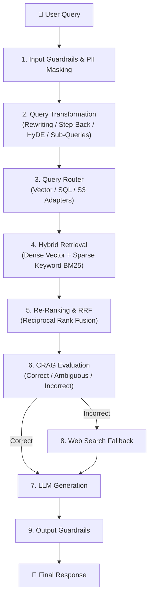

# 🎯 Week 03 — Day 05 Interview Questions & Deep Dive Answers

# Topic: Advanced Production RAG Pipelines, Query Transformations, Routing, RRF & CRAG

> **Target Audience:** Senior AI Engineers, Production RAG System Architects, and Enterprise LLM Pipeline Developers.

---

## 📑 Table of Contents

1. [Category 1 — Naive RAG Limitations & Production RAG Architecture](#1-category-1--naive-rag-limitations--production-rag-architecture)
2. [Category 2 — Query Transformation & Expansion Techniques](#2-category-2--query-transformation--expansion-techniques)
3. [Category 3 — Multi-Source Query Routing & Adapters](#3-category-3--multi-source-query-routing--adapters)
4. [Category 4 — Hybrid Search, Re-Ranking (RRF), CRAG & Security](#4-category-4--hybrid-search-re-ranking-rrf-crag--security)
5. [Category 5 — System Scaling & Async Queue Implementations](#5-category-5--system-scaling--async-queue-implementations)

---

# 1. Category 1 — Naive RAG Limitations & Production RAG Architecture

## Q1: What are the 4 main failure modes of Naive RAG?

### 💡 Answer:

```text
                  ┌─────────────────────────────────────────┐
                  │        NAIVE RAG FAILURE MODES          │
                  └────────────────────┬────────────────────┘
                                       │
        ┌──────────────────┬───────────┴───────────┬──────────────────┐
        ▼                  ▼                       ▼                  ▼
┌───────────────┐  ┌───────────────┐       ┌───────────────┐  ┌───────────────┐
│ Low Retrieval │  │ Context       │       │ Semantic      │  │ Lost in the   │
│ Precision/Recall││ Fragmentation │       │ Mismatch      │  │ Middle Bloat  │
└───────────────┘  └───────────────┘       └───────────────┘  └───────────────┘
```

1. **Low Retrieval Precision/Recall:** Vector similarity search retrieves irrelevant chunks or misses critical information due to vocabulary mismatch.
2. **Context Fragmentation:** Chunks are severed during naive splitting, losing critical context needed to answer the question.
3. **Semantic Mismatch:** User queries are short and question-oriented, while document chunks are detailed and statement-oriented, causing low vector overlap.
4. **Lost in the Middle Bloat:** Feeding too many top-$K$ chunks into the context window causes attention degradation where the LLM ignores information located in middle chunks.

---

## Q2: How does a Production Advanced RAG Pipeline differ from Naive RAG?

### 💡 Answer:



Unlike Naive RAG (Direct Vector Search $\to$ Prompt $\to$ LLM), Production RAG introduces **pre-retrieval query transformations**, **multi-source routing**, **hybrid retrieval with RRF re-ranking**, **corrective evaluation (CRAG)**, and **security guardrails**.

---

# 2. Category 2 — Query Transformation & Expansion Techniques

## Q3: Compare Query Rewriting, Step-Back Prompting, HyDE, and Sub-Query Decomposition.

### 💡 Answer:

| Technique | Mechanism | Best Used For |
| :--- | :--- | :--- |
| **Query Rewriting** | LLM reformulates user query into 3–5 diverse variations. | Overcoming user typos, bad phrasing, or vocabulary mismatch. |
| **Step-Back Prompting** | LLM generates a higher-level abstract concept question. | Answering complex reasoning questions requiring background principles. |
| **HyDE** | LLM generates a hypothetical answer document, which is then embedded to search for real chunks. | Bridging the gap between short queries and detailed text chunks. |
| **Sub-Query Decomposition** | Breaking a complex multi-part query into multiple independent sub-queries. | Comparative or multi-step questions ("Compare product A and product B"). |

---

## Q4: How does Step-Back Prompting prevent narrow vector search failures?

### 💡 Answer:
* **The Problem:** Specific questions like *"Did physics laws allow object X to accelerate at Y rate in 1995?"* fail in vector search because no document contains that exact specific sentence.
* **Step-Back Solution:** The LLM generates a broader step-back question: *"What are Newton's laws of acceleration?"*. Searching for the step-back principles retrieves foundational context that enables the LLM to reason through the specific question.

---

# 3. Category 3 — Multi-Source Query Routing & Adapters

## Q5: What is Query Routing, and how do Multi-Source Adapters work in RAG?

### 💡 Answer:
Not all enterprise data belongs in a Vector Database.
* **Vector Store Adapter:** Best for unstructured documents (PDFs, Articles, Guides).
* **Relational SQL Adapter (Text-to-SQL):** Best for structured metrics, sales figures, and tabular aggregations (*"How many users signed up in Q3?"*).
* **Document / Object Store Adapter (S3):** Best for raw log downloads or document ID lookups.

**Query Routing** uses a decision router (semantic or LLM-based) to inspect incoming user queries and direct them to the appropriate storage adapter.

---

## Q6: Compare Semantic Routers vs LLM-Based Query Routers.

### 💡 Answer:
* **Semantic Router:** Embeds the user query and computes cosine similarity against predefined route vector centroids (e.g. `sql_route` vs `vector_route`). Executes in **< 10ms** with zero LLM API cost.
* **LLM-Based Router:** Prompts a lightweight LLM (e.g. `gpt-4o-mini`) with tool choices to select the destination backend. Highly accurate for complex edge cases, but adds **200–500ms** latency.

---

# 4. Category 4 — Hybrid Search, Re-Ranking (RRF), CRAG & Security

## Q7: What is Reciprocal Rank Fusion (RRF)? State its mathematical formula and explain why it is superior to score averaging.

### 💡 Answer:
**Reciprocal Rank Fusion (RRF)** is an algorithm that combines search result rankings from multiple independent retrieval systems (e.g. Dense Vector Search + Sparse Keyword BM25) into a single unified rank list.

### 📐 RRF Formula:
$$\text{RRF\_Score}(d \in D) = \sum_{m \in M} \frac{1}{k + r_m(d)}$$

Where:
* $M$ is the set of retrieval systems (e.g. Vector Search, Keyword Search).
* $r_m(d)$ is the rank position of document $d$ in system $m$ (1-indexed).
* $k$ is a smoothing constant (typically $k = 60$).

### 🌟 Why RRF is Superior to Score Averaging:
Vector similarity scores ($\cos \theta \in [0, 1]$) and BM25 keyword scores ($[0, \infty)$) have completely different scale distributions. Averaging them directly distorts rankings. RRF evaluates **relative rank positions**, making it scale-invariant and immune to score calibration mismatch.

---

## Q8: What is Corrective RAG (CRAG) and how does it handle retrieval evaluations dynamically?

### 💡 Answer:
**Corrective RAG (CRAG)** evaluates the quality of retrieved document chunks using a evaluator model before generating the final answer.

```text
                     ┌─────────────────────────────────────────┐
                     │          CRAG EVALUATION STAGES         │
                     └────────────────────┬────────────────────┘
                                          │
        ┌─────────────────────────────────┼─────────────────────────────────┐
        ▼                                 ▼                                 ▼
┌───────────────┐                 ┌───────────────┐                 ┌───────────────┐
│ 🟢 CORRECT    │                 │ 🟡 AMBIGUOUS   │                 │ 🔴 INCORRECT  │
│ Context is    │                 │ Context is    │                 │ Context is    │
│ high quality. │                 │ borderline.   │                 │ irrelevant/bad│
│ Pass to LLM.  │                 │ Strip noisy   │                 │ Trigger Web   │
└───────────────┘                 │ sentences.    │                 │ Search Fallback
                                  └───────────────┘                 └───────────────┘
```

---

## Q9: How do PII Masking and Data Anonymization work in enterprise RAG pipelines?

### 💡 Answer:
Before sending user context or queries to third-party public LLM APIs (OpenAI, Anthropic), an enterprise security layer detects and anonymizes **Personally Identifiable Information (PII)** using regex patterns and Named Entity Recognition (NER) models:

```text
Raw Text:  "Contact Sarah Johnson at sarah@acme.com or SSN 123-45-6789."
Masked:    "Contact [NAME_1] at [EMAIL_1] or SSN [SSN_1]."
```

After the LLM generates a response containing the masked placeholders, an un-masking layer restores original values for the user.

---

# 5. Category 5 — System Scaling & Async Queue Implementations

## Q10: Why should Document Indexing be decoupled from Web API servers using background queues (BullMQ + Redis)?

### 💡 Answer:
Document indexing (downloading PDFs, splitting text, computing vector embeddings, upserting to Qdrant) is CPU- and network-heavy. Executing indexing synchronously inside HTTP request handlers causes API request timeouts, blocks the Node.js event loop, and crashes servers under load.

Decoupling indexing via background worker queues (**BullMQ + Redis**) allows the API server to respond immediately with a `jobId`, processing document ingestion asynchronously in background worker threads.

---

## Q11: Write a Node.js implementation of Reciprocal Rank Fusion (RRF).

### 💡 Answer:

```javascript
function reciprocalRankFusion(resultsFromSearchEngines, k = 60) {
  const rrfScores = new Map(); // docId -> { doc, score }

  resultsFromSearchEngines.forEach((searchEngineResults) => {
    searchEngineResults.forEach((doc, rankIndex) => {
      const rank = rankIndex + 1; // 1-indexed rank
      const current = rrfScores.get(doc.id) || { doc, score: 0 };
      current.score += 1 / (k + rank);
      rrfScores.set(doc.id, current);
    });
  });

  // Convert map to array and sort by combined RRF score descending
  const combined = Array.from(rrfScores.values());
  combined.sort((a, b) => b.score - a.score);

  return combined.map((item) => ({ ...item.doc, rrfScore: item.score }));
}

// Execution Demo
const vectorResults = [
  { id: "doc_A", text: "Vector result 1" },
  { id: "doc_B", text: "Vector result 2" }
];
const keywordResults = [
  { id: "doc_B", text: "Keyword result 1" },
  { id: "doc_C", text: "Keyword result 2" }
];

const rrfMerged = reciprocalRankFusion([vectorResults, keywordResults]);
console.log("RRF Merged Rankings:", rrfMerged);
```

---

## Q12: Write a Node.js implementation of a PII Masking function.

### 💡 Answer:

```javascript
function maskPII(text) {
  const piiPatterns = [
    { type: "EMAIL", regex: /[a-zA-Z0-9._%+-]+@[a-zA-Z0-9.-]+\.[a-zA-Z]{2,}/g },
    { type: "PHONE", regex: /\b\d{3}[-.]?\d{3}[-.]?\d{4}\b/g },
    { type: "SSN", regex: /\b\d{3}-\d{2}-\d{4}\b/g }
  ];

  let maskedText = text;
  const piiMap = new Map();
  let counter = 1;

  for (const { type, regex } of piiPatterns) {
    maskedText = maskedText.replace(regex, (match) => {
      const placeholder = `[${type}_${counter++}]`;
      piiMap.set(placeholder, match);
      return placeholder;
    });
  }

  return { maskedText, piiMap };
}

// Execution Demo
const rawInput = "Please email john.doe@example.com or call 555-123-4567 regarding SSN 123-45-6789.";
const result = maskPII(rawInput);

console.log("Masked Prompt for LLM:", result.maskedText);
console.log("PII Vault Map:", result.piiMap);
```
