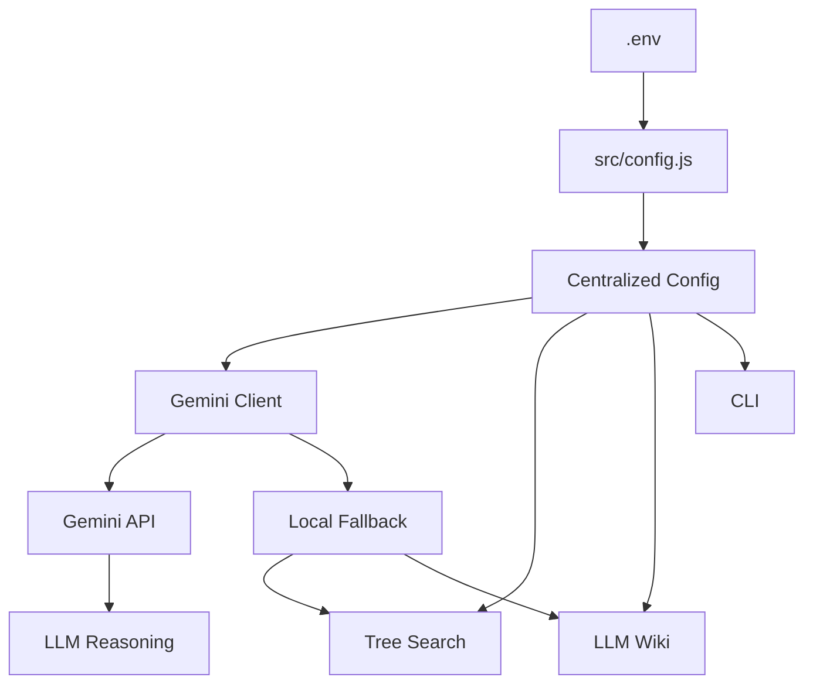
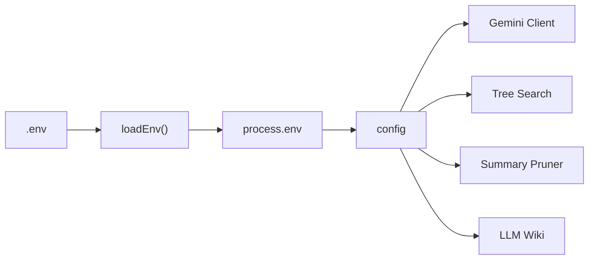
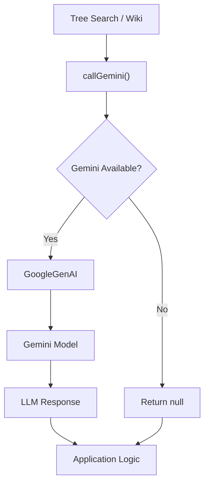
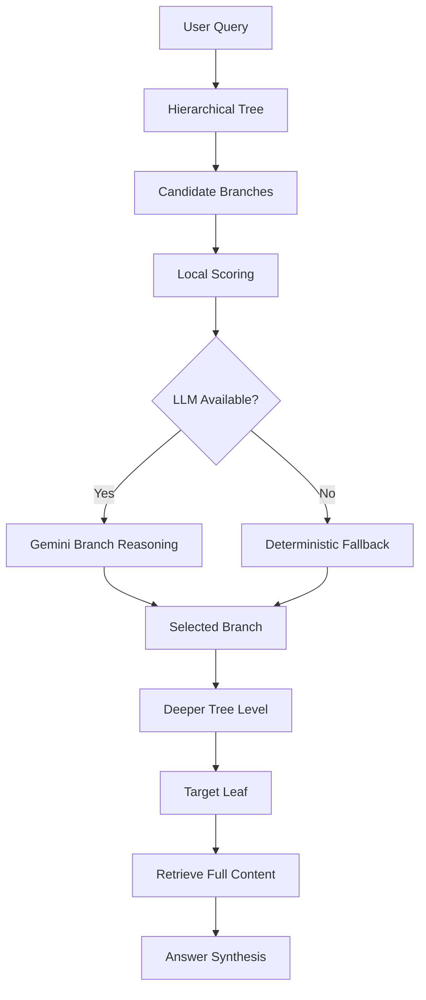
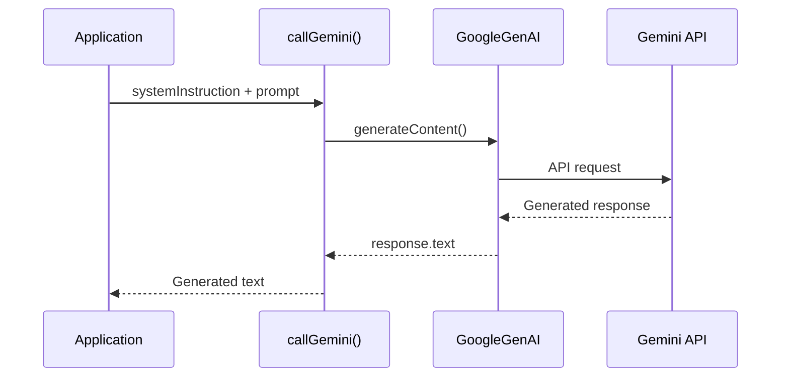
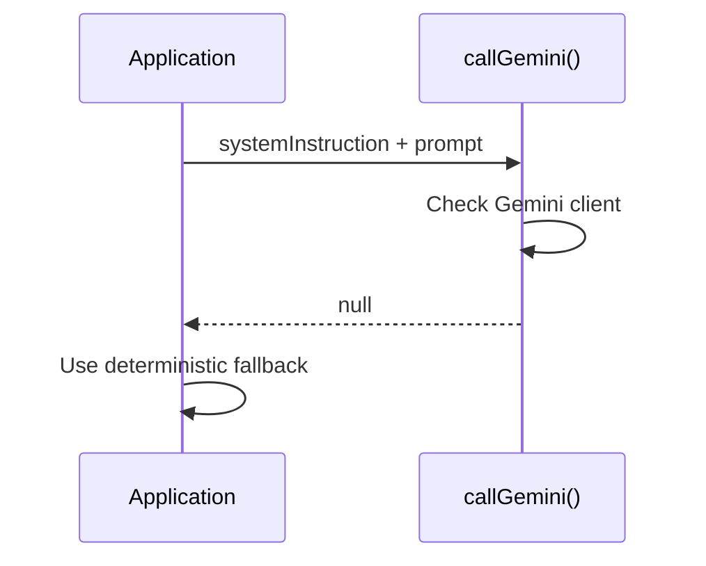

# Chapter 0 — Overview, Setup & Gemini SDK Integration

## 1. Chapter Goal

This chapter prepares the foundation for the **Advanced Vectorless RAG Engine**.

We will configure a Node.js ESM project and create a reusable Gemini API helper that later chapters can use for:

* LLM-based tree branch evaluation
* hierarchical search decisions
* wiki answer synthesis
* summary generation
* document classification
* structured reasoning decisions

The architecture is intentionally designed so that the application can **continue running locally even when Gemini is unavailable**.

That means:

```text
Gemini API available
        │
        ▼
LLM-powered reasoning
        │
        ▼
Advanced Vectorless RAG
```

but if the API is unavailable:

```text
Gemini unavailable
        │
        ▼
Local deterministic fallback
        │
        ▼
Application continues running
```

This is important because the tree-search engine should not completely depend on an external API just to execute basic retrieval.

### What we build

```text
adv-vectorless-rag/
│
├── package.json
├── .env.example
│
└── src/
    ├── config.js
    │
    └── search/
        └── geminiClient.js
```

The Gemini integration uses Google's current **Google GenAI JavaScript SDK**, `@google/genai`. Google's current documentation recommends this SDK over the legacy `@google/generative-ai` package. ([Google AI for Developers][1])

---

# 2. Architecture Overview

The configuration layer sits between the environment and the rest of the application.



The important idea is that application code should not repeatedly access:

```js
process.env.GEMINI_API_KEY
```

Instead, it should use:

```js
config.geminiApiKey
```

This keeps environment-specific configuration centralized.

---

# 3. Node.js Project Setup

## Project Directory

Navigate to the project directory:

```bash
cd week03/learning/day06/code/adv-vectorless-rag
```

This project uses native ES Modules.

Therefore `package.json` contains:

```json
"type": "module"
```

This allows us to write:

```js
import { config } from "./config.js";
```

instead of CommonJS:

```js
const { config } = require("./config");
```

---

# 4. `package.json`

## File

```text
adv-vectorless-rag/package.json
```

## Code

```json
{
  "name": "adv-vectorless-rag",
  "version": "1.0.0",
  "description": "Advanced Vectorless RAG Engine using hierarchical tree search and LLM Wiki architecture",
  "type": "module",
  "main": "src/index.js",
  "scripts": {
    "start": "node src/index.js",
    "cli": "node src/cli.js",
    "tree-search": "node src/cli.js --mode=tree",
    "llm-wiki": "node src/cli.js --mode=wiki",
    "benchmark": "node src/cli.js --mode=benchmark"
  },
  "keywords": [
    "vectorless-rag",
    "pageindex",
    "llm-wiki",
    "agentic-search",
    "gemini-api"
  ],
  "dependencies": {
    "@google/genai": "^2.21.0"
  }
}
```

## Why `@google/genai`?

The older package:

```text
@google/generative-ai
```

is now considered a legacy SDK. Google recommends migrating to:

```text
@google/genai
```

The current SDK exposes a unified `GoogleGenAI` client and supports current Gemini API capabilities. ([Google AI for Developers][1])

Install it with:

```bash
npm install @google/genai
```

The current package documentation lists Node.js 20+ as a prerequisite. ([npm][2])

---

# 5. Environment Configuration

## `.env.example`

Create:

```text
adv-vectorless-rag/.env.example
```

```env
# Application
NODE_ENV=development
LOG_LEVEL=info

# Gemini
GEMINI_API_KEY=your_gemini_api_key_here
GEMINI_MODEL=gemini-2.5-flash

# Vectorless RAG
DEFAULT_MAX_TREE_DEPTH=3
SUMMARY_PRUNING_THRESHOLD=1.5
```

Copy it to:

```bash
cp .env.example .env
```

Then replace:

```env
GEMINI_API_KEY=your_gemini_api_key_here
```

with your actual Gemini API key.

### Important

Never commit `.env` to Git.

Your `.gitignore` should contain:

```gitignore
.env
node_modules/
```

API keys should remain server-side and should never be exposed in browser/client-side code. ([npm][2])

---

# 6. Understanding the Configuration Values

### `NODE_ENV`

Controls the application environment.

```env
NODE_ENV=development
```

Typical values:

```text
development
test
production
```

---

### `LOG_LEVEL`

Controls how much diagnostic information the application should produce.

```env
LOG_LEVEL=info
```

Later we can support:

```text
debug
info
warn
error
```

---

### `GEMINI_API_KEY`

Authentication credential for the Gemini API.

```env
GEMINI_API_KEY=...
```

The application treats a missing key as:

```js
null
```

This allows local fallback execution.

---

### `GEMINI_MODEL`

Defines the Gemini model used by the application.

```env
GEMINI_MODEL=gemini-2.5-flash
```

Keeping the model name in configuration means the search engine does not need to hard-code it.

---

### `DEFAULT_MAX_TREE_DEPTH`

Controls how deeply an LLM-powered tree search is allowed to navigate.

```env
DEFAULT_MAX_TREE_DEPTH=3
```

For example:

```text
Root
 └── Chapter
      └── Section
           └── Subsection
```

A maximum depth prevents uncontrolled traversal.

---

### `SUMMARY_PRUNING_THRESHOLD`

Controls the minimum score required for a branch to remain viable.

```env
SUMMARY_PRUNING_THRESHOLD=1.5
```

This value will be used later by the `SummaryPruner`.

---

# 7. Central Configuration — `src/config.js`

## File

```text
adv-vectorless-rag/src/config.js
```

The configuration module has three responsibilities:

1. Load `.env`
2. Parse configuration values
3. Export one centralized `config` object

## Complete Code

```js
import fs from "node:fs";
import path from "node:path";

/**
 * Parse a .env value.
 *
 * Supports:
 * - normal values
 * - single quoted values
 * - double quoted values
 * - values containing "="
 */
function parseEnvValue(value) {
  const trimmed = value.trim();

  if (
    trimmed.length >= 2 &&
    (
      (trimmed.startsWith('"') &&
        trimmed.endsWith('"')) ||
      (trimmed.startsWith("'") &&
        trimmed.endsWith("'"))
    )
  ) {
    return trimmed.slice(1, -1);
  }

  return trimmed;
}

/**
 * Load environment variables from .env.
 *
 * This is intentionally lightweight so that
 * configuration does not require dotenv.
 */
function loadEnv() {
  const envPath = path.resolve(
    process.cwd(),
    ".env"
  );

  if (!fs.existsSync(envPath)) {
    return;
  }

  try {
    const content =
      fs.readFileSync(
        envPath,
        "utf8"
      );

    for (
      const rawLine
      of content.split(/\r?\n/)
    ) {
      const line = rawLine.trim();

      // Ignore blank lines and comments.
      if (
        !line ||
        line.startsWith("#")
      ) {
        continue;
      }

      const separatorIndex =
        line.indexOf("=");

      // Ignore malformed lines.
      if (separatorIndex === -1) {
        continue;
      }

      const key =
        line
          .slice(0, separatorIndex)
          .trim();

      const value =
        parseEnvValue(
          line.slice(
            separatorIndex + 1
          )
        );

      if (!key) {
        continue;
      }

      // Do not overwrite environment
      // variables already supplied by the OS.
      if (
        process.env[key] === undefined
      ) {
        process.env[key] = value;
      }
    }
  } catch (error) {
    console.warn(
      `[Config] Unable to load .env: ${error.message}`
    );
  }
}

/**
 * Parse a positive integer.
 */
function parsePositiveInteger(
  value,
  fallback
) {
  const parsed = Number(value);

  if (
    Number.isInteger(parsed) &&
    parsed > 0
  ) {
    return parsed;
  }

  return fallback;
}

/**
 * Parse a finite number.
 */
function parseNumber(
  value,
  fallback
) {
  const parsed = Number(value);

  return Number.isFinite(parsed)
    ? parsed
    : fallback;
}

loadEnv();

/**
 * Central application configuration.
 */
export const config = {
  env:
    process.env.NODE_ENV ||
    "development",

  logLevel:
    process.env.LOG_LEVEL ||
    "info",

  geminiApiKey:
    process.env.GEMINI_API_KEY ||
    null,

  geminiModel:
    process.env.GEMINI_MODEL ||
    "gemini-2.5-flash",

  maxTreeDepth:
    parsePositiveInteger(
      process.env.DEFAULT_MAX_TREE_DEPTH,
      3
    ),

  pruningThreshold:
    parseNumber(
      process.env.SUMMARY_PRUNING_THRESHOLD,
      1.5
    )
};
```

---

# 8. Explaining `config.js`

The file may look simple, but it solves several important problems.

## Block 1 — Node.js Built-ins

```js
import fs from "node:fs";
import path from "node:path";
```

We use Node's built-in modules.

`fs` allows us to read `.env`.

`path` allows us to construct a reliable filesystem path.

The `node:` prefix explicitly indicates that these are Node.js built-in modules.

No additional npm package is required for this configuration layer.

---

## Block 2 — `.env` Value Parsing

```js
function parseEnvValue(value) {
  const trimmed = value.trim();

  if (
    trimmed.length >= 2 &&
    (
      (trimmed.startsWith('"') &&
        trimmed.endsWith('"')) ||
      (trimmed.startsWith("'") &&
        trimmed.endsWith("'"))
    )
  ) {
    return trimmed.slice(1, -1);
  }

  return trimmed;
}
```

This allows:

```env
GEMINI_MODEL=gemini-2.5-flash
```

and:

```env
GEMINI_MODEL="gemini-2.5-flash"
```

to produce the same value.

The parser also correctly handles values containing `=` because we split only at the **first** `=`.

---

# 9. Why Not Simply Use `dotenv`?

For production applications, using a mature environment-variable library is perfectly reasonable.

However, this project deliberately demonstrates how configuration works using only Node.js primitives.

Therefore:

```text
.env
 ↓
fs
 ↓
custom parser
 ↓
process.env
 ↓
config
```

The important lesson is not that a custom parser is superior to `dotenv`.

The lesson is understanding what configuration libraries are doing underneath.

---

# 10. Protecting Existing Environment Variables

One important line is:

```js
if (process.env[key] === undefined) {
  process.env[key] = value;
}
```

Suppose the operating system already contains:

```bash
export GEMINI_API_KEY="production-key"
```

and `.env` contains:

```env
GEMINI_API_KEY=local-key
```

The operating-system value wins.

This is safer for deployment environments where secrets are injected by:

* Docker
* Kubernetes
* CI/CD systems
* cloud platforms
* deployment environments

---

# 11. Configuration Validation

Instead of blindly doing:

```js
Number(value) || 3
```

we validate numeric values explicitly.

For example:

```js
parsePositiveInteger(
  process.env.DEFAULT_MAX_TREE_DEPTH,
  3
)
```

This means:

```text
"5"     → 5
"10"    → 10
"abc"   → 3
"-2"    → 3
""      → 3
```

This prevents invalid configuration from silently entering the search engine.

---

# 12. Configuration Architecture

The resulting architecture is:



The rest of the application only needs to import:

```js
import { config } from "../config.js";
```

---

# 13. Gemini Client — `src/search/geminiClient.js`

Now we create the application-level Gemini wrapper.

## File

```text
adv-vectorless-rag/src/search/geminiClient.js
```

The goal is to expose a simple function:

```js
callGemini({
  systemInstruction,
  prompt
});
```

The rest of the application should not need to know:

* how the SDK is initialized
* which model is being used
* how errors are handled
* whether an API key exists
* how the Gemini request is constructed

That complexity belongs inside this module.

---

# 14. Complete Gemini Client

```js
import { GoogleGenAI } from "@google/genai";
import { config } from "../config.js";

/**
 * Gemini client instance.
 *
 * Remains null when no API key is configured.
 */
let gemini = null;

/**
 * Initialize Gemini only when an API key exists.
 */
if (
  config.geminiApiKey &&
  config.geminiApiKey !==
    "your_gemini_api_key_here"
) {
  try {
    gemini = new GoogleGenAI({
      apiKey: config.geminiApiKey
    });

    console.log(
      `[Gemini Client] Initialized with model: ${config.geminiModel}`
    );
  } catch (error) {
    console.warn(
      `[Gemini Client Warning] ` +
      `SDK initialization failed: ${error.message}`
    );
  }
} else {
  console.log(
    "[Gemini Client] No API key configured. " +
    "Local fallback mode enabled."
  );
}

/**
 * Call Gemini for text generation.
 *
 * @param {Object} params
 * @param {string} params.systemInstruction
 * @param {string} params.prompt
 * @returns {Promise<string|null>}
 */
export async function callGemini({
  systemInstruction,
  prompt
}) {
  if (
    typeof prompt !== "string" ||
    !prompt.trim()
  ) {
    throw new Error(
      "prompt must be a non-empty string."
    );
  }

  if (!gemini) {
    return null;
  }

  try {
    const response =
      await gemini.models.generateContent({
        model: config.geminiModel,

        contents: prompt,

        config: {
          systemInstruction:
            systemInstruction || undefined
        }
      });

    const text =
      response.text?.trim();

    return text || null;
  } catch (error) {
    console.warn(
      `[Gemini Client Warning] ` +
      `Gemini request failed: ${error.message}`
    );

    return null;
  }
}
```

---

# 15. Understanding the Gemini Client

## Block 1 — Import the SDK

```js
import { GoogleGenAI } from "@google/genai";
```

This imports Google's current JavaScript GenAI client.

We also import our centralized configuration:

```js
import { config } from "../config.js";
```

This gives the Gemini client access to:

```text
API key
model name
environment configuration
```

Google's current JavaScript examples use `GoogleGenAI` from `@google/genai`. ([Google AI for Developers][3])

---

# 16. Lazy API Initialization

We begin with:

```js
let gemini = null;
```

Then initialize the client only when a valid API key exists.

```js
if (
  config.geminiApiKey &&
  config.geminiApiKey !==
    "your_gemini_api_key_here"
) {
  ...
}
```

This gives us two states.

### Gemini enabled

```text
API key exists
     ↓
GoogleGenAI initialized
     ↓
LLM calls available
```

### Gemini disabled

```text
No API key
     ↓
gemini = null
     ↓
Local fallback
```

This makes the system much easier to develop locally.

---

# 17. Creating the Gemini Client

The important initialization code is:

```js
gemini = new GoogleGenAI({
  apiKey: config.geminiApiKey
});
```

The SDK client now has permission to communicate with Gemini.

We deliberately do this once instead of creating a new client for every request.

---

# 18. The `callGemini()` Abstraction

The rest of the project should call:

```js
const answer = await callGemini({
  systemInstruction:
    "You are a hierarchical retrieval agent.",

  prompt:
    "Which branch best answers the query?"
});
```

It should **not** need to know about:

```js
new GoogleGenAI(...)
```

or:

```js
gemini.models.generateContent(...)
```

That creates a clean abstraction boundary.



---

# 19. Sending a Request

The main request is:

```js
const response =
  await gemini.models.generateContent({
    model: config.geminiModel,
    contents: prompt,
    config: {
      systemInstruction:
        systemInstruction || undefined
    }
  });
```

There are three important pieces.

### Model

```js
model: config.geminiModel
```

The model comes from configuration rather than being hard-coded.

### Prompt

```js
contents: prompt
```

This contains the actual task.

### System instruction

```js
config: {
  systemInstruction
}
```

This gives the model higher-level behavioral instructions.

For example:

```text
You are a document retrieval agent.
Choose only from the provided branches.
Return the best branch ID and a short reason.
```

---

# 20. Extracting the Result

The current SDK exposes generated text through:

```js
response.text
```

Therefore:

```js
const text =
  response.text?.trim();
```

The optional chaining:

```js
?. 
```

prevents an immediate crash if the response does not contain text.

Then:

```js
return text || null;
```

ensures callers receive either:

```text
string
```

or:

```text
null
```

---

# 21. Why Return `null` Instead of Throwing?

This is an important architectural decision.

Suppose Gemini is temporarily unavailable:

```text
Tree Search
    ↓
callGemini()
    ↓
API error
```

We do not want:

```text
Application crashed
```

Instead:

```text
API error
    ↓
callGemini() → null
    ↓
Local reasoning
    ↓
Application continues
```

Later chapters can check:

```js
const llmDecision =
  await callGemini(...);

if (llmDecision) {
  // Use LLM decision
} else {
  // Use deterministic fallback
}
```

This creates a **hybrid retrieval architecture**.

---

# 22. Hybrid Vectorless RAG Architecture

The advanced architecture will eventually look like:



This is more robust than making the entire application dependent on an LLM.

---

# 23. Verification — Configuration

First verify that configuration works.

Run:

```bash
node --input-type=module -e "
import { config } from './src/config.js';

console.log('Environment:', config.env);
console.log('Gemini Model:', config.geminiModel);
console.log('Max Tree Depth:', config.maxTreeDepth);
console.log('Pruning Threshold:', config.pruningThreshold);
"
```

Expected output when using the example configuration:

```text
Environment: development
Gemini Model: gemini-2.5-flash
Max Tree Depth: 3
Pruning Threshold: 1.5
```

---

# 24. Verification — Gemini Client Without API Key

You should also verify that the project does not crash when Gemini is not configured.

Run:

```bash
node --input-type=module -e "
import { callGemini } from './src/search/geminiClient.js';

const result = await callGemini({
  systemInstruction: 'You are a retrieval assistant.',
  prompt: 'Choose the best branch for a query.'
});

console.log('Gemini Result:', result);
"
```

Without a configured API key, the expected behavior is:

```text
[Gemini Client] No API key configured. Local fallback mode enabled.
Gemini Result: null
```

This is intentional.

`null` means:

```text
Gemini is unavailable
        ↓
Use local reasoning
```

It does **not** mean that the application failed.

---

# 25. Verification — Gemini API

If you configure a valid API key:

```env
GEMINI_API_KEY=your_real_key
```

then run:

```bash
node --input-type=module -e "
import { callGemini } from './src/search/geminiClient.js';

const result = await callGemini({
  systemInstruction:
    'You are a concise technical assistant.',

  prompt:
    'Explain hierarchical document retrieval in one sentence.'
});

console.log('\\nGemini Result:\\n');
console.log(result);
"
```

You should receive a generated text response.

The exact response will vary because it is generated by the model.

---

# 26. Internal Execution Flow

When Gemini is enabled:



When Gemini is unavailable:



---

# 27. Why This Foundation Matters for Vectorless RAG

At this stage we have established three important layers.

### Layer 1 — Configuration

```text
.env
 ↓
config.js
```

### Layer 2 — LLM Interface

```text
config.js
 ↓
geminiClient.js
 ↓
Gemini API
```

### Layer 3 — Future Retrieval Intelligence

```text
Tree Search
     ↓
Gemini branch reasoning
     ↓
Wiki synthesis
```

The next chapters can therefore focus on retrieval architecture rather than repeatedly solving API initialization.

---

# 28. Important Architectural Note

This chapter introduces **LLM-assisted reasoning**, but it does not mean every retrieval operation must call Gemini.

That distinction is important.

A strong Vectorless RAG system can combine:

```text
Deterministic structure
        +
Lexical scoring
        +
LLM reasoning
        +
Explicit page hierarchy
        +
Human-readable documents
```

The LLM becomes a reasoning component rather than the entire retrieval mechanism.

This gives us:

* lower API usage
* predictable fallback behavior
* easier debugging
* transparent retrieval
* easier testing
* better control over costs

---

# 29. Production Considerations

The implementation in this chapter is intentionally educational, but several production improvements should eventually be added.

### 1. Retry policy

Transient API failures should use controlled retries.

```text
Request
  ↓
Failure?
  ↓
Retry with backoff
```

### 2. Request timeout

LLM requests should not wait forever.

### 3. Structured output

Later, branch-selection calls should return structured JSON rather than free-form text.

For example:

```json
{
  "selectedNodeId": "sec2_1",
  "confidence": 0.91
}
```

### 4. Rate limiting

Production systems need protection against excessive API calls.

### 5. Observability

Track:

```text
request count
latency
failure count
model
token usage
fallback count
```

### 6. Model configuration

Keep model selection outside application logic:

```env
GEMINI_MODEL=gemini-2.5-flash
```

so changing the model does not require rewriting the retrieval engine.

---

# 30. Chapter Summary

We have now created the foundation for the **Advanced Vectorless RAG Engine**.

### Completed

* Node.js ESM project
* `.env` configuration
* zero-dependency configuration loader
* configuration validation
* centralized `config` object
* current Google GenAI SDK integration
* reusable `callGemini()` helper
* API failure fallback
* local development mode

### Architecture

```text
.env
 ↓
config.js
 ↓
geminiClient.js
 ↓
┌──────────────────────┐
│ Gemini LLM Reasoning │
└──────────────────────┘
          │
          ▼
┌──────────────────────┐
│ Vectorless RAG       │
│ Tree Search          │
│ Wiki Retrieval       │
│ Answer Synthesis     │
└──────────────────────┘
```

The next chapter can now build the **Enhanced Hierarchical Tree Data Structure**, where Gemini will eventually become one of the decision-making components inside the tree-search pipeline.

## Key Takeaway

> **The LLM should enhance the retrieval architecture, not replace the architecture.**

The tree provides structure.

The metadata provides transparency.

The deterministic scorer provides a fallback.

The LLM provides higher-level reasoning.

Together, these components form the foundation of an advanced Vectorless RAG system.

**One important correction for your original series:** I would use `@google/genai` from this point forward instead of `@google/generative-ai`. Google's migration guide explicitly recommends moving from the legacy SDK, and the legacy package is now deprecated. ([Google AI for Developers][1])

