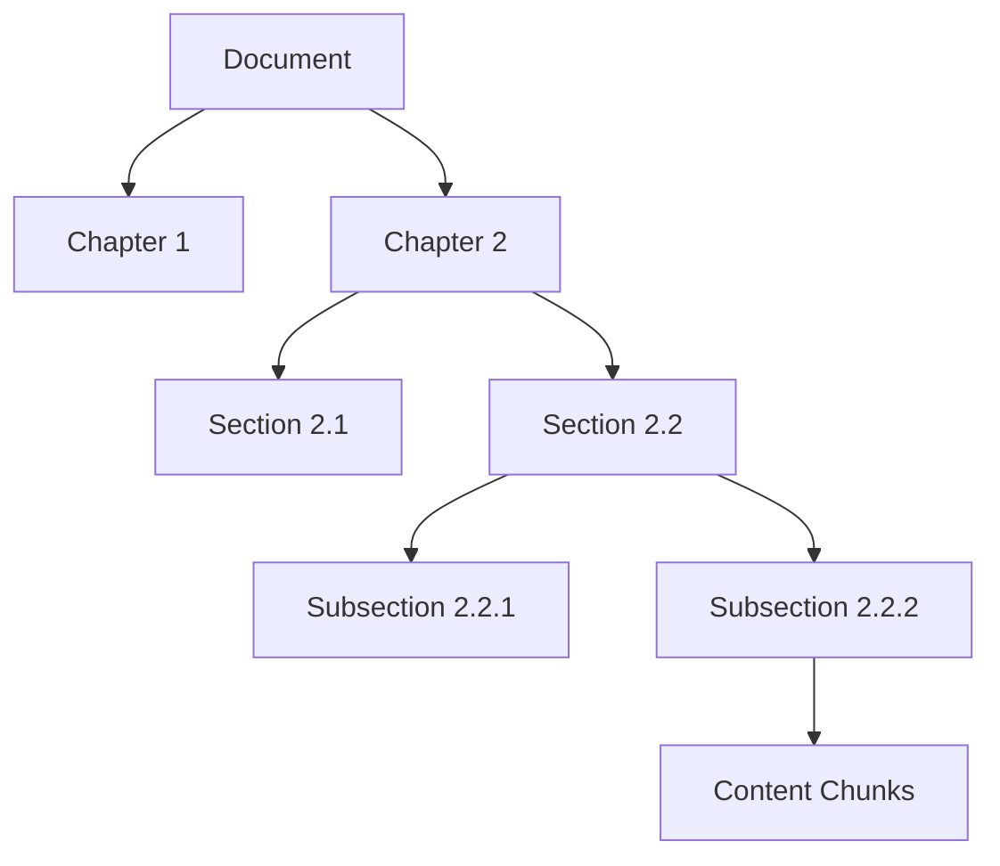
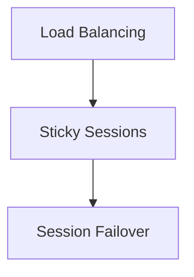
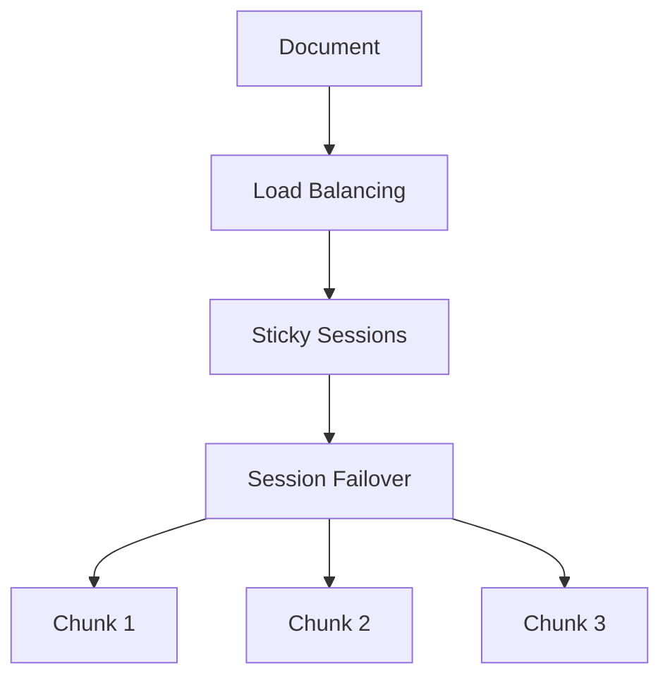
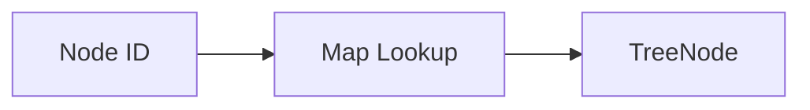
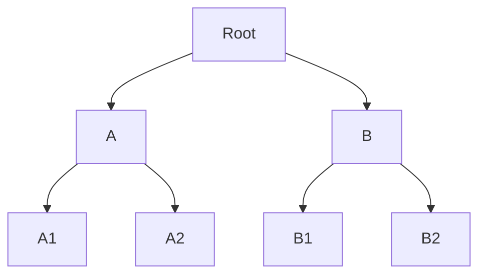
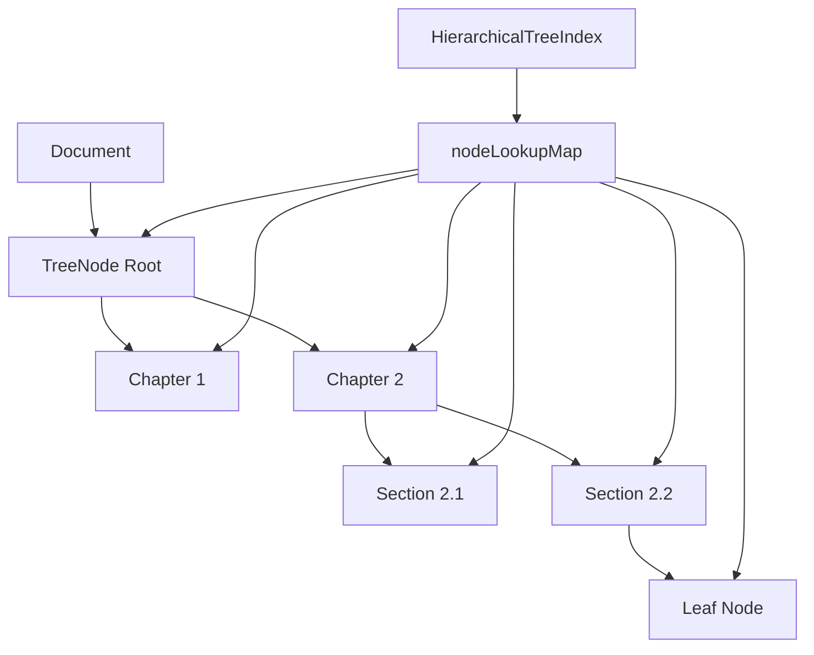
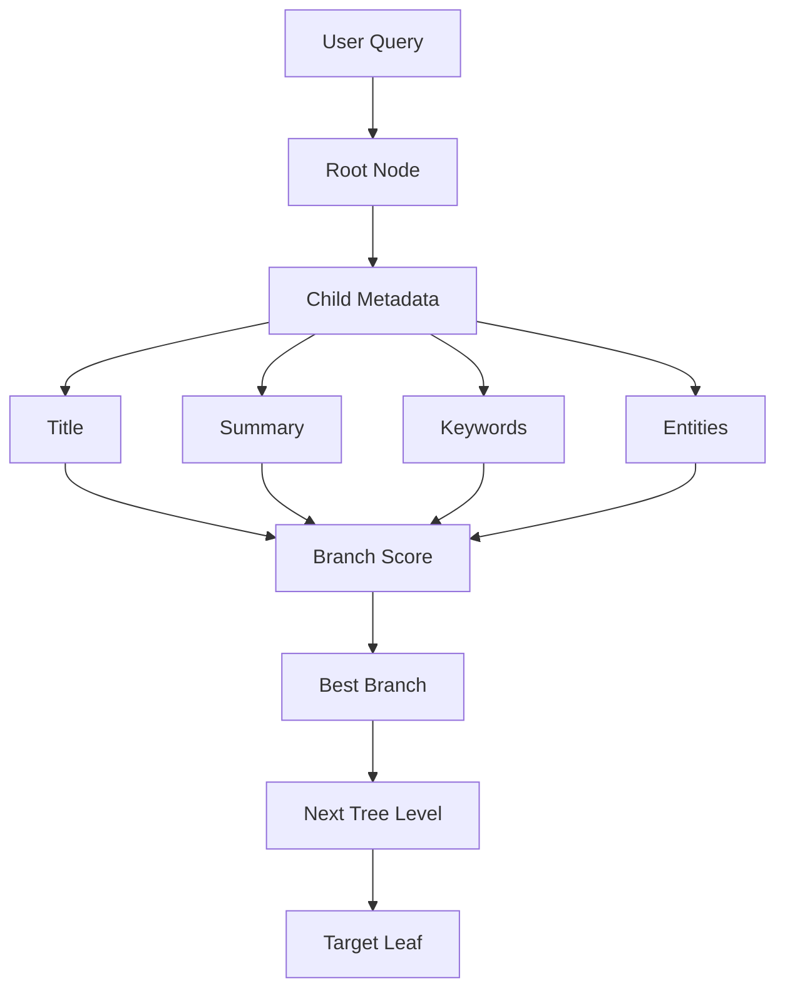
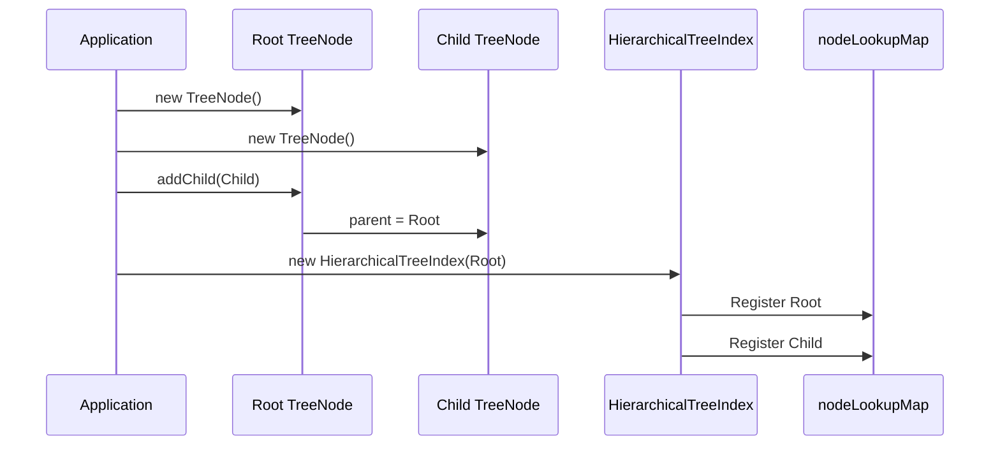
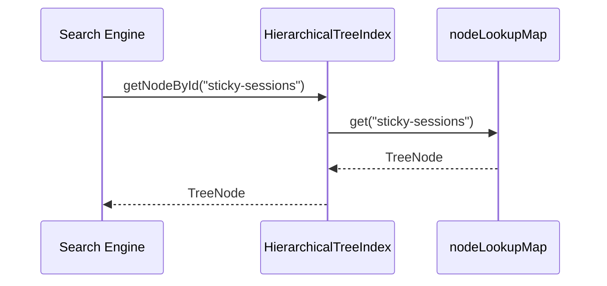
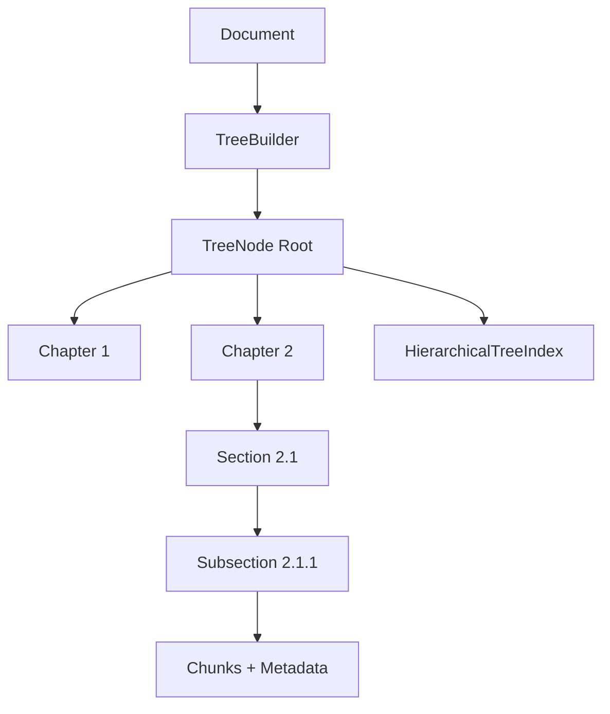

# Chapter 1 — Enhanced Hierarchical Tree Data Structure (TreeNode & Index)

## 1. Chapter Goal

The goal of this chapter is to build the core hierarchical data structure used by the **Advanced Vectorless RAG Engine**.

We will implement two classes:

```text
src/tree/
├── TreeNode.js
└── HierarchicalTreeIndex.js
```

The two classes have different responsibilities.

### `TreeNode`

Represents one location in the document hierarchy.

It stores:

* node ID
* title
* summary
* hierarchy level
* page range
* keywords
* named entities
* custom metadata
* parent reference
* child nodes
* raw content chunks

### `HierarchicalTreeIndex`

Manages the complete tree.

It provides:

* fast node lookup
* node registration
* DFS traversal
* BFS traversal
* leaf-node discovery
* document-level tree access

---

# 2. Why Do We Need a Tree?

Traditional vector RAG commonly transforms a document into independent chunks:

```text
Document
   ↓
Chunk 1
Chunk 2
Chunk 3
Chunk 4
   ↓
Embedding
   ↓
Vector Database
```

The chunks are searchable, but the original document hierarchy may not be directly represented.

Vectorless RAG takes a different approach.

Instead of treating the document as only a collection of chunks, we preserve its structure:



Now retrieval can reason about **where information exists inside the document**.

For example:

```text
User Query
   ↓
Document
   ↓
Load Balancing
   ↓
Sticky Sessions
   ↓
Session Failover
   ↓
Relevant Content
```

This hierarchical navigation becomes the foundation for the agentic tree search implemented in later chapters.

---

# 3. TreeNode Data Model

A node can conceptually be represented as:

```text
TreeNode
│
├── Identity
│   └── nodeId
│
├── Semantic Metadata
│   ├── title
│   ├── summary
│   ├── keywords
│   └── entities
│
├── Document Location
│   ├── level
│   ├── pageStart
│   └── pageEnd
│
├── Hierarchy
│   ├── parent
│   └── children
│
├── Content
│   └── chunks
│
└── Additional Metadata
    └── metadata
```

For example:

```text
TreeNode
ID: sec_22
Title: Sticky Sessions
Level: 2
Pages: 9-12

Keywords:
  cookie
  session
  failover

Entities:
  LoadBalancer
  HTTP

Children:
  Session Persistence
  Session Failover

Chunks:
  "Sticky sessions associate..."
```

---

# 4. Implementing `TreeNode`

## File Path

```text
adv-vectorless-rag/src/tree/TreeNode.js
```

## Complete Code

```javascript
export class TreeNode {
  constructor({
    nodeId,
    title = "",
    summary = "",
    level = 0,
    pageStart = 1,
    pageEnd = 1,
    keywords = [],
    entities = [],
    metadata = {}
  }) {
    if (
      typeof nodeId !== "string" ||
      !nodeId.trim()
    ) {
      throw new Error(
        "nodeId must be a non-empty string."
      );
    }

    if (
      typeof title !== "string"
    ) {
      throw new TypeError(
        "title must be a string."
      );
    }

    if (
      !Number.isInteger(level) ||
      level < 0
    ) {
      throw new Error(
        "level must be a non-negative integer."
      );
    }

    if (
      !Number.isFinite(pageStart) ||
      !Number.isFinite(pageEnd)
    ) {
      throw new Error(
        "pageStart and pageEnd must be numbers."
      );
    }

    if (pageStart > pageEnd) {
      throw new Error(
        "pageStart cannot be greater than pageEnd."
      );
    }

    if (!Array.isArray(keywords)) {
      throw new TypeError(
        "keywords must be an array."
      );
    }

    if (!Array.isArray(entities)) {
      throw new TypeError(
        "entities must be an array."
      );
    }

    if (
      metadata === null ||
      typeof metadata !== "object" ||
      Array.isArray(metadata)
    ) {
      throw new TypeError(
        "metadata must be a plain object."
      );
    }

    this.nodeId = nodeId.trim();

    this.title = title.trim();

    this.summary =
      typeof summary === "string"
        ? summary.trim()
        : "";

    this.level = level;

    this.pageStart = pageStart;
    this.pageEnd = pageEnd;

    this.keywords = [...keywords];
    this.entities = [...entities];

    this.metadata = {
      ...metadata
    };

    /**
     * Reference to the parent TreeNode.
     *
     * Root nodes have parent === null.
     */
    this.parent = null;

    /**
     * Direct child nodes.
     *
     * @type {TreeNode[]}
     */
    this.children = [];

    /**
     * Raw text chunks belonging to this node.
     *
     * @type {string[]}
     */
    this.chunks = [];
  }

  /**
   * Attach a child node to this node.
   *
   * @param {TreeNode} childNode
   * @returns {TreeNode}
   */
  addChild(childNode) {
    if (!(childNode instanceof TreeNode)) {
      throw new TypeError(
        "childNode must be a TreeNode."
      );
    }

    if (childNode === this) {
      throw new Error(
        "A node cannot be its own child."
      );
    }

    if (this.children.includes(childNode)) {
      throw new Error(
        `Child "${childNode.nodeId}" is already attached.`
      );
    }

    if (
      childNode.parent &&
      childNode.parent !== this
    ) {
      throw new Error(
        `Node "${childNode.nodeId}" already has a parent.`
      );
    }

    childNode.parent = this;

    this.children.push(childNode);

    return childNode;
  }

  /**
   * Add a raw text chunk to this node.
   *
   * @param {string} chunkText
   */
  addChunk(chunkText) {
    if (
      typeof chunkText !== "string" ||
      !chunkText.trim()
    ) {
      throw new Error(
        "chunkText must be a non-empty string."
      );
    }

    this.chunks.push(
      chunkText.trim()
    );
  }

  /**
   * Determine whether this node has no children.
   *
   * @returns {boolean}
   */
  isLeaf() {
    return this.children.length === 0;
  }

  /**
   * Return the path from the root to this node.
   *
   * @returns {TreeNode[]}
   */
  getLineage() {
    const lineage = [];

    let current = this;

    while (current) {
      lineage.unshift(current);
      current = current.parent;
    }

    return lineage;
  }

  /**
   * Return lightweight metadata suitable
   * for indexing, logging, or LLM prompts.
   *
   * Raw chunks are intentionally excluded.
   *
   * @returns {Object}
   */
  toMetadataJSON() {
    return {
      nodeId: this.nodeId,
      title: this.title,
      summary: this.summary,
      level: this.level,

      pageStart: this.pageStart,
      pageEnd: this.pageEnd,

      keywords: [...this.keywords],
      entities: [...this.entities],

      metadata: {
        ...this.metadata
      },

      parentId:
        this.parent
          ? this.parent.nodeId
          : null,

      childrenCount:
        this.children.length,

      chunksCount:
        this.chunks.length
    };
  }

  /**
   * Serialize the complete node hierarchy.
   *
   * Raw chunks are included here because
   * this method represents the full tree state.
   *
   * @returns {Object}
   */
  toJSON() {
    return {
      ...this.toMetadataJSON(),

      chunks: [...this.chunks],

      children:
        this.children.map(
          (child) => child.toJSON()
        )
    };
  }
}
```

---

# 5. Understanding the `TreeNode` Constructor

The constructor receives an object:

```javascript
new TreeNode({
  nodeId: "sec_22",
  title: "Sticky Sessions",
  summary: "Session persistence using cookies.",
  level: 2,
  pageStart: 9,
  pageEnd: 12,
  keywords: [
    "cookie",
    "session",
    "failover"
  ],
  entities: [
    "LoadBalancer",
    "HTTP"
  ]
});
```

Using an object is useful because the constructor has many properties.

Without an object, we would need:

```javascript
new TreeNode(
  "sec_22",
  "Sticky Sessions",
  "...",
  2,
  9,
  12,
  ...
);
```

That quickly becomes difficult to read and maintain.

---

# 6. Identity — `nodeId`

The most important field is:

```javascript
this.nodeId = nodeId.trim();
```

Every node should have a unique identifier.

For example:

```text
root
chapter-1
chapter-2
section-2-1
section-2-2
```

Later, the `HierarchicalTreeIndex` will create a map:

```text
nodeId → TreeNode
```

which allows:

```javascript
index.getNodeById("section-2-2");
```

instead of scanning the entire tree.

---

# 7. Hierarchy Level

The `level` field represents depth:

```javascript
this.level = level;
```

For example:

```text
Level 0 → Document
Level 1 → Chapter
Level 2 → Section
Level 3 → Subsection
```

Example:

```text
Vectorless RAG
Level 0
│
├── Tree Search
│   Level 1
│
│   └── Branch Pruning
│       Level 2
│
│       └── Summary Scoring
│           Level 3
```

This becomes useful when controlling search depth.

For example, the configuration from Chapter 0 contains:

```env
DEFAULT_MAX_TREE_DEPTH=3
```

Later, the search engine can use this value to prevent unlimited traversal.

---

# 8. Page Range

Each node contains:

```javascript
this.pageStart = pageStart;
this.pageEnd = pageEnd;
```

For example:

```text
Sticky Sessions
Pages: 9-12
```

This is useful because retrieval can return not only the answer but also its document location.

For example:

```text
Target:
Sticky Session Failover

Pages:
9-12
```

This is especially useful for PDF/document-based RAG.

---

# 9. Keywords and Entities

The node stores two types of semantic metadata.

### Keywords

```javascript
this.keywords = [...keywords];
```

Example:

```javascript
[
  "cookie",
  "session",
  "failover"
]
```

### Entities

```javascript
this.entities = [...entities];
```

Example:

```javascript
[
  "LoadBalancer",
  "HTTP"
]
```

These fields give the retrieval engine multiple signals.

A query such as:

```text
How does ALB handle sticky session failover?
```

can be compared against:

```text
Title
Summary
Keywords
Entities
```

instead of only comparing against raw text.

---

# 10. Why Copy Arrays?

Notice this:

```javascript
this.keywords = [...keywords];
```

instead of:

```javascript
this.keywords = keywords;
```

The spread operator creates a new array.

For example:

```javascript
const keywords = [
  "session",
  "cookie"
];

const node = new TreeNode({
  nodeId: "x",
  keywords
});

keywords.push("failover");
```

The node's internal keywords should not unexpectedly change because the original external array changed.

This is a small but useful data-integrity practice.

---

# 11. Parent and Children

The hierarchy is represented using two relationships.

```javascript
this.parent = null;
this.children = [];
```

For example:



Internally:

```text
Load Balancing
    │
    └── children → [Sticky Sessions]

Sticky Sessions
    │
    ├── parent → Load Balancing
    │
    └── children → [Session Failover]
```

This bidirectional relationship is extremely useful.

From parent to child:

```javascript
node.children
```

From child to parent:

```javascript
node.parent
```

---

# 12. `addChild()`

The method:

```javascript
addChild(childNode)
```

is responsible for creating the parent-child relationship.

The important lines are:

```javascript
childNode.parent = this;

this.children.push(childNode);
```

Suppose:

```javascript
const chapter =
  new TreeNode({
    nodeId: "ch1",
    title: "Load Balancing"
  });

const section =
  new TreeNode({
    nodeId: "sec1",
    title: "Sticky Sessions"
  });

chapter.addChild(section);
```

The result is:

```text
chapter
   │
   └── section
```

and internally:

```javascript
section.parent === chapter;
```

while:

```javascript
chapter.children.includes(section);
```

returns:

```text
true
```

---

# 13. Why Validate `addChild()`?

Without validation, this would be possible:

```javascript
node.addChild(node);
```

which creates:

```text
Node
 └── Node
      └── Node
           ...
```

This creates an invalid recursive structure.

Therefore we explicitly reject:

```javascript
if (childNode === this) {
  throw new Error(
    "A node cannot be its own child."
  );
}
```

We also prevent attaching the same node to multiple parents.

A tree node should have exactly one parent:

```text
        Root
       /    \
      A      B
```

not:

```text
      A
     / \
Root    B
  \     /
   -----
```

The second structure starts behaving like a graph rather than a tree.

---

# 14. Adding Content Chunks

A node can contain raw text chunks:

```javascript
this.chunks = [];
```

We add content using:

```javascript
node.addChunk(
  "Sticky sessions associate a client with a backend server."
);
```

The important architectural distinction is:

```text
children ≠ chunks
```

### Children represent structure

```text
Chapter
 └── Section
      └── Subsection
```

### Chunks represent content

```text
Subsection
 ├── Chunk 1
 ├── Chunk 2
 └── Chunk 3
```

This distinction becomes very important later.

---

# 15. Tree Structure vs Content

A complete document might look like:



The tree answers:

> **Where in the document is this information?**

The chunks answer:

> **What actual text is stored here?**

Vectorless retrieval can first navigate the tree and then retrieve the content from the selected node.

---

# 16. `isLeaf()`

The implementation is simple:

```javascript
isLeaf() {
  return this.children.length === 0;
}
```

A leaf node has no children.

For:

```text
Load Balancing
└── Sticky Sessions
    └── Failover
```

the nodes behave as:

```text
Load Balancing → false
Sticky Sessions → false
Failover → true
```

The search engine will eventually use this concept to know when it has reached the bottom of the hierarchy.

---

# 17. `getLineage()`

The lineage method returns the path from the root to the current node.

Suppose we have:

```text
Document
└── Load Balancing
    └── Sticky Sessions
        └── Session Failover
```

For the `Session Failover` node:

```javascript
node.getLineage();
```

returns:

```text
Document
Load Balancing
Sticky Sessions
Session Failover
```

Internally it walks upward:

```javascript
let current = this;

while (current) {
  lineage.unshift(current);
  current = current.parent;
}
```

This is useful for:

* explaining retrieval decisions
* building LLM prompts
* showing citations
* logging search paths
* debugging tree navigation

For example:

```text
Document
→ Load Balancing
→ Sticky Sessions
→ Session Failover
```

can be sent to an LLM as structural context.

---

# 18. Metadata Serialization

We provide:

```javascript
toMetadataJSON()
```

This intentionally excludes the actual raw chunks.

The output looks like:

```json
{
  "nodeId": "sec_22",
  "title": "Sticky Sessions",
  "summary": "Session persistence using cookies.",
  "level": 2,
  "pageStart": 9,
  "pageEnd": 12,
  "keywords": [
    "cookie",
    "session",
    "failover"
  ],
  "entities": [
    "LoadBalancer",
    "HTTP"
  ],
  "parentId": "ch2",
  "childrenCount": 1,
  "chunksCount": 3
}
```

Why exclude chunks?

Because tree navigation usually does not need the complete raw text.

The retrieval engine can reason using:

```text
title
summary
keywords
entities
page range
```

and only retrieve the full content after identifying the relevant branch.

That is a core idea behind efficient hierarchical retrieval.

---

# 19. Full Serialization

The `toJSON()` method includes the complete node state:

```javascript
toJSON() {
  return {
    ...this.toMetadataJSON(),

    chunks: [...this.chunks],

    children:
      this.children.map(
        (child) => child.toJSON()
      )
  };
}
```

This is useful for:

* debugging
* persistence
* exporting the tree
* testing
* future database storage

The two methods therefore have different purposes:

| Method             | Purpose                        |
| ------------------ | ------------------------------ |
| `toMetadataJSON()` | Lightweight retrieval metadata |
| `toJSON()`         | Complete tree serialization    |

---

# 20. Implementing `HierarchicalTreeIndex`

## File Path

```text
adv-vectorless-rag/src/tree/HierarchicalTreeIndex.js
```

## Complete Code

```javascript
import { TreeNode } from "./TreeNode.js";

export class HierarchicalTreeIndex {
  constructor(
    rootNode,
    documentTitle = "Document Index"
  ) {
    if (
      rootNode !== null &&
      !(rootNode instanceof TreeNode)
    ) {
      throw new TypeError(
        "rootNode must be a TreeNode or null."
      );
    }

    this.root = rootNode;

    this.documentTitle =
      documentTitle;

    /**
     * Fast node lookup:
     *
     * nodeId -> TreeNode
     *
     * @type {Map<string, TreeNode>}
     */
    this.nodeLookupMap = new Map();

    if (rootNode) {
      this._indexNode(rootNode);
    }
  }

  /**
   * Recursively register a complete subtree.
   *
   * @param {TreeNode} node
   */
  _indexNode(node) {
    if (!(node instanceof TreeNode)) {
      throw new TypeError(
        "Only TreeNode instances can be indexed."
      );
    }

    if (
      this.nodeLookupMap.has(
        node.nodeId
      )
    ) {
      throw new Error(
        `Duplicate nodeId detected: ${node.nodeId}`
      );
    }

    this.nodeLookupMap.set(
      node.nodeId,
      node
    );

    for (
      const child
      of node.children
    ) {
      this._indexNode(child);
    }
  }

  /**
   * Register a node and its subtree.
   *
   * @param {TreeNode} node
   */
  registerNode(node) {
    this._indexNode(node);
  }

  /**
   * Find a node by its ID.
   *
   * @param {string} nodeId
   * @returns {TreeNode|null}
   */
  getNodeById(nodeId) {
    return (
      this.nodeLookupMap.get(
        nodeId
      ) || null
    );
  }

  /**
   * Traverse the tree using
   * Depth-First Search.
   *
   * @param {(node: TreeNode) => void} callback
   */
  traverseDFS(callback) {
    if (
      typeof callback !== "function"
    ) {
      throw new TypeError(
        "callback must be a function."
      );
    }

    const dfs = (node) => {
      if (!node) {
        return;
      }

      callback(node);

      for (
        const child
        of node.children
      ) {
        dfs(child);
      }
    };

    dfs(this.root);
  }

  /**
   * Traverse the tree using
   * Breadth-First Search.
   *
   * @param {(node: TreeNode) => void} callback
   */
  traverseBFS(callback) {
    if (
      typeof callback !== "function"
    ) {
      throw new TypeError(
        "callback must be a function."
      );
    }

    if (!this.root) {
      return;
    }

    const queue = [this.root];

    let queueIndex = 0;

    while (
      queueIndex < queue.length
    ) {
      const node =
        queue[queueIndex++];

      callback(node);

      for (
        const child
        of node.children
      ) {
        queue.push(child);
      }
    }
  }

  /**
   * Return every leaf node.
   *
   * @returns {TreeNode[]}
   */
  getLeafNodes() {
    const leaves = [];

    this.traverseDFS(
      (node) => {
        if (node.isLeaf()) {
          leaves.push(node);
        }
      }
    );

    return leaves;
  }

  /**
   * Return the number of indexed nodes.
   *
   * @returns {number}
   */
  getNodeCount() {
    return this.nodeLookupMap.size;
  }
}
```

---

# 21. Understanding `HierarchicalTreeIndex`

The tree itself provides structure.

The index provides efficient access to that structure.

Consider:

```text
Document
├── Chapter 1
├── Chapter 2
│   ├── Section 2.1
│   └── Section 2.2
└── Chapter 3
```

Without an index, finding `Section 2.2` could require traversing the tree.

With the lookup map:

```text
nodeLookupMap
│
├── document → TreeNode
├── chapter-1 → TreeNode
├── chapter-2 → TreeNode
├── section-2-1 → TreeNode
└── section-2-2 → TreeNode
```

we can directly access:

```javascript
index.getNodeById(
  "section-2-2"
);
```

---

# 22. Why Use `Map`?

The index uses:

```javascript
this.nodeLookupMap =
  new Map();
```

A JavaScript `Map` is ideal for this use case because we need:

```text
nodeId → node
```

lookup.

Conceptually:



For example:

```javascript
index.getNodeById(
  "sec_22"
);
```

returns the corresponding `TreeNode`.

This becomes particularly useful when:

* an LLM returns a node ID
* a search result contains a target node ID
* a page needs to be retrieved
* a lineage needs to be reconstructed

---

# 23. `_indexNode()`

The private-style helper:

```javascript
_indexNode(node)
```

walks through the entire subtree.

The core logic is:

```javascript
this.nodeLookupMap.set(
  node.nodeId,
  node
);

for (
  const child
  of node.children
) {
  this._indexNode(child);
}
```

This is recursive DFS indexing.

For:

```text
Root
├── A
└── B
    ├── C
    └── D
```

the indexing process is approximately:

```text
Root
 ↓
Register Root
 ↓
Register A
 ↓
Register B
 ↓
Register C
 ↓
Register D
```

---

# 24. Duplicate Node IDs

A tree index should never silently overwrite an existing node.

Therefore:

```javascript
if (
  this.nodeLookupMap.has(
    node.nodeId
  )
) {
  throw new Error(
    `Duplicate nodeId detected: ${node.nodeId}`
  );
}
```

Without this validation:

```text
nodeId = "section-1"
```

could appear twice.

A `Map` would overwrite the previous entry, creating a difficult-to-debug retrieval problem.

Failing early is much safer.

---

# 25. DFS — Depth-First Search

DFS explores one branch as deeply as possible before moving to the next branch.

Consider:

```text
Root
├── A
│   ├── A1
│   └── A2
└── B
    ├── B1
    └── B2
```

DFS produces:

```text
Root
A
A1
A2
B
B1
B2
```

The implementation recursively visits:

```javascript
callback(node);

for (
  const child
  of node.children
) {
  dfs(child);
}
```

DFS is particularly natural for hierarchical tree operations because it follows complete branches.

---

# 26. BFS — Breadth-First Search

BFS explores one level at a time.

For the same tree:

```text
Root
├── A
│   ├── A1
│   └── A2
└── B
    ├── B1
    └── B2
```

BFS produces:

```text
Root
A
B
A1
A2
B1
B2
```

The queue contains nodes waiting to be processed.



BFS is useful when we want to inspect nodes level by level.

---

# 27. Why Not Use `shift()` in BFS?

A common implementation is:

```javascript
const node =
  queue.shift();
```

This is easy to understand, but repeatedly removing the first element can cause unnecessary array movement.

Instead, this implementation uses:

```javascript
let queueIndex = 0;

while (
  queueIndex < queue.length
) {
  const node =
    queue[queueIndex++];

  ...
}
```

The queue grows normally, while `queueIndex` tells us which element should be processed next.

This keeps the implementation simple while avoiding repeated front-removal operations.

---

# 28. Leaf Nodes

The index also provides:

```javascript
getLeafNodes()
```

Suppose the tree is:

```text
Document
├── Chapter 1
│   ├── Section 1.1
│   └── Section 1.2
└── Chapter 2
    └── Section 2.1
```

The leaf nodes are:

```text
Section 1.1
Section 1.2
Section 2.1
```

This is useful because leaf nodes usually contain the most specific retrievable content.

---

# 29. Tree Index Architecture

The complete architecture is now:



There are therefore two complementary structures:

### Physical hierarchy

```text
parent → children
```

### Lookup index

```text
nodeId → node
```

Together they give us both:

* structural navigation
* fast direct lookup

---

# 30. How This Supports Vectorless RAG

This data structure is the foundation for later retrieval.

Suppose the user asks:

```text
What happens if sticky session persistence fails?
```

The future search engine can navigate:

```text
Root
 ↓
Load Balancing
 ↓
Sticky Sessions
 ↓
Session Failover
```

At every level, it can inspect:

```text
Title
Summary
Keywords
Entities
Page Range
```

before deciding whether to continue deeper.

That is fundamentally different from immediately searching every raw chunk.

---

# 31. Metadata-Driven Retrieval

A future branch-selection process can conceptually work like this:



This is why adding keywords and entities to each node is important.

---

# 32. Example Usage

Create a small document tree:

```javascript
import { TreeNode } from "./src/tree/TreeNode.js";
import {
  HierarchicalTreeIndex
} from "./src/tree/HierarchicalTreeIndex.js";

const root =
  new TreeNode({
    nodeId: "root",
    title: "Infrastructure Guide",
    summary:
      "Guide to infrastructure architecture.",
    level: 0,
    pageStart: 1,
    pageEnd: 20
  });

const loadBalancing =
  root.addChild(
    new TreeNode({
      nodeId: "load-balancing",
      title: "Load Balancing",
      summary:
        "Traffic distribution and backend availability.",
      level: 1,
      pageStart: 5,
      pageEnd: 15,
      keywords: [
        "load balancing",
        "traffic",
        "backend"
      ],
      entities: [
        "ALB"
      ]
    })
  );

const stickySessions =
  loadBalancing.addChild(
    new TreeNode({
      nodeId: "sticky-sessions",
      title: "Sticky Sessions",
      summary:
        "Session persistence using cookies.",
      level: 2,
      pageStart: 9,
      pageEnd: 12,
      keywords: [
        "cookie",
        "session",
        "failover"
      ],
      entities: [
        "ALB",
        "HTTP"
      ]
    })
  );

stickySessions.addChunk(
  "Sticky sessions associate a client with a backend target."
);

stickySessions.addChunk(
  "If the target fails, traffic can be routed to another healthy target."
);

const index =
  new HierarchicalTreeIndex(
    root,
    "Infrastructure Guide"
  );
```

---

# 33. Testing Node Lookup

We can directly retrieve a node:

```javascript
const node =
  index.getNodeById(
    "sticky-sessions"
  );

console.log(
  node.title
);
```

Expected:

```text
Sticky Sessions
```

We can also inspect its lineage:

```javascript
console.log(
  node
    .getLineage()
    .map(
      (item) => item.title
    )
    .join(" -> ")
);
```

Expected:

```text
Infrastructure Guide -> Load Balancing -> Sticky Sessions
```

---

# 34. Testing DFS

```javascript
console.log("\nDFS:");

index.traverseDFS(
  (node) => {
    console.log(
      node.nodeId
    );
  }
);
```

Expected:

```text
DFS:
root
load-balancing
sticky-sessions
```

---

# 35. Testing BFS

```javascript
console.log("\nBFS:");

index.traverseBFS(
  (node) => {
    console.log(
      node.nodeId
    );
  }
);
```

Expected:

```text
BFS:
root
load-balancing
sticky-sessions
```

With a larger tree, the difference between DFS and BFS becomes more visible.

---

# 36. Testing Leaf Nodes

```javascript
console.log(
  "\nLeaf Nodes:"
);

console.log(
  index
    .getLeafNodes()
    .map(
      (node) => node.nodeId
    )
);
```

Expected:

```text
Leaf Nodes:
[ 'sticky-sessions' ]
```

---

# 37. Complete Verification Command

You can verify the complete implementation directly from the terminal:

```bash
node --input-type=module -e "
import { TreeNode } from './src/tree/TreeNode.js';
import {
  HierarchicalTreeIndex
} from './src/tree/HierarchicalTreeIndex.js';

const root =
  new TreeNode({
    nodeId: 'root',
    title: 'Infrastructure Guide',
    level: 0,
    pageStart: 1,
    pageEnd: 20,
    summary: 'Infrastructure architecture guide.'
  });

const loadBalancing =
  root.addChild(
    new TreeNode({
      nodeId: 'load-balancing',
      title: 'Load Balancing',
      level: 1,
      pageStart: 5,
      pageEnd: 15,
      summary:
        'Traffic distribution and backend availability.',
      keywords: [
        'load balancing',
        'traffic',
        'backend'
      ],
      entities: ['ALB']
    })
  );

const stickySessions =
  loadBalancing.addChild(
    new TreeNode({
      nodeId: 'sticky-sessions',
      title: 'Sticky Sessions',
      level: 2,
      pageStart: 9,
      pageEnd: 12,
      summary:
        'Session persistence using cookies.',
      keywords: [
        'cookie',
        'session',
        'failover'
      ],
      entities: [
        'ALB',
        'HTTP'
      ]
    })
  );

stickySessions.addChunk(
  'Sticky sessions associate a client with a backend target.'
);

const index =
  new HierarchicalTreeIndex(
    root,
    'Infrastructure Guide'
  );

console.log(
  'Registered Nodes:',
  index.getNodeCount()
);

console.log(
  'Lookup:',
  index.getNodeById(
    'sticky-sessions'
  ).title
);

console.log(
  'Lineage:',
  index
    .getNodeById(
      'sticky-sessions'
    )
    .getLineage()
    .map(
      (node) => node.title
    )
    .join(' -> ')
);

console.log('\\nDFS:');

index.traverseDFS(
  (node) =>
    console.log(node.nodeId)
);

console.log('\\nBFS:');

index.traverseBFS(
  (node) =>
    console.log(node.nodeId)
);

console.log(
  '\\nLeaf Nodes:',
  index
    .getLeafNodes()
    .map(
      (node) => node.nodeId
    )
);
"
```

---

# 38. Expected Output

```text
Registered Nodes: 3

Lookup: Sticky Sessions

Lineage: Infrastructure Guide -> Load Balancing -> Sticky Sessions

DFS:
root
load-balancing
sticky-sessions

BFS:
root
load-balancing
sticky-sessions

Leaf Nodes: [ 'sticky-sessions' ]
```

---

# 39. Internal Execution Flow

When the tree is created:



When a node is requested:



---

# 40. Why This Is Important for the Next Chapter

Chapter 2 will introduce the **Automatic Document Tree Builder**.

Instead of manually writing:

```javascript
root.addChild(...)
```

for every section, the builder will receive structured document information such as:

```text
Chapter 1
    Section 1.1
    Section 1.2

Chapter 2
    Section 2.1
        Subsection 2.1.1
```

and automatically produce:



Therefore, Chapter 1 provides the **data structure**, while Chapter 2 will provide the **construction algorithm**.

---

# 41. Important Architectural Distinction

At this point, our system does **not** perform semantic retrieval.

It only provides the structure required for retrieval.

We currently have:

```text
TreeNode
    ↓
HierarchicalTreeIndex
```

We do not yet have:

```text
Query
    ↓
Branch scoring
    ↓
Pruning
    ↓
LLM reasoning
    ↓
Target leaf
```

Those capabilities belong to later chapters.

This separation is intentional.

---

# 42. Complexity Overview

Let:

* `N` = number of nodes
* `H` = tree height

### Building the index

Every node is visited once:

```text
O(N)
```

### Node lookup

Using `Map`:

```text
O(1) average
```

### DFS

Every node is visited once:

```text
O(N)
```

### BFS

Every node is visited once:

```text
O(N)
```

### Leaf discovery

Uses DFS internally:

```text
O(N)
```

The tree structure itself therefore gives us efficient navigation primitives before we introduce more expensive LLM reasoning.

---

# 43. Chapter Summary

We have now implemented the core hierarchical representation for Advanced Vectorless RAG.

### `TreeNode`

Supports:

* unique node IDs
* titles
* summaries
* hierarchy levels
* page ranges
* keywords
* entities
* custom metadata
* parent references
* child references
* raw content chunks
* lineage discovery
* metadata serialization
* complete serialization

### `HierarchicalTreeIndex`

Supports:

* root document access
* node lookup
* duplicate-ID detection
* DFS traversal
* BFS traversal
* leaf-node discovery
* node counting

The architecture is:

```text
                    Document
                       │
                       ▼
                ┌─────────────┐
                │ TreeNode    │
                │ hierarchy   │
                │ metadata    │
                │ chunks      │
                └──────┬──────┘
                       │
                       ▼
          ┌────────────────────────┐
          │ HierarchicalTreeIndex  │
          │                        │
          │ nodeId → TreeNode      │
          └───────────┬────────────┘
                      │
          ┌───────────┼────────────┐
          ▼           ▼            ▼
        DFS          BFS       Leaf Nodes
```

## Key Takeaway

> **In Vectorless RAG, the tree is not just a container for text. It is the retrieval structure that tells the system where information lives and how different pieces of information are related.**

Chapter 2 will build on this structure by automatically converting document sections into `TreeNode` objects and constructing the complete `HierarchicalTreeIndex`.

**One compatibility note for Chapter 2:** use `pageStart/pageEnd`, `parent`, `children`, `chunks`, and `metadata` from this chapter consistently. The earlier version of the series used `pageRange` and `parentId`; mixing those two schemas will cause subtle bugs in the tree builder.
