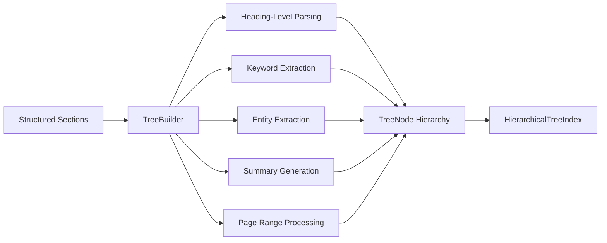
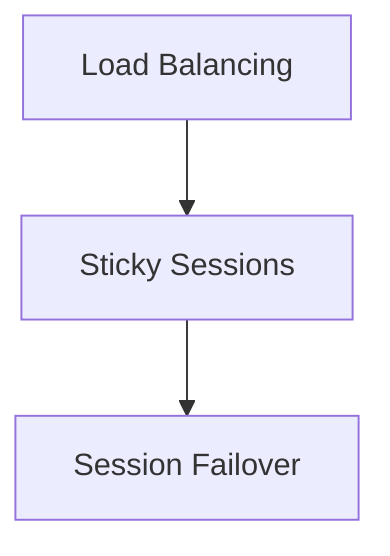
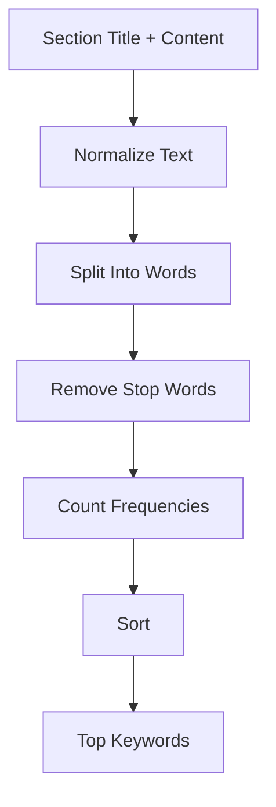
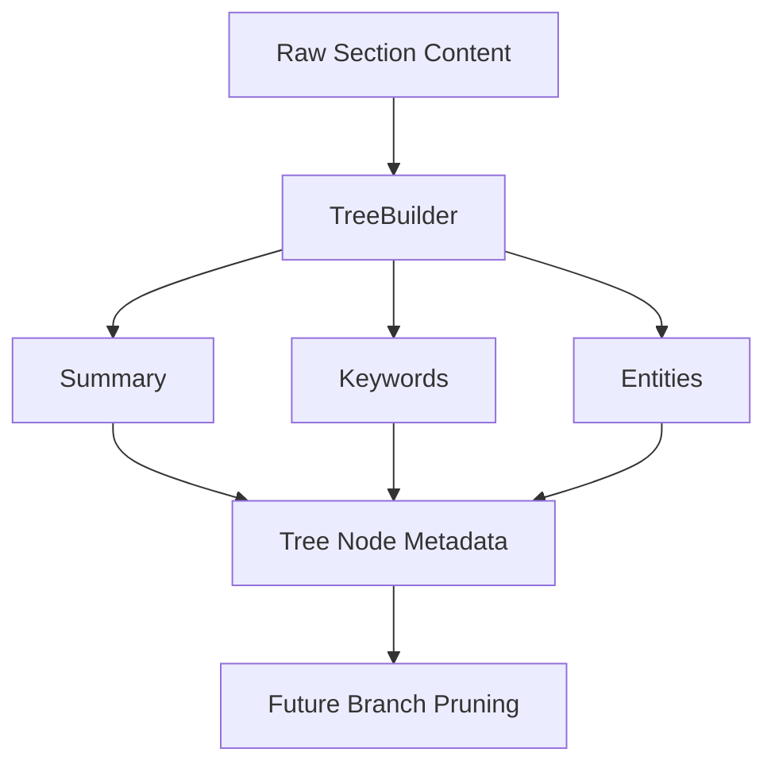
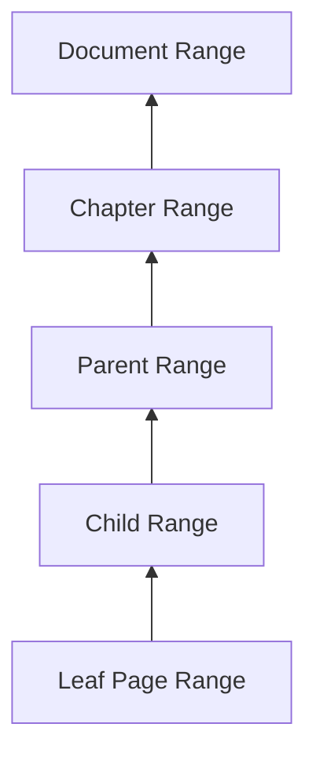
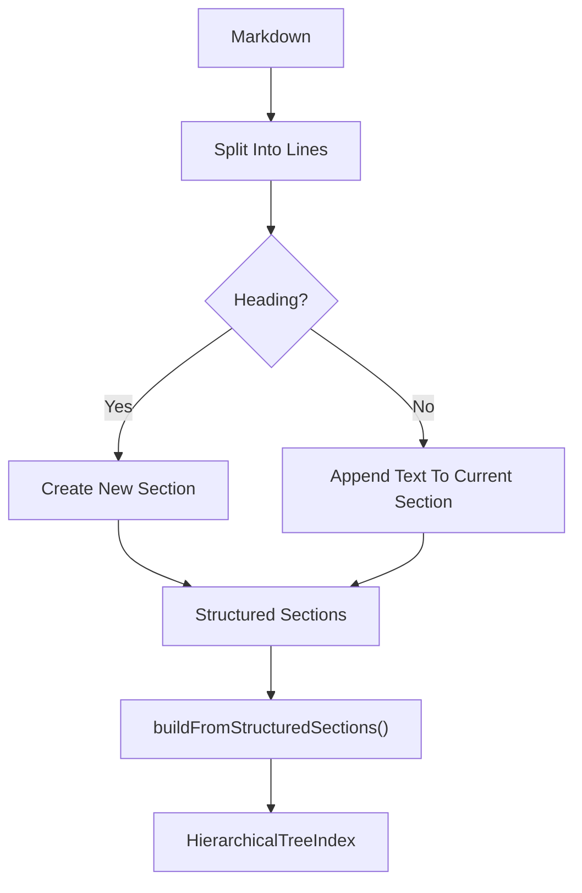
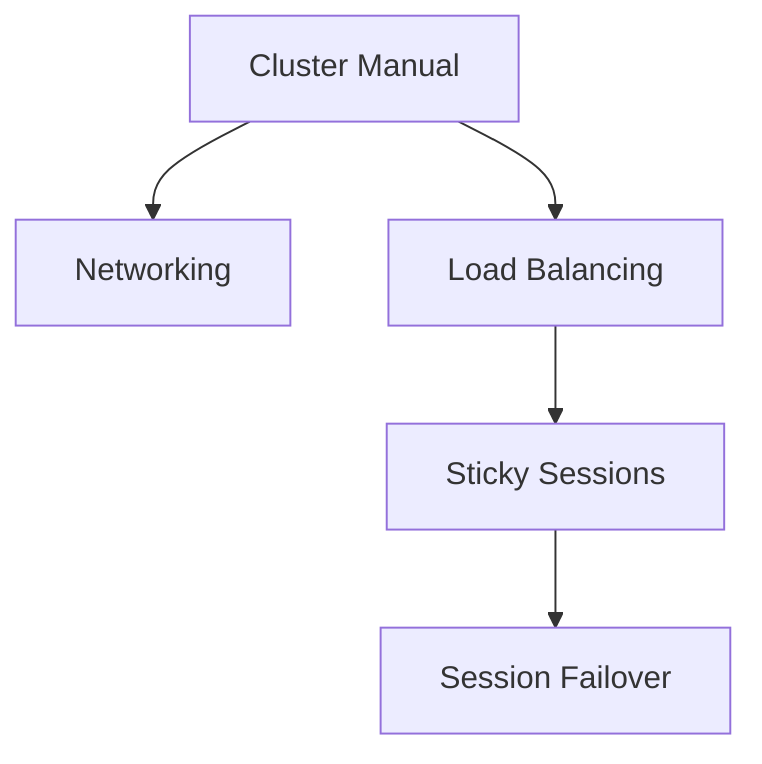
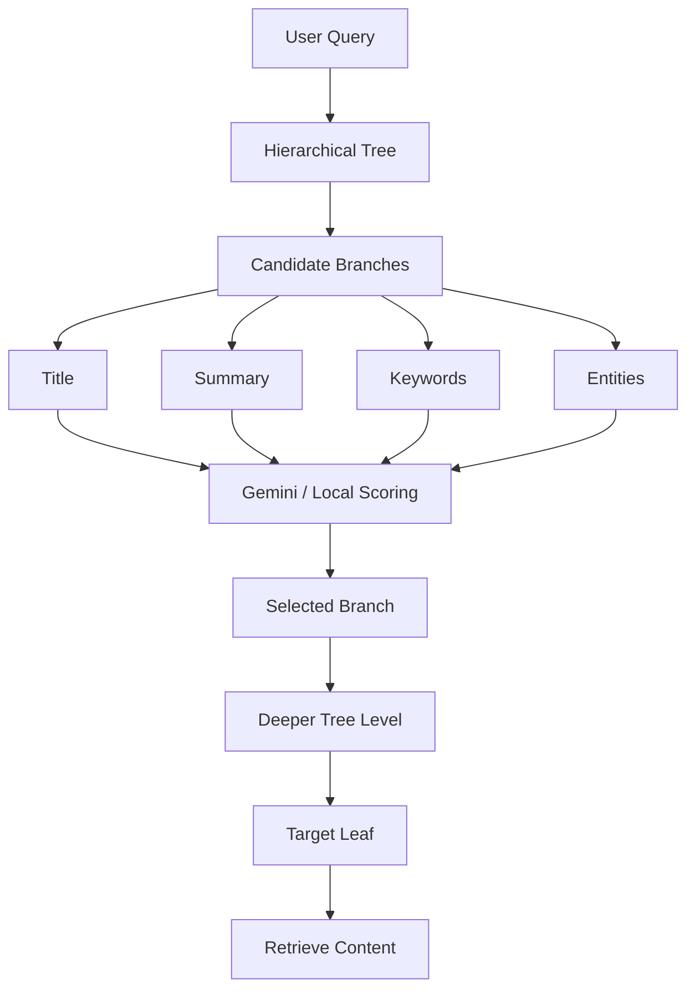
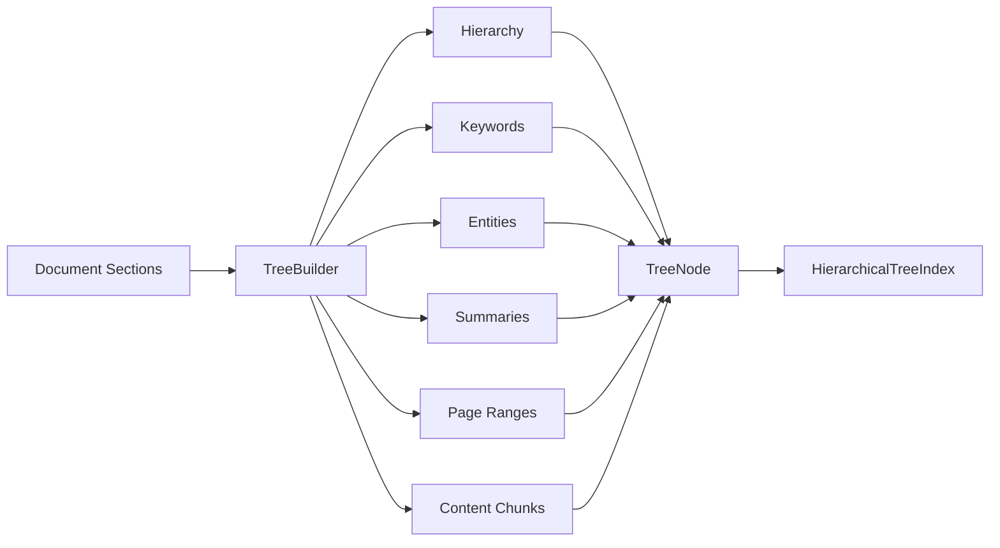

# Chapter 2 — Automatic Document Tree Builder & Keyword Extractor

## 1. Chapter Goal

In Chapter 1, we manually created `TreeNode` objects and connected them using parent-child relationships.

That works for a small example, but it does not scale to real documents.

A 300-page document might contain:

```text
Document
├── Chapter 1
│   ├── Section 1.1
│   ├── Section 1.2
│   └── Section 1.3
├── Chapter 2
│   ├── Section 2.1
│   │   ├── Section 2.1.1
│   │   └── Section 2.1.2
│   └── Section 2.2
└── Chapter 3
    └── ...
```

Manually constructing this tree would be tedious and error-prone.

Therefore, this chapter introduces the:

```text
TreeBuilder
```

The `TreeBuilder` converts structured document sections into:

```text
Sections
   ↓
TreeBuilder
   ↓
TreeNode hierarchy
   ↓
HierarchicalTreeIndex
```

It also enriches every node with useful metadata:

* keywords
* entities
* summaries
* page ranges
* custom metadata
* content chunks

---

# 2. Expected Architecture

After this chapter, the project will contain:

```text
adv-vectorless-rag/
│
└── src/
    ├── config.js
    │
    └── tree/
        ├── TreeNode.js
        ├── HierarchicalTreeIndex.js
        └── TreeBuilder.js
```

The complete transformation is:



---

# 3. Input Format

The builder expects sections such as:

```javascript
const sections = [
  {
    title: "Load Balancing",
    level: 1,
    content:
      "Load balancers distribute traffic across backend servers.",
    pageStart: 5,
    pageEnd: 8
  },

  {
    title: "Sticky Sessions",
    level: 2,
    content:
      "Sticky sessions use cookies to maintain session persistence.",
    pageStart: 9,
    pageEnd: 12
  },

  {
    title: "Session Failover",
    level: 3,
    content:
      "When a backend server fails, traffic can move to another healthy target.",
    pageStart: 13,
    pageEnd: 14
  }
];
```

The important property is:

```text
level
```

because the builder uses heading levels to determine parent-child relationships.

---

# 4. Why Heading Levels Matter

Consider this structure:

```text
Level 1 → Load Balancing

Level 2 → Sticky Sessions

Level 3 → Session Failover
```

The intended hierarchy is:



The builder should automatically understand this relationship.

We should not have to manually write:

```javascript
loadBalancing.addChild(stickySessions);
stickySessions.addChild(sessionFailover);
```

The `level` field provides enough structural information to construct those relationships.

---

# 5. The Stack-Based Parsing Algorithm

The most important algorithm in this chapter is the **heading-level stack**.

Imagine the parser receives:

```text
Level 1: Chapter 1
Level 2: Section 1.1
Level 2: Section 1.2
Level 3: Section 1.2.1
Level 1: Chapter 2
```

The stack keeps track of the most recent node at each relevant hierarchy depth.

Conceptually:

```text
Current Section
      ↓
   Stack
      ↓
Nearest valid parent
```

The rule is:

> Before adding a section, remove stack entries whose level is greater than or equal to the new section's level.

This allows the parser to automatically move upward when a new chapter or sibling section begins.

---

# 6. Example of Stack Processing

Suppose we process:

```text
Chapter 1        Level 1
Section 1.1      Level 2
Section 1.2      Level 2
Subsection 1.2.1 Level 3
Chapter 2        Level 1
```

### After Chapter 1

```text
Stack:
Root
Chapter 1
```

### After Section 1.1

```text
Stack:
Root
Chapter 1
Section 1.1
```

### Before Section 1.2

Section 1.2 is level 2.

The current top is also level 2.

Therefore:

```text
Pop Section 1.1
```

Now:

```text
Stack:
Root
Chapter 1
```

So Section 1.2 becomes a sibling of Section 1.1.

### Before Chapter 2

Chapter 2 is level 1.

The parser removes:

```text
Section 1.2 → level 2
Chapter 1   → level 1
```

The stack becomes:

```text
Root
```

Therefore Chapter 2 becomes a sibling of Chapter 1.

This is the key insight behind the algorithm.

---

# 7. Implementing `TreeBuilder`

## File Path

```text
adv-vectorless-rag/src/tree/TreeBuilder.js
```

## Complete Code

```javascript
import { TreeNode } from "./TreeNode.js";
import { HierarchicalTreeIndex } from "./HierarchicalTreeIndex.js";

export class TreeBuilder {
  /**
   * Convert a title into a URL-like slug.
   *
   * Example:
   * "Sticky Sessions" -> "sticky-sessions"
   */
  static slugify(text) {
    return String(text)
      .toLowerCase()
      .trim()
      .replace(/[^a-z0-9\s-]/g, "")
      .replace(/\s+/g, "-")
      .replace(/-+/g, "-");
  }

  /**
   * Create a readable and deterministic node ID.
   */
  static createNodeId(
    title,
    level,
    index
  ) {
    const slug =
      this.slugify(title) ||
      `node-${index}`;

    return `l${level}-${slug}-${index}`;
  }

  /**
   * Extract frequent technical terms.
   *
   * This is a lightweight heuristic.
   * It is not a machine-learning NER or
   * semantic keyword extraction system.
   */
  static extractKeywords(text) {
    if (
      typeof text !== "string" ||
      !text.trim()
    ) {
      return [];
    }

    const stopWords = new Set([
      "the",
      "and",
      "for",
      "with",
      "this",
      "that",
      "from",
      "have",
      "has",
      "are",
      "was",
      "were",
      "into",
      "their",
      "there",
      "then",
      "than",
      "using",
      "used",
      "when",
      "where",
      "which",
      "while",
      "also",
      "will",
      "can"
    ]);

    const words =
      text
        .toLowerCase()
        .replace(/[^a-z0-9\s-]/g, " ")
        .split(/\s+/)
        .filter(
          (word) =>
            word.length >= 3 &&
            !stopWords.has(word)
        );

    const frequency =
      new Map();

    for (const word of words) {
      frequency.set(
        word,
        (frequency.get(word) || 0) + 1
      );
    }

    return Array.from(
      frequency.entries()
    )
      .sort(
        (a, b) =>
          b[1] - a[1] ||
          a[0].localeCompare(b[0])
      )
      .slice(0, 8)
      .map(
        ([word]) => word
      );
  }

  /**
   * Extract likely technical entities.
   *
   * This heuristic looks for capitalized words.
   * It should not be confused with true NER.
   */
  static extractEntities(text) {
    if (
      typeof text !== "string" ||
      !text.trim()
    ) {
      return [];
    }

    const matches =
      text.match(
        /\b[A-Z][A-Za-z0-9_-]{2,}\b/g
      ) || [];

    return [
      ...new Set(matches)
    ].slice(0, 8);
  }

  /**
   * Generate a deterministic fallback summary.
   *
   * In a later chapter this can be replaced
   * or enhanced with Gemini.
   */
  static generateSummary(
    title,
    content = ""
  ) {
    const cleanContent =
      String(content)
        .replace(/\s+/g, " ")
        .trim();

    if (!cleanContent) {
      return `Section describing ${title}.`;
    }

    const maxLength = 180;

    const snippet =
      cleanContent.length > maxLength
        ? `${cleanContent.slice(
            0,
            maxLength
          )}...`
        : cleanContent;

    return `[${title}] ${snippet}`;
  }

  /**
   * Build a complete hierarchical tree
   * from structured document sections.
   */
  static buildFromStructuredSections(
    documentTitle,
    sections
  ) {
    if (
      typeof documentTitle !== "string" ||
      !documentTitle.trim()
    ) {
      throw new Error(
        "documentTitle must be a non-empty string."
      );
    }

    if (!Array.isArray(sections)) {
      throw new TypeError(
        "sections must be an array."
      );
    }

    const root =
      new TreeNode({
        nodeId: "root",
        title: documentTitle.trim(),
        summary:
          `Root document index for ` +
          `${documentTitle.trim()}`,
        level: 0,
        pageStart: 1,
        pageEnd: 1,
        keywords:
          this.extractKeywords(
            documentTitle
          ),
        entities: []
      });

    /**
     * The stack contains the most recent
     * node for each active hierarchy level.
     */
    const stack = [
      {
        level: 0,
        node: root
      }
    ];

    let currentPage = 1;

    sections.forEach(
      (section, index) => {
        if (
          !section ||
          typeof section.title !==
            "string" ||
          !section.title.trim()
        ) {
          throw new Error(
            `Invalid section at index ${index}.`
          );
        }

        const level =
          Number.isInteger(
            section.level
          ) &&
          section.level > 0
            ? section.level
            : 1;

        const title =
          section.title.trim();

        const content =
          typeof section.content ===
          "string"
            ? section.content.trim()
            : "";

        const pageStart =
          Number.isFinite(
            section.pageStart
          )
            ? section.pageStart
            : currentPage;

        const pageEnd =
          Number.isFinite(
            section.pageEnd
          )
            ? section.pageEnd
            : pageStart;

        if (
          pageStart > pageEnd
        ) {
          throw new Error(
            `Invalid page range for "${title}".`
          );
        }

        const keywords =
          Array.isArray(
            section.keywords
          )
            ? [...section.keywords]
            : this.extractKeywords(
                `${title} ${content}`
              );

        const entities =
          Array.isArray(
            section.entities
          )
            ? [...section.entities]
            : this.extractEntities(
                content
              );

        const summary =
          typeof section.summary ===
          "string" &&
          section.summary.trim()
            ? section.summary.trim()
            : this.generateSummary(
                title,
                content
              );

        const node =
          new TreeNode({
            nodeId:
              this.createNodeId(
                title,
                level,
                index + 1
              ),

            title,
            summary,
            level,

            pageStart,
            pageEnd,

            keywords,
            entities,

            metadata:
              section.metadata &&
              typeof section.metadata ===
                "object"
                ? {
                    ...section.metadata
                  }
                : {}
          });

        if (content) {
          node.addChunk(
            content
          );
        }

        /**
         * Remove nodes that cannot be
         * parents of the current section.
         */
        while (
          stack.length > 0 &&
          stack[
            stack.length - 1
          ].level >= level
        ) {
          stack.pop();
        }

        const parentEntry =
          stack[
            stack.length - 1
          ];

        if (!parentEntry) {
          throw new Error(
            `Unable to find parent for "${title}".`
          );
        }

        parentEntry.node.addChild(
          node
        );

        stack.push({
          level,
          node
        });

        currentPage =
          Math.max(
            currentPage,
            pageEnd
          );
      }
    );

    /**
     * Propagate child page ranges upward.
     */
    this.updatePageRanges(root);

    return new HierarchicalTreeIndex(
      root,
      documentTitle.trim()
    );
  }

  /**
   * Recursively update parent page ranges
   * using descendant page ranges.
   */
  static updatePageRanges(node) {
    if (node.isLeaf()) {
      return [
        node.pageStart,
        node.pageEnd
      ];
    }

    let minPage =
      node.pageStart;

    let maxPage =
      node.pageEnd;

    for (
      const child
      of node.children
    ) {
      const [
        childStart,
        childEnd
      ] =
        this.updatePageRanges(
          child
        );

      minPage =
        Math.min(
          minPage,
          childStart
        );

      maxPage =
        Math.max(
          maxPage,
          childEnd
        );
    }

    node.pageStart =
      minPage;

    node.pageEnd =
      maxPage;

    return [
      node.pageStart,
      node.pageEnd
    ];
  }

  /**
   * Build a tree from Markdown headings.
   *
   * Markdown heading levels map directly
   * to tree levels.
   */
  static buildFromMarkdown(
    documentTitle,
    markdown
  ) {
    if (
      typeof markdown !== "string" ||
      !markdown.trim()
    ) {
      throw new Error(
        "markdown must be a non-empty string."
      );
    }

    const lines =
      markdown.split(/\r?\n/);

    const sections = [];

    let currentSection = null;

    for (const line of lines) {
      const headingMatch =
        line.match(
          /^(#{1,6})\s+(.+?)\s*$/
        );

      if (headingMatch) {
        if (currentSection) {
          sections.push(
            currentSection
          );
        }

        const level =
          headingMatch[1].length;

        const title =
          headingMatch[2].trim();

        currentSection = {
          title,
          level,
          content: "",
          pageStart:
            sections.length + 1,
          pageEnd:
            sections.length + 1
        };

        continue;
      }

      if (currentSection) {
        currentSection.content +=
          `${line}\n`;
      }
    }

    if (currentSection) {
      sections.push(
        currentSection
      );
    }

    return this.buildFromStructuredSections(
      documentTitle,
      sections
    );
  }
}
```

---

# 8. Understanding `slugify()`

The builder generates readable IDs using:

```javascript
static slugify(text) {
  return String(text)
    .toLowerCase()
    .trim()
    .replace(/[^a-z0-9\s-]/g, "")
    .replace(/\s+/g, "-")
    .replace(/-+/g, "-");
}
```

For example:

```text
"Sticky Sessions"
```

becomes:

```text
"sticky-sessions"
```

and:

```text
"Load Balancing & Failover"
```

becomes approximately:

```text
"load-balancing-failover"
```

This makes node IDs easier to understand during debugging.

---

# 9. Creating Node IDs

The final ID contains:

```text
level
+
slug
+
section index
```

For example:

```text
l2-sticky-sessions-2
```

The index at the end is important because two sections may have the same title.

For example:

```text
Chapter 1
└── Overview

Chapter 2
└── Overview
```

Both have:

```text
Overview
```

but their generated IDs can remain unique:

```text
l2-overview-2
l2-overview-7
```

---

# 10. Keyword Extraction

The first metadata extractor is:

```javascript
extractKeywords(text)
```

It performs lightweight frequency-based extraction.

For example:

```text
Sticky session cookies maintain session persistence.
Sticky sessions help during backend failover.
```

might produce:

```text
[
  "sticky",
  "session",
  "sessions",
  "backend",
  "failover"
]
```

The algorithm:



---

# 11. Why Frequency-Based Keywords?

The implementation uses:

```javascript
frequency.set(
  word,
  (frequency.get(word) || 0) + 1
);
```

Suppose the text contains:

```text
session session session
cookie session
failover
```

The frequency map becomes conceptually:

```text
session  → 4
cookie   → 1
failover → 1
```

The most frequent terms can therefore be selected as keywords.

This is deliberately simple.

It requires:

* no embedding model
* no external NLP service
* no LLM
* no vector database

That makes it useful as a deterministic baseline.

---

# 12. Important Limitation of Keyword Extraction

This is **not semantic keyword extraction**.

For example:

```text
car
automobile
vehicle
```

are semantically related, but this algorithm treats them as different words.

Likewise:

```text
session
sessions
```

are treated as different tokens.

Later, Gemini or another NLP component could improve this process.

Therefore the architecture is:

```text
Current chapter
    ↓
Cheap deterministic metadata

Later
    ↓
LLM-enhanced metadata
```

This separation keeps the current system easy to understand and test.

---

# 13. Entity Extraction

The entity extractor uses a simple heuristic:

```javascript
text.match(
  /\b[A-Z][A-Za-z0-9_-]{2,}\b/g
)
```

It looks for words beginning with uppercase letters.

For example:

```text
AWS provides infrastructure services.
ALB distributes requests.
HTTP cookies maintain sessions.
```

Potential matches include:

```text
AWS
ALB
HTTP
```

---

# 14. Entity Extraction Is a Heuristic

This is an important distinction.

The function:

```javascript
extractEntities()
```

is **not a real Named Entity Recognition system**.

It can produce false positives.

For example:

```text
The Server receives HTTP requests.
```

might identify:

```text
Server
HTTP
```

even though `Server` may simply be a normal noun.

A production system could eventually replace this with:

* an LLM
* an NLP NER model
* domain-specific entity recognition
* structured extraction

For this chapter, the heuristic is useful because it demonstrates how metadata can be attached to tree nodes without requiring another model.

---

# 15. Summary Generation

If a section does not provide a summary:

```javascript
section.summary
```

the builder generates one.

The fallback is:

```javascript
static generateSummary(
  title,
  content = ""
)
```

For example:

```text
Title:
Sticky Sessions

Content:
Sticky sessions associate clients with backend targets...
```

produces approximately:

```text
[Sticky Sessions] Sticky sessions associate clients with backend targets...
```

This is a **deterministic snippet**, not an LLM-generated semantic summary.

That distinction is important because Chapter 3 will introduce Gemini-powered reasoning.

---

# 16. Why Generate Summaries Before Retrieval?

Tree search will later compare a user query against node metadata.

For example:

```text
User Query:
"How does sticky session failover work?"
```

The search engine can inspect:

```text
Title
Summary
Keywords
Entities
```

before loading deeper content.

Therefore the summary acts as a compact routing representation.



---

# 17. Building the Root Node

The builder creates:

```javascript
const root =
  new TreeNode({
    nodeId: "root",
    title: documentTitle,
    level: 0,
    ...
  });
```

The root represents the entire document.

For example:

```text
Document:
Cluster Architecture Manual
```

becomes:

```text
root
└── Cluster Architecture Manual
```

Every actual document section is then attached beneath this root.

---

# 18. The Stack

The initial stack is:

```javascript
const stack = [
  {
    level: 0,
    node: root
  }
];
```

This means:

```text
Stack Top
   ↓
Root
```

When a level-1 section arrives:

```text
Root
└── Chapter 1
```

the stack becomes:

```text
Root
Chapter 1
```

When a level-2 section arrives:

```text
Root
Chapter 1
Section 1.1
```

the stack becomes:

```text
Root
Chapter 1
Section 1.1
```

The top of the stack is always the best candidate parent.

---

# 19. The Most Important Part — Parent Detection

This block performs the actual hierarchy construction:

```javascript
while (
  stack.length > 0 &&
  stack[
    stack.length - 1
  ].level >= level
) {
  stack.pop();
}
```

Suppose the stack contains:

```text
Root       Level 0
Chapter 1  Level 1
Section 1  Level 2
```

and the next section is:

```text
Section 2  Level 2
```

The current top has:

```text
level = 2
```

and the new section also has:

```text
level = 2
```

Therefore:

```text
2 >= 2
```

is true.

So the previous Section 1 is removed from the active path.

Now the stack is:

```text
Root
Chapter 1
```

Therefore Section 2 becomes a child of Chapter 1.

---

# 20. Moving Back Up the Tree

Suppose the current structure is:

```text
Root
└── Chapter 1
    └── Section 1
        └── Subsection 1
```

Now a new Chapter 2 arrives.

Its level is:

```text
1
```

The stack is:

```text
Root          Level 0
Chapter 1     Level 1
Section 1     Level 2
Subsection 1  Level 3
```

The loop removes:

```text
Subsection 1
Section 1
Chapter 1
```

until:

```text
Root
```

remains.

Then Chapter 2 becomes:

```text
Root
├── Chapter 1
└── Chapter 2
```

This is why the stack algorithm is so powerful.

---

# 21. Connecting the Node

After determining the parent:

```javascript
const parentEntry =
  stack[
    stack.length - 1
  ];
```

we attach:

```javascript
parentEntry.node.addChild(
  node
);
```

This calls the `addChild()` method implemented in Chapter 1.

That method handles:

```text
parent
children
```

relationships.

Therefore Chapter 2 does not need to duplicate tree-management logic.

---

# 22. Updating the Stack

After attaching the node:

```javascript
stack.push({
  level,
  node
});
```

The newly created section becomes the current active node.

For example:

```text
Root
Chapter 1
Section 1.2
```

means that if the next section is level 3, its parent should be:

```text
Section 1.2
```

The stack makes that information immediately available.

---

# 23. Page Range Calculation

Each section can provide:

```javascript
pageStart
pageEnd
```

For example:

```text
Load Balancing
Pages 5-15
```

But parent nodes should also represent the complete range of their descendants.

Suppose:

```text
Load Balancing
├── Sticky Sessions       Pages 8-12
└── Session Failover      Pages 13-15
```

The parent should represent:

```text
Load Balancing
Pages 8-15
```

or a range including its own declared range if one exists.

The recursive method:

```javascript
updatePageRanges()
```

performs this bottom-up calculation.

---

# 24. Page Range Propagation

The process is:



The recursion first processes children:

```javascript
const [
  childStart,
  childEnd
] =
  this.updatePageRanges(child);
```

Then the parent updates itself:

```javascript
minPage =
  Math.min(
    minPage,
    childStart
  );

maxPage =
  Math.max(
    maxPage,
    childEnd
  );
```

This is a classic bottom-up tree computation.

---

# 25. Why Bottom-Up Processing?

Imagine:

```text
Chapter
└── Section
    └── Subsection
```

The chapter cannot know its complete page range until it knows the page range of its children.

Therefore:

```text
Subsection
    ↓
Section
    ↓
Chapter
```

is the correct direction.

This is another example of why tree structures are useful for document processing.

---

# 26. Markdown Tree Building

The builder also supports Markdown.

For example:

```markdown
# Load Balancing

Load balancers distribute traffic.

## Sticky Sessions

Sticky sessions maintain session persistence.

### Session Failover

Failed backend targets can be replaced.
```

The headings naturally map to levels:

```text
#   → Level 1
##  → Level 2
### → Level 3
```

The builder converts this into:


---

# 27. Markdown Parsing Flow

The parser reads the document line by line.



This is useful because it means the hierarchy-building algorithm does not care where the sections came from.

It can receive sections from:

* Markdown
* PDF parsing
* HTML parsing
* document APIs
* database records
* another extraction pipeline

as long as they are normalized into the expected section format.

---

# 28. Example: Complete Automatic Tree

Consider:

```javascript
const sections = [
  {
    title: "Networking",
    level: 1,
    content:
      "DNS and IP routing provide network connectivity."
  },

  {
    title: "Load Balancing",
    level: 1,
    content:
      "ALB distributes traffic across backend targets."
  },

  {
    title: "Sticky Sessions",
    level: 2,
    content:
      "Cookies maintain session persistence for clients."
  },

  {
    title: "Session Failover",
    level: 3,
    content:
      "Failed backend targets are replaced by healthy targets."
  }
];
```

The builder produces:



Each node additionally contains:

```text
Summary
Keywords
Entities
Page Range
Content Chunks
Metadata
```

---

# 29. Verification

Create a simple test:

```bash
node --input-type=module -e "
import { TreeBuilder } from './src/tree/TreeBuilder.js';

const sections = [
  {
    title: 'Load Balancing',
    level: 1,
    content:
      'Sticky session cookie failover algorithm'
  }
];

const index =
  TreeBuilder.buildFromStructuredSections(
    'Cluster Manual',
    sections
  );

const node =
  index.root.children[0];

console.log(
  'Title:',
  node.title
);

console.log(
  'Keywords:',
  node.keywords
);

console.log(
  'Pages:',
  node.pageStart,
  '-',
  node.pageEnd
);

console.log(
  'Chunks:',
  node.chunks.length
);
"
```

---

# 30. Expected Output

The exact keyword order is deterministic, but because the words occur once each, alphabetical tie-breaking determines the order:

```text
Title: Load Balancing

Keywords: [
  'algorithm',
  'cookie',
  'failover',
  'session',
  'sticky'
]

Pages: 1 - 1

Chunks: 1
```

The important result is not the exact order.

The important result is that the node has automatically received:

```text
Title
Keywords
Page Range
Content Chunk
```

without manually specifying them.

---

# 31. Testing Hierarchy Construction

A more useful test contains multiple levels:

```bash
node --input-type=module -e "
import { TreeBuilder } from './src/tree/TreeBuilder.js';

const sections = [
  {
    title: 'Networking',
    level: 1,
    content:
      'DNS and IP routing provide connectivity.',
    pageStart: 1,
    pageEnd: 4
  },

  {
    title: 'Load Balancing',
    level: 1,
    content:
      'ALB distributes traffic across backend targets.',
    pageStart: 5,
    pageEnd: 8
  },

  {
    title: 'Sticky Sessions',
    level: 2,
    content:
      'Cookies maintain session persistence.',
    pageStart: 9,
    pageEnd: 12
  },

  {
    title: 'Session Failover',
    level: 3,
    content:
      'Failed targets are replaced by healthy targets.',
    pageStart: 13,
    pageEnd: 14
  }
];

const index =
  TreeBuilder.buildFromStructuredSections(
    'Cluster Manual',
    sections
  );

index.traverseDFS(
  (node) => {
    console.log(
      `${'  '.repeat(node.level)}` +
      `${node.title} ` +
      `[${node.pageStart}-${node.pageEnd}]`
    );
  }
);
"
```

Expected structure:

```text
Cluster Manual [1-14]
  Networking [1-4]
  Load Balancing [5-14]
    Sticky Sessions [9-12]
      Session Failover [13-14]
```

Notice that:

```text
Load Balancing
```

now covers pages:

```text
5-14
```

because its descendants extend to page 14.

---

# 32. Inspecting Metadata

We can also inspect the metadata generated by the builder:

```javascript
const node =
  index.getNodeById(
    "l2-sticky-sessions-3"
  );

console.log(
  node.toMetadataJSON()
);
```

A metadata object will contain information such as:

```json
{
  "nodeId": "l2-sticky-sessions-3",
  "title": "Sticky Sessions",
  "level": 2,
  "pageStart": 9,
  "pageEnd": 12,
  "keywords": [
    "cookies",
    "maintain",
    "persistence",
    "session"
  ],
  "entities": [],
  "parentId": "l1-load-balancing-2",
  "childrenCount": 1,
  "chunksCount": 1
}
```

This is exactly the type of compact information that later retrieval stages can use.

---

# 33. Why This Matters for Vectorless RAG

We now have a complete transformation:

```text
Raw Document
     ↓
Structured Sections
     ↓
TreeBuilder
     ↓
TreeNode Metadata
     ↓
HierarchicalTreeIndex
```

The resulting tree contains multiple retrieval signals:

```text
             TreeNode
                │
      ┌─────────┼─────────┐
      ▼         ▼         ▼
   Structure  Metadata  Content
      │         │         │
 parent/child  keywords   chunks
 level         entities
 page range    summary
```

This allows later retrieval to make decisions before reading every piece of raw content.

---

# 34. Chapter 2 → Chapter 3

At the end of Chapter 2, we have:

```text
                Document
                   │
                   ▼
              TreeBuilder
                   │
                   ▼
        HierarchicalTreeIndex
                   │
          ┌────────┴────────┐
          ▼                 ▼
       Metadata           Chunks
          │                 │
          ▼                 ▼
   Branch Selection      Final Retrieval
```

Chapter 3 adds intelligence on top of this structure.

The future flow will be:



Chapter 2 therefore builds the **world that the agent will navigate**.

Chapter 3 will build the **agent that navigates it**.

---

# 35. Important Limitation

The current `TreeBuilder` is deterministic.

It does **not** yet ask Gemini:

```text
"What is this section about?"
```

or:

```text
"What are the important entities?"
```

Instead, it uses lightweight local heuristics.

This is intentional.

The architecture should first work without an LLM:

```text
Document
 ↓
Tree
 ↓
Metadata
 ↓
Search
```

Then Gemini can enhance it:

```text
Document
 ↓
Tree
 ↓
Metadata
 ↓
Gemini Reasoning
 ↓
Better Search
```

This makes the system easier to debug and gives us a reliable fallback.

---

# 36. Production Considerations

The current implementation is an educational baseline.

For production, several components can be improved.

### Better keyword extraction

Replace frequency counting with:

* LLM-based extraction
* TF-IDF
* domain-specific terminology extraction
* hybrid lexical + semantic methods

### Better entity extraction

Replace the capitalization heuristic with:

* NER models
* Gemini structured extraction
* domain-specific entity dictionaries

### Better summaries

Use Gemini to generate high-density routing summaries.

### Better document parsing

A production PDF pipeline should extract:

```text
Heading
Page number
Section text
Tables
Lists
Figures
```

before sending normalized sections to `TreeBuilder`.

### Stable IDs

For very large systems, IDs may be generated from:

```text
document ID
section path
heading
content hash
```

rather than only an in-memory counter.

### Validation

Production systems should validate:

* duplicate sections
* invalid heading jumps
* invalid page ranges
* empty content
* duplicate node IDs
* malformed metadata

---

# 37. Chapter Summary

We have now automated the construction of the hierarchical document tree.

### `TreeBuilder` provides:

* structured section parsing
* heading-level hierarchy construction
* stack-based parent detection
* automatic node ID generation
* keyword extraction
* heuristic entity extraction
* deterministic summary generation
* content chunk creation
* page-range propagation
* Markdown parsing
* `HierarchicalTreeIndex` creation

The core architecture is:



## Key Takeaway

> **Chapter 1 gave us the tree structure. Chapter 2 teaches the system how to automatically construct that tree from document structure and enrich each node with retrieval metadata.**

The next step is to make the tree intelligent.

In **Chapter 3**, Gemini will be introduced as a reasoning layer that can evaluate candidate branches, prune irrelevant paths, and navigate the hierarchical tree toward the most relevant content.
