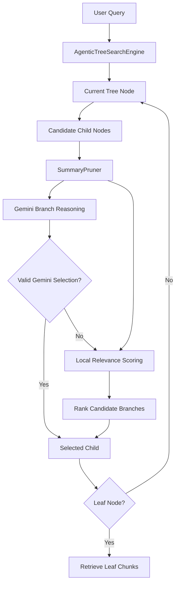
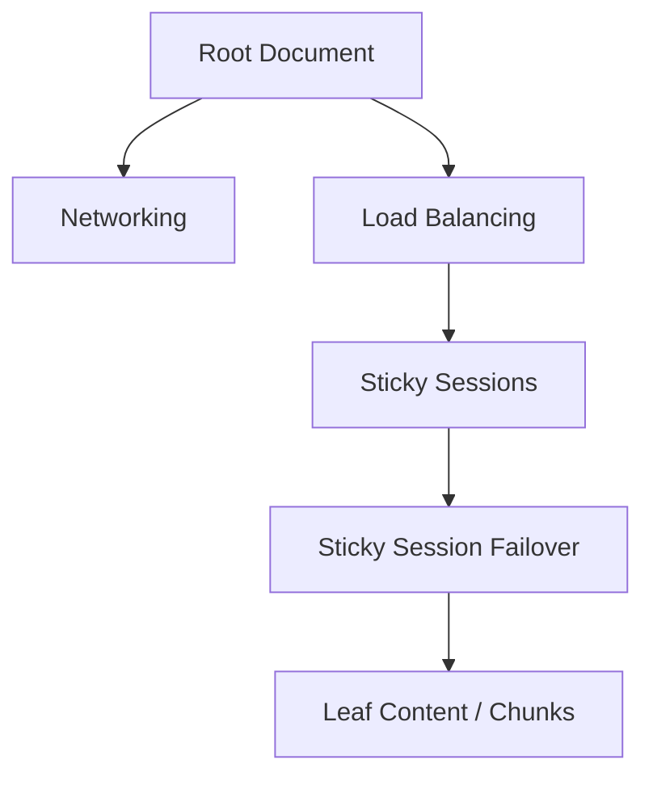
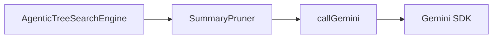
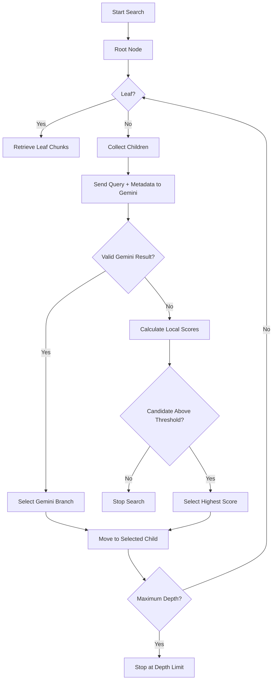
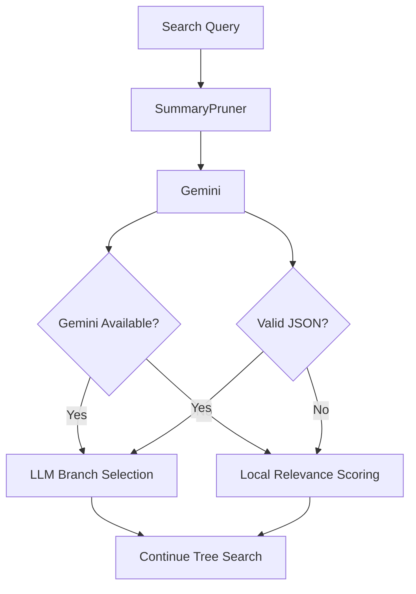
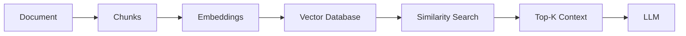
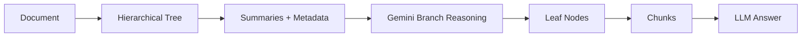
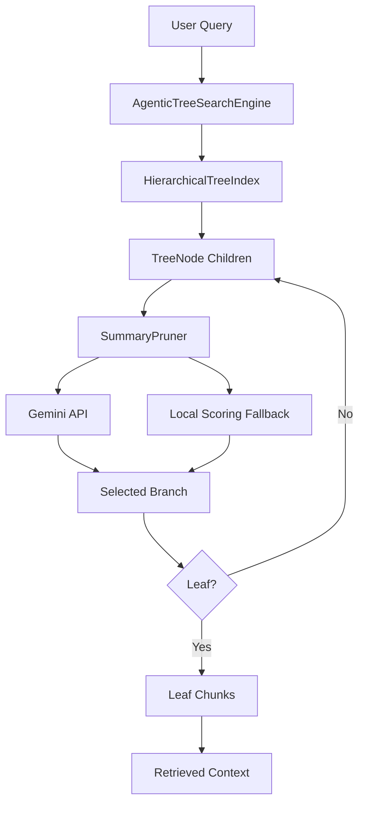

# Chapter 3 — Gemini Summary Pruner & Agentic Tree Search Engine

## 1. Chapter Goal

The goal of this chapter is to build the **Gemini-powered `SummaryPruner`** and the **`AgenticTreeSearchEngine`**.

In the previous chapters, we created:

* `TreeNode` — represents one document section.
* `HierarchicalTreeIndex` — provides fast node lookup and tree traversal.
* `TreeBuilder` — automatically creates the hierarchy and extracts keywords/entities.

However, we still need a mechanism that can answer:

> **Which child branch is most relevant to the user's question?**

This is where agentic tree search begins.

Instead of searching every document chunk independently, the engine moves **from the root toward the most relevant branch**.

At each level:

1. The current node exposes its children.
2. Gemini receives the query and candidate branch summaries.
3. Gemini chooses the most relevant child.
4. If Gemini is unavailable or its response cannot be parsed, local lexical scoring takes over.
5. The engine continues until it reaches a leaf or the maximum search depth.

The architecture therefore looks like:



### 🎯 Expected Outcome

For a query such as:

> `"How do sticky sessions handle backend failover?"`

the engine should navigate approximately like:



The important difference is that the engine does **not** need to compare the query against every leaf independently.

It progressively narrows the search space.

---

# 2. Why LLM Branch Reasoning?

Traditional vector RAG commonly follows this pattern:

```text
Query
  ↓
Embedding
  ↓
Vector Similarity
  ↓
Top-K Chunks
  ↓
LLM
```

Our tree-based architecture follows a different retrieval strategy:

```text
Query
  ↓
Root
  ↓
Choose Relevant Branch
  ↓
Choose Relevant Sub-Branch
  ↓
Choose Leaf
  ↓
Retrieve Content
  ↓
LLM Answer
```

The key idea is that **document structure becomes part of retrieval**.

For example:

```text
Load Balancing
├── Round Robin
├── Least Connections
├── Sticky Sessions
│   ├── Cookie Configuration
│   └── Sticky Session Failover
└── Health Checks
```

For:

> `"What happens when a sticky-session backend fails?"`

the engine should not waste retrieval effort on:

* Round Robin
* Health Checks
* unrelated networking sections

Instead, it should progressively navigate toward:

```text
Load Balancing
    ↓
Sticky Sessions
    ↓
Sticky Session Failover
```

---

# 3. Gemini-Powered Summary Pruner

## File Path

```text
adv-vectorless-rag/src/search/SummaryPruner.js
```

The `SummaryPruner` has two responsibilities:

### Gemini reasoning

It asks Gemini:

> Which candidate branch is most relevant to this query?

### Local fallback

If Gemini cannot be used, it calculates a deterministic relevance score using:

* title
* summary
* keywords
* entities

This makes the system **zero-crash** when:

* no Gemini API key exists
* the API request fails
* Gemini returns invalid JSON
* a model is temporarily unavailable
* the SDK cannot be initialized

---

# 4. `SummaryPruner.js` Implementation

````javascript
import { config } from "../config.js";
import { callGemini } from "./geminiClient.js";

export class SummaryPruner {
  /**
   * Convert a query into normalized unique terms.
   */
  static tokenize(query) {
    if (
      typeof query !== "string" ||
      !query.trim()
    ) {
      return [];
    }

    return [
      ...new Set(
        query
          .toLowerCase()
          .replace(/[^a-z0-9\s-]/g, " ")
          .split(/\s+/)
          .filter(
            (term) => term.length > 2
          )
      )
    ];
  }

  /**
   * Calculate a deterministic lexical relevance score.
   *
   * Higher weights are given to title matches because
   * titles are strong indicators of branch relevance.
   */
  static calculateRelevanceScore(
    query,
    node
  ) {
    const queryTerms =
      this.tokenize(query);

    if (
      queryTerms.length === 0 ||
      !node
    ) {
      return 0;
    }

    const title =
      String(node.title || "")
        .toLowerCase();

    const summary =
      String(node.summary || "")
        .toLowerCase();

    const keywords =
      Array.isArray(node.keywords)
        ? node.keywords
            .join(" ")
            .toLowerCase()
        : "";

    const entities =
      Array.isArray(node.entities)
        ? node.entities
            .join(" ")
            .toLowerCase()
        : "";

    let score = 0;

    for (const term of queryTerms) {
      if (title.includes(term)) {
        score += 5;
      }

      if (summary.includes(term)) {
        score += 2;
      }

      if (keywords.includes(term)) {
        score += 3;
      }

      if (entities.includes(term)) {
        score += 3;
      }
    }

    return score;
  }

  /**
   * Rank candidate nodes from most relevant
   * to least relevant.
   */
  static rankNodes(
    query,
    candidateNodes
  ) {
    if (
      !Array.isArray(candidateNodes)
    ) {
      return [];
    }

    return candidateNodes
      .map((node) => ({
        node,
        score:
          this.calculateRelevanceScore(
            query,
            node
          )
      }))
      .sort(
        (a, b) =>
          b.score - a.score
      );
  }

  /**
   * Ask Gemini to select the best branch.
   *
   * Returns:
   *   {
   *     node,
   *     reasoning
   *   }
   *
   * or null when Gemini cannot provide
   * a valid candidate.
   */
  static async evaluateWithGemini(
    query,
    candidateNodes
  ) {
    if (
      !Array.isArray(candidateNodes) ||
      candidateNodes.length === 0
    ) {
      return null;
    }

    const candidatesText =
      candidateNodes
        .map(
          (node, index) =>
            [
              `Option ${index + 1}`,
              `ID: ${node.nodeId}`,
              `Title: ${node.title}`,
              `Summary: ${node.summary || ""}`,
              `Keywords: ${
                Array.isArray(node.keywords)
                  ? node.keywords.join(", ")
                  : ""
              }`,
              `Entities: ${
                Array.isArray(node.entities)
                  ? node.entities.join(", ")
                  : ""
              }`
            ].join("\n")
        )
        .join("\n\n");

    const systemInstruction = `
You are an expert document retrieval agent.

You are navigating a hierarchical document tree.

Your job is to select the SINGLE candidate branch
that is most relevant to the user's query.

Use the title, summary, keywords and entities.

Do not invent a node ID.

Return ONLY valid JSON in this exact structure:

{
  "selectedNodeId": "existing_node_id",
  "reasoning": "short explanation"
}
`.trim();

    const prompt = `
User Query:
${query}

Candidate Document Branches:

${candidatesText}
`.trim();

    const rawResponse =
      await callGemini({
        systemInstruction,
        prompt
      });

    if (!rawResponse) {
      return null;
    }

    try {
      const cleanedResponse =
        rawResponse
          .replace(
            /^```json\s*/i,
            ""
          )
          .replace(
            /^```\s*/i,
            ""
          )
          .replace(
            /\s*```$/i,
            ""
          )
          .trim();

      const parsed =
        JSON.parse(
          cleanedResponse
        );

      if (
        typeof parsed.selectedNodeId !==
        "string"
      ) {
        return null;
      }

      const selected =
        candidateNodes.find(
          (node) =>
            node.nodeId ===
            parsed.selectedNodeId
        );

      if (!selected) {
        return null;
      }

      return {
        node: selected,
        reasoning:
          typeof parsed.reasoning ===
          "string"
            ? parsed.reasoning
            : "Gemini selected the branch."
      };
    } catch (error) {
      console.warn(
        `[SummaryPruner] Invalid Gemini JSON: ${error.message}`
      );

      return null;
    }
  }

  /**
   * Return candidates that satisfy
   * the configured relevance threshold.
   */
  static pruneNodes(
    query,
    candidateNodes,
    threshold =
      config.pruningThreshold
  ) {
    if (
      !Array.isArray(candidateNodes)
    ) {
      return [];
    }

    return candidateNodes.filter(
      (node) =>
        this.calculateRelevanceScore(
          query,
          node
        ) >= threshold
    );
  }
}
````

---

# 5. Understanding `SummaryPruner.js`

## 5.1 Importing Configuration and Gemini

```javascript
import { config } from "../config.js";
import { callGemini } from "./geminiClient.js";
```

The first import gives us centralized configuration.

For example:

```javascript
config.pruningThreshold
```

comes from:

```env
SUMMARY_PRUNING_THRESHOLD=1.5
```

The second import gives the search engine a single interface for Gemini.

This keeps Gemini-specific SDK logic outside the search algorithm.

The architecture becomes:



This separation is important because later we can replace Gemini with another model without rewriting the entire search engine.

---

# 6. Query Tokenization

```javascript
static tokenize(query) {
  if (
    typeof query !== "string" ||
    !query.trim()
  ) {
    return [];
  }

  return [
    ...new Set(
      query
        .toLowerCase()
        .replace(/[^a-z0-9\s-]/g, " ")
        .split(/\s+/)
        .filter(
          (term) => term.length > 2
        )
    )
  ];
}
```

The purpose is to normalize the user's query.

For:

```text
How do sticky sessions handle backend failover?
```

the tokenizer approximately produces:

```javascript
[
  "how",
  "sticky",
  "sessions",
  "handle",
  "backend",
  "failover"
]
```

Very short terms are removed.

`Set` removes duplicate terms.

This is not an embedding model. It is only used by the **local fallback scorer**.

---

# 7. Local Relevance Scoring

The local fallback combines four pieces of node metadata:

```text
Title
Summary
Keywords
Entities
```

For example:

```text
Query:
sticky session failover

Node:
Title: Sticky Session Failover
Summary: Recovery when a backend target fails.
Keywords: sticky, session, failover
Entities: ALB
```

The node receives points when query terms appear in these fields.

The title receives the strongest weight:

```javascript
if (title.includes(term)) {
  score += 5;
}
```

because a title such as:

```text
Sticky Session Failover
```

is a strong structural signal.

Keywords receive:

```javascript
score += 3;
```

while summaries and entities also contribute.

This gives us a deterministic fallback.

---

# 8. Ranking Candidates

```javascript
static rankNodes(
  query,
  candidateNodes
) {
  return candidateNodes
    .map((node) => ({
      node,
      score:
        this.calculateRelevanceScore(
          query,
          node
        )
    }))
    .sort(
      (a, b) =>
        b.score - a.score
    );
}
```

Suppose we have:

```text
Networking              → 0
Load Balancing          → 11
Database Failover       → 3
Sticky Sessions         → 15
```

The ranking becomes:

```text
1. Sticky Sessions       15
2. Load Balancing        11
3. Database Failover      3
4. Networking             0
```

The search engine can then select the highest-ranked viable candidate.

---

# 9. Gemini Branch Evaluation

This is the most important part of the chapter:

```javascript
static async evaluateWithGemini(
  query,
  candidateNodes
)
```

Gemini receives structured information about the available branches.

For example:

```text
User Query:
How do sticky sessions handle backend failover?

Option 1
ID: node_1
Title: Networking
Summary: IP routing and DNS configuration.
Keywords: networking, dns

Option 2
ID: node_2
Title: Load Balancing
Summary: Traffic distribution, sticky sessions and failover.
Keywords: load balancing, sticky sessions, failover
```

Gemini is instructed to return:

```json
{
  "selectedNodeId": "node_2",
  "reasoning": "The Load Balancing branch directly covers sticky sessions and failover."
}
```

The important point is that Gemini does **not** return arbitrary text.

It must identify an existing node ID.

---

# 10. Why Candidate Validation Is Important

Never blindly trust an LLM-generated ID.

This code verifies the result:

```javascript
const selected =
  candidateNodes.find(
    (node) =>
      node.nodeId ===
      parsed.selectedNodeId
  );
```

If Gemini returns:

```json
{
  "selectedNodeId": "node_that_does_not_exist"
}
```

the method returns:

```javascript
null
```

and the local fallback takes over.

This prevents an LLM hallucination from corrupting the tree traversal.

---

# 11. Handling Gemini JSON Safely

LLMs sometimes return Markdown code fences:

````text
```json
{
  "selectedNodeId": "node_2",
  "reasoning": "..."
}
````

````

Therefore we remove the code fence before parsing:

```javascript
const cleanedResponse =
  rawResponse
    .replace(
      /^```json\s*/i,
      ""
    )
    .replace(
      /^```\s*/i,
      ""
    )
    .replace(
      /\s*```$/i,
      ""
    )
    .trim();
````

Then:

```javascript
const parsed =
  JSON.parse(
    cleanedResponse
  );
```

If parsing fails, the system does not crash.

Instead:

```javascript
return null;
```

This activates the local retrieval path.

---

# 12. Pruning

The final method is:

```javascript
static pruneNodes(
  query,
  candidateNodes,
  threshold =
    config.pruningThreshold
)
```

It removes candidates whose local relevance score is below the configured threshold.

For example:

```text
Threshold = 1.5

Networking           → 0    ❌
Load Balancing       → 8    ✅
Database             → 0    ❌
Sticky Sessions      → 12   ✅
```

The result is:

```text
Load Balancing
Sticky Sessions
```

Gemini can then reason over the viable branches.

---

# 13. Implementing `AgenticTreeSearchEngine`

## File Path

```text
adv-vectorless-rag/src/search/AgenticTreeSearchEngine.js
```

The search engine controls the actual navigation.

Its responsibilities are:

1. Start at the root.
2. Inspect children.
3. Ask Gemini for the best branch.
4. Fall back to local ranking when necessary.
5. Continue downward.
6. Stop at a leaf.
7. Return the leaf chunks and navigation trajectory.

---

# 14. Complete `AgenticTreeSearchEngine.js`

```javascript
import { config } from "../config.js";
import { SummaryPruner } from "./SummaryPruner.js";

export class AgenticTreeSearchEngine {
  constructor(treeIndex) {
    if (
      !treeIndex ||
      !treeIndex.root
    ) {
      throw new Error(
        "A valid tree index with a root node is required."
      );
    }

    this.index = treeIndex;
  }

  /**
   * Search the hierarchical tree using
   * Gemini reasoning with local fallback.
   */
  async search(
    query,
    maxDepth =
      config.maxTreeDepth
  ) {
    if (
      typeof query !== "string" ||
      !query.trim()
    ) {
      throw new Error(
        "query must be a non-empty string."
      );
    }

    if (
      !Number.isInteger(maxDepth) ||
      maxDepth <= 0
    ) {
      throw new Error(
        "maxDepth must be a positive integer."
      );
    }

    console.log(
      `\n🔍 [Agentic Tree Search] Query: "${query}"`
    );

    const trajectoryLogs = [];

    const matchedLeaves = [];

    let currentNode =
      this.index.root;

    let depth = 0;

    trajectoryLogs.push(
      `Started at root [${currentNode.nodeId}] "${currentNode.title}".`
    );

    while (
      currentNode &&
      depth < maxDepth
    ) {
      if (
        currentNode.isLeaf()
      ) {
        matchedLeaves.push(
          currentNode
        );

        trajectoryLogs.push(
          `Reached leaf [${currentNode.nodeId}] "${currentNode.title}".`
        );

        console.log(
          `   🎯 Reached Leaf: "${currentNode.title}"`
        );

        break;
      }

      depth++;

      const children =
        currentNode.children;

      console.log(
        `   ├─ Level ${depth}: ` +
        `Evaluating ${children.length} child branch(es) ` +
        `of "${currentNode.title}"...`
      );

      trajectoryLogs.push(
        `Evaluating ${children.length} children under "${currentNode.title}".`
      );

      /*
       * First attempt:
       * Ask Gemini to reason over the branches.
       */
      const geminiResult =
        await SummaryPruner.evaluateWithGemini(
          query,
          children
        );

      if (geminiResult) {
        currentNode =
          geminiResult.node;

        const message =
          `Gemini selected [${currentNode.nodeId}] ` +
          `"${currentNode.title}". ` +
          `Reason: ${geminiResult.reasoning}`;

        trajectoryLogs.push(
          message
        );

        console.log(
          `   ✨ ${message}`
        );

        continue;
      }

      /*
       * Fallback:
       * Use deterministic local relevance scoring.
       */
      const rankedCandidates =
        SummaryPruner.rankNodes(
          query,
          children
        );

      const viableCandidates =
        rankedCandidates.filter(
          ({ score }) =>
            score >=
            config.pruningThreshold
        );

      if (
        viableCandidates.length === 0
      ) {
        const message =
          `No child branch passed the local relevance threshold under "${currentNode.title}".`;

        trajectoryLogs.push(
          message
        );

        console.log(
          `   ❌ ${message}`
        );

        break;
      }

      const bestCandidate =
        viableCandidates[0];

      currentNode =
        bestCandidate.node;

      const message =
        `Local fallback selected [${currentNode.nodeId}] ` +
        `"${currentNode.title}" ` +
        `(score: ${bestCandidate.score.toFixed(2)}).`;

      trajectoryLogs.push(
        message
      );

      console.log(
        `   └─ 🧠 ${message}`
      );
    }

    if (
      currentNode &&
      !currentNode.isLeaf() &&
      depth >= maxDepth
    ) {
      trajectoryLogs.push(
        `Search stopped because maxDepth (${maxDepth}) was reached.`
      );

      console.log(
        `   ⚠️ Maximum search depth reached.`
      );
    }

    const retrievedChunks =
      matchedLeaves.map(
        (leaf) => ({
          nodeId:
            leaf.nodeId,

          title:
            leaf.title,

          pageStart:
            leaf.pageStart,

          pageEnd:
            leaf.pageEnd,

          chunks:
            [...leaf.chunks]
        })
      );

    return {
      query,

      matchedLeavesCount:
        matchedLeaves.length,

      retrievedChunks,

      trajectoryLogs
    };
  }
}
```

---

# 15. Understanding the Search Engine

## 15.1 Constructor Validation

```javascript
constructor(treeIndex) {
  if (
    !treeIndex ||
    !treeIndex.root
  ) {
    throw new Error(
      "A valid tree index with a root node is required."
    );
  }

  this.index = treeIndex;
}
```

The search engine cannot work without a tree.

Therefore we validate it immediately.

This is better than allowing an obscure error later such as:

```text
Cannot read properties of undefined
```

---

# 16. Query and Depth Validation

```javascript
if (
  typeof query !== "string" ||
  !query.trim()
) {
  throw new Error(
    "query must be a non-empty string."
  );
}
```

This prevents calls such as:

```javascript
engine.search("");
```

or:

```javascript
engine.search(null);
```

We also validate:

```javascript
maxDepth
```

because unrestricted traversal could accidentally walk through a very deep document hierarchy.

The default comes from:

```javascript
config.maxTreeDepth
```

which is configured through:

```env
DEFAULT_MAX_TREE_DEPTH=3
```

---

# 17. Starting at the Root

```javascript
let currentNode =
  this.index.root;

let depth = 0;
```

The search always starts at the document root.

For example:

```text
root
├── Networking
├── Load Balancing
└── Databases
```

Initially:

```text
currentNode = root
```

The engine then evaluates:

```text
Networking
Load Balancing
Databases
```

---

# 18. Checking for a Leaf

```javascript
if (
  currentNode.isLeaf()
) {
  matchedLeaves.push(
    currentNode
  );

  break;
}
```

A leaf has no children.

For example:

```text
Sticky Session Failover
└── no children
```

At this point there is nothing else to navigate.

The engine retrieves the leaf's chunks.

---

# 19. Asking Gemini First

The main reasoning step is:

```javascript
const geminiResult =
  await SummaryPruner.evaluateWithGemini(
    query,
    children
  );
```

The engine gives Gemini:

```text
Query
+
Candidate branches
+
Branch summaries
+
Keywords
+
Entities
```

Gemini returns one branch.

For example:

```text
Current Node:
Load Balancing

Candidates:
├── Round Robin
├── Sticky Sessions
└── Health Checks

Query:
sticky session backend failover
```

Gemini may select:

```text
Sticky Sessions
```

The engine then moves:

```javascript
currentNode =
  geminiResult.node;
```

---

# 20. Local Fallback

Gemini is powerful, but external API calls can fail.

For example:

```text
No API key
     ↓
SDK unavailable
     ↓
Network failure
     ↓
Rate limit
     ↓
Invalid model response
     ↓
Invalid JSON
```

The search engine should still work.

Therefore:

```javascript
if (geminiResult) {
    // Gemini path
} else {
    // Local path
}
```

The fallback ranks candidates:

```javascript
const rankedCandidates =
  SummaryPruner.rankNodes(
    query,
    children
  );
```

Then removes candidates below the threshold:

```javascript
const viableCandidates =
  rankedCandidates.filter(
    ({ score }) =>
      score >=
      config.pruningThreshold
  );
```

Finally, it chooses the highest-scoring candidate:

```javascript
const bestCandidate =
  viableCandidates[0];
```

This is better than:

```javascript
pruned[0]
```

because the candidates are explicitly ranked before selection.

---

# 21. Complete Search Flow

The complete algorithm can be visualized as:



---

# 22. Why `trajectoryLogs` Matter

Agentic systems should not behave like a black box.

We therefore store:

```javascript
trajectoryLogs
```

Example:

```text
Started at root [root] "Cluster Manual".

Evaluating 2 children under "Cluster Manual".

Gemini selected [node_2] "Load Balancing".
Reason: This branch contains sticky session and failover concepts.

Evaluating 2 children under "Load Balancing".

Gemini selected [node_3] "Sticky Session Failover".
Reason: This section directly describes backend failure recovery.

Reached leaf [node_3] "Sticky Session Failover".
```

This becomes extremely useful later for:

* debugging
* observability
* evaluation
* agent tracing
* explaining retrieval decisions
* measuring search quality

---

# 23. Retrieved Chunk Structure

When the engine reaches a leaf, it returns:

```javascript
{
  nodeId,
  title,
  pageStart,
  pageEnd,
  chunks
}
```

For example:

```javascript
{
  nodeId: "node_3",
  title: "Sticky Session Failover",
  pageStart: 9,
  pageEnd: 12,
  chunks: [
    "When the sticky session target fails...",
    "The load balancer routes the request..."
  ]
}
```

This structure will later become the context passed into the **LLM answer-generation stage**.

---

# 24. Verification & Testing

Now we can test the complete Gemini-powered tree search.

Run:

```bash
node --input-type=module -e "
import { TreeBuilder } from './src/tree/TreeBuilder.js';
import { AgenticTreeSearchEngine } from './src/search/AgenticTreeSearchEngine.js';

const sections = [
  {
    title: 'Networking',
    level: 1,
    content: 'IP protocols, DNS routing and network communication.',
    summary: 'Network communication, IP protocols and DNS routing.',
    keywords: [
      'networking',
      'dns',
      'routing'
    ]
  },

  {
    title: 'Load Balancing',
    level: 1,
    content: 'Application load balancing, sticky sessions and backend failover.',
    summary: 'Load balancing with sticky sessions, session persistence and backend failover.',
    keywords: [
      'load balancing',
      'sticky sessions',
      'session',
      'failover',
      'backend',
      'alb'
    ]
  },

  {
    title: 'Sticky Session Failover',
    level: 2,
    content: 'When a sticky-session backend fails, the load balancer can route traffic to another healthy backend target.',
    summary: 'Sticky session recovery and backend failover when the original target becomes unavailable.',
    keywords: [
      'sticky',
      'session',
      'failover',
      'backend',
      'recovery',
      'alb'
    ]
  }
];

const index =
  TreeBuilder.buildFromStructuredSections(
    'Cluster Guide',
    sections
  );

const engine =
  new AgenticTreeSearchEngine(index);

const result =
  await engine.search(
    'How do sticky sessions handle backend failover?'
  );

console.log(
  '\\nMatched Leaves:',
  result.matchedLeavesCount
);

console.log(
  'Retrieved Chunks:',
  result.retrievedChunks
);

console.log(
  '\\nTrajectory:'
);

for (
  const log of result.trajectoryLogs
) {
  console.log('-', log);
}
"
```

---

# 25. Expected Behavior Without Gemini

If no Gemini API key is configured, `callGemini()` returns `null`.

The engine automatically falls back to local scoring.

The important result should be approximately:

```text
🔍 [Agentic Tree Search] Query:
"How do sticky sessions handle backend failover?"

   ├─ Level 1: Evaluating 2 child branch(es) of "Cluster Guide"...
   └─ 🧠 Local fallback selected [node_2] "Load Balancing"

   ├─ Level 2: Evaluating 1 child branch(es) of "Load Balancing"...
   └─ 🧠 Local fallback selected [node_3] "Sticky Session Failover"

   🎯 Reached Leaf: "Sticky Session Failover"

Matched Leaves: 1
```

The exact local score is not the important part.

The important result is:

```text
Matched Leaves: 1
```

and the target should be:

```text
Sticky Session Failover
```

---

# 26. Expected Behavior With Gemini

If Gemini is configured correctly, the first branch-selection attempt is handled by the LLM.

Conceptually:

```text
Query
  ↓
Gemini
  ↓
Load Balancing
  ↓
Gemini
  ↓
Sticky Session Failover
  ↓
Leaf Content
```

The trajectory can contain:

```text
Gemini selected [node_2] "Load Balancing".
Reason: The branch directly covers sticky sessions and backend failover.

Gemini selected [node_3] "Sticky Session Failover".
Reason: This section specifically describes recovery after backend failure.
```

The exact reasoning text depends on the model response, so it should not be hard-coded into expected output.

---

# 27. What Happens When Gemini Fails?

One of the most important architectural properties of this implementation is:



This means Gemini is an **intelligence enhancement**, not a single point of failure.

That is important for production systems.

---

# 28. Important Architectural Insight

At this point, our system has two different reasoning mechanisms:

### LLM reasoning

```text
Gemini
↓
Semantic interpretation
↓
Branch selection
```

### Deterministic fallback

```text
Title
+
Summary
+
Keywords
+
Entities
↓
Lexical score
↓
Branch selection
```

This gives us:

```text
LLM intelligence
        +
Deterministic reliability
        ↓
Robust agentic retrieval
```

---

# 29. Important Limitation: Parent Summaries Must Support Routing

There is an important problem with strict top-down retrieval.

Consider:

```text
Load Balancing
└── Sticky Sessions
    └── Session Failover
```

Suppose the parent says:

```text
Load Balancing

Summary:
Round-robin traffic distribution.
```

But the child says:

```text
Session Failover

Summary:
Sticky session recovery when a backend fails.
```

A purely local parent-level scorer may fail because:

```text
Query:
sticky session failover

Load Balancing:
no matching metadata
```

even though the correct answer is below it.

Gemini can sometimes reason about the broader branch if the parent summary contains enough context, but the architecture still depends heavily on good hierarchical metadata.

Therefore, **parent summaries should be routing-oriented summaries**.

Instead of:

```text
Load Balancing:
Traffic distribution.
```

prefer:

```text
Load Balancing:
Traffic distribution, sticky sessions, backend health,
session persistence and failover strategies.
```

This gives the parent enough semantic information to route queries toward its descendants.

---

# 30. Why This Is Not MCTS

It is important to use the correct terminology.

This implementation is:

> **Greedy top-down agentic tree search.**

It is **not** Monte Carlo Tree Search.

MCTS generally involves concepts such as:

* selection
* expansion
* simulation/rollout
* backpropagation
* repeated sampling

Our implementation instead does:

```text
Current Node
    ↓
Evaluate Children
    ↓
Select Best Child
    ↓
Move Down
    ↓
Repeat
```

Therefore, the project can be described as:

> **Gemini-powered agentic hierarchical tree retrieval**

rather than MCTS.

---

# 31. Vector RAG vs This Architecture

This chapter should also make the distinction clear.

A conventional vector pipeline may look like:



Our current architecture looks like:



The distinction is not simply:

```text
Vector = bad
Vectorless = good
```

Both approaches have strengths.

The real architectural difference is:

```text
Vector retrieval:
Similarity-driven retrieval

Vectorless tree retrieval:
Structure + metadata + reasoning-driven navigation
```

And vector systems can also preserve metadata and hierarchy if designed appropriately. The purpose of this project is to explore a different retrieval strategy rather than claim that vector databases inherently cannot preserve document structure.

---

# 32. Chapter 3 Architecture

After completing this chapter, our project looks like:



The three chapters now work together:

```text
Chapter 1
TreeNode + HierarchicalTreeIndex
          ↓
Chapter 2
TreeBuilder + Metadata Extraction
          ↓
Chapter 3
Gemini Agentic Tree Search
```

---

# 33. Production Considerations

The current implementation is a strong learning/prototype architecture, but production systems would need additional safeguards.

### 1. Structured Gemini output

Instead of relying only on:

```javascript
JSON.parse()
```

a production implementation should use the model/API's structured-output capabilities where supported.

This reduces malformed responses.

### 2. API timeouts

Gemini requests should have timeout and cancellation handling.

### 3. Retry policy

Transient API failures can use bounded retries with exponential backoff.

### 4. Rate limiting

Large document retrieval workloads can generate many LLM requests.

Caching and request limits become important.

### 5. Observability

The `trajectoryLogs` concept should eventually become structured telemetry:

```javascript
{
  depth: 1,
  parentNodeId: "root",
  selectedNodeId: "node_2",
  method: "gemini",
  reasoning: "...",
  latencyMs: 240
}
```

### 6. Better entity extraction

The current keyword/entity extraction is intentionally lightweight.

Production systems could use:

* LLM extraction
* NER models
* domain dictionaries
* metadata from the source document

### 7. Better branch selection

Future versions can support:

* subtree-aware scoring
* multiple candidate branches
* beam search
* query rewriting
* recursive retrieval
* confidence scoring
* reranking
* hybrid vector + tree retrieval

---

# 34. Chapter Summary

We have now implemented the first genuinely **agentic retrieval layer** of the project.

The system can:

* navigate hierarchical document trees
* evaluate candidate branches
* ask Gemini to choose the best branch
* validate LLM-generated node IDs
* fall back to deterministic local scoring
* enforce a maximum tree depth
* record navigation trajectories
* retrieve content from leaf nodes
* continue operating when Gemini is unavailable

The resulting retrieval strategy is:

```text
User Query
    ↓
Root
    ↓
Gemini Branch Reasoning
    ↓
Selected Branch
    ↓
Gemini Branch Reasoning
    ↓
Selected Sub-Branch
    ↓
Leaf
    ↓
Retrieved Chunks
```

This forms the core retrieval engine that later chapters can connect to the **LLM Wiki**, **two-pass retrieval**, and final **answer synthesis** layers.

---

## Chapter 3 → Chapter 4

In **Chapter 4**, we move from hierarchical document trees to the **LLM Wiki Architecture**.

We will build:

```text
WikiFileEntry
      ↓
WikiVault
      ↓
Metadata Catalog
      ↓
Wiki Documents
```

The goal is to create a second retrieval layer where the system first identifies the most relevant wiki documents and only then reads their complete contents.

That gives us the foundation for the **two-pass LLM librarian architecture**.

The biggest conceptual upgrade here is that **Gemini is now a branch-selection agent, while the local scorer is the reliability layer**. That distinction will make the later two-pass Wiki/Librarian chapter much easier to design correctly.
