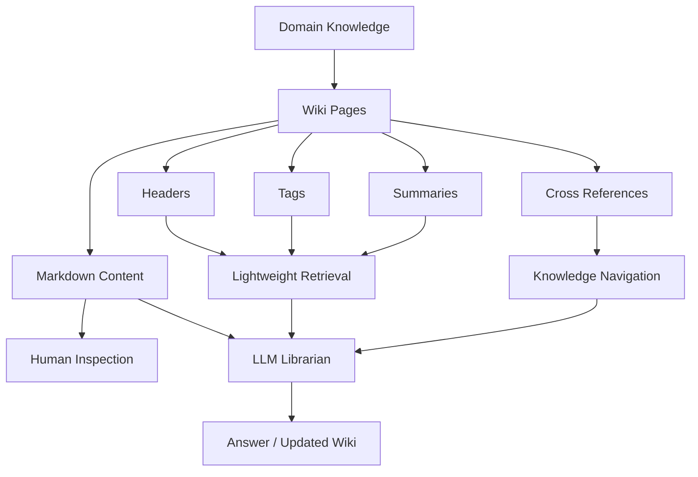
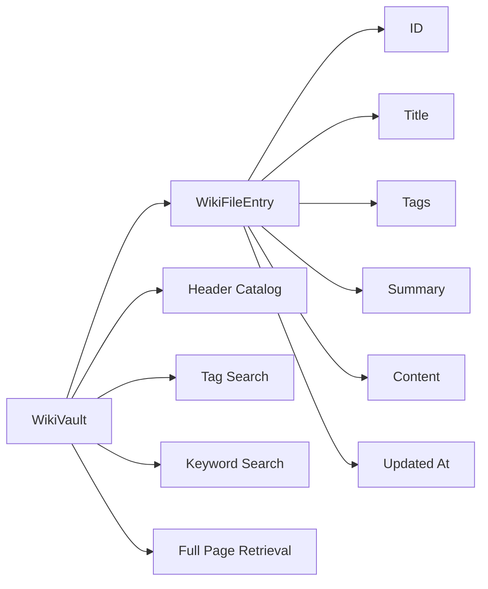
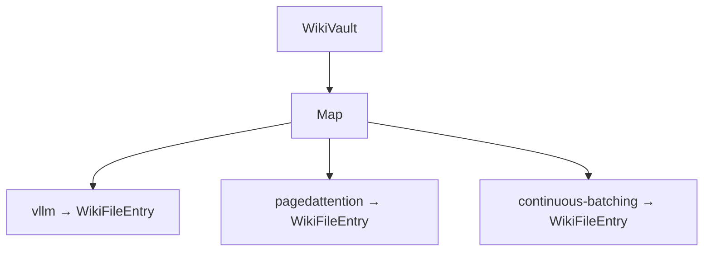
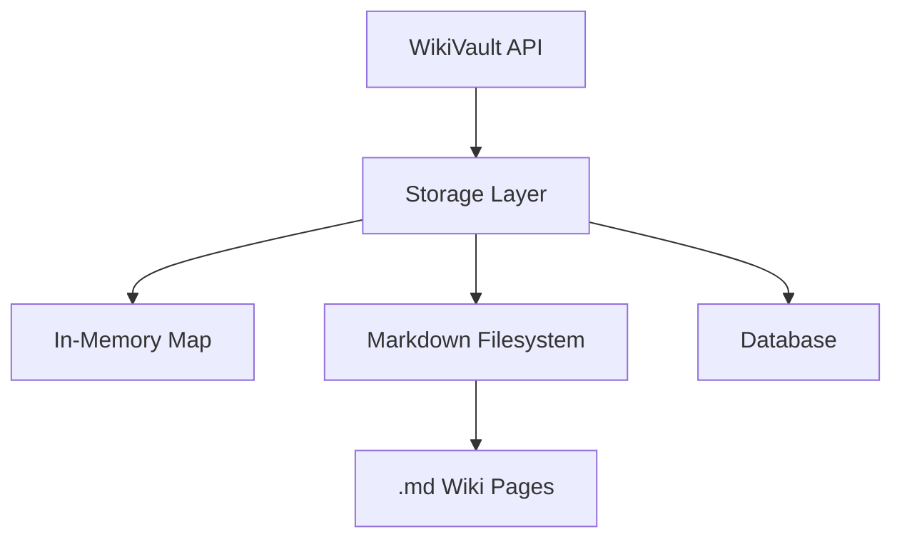
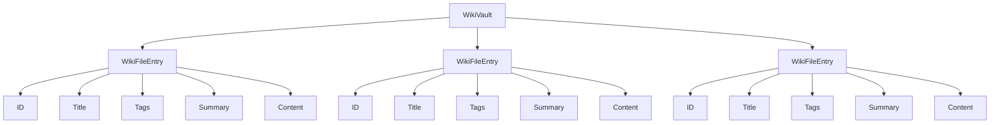
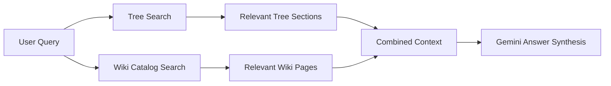
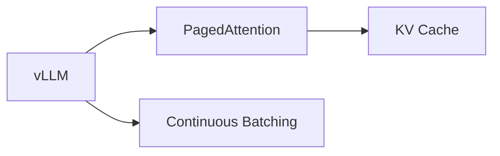
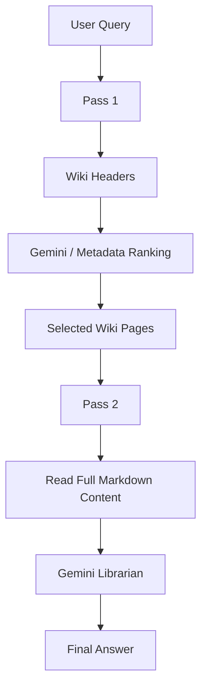

# Chapter 4 — LLM Wiki Architecture & Vault Manager

## 1. Chapter Goal

In Chapters 1–3, we built a hierarchical document retrieval system:

```text
Document
   ↓
TreeBuilder
   ↓
Hierarchical Tree
   ↓
Gemini Agentic Search
   ↓
Relevant Leaf
   ↓
Retrieved Chunks
```

However, a complete Vectorless RAG system needs another important layer:

> **A human-readable knowledge repository that an LLM can inspect and reason over.**

This chapter introduces the **LLM Wiki architecture** and implements the `WikiVault`.

The implementation will live in:

```text
adv-vectorless-rag/src/wiki/WikiVault.js
```

The central idea is simple:

Instead of treating knowledge as an opaque collection of embeddings, we organize knowledge into **structured wiki pages** containing:

* title
* tags
* summary
* content
* identifiers
* timestamps
* eventually, cross-reference links

For example:

```text
WikiVault
├── vLLM Architecture
├── PagedAttention Mechanism
├── Continuous Batching
└── KV Cache Management
```

Each page remains inspectable as normal knowledge.

---

# 2. What Is an LLM Wiki?

An LLM Wiki can be thought of as a knowledge base designed for both:

* humans
* language models

A traditional application might store knowledge primarily inside:

```text
Database
Vector Index
Embeddings
Metadata
```

A wiki-oriented system emphasizes:

```text
Readable Documents
       +
Structured Metadata
       +
Explicit Relationships
       +
LLM Reasoning
```

A conceptual architecture is:



The important property is **transparency**.

A developer should be able to open a wiki page and understand what the system knows.

---

# 3. Inspiration and Architectural Principles

This chapter is inspired by the general **LLM Wiki / AI-maintained knowledge-base** concept associated with modern LLM workflows.

We are not reproducing a particular external implementation.

Instead, we are adopting several useful principles.

## Principle 1 — Human-readable knowledge

Knowledge should be represented in a format that humans can inspect.

Markdown is ideal because it is:

* simple
* portable
* version-control friendly
* easy for LLMs to read
* easy to generate

---

## Principle 2 — Structured metadata

Every page should have lightweight metadata such as:

```text
ID
Title
Tags
Summary
Updated timestamp
```

This allows us to search the **catalog** without immediately processing the entire document.

---

## Principle 3 — Two-pass retrieval

Instead of immediately loading every page:

```text
Query
 ↓
Read every document
 ↓
LLM
```

we eventually want:

```text
Query
 ↓
Search lightweight headers
 ↓
Select relevant pages
 ↓
Read selected full content
 ↓
LLM synthesis
```

This will be implemented in Chapter 5.

---

## Principle 4 — Explicit relationships

Wiki pages can eventually contain links such as:

```markdown
See also:

[[PagedAttention]]
[[Continuous Batching]]
[[KV Cache]]
```

These links create an explicit knowledge graph between pages.

The current chapter stores page content but does **not yet parse or resolve these links**.

That functionality can be added later.

---

# 4. Expected Architecture

After this chapter, the architecture becomes:



The `WikiVault` is therefore responsible for managing the knowledge pages, while Chapter 5 will be responsible for intelligently retrieving them.

---

# 5. File Structure

Create:

```text
adv-vectorless-rag/
└── src/
    └── wiki/
        └── WikiVault.js
```

The file contains two classes:

```text
WikiFileEntry
      ↓
Represents one wiki page

WikiVault
      ↓
Manages all wiki pages
```

---

# 6. Implementing `WikiFileEntry`

## Why do we need `WikiFileEntry`?

Each wiki page needs a consistent structure.

Without a model, pages could look like:

```javascript
{
  name: "...",
  keywords: "...",
  text: "..."
}
```

while another page might use:

```javascript
{
  title: "...",
  labels: "...",
  body: "..."
}
```

That inconsistency makes retrieval harder.

`WikiFileEntry` provides a standard schema.

---

# 7. Complete `WikiVault.js`

```javascript id="8y4m2p"
export class WikiFileEntry {
  constructor({
    id,
    title,
    tags = [],
    summary = "",
    content = ""
  }) {
    if (
      typeof id !== "string" ||
      !id.trim()
    ) {
      throw new Error(
        "Wiki page id must be a non-empty string."
      );
    }

    if (
      typeof title !== "string" ||
      !title.trim()
    ) {
      throw new Error(
        "Wiki page title must be a non-empty string."
      );
    }

    if (!Array.isArray(tags)) {
      throw new TypeError(
        "Wiki page tags must be an array."
      );
    }

    this.id = id.trim();

    this.title =
      title.trim();

    this.tags = [
      ...new Set(
        tags
          .map((tag) =>
            String(tag)
              .trim()
              .toLowerCase()
          )
          .filter(Boolean)
      )
    ];

    this.summary =
      typeof summary === "string"
        ? summary.trim()
        : "";

    this.content =
      typeof content === "string"
        ? content
        : "";

    this.updatedAt =
      new Date();
  }

  /**
   * Return lightweight metadata suitable
   * for catalog searches.
   */
  getHeader() {
    return {
      id: this.id,
      title: this.title,
      tags: [...this.tags],
      summary: this.summary,
      updatedAt:
        this.updatedAt
    };
  }
}


export class WikiVault {
  constructor() {
    /**
     * Map:
     *
     * pageId -> WikiFileEntry
     */
    this.pages = new Map();
  }

  /**
   * Add a wiki page to the vault.
   */
  addPage(pageConfig) {
    const entry =
      new WikiFileEntry(
        pageConfig
      );

    if (
      this.pages.has(entry.id)
    ) {
      throw new Error(
        `Wiki page with id "${entry.id}" already exists.`
      );
    }

    this.pages.set(
      entry.id,
      entry
    );

    console.log(
      `[WikiVault] Indexed Wiki Page: ` +
      `"${entry.title}" ` +
      `[ID: ${entry.id}]`
    );

    return entry;
  }

  /**
   * Retrieve one page by ID.
   */
  getPage(id) {
    if (
      typeof id !== "string"
    ) {
      return null;
    }

    return (
      this.pages.get(
        id.trim()
      ) || null
    );
  }

  /**
   * Return lightweight metadata for
   * all pages.
   *
   * Full content is intentionally excluded.
   */
  getAllPageHeaders() {
    return Array.from(
      this.pages.values()
    ).map(
      (page) =>
        page.getHeader()
    );
  }

  /**
   * Search pages by exact tag.
   */
  searchByTag(tag) {
    if (
      typeof tag !== "string" ||
      !tag.trim()
    ) {
      return [];
    }

    const targetTag =
      tag
        .trim()
        .toLowerCase();

    const results = [];

    for (
      const page
      of this.pages.values()
    ) {
      if (
        page.tags.includes(
          targetTag
        )
      ) {
        results.push(page);
      }
    }

    return results;
  }

  /**
   * Search lightweight metadata by keyword.
   *
   * This does not search the full page body.
   */
  searchByKeyword(keyword) {
    if (
      typeof keyword !== "string" ||
      !keyword.trim()
    ) {
      return [];
    }

    const normalizedKeyword =
      keyword
        .trim()
        .toLowerCase();

    const results = [];

    for (
      const page
      of this.pages.values()
    ) {
      const matchText = [
        page.title,
        page.summary,
        page.tags.join(" ")
      ]
        .join(" ")
        .toLowerCase();

      if (
        matchText.includes(
          normalizedKeyword
        )
      ) {
        results.push(page);
      }
    }

    return results;
  }

  /**
   * Return the number of pages
   * currently stored in the vault.
   */
  size() {
    return this.pages.size;
  }
}
```

---

# 8. Understanding `WikiFileEntry`

The constructor receives:

```javascript id="b6ddn5"
{
  id,
  title,
  tags,
  summary,
  content
}
```

For example:

```javascript id="f6fl0m"
const page =
  new WikiFileEntry({
    id: "vllm",
    title: "vLLM Architecture",
    tags: [
      "llm",
      "inference",
      "memory"
    ],
    summary:
      "High-performance LLM serving.",
    content:
      "# vLLM Architecture\n..."
  });
```

The resulting object represents one complete wiki page.

---

# 9. ID Validation

This is important:

```javascript id="4g6y2n"
if (
  typeof id !== "string" ||
  !id.trim()
) {
  throw new Error(
    "Wiki page id must be a non-empty string."
  );
}
```

Every page needs a stable identifier.

For example:

```text id="x5n8jq"
vllm
pagedattention
continuous-batching
kv-cache
```

These IDs can later be used for:

* cross references
* retrieval
* updates
* deletion
* citations
* page relationships

---

# 10. Tag Normalization

The constructor normalizes tags:

```javascript id="c8v1rj"
this.tags = [
  ...new Set(
    tags
      .map((tag) =>
        String(tag)
          .trim()
          .toLowerCase()
      )
      .filter(Boolean)
  )
];
```

For example:

```javascript id="o7k5tg"
[
  "LLM",
  " inference ",
  "Memory",
  "memory"
]
```

becomes:

```javascript id="r7u9k5"
[
  "llm",
  "inference",
  "memory"
]
```

This makes tag searches predictable.

---

# 11. Why `updatedAt`?

Every page receives:

```javascript id="5pxd9v"
this.updatedAt =
  new Date();
```

This gives the system basic temporal metadata.

Later this can help the librarian determine:

* which page was recently updated
* whether a page is stale
* when a page should be regenerated
* which page version is newer

A production system would normally use a persistent timestamp from storage rather than relying only on an in-memory object.

---

# 12. The `getHeader()` Method

```javascript id="2a6d6s"
getHeader() {
  return {
    id: this.id,
    title: this.title,
    tags: [...this.tags],
    summary: this.summary,
    updatedAt:
      this.updatedAt
  };
}
```

This method is extremely important for Chapter 5.

It separates:

```text
Page Metadata
```

from:

```text
Full Page Content
```

The header contains:

```text
ID
Title
Tags
Summary
UpdatedAt
```

but not:

```text
content
```

Therefore a future retrieval system can search hundreds or thousands of page headers without putting all page bodies into the LLM context.

---

# 13. Why Return a Copy of `tags`?

Notice:

```javascript id="3y8m2r"
tags: [...this.tags]
```

instead of:

```javascript id="c5plnd"
tags: this.tags
```

The copy prevents external code from directly modifying the internal tag array.

For example, this:

```javascript id="7a4f5k"
const header =
  page.getHeader();

header.tags.push(
  "modified"
);
```

should not modify the actual page's internal tags.

This is a small but useful encapsulation practice.

---

# 14. `WikiVault`

The vault stores pages using:

```javascript id="qq6exf"
this.pages = new Map();
```

The structure is conceptually:



Why `Map`?

Because we frequently need:

```javascript id="hbyb8n"
vault.getPage("vllm")
```

A `Map` provides direct key-based lookup.

---

# 15. Adding a Wiki Page

The main operation is:

```javascript id="f6p8je"
vault.addPage({
  id: "vllm",
  title: "vLLM Architecture",
  tags: [
    "llm",
    "inference",
    "memory"
  ],
  summary:
    "High-performance LLM serving.",
  content:
    "# vLLM Architecture\n..."
});
```

Internally:

```text id="g3q9ty"
pageConfig
    ↓
WikiFileEntry
    ↓
Validation + normalization
    ↓
Map.set(id, entry)
    ↓
WikiVault
```

---

# 16. Duplicate IDs

The implementation intentionally prevents:

```javascript id="u8v4h2"
vault.addPage({
  id: "vllm",
  ...
});

vault.addPage({
  id: "vllm",
  ...
});
```

from silently overwriting the existing page.

Without validation, this:

```javascript id="h4g0jm"
this.pages.set(
  entry.id,
  entry
);
```

would replace the previous page.

That can be dangerous in knowledge-management systems.

Instead, we explicitly throw:

```javascript id="8o1v8j"
Wiki page with id "vllm" already exists.
```

Later, if we need updates, we can implement an explicit:

```text
updatePage()
```

operation.

---

# 17. Getting a Page

```javascript id="w1z2q3"
const page =
  vault.getPage(
    "vllm"
  );
```

If found:

```text id="a2f4jd"
WikiFileEntry
```

If not:

```javascript id="7p3w9a"
null
```

Returning `null` is useful because the caller can explicitly handle a missing page.

---

# 18. Header Catalog

The method:

```javascript id="7g1x9e"
getAllPageHeaders()
```

returns lightweight metadata.

Suppose the vault contains:

```text
vLLM Architecture
PagedAttention Mechanism
Continuous Batching
```

the result looks approximately like:

```javascript id="k9q2sp"
[
  {
    id: "vllm",
    title: "vLLM Architecture",
    tags: [
      "llm",
      "inference",
      "memory"
    ],
    summary:
      "High-performance LLM serving."
  },

  {
    id: "pagedattention",
    title:
      "PagedAttention Mechanism",
    tags: [
      "memory",
      "os",
      "kv-cache"
    ],
    summary:
      "Efficient KV-cache management."
  }
]
```

Notice what is missing:

```text
content
```

This is the foundation of **two-pass retrieval**.

---

# 19. Tag Search

The method:

```javascript id="v1h7js"
searchByTag("inference")
```

normalizes the input:

```javascript id="r3p4mj"
const targetTag =
  tag
    .trim()
    .toLowerCase();
```

Then checks:

```javascript id="6m4h9f"
page.tags.includes(
  targetTag
)
```

This means:

```text
"inference"
```

matches:

```text
"Inference"
```

because tags were normalized when the page was created.

---

# 20. Keyword Search

The second lightweight retrieval method is:

```javascript id="5i8f3w"
searchByKeyword(
  "pagedattention"
)
```

It searches:

```text
Title
+
Summary
+
Tags
```

It intentionally does **not** search the full content.

For example:

```text id="9qv4b7"
Page:
PagedAttention Mechanism

Summary:
Memory-efficient KV-cache management.

Tags:
memory, os, kv-cache
```

A query for:

```text
memory
```

will find the page.

This is a lightweight metadata search rather than semantic search.

---

# 21. Important Distinction: Keyword Search Is Not Semantic Search

The method:

```javascript id="8a6q2n"
searchByKeyword()
```

uses string matching.

It does not understand that:

```text
"LLM serving performance"
```

could be related to:

```text
"inference throughput"
```

unless the actual metadata contains matching terms.

That semantic reasoning will eventually be handled by Gemini in the librarian layer.

Therefore:

```text id="h0u7vp"
WikiVault
   ↓
Lightweight deterministic filtering

LLM Librarian
   ↓
Semantic reasoning
```

This separation keeps responsibilities clear.

---

# 22. Why an In-Memory Vault First?

The current implementation uses:

```javascript id="e8s3k1"
new Map()
```

This means the vault exists only during the current Node.js process.

It is **not yet a filesystem-backed Markdown vault**.

That distinction is important.

The architecture is designed so that we can later replace:

```text
Map
```

with:

```text
Markdown Files
+
Filesystem
+
Metadata Index
```

For example:



The retrieval API does not necessarily need to change.

---

# 23. Future Markdown Wiki Page

A real page could eventually look like:

```markdown
---
id: vllm
title: vLLM Architecture
tags:
  - llm
  - inference
  - memory
summary: High-performance LLM serving architecture.
---

# vLLM Architecture

vLLM is an inference and serving system
designed for efficient large language model serving.

## Architecture

The system uses PagedAttention for efficient
KV-cache memory management.

## Related Concepts

[[PagedAttention]]
[[Continuous Batching]]
[[KV Cache]]
```

The current `WikiFileEntry` represents this information programmatically.

A later filesystem adapter can parse this format.

---

# 24. Verification & Testing

Create a small test directly from Node.js.

Because this project uses ESM, use:

```bash id="9q3r2a"
node --input-type=module -e "
import { WikiVault } from './src/wiki/WikiVault.js';

const vault = new WikiVault();

vault.addPage({
  id: 'vllm',
  title: 'vLLM Architecture',
  tags: [
    'llm',
    'inference',
    'memory'
  ],
  summary:
    'High-performance LLM serving.',
  content:
    '# vLLM Architecture\n\nvLLM improves LLM serving efficiency.'
});

vault.addPage({
  id: 'pagedattention',
  title: 'PagedAttention Mechanism',
  tags: [
    'memory',
    'os',
    'kv-cache'
  ],
  summary:
    'Efficient KV-cache memory management.',
  content:
    '# PagedAttention\n\nPagedAttention manages KV-cache blocks.'
});

const tagResults =
  vault.searchByTag(
    'inference'
  );

console.log(
  'Found Tag Matches:',
  tagResults.length
);

const keywordResults =
  vault.searchByKeyword(
    'memory'
  );

console.log(
  'Found Keyword Matches:',
  keywordResults.length
);

console.log(
  'Header Count:',
  vault.getAllPageHeaders().length
);
"
```

---

# 25. Expected Output

You should see approximately:

```text
[WikiVault] Indexed Wiki Page: "vLLM Architecture" [ID: vllm]

[WikiVault] Indexed Wiki Page: "PagedAttention Mechanism" [ID: pagedattention]

Found Tag Matches: 1

Found Keyword Matches: 2

Header Count: 2
```

The exact console formatting may differ slightly depending on the Node.js environment.

---

# 26. Testing Full Page Retrieval

We can also test:

```javascript id="7f3n5k"
const page =
  vault.getPage(
    "vllm"
  );

console.log(
  page.title
);

console.log(
  page.content
);
```

Expected:

```text id="9c5d8p"
vLLM Architecture

# vLLM Architecture

vLLM improves LLM serving efficiency.
```

This demonstrates an important distinction:

```text
getAllPageHeaders()
    ↓
Lightweight metadata

getPage(id)
    ↓
Full page
```

That distinction becomes critical in Chapter 5.

---

# 27. Internal Architecture

At the end of this chapter, the Wiki layer looks like:



The vault is effectively the **knowledge container**.

---

# 28. How Chapter 4 Connects to Chapter 3

We now have two complementary retrieval structures.

### Hierarchical Tree

Built in Chapters 1–3:

```text
Document
   ↓
Tree
   ↓
Gemini Branch Navigation
   ↓
Leaf
```

### LLM Wiki

Built in Chapter 4:

```text
Knowledge
   ↓
Wiki Pages
   ↓
Metadata Catalog
   ↓
Page Retrieval
```

These can eventually work together.

For example:



This is one of the more interesting aspects of the Vectorless RAG architecture.

The tree provides **document structure**, while the Wiki provides **curated knowledge structure**.

---

# 29. Why This Is Useful for Vectorless RAG

The Wiki layer provides several useful properties.

## 1. Inspectability

Humans can inspect the knowledge.

```text
Wiki Page
   ↓
Read Markdown
   ↓
Understand Source
```

There is no need to decode an embedding vector to understand what the system knows.

---

## 2. Metadata-driven retrieval

The system can first reason over:

```text
Title
Tags
Summary
```

before reading the complete page.

---

## 3. Explicit relationships

Wiki links such as:

```text
[[PagedAttention]]
```

can eventually become navigable relationships.

---

## 4. Easier debugging

If the LLM produces a bad answer, developers can inspect:

```text
Which wiki page was selected?
Why was it selected?
What content was supplied?
```

---

## 5. LLM-maintainable knowledge

A future librarian agent can:

```text
Read pages
   ↓
Identify missing information
   ↓
Create/update pages
   ↓
Add links
   ↓
Improve summaries
```

This turns the Wiki into a continuously maintainable knowledge layer.

---

# 30. Production Considerations

The current implementation is intentionally simple.

A production implementation would likely need additional components.

### Persistent storage

Instead of:

```javascript
new Map()
```

use:

```text
Filesystem
Object Storage
Database
Git repository
```

depending on the application.

---

### File locking / concurrent updates

If multiple agents update wiki pages simultaneously, writes must be coordinated.

---

### Version history

Wiki pages should ideally preserve:

```text
createdAt
updatedAt
version
author
change reason
```

---

### Cross-reference indexing

A production WikiVault could parse:

```text
[[PagedAttention]]
```

and build:



This would turn the wiki into a navigable knowledge graph.

---

### Better search

The current search is intentionally lightweight.

Future versions can support:

```text
Exact tag search
        +
Keyword search
        +
LLM semantic ranking
        +
Link traversal
```

---

# 31. Important Architectural Boundary

It is useful to keep these responsibilities separate:

```text
WikiVault
    ↓
Stores and retrieves knowledge

TwoPassRetriever
    ↓
Decides which pages should be read

LLMLibrarian
    ↓
Uses retrieved knowledge to reason and synthesize answers
```

Therefore, `WikiVault` should **not** become responsible for Gemini reasoning.

That belongs in the higher-level retrieval/librarian layer.

This separation will keep the codebase maintainable.

---

# 32. Chapter 4 Summary

We have now created the Wiki knowledge layer.

The major components are:

```text
WikiFileEntry
    ↓
Standard page representation

WikiVault
    ↓
Page management

getAllPageHeaders()
    ↓
Lightweight catalog retrieval

searchByTag()
    ↓
Exact tag filtering

searchByKeyword()
    ↓
Metadata keyword filtering

getPage()
    ↓
Full page retrieval
```

The most important architectural idea is:

> **Search lightweight metadata first, then retrieve expensive/full content only when necessary.**

This is the foundation of the next chapter.

---

# 33. Chapter 4 → Chapter 5

The next chapter will build:

```text
TwoPassRetriever
        +
LLMLibrarian
        +
Gemini
```

The retrieval process will become:



So Chapter 4 provides the **knowledge repository**, while Chapter 5 will provide the **intelligent librarian that navigates it**.

