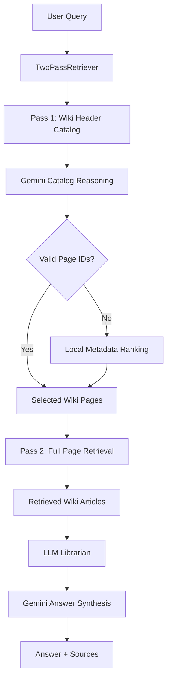
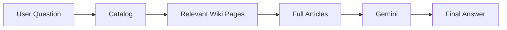
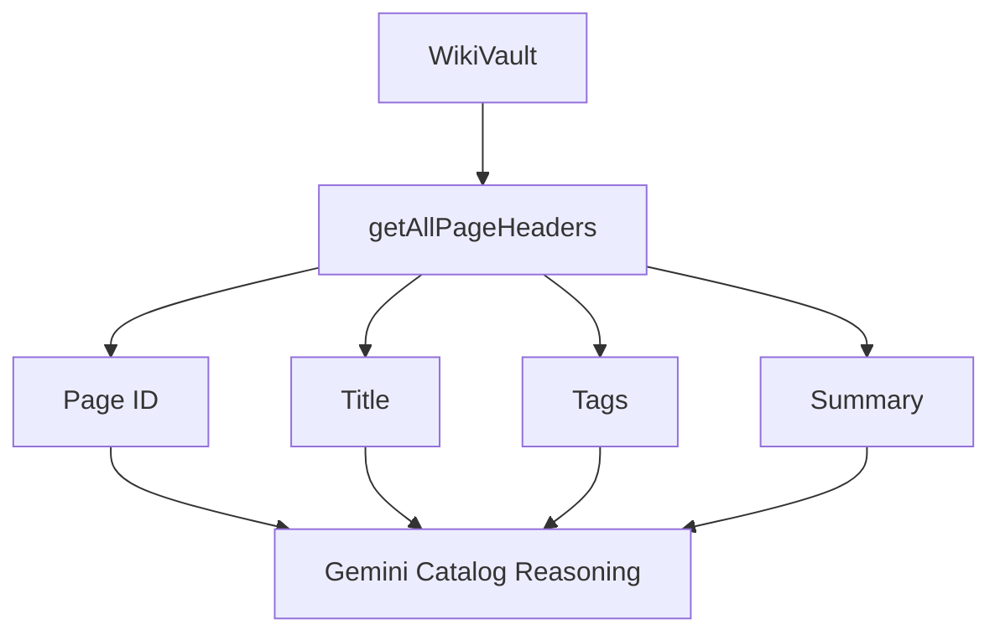
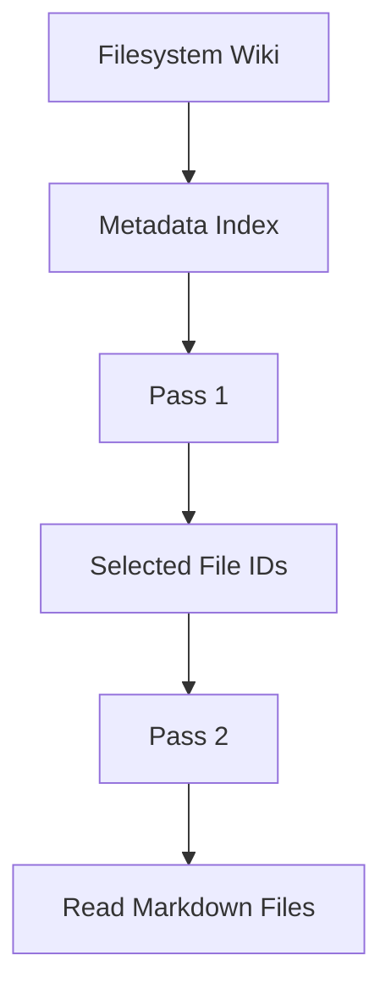
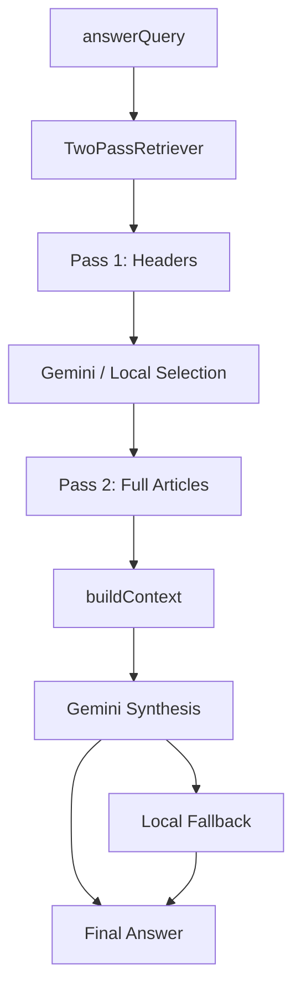
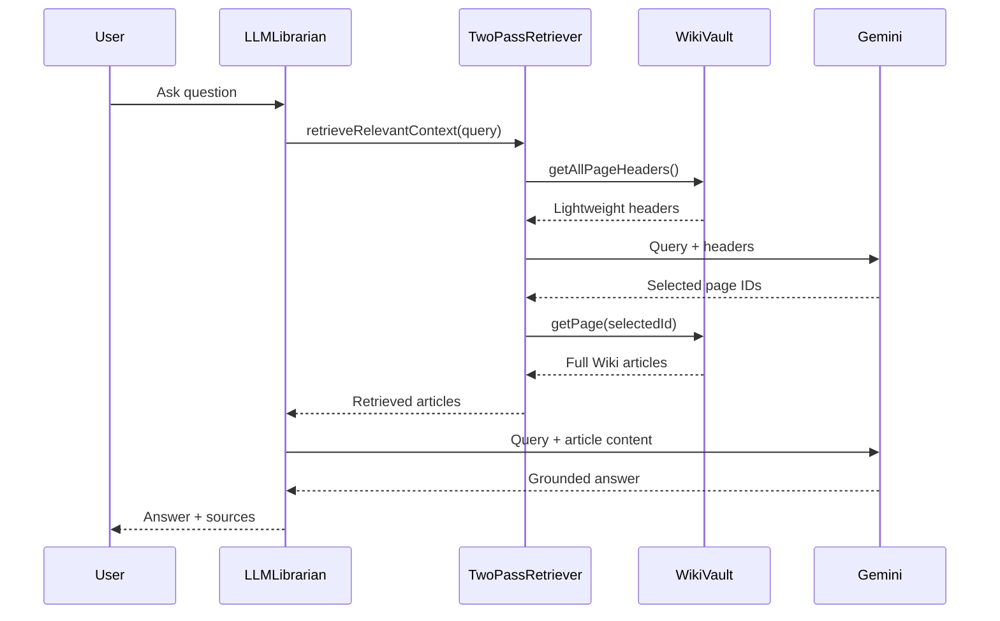
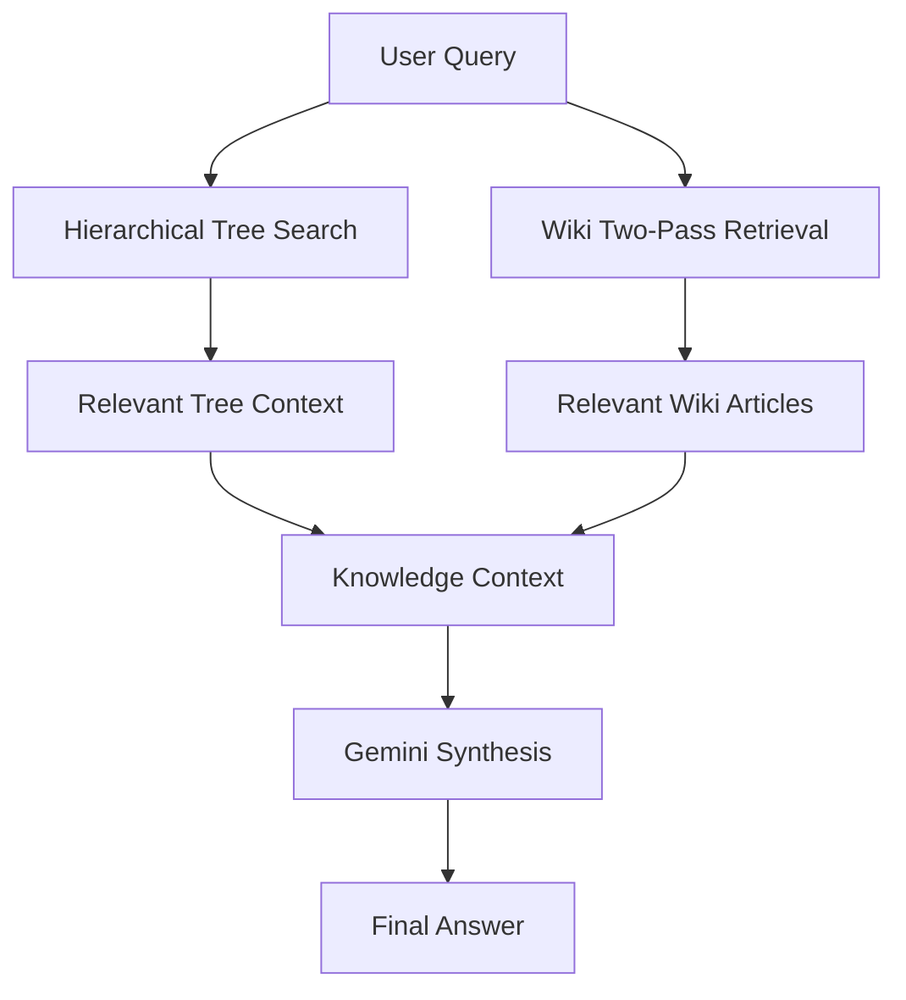
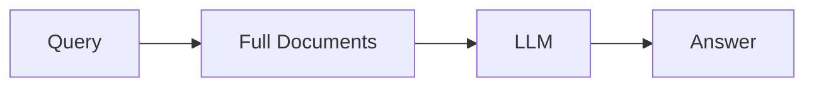
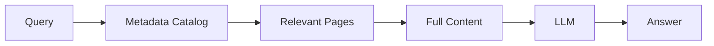
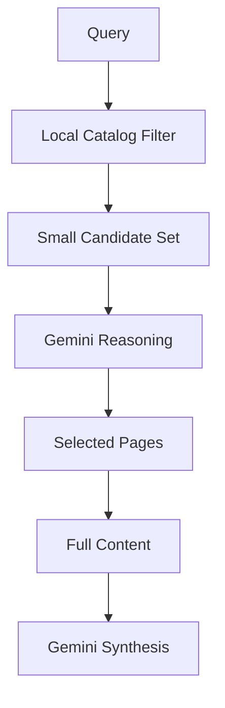

# Chapter 5 — Two-Pass Retrieval & LLM Librarian with Gemini

## 1. Chapter Goal

In Chapter 4, we created the `WikiVault`.

The vault gives us a structured knowledge repository containing:

* page IDs
* titles
* tags
* summaries
* full Markdown content
* timestamps

However, simply storing wiki pages is not enough.

We need a retrieval system that can answer:

> **Which pages should we actually read for this query?**

This chapter introduces the **Two-Pass Retrieval architecture** and the **LLM Librarian**.

We will build:

```text
src/wiki/TwoPassRetriever.js
src/wiki/LLMLibrarian.js
```

The architecture follows a librarian-style workflow.

Instead of immediately reading every document, the system first examines the lightweight catalog.

### Pass 1 — Catalog Search

Gemini receives:

```text
Title
Tags
Summary
```

and determines which Wiki pages are relevant.

### Pass 2 — Deep Content Retrieval

Only the selected Wiki pages have their complete `content` retrieved.

### Final Synthesis

The selected articles are passed to Gemini again, which generates the final answer.

The overall architecture becomes:



---

# 2. Why Two-Pass Retrieval?

A naive RAG system can follow:

```text
User Query
    ↓
Load all documents
    ↓
Chunk documents
    ↓
Search
    ↓
LLM
```

This can become expensive as the knowledge base grows.

Suppose the Wiki contains:

```text
1,000 pages
```

and each page contains:

```text
5,000 tokens
```

Loading everything would create an enormous context.

Instead, the Wiki catalog may contain only:

```text
ID
Title
Tags
Summary
```

That metadata is much smaller.

The system can therefore perform:

```text
1,000 lightweight headers
        ↓
Gemini identifies 3 relevant pages
        ↓
Read 3 full pages
        ↓
Generate answer
```

This is the central idea behind two-pass retrieval.

---

# 3. The Human Librarian Analogy

Imagine asking a librarian:

> "Explain how PagedAttention manages KV-cache memory."

The librarian would not normally read every book in the library.

Instead:

```text
Question
   ↓
Search catalog
   ↓
Identify relevant books
   ↓
Open relevant books
   ↓
Read relevant sections
   ↓
Answer question
```

Our LLM Librarian follows the same conceptual process:



---

# 4. Project Structure

After this chapter:

```text
adv-vectorless-rag/
└── src/
    ├── search/
    │   └── geminiClient.js
    │
    └── wiki/
        ├── WikiVault.js
        ├── TwoPassRetriever.js
        └── LLMLibrarian.js
```

The responsibilities are deliberately separated:

```text
WikiVault
    ↓
Stores Wiki pages

TwoPassRetriever
    ↓
Finds relevant Wiki pages

LLMLibrarian
    ↓
Uses retrieved pages to answer questions
```

---

# 5. Implementing `TwoPassRetriever`

## File Path

```text
adv-vectorless-rag/src/wiki/TwoPassRetriever.js
```

The `TwoPassRetriever` is responsible for:

1. Reading page headers.
2. Asking Gemini which pages are relevant.
3. Validating Gemini's page IDs.
4. Falling back to local metadata ranking if necessary.
5. Reading the complete selected pages.
6. Returning retrieval metadata and sources.

---

# 6. Complete `TwoPassRetriever.js`

````javascript id="4mk72p"
import { callGemini } from "../search/geminiClient.js";

export class TwoPassRetriever {
  constructor(
    wikiVault,
    {
      maxResults = 3
    } = {}
  ) {
    if (
      !wikiVault ||
      typeof wikiVault.getAllPageHeaders !==
        "function" ||
      typeof wikiVault.getPage !==
        "function"
    ) {
      throw new Error(
        "A valid WikiVault instance is required."
      );
    }

    if (
      !Number.isInteger(maxResults) ||
      maxResults <= 0
    ) {
      throw new Error(
        "maxResults must be a positive integer."
      );
    }

    this.vault = wikiVault;
    this.maxResults = maxResults;
  }

  /**
   * Normalize a query into unique search terms.
   */
  static tokenize(query) {
    return [
      ...new Set(
        query
          .toLowerCase()
          .replace(
            /[^a-z0-9\s-]/g,
            " "
          )
          .split(/\s+/)
          .filter(
            (term) =>
              term.length > 2
          )
      )
    ];
  }

  /**
   * Calculate lightweight metadata relevance.
   *
   * This is only a fallback when Gemini
   * cannot select valid pages.
   */
  static calculateMetadataScore(
    query,
    header
  ) {
    const queryTerms =
      this.tokenize(query);

    const title =
      String(
        header.title || ""
      ).toLowerCase();

    const summary =
      String(
        header.summary || ""
      ).toLowerCase();

    const tags =
      Array.isArray(header.tags)
        ? header.tags
            .join(" ")
            .toLowerCase()
        : "";

    let score = 0;

    for (
      const term
      of queryTerms
    ) {
      if (
        title.includes(term)
      ) {
        score += 5;
      }

      if (
        summary.includes(term)
      ) {
        score += 2;
      }

      if (
        tags.includes(term)
      ) {
        score += 3;
      }
    }

    return score;
  }

  /**
   * Rank catalog headers locally.
   */
  static rankHeaders(
    query,
    headers
  ) {
    return headers
      .map((header) => ({
        header,
        score:
          this.calculateMetadataScore(
            query,
            header
          )
      }))
      .sort(
        (a, b) =>
          b.score - a.score
      );
  }

  /**
   * Ask Gemini to select relevant Wiki pages.
   */
  async selectWithGemini(
    query,
    headers
  ) {
    if (
      headers.length === 0
    ) {
      return [];
    }

    const headersText =
      headers
        .map(
          (header, index) =>
            [
              `Option ${index + 1}`,
              `ID: ${header.id}`,
              `Title: ${header.title}`,
              `Tags: ${
                header.tags.join(
                  ", "
                )
              }`,
              `Summary: ${
                header.summary
              }`
            ].join("\n")
        )
        .join("\n\n");

    const systemInstruction = `
You are an expert AI librarian.

You are selecting relevant documents from a Wiki catalog.

Evaluate the user's query against the available
page titles, tags, and summaries.

Select only pages that are genuinely useful for answering
the query.

Return ONLY valid JSON using this format:

{
  "selectedIds": ["page_id_1", "page_id_2"]
}

Rules:
- Only use IDs that appear in the catalog.
- Select at most ${this.maxResults} pages.
- Do not invent IDs.
- If no page is relevant, return an empty array.
`.trim();

    const prompt = `
User Query:

${query}

Wiki Catalog:

${headersText}
`.trim();

    const rawResponse =
      await callGemini({
        systemInstruction,
        prompt
      });

    if (!rawResponse) {
      return [];
    }

    try {
      const cleaned =
        rawResponse
          .replace(
            /^```json\s*/i,
            ""
          )
          .replace(
            /^```\s*/i,
            ""
          )
          .replace(
            /\s*```$/i,
            ""
          )
          .trim();

      const parsed =
        JSON.parse(
          cleaned
        );

      if (
        !Array.isArray(
          parsed.selectedIds
        )
      ) {
        return [];
      }

      /*
       * Validate Gemini output against
       * the actual catalog.
       */
      const validIds =
        new Set(
          headers.map(
            (header) =>
              header.id
          )
        );

      return [
        ...new Set(
          parsed.selectedIds
            .filter(
              (id) =>
                typeof id ===
                  "string" &&
                validIds.has(id)
            )
        )
      ].slice(
        0,
        this.maxResults
      );
    } catch (error) {
      console.warn(
        `[TwoPassRetriever] Invalid Gemini response: ${error.message}`
      );

      return [];
    }
  }

  /**
   * Perform two-pass retrieval.
   */
  async retrieveRelevantContext(
    query
  ) {
    if (
      typeof query !== "string" ||
      !query.trim()
    ) {
      throw new Error(
        "query must be a non-empty string."
      );
    }

    const normalizedQuery =
      query.trim();

    console.log(
      `\n📚 [Two-Pass Retrieval] Query: "${normalizedQuery}"`
    );

    /*
     * PASS 1
     *
     * Retrieve lightweight page headers.
     */
    const allHeaders =
      this.vault
        .getAllPageHeaders();

    console.log(
      `   ├─ Pass 1: Scanning ${allHeaders.length} Wiki header(s)...`
    );

    if (
      allHeaders.length === 0
    ) {
      return {
        query: normalizedQuery,
        catalogSize: 0,
        selectedPageIds: [],
        retrievedArticles: [],
        retrievalMethod:
          "none"
      };
    }

    /*
     * Try Gemini catalog reasoning first.
     */
    let selectedPageIds =
      await this.selectWithGemini(
        normalizedQuery,
        allHeaders
      );

    let retrievalMethod =
      "gemini";

    /*
     * Local fallback.
     */
    if (
      selectedPageIds.length === 0
    ) {
      const ranked =
        TwoPassRetriever.rankHeaders(
          normalizedQuery,
          allHeaders
        );

      selectedPageIds =
        ranked
          .filter(
            ({ score }) =>
              score > 0
          )
          .slice(
            0,
            this.maxResults
          )
          .map(
            ({ header }) =>
              header.id
          );

      retrievalMethod =
        "local";

      console.log(
        `   │  └─ Local fallback selected ` +
        `${selectedPageIds.length} page(s).`
      );
    } else {
      console.log(
        `   │  └─ Gemini selected ` +
        `${selectedPageIds.length} page(s): ` +
        `[${selectedPageIds.join(", ")}]`
      );
    }

    /*
     * PASS 2
     *
     * Read complete content only for
     * selected pages.
     */
    console.log(
      `   └─ Pass 2: Loading full content...`
    );

    const retrievedArticles =
      [];

    for (
      const pageId
      of selectedPageIds
    ) {
      const page =
        this.vault.getPage(
          pageId
        );

      if (!page) {
        continue;
      }

      retrievedArticles.push(
        page
      );

      console.log(
        `      - Loaded: "${page.title}" ` +
        `(${page.content.length} characters)`
      );
    }

    return {
      query: normalizedQuery,

      catalogSize:
        allHeaders.length,

      selectedPageIds,

      retrievedArticles,

      retrievalMethod
    };
  }
}
````

---

# 7. Understanding Pass 1

The first important operation is:

```javascript id="q8b6pa"
const allHeaders =
  this.vault
    .getAllPageHeaders();
```

Chapter 4 deliberately created `getAllPageHeaders()` so that the retriever does not need to operate on full article bodies.

The returned data contains:

```text id="s0q0hp"
ID
Title
Tags
Summary
```

not the full:

```text id="z0p8cx"
Content
```

The conceptual flow is:



---

# 8. Why Pass 1 Is Lightweight

Imagine the Wiki contains:

```text
500 pages
```

The catalog might contain:

```text
500 titles
500 summaries
500 tag sets
```

but the full content could contain millions of characters.

The retriever therefore delays content retrieval until after branch/page selection.

This gives us:

```text
Catalog
   ↓
Cheap filtering/reasoning
   ↓
Small set of pages
   ↓
Expensive content retrieval
```

---

# 9. Gemini Catalog Selection

The Gemini prompt contains all available headers.

For example:

```text id="u6e4v0"
User Query:
How does PagedAttention manage KV cache?

Option 1
ID: vllm
Title: vLLM Architecture
Tags: llm, inference, serving
Summary: High-performance LLM serving.

Option 2
ID: pagedattention
Title: PagedAttention Mechanism
Tags: memory, os, kv-cache
Summary: Efficient KV-cache memory management.

Option 3
ID: networking
Title: Networking Fundamentals
Tags: networking, dns
Summary: Network communication basics.
```

Gemini might return:

```json id="9e9l3s"
{
  "selectedIds": [
    "pagedattention",
    "vllm"
  ]
}
```

The retriever then validates those IDs.

---

# 10. Why Gemini Output Must Be Validated

An LLM can hallucinate.

It might theoretically return:

```json id="dr9b4w"
{
  "selectedIds": [
    "pagedattention",
    "imaginary-page"
  ]
}
```

But:

```text
imaginary-page
```

does not exist in the vault.

Therefore we construct:

```javascript id="v4prx7"
const validIds =
  new Set(
    headers.map(
      (header) =>
        header.id
    )
  );
```

and filter Gemini's result:

```javascript id="y2h1p4"
parsed.selectedIds
  .filter(
    (id) =>
      typeof id ===
        "string" &&
      validIds.has(id)
  )
```

This creates an important trust boundary:

```text
Gemini
   ↓
Candidate IDs
   ↓
Validate against Vault
   ↓
Trusted IDs
```

---

# 11. Limiting the Number of Pages

The constructor accepts:

```javascript id="v7my9k"
{
  maxResults: 3
}
```

This prevents the LLM from selecting an unnecessarily large number of pages.

For example:

```text
Wiki:
10,000 pages

Gemini:
"Select everything."

Retriever:
Only accept first 3 valid IDs.
```

This is a basic but important cost-control mechanism.

Production systems could make this limit dynamic based on:

* query complexity
* token budget
* model context window
* confidence
* article length

---

# 12. Local Fallback

Gemini should not be the only retrieval mechanism.

If:

```text
GEMINI_API_KEY
```

is missing, or the API fails, the system uses:

```javascript id="d2v1fs"
TwoPassRetriever.rankHeaders()
```

The local score considers:

```text
Title
Summary
Tags
```

For example:

```text id="n1x6s2"
Query:
vllm pagedattention

vLLM Architecture
→ title match
→ tag match
→ high score

PagedAttention Mechanism
→ title match
→ tag match
→ high score

Networking
→ no match
→ score 0
```

The highest-scoring pages are selected.

This gives the system:

```text
Gemini intelligence
       +
Deterministic fallback
       ↓
Reliable retrieval
```

---

# 13. Pass 2 — Full Article Retrieval

After Pass 1, suppose Gemini selected:

```text id="1n7r3p"
vllm
pagedattention
```

Now the retriever performs:

```javascript id="6f9g2r"
const page =
  this.vault.getPage(
    pageId
  );
```

This retrieves the full `WikiFileEntry`.

Now we have:

```text id="v0o4p6"
Title
Tags
Summary
Content
```

The complete content is finally available.

---

# 14. Important Distinction About "Loading"

There is an architectural subtlety here.

Our current Chapter 4 `WikiVault` stores content directly in memory.

Therefore:

```javascript
vault.getAllPageHeaders()
```

does not physically load files from disk.

The phrase:

> "Pass 1 does not load content"

should therefore be understood as:

> **Pass 1 does not include or pass full page content into the retrieval/synthesis payload.**

Later, when the vault becomes filesystem-backed, Pass 2 can also become true lazy file reading.

For example:



This distinction keeps the documentation technically accurate.

---

# 15. Implementing `LLMLibrarian`

## File Path

```text
adv-vectorless-rag/src/wiki/LLMLibrarian.js
```

The `LLMLibrarian` sits above the retriever.

Its responsibility is:

```text
Question
   ↓
TwoPassRetriever
   ↓
Relevant Wiki Articles
   ↓
Gemini
   ↓
Final Answer
```

The librarian does not need to know how the vault searches internally.

It only needs:

```javascript id="67m3y9"
retriever.retrieveRelevantContext()
```

---

# 16. Complete `LLMLibrarian.js`

```javascript id="m6k2q8"
import { TwoPassRetriever } from "./TwoPassRetriever.js";
import { callGemini } from "../search/geminiClient.js";

export class LLMLibrarian {
  constructor(
    wikiVault,
    options = {}
  ) {
    if (!wikiVault) {
      throw new Error(
        "wikiVault is required."
      );
    }

    this.vault =
      wikiVault;

    this.retriever =
      new TwoPassRetriever(
        wikiVault,
        options
      );
  }

  /**
   * Build the context sent to Gemini.
   */
  buildContext(
    articles
  ) {
    return articles
      .map(
        (article, index) =>
          [
            `=== Source ${index + 1} ===`,
            `Page ID: ${article.id}`,
            `Title: ${article.title}`,
            `Tags: ${article.tags.join(", ")}`,
            `Summary: ${article.summary}`,
            "",
            article.content
          ].join("\n")
      )
      .join("\n\n");
  }

  /**
   * Ask Gemini to synthesize an answer
   * from the retrieved Wiki articles.
   */
  async synthesizeAnswer(
    query,
    articles
  ) {
    const context =
      this.buildContext(
        articles
      );

    const systemInstruction = `
You are an expert LLM Librarian.

Answer the user's question using ONLY the
provided Wiki Vault sources.

Requirements:
- Do not invent facts that are not supported
  by the supplied sources.
- Prefer precise explanations.
- If the sources do not contain enough information,
  clearly say so.
- Mention relevant source titles when useful.
`.trim();

    const prompt = `
WIKI VAULT SOURCES

${context}

USER QUERY

${query}
`.trim();

    return callGemini({
      systemInstruction,
      prompt
    });
  }

  /**
   * Complete librarian workflow.
   */
  async answerQuery(
    query
  ) {
    if (
      typeof query !== "string" ||
      !query.trim()
    ) {
      throw new Error(
        "query must be a non-empty string."
      );
    }

    const normalizedQuery =
      query.trim();

    console.log(
      `\n===============================================================`
    );

    console.log(
      `📖 [LLM Librarian] Query: "${normalizedQuery}"`
    );

    console.log(
      `===============================================================`
    );

    /*
     * Phase 1 + Phase 2:
     * Retrieve relevant Wiki content.
     */
    const retrievalResult =
      await this.retriever
        .retrieveRelevantContext(
          normalizedQuery
        );

    /*
     * No matching articles.
     */
    if (
      retrievalResult
        .retrievedArticles
        .length === 0
    ) {
      return {
        query:
          normalizedQuery,

        answer:
          `I could not find any relevant Wiki articles for "${normalizedQuery}".`,

        sources: [],

        retrievalMethod:
          retrievalResult
            .retrievalMethod,

        catalogSize:
          retrievalResult
            .catalogSize
      };
    }

    /*
     * Phase 3:
     * Gemini synthesis.
     */
    const geminiAnswer =
      await this.synthesizeAnswer(
        normalizedQuery,
        retrievalResult
          .retrievedArticles
      );

    /*
     * Local fallback if Gemini synthesis
     * is unavailable.
     */
    const fallbackAnswer =
      this.buildFallbackAnswer(
        normalizedQuery,
        retrievalResult
          .retrievedArticles
      );

    const finalAnswer =
      geminiAnswer ||
      fallbackAnswer;

    const sources =
      retrievalResult
        .retrievedArticles
        .map(
          (article) => ({
            id:
              article.id,

            title:
              article.title
          })
        );

    console.log(
      `\n📚 Sources Used:`
    );

    for (
      const source
      of sources
    ) {
      console.log(
        `   - ${source.title} [${source.id}]`
      );
    }

    return {
      query:
        normalizedQuery,

      answer:
        finalAnswer,

      sources,

      retrievalMethod:
        retrievalResult
          .retrievalMethod,

      catalogSize:
        retrievalResult
          .catalogSize
    };
  }

  /**
   * Deterministic fallback answer.
   *
   * This is intentionally simple.
   * It is not a replacement for LLM synthesis.
   */
  buildFallbackAnswer(
    query,
    articles
  ) {
    const sourceNames =
      articles
        .map(
          (article) =>
            article.title
        )
        .join(", ");

    const contentPreview =
      articles
        .map(
          (article) =>
            article.content
        )
        .join("\n\n")
        .slice(
          0,
          1200
        );

    return [
      `[Local Synthesis]`,
      `Relevant Wiki sources: ${sourceNames}.`,
      "",
      `Retrieved content:`,
      contentPreview
    ].join("\n");
  }
}
```

---

# 17. Understanding the Librarian

The librarian has three conceptual phases:

```text
Phase 1
Catalog Selection

Phase 2
Full Content Retrieval

Phase 3
Answer Synthesis
```

The architecture is:



---

# 18. Building the Gemini Context

The librarian creates:

```javascript id="a7u4b0"
const context =
  this.buildContext(
    articles
  );
```

The generated context looks approximately like:

```text id="e0o1tu"
=== Source 1 ===
Page ID: pagedattention
Title: PagedAttention Mechanism
Tags: memory, os, kv-cache
Summary: Efficient KV-cache memory management.

# PagedAttention

PagedAttention divides the KV cache into blocks...
```

This format gives Gemini source boundaries.

That makes source attribution easier.

---

# 19. Why Source Boundaries Matter

Suppose we retrieve:

```text
Source 1
vLLM Architecture

Source 2
PagedAttention Mechanism
```

Gemini can reason about each source independently.

The response can then mention:

```text
PagedAttention Mechanism explains...
vLLM Architecture provides the broader context...
```

The librarian therefore returns:

```javascript id="sm0p8b"
sources: [
  {
    id: "pagedattention",
    title: "PagedAttention Mechanism"
  }
]
```

This is better than returning only:

```javascript id="0e2tqg"
sources: [
  "PagedAttention Mechanism"
]
```

because IDs allow future systems to generate stable citations or hyperlinks.

---

# 20. Preventing Unsupported Answers

The Gemini system instruction explicitly says:

```text id="v1p3kw"
Answer using ONLY the provided Wiki Vault sources.
```

This creates a basic grounding boundary.

The system also tells Gemini:

```text id="1q9l7x"
If the sources do not contain enough information,
clearly say so.
```

This is important.

A retrieval system should not pretend that it found information when the Wiki does not contain it.

---

# 21. Local Synthesis Fallback

If final Gemini synthesis fails:

```javascript id="i4e5m2"
const finalAnswer =
  geminiAnswer ||
  fallbackAnswer;
```

The fallback returns retrieved content.

For example:

```text id="m8k0x2"
[Local Synthesis]

Relevant Wiki sources:
vLLM Architecture, PagedAttention Mechanism.

Retrieved content:
PagedAttention divides the KV cache...
```

This is intentionally simple.

It should **not** be described as equivalent to Gemini reasoning.

It is a graceful degradation strategy.

---

# 22. End-to-End Example

Create a small Wiki:

```javascript id="w9m4p1"
import { WikiVault } from "./src/wiki/WikiVault.js";
import { LLMLibrarian } from "./src/wiki/LLMLibrarian.js";

const vault =
  new WikiVault();

vault.addPage({
  id: "vllm",
  title: "vLLM Architecture",
  tags: [
    "llm",
    "inference",
    "serving"
  ],
  summary:
    "Architecture for high-performance LLM serving.",
  content: `
# vLLM Architecture

vLLM is designed for efficient
large language model serving.

It uses PagedAttention to improve
KV-cache memory management.
`
});

vault.addPage({
  id: "pagedattention",
  title:
    "PagedAttention Mechanism",
  tags: [
    "memory",
    "os",
    "kv-cache"
  ],
  summary:
    "Efficient management of KV-cache memory blocks.",
  content: `
# PagedAttention

PagedAttention manages the KV cache
using memory blocks inspired by virtual
memory techniques.

This reduces memory fragmentation
during LLM serving.
`
});

const librarian =
  new LLMLibrarian(
    vault
  );

const result =
  await librarian.answerQuery(
    "How does PagedAttention help manage KV cache memory?"
  );

console.log(
  "\nAnswer:\n",
  result.answer
);

console.log(
  "\nSources:",
  result.sources
);
```

---

# 23. End-to-End Execution Flow

The complete execution looks like:



This is the complete **Two-Pass LLM Wiki retrieval loop**.

---

# 24. Verification & Testing

A compact verification command can be used:

```bash id="z6x1r8"
node --input-type=module -e "
import { WikiVault } from './src/wiki/WikiVault.js';
import { LLMLibrarian } from './src/wiki/LLMLibrarian.js';

const vault = new WikiVault();

vault.addPage({
  id: 'page1',
  title: 'vLLM PagedAttention',
  tags: [
    'vllm',
    'memory',
    'inference'
  ],
  summary:
    'PagedAttention memory management in vLLM.',
  content:
    'PagedAttention manages KV-cache memory using memory blocks.'
});

const librarian =
  new LLMLibrarian(
    vault
  );

const result =
  await librarian.answerQuery(
    'How does vLLM PagedAttention manage memory?'
  );

console.log(
  '\\nSources Used:',
  result.sources
);
"
```

---

# 25. Expected Output

With Gemini unavailable, the output should still show something similar to:

```text
[WikiVault] Indexed Wiki Page:
"vLLM PagedAttention" [ID: page1]

📚 [Two-Pass Retrieval] Query:
"How does vLLM PagedAttention manage memory?"

   ├─ Pass 1: Scanning 1 Wiki header(s)...
   │  └─ Local fallback selected 1 page(s).

   └─ Pass 2: Loading full content...
      - Loaded: "vLLM PagedAttention"

📚 Sources Used:
   - vLLM PagedAttention [page1]

Sources Used:
[
  {
    id: 'page1',
    title: 'vLLM PagedAttention'
  }
]
```

If Gemini is configured, Pass 1 and final synthesis can instead use Gemini.

The exact Gemini-generated answer and reasoning are intentionally not deterministic.

---

# 26. What the System Has Achieved

At this point, the project has three distinct retrieval layers.

## Layer 1 — Hierarchical Tree

From Chapters 1–3:

```text id="q1m5p7"
Document
   ↓
Tree
   ↓
Gemini Branch Selection
   ↓
Leaf
```

## Layer 2 — Wiki Catalog

From Chapter 4:

```text id="4n7x2m"
WikiVault
   ↓
Page Headers
   ↓
Tags / Summaries
   ↓
Full Pages
```

## Layer 3 — Two-Pass Librarian

This chapter adds:

```text id="6g8v2s"
Query
   ↓
Catalog Reasoning
   ↓
Selected Pages
   ↓
Full Content
   ↓
Gemini Synthesis
```

Together:



---

# 27. Why This Is Important for Vectorless RAG

The key idea is that retrieval does not depend exclusively on vector similarity.

The system can reason over:

```text
Hierarchy
+
Titles
+
Summaries
+
Keywords
+
Tags
+
Entities
+
Explicit Wiki relationships
+
LLM reasoning
```

This gives us a richer retrieval architecture.

The system can effectively ask:

> "Which part of my structured knowledge base should I inspect?"

rather than only:

> "Which chunk is mathematically closest to this embedding?"

This is the central experiment of the project.

---

# 28. Two-Pass Retrieval vs One-Pass Retrieval

### One-pass approach



### Two-pass approach



The second architecture gives us a natural place to perform:

* filtering
* ranking
* cost control
* metadata reasoning
* source selection

before expensive context synthesis.

---

# 29. Important Limitation

Two-pass retrieval does **not automatically guarantee lower token usage**.

Why?

Because if the catalog itself becomes enormous, sending every page header to Gemini can also become expensive.

For example:

```text
10 pages
→ easy

10,000 pages
→ large catalog

1,000,000 pages
→ impossible to send everything directly
```

A production system therefore needs another lightweight indexing layer before Gemini.

Possible approaches include:

```text
Hierarchical catalog
Keyword index
Tag index
Category filtering
Database indexes
BM25
Small local classifier
Cached summaries
```

The architecture can then become:



This is an important production optimization.

---

# 30. Production Considerations

## 1. Structured Gemini output

Where supported, use the Gemini API's structured-output capabilities rather than relying entirely on free-form JSON parsing.

This reduces malformed response handling.

---

## 2. Token budgets

Both stages consume model context:

```text
Pass 1
Query + catalog metadata

Pass 2
Query + full articles
```

Token budgets should therefore be monitored separately.

---

## 3. Page limits

`maxResults` provides a basic protection.

More advanced implementations can dynamically select:

```text
Top-K
Top-K by token budget
Top-K by confidence
```

---

## 4. Caching

Catalog selections can be cached.

For example:

```text
Query
   ↓
Normalized Query Hash
   ↓
Cached Page IDs
```

This can reduce repeated Gemini calls.

---

## 5. Source attribution

The current implementation returns:

```javascript id="4t7c2m"
{
  id,
  title
}
```

A production system could additionally return:

```text
section
heading
paragraph
character range
page number
URL
version
```

This enables proper citations.

---

## 6. Persistent Wiki storage

The current vault is still an in-memory abstraction.

A future implementation can connect it to:

```text
Markdown files
Git
Object storage
Database
Filesystem
```

without changing the high-level librarian architecture.

---

# 31. Chapter 5 Architecture Summary

The complete flow is:

```text id="w8p5s4"
                    USER QUERY
                         │
                         ▼
              ┌─────────────────────┐
              │   Pass 1            │
              │ Catalog Retrieval    │
              └──────────┬──────────┘
                         │
                         ▼
                Wiki Page Headers
                ┌────────────────┐
                │ Title          │
                │ Tags           │
                │ Summary        │
                └───────┬────────┘
                        │
                 Gemini Reasoning
                        │
                        ▼
                Selected Page IDs
                        │
                        ▼
              ┌─────────────────────┐
              │   Pass 2            │
              │ Full Content Fetch  │
              └──────────┬──────────┘
                         │
                         ▼
                  Wiki Articles
                         │
                         ▼
              ┌─────────────────────┐
              │  LLM Librarian      │
              │  Gemini Synthesis   │
              └──────────┬──────────┘
                         │
                         ▼
                Answer + Sources
```

---

# 32. Chapter Summary

We have now built the **Two-Pass LLM Wiki retrieval architecture**.

### `TwoPassRetriever`

Responsible for:

* catalog inspection
* Gemini page selection
* ID validation
* local fallback ranking
* full article retrieval

### `LLMLibrarian`

Responsible for:

* orchestrating retrieval
* constructing grounded context
* Gemini answer synthesis
* source attribution
* graceful local fallback

The resulting architecture is:

```text
Query
 ↓
Lightweight Catalog
 ↓
Gemini Page Selection
 ↓
Selected Wiki Pages
 ↓
Full Content
 ↓
Gemini Synthesis
 ↓
Answer + Sources
```

The major architectural principle is:

> **Do not give the LLM the entire knowledge base when the catalog can first identify what deserves deeper inspection.**

---

# 33. Chapter 5 → Chapter 6

At this stage, the project contains:

```text
Chapter 1
Hierarchical Tree

Chapter 2
Automatic Tree Builder

Chapter 3
Gemini Agentic Tree Search

Chapter 4
LLM Wiki + WikiVault

Chapter 5
Two-Pass Retriever + LLM Librarian
```

The next chapter can bring these components together with:

```text
Vectorless Tree Retrieval
        VS
Fixed-Chunking / Vector-style Baseline
        ↓
Benchmark Engine
        ↓
CLI
        ↓
SDK Exports
        ↓
End-to-End Verification
```

Chapter 6 therefore becomes the **integration and evaluation layer** of the project.

