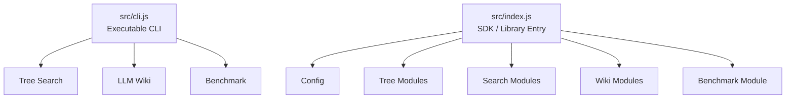
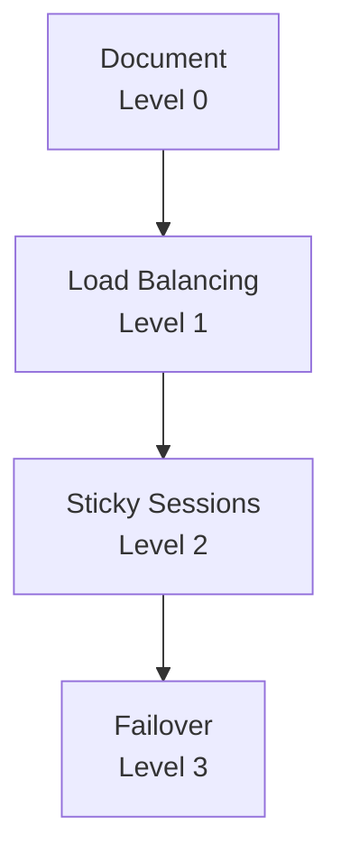
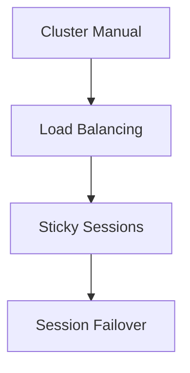
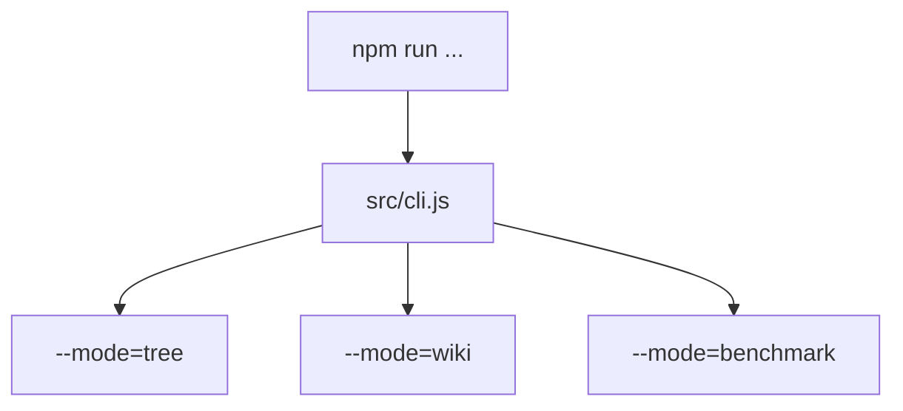
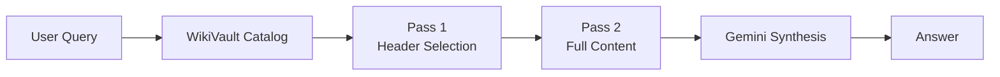
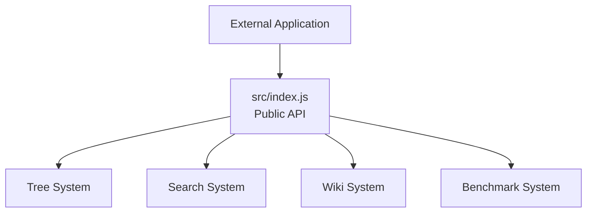
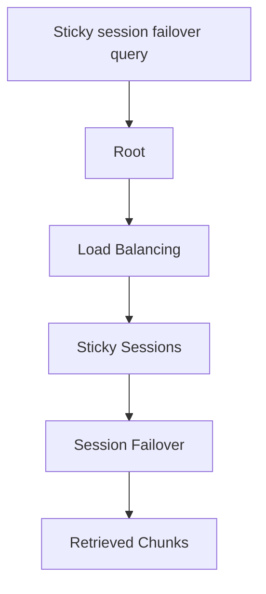
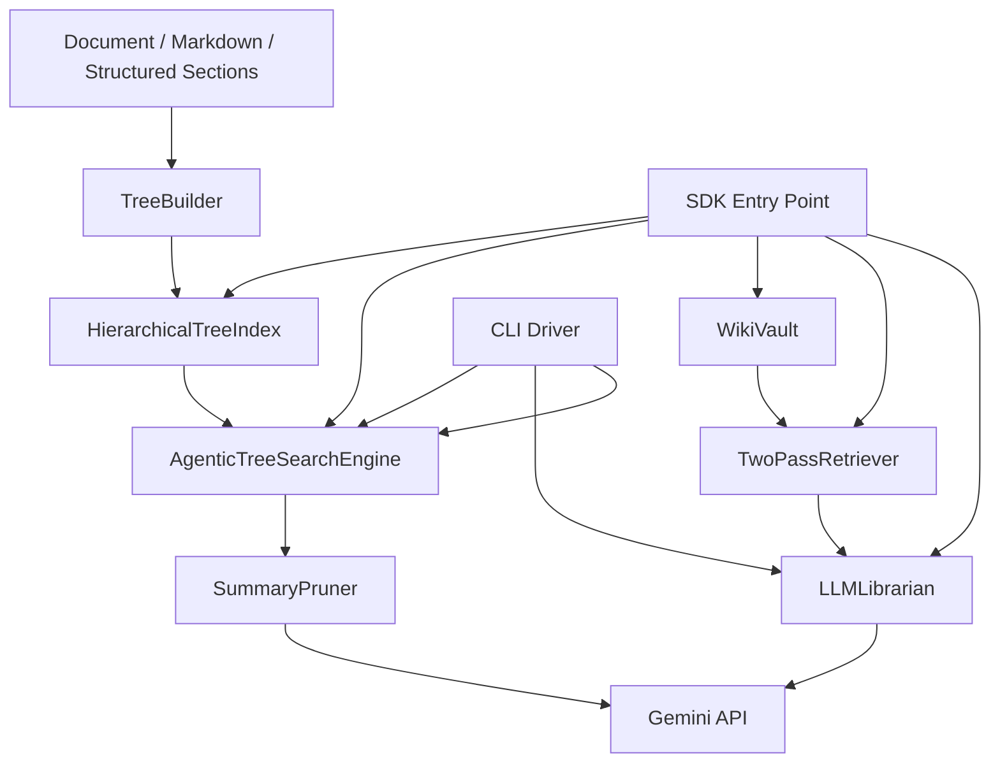
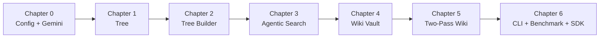
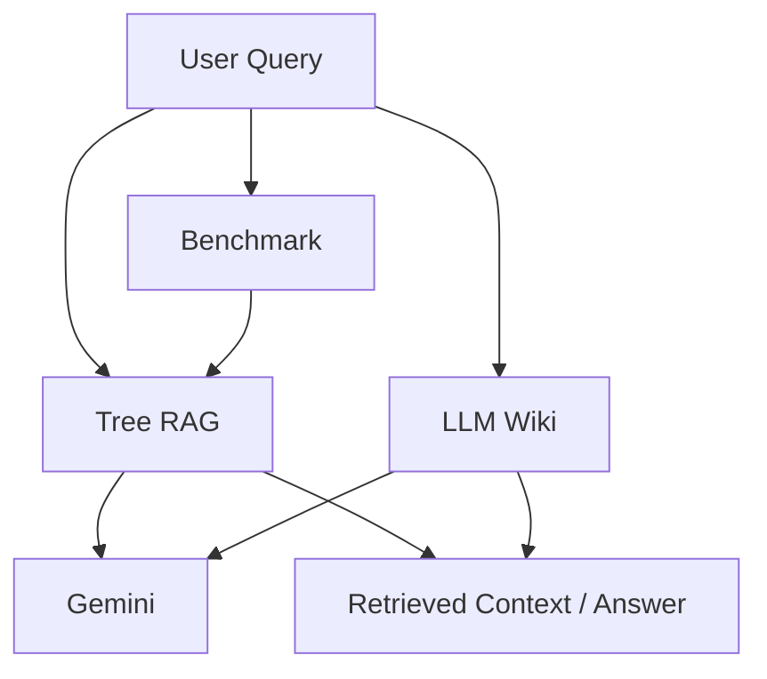

# Chapter 6 — Vector vs Vectorless Benchmark, CLI Driver & SDK Exports

## 1. Chapter Goal

In the previous chapters, we built the major components of our Advanced Vectorless RAG system:

* **Chapter 1:** Hierarchical tree data structures
* **Chapter 2:** Automatic document tree construction
* **Chapter 3:** Gemini-powered agentic tree search
* **Chapter 4:** LLM Wiki and WikiVault
* **Chapter 5:** Two-pass retrieval and Gemini librarian synthesis

Now we need to connect these components into a usable application.

The goal of this chapter is to build:

1. **`VectorVsVectorlessBenchmark`**

   * Compare a fixed-chunk baseline with our hierarchy-aware tree approach.
2. **`src/cli.js`**

   * Provide multiple executable modes for testing the system.
3. **`src/index.js`**

   * Expose the project as a reusable JavaScript SDK.
4. **End-to-end verification**

   * Confirm that the tree search, wiki retrieval, and benchmark workflows can all be executed from the command line.

---

## 🎯 Expected Architecture

After this chapter, the project will have two different entry surfaces:



The CLI is intended for **running demonstrations and experiments**.

The SDK entry point is intended for **importing the framework into another application**.

---

# 2. What Are We Actually Benchmarking?

Before writing the benchmark, we need to be technically precise.

A traditional vector RAG system normally performs something like:

```text
Document
   ↓
Chunking
   ↓
Embedding Model
   ↓
Vector Database
   ↓
Query Embedding
   ↓
Similarity Search
   ↓
Top-K Chunks
```

Our Vectorless Tree approach is structurally different:

```text
Document
   ↓
Hierarchical Tree
   ↓
Node Metadata
   ↓
Gemini Branch Reasoning
   ↓
Relevant Branch
   ↓
Leaf Section
   ↓
Original Chunks
```

For this chapter, we will implement a **structural baseline comparison**.

We will **not** pretend that a fixed string chunker is a complete production Vector RAG implementation.

### Important distinction

This:

```javascript
text.substring(...)
```

does **not** create embeddings.

Therefore, it would be incorrect to call it a complete "Vector RAG implementation."

Instead, we will call it:

> **Fixed-Chunking Baseline**

and compare it with:

> **Hierarchy-Aware Vectorless Tree Retrieval**

A real vector benchmark can be added later using an embedding model and a vector database.

---

# 3. Implementing `VectorVsVectorlessBenchmark`

## File Path

```text
adv-vectorless-rag/
└── src/
    └── comparison/
        └── VectorVsVectorlessBenchmark.js
```

## Why Do We Need This Class?

The benchmark provides a simple way to inspect how the two retrieval paradigms represent information.

Instead of making unsupported claims such as:

> "Vectorless RAG is 95% accurate."

we should expose measurable structural information such as:

* number of fixed chunks
* number of tree nodes
* number of leaf nodes
* tree depth
* selected tree path
* number of retrieved chunks

These values can be reproduced locally.

---

# 4. Benchmark Implementation

```javascript
import { TreeBuilder } from "../tree/TreeBuilder.js";
import { AgenticTreeSearchEngine } from "../search/AgenticTreeSearchEngine.js";

export class VectorVsVectorlessBenchmark {
  static simulateFixedChunking(
    rawText,
    chunkSize = 500
  ) {
    if (
      typeof rawText !== "string" ||
      !rawText.trim()
    ) {
      throw new Error(
        "rawText must be a non-empty string."
      );
    }

    if (
      !Number.isInteger(chunkSize) ||
      chunkSize <= 0
    ) {
      throw new Error(
        "chunkSize must be a positive integer."
      );
    }

    const chunks = [];

    for (
      let start = 0;
      start < rawText.length;
      start += chunkSize
    ) {
      chunks.push(
        rawText.slice(
          start,
          start + chunkSize
        )
      );
    }

    return chunks;
  }

  static calculateTreeDepth(node) {
    if (!node || node.isLeaf()) {
      return node ? node.level : 0;
    }

    return Math.max(
      ...node.children.map(
        (child) =>
          this.calculateTreeDepth(child)
      )
    );
  }

  static countTreeNodes(node) {
    if (!node) {
      return 0;
    }

    return (
      1 +
      node.children.reduce(
        (total, child) =>
          total +
          this.countTreeNodes(child),
        0
      )
    );
  }

  static countLeafNodes(node) {
    if (!node) {
      return 0;
    }

    if (node.isLeaf()) {
      return 1;
    }

    return node.children.reduce(
      (total, child) =>
        total +
        this.countLeafNodes(child),
      0
    );
  }

  static async runComparison({
    query,
    rawText,
    sections
  }) {
    if (
      typeof query !== "string" ||
      !query.trim()
    ) {
      throw new Error(
        "query must be a non-empty string."
      );
    }

    if (!Array.isArray(sections)) {
      throw new TypeError(
        "sections must be an array."
      );
    }

    console.log(
      "================================================================="
    );

    console.log(
      "⚖️  VECTOR VS VECTORLESS STRUCTURAL BENCHMARK"
    );

    console.log(
      `Query: "${query}"`
    );

    console.log(
      "=================================================================\n"
    );

    // --------------------------------------------------
    // Baseline: Fixed-size chunking
    // --------------------------------------------------

    const fixedChunks =
      this.simulateFixedChunking(
        rawText
      );

    const fixedChunkMetrics = {
      paradigm:
        "Fixed-Chunking Baseline",

      retrievalType:
        "Flat chunk representation",

      chunkCount:
        fixedChunks.length,

      chunkSize:
        500,

      preservesHierarchy:
        false,

      requiresEmbeddings:
        false
    };

    console.log(
      "📦 Fixed-Chunking Baseline:"
    );

    console.table(
      fixedChunkMetrics
    );

    // --------------------------------------------------
    // Vectorless Tree
    // --------------------------------------------------

    const treeIndex =
      TreeBuilder.buildFromStructuredSections(
        "Benchmark Document",
        sections
      );

    const searchEngine =
      new AgenticTreeSearchEngine(
        treeIndex
      );

    const treeResult =
      await searchEngine.search(
        query
      );

    const vectorlessMetrics = {
      paradigm:
        "Vectorless Hierarchical Tree",

      retrievalType:
        "Top-down hierarchical reasoning",

      nodeCount:
        this.countTreeNodes(
          treeIndex.root
        ),

      leafCount:
        this.countLeafNodes(
          treeIndex.root
        ),

      treeDepth:
        this.calculateTreeDepth(
          treeIndex.root
        ),

      matchedLeaves:
        treeResult.matchedLeavesCount,

      retrievedChunks:
        treeResult.retrievedChunks.length,

      preservesHierarchy:
        true,

      requiresEmbeddings:
        false
    };

    console.log(
      "\n🌳 Vectorless Tree:"
    );

    console.table(
      vectorlessMetrics
    );

    console.log(
      "\n🧭 Tree Traversal:"
    );

    console.log(
      treeResult.trajectoryLogs
    );

    return {
      query,

      fixedChunking: {
        metrics:
          fixedChunkMetrics,

        chunks:
          fixedChunks
      },

      vectorlessTree: {
        metrics:
          vectorlessMetrics,

        traversal:
          treeResult,

        treeIndex
      }
    };
  }
}
```

---

# 5. Understanding the Benchmark Code

The benchmark has several logical blocks.

## Block 1 — Fixed-Chunking Baseline

```javascript
static simulateFixedChunking(
  rawText,
  chunkSize = 500
)
```

This method divides the document into fixed-size character chunks.

For example:

```text
Document

┌──────────────────────┐
│ characters 0 - 499   │
├──────────────────────┤
│ characters 500 - 999 │
├──────────────────────┤
│ characters 1000-1499 │
└──────────────────────┘
```

Notice that these are **characters**, not tokens.

Therefore:

```javascript
chunkSize = 500
```

means approximately 500 characters.

It does **not** mean 500 LLM tokens.

---

## Block 2 — Tree Depth

```javascript
static calculateTreeDepth(node)
```

This recursively walks through the tree and finds the deepest node.

For example:



The deepest level tells us how many hierarchical decisions may be required to reach a leaf.

---

# 6. Counting Tree Nodes

```javascript
static countTreeNodes(node)
```

This method recursively counts every node.

For example:

```text
Document
├── Networking
├── Load Balancing
│   ├── Sticky Sessions
│   └── Failover
└── Database
```

The total node count is:

```text
1 root
+ 3 top-level nodes
+ 2 child nodes
= 6 nodes
```

This metric helps us understand the size of the structural index.

---

# 7. Counting Leaf Nodes

```javascript
static countLeafNodes(node)
```

A leaf is a node with no children.

In our architecture, leaves are particularly important because they represent the most specific retrievable sections.

For example:



Here:

* `Cluster Manual` → internal node
* `Load Balancing` → internal node
* `Sticky Sessions` → internal node
* `Session Failover` → leaf

---

# 8. Running the Tree Search

The benchmark then creates the actual tree:

```javascript
const treeIndex =
  TreeBuilder.buildFromStructuredSections(
    "Benchmark Document",
    sections
  );
```

This reuses the builder from Chapter 2.

Then:

```javascript
const searchEngine =
  new AgenticTreeSearchEngine(
    treeIndex
  );
```

creates the Gemini-powered search engine from Chapter 3.

Finally:

```javascript
const treeResult =
  await searchEngine.search(
    query
  );
```

runs the actual retrieval process.

This is important because the benchmark is now connected to the real Vectorless RAG implementation rather than a fictional performance number.

---

# 9. Why We Don't Hard-Code Accuracy

The original benchmark contained values such as:

```text
Vector RAG       → 68%
Vectorless RAG   → 95%
```

Those values would only be meaningful if we actually evaluated both systems against a labeled dataset.

For example, a real benchmark would require:

```text
100 test questions
       ↓
Known correct answers
       ↓
Run Vector RAG
       ↓
Run Vectorless RAG
       ↓
Calculate Recall / Precision / Hit Rate
```

Without that experiment, claiming an exact accuracy percentage would be misleading.

Therefore, this chapter measures **architecture and retrieval behavior**, not scientific accuracy.

---

# 10. Implementing the Multi-Mode CLI

## File Path

```text
adv-vectorless-rag/src/cli.js
```

The CLI gives us one command for running different parts of the project.

The architecture is:



---

# 11. CLI Implementation

```javascript
import { TreeBuilder } from "./tree/TreeBuilder.js";
import { AgenticTreeSearchEngine } from "./search/AgenticTreeSearchEngine.js";
import { WikiVault } from "./wiki/WikiVault.js";
import { LLMLibrarian } from "./wiki/LLMLibrarian.js";
import { VectorVsVectorlessBenchmark } from "./comparison/VectorVsVectorlessBenchmark.js";

function parseArgs() {
  const args = {};

  for (
    const argument
    of process.argv.slice(2)
  ) {
    if (!argument.startsWith("--")) {
      continue;
    }

    const value =
      argument.slice(2);

    const separatorIndex =
      value.indexOf("=");

    if (
      separatorIndex === -1
    ) {
      args[value] = true;
      continue;
    }

    const key =
      value.slice(
        0,
        separatorIndex
      );

    const parsedValue =
      value.slice(
        separatorIndex + 1
      );

    args[key] =
      parsedValue || true;
  }

  return args;
}

function printHeader(mode) {
  console.log(
    "================================================================="
  );

  console.log(
    `🚀 ADVANCED VECTORLESS RAG & LLM WIKI ENGINE`
  );

  console.log(
    `Mode: ${mode.toUpperCase()}`
  );

  console.log(
    "=================================================================\n"
  );
}

async function runTreeMode(query) {
  const sections = [
    {
      title: "System Architecture",
      level: 1,
      pageStart: 1,
      pageEnd: 3,
      content:
        "Distributed cluster architecture overview.",
      summary:
        "Distributed cluster architecture and infrastructure."
    },

    {
      title: "Load Balancing",
      level: 1,
      pageStart: 4,
      pageEnd: 8,
      content:
        "Load balancer strategies including round-robin, sticky sessions, session persistence, and backend failover.",
      summary:
        "Application load balancing including sticky sessions, session persistence, and backend failover.",
      keywords: [
        "load balancing",
        "sticky sessions",
        "session",
        "failover"
      ]
    },

    {
      title: "Sticky Sessions",
      level: 2,
      pageStart: 9,
      pageEnd: 10,
      content:
        "Sticky sessions keep a client associated with a backend target using session persistence.",
      summary:
        "Sticky sessions maintain client affinity with a backend target.",
      keywords: [
        "sticky",
        "sessions",
        "session persistence"
      ]
    },

    {
      title: "Session Failover",
      level: 3,
      pageStart: 11,
      pageEnd: 12,
      content:
        "When the original backend target fails, the load balancer can route the request to another healthy target while the application recovers session state.",
      summary:
        "Sticky session failover redirects traffic to a healthy backend when the original target fails.",
      keywords: [
        "sticky",
        "session",
        "failover",
        "backend"
      ]
    },

    {
      title: "Database Sharding",
      level: 1,
      pageStart: 13,
      pageEnd: 20,
      content:
        "Horizontal database partitioning.",
      summary:
        "Horizontal database partitioning and distributed data storage."
    }
  ];

  const treeIndex =
    TreeBuilder.buildFromStructuredSections(
      "Cluster Manual",
      sections
    );

  const searchEngine =
    new AgenticTreeSearchEngine(
      treeIndex
    );

  const result =
    await searchEngine.search(
      query
    );

  console.log(
    "\n✨ Tree Search Outcome:"
  );

  console.log(
    `Matched Leaves: ${result.matchedLeavesCount}`
  );

  console.log(
    `Retrieved Chunks: ${result.retrievedChunks.length}`
  );

  console.log(
    JSON.stringify(
      result.retrievedChunks,
      null,
      2
    )
  );
}

async function runWikiMode(query) {
  const vault =
    new WikiVault();

  vault.addPage({
    id: "vllm-arch",

    title:
      "vLLM Serving Architecture",

    tags: [
      "vllm",
      "inference",
      "memory"
    ],

    summary:
      "High performance LLM serving engine using PagedAttention.",

    content:
      "vLLM uses PagedAttention to manage KV cache memory efficiently and improve LLM serving throughput."
  });

  vault.addPage({
    id: "tree-rag",

    title:
      "Vectorless Tree RAG Model",

    tags: [
      "tree",
      "pageindex",
      "rag"
    ],

    summary:
      "Hierarchical tree index navigation without embedding vectors.",

    content:
      "Vectorless RAG navigates document heading trees using hierarchical reasoning."
  });

  const librarian =
    new LLMLibrarian(
      vault
    );

  const result =
    await librarian.answerQuery(
      query
    );

  console.log(
    "\n✨ LLM Wiki Answer:"
  );

  console.log(
    result.answer
  );

  console.log(
    "\n📚 Sources:"
  );

  console.log(
    result.sources
  );
}

async function runBenchmarkMode(query) {
  const rawText = `
Load balancing distributes application traffic
across multiple backend targets.

Sticky sessions maintain client affinity with a
specific backend target.

When the backend target fails, session failover
allows traffic to move to another healthy target.

Database sharding distributes database records
across multiple database nodes.
`;

  const sections = [
    {
      title: "Load Balancing",
      level: 1,
      pageStart: 1,
      pageEnd: 3,
      content:
        "Load balancing distributes traffic across backend targets. Sticky sessions maintain client affinity and failover handles backend failures.",
      summary:
        "Load balancing, sticky sessions, session persistence, and backend failover.",
      keywords: [
        "load balancing",
        "sticky sessions",
        "failover"
      ]
    },

    {
      title: "Sticky Sessions",
      level: 2,
      pageStart: 4,
      pageEnd: 5,
      content:
        "Sticky sessions maintain client affinity with a backend target.",
      summary:
        "Session persistence and client affinity.",
      keywords: [
        "sticky",
        "sessions",
        "affinity"
      ]
    },

    {
      title: "Session Failover",
      level: 3,
      pageStart: 6,
      pageEnd: 7,
      content:
        "When a backend target fails, traffic can be redirected to another healthy target.",
      summary:
        "Failover handling for sticky sessions when a backend target becomes unavailable.",
      keywords: [
        "failover",
        "sticky",
        "session",
        "backend"
      ]
    }
  ];

  return VectorVsVectorlessBenchmark.runComparison({
    query,
    rawText,
    sections
  });
}

async function main() {
  const args =
    parseArgs();

  const mode =
    args.mode || "tree";

  const query =
    args.query ||
    (
      mode === "wiki"
        ? "vllm pagedattention"
        : "How do sticky sessions handle failover?"
    );

  const validModes = [
    "tree",
    "wiki",
    "benchmark"
  ];

  if (
    !validModes.includes(mode)
  ) {
    console.error(
      `❌ Unknown mode "${mode}".`
    );

    console.error(
      `Valid modes: ${validModes.join(", ")}`
    );

    process.exitCode = 1;
    return;
  }

  printHeader(mode);

  if (mode === "tree") {
    await runTreeMode(query);
    return;
  }

  if (mode === "wiki") {
    await runWikiMode(query);
    return;
  }

  if (mode === "benchmark") {
    await runBenchmarkMode(query);
  }
}

main().catch((error) => {
  console.error(
    "\n❌ CLI execution failed:"
  );

  console.error(
    error
  );

  process.exitCode = 1;
});
```

---

# 12. Understanding the CLI

The CLI is divided into four important parts.

## Part 1 — Argument Parser

```javascript
const args =
  parseArgs();
```

This allows commands such as:

```bash
node src/cli.js --mode=tree
```

or:

```bash
node src/cli.js --mode=tree --query="sticky session failover"
```

The parser converts them into:

```javascript
{
  mode: "tree",
  query: "sticky session failover"
}
```

---

# 13. Part 2 — Tree Mode

Tree mode demonstrates:

```text
Document
   ↓
TreeBuilder
   ↓
HierarchicalTreeIndex
   ↓
AgenticTreeSearchEngine
   ↓
Gemini Branch Reasoning
   ↓
Leaf
   ↓
Chunks
```

The important part of the sample data is that the parent metadata contains concepts needed by the query.

For example:

```javascript
summary:
  "Application load balancing including sticky sessions, session persistence, and backend failover."
```

This matters because the agent must first decide:

```text
Root
 ↓
Load Balancing
 ↓
Sticky Sessions
 ↓
Session Failover
```

If the `Load Balancing` summary only said:

```text
"Round-robin traffic distribution."
```

then a purely lexical fallback could fail to identify the correct branch.

This demonstrates an important property of hierarchical retrieval:

> **High-level nodes need routing-quality summaries.**

---

# 14. Part 3 — Wiki Mode

Wiki mode demonstrates the Chapter 4 and Chapter 5 pipeline:



The CLI creates a small WikiVault:

```javascript
const vault =
  new WikiVault();
```

Then adds pages:

```javascript
vault.addPage({
  id: "vllm-arch",
  ...
});
```

Finally:

```javascript
const librarian =
  new LLMLibrarian(vault);

const result =
  await librarian.answerQuery(
    query
  );
```

This connects the Wiki architecture to Gemini synthesis.

---

# 15. Part 4 — Benchmark Mode

Benchmark mode runs the structural comparison:

```javascript
await runBenchmarkMode(
  query
);
```

The result allows us to inspect:

### Fixed chunking

```text
How many fixed chunks were created?
```

### Vectorless tree

```text
How many nodes?
How many leaves?
How deep is the tree?
Which leaf was selected?
How many chunks were retrieved?
```

This gives us a useful experimental foundation.

---

# 16. Creating `src/index.js`

The CLI should not be our SDK entry point.

Instead, `src/index.js` should expose the reusable modules.

## File Path

```text
adv-vectorless-rag/src/index.js
```

## Code

```javascript
export { config } from "./config.js";

export {
  TreeNode
} from "./tree/TreeNode.js";

export {
  HierarchicalTreeIndex
} from "./tree/HierarchicalTreeIndex.js";

export {
  TreeBuilder
} from "./tree/TreeBuilder.js";

export {
  callGemini
} from "./search/geminiClient.js";

export {
  SummaryPruner
} from "./search/SummaryPruner.js";

export {
  AgenticTreeSearchEngine
} from "./search/AgenticTreeSearchEngine.js";

export {
  WikiFileEntry,
  WikiVault
} from "./wiki/WikiVault.js";

export {
  TwoPassRetriever
} from "./wiki/TwoPassRetriever.js";

export {
  LLMLibrarian
} from "./wiki/LLMLibrarian.js";

export {
  VectorVsVectorlessBenchmark
} from "./comparison/VectorVsVectorlessBenchmark.js";
```

---

# 17. Why Use `src/index.js`?

Without a barrel export, another application would need to know the internal directory structure:

```javascript
import { TreeBuilder }
  from "./src/tree/TreeBuilder.js";

import { WikiVault }
  from "./src/wiki/WikiVault.js";
```

With the SDK entry point:

```javascript
import {
  TreeBuilder,
  WikiVault,
  LLMLibrarian
} from "./src/index.js";
```

the consumer only needs to know the public API.

This gives us an abstraction boundary:



Internal files can change later without requiring consumers to understand the entire source tree.

---

# 18. Updating `package.json`

Because `src/cli.js` is now the executable CLI, the scripts should point directly to it.

A suitable configuration is:

```json
{
  "scripts": {
    "start": "node src/cli.js",
    "cli": "node src/cli.js",
    "tree-search": "node src/cli.js --mode=tree",
    "llm-wiki": "node src/cli.js --mode=wiki",
    "benchmark": "node src/cli.js --mode=benchmark"
  }
}
```

This gives us convenient commands.

---

# 19. Running Tree Search

```bash
npm run tree-search
```

Or with a custom query:

```bash
node src/cli.js \
  --mode=tree \
  --query="How do sticky sessions handle failover?"
```

Expected flow:



Gemini may select each branch based on the summaries and metadata.

If Gemini is unavailable, the local fallback from Chapter 3 can be used.

---

# 20. Running Wiki Mode

```bash
npm run llm-wiki
```

Or:

```bash
node src/cli.js \
  --mode=wiki \
  --query="vllm pagedattention"
```

Expected flow:

```text
Query
 ↓
WikiVault headers
 ↓
Gemini Pass 1
 ↓
Selected page
 ↓
Full article
 ↓
Gemini synthesis
 ↓
Answer + sources
```

---

# 21. Running Benchmark Mode

```bash
npm run benchmark
```

Or:

```bash
node src/cli.js \
  --mode=benchmark \
  --query="sticky session failover"
```

The benchmark will print structural metrics rather than fabricated performance claims.

For example:

```text
📦 Fixed-Chunking Baseline

┌───────────────────────┬─────────────────────────┐
│ paradigm              │ Fixed-Chunking Baseline │
│ retrievalType         │ Flat chunk representation│
│ chunkCount            │ ...                     │
│ preservesHierarchy    │ false                   │
│ requiresEmbeddings    │ false                   │
└───────────────────────┴─────────────────────────┘
```

and:

```text
🌳 Vectorless Tree

┌───────────────────────┬─────────────────────────┐
│ paradigm              │ Vectorless Hierarchical │
│ nodeCount             │ ...                     │
│ leafCount             │ ...                     │
│ treeDepth             │ ...                     │
│ matchedLeaves         │ 1                       │
│ retrievedChunks       │ 1                       │
│ preservesHierarchy    │ true                    │
│ requiresEmbeddings    │ false                   │
└───────────────────────┴─────────────────────────┘
```

Exact numbers depend on the supplied document.

---

# 22. Important Code Concepts

## `async/await`

The tree search is asynchronous because Gemini is an external API:

```javascript
const result =
  await searchEngine.search(
    query
  );
```

Similarly:

```javascript
const result =
  await librarian.answerQuery(
    query
  );
```

This is necessary because network requests do not complete instantly.

---

## `process.argv`

Node.js exposes command-line arguments through:

```javascript
process.argv
```

For:

```bash
node src/cli.js --mode=wiki
```

Node receives the command-line arguments and our `parseArgs()` function converts them into an easier object.

---

## `process.exitCode`

Instead of immediately terminating the process:

```javascript
process.exit(1);
```

we use:

```javascript
process.exitCode = 1;
```

This allows Node to finish its current execution naturally while still communicating failure to the shell.

---

# 23. End-to-End Architecture

At the end of Chapter 6, our system looks like this:



The system now contains two complementary retrieval architectures:

### Tree RAG

```text
Document
→ Hierarchical Tree
→ Gemini Branch Reasoning
→ Leaf
→ Chunks
```

### LLM Wiki

```text
Wiki Catalog
→ Gemini Header Selection
→ Full Article
→ Gemini Synthesis
→ Answer
```

---

# 24. Why This Is Useful for Vectorless RAG

The major idea behind the project is not simply:

> "Remove vectors."

The more useful idea is:

> **Use the document's inherent structure as part of the retrieval system.**

A normal chunking pipeline often starts by asking:

```text
How should I divide this document?
```

Our system starts by asking:

```text
What is the document's structure?
```

That allows us to preserve:

* chapters
* sections
* subsections
* page ranges
* summaries
* keywords
* entities
* parent-child relationships
* source chunks

This hierarchy can then be navigated rather than searching every chunk independently.

---

# 25. Fixed Chunking vs Hierarchical Retrieval

A conceptual comparison:

| Property                   | Fixed Chunking             | Hierarchical Tree             |
| -------------------------- | -------------------------- | ----------------------------- |
| Representation             | Flat chunks                | Tree nodes                    |
| Document hierarchy         | Usually lost               | Explicit                      |
| Parent-child relationships | Not inherent               | Native                        |
| Page ranges                | Optional metadata          | Node-level metadata           |
| Retrieval                  | Flat candidate search      | Branch navigation             |
| Embeddings                 | Required for vector search | Not required                  |
| LLM reasoning              | Optional                   | Central to agentic navigation |
| Explainability             | Depends on implementation  | Traversal path is explicit    |
| Exact scientific accuracy  | Requires benchmark         | Requires benchmark            |

The table intentionally avoids claiming that one method is universally better.

The correct engineering question is:

> **Which retrieval architecture works better for the specific document and query distribution?**

---

# 26. What We Have Built So Far

At this point, the project contains:

```text
Chapter 0
Configuration + Gemini Integration

Chapter 1
TreeNode + HierarchicalTreeIndex

Chapter 2
TreeBuilder + Keyword/Entity Extraction

Chapter 3
Gemini Summary Pruner
+ Agentic Tree Search

Chapter 4
WikiFileEntry + WikiVault

Chapter 5
Two-Pass Retriever
+ LLM Librarian

Chapter 6
Benchmark
+ CLI
+ SDK Exports
```

The overall architecture is therefore:



---

# 27. Production Considerations

The current implementation is intentionally educational and lightweight.

A production implementation should improve several areas.

## 1. Real Vector Baseline

To perform a genuine Vector RAG comparison, add:

```text
Chunker
 ↓
Embedding Model
 ↓
Vector Database
 ↓
Similarity Search
```

Then compare both systems using the same evaluation dataset.

---

## 2. Real Evaluation Dataset

Create queries with known expected sections:

```javascript
[
  {
    query:
      "How does sticky session failover work?",

    expectedNodeId:
      "l3-session-failover-4"
  }
]
```

Then calculate:

* Hit@1
* Recall@K
* Precision@K
* MRR
* latency
* token consumption

This turns the current structural benchmark into a real retrieval benchmark.

---

## 3. Gemini Response Validation

Never blindly trust an LLM-generated ID.

The search engine should verify:

```javascript
candidateNodes.some(
  node =>
    node.nodeId ===
    parsed.selectedNodeId
);
```

The Chapter 3 implementation already follows this principle.

---

## 4. Gemini Failure Handling

Production systems should handle:

* API timeout
* rate limits
* invalid JSON
* unavailable API key
* malformed responses
* transient network errors

A retry policy and structured error handling should eventually be added.

---

## 5. Large Wiki Vaults

The current `WikiVault` stores pages in memory:

```javascript
this.pages = new Map();
```

That is excellent for learning and testing, but a production vault may use:

```text
Filesystem
Object Storage
SQLite
PostgreSQL
Document Database
```

while retaining the same logical catalog interface.

---

## 6. Token Budget Management

Pass 2 should not blindly load unlimited articles.

A production implementation should eventually perform:

```text
Query
 ↓
Select top-K pages
 ↓
Estimate token budget
 ↓
Select relevant sections
 ↓
Build context
 ↓
Gemini synthesis
```

This becomes particularly important as the Wiki grows.

---

# 28. Final Verification Checklist

Run:

```bash
npm run tree-search
```

Then:

```bash
npm run llm-wiki
```

Then:

```bash
npm run benchmark
```

Also test custom queries:

```bash
node src/cli.js \
  --mode=tree \
  --query="sticky session failover"
```

```bash
node src/cli.js \
  --mode=wiki \
  --query="vllm pagedattention"
```

```bash
node src/cli.js \
  --mode=benchmark \
  --query="session failover"
```

Finally, verify that the SDK can be imported:

```bash
node -e "
import {
  TreeBuilder,
  WikiVault,
  LLMLibrarian,
  AgenticTreeSearchEngine
} from './src/index.js';

console.log('SDK exports loaded successfully.');
"
```

Expected:

```text
SDK exports loaded successfully.
```

---

# 29. Chapter Summary

In this chapter, we completed the application layer around our Vectorless RAG framework.

We built:

### `VectorVsVectorlessBenchmark`

Provides reproducible structural comparisons between fixed chunking and hierarchy-aware retrieval.

### `src/cli.js`

Provides three operational modes:

```text
tree
wiki
benchmark
```

### `src/index.js`

Provides a clean public SDK interface.

The complete workflow is now:



The most important lesson is that **Vectorless RAG is an architectural retrieval strategy, not merely a replacement for embeddings**.

Instead of representing the document only as independent chunks, we preserve the document's hierarchy and use that structure to guide retrieval.

That gives us a foundation for the next stage: making the system more capable, measurable, persistent, and production-ready.

## 🎉 End of Chapter 6

At this point, we have a complete educational prototype combining:

* hierarchical document indexing
* deterministic metadata extraction
* Gemini-powered branch reasoning
* agentic tree traversal
* Markdown-based Wiki knowledge
* two-pass retrieval
* Gemini answer synthesis
* structural benchmarking
* CLI execution
* reusable SDK exports

The next natural stage is to move beyond the prototype and add **real document ingestion, persistent Wiki storage, stronger retrieval evaluation, caching, token-budget management, and production-grade Gemini orchestration**.

One important consistency note before you continue: **Chapter 3 and Chapter 5 should be reconciled with the latest Chapter 1/2 schema** if you haven't already done so. The current tree model uses `pageStart/pageEnd` and `chunks`; older versions of Chapters 3/5 used `pageRange`/`content`. Also, your Chapter 0 Gemini integration should use the current `@google/genai` SDK rather than the deprecated `@google/generative-ai`.

If you want the series to be technically consistent end-to-end, **Chapter 7 should build real PDF/document ingestion next**, rather than adding more demo-only functionality.
