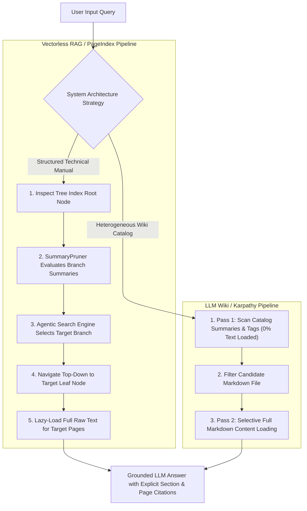

# 🚀 Advanced Vectorless RAG Engine (`adv-vectorless-rag`)

Welcome to the implementation guide for **`adv-vectorless-rag`** under [`week03/learning/day06/code/adv-vectorless-rag/`](file:///home/aminul/development/gen-ai-cohort/week03/learning/day06/code/adv-vectorless-rag/).

This codebase provides an advanced JavaScript / Node.js implementation of:
1. **PageIndex Model (Vectorless RAG)** — Hierarchical Document Tree Indexing & AlphaGo-inspired Agentic Tree Traversal with optional Google Gemini API reasoning.
2. **LLM Wiki Model (Andrej Karpathy Architecture)** — Human-readable Markdown knowledge vault cataloging & Two-Pass Retrieval (summary scan + selective lazy loading).
3. **Vector RAG vs. Vectorless RAG Benchmark** — Side-by-side demonstration proving how fixed-size token chunking destroys document hierarchy compared to tree-based reasoning retrieval.

---

## 📌 Architectural Overview & Master Flowchart



---

## 📁 Directory Structure & Component Mapping

```text
week03/learning/day06/code/adv-vectorless-rag/
├── package.json               # Node.js project manifest & execution scripts
├── .env.example               # Environment variables blueprint
├── implementation.md          # Exhaustive code walkthrough & developer guide
├── CODE_EXPLANATION.md        # Master beginner-friendly code explanation file
└── src/
    ├── CODE_EXPLANATION.md    # Source directory overview & execution flow
    ├── config.js              # Centralized environment variable loader
    ├── index.js               # Programmatic entry point
    ├── cli.js                 # Interactive multi-mode CLI driver
    ├── tree/
    │   ├── CODE_EXPLANATION.md # Tree component code explanation
    │   ├── TreeNode.js        # Core tree node data structure
    │   ├── HierarchicalTreeIndex.js # Tree index manager & lineage path tracer
    │   └── TreeBuilder.js     # Factory builder for document hierarchy tree
    ├── search/
    │   ├── CODE_EXPLANATION.md # Search component code explanation
    │   ├── geminiClient.js    # Google Gemini API SDK dispatcher with fallbacks
    │   ├── SummaryPruner.js   # Branch summary evaluator & pruner
    │   └── AgenticTreeSearchEngine.js # Top-down decision tree search engine
    ├── wiki/
    │   ├── CODE_EXPLANATION.md # Wiki component code explanation
    │   ├── WikiVault.js       # Markdown knowledge vault catalog
    │   ├── LLMLibrarian.js    # Knowledge vault populator factory
    │   └── TwoPassRetriever.js # Karpathy 2-pass scanner (Pass 1 metadata, Pass 2 content)
    └── comparison/
        ├── CODE_EXPLANATION.md # Benchmark component code explanation
        └── VectorVsVectorlessBenchmark.js # Side-by-side Vector vs Vectorless RAG benchmark
```

---

## ⚡ Execution Commands

Run commands from directory [`week03/learning/day06/code/adv-vectorless-rag/`](file:///home/aminul/development/gen-ai-cohort/week03/learning/day06/code/adv-vectorless-rag/):

```bash
# Run all demonstrations (Tree Search + LLM Wiki + Benchmark)
npm start

# Run interactive CLI driver
npm run cli

# Run ONLY Vectorless RAG Tree Search (PageIndex Model)
npm run tree-search

# Run ONLY LLM Wiki Two-Pass Retrieval (Karpathy Model)
npm run llm-wiki

# Run Vector RAG vs Vectorless RAG Comparison Benchmark
npm run benchmark
```
